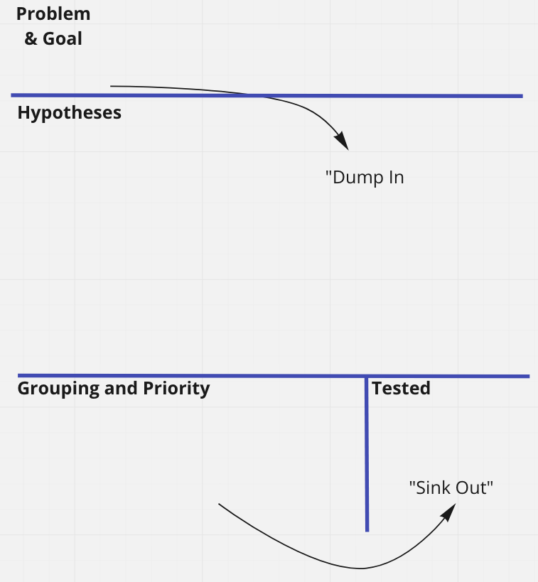

## Introduction
One of the most commonly needed and important skills in the world of Kubernetes
is how does one approach debugging of issues on the Platform.  While much easier 
said than done in practice, the first step is to know what is the exact problem 
before solutioning and not to overthink it.  However, how does one efficiently 
and effectively do this? This article aims to enable a reader with skills to help 
with debugging Kubernetes platform issues through finding the source problems 
first effectively.  It is assumed that the reader is comfortable with Linux, 
is familiar with running `kubectl` commands and understands the deployment 
lifecycle of applications on Kubernetes. 

We'll kick off with [Section 1](#section-1---the-general-kubernetes-debugging-workflow-and-techniques) 
on a general workflow and techniques of Kubernetes debugging. This will build into [Section 2](#section-2---a-heuristic-approach) 
where the focus is on using a heuristic approach, where given some limited initial 
set of information of the problem, we can hypothesize where a problem lies based 
on a set of class of issues that appear most in practice and what we could do to 
validate whether an issue lies within these classes. Finally, in [Section 3](#section-3---refining-heuristics-with-context-test-debugging) 
we refine what we learnt from Section 2, by taking a step back to look through the lens 
of the problem scope of the system and assign this, the heuristic classes and prioritize 
where to run validating tests. We'll also introduce a brainstorming approach for
group based problem solving.

## Section 1 - The general Kubernetes debugging workflow and techniques
The general workflow is to first dive into the events, learn about the pod state and get into the logs. 
If these steps do not provide sufficient information, further steps would be needed. For example, 
checking the configuration and network connectivity of within a container.

1. Always run:
    ```sh
    kubectl get events -n <namespace> --sort-by .lastTimestamp [-w]
    ```
    
    This will provide a list of events that have occurred in a namespace ordered 
with the most recent event at the bottom of the list. Adding the optional `-w` flag will allow the output to be watched. 

2. Run:
    ```sh
      kubectl describe pod/<pod-name> -n <namespace>
    ```
    to get more details of a pod. 

3. Run:
    ```sh
      kubectl logs <pod-name> -n <namespace> [name-of-container, if multiple] [-f]
    ```

    This will get the logs from a pod. Adding the optional `-f` flag enables 
tailing of the logs.  Note that logs only works with the pod API but it is possible to do logs from a 
deployment/daemonset perspective, which will simply pick a pod to get logs from. For example, 

    ```sh
      kubectl logs ds/<daemonset-name> -n <namespace> [name-of-container, if multiple] [-f]
    ```

    A useful commandline tool is [stern](https://github.com/wercker/stern), 
which allows tailing of logs from multiple pods and containers. Stern can 
also apply regular expressions to filter specific logs. However, for most debugging
purposes, do try to limit the logging scope to avoid cognitive overload
that may distract from finding the real problem.

    [kail](https://github.com/boz/kail) is another, similar, alternative.

    If it is not possible to access the cluster, check the log aggregation platform
such as Splunk, ELK and so forth, if this is setup. Within the log platforms,
try searching by the node name/ip and/or components such as kubelet and 
kube-proxy.  If the cluster is not accessible, that is, kubectl commands do not 
work, the cluster nodes will need to be accessed in order to find more details.  Details 
on how to do this are discussed in ["Accessing and debugging nodes"](#accessing-and-debugging-nodes).

4. If the cluster is still accessible and existing logs pinpoints to another system issue,
it is possible to access the pod container to perform tests such as validating the 
state of a running process, it's configuration or to check a container's network 
connectivity.  We'll visit this in detail in ["Accessing containers"](#accessing-containers).

Keep in mind the above is a good general workflow to start debugging. The 
documentation on [Kubernetes Monitoring, Logging and Debugging](https://kubernetes.io/docs/tasks/debug-application-cluster/) 
provides a good outline of other debugging approaches and techniques that could be utilized. 

### Accessing containers

The goal here is to access the container that an application is running on and 
view log files and/or perform further debugging commands, such as validating 
running configuration.  Listed below are some possible techniques to get on containers.  

#### __Using `kubectl exec`__
Accessing a container can be achieved through the `kubectl exec` command.
However, be aware that this may also not be permitted on a cluster due to RBAC permissions. 
To exec into a container, run:

```sh
kubectl exec -it -n <namespace> <pod-name> [-c <container-name>] "--" sh -c "clear; (bash || ash || sh)"
```

Note: The above exec command was taken from [Lens](https://k8slens.dev/).
Using tools like [Lens](https://k8slens.dev/), can make this a lot easier via 
a GUI. 

Do note that sometimes there is no accessible shell.  One other method is to start 
a pod with a container having all the network debugging tools. 
The [netshoot](https://github.com/nicolaka/netshoot) container image has a 
number of tools that will make it easy to debug networking issues, we can 
instantiate a netshoot container and exec into it to perform tests as follows,

```sh
kubectl run netshoot --image=nicolaka/netshoot && \
kubectl exec -it -n netshoot "--" sh -c "clear; (bash || ash || sh)"
```

However, note that this is a new pod and itself would not have access to a target
pod's filesystem.  This approach is useful for debugging aspects such as
network connectivity. We'll dive deeper into these aspects in [Section 2](#section-2---a-heuristic-approach).

#### __Using ephemeral debug containers__

As realized in the previous section, using `kubectl exec` may be insufficient 
due to the target container having no shell or that the container has already 
crashed and is inaccessible.  We could overcome this using a different image 
deployed via `kubectl run`, however, this would be a different pod that is not sharing the 
process namespace of the pod we wish to debug, meaning we cannot access the 
process details or its filesystem. This limitation can be alleviated using debug ephemeral containers.

Introduced as an alpha in Kubernetes 1.16 and currently as a [beta in Kubernetes 1.23](https://kubernetes.io/docs/reference/generated/kubernetes-api/v1.23/#ephemeralcontainer-v1-core), ephemeral containers are helpful for troubleshooting issues. 
By default, the `EphemeralContainer` feature-gate [is enabled](https://kubernetes.io/docs/reference/command-line-tools-reference/feature-gates/) as a beta in Kubernetes 1.23. Otherwise, the feature-gate will need to be enabled first before it can be used.
The documentation for [debug containers](https://kubernetes.io/docs/tasks/debug-application-cluster/debug-running-pod/#ephemeral-container),
demonstrate with examples of how to use `debug containers` but for brevity and completeness sake, this is included below together
with content aligning to this article.

Ephemeral containers are similar to regular containers, except that they are 
limited in functionality. For example, having no restart capability, no ports, 
no scheduling guarantees and no startup/liveness probes. A list of its limitations 
is documented [here](https://kubernetes.io/docs/concepts/workloads/pods/ephemeral-containers/#what-is-an-ephemeral-container). 

Compared to what was previously done with `netshoot` and `kubectl exec`, 
the key feature here is that an ephemeral container can be attached to pod that we are debugging, the target pod, by [sharing
it's process namespace](https://kubernetes.io/docs/tasks/configure-pod-container/share-process-namespace/). This means 
that it is possible to see a target debug pod container's processes and it's filesystem. There are a number of variations of the `kubectl debug` command and its usage varies depending on what is required for debugging. One additional note to consider is that these debug containers will remain running after exit and needs to be manually deleted, for example, `kubectl delete pod <name-of-debug-pod>`.

##### __The target container is running but does not have a shell__

A no shell container means that it is not possible `kubectl exec` into a container using a shell command, such as `sh` and `bash`.
For this scenario, the follow command can be run:

```sh
kubectl debug <name-of-existing-pod> -it --image=nicolaka/netshoot --target=<name-of-container-in-existing-pod>
```

This will utilize the `netshoot` image, with all the network debugging utilities 
as a separate ephemeral container running in the existing pod named `<name-of-existing-pod>` 
and opens an interactive command prompt through using `-it`. `--target` is a means of 
targeting the existing process namespace of the other existing running container.  This
is usually the same name as the pod itself. 

##### __The target container has crashed or completed and/or does not have a shell__

This scenario introduces the problem where a container has crashed or completed. This presents a 
problem with debugging because it is not possible to `kubectl exec`, since the container no longer
exists. This can be addressed by making a copy of that target pod attached with an ephemeral container 
to inspect its process and filesystem. The following command can be used for this:

```sh
kubectl debug <name-of-existing-pod> -it --image=nicolaka/netshoot --share-processes --copy-to==<new-name-of-existing-pod>
```

This will create a debug container using `netshoot`, which shares the process namespace 
in a new pod, named `<new-name-of-existing-pod>` as a copy of  `<name-of-existing-pod>`.

##### __The target container has crashed or completed and the container start command needs to be changed__

This scenario differs from the previous with having the startup command changed 
and there is no additional debug ephemeral container but instead a copy of the 
target pod.  This is particular useful for situations where a target container has
crashed or ends immediately on startup and the goal is to interactively 
tryout the process or review it's filesystem. In order to do this, the startup command 
would require a change such that it does not end the container or that the command 
helps provide more information, e.g. changing the debug verbosity parameter to an 
application, issue some long sleep command or run as a shell.  We can achieve 
this with the following command:

```sh
kubectl debug <name-of-existing-pod> -it --copy-to=<new-name-of-existing-pod> --container=<name-of-container-in-pod>  -- sh
```

Take note of the command specifier `-- sh`. The example here changes the start 
command to call the shell on the copied container. This may need to be replaced 
with an appropriate start command that would enable debugging of the pod.

##### __The target container needs to utilize a different container image__

This scenario creates a copy of a target container having a different container image. This is 
useful in situations where a production container may not contain all the utilities that allow 
debugging or does not have debug level outputs. This again makes a copy of the target pod 
and is run with the follow command:

```sh
kubectl debug <name-of-existing-pod> --copy-to=<new-name-of-existing-pod> --set-image=*=nicolaka/netshoot
```

The one difference here is the parameter `--set-image=*=nicolaka/netshoot`, which works in the same fashion as `kubectl set image`, where it sets all existing container images, specified by `*`, with the new image `nicolaka/netshoot`.

### Accessing and debugging nodes

The goal of debugging on the nodes is to ascertain why a pod running on the 
node is failing or why a node is failing itself.  Two areas that can be checked 
are the log files of those pods and process status of Kubernetes static pods and services. 
Alternatively, one could perform debugging commands, such as `netcat` and `curl`
to debug network connectivity issues, if these tools exists within the host.

To determine where the log files are located, it is recommended to check the 
documentation of components to see which log files contain the logs of interests.
  For most distributions of Kubernetes, log files can be found within `/var/logs/`.
For the containerd container runtime, `/var/logs/pods` holds pod logs per 
namespace and container and `/var/logs/containers` is a symlink of the container 
logs in `/var/logs/pods`.

Key Kubernetes components, such as Kubelet and containerd (for containerd container runtime), 
use `systemd` in most distributions to initialize Kubernetes components. 
Inspection of journals of these respective components to retrieve their logs can be
done by,

   ```sh
   journalctl -u <name-of-component>
   ```

Usually, `<name-of-component>` is just `kubelet`. If that doesn't work, one 
can find the `systemd` unit for kubelet by `grep`ing for `kubelet` inside of 
`/etc/systemd/system`.

If the Kubernetes components were not started by `systemd`, use `lsof` against 
the `kubelet` process to see where the logs might be getting written to:

   ```sh
   pgrep -i kubelet | xargs lsof
   ```

In some Kubernetes distributions, the Kubernetes components run as Docker
containers. If they are not running in `systemd`, use `docker ps` or `crictl ps`
to check if this is the case.

Some Kubernetes distributions also configure the Kubernetes components to send
their logs to `syslog`, which is usually written to `/var/log/messages`.

### Different ways to get on a node

Described previously was where to find information on a node needed in order to 
debug an issue on the node.  For readers unfamiliar with how to access nodes, 
this sub-section will describe three methods of how to get on a node.

#### __Using SSH__

Generally, SSH access is, in best practice, performed via SSH keys.
Access to nodes via SSH keys is performed via the command, 

```sh
ssh -i <certificate.pem> <username>@<ip/fqdn of node>
```

If only password access is setup, one can SSH with command

```sh
ssh <username>@<ip/fqdn of node>` 
```

and enter the password thereafter, when prompted. 

#### __Accessing the nodes via `kubectl exec`__

If the RBAC permits and privileged container permissions, it is possible to mount 
a node's log as a hostpath into a pod and inspect those logs after 
`kubectl exec`'ing into a container.  The following yaml will create a 
debugging pod to help with this:

```sh
kubectl apply -f - <<-EOF
apiVersion: v1
kind: Deployment
metadata:
  name: debugging
  labels:
    app: debugging
spec:
  template:
    metadata:
      labels:
        app: debugging
    spec:
      containers:
      - image: nicolaka/netshoot
        volumeMounts:
        - mountPath: /node-logs
          name: node-logs
      volumes:
      - name: node-logs
        hostPath:
          directory: /var/logs
          type: Directory
EOF
```

#### __Debugging nodes using ephemeral debug containers__

In addition to the other uses cases of debug containers, it is also 
possible to create an ephemeral privileged container on a target node of interest 
with it's filesystem mounted at `/host`. Using ephemeral debug containers opens 
access to the node's host filesystem, it's network and process namespace. This is 
run with an interactive shell, with the following command:

```sh
kubectl debug node/<name-of-node> -it --image=nicolaka/netshoot
```

## Section 2 - A heuristic approach

Section 1 visited the general workflow approach and techniques to debugging Kubernetes issues.
Simpler issues, such as obvious mistype errors causing crash loopback errors, are 
easily picked up and resolved with the workflow steps. However, it is more common 
that the workflow steps lead to more possibilities of where issues lie due to the nature
of numerous distributed related components. So the question is, how does one better debug issues 
on Kubernetes? If an issue has some error message or code, the first easiest starting 
point is to search on the internet or reach out to the authors through some git 
repository, as it is likely this problem has already been encountered and resolved. 
However, if no resolution could be found, it is generally accepted from field 
experience that the top problems encountered can be usually classed as the usual suspects
of DNS, Routing/Proxy, Firewalls, Certificates, Configuration and Bugs. With this knowledge,
one can infer where to look first based on the symptoms and information gleaned from
the previous section. We'll go into detail for each of these classes and describe 
popular tools that will help with debugging tests.

1. **DNS** - DNS resolves hostname to IP addresses. Usual issues are 
when an application is unable to reach the DNS server or the DNS server 
doesn’t contain the record. The command `nc -vz <ip-of-dns> 53` can be used to check 
connectivity to a DNS server. Use of `ping <fqdn>` can also be used to check if a
hostname can be resolved, which is usually indicated on the first line of the ping output. 
Alternatively, use the `dig`, `nslookup` or `host` commands to test 
access to and if the DNS server can resolve a hostname. Do be aware of DNS caching 
of results that maybe stale. While it is not possible to change the caching 
behaviour of a DNS, this could be alleviated with `dig example.com +trace`, which 
forces a trace output of the name resolution all the way through to an authoritative DNS. 

    While the above serves as a general recommendation for validating DNS for 
where most common issues lie, another aspect to consider is name resolution of 
services and pods within a Kubernetes cluster via CoreDNS. First check if these 
pods are running on a cluster and if not follow through with the steps Section 1 
to see what else is preventing the CoreDNS pods from starting. Once these are working, 
access a container to test out the in-cluster DNS resolution. See ["Accessing containers"](#accessing-containers) 
for more details on how to get on to a container.  For completeness, this [Kubernetes document](https://kubernetes.io/docs/tasks/administer-cluster/dns-debugging-resolution/) provides tips on how to debug in-cluster DNS resolution.  

2. **Routing & Proxy** - These issues arise where network packets do not route to where 
they are expected. To see if a server can be accessed, use 
netcat, `nc -vz <ip/fqdn> <port>`. Or, if `nc` is not available, 
`curl -kL telnet://<ip/fqdn>:<port> -vvv`. This would do ultimately a Layer 4 
check to test for connectivity. Another aspect to consider is if there is a 
proxy server that must accessed in order to reach a destination server. 
It would be good to check for `HTTP_PROXY` and `HTTPS_PROXY` environment variables
and see if these are set or need to be set. In some instances,
complex configuration will require the `NO_PROXY` environment variable for hosts
that should not go through any proxy. The existence of these
environment variables in Linux can be checked via the command `env | grep -i proxy`. 

    So far the above has only addressed non-accessible routes. There is also the 
issue of incorrectly configured routes, for example, traffic is routed from Asia 
to USA and back when it might only need to remain in Asia. Symptoms 
of this problem usually manifests itself as unusually long delays for simple operations, 
such as accessing the UI of an application.  To test for this issue, load test 
tools could be used to ascertain access time or simpler checks using `curl`'s [writeout timing variables](https://everything.curl.dev/usingcurl/verbose/writeout#available-write-out-variables), which will output useful information 
such as total time and hostname resolution time. An example usage of this 
is: `curl -s -w 'Total time: %{time_total}s\n' https://tanzu.vmware.com`.

    One can print the system's route table if there is suspicion of a route
misconfiguration. There are several ways to do this depending on the operating
system that you are troubleshooting from:

    - **MacOS**: `netstat -rn` (`netstat -rnf inet` to only see IPv4 routes)
    - **Linux**: `route -n`
    - **Windows**: `route print`

    You can also test routing by using `traceroute [IP_ADDRESS]` (`tracert` on
Windows) to see which gateway serves the initial hop. This uses ICMP ECHO by
default; consult the `man` page for your version of `traceroute` to find options
that enable TCP- or UDP-based traceroute.


3. **Firewall** - Generally there are firewall rules preventing access to resources. 
The same debugging tools as per routing could be used. In addition, to check 
Layer 7, one would just do a `curl -kL <fqdn/ip>` command. Note that `-k` is just to 
skip SSL validation for cases where HTTPS is not used or is using untrusted/self-signed 
certificates. Be aware that it is possible Layer 7 HTTP firewall rules are in place 
and sometimes Layer 4 TCP/IP & UDP is not blocked when running a netcat check 
command.  This is may be an indicator that there is a firewall in place. `tcpdump` 
is tool that could be used to inspect packets on the host machine, which would 
involve inspecting TCP packets for an `RST` or `Reject` on `ACK`.  A reference 
for `tcpdump` can be found [here](https://gist.github.com/jforge/27962c52223ea9b8003b22b8189d93fb).

4. **Certificates** - A very common issue is the missing set of Root CA 
(Certificate Authority) and/or the intermediate certificates. The key requirement 
here is a formation of a valid trust chain from a server/leaf certificate, to 
potentially though multiple intermediate certificates and finally a Root/CA 
certificate. This [Venafi article](https://www.venafi.com/blog/what-difference-between-root-certificates-and-intermediate-certificates) 
covers most of the basics of what is described above in detail. 

    While implementation specific, CA root certificates should be installed together 
with the intermediate certificate in the trust store of a node in order for a 
full trust to occur.  Do note that some components require a specific order, whether to put
an intermediate certificate first followed by the root and vice-versa.  Check the component 
documentation for these details.  In some other systems, having only the intermediate 
certificate in the trust store is sufficient, since this is implying that a 
server already trusts the root CA.  Refer to documentation on how to install
the CAs to be trusted the target hosts

    There are tools to assist with determining whether there is a trust chain, 
for example, using openssl, `openssl s_client -connect <fqdn/ip>:<port>` will
retrieve all the certificates and display them. There is an option in `openssl` to check
certificate trust as well but this works on a single certificate in a file.  Alternative 
tools, such as [dawu415’s cert tool](https://github.com/dawu415/PCFToolkit/tree/master/cert), 
will retrieve certificates from hosts and make it easier to check the trust chain from a set of
certificates in a file that are on hand or from a server.  A secondary issue with 
certificates is the line break of PEM encoded certificates. There should only 
be `\n` (linefeed (LF) ) and not `\r\n` (carriage return + linefeed (CRLF)), as 
is usually inserted when working on Windows machines. Editors like Visual Studio 
Code could help convert CRLF to LF.  In some situations, some applications require 
a single line PEM and escaped line breaks, that is, the 'invisible' LF character 
is converted to a character pair `\n`.  This can be achieved with this command 
in Linux: `cat certificates.pem | awk -v ORS='\\n' '1' | tr -d '\r`

    After installing a CA certificate, certain applications usually require a 
restart in order to recognize the new CA certificates. For example, the docker
CLI would throw the error `x509: certificate signed by unknown authority`, when
connecting to an internal container registry that that uses an internally signed
CA that is untrusted on the user's machine. This internally signed CA will need 
to be installed on the host that is running the docker daemon.  After installing 
the CA, the docker daemon service needs to be restarted in order
to pick up the new CA certificate. Restarting the docker daemon is usually performed
with the command `sudo systemctl restart docker`, or if on MacOS or Windows, restart
the service that is available on the graphical user interface. 

    Some proxies will return zero bytes for SSL connections being made to IP
addresses/DNS records that are not in its whitelist. This usually manifests as
an SSL_SYSCALL_ERROR in the browser or an SSL handshake failure in `cURL`. Use
`openssl s_client` as documented above to debug.

5. **Configuration Error** - Fat fingered configuration is a very common issue. 
Accidental addition of characters to a config, incorrect indentation in YAML, 
mixed spaces and tab, or automatic carriage return or a newline is introduced 
from some command, like `echo 'xxx' | base64`, can cause 
heartache. For the latter situation, including a `-n` flag, that is, 
`echo -n 'xxx' | base64`, will remove the extra newline character appended after 
the `xxx` string. 

    Nonetheless, the best way is to double check the configuration.  Using an editor 
or raw character output to check the ASCII characters, if need be may help. Editors 
such as vim and Visual Studio Code can assist with viewing these characters. Alternatively, 
for small strings, the Linux command `echo 'xxx' | od -t x1`, can assist in displaying the hex
output of the echoed string. One could then use an [ASCII](https://www.asciitable.com/) 
table to assist with translating the character, which in this situation are the 
numbers 10 decimal (0x0A hex) and 13 decimal (0x0D hex) for the LF and CR 
characters, respectively.  

    If the above fails, the next best approach is to revert back to the last known
working configuration or known defaults and incrementally test configuration changes 
going forward.

6. **Bug** - There is a possibility that a problem could be a software bug and 
support will be needed.  However, be cognizant of bugs but don’t conclude immediately 
without checking release notes, having discussions with authors/teams and have 
concrete workings with logs on hand.  The other class of problems described above 
are more likely to occur than a bug. 

## Section 3 - Refining heuristics with context test debugging

With all the above in mind, the most important aspect is the context: Where 
does one look in a large system? It is possible to infer and look at all possible 
areas described previously.  However, sustainable debugging of systems is best served with a good
understanding of how a system works followed by debugging practice to get proficient 
and efficient.  Understanding how a system works means to understand how  
the 'engines' run, what are the components involved? True understanding is not 
simply being able to describe it but to be able to draw it - `can you draw out 
the system and data flows?`.  Even if the diagram is simple, draw it - as this 
reduces cognitive load while thinking of the problem at hand for large complex problems.
Some typical diagramming tools can assist, which include, [Miro](https://miro.com), 
[LucidChart](https://www.lucidchart.com) and [draw.io](https://app.diagrams.net).  

   One way is to start is top-down, understand the bigger picture and then dive into 
the individual components. On much larger systems, focus on 
areas of the architecture that is relevant to scope of the problem. It is ok 
to not understand everything at once, but importantly, is the mindset of 
determination and curiosity of wanting to know it with an open mind.  Once a picture
of the system is available, the focus would be on identifying what parts of the system
are in context to the problem, for example, components that are closely related/connected to
where the issue is first seen. Once the context of the system is identified, 
we can start hypothesizing issues and prioritizing what issues and tests to perform.
Note that it is not necessary to hypothesize within the context of the system but
it does help limit the amount of hypotheses and test that need to be performed to
areas that are likely to be the source of an issue. 


From the example diagram above, it can be seen there are number of places where 
an issue may occur. Having a diagram with its data flows on hand, allows hypotheses 
and prioritization of where issues may lie and perform tests at each point to see 
if the hypothesis holds. It is here that the classes of problems we described 
previously in Section 2, can be assigned as a hypotheses.  Having this picture 
on hand, we can prioritize where we wish to perform our tests, usually starting 
with components that are closely related to where our issue first originated. 

### Group based brainstorming - DISO - "Dump In, Sink Out"

In the content above we looked at forming contexts of a system and hypothesizing 
where issues maybe originating from. Resolution of most problems, a single person
or a pair is sufficient. However, for much larger scale, complex and unknown 
systems - a team of people are best utilized for identifying and solving complex problems. 
This is because experience and different knowledge/perspectives to a problem
can be gathered and used to form additional hypotheses to tests. However, how does 
one effectively conduct this?  The key to this is using brainstorming techniques, 
such as those discussed [here](https://www.mindtools.com/brainstm.html).  This section
introduces the "Dump In, Sink Out" approach, that was utilized and devised
by S. Wittenkamp and D. Wu for the context of a problem in a very large complex 
software system with a team of developers. This idea is furthered in this article 
by incorporating the concept of the context system diagram.

The basic requirements for this to work would be that **1)** all participants have
a base knowledge to the problem, for example, knows Kubernetes; and **2)** they should 
have an understanding or is an expert of the system or any other interacting 
internal or external components; and **3)** they have access to the system, preferably 
in pairs. Materials should include sticky notes, painter tape and markers. The 
assumption here is that the facilitator is yourself but you may assign this to 
someone else to conduct. 

The steps to conducting DISO are as follows:

1) **Setup**: Before starting and the having the session, a whiteboard should be 
setup as follows:




2) **Introduction**: All participants are introduced, in a short statement to 
the scope of the system and the problem encountered, alongside with any 
additional debug information that has been obtained. The goal of the exercise 
should be defined. Once introduced, show a drawing of the system and explain 
what it represents. 


3) **Hypothesize**: This is the dump in phase. All participants should be 
provided with sticky notes and markers. Participants asked to write down each
idea on a sticky note and place these on the diagram of the system, in the `Hypotheses` 
area on where/what the problem might be. This should be done alone to avoid biases
and in a limited time, for example, 10 mins.  All participants should be encouraged to 
write down any ideas that they might come up with. There are no 'bad ideas' and 
there should be no concern with duplicating ideas independent of other participants.


4) **Grouping**: Have a facilitator go through each sticky note
and asked the participant who wrote it to explain the idea and the reason. Move
the sticky note into the `Grouping & Priority` area.  Ideas that overlap 
should be grouped together. 


5) **Prioritization**: A facilitator should now look at prioritizing the stick 
notes (or groups of sticky notes), as to which ones are closer to the problem. 
Order these notes from most likely, at the top, to least likely, at the bottom.


6) **Testing**: This is the sink out phase.  Each participant, preferably in pairs, 
should each take the prioritize groups of sticky notes, from the top
of the list and test each hypothesis and move it to the `Tested` area and 
the result. Be sure to document testing methodology. 


Eventually, the above tests should converge to an answer to where or what the 
cause of the problem is.  If there is still no answer, consider what other 
components or system is being interacted with or if there is a bug and seek 
support, for example, IaaS providers and support is required from them if they 
are not part of the current group of participants. 

## Conclusion

This article has presented three important aspects to assist with debugging. 
The first key element is starting with a fresh open mind and not overthinking about 
the problem at hand.  While the above may seem complex at first, with practice, 
this methodical approach will help form good consistent habits and that will help build 
foundational aspect to debugging on Kubernetes, with the key factor of
efficiently and effectively finding and understanding a problem first before solutioning. 

We started off with a general debugging workflow and techniques, which gives us 
the ability to do the primary and basic debugging on Kubernetes. In the next 
section, we visited a heuristic classes approach gleaned from field experience 
and what tools and tests are available to use to test whether an issue falls 
into a class. In the final section, we combine heuristic classes and look at the 
problem from the perspective of a big picture, where we assign these classes to 
our big picture to help us hypothesis and prioritize where issues may lie.  Finally, 
we introduced the "Dump In, Sink Out" method for a group based brainstorming 
problem solver.


