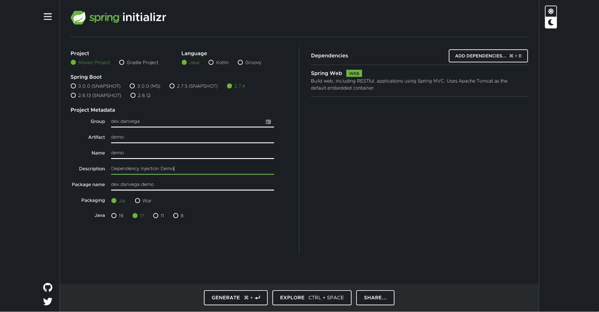

In this guide, you will learn what dependency injection (DI) is and why it is a fundamental component of the Spring Framework. It is important to understand some of the basic concepts in Spring so we will cover those first before diving into writing code. 


## What is DI?

Dependency injection is the glue that binds your application components together. Today developers expect to write concise, independent pieces of code for things such as microservices. Dependency Injection-based applications gain readability and concision by reducing boilerplate code (e.g., manually configuring and gluing components together) while managing resources with a conventional and predictable execution strategy. Indeed, there is more to DI than the name implies. To clarify, let's review some specific areas in that DI helps the developer: 

Code decoupling –  Having discreet or non-overlapping packages in the overall function of an application simplifies processes. For example, if component A doesn't need to know _how_ component B works,it shouldn't see inside component B, but rather, just how to interface with it.

Testability – Decoupled code assists with testing efforts by reducing the surface area needed to test a component in isolation. Also, mocking dependencies (with a mocking library) helps reduce noise in test cases.

Maintainability – Adherence to dependency injection means each component will be configured in one or more overarching configuration classes. Therefore, the application resources are visible to the developer as code.  As such, a downstream developer will have better insights into the operation of the application and make better-informed changes.

**Inversion of control**

Spring’s Inversion of Control (IoC) container facilitates dependency injection throughout your application. With IoC, you may achieve a low level of coupling because each managed component, also known as Spring beans, can be specified in terms of IoC idioms, such as property collaborators and constructors. The bean lifecycle (construction to destruction) is managed within this container and provides the flexibility to name and create groupings of beans that are organized in self-contained configuration classes. 

Let’s make a basic interaction with the IoC by defining a configuration class containing a single bean:

```java
@Configuration
public class AppConfig {
    @Bean
    DataSource myDataSource() { return new DataSource(); }
}

```

By marking the class `@Configuration,` we are telling the IoC to scan this class for additional bean creation opportunities. This configuration class tells Spring IoC that a Datasource bean named "myDataSource" is to be created. By default, Spring will attempt to name the bean by the method that created it.

**A useful dependency injection approach**

In most scenarios, we want to assemble a component that depends on other components. Spring already goes through the correct processes to collect all dependencies and determine instantiating order and which components they belong to. However, it is up to the developer to inform Spring where the dependencies get injected. There are a number of approaches to this, but we will look into the most common (and recommended) of them—constructor injection.

In the constructor injection technique, an object’s required components become arguments on its constructor. Spring will recognize public constructors as valid sites of injection. This is also the preferred method since we are typically sure once an object gets created, its composition doesn't change. This allows for immutability, however, it doesn't follow the JavaBeans style, which states an empty constructor.

```java
public class ComponentA{
    ComponentB b;
    void ComponentA(ComponentB b) {
        this.b = b;
     }
}
```

The above represents construction injection. Setters are not forbidden but add boilerplate and lend to a mutable design, which may be discouraged. In the next section, we will explore some practical examples for developing apps and their tests using Spring’s Dependency Injection.


## Dependency injection guide

The best way to learn about a new concept is to build something with it. In this section, you will learn about dependency injection by building out a simple Spring Boot REST API. If building a REST API is new to you, don’t worry about it. You will be able to follow along with our step-by-step tutorial and focus on the dependency injection bits. 


### Before you begin

Things you need to know before getting started: 


* The Spring Boot application you will follow along with today uses Java 17 (If you don’t have Java Development Kit 17 installed, please install it)
* Basic understanding of Java
* Basic understanding of Spring Boot

The final code for this guide can be located on [Github](https://github.com/danvega/spring-dependency-injection).


### Getting started

The application you will build today is modeled around the idea of a blog. A blog is a place where you can write and publish new articles for others to read. You will be creating the backend (REST API) for the application which could be consumed by a frontend (client) later on. To create your application, head over to [start.spring.io](start.spring.io), fill in the metadata about the project, and select the Spring Web dependency. 




When you’re done, click on the generate button at the bottom of the screen, which will download a zipped file with the starting code for your project. You can open that project in whatever text editor or IDE you’re comfortable with. In this article, we are using [IntelliJ IDEA](https://www.jetbrains.com/idea/). 


### Create the REST API

You are going to build out a simple API that allows anyone to get a list of all of the articles in the system, or acquire the details for a single article by its ID. Before you create the API, you will need a class to represent a single article in the application. You could start by creating a new class, but you are using Java 17, so you can take advantage of [Record Class](https://docs.oracle.com/en/java/javase/17/language/records.html). 

Create a new record named `Article` inside of a package named `model`. An article will have properties such as an ID, title, content of the article, and the date/time it was published on.


```java
public record Article(
       Integer id,
       String title,
       String content,
       LocalDateTime publishedOn
) {

}
```


With the model in place, you need a location to store all of the articles that you write for your blog. In the real world, you would most likely use a database to house your articles, but for simplicity's sake, you will use an in-memory data structure in this guide. 

Create a new class called `ArticleRepository` in a repository package. The term repository comes from the repository pattern, which you will see as you begin to build applications in Spring that take advantage of Spring Data. There is a great definition of a repository from [Martin Fowler](https://martinfowler.com/eaaCatalog/repository.html), that succinctly states that it “Mediates between the domain and data mapping layers using a collection-like interface for accessing domain objects.”

In your repository, you will create a list that holds a collection of articles. You will provide two methods: one for returning all of the articles in the collection, and another for returning a single article by the article ID. 


```java
public class ArticleRepository {
   private List<Article> articles;
   
   public List<Article> findAll() {
       return articles;
   }

   public Article findById(Integer id) {
       return articles.stream().filter(a -> a.id().equals(id)).findFirst().orElse(null);
   }
}
```


You need a way to initialize the list of articles so that you have some sample data to work with. The constructor of a Java class is a great place to start. Create three new articles and add them to the collection of articles. 


```java
public ArticleRepository() {
   articles = List.of(
           new Article(1, "Hello, World!", "Welcome to my new Blog!", LocalDateTime.now()),
           new Article(2, "Spring Initializr", "Get started with Spring Boot at start.spring.io", LocalDateTime.now()),
           new Article(3, "Spring Dependency Injection", "An introduction to Dependency Injection in Spring", LocalDateTime.now())
   );
}
```


With the domain model and repository in place, it's time to create the REST Controller. Create a new class named `ArticleController` in a package named controller. The controller suffix is not required but is a commonly used convention for creating controllers. 

If you’re new to building REST APIs in Spring Boot, the `@RestController` annotation marks this class as one that will accept requests and return responses. The `@RequestMapping` annotation allows you to map web requests to methods. In the following example, you will map the article controller to the path `/api/articles`. 


```java
@RestController
@RequestMapping("/api/articles")
public class ArticleController {

}
```

The controller needs a way to retrieve all of the articles in the application. You should already have this in place by delegating that responsibility to the `ArticleController`. This means that for your controller to work you are dependent on the `ArticleRepository`. Now the question becomes: how can you get an instance of the class that you already created? 

The basic constructs of the Java language give us a way to do this by creating a new instance of the `ArticleRepository`. But now, where should you create this instance? You are going to need this instance throughout your controller so it might make sense to create an instance variable and initialize it in the constructor.


```java
@RestController
@RequestMapping("/api/articles")
public class ArticleController {

   private final ArticleRepository articles;

   public ArticleController(ArticleRepository articles) {
       this.articles = new ArticleRepository();
   }

}
```


Now that you have an instance of the `ArticleRepository`, you can use the methods that you created in it to return a list of articles, or just a single article.


```java
@RestController
@RequestMapping("/api/articles")
public class ArticleController {

   private final ArticleRepository articles;

   public ArticleController(ArticleRepository articles) {
       this.articles = new ArticleRepository();
   }

@GetMapping
public List<Article> findAll() {
   return articles;
}

@GetMapping("/{id}")
public Article findById(@PathVariable Integer id) {
   return articles.stream().filter(a -> a.id().equals(id)).findFirst().orElse(null);
}

}
```


That is the basic structure of the blogging application you will work on within this guide. If you run the application and visit [http://localhost:8080/api/articles](http://localhost:8080/api/articles), you should see the following JSON returned in the response. 


```json
[
  {
    "id": 1,
    "title": "Hello, World!",
    "content": "Welcome to my new Blog!",
    "publishedOn": "2022-09-28T15:05:49.226358"
  },
  {
    "id": 2,
    "title": "Spring Initializr",
    "content": "Get started with Spring Boot at start.spring.io",
    "publishedOn": "2022-09-28T15:05:49.226797"
  },
  {
    "id": 3,
    "title": "Spring Dependency Injection",
    "content": "An introduction to Dependency Injection in Spring",
    "publishedOn": "2022-09-28T15:05:49.226802"
  }
]
```


With that in place, we can talk about what dependency injection is and how it’s going to help us improve our application. 


### Create a controller unit test

I love writing tests for so many reasons, but one of the advantages they give us is the ability to expose problems in our code. This could be by informing us that our business logic is incorrect, the particular unit of code we are testing does more than it should, pointing out holes in the structure of our code, and so much more. 

To ensure that your blog API is working properly, you will write a unit test for the controller. In a unit test, you focus specifically on the system under test (SUT), which in this case is just the `ArticleController`. 

This means that any dependencies (such as other classes, services, or repositories) should be mocked out. If your `ArticleRepository` talked to a real database, you wouldn’t want to include that part of the application in a test designed by the controller. When you start involving multiple parts of the application, you are actually writing integration tests. 

If you write a simple unit test for the `ArticleController`, you might begin to see the problem. 


```java
class ArticleControllerTest {

   ArticleController controller;

   @BeforeEach
   void setUp() {
       controller = new ArticleController();
   }

   @Test
   void shouldReturnAllArticles() {
       assertEquals(3,controller.findAll().spliterator().getExactSizeIfKnown());
   }

   @Test
   void shouldReturnArticleByIdWithValidId() {
       Article article = controller.findById(1);
       assertNotNull(article);
   }

}
```


When you create a new instance of the controller in the set up method, you call the `ArticleController`’s constructor. This will, in turn, create a new instance of the `ArticleRepository` thanks to the code you wrote earlier.


```java
@RestController
@RequestMapping("/api/articles")
public class ArticleController {

   private final ArticleRepository articles;

   public ArticleController() {
       this.articles = new ArticleRepository();
   }

   // ...

}
```


This gives us no way to mock or stub out the `ArticleRepository` in our unit test. Let’s compound the problem by adding on to our application. 


### Slug service 

You will often find that articles or blog posts contain a slug. A slug is the unique identifying part of the web address, typically at the end of the URL. While an ID is typically used to identify the article in the database, it isn’t very helpful to send a URL that looks like this to someone: 

[http://localhost:8080/api/posts/1](http://localhost:8080/api/posts/1) 

Instead you would assign a slug, which is a hyphenated representation of the title, and use that in the URL. 

[http://localhost:8080/api/posts/hello-world](http://localhost:8080/api/posts/hello-world) 

Start by modifying the article record to contain a String-type slug. 


```java
public record Article(
       Integer id,
       String title,
       String slug,
       String content,
       LocalDateTime publishedOn
) {

}
```


Next, you need to create a class that can take in the title of the article and will return a slug. There is a lot that goes into creating a slug, but for now, we are going to create a simple slug service. To ensure that we aren’t tied to this simple slug service in the future, you will create an interface that defines a contract for a single method and name it slugify. In a package, the name service creates a new interface named `Slugify`.


```java
public interface SlugService {

   String slugify(String input);

}
```


With the contract in place, you can create a class named `SimpleSlugService` that implements the `Slugify` interface. This is a simplified version of what a slugify method is capable of, but it will be sufficient for what you’re trying to do in this application. 


```java
public class SimpleSlugService implements SlugService {

   @Override
   public String slugify(String title) {
       return title.
               toLowerCase() // Convert to lowercase
               .replaceAll("[^a-zA-Z0-9 ]", "") // replace all special characters expect space
               .replaceAll(" ", "-"); // replace all spaces with hyphens
   }
```


Now that you have a simple slug service, you will need an instance of it in your `ArticleRepository` class. Similar to the controller, you can create a new instance of this class in the constructor. In this case, you will use the interface as the type, in case you want to replace this with a more sophisticated version of the slugify service later. 


```java
public class ArticleRepository {

   private final SlugService slugService;

   public ArticleRepository() {
       this.slugService = new SimpleSlugService();
   }
```


Now that you have an instance of the `SimpleSlugService` you can use it to create slugs for each of your articles. I have refactored the code a bit to create our three sample articles, so that you don’t have to repeat the title and slug arguments. Take note that you are using the slug service to slugify the title. If you want to take a look at the Github repository, there are a couple of tests for this service in `SimpleSlugServiceTest`.


```java
public class ArticleRepository {

   private final SlugService slugService;
   private List<Article> articles = new ArrayList<>();

   public ArticleRepository() {
       this.slugService = new SimpleSlugService();
       Map<Integer, String> articles = Map.of(
               1, "Hello, World!",
               2, "Spring Initializr",
               3, "Spring Dependency Injection"
       );
       for (Map.Entry<Integer, String> entry : articles.entrySet()) {
           this.articles.add(new Article(
                   entry.getKey(),
                   entry.getValue(),
                   slugService.slugify(entry.getValue()),
                   "TEST CONTENT",
                   LocalDateTime.now()
           ));
       }
   }

   // ...

}
```


As you can imagine, you are going to have the same problem testing the `ArticleRepository` that you did when testing the `ArticleController`. To make matters worse,, you are creating a new instance of the `ArticleRepository` in your controller test, which in turn creates a new instance of the `SimpleSlugService`. Therefore, instead of doing a simple unit test of the controller, you are doing a full integration test across multiple components of the application. 


### Dependency injection to the rescue

Now that we have identified the problem, we need to look at how we can solve it. A starting point would be to accept the `ArticleRepository` as an argument to the controller's constructor. 


```java
@RestController
@RequestMapping("/api/articles")
public class ArticleController {

   private final ArticleRepository articles;

   public ArticleController(ArticleRepository articles) {
       this.articles = articles;
   }

   // ...

}
```


With that in place, you can create a mock of the `ArticleRepository` and pass that in as an argument to the controller’s constructor. You now have a test that is **only** focused on testing the controller, and will mock out any other dependencies.


```java
@WebMvcTest(ArticleController.class)
class ArticleControllerTest {

   ArticleController controller;

   @MockBean
   ArticleRepository repository;

   List<Article> articles = new ArrayList();

   @BeforeEach
   void setUp() {
       controller = new ArticleController(repository);
       articles = List.of(new Article(1,"Hello, World!","hello-world","Welcome to my Blog!",LocalDateTime.now()));
   }

   @Test
   void shouldReturnAllArticles() {
       when(repository.findAll()).thenReturn(articles);
       assertEquals(1,controller.findAll().spliterator().getExactSizeIfKnown());
   }

   @Test
   void shouldReturnArticleByIdWithValidId() {
       when(repository.findById(1)).thenReturn(articles.get(0));
       Article article = controller.findById(1);
       assertNotNull(article);
   }

}
```


This will work for our tests, but if you try and run your application, you will see an error in the console


```
***************************
APPLICATION FAILED TO START
***************************

Description:

Parameter 0 of constructor in dev.danvega.demo.controller.ArticleController required a bean of type 'dev.danvega.demo.repository.ArticleRepository' that could not be found.
```


While this error might seem like a foreign language, it will make more sense when you realize what the Spring Framework is trying to do for you. When you have a single constructor in your class and the signature of that constructor accepts arguments, Spring will try to automatically wire those up for you. 

Spring is looking in the pool (`ApplicationContext`) of classes (beans) that it manages for you and tries to find one of the ArticleRepository. When Spring realizes that it doesn’t have a bean of that type, it can’t satisfy the contract of that constructor, and therefore decides there is no reason to move forward. This is known as constructor injection because you are trying to inject an instance of that class by using the constructor, and it’s the preferred method of dependency injection in Spring.

To resolve this issue, you need to tell Spring about the `ArticleRepository` class that you have created. To do this, you can add the `@Component annotation`, or one of the specialized versions of this annotation (e.g., `@Repository`) to the class. 


```java
@Repository
public class ArticleRepository {
// …
}
```


When you run the application, everything should start up without error. Additionally, if you visit [http://localhost:8080/api/articles](http://localhost:8080/api/articles), you should see the three articles in the application. Now that you know how to fix this, let’s do the same for our `SimpleSlugService`. There is another specialized version of the `@Component` annotation `@Service`.


```java
@Service
public class SimpleSlugService implements SlugService { }
```


Back in the `ArticleRepository`, you can adjust the constructor to take in the `SlugService` as an argument, and because Spring knows about your `SimpleSlugService`, which is a type of SlugService, that will satisfy the constructor contract. 


```java
@Repository
public class ArticleRepository {

   private final SlugService slugService;
   private List<Article> articles = new ArrayList<>();

   public ArticleRepository(SlugService slugService) {
       this.slugService = slugService;
```


The next question might be: _What happens if we have two different types of slug services?_ So let’s say you found a more advanced way to create slugs and created a new `AdvancedSlugService`. 


```java
@Service
public class AdvancedSlugService implements SlugService {
   @Override
   public String slugify(String input) {
       return "advanced-slug";
   }
}
```


 

At this point you will see an error in the `ArticleRepository`.


```
Could not autowire. There is more than one bean of 'SlugService' type.
```


When you have more than one type that can satisfy a contract, you need to be specific about which one you would like autowired. You can tell Spring exactly which bean you expect to be injected into the constructor by using the <code>[@Qualifier annotation](https://docs.spring.io/spring-framework/docs/current/javadoc-api/org/springframework/beans/factory/annotation/Qualifier.html)</code>. There is also a <code>[@Primay annotation](https://docs.spring.io/spring-framework/docs/current/javadoc-api/org/springframework/context/annotation/Primary.html)</code> that you can use to indicate that a bean should be given preference when multiple candidates are qualified to autowire a dependency. 


```java
@Repository
public class ArticleRepository {

   private final SlugService slugService;
   private List<Article> articles = new ArrayList<>();

   public ArticleRepository(@Qualifier("advancedSlugService") SlugService slugService) {
       this.slugService = slugService;
```


When you run the application, everything should work as expected. You can take this opportunity to adjust any of your tests. Following this pattern throughout your application will give you a solid foundation on which the rest of your application can be built. 


## Conclusion

Congratulations on making it through the entire guide and learning the basics of dependency injection in Spring. You have now learned a core feature that is fundamental to understanding Spring.

Additional Resource: [Spring Core Documentation](https://docs.spring.io/spring-framework/docs/current/reference/html/core.html#beans)
