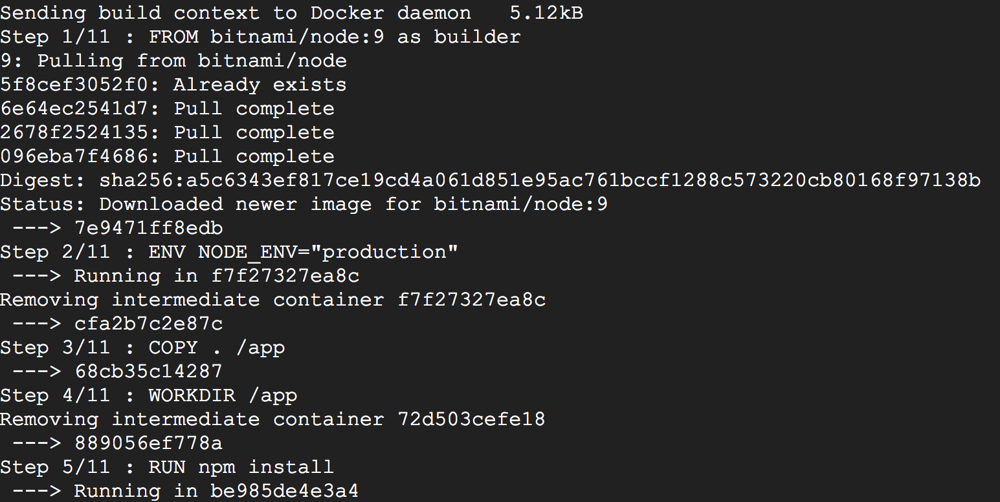
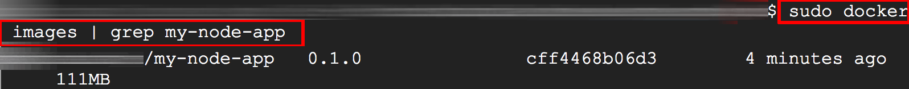
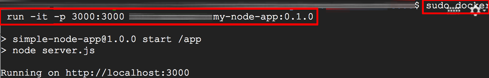
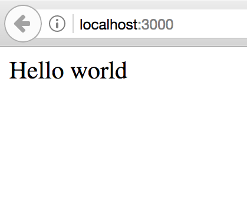
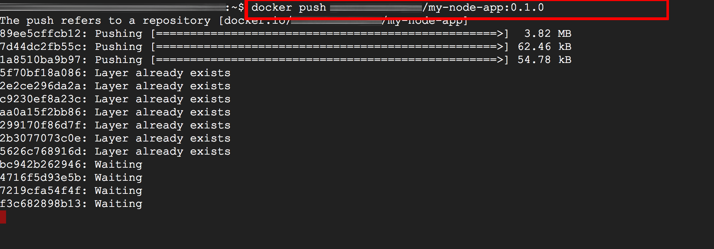
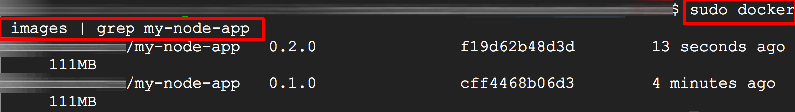
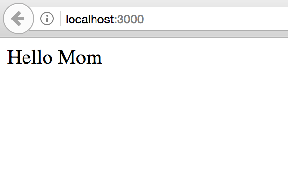

Developers like using containers for development because they are easy to use, portable, and require less maintenance overhead compared to bare metal or virtual machines. [Docker](https://www.docker.com/) is a popular choice, because it provides tools that make it simple for developers to build, run and publish applications in containers.

If you've seen Docker in action and then wondered "can I use this with my own application", then you're in the right place.

[Bitnami](https://bitnami.com) makes it easy to create a Docker image of your own application using its production-ready [container images](https://bitnami.com/containers). Once created, you can run and test your application with Docker, or publish it online so that others can find and use it. And, because Bitnami container images are always secure, optimized and up-to-date, you can rest assured that your application always has access to the latest language features and security fixes.

This guide walks you through the process of creating an optimized, secure Docker image of a custom application using a Bitnami base container, then testing it and publishing it online. It also guides you through the steps to follow when you update your application and need to rebuild and republish it for your users.

## Assumptions and Prerequisites

This guide focuses on creating a secure and optimized Docker image of a custom Node.js application using Bitnami's Node.js production image. In case you don't have a Node.js application at hand, you can use [this simple "Hello world" application](https://github.com/bitnami/tutorials/tree/master/simple-node-app).

This guide makes the following assumptions:

* You have a Docker environment installed and configured. [Learn more about installing Docker](https://docs.docker.com/engine/installation/).
* You have a Docker Hub account. [Register for a free account](https://hub.docker.com/).
* You have Git installed and configured.
* You have a basic understanding of how containers work. Learn more about containers in [our YouTube video](https://www.youtube.com/watch?v=Pb1bgI59dF0), on [Wikipedia](https://en.wikipedia.org/wiki/Operating-system-level_virtualization) and on [ZDNet](http://www.zdnet.com/article/containers-fundamental-to-the-evolution-of-the-cloud/).

## Step 1: Create or obtain the application source code

To begin the process, ensure that you have access to the application source code. If you don't have an existing Node.js application, follow the steps below to create one:

* Create a working directory for the application on your local host:

  ```bash
  mkdir myproject
  cd myproject
  ```
  
* Create a *package.json* file listing the dependencies for the project:

  ```json
  {
    "name": "simple-node-app",
    "version": "1.0.0",
    "description": "Node.js on Docker",
    "main": "server.js",
    "scripts": {
      "start": "node server.js"
    },
    "dependencies": {
      "express": "^4.13"
    }
  }
  ```

* Create a *server.js* file for the Express application which returns a "Hello world" message on access:

  ```javascript
  'use strict';

  const express = require('express');

  // Constants
  const PORT = process.env.PORT || 3000;

  // App
  const app = express();
  app.get('/', function (req, res) {
    res.send('Hello world\n');
  });

  app.listen(PORT);
  console.log('Running on http://localhost:' + PORT);
  ```

## Step 2: Create a Dockerfile

A *Dockerfile* is similar to a recipe: it contains all the ingredients needed to create a Docker image. Typically, each line represents a separate step and begins with an instruction keyword followed by a series of arguments. [Learn more about the *Dockerfile* format](https://docs.docker.com/engine/reference/builder).

In the project directory, create a file named *Dockerfile* and fill it with the following content:

```plaintext
# First build stage
FROM bitnami/node:12 as builder
ENV NODE_ENV="production"

# Copy app's source code to the /app directory
COPY . /app

# The application's directory will be the working directory
WORKDIR /app

# Install Node.js dependencies defined in '/app/packages.json'
RUN npm install

# Second build stage
FROM bitnami/node:12-prod
ENV NODE_ENV="production"

# Copy the application code
COPY --from=builder /app /app

# Create a non-root user
RUN useradd -r -u 1001 -g root nonroot
RUN chown -R nonroot /app
USER nonroot

WORKDIR /app
EXPOSE 3000

# Start the application
CMD ["npm", "start"]
```

This *Dockerfile* consists of two build stages:

* The first stage uses the Bitnami Node.js 12.x development image to copy the application source and install the required application modules using *npm install*.
* The second stage uses the Bitnami Node.js 12.x production image and creates a minimal Docker image that only consists of the application source, modules and Node.js runtime.

{}
**Note**: Bitnami's Node.js production image is different from its Node.js development image, because the production image (tagged with the suffix *prod*) is based on [minideb](https://github.com/bitnami/minideb) and does not include additional development dependencies. It is therefore lighter and smaller in size than the development image and is commonly used in multi-stage builds as the final target image.
{}


### First build stage

Let's take a closer look at the steps in the first build stage:

* The *FROM* instruction kicks off the *Dockerfile* and specifies the base image to use. Bitnami offers a number of container images for Docker which can be used as base images. Since the example application used in this guide is a Node.js application, [Bitnami's Node.js development container](https://github.com/bitnami/bitnami-docker-node) is the best choice for the base image.
* The *NODE_ENV* environment variable is defined so that *npm install* only installs the application modules that are required in production environments.
* The *COPY* instruction copies the source code from the current directory on the host to the */app* directory in the image.
* The *RUN* instruction executes a shell command. It's used to run *npm install* to install the application dependencies.
* The *WORKDIR* instructions set the working directory for the image.

### Second build stage

Here is what happens in the second build stage:

* Since the target here is a minimal, secure image, the *FROM* instruction specifies [Bitnami's Node.js production container](https://github.com/bitnami/bitnami-docker-node) as the base image. Bitnami production images can be identified by the suffix *prod* in the image tag.
* The *COPY* instruction copies the source code and installed dependencies from the first stage to the */app* directory in the image.
* The *RUN* commands create a non-root user account that the application will run under. For security reasons, it's recommended to always run your application using a non-root user account.
* The *CMD* instruction specifies the command to run when the image starts. In this case, *npm start* will start the application.

## Step 3: Build the Docker image

Once the *Dockerfile* is created, building a Docker image is as simple as calling the *docker build* command. Execute the command below in the directory containing the *Dockerfile*. Replace the DOCKER_USERNAME placeholder in the command below with your Docker account username. This Docker account username is necessary to avoid namespace errors when later pushing the image to your Docker Hub account.

```plaintext
docker build -t DOCKER_USERNAME/my-node-app:0.1.0 .
```

{}
**Note**: For successful execution of this and subsequent *docker* commands, ensure that the user account you're using belongs to the *docker* group.
{}


This will create an image named *my-node-app*, tagged as version *0.1.0*. This tag uniquely identifies a Docker image, allowing you to deploy a specific version of the application if needed.

Here's an example of what you should see during the build process:



Once the build process is complete, use the *docker images* command to verify that the image has been added to your local repository.

```plaintext
docker images | grep my-node-app
```

The version tag added during the *docker build* command also appears in the output of *docker images*.  Here's an example of what you should see:



{}
**Note**: Tagging image releases is a recommended practice. [Learn more about tags](https://docs.docker.com/engine/reference/commandline/tag/).
{}


## Step 4: Test the Docker image

Run your new Docker image in a container to test it with the *docker run* command. Replace the DOCKER_USERNAME placeholder in the command with your Docker account username.

```plaintext
docker run -it -p 3000:3000 DOCKER_USERNAME/my-node-app:0.1.0
```

This command runs the application in a container and makes port 3000 of the container accessible by binding it to port 3000 on the Docker host. With this, a user can access the application by browsing to port 3000 of the host.

Here is what you should see as the container starts:



To test the application, browse to *http://localhost:3000* (if the Docker host is the same machine) or *http://SERVER-IP:3000* (if the Docker host is a different machine) and you should see this:



{}
**Note**: If the Docker host is a different machine, ensure that the host firewall is configured to allow access on port 3000.
{}


The *-i* and *-t* options to *docker run* allocate a terminal for the container process, while the *-p* option specifies the container-host port binding. [Learn more about the *docker run* command and its options](https://docs.docker.com/engine/reference/run/).

## Step 5: Publish the Docker image

{}
**Note**: This step requires a Docker Hub account. In case you don't already have one, [sign up on the Docker website](https://hub.docker.com/).
{}

At this point, you have built, tagged and tested a Docker image containing your application code. To share it with others, you can upload the image to a public registry. A number of such registries are available, including [Google Container Registry](https://cloud.google.com/container-registry/), [Quay](https://quay.io/) and others, but this guide will use [Docker Hub](https://hub.docker.com/).

To upload an image to Docker Hub, follow these steps:

* Use the *docker login* command to log in:

  ```plaintext
  docker login
  ```

* Use the *docker push* command to push the image to your Docker Hub account, as shown below. Replace the DOCKER_USERNAME placeholder in the tag name with your Docker account username.

  ```plaintext
  docker push DOCKER_USERNAME/my-node-app:0.1.0
  ```

  Here's what you should see:

  

{}
**Note**: Once published on Docker Hub, your image is publicly available by default.
{}


* Check that the image has been successfully uploaded to Docker Hub by searching for it using the *docker search* command, as shown below:

  ```plaintext
  docker search DOCKER_USERNAME/my-node-app:0.1.0
  ```

Once published on Docker Hub, other users can download your application and try it for themselves.

{}
**Note**: You can also delete images from Docker Hub using the Docker website.
{}


## Handling Updates

As you continue developing your application, you will inevitably want to release fresh Docker images. This might be to include new application features or bug fixes, or to use a new version of the base container that has the latest fixes. Doing this involves regenerating the application image and republishing it to the registry.

To illustrate the process, let's perform a code change in the example application and then release a fresh Docker image with the updated code. Follow these steps:

* Change to the directory containing the application source code.
* Edit the *server.js* file and substitute the string "Hello world" with "Hello Mom". Save the file.
* Rebuild the image, tagging it as version 0.2.0. Replace the DOCKER_USERNAME placeholder in this and subsequent commands with your Docker account username.

  ```plaintext
  docker build -t DOCKER_USERNAME/my-node-app:0.2.0  .
  ```

* Confirm that the image was successfully built and added to the local registry:

  ```plaintext
  docker images | grep my-node-app
  ```

  

* Test the new image:

  ```plaintext
  docker run -it -p 3000:3000 DOCKER_USERNAME/my-node-app:0.2.0
  ```

  Here's what you should see when you access the application through your Web browser:

  

* Publish the new image to Docker Hub:

  ```plaintext
   docker push DOCKER_USERNAME/my-node-app:0.2.0
  ```

Follow these steps every time you want to update and republish your Docker image. If you are deploying the new image to a Kubernetes cluster, [read about rolling updates in our Kubernetes tutorial](https://docs.bitnami.com/tutorials/deploy-application-kubernetes-helm/).

## Useful links

* [Bitnami Node.js container image for Docker](https://github.com/bitnami/bitnami-docker-node)
* [Other Bitnami container images for Docker](https://bitnami.com/containers)
* [Docker Hub](https://hub.docker.com)
* [Docker documentation](https://docs.docker.com/)