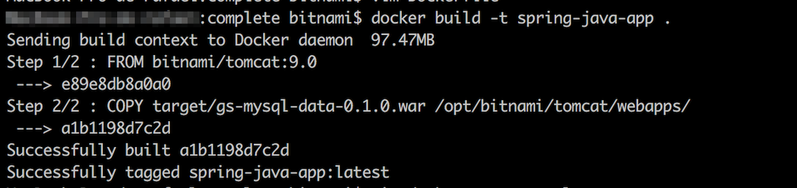

[Bitnami containers](https://bitnami.com/stacks/containers) provide you with a ready-to-go environment for the development framework of your choice backed by Bitnami. By selecting a Bitnami container for local development, you can save a lot of time in coding as well as you benefit from having always the latest and more secure application image.

You can use Bitnami container images for directly deploying applications or as a base for creating your own customized images. The Bitnami Tomcat container image includes all dependencies and libraries you need to deploy an application. That way, you can get productive immediately and focus only on what you love: coding.

In this tutorial, you will learn how to use a [Bitnami Tomcat container image](https://github.com/bitnami/bitnami-docker-tomcat) as a framework for deploying locally a sample [Spring Boot application](https://spring.io/projects/spring-boot) that uses the [Bitnami MariaDB container image](https://github.com/bitnami/bitnami-docker-mariadb) as a database.

## Assumptions and Prerequisites

This guide makes the following assumptions:

* You have basic knowledge of [Docker](https://www.docker.com/) containers.
* You have a Docker environment installed and configured. [Learn more about installing Docker](https://docs.docker.com/install/).
* You have a Docker Hub account. [Register for a free account](https://hub.docker.com/).
* You have Apache Maven already installed. [Refer to the official Apache Maven Project documentation](https://maven.apache.org/install.html).
* You have Curl already installed. [Download and install the latest version of Curl for your operating system](https://curl.haxx.se/dlwiz/).

The following are the steps you will complete in this guide:

* Step 1: Obtain the application source code
* Step 2: Create a Dockerfile
* Step 3: Build the Docker image
* Step 4: Create a *docker-compose.yml* file to configure application services
* Step 5: Test the Docker image and your custom application
* Step 6: Publish the Docker image

## Step 1: Obtain the application source code

To begin the process, ensure that you have access to the application source code. This tutorial uses a sample [Spring Boot application](https://github.com/spring-guides/gs-accessing-data-mysql) which has been modified to replace its database with the Bitnami MariaDB container image and to be packaged as a WAR file. To get the resulting package:

* Clone the sample repository as follows:

  ```plaintext
  git clone https://github.com/bitnami/tutorials.git
  cd tutorials/spring-boot-app
  ```

  This will clone the sample repository. The *gs-mysql-data-0.1.0.war* file is located in the *spring-boot-app* subdirectory.

{}
**Note**: Learn more about the changes done in the application source code by checking check the [repository README file](https://github.com/bitnami/tutorials/tree/master/spring-boot-app/README.md).
{}


## Step 2: Create a Dockerfile

A [*Dockerfile*](https://docs.docker.com/engine/reference/builder/) is similar to a recipe: it contains all the ingredients needed to create a Docker image. Each line of the file represents a separate step and contains the instructions for the container to build the application.

* Create a *Dockerfile* in the sample *spring-boot-app* repository to build your application with the Bitnami Tomcat container image providing the Tomcat infrastructure for the resulting application image. It should include the following content:

  ```plaintext
  FROM bitnami/tomcat:9.0
  COPY gs-mysql-data-0.1.0.war /opt/bitnami/tomcat/webapps_default/
  ```

This *Dockerfile* consists of one stage with two instructions for using the infrastructure *bitnami/tomcat:9.0* image and to copy the application source at build time:

* The FROM instruction kicks off the Dockerfile and specifies the base image to use. In this case, *bitnami/tomcat:9.0*.
* The COPY instruction copies the source code from the current directory on the host to the */webapps_default* directory in the image. Any WAR file copied into that directory will be automatically deployed by Tomcat at bootup time.

## Step 3: Build the Docker image

Once the *Dockerfile* is created, it is time to build the docker image only by executing the *docker build* command. Execute the command below in the same directory where the *Dockerfile* is located, in this case, in the *spring-boot-app* directory of the cloned repository. Remember to replace the DOCKER_USERNAME placeholder with your Docker account username.

```plaintext
docker build -t DOCKER_USERNAME/spring-java-app .
```

This will create an image named *spring-java-app*. Here is an example of the output you should see during the build process:



Once the build process is complete, use the *docker image* command to verify that the image has been added to your local repository.

```plaintext
docker image ls DOCKER_USERNAME/spring-java-app
```

## Step 4: Create a *docker-compose.yml* file to configure application services

[Compose](https://docs.docker.com/compose/) is a tool for defining and running applications with multiple containers in Docker. The *docker-compose.yml* file is used to define the configuration of your application's services. It includes the specification of the application's service dependencies such as databases, queues, caches, etc. After defining them in the *docker-compose.yml* file you are able to create and start one or more containers with a single command: *docker-compose up*.

* Create a *docker-compose.yml* file that contains the following content. Remember to replace the DOCKER_USERNAME placeholder with your Docker account username:

```plaintext
version: '2'

services:
  mariadb:
    image: 'bitnami/mariadb:10.3'
    environment:
      - ALLOW_EMPTY_PASSWORD=yes
      - MARIADB_DATABASE=db_example
      - MARIADB_USER=springuser
      - MARIADB_PASSWORD=ThePassword
    myapp:
    image: 'DOCKER_USERNAME/spring-java-app'
    environment:
      - 'SPRING_APPLICATION_JSON={"spring": {"datasource":{"url": "jdbc:mysql://mariadb:3306/db_example", "username": "springuser", "password": "ThePassword"}}}'
    depends_on:
      - mariadb
    ports:
     - '8080:8080'
```

{}
**Note**: The application environment variable set in this file allows you to use any MySQL database with any credentials at deployment time. This, makes your image secure for production environments.
{}

{}
**Note**: The ALLOW_EMPTY_PASSWORD parameter is set as "yes" in this *docker-compose.yml* file since the application is built for development purposes. That value is highly discouraged for production. Remember to secure your deployments by setting a password in production environments.
{}


## Step 5: Test the Docker image and your custom application

Run your new Docker image in a container to test it with the *docker-compose up* command.

```plaintext
docker-compose up
```

This will create all the containers and volumes both for your application and the database. Now, it is time to test if the application works fine by calling the API endpoint using *Curl*. Follow these instructions:

* Open a new terminal in your local system and execute the following command:

  ```plaintext
  curl 'localhost:8080/gs-mysql-data-0.1.0/demo/all'
  ```

  The output should be an empty array "[]" that means that there is no data present in the database.

* Let's insert some data in the database by executing:

  ```plaintext
  curl 'localhost:8080/gs-mysql-data-0.1.0/demo/add?name=First&email=someemail@someemailprovider.com'
  ```

* Query the application again to check if the data is present in the database:

  ```plaintext
  curl 'localhost:8080/gs-mysql-data-0.1.0/demo/all'
  ```

  Now, you should get an output similar to this:

  ```plaintext
  [{"id":1, "name":"First", "email":"someemail@someemailprovider.com"}]
  ```

Congratulations! You have your Spring Boot application running locally and ready to use!

## Step 6: Publish the Docker image

Now that your Docker image is built and contains your application code, you can upload it into a public registry. This tutorial uses [Docker Hub](https://hub.docker.com/), but you can select one of your own choice such as:

* [Google Container Registry](https://cloud.google.com/container-registry/)
* [Amazon EC2 Container Registry](https://aws.amazon.com/ecr/)
* [Azure container Registry](https://azure.microsoft.com/en-us/services/container-registry/)
* [Quay](https://quay.io/)

To upload the image to Docker Hub, follow the steps below:

* Log in to Docker Hub:

  ```plaintext
  docker login
  ```

* Push the image to your Docker Hub account. Replace the DOCKER_USERNAME placeholder with the username of your Docker Hub account and *my-custom-app:latest* with the name and the version of your Docker image:

  ```plaintext
  docker push DOCKER_USERNAME/my-custom-app:latest
  ```

* Confirm that you see the image in your Docker Hub repositories dashboard.

## Useful links

* [Spring Boot official site](https://spring.io/projects/spring-boot)
* [Bitnami tutorials repository](https://github.com/bitnami/tutorials)
* [Bitnami Tomcat container image](https://github.com/bitnami/bitnami-docker-tomcat)
* [Docker](https://www.docker.com/)
* [Docker Hub](https://hub.docker.com/)
* [Bitnami containers](https://bitnami.com/containers)
* [Deploy a Java application on Kubernetes with Helm](https://docs.bitnami.com/tutorials/deploy-java-application-kubernetes-helm)