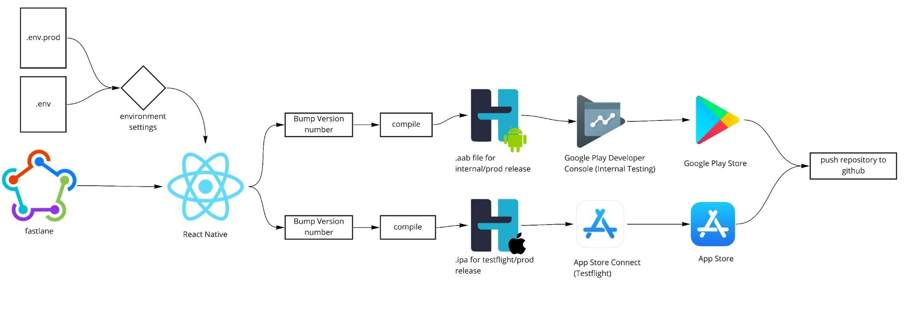
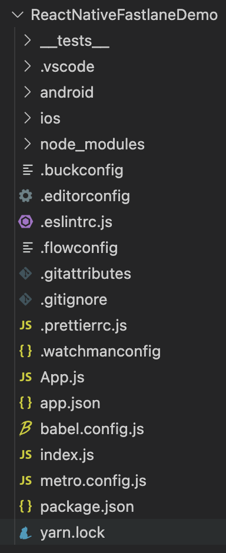
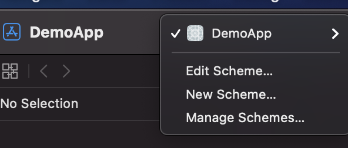
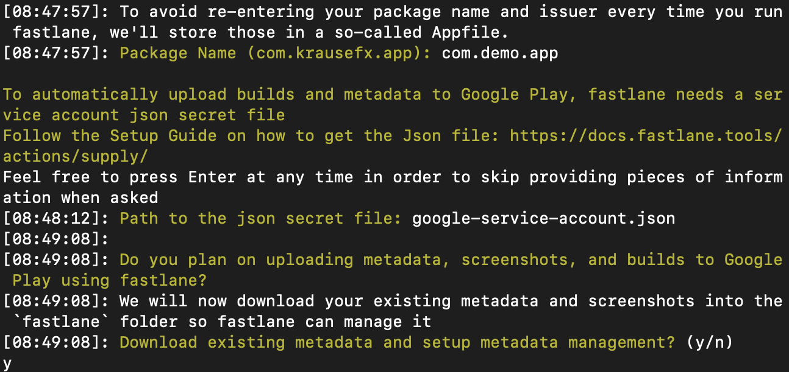

React Native has been a popular mobile user interface (UI) development framework for years, primarily because it gives developers the ability to build once, and have that framework be  deployable onto both Android and iOS platforms. This saves time and reduces complexity.

However, this simplicity has not been available for deployment pipelines. Developers have still been required to version, compile, sign, and submit their applications separately for these two platforms. But recently, I came across a new, open source tool that helps automate this process, called [Fastlane](https://fastlane.tools/). This post is to help you get started using Fastlane for your projects. 

This is an overview of what a typical deployment process for these app store platforms looks like:



1. Based on the target build (beta, production, etc.), the relevant environment file is injected into the React Native app.
2. The application version number is bumped up (versioning strategy varies by project).
3. The codebase is compiled into both Android and iOS builds separately.
4. The two builds are uploaded separately to the relevant app store.
5. The updated builds and version numbers are committed as part of the application changes and pushed to a git repository.
6. If there’s a need to deploy to a different environment, the process will start all over again with a production environment file.

This process includes many risks and inefficiencies, including:
* Human error, e.g., accidentally supplying a production environment file to the dev build, or vice versa
* Accidentally bumping the version number, or bumping the version number incorrectly
* Lost time waiting between stages

It is not uncommon for the deployment process for these two app store platforms alone to take an hour—and that is assuming everything goes well. If there are any errors in the process, the whole process must be restarted. All of this is time that could be better spent on other tasks, such as developing new features or fixing bugs.

With Fastlane, this process can be templated. Once set up, this allows the process to be done automatically in sequence, leaving developers more time to focus on their work.

Next, I’ll show you how to set up a deployment.


## Prerequisites

1. [Install Fastlane](https://docs.fastlane.tools/) – Again, Fastlane is a lightweight CLI tool for automating the deployment of your mobile application to both Android and iOS platforms.
2. [Create a Firebase account](https://www.googleadservices.com/pagead/aclk?sa=L&ai=DChcSEwjjyKeO67HzAhUTEucKHfLZABkYABABGgJwdg&ohost=www.google.com&cid=CAESQOD2ApsvnfYhStYWgVh41jDjqWnsysJUQx9HwYQR2WDCUt8kEnCLEgkGIBka-7wqoym7ve46Ot7rXaUBd21UZ18&sig=AOD64_0xLzFAsHmhbWRtmBSMI1TxjIMsXA&q&adurl&ved=2ahUKEwjYuaCO67HzAhVmIjQIHT26CSoQ0Qx6BAgIEAE) – Firebase is a platform, developed by Google, for creating mobile and web applications.
3. [Google Play Developer account](https://play.google.com/console/about/) – This enables you to publish and manage your apps on the Google Play Store.
4. [Apple Developer account](https://developer.apple.com/) – This enables you to publish and manage your apps on the Apple Store


### Directory structure

Your React Native project structure should look like this:



There are two folders you need to take note of: `iOS` and `Android`. This is where you need to set up the Fastlane configurations.


### Prepare your Android project

1. Add the following code in the build.gradle in android/app/ folder in the **_android_** block.

    ```json
    productFlavors {
        internal {}
        production {}
    }
    ```

 You can refer to [this guide](https://developer.android.com/studio/build/build-variants) on build variants for further configuration options. 

2. Create a keystore file. If you do not have one, refer [here](https://developer.android.com/studio/publish/app-signing) for more information.
3. Create a google-service-account.json file inside the folder; instructions can be found [here](https://docs.fastlane.tools/getting-started/android/setup/).


### Prepare your iOS project

1. Execute the workspace project in the `iOS` folder of the project, this will open up the Xcode.
2. Xcode may ask you to install additional components, select `yes` to proceed.
3. Once the Xcode is opened, create a new scheme. This is required for deploying a build for different environments.
    1. Click on the project name at the top, and select “New Scheme”.
    2. Input the name of the scheme.




## Set up Fastlane

Now you need to set up the automation Fastlane will use to deploy your applications. 
1. Change directories to the root of your Android project.
2. Initialize the project with Fastlane. 

    ```bash
    fastlane init
    ```

From here, Fastlane will automatically detect your project, and ask for any missing information.



3. Repeat the steps in this section for your iOS project.


## What just happened?

Next, take a look at the scripts that Fastlane created for your projects. Notice how the Android and iOS Fastlane scripts are different. This is because the different platforms have different commands, although the deployment processes are similar.

The Fastlane scripts will be placed in the root of each of your project directories. These are some examples.

### Android `fastlane.rb`

```json
default_platform(:android)

platform :android do
  desc "Deploy app for internal sharing"
  lane :deploy_internal do
    ENV["ENVFILE"] = "../env/.env"

    gradle(
      task: "clean"
    )

    android_set_version_code

    gradle(
      task: "bundle",
      flavor: "internal",
      build_type: "Release"
    )

    upload_to_play_store(
      track: 'internal',
      skip_upload_images: true,
      skip_upload_screenshots: true,
      version_code: android_get_version_code,
      version_name: android_get_version_name
    )

    git_commit(path: "./app/*", message: "Android Version Code Bump to: " + android_get_version_code + " for version: " + android_get_version_name)
    push_to_git_remote
  end

  desc "Deploy app to Production"
  lane :deploy_production do
    ENV["ENVFILE"] = "../env/.env.prod"

    gradle(
      task: "clean"
    )

    android_set_version_code
    android_set_version_name(bump_type: "patch")

    gradle(
      task: "bundle",
      flavor: "production",
      build_type: "Release"
    )

    upload_to_play_store(
      release_status: "draft",
      skip_upload_images: true,
      skip_upload_screenshots: true,
      version_code: android_get_version_code,
      version_name: android_get_version_name
    )

    git_commit(path: "./app/*", message: "Android Version Bump to: " + android_get_version_name)
    add_git_tag(tag: "android-" + android_get_version_name)
    push_to_git_remote
  end
end
```


### iOS `fastlane.rb`

```json
default_platform(:ios)

platform :ios do
  desc "Bump version and commit"
  lane :version_bump do
    increment_version_number(bump_type: "patch")
    increment_build_number(build_number: "0")
    git_commit(path: ["./DemoApp/Info.plist", "./DemoAppTests/Info.plist", "./DemoApp.xcodeproj"], message: "iOS Version Bump to: " + get_version_number)
    add_git_tag(tag: "ios-" + get_version_number)
    push_to_git_remote
  end

  desc "Bump build number and commit"
  lane :build_number_bump do
    increment_build_number
    git_commit(path: ["./DemoApp/Info.plist", "./DemoAppTests/Info.plist", "./DemoApp.xcodeproj"], message: "iOS Build Number Bump to: " + get_build_number + " for version: " + get_version_number)
    push_to_git_remote
  end

  desc "Deploy app for internal sharing"
  lane :deploy_internal do
    ENV["ENVFILE"] = "DEV"
    cocoapods(
      clean_install: true
    )
    increment_build_number
    cert
    sigh
    gym(scheme: "DemoApp")
    upload_to_testflight
    git_commit(path: ["./DemoApp/Info.plist", "./DemoAppTests/Info.plist", "./DemoApp.xcodeproj"], message: "iOS Build Number Bump to: " + get_build_number + " for version: " + get_version_number)
    push_to_git_remote
  end

  desc "Deploy app to Production"
  lane :deploy_production do
    get_push_certificate
    ENV["ENVFILE"] = "PROD"
    cocoapods(
      clean_install: true
    )
    increment_version_number(bump_type: "patch")
    increment_build_number(build_number: "0")
    cert
    sigh
    gym(scheme: "DemoApp (Prod)")
    upload_to_app_store(ignore_language_directory_validation: true, force: true)
    git_commit(path: ["./DemoApp/Info.plist", "./DemoAppTests/Info.plist", "./DemoApp.xcodeproj"], message: "iOS Version Bump to: " + get_version_number)
    add_git_tag(tag: "ios-" + get_version_number)
    push_to_git_remote
  end
end
```


## Deploy your applications

The deployment pipelines for your Android and iOS applications have now been templated. The manual, tedious, and error-prone steps I discussed earlier in this post have now been automated. 

The only thing left to do now is deploy your applications and watch Fastlane do its thing!


### Deploy your Android build

1. Deploy your Android application to your “Dev” target. This way, you can validate functionality prior to pushing to production.

    ```bash
    fastlane android deploy_internal
    ```

2. Once you are satisfied with the results in “Dev”, go ahead and release “Prod”.

    ```bash
    fastlane android deploy_production
    ```


### Deploy your iOS build

1. In a very similar way as you tested your Android project, deploy your iOS project first to your “Dev” environment.

    ```bash
    fastlane ios deploy_internal
    ```


2. And finally, once you are satisfied, deploy to “Prod”.

    ```bash
    fastlane ios deploy_production
    ```

That's it! You now have a fully automated deployment template for your Android and iOS projects.


## What’s next?

As you can see, Fastlane is able to deploy mobile apps in an automated fashion. It works for not just React Native, but also for native counterpart (which is what it was intended for in the first place).

This can also be integrated into the CI/CD pipeline where it involves unit and end-to-end testing, in which the deployment will happen at the last stage of the pipeline. Fastlane also comes with various plug-ins that could be used to meet specific needs of developers. For example, `git_commit`,  `add_git_tag`, and `push_to_git_remote` are custom plug-ins that help with pushing committed changes to the git repository. You can learn more about Fastlane plug-ins [here](http://docs.fastlane.tools/plugins/using-plugins/#fastlane-plugins).
