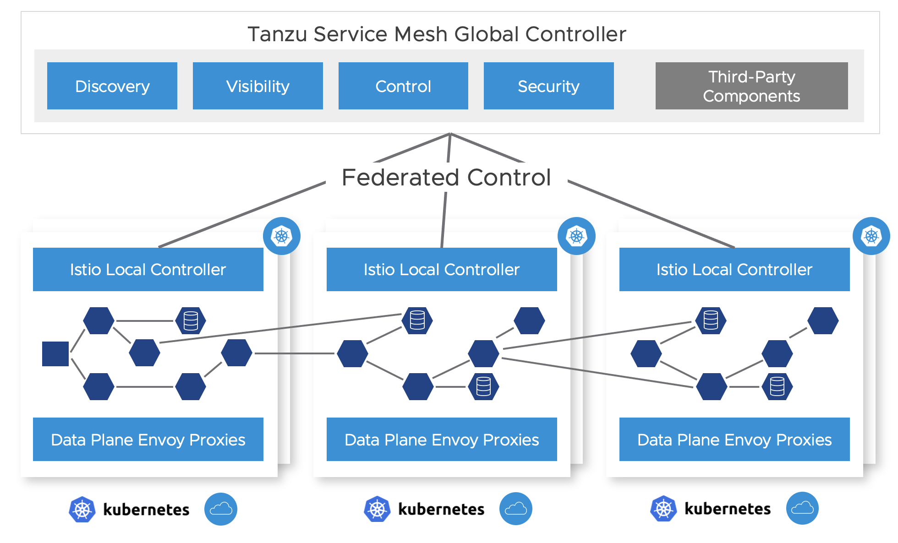

Modern applications are comprised of microservices, these are workloads that communicate using APIs over the network and require services such as service discovery, encryption, traffic controls and access controls. Connecting these workloads with Kubernetes clusters as well as across Kubernetes clusters and even across sites and clouds in a secure way allows organizations to be able to build reliable and scalable applications without being constrained to single cluster deployments. For applications created on Tanzu Application Platform, this is enabled using Tanzu Service Mesh, an Istio based solution that connects and secures microservices across any boundary. This document showcases the first phase of the integration where Tanzu Application Platform Kubernetes workloads are deployed and are able to utilize a Tanzu Service Mesh global namespace to create Kubernetes applications on Run clusters. The Tanzu Service Mesh global namespace provides secure connectivity with mTLS and service discovery, resiliency with actionable SLOs and GSLB integration, and security with micro-segmentation and API security across Kubernetes clusters and clouds.

Please follow the subsequent instructions to setup a Tanzu Application Platform application deployed on Kubernetes with Tanzu Service Mesh.


## Tanzu Service Mesh Setup


### Step 0 - Check prerequisites


* Use this [link](https://docs.vmware.com/en/VMware-Tanzu-Service-Mesh/services/tanzu-service-mesh-environment-requirements-and-supported-platforms/GUID-D0B939BE-474E-4075-9A65-3D72B5B9F237.html#:~:text=Tanzu%20Service%20Mesh%20requires%20a,any%20node%20on%20the%20cluster) to confirm prerequisites for Tanzu Service Mesh that you are:
    * On a supported K8s platform
    * Have the right resource configuration (number of nodes, number of CPUs and RAM etc)
    * Have the required connectivity requirements. (note - connectivity is only required from your local clusters out to TSM and not inwards. This can traverse a corporate proxy as well. In addition, connectivity in the data plane is required between the clusters that need to communicate, specifically egress GW to ingress GW. no data plane traffic needs to reach the TSM SaaS management plane. See the following diagram as an example: 




* You will need to activate your Tanzu Service Mesh subscription in cloud.vmware.com, upon purchasing of your TSM subscription you should receive instructions from the VMware cloud team, otherwise follow the instructions here: [https://pathfinder.vmware.com/v3/path/tsm_activation](https://pathfinder.vmware.com/v3/path/tsm_activation)


### Step 1 - Onboard clusters


* Once the prerequisites captured above are set, onboard your clusters to Tanzu Service Mesh per this [document](https://docs.vmware.com/en/VMware-Tanzu-Service-Mesh/services/getting-started-guide/GUID-DE9746FD-8369-4B1E-922C-67CF4FB22D21.html) 

    This will deploy the TSM local control plane and OSS Istio onto your kubernetes cluster and will connect the local control plane to your TSM tenant.  

* As part of the onboarding of the cluster, for Tanzu Application Platform 1.3 integration, these namespaces should remain excluded getting the Envoy proxy sidecars injected (for Run profiles).; including them may cause the components to stop working at some point in the future when a pod within them is rescheduled or updated. The following list needs to be specified as part of the onboard process per the following [document](https://docs.vmware.com/en/VMware-Tanzu-Service-Mesh/services/getting-started-guide/GUID-DE9746FD-8369-4B1E-922C-67CF4FB22D21.html#:~:text=To%20exclude%20a%20specific%20namespace,the%20right%20drop%2Ddown%20menu.)

    The following is the list of namespaces to be excluded:   

```
    * api-auto-registration
    * app-live-view-connector
    * appsso
    * cartographer-system
    * cert-manager
    * cosign-system
    * default
    * flux-system
    * image-policy-system
    * kapp-controller
    * knative-eventing
    * knative-serving
    * knative-sources
    * kube-node-lease
    * kube-public
    * kube-system
    * secretgen-controller
    * service-bindings
    * services-toolkit
    * source-system
    * tanzu-cluster-essentials
    * tanzu-package-repo-global
    * tanzu-system-ingress
    * tap-install
    * tap-telemetry
    * triggermesh
    * vmware-sources
```

## Tanzu Application Platform Run Cluster Setup

Note: these link to the Tanzu Application Platform 1.2 install instructions in some cases; while we’re deploying the output of a Tanzu Application Platform 1.3 Supply chain, it should be able to install correctly in a Tanzu Application PlatformAP 1.2 cluster.

I’ll also include the Tanzu Application Platform 1.3 instructions, but I’m preferring the public / bug bashed docs for reproducibility for the Run cluster


### Step 0 (prerequisites)


* Ensure [kapp-controller / secretgen-controller](https://carvel.dev/kapp-controller/) ([Tanzu Cluster Essentials](https://docs.vmware.com/en/Cluster-Essentials-for-VMware-Tanzu/1.2/cluster-essentials/GUID-deploy.html)) are deployed on the cluster.
* Ensure you have [imgpkg](https://docs.vmware.com/en/Cluster-Essentials-for-VMware-Tanzu/1.2/cluster-essentials/GUID-deploy.html#optionally-install-clis-onto-your-path-6) and [the Tanzu CLI](https://docs.vmware.com/en/VMware-Tanzu-Application-Platform/1.3/tap/GUID-install-tanzu-cli.html#install-or-update-the-tanzu-cli-and-plugins-3) with apps plugins up to date. `tanzu plugin list` should include:
    * login \
management-cluster \
package \
pinniped-auth \
secret \
services \
accelerator \
apps \
insight
* [Tanzu Application Platform images relocated to a registry](https://docs.vmware.com/en/VMware-Tanzu-Application-Platform/1.3/tap/GUID-install.html). Using a cloud registry with public access is easiest, but your environment may have better options.
    * The short command if you have TanzuNet and registry auth set up is: \
`imgpkg copy -b registry.tanzu.vmware.com/tanzu-application-platform/tap-packages:${TAP_VERSION} --to-repo ${INSTALL_REGISTRY_HOSTNAME}/${INSTALL_REPO}/tap-packages`


### Installation

You don’t need to follow the “[air gapped install](https://docs.vmware.com/en/VMware-Tanzu-Application-Platform/1.3/tap/GUID-install-intro.html#installing-tanzu-application-platform-in-an-airgapped-environment-beta-1)” steps for Run clusters, since the extra steps are to reduce connectivity requirements for building and scanning.


#### Follow steps 7-9 of [the install instructions](https://docs.vmware.com/en/VMware-Tanzu-Application-Platform/1.3/tap/GUID-install.html#relocate-images-to-a-registry-0):


```
$ kubectl create ns tap-install
$ tanzu secret registry add tap-registry \
  --username ${INSTALL_REGISTRY_USERNAME} \
  --password ${INSTALL_REGISTRY_PASSWORD} \
  --server ${INSTALL_REGISTRY_HOSTNAME} \
  --export-to-all-namespaces --yes --namespace tap-install
$ tanzu package repository add tanzu-tap-repository \
  --url ${INSTALL_REGISTRY_HOSTNAME}/${INSTALL_REPO}/tap-packages:$TAP_VERSION \
  --namespace tap-install
```


#### Prepare a tap-values file:


```
profile: run


shared:
  ingress_domain: my-domain  
ceip_policy_disclosed: true
```


#### Install the Tanzu Application Platform package:


```
$ tanzu package install tap -p tap.tanzu.vmware.com -v $TAP_VERSION \
  --values-file tap-values.yaml -n tap-install
```


#### Set up a namespace for deployment

Follow [these instructions](https://docs.vmware.com/en/VMware-Tanzu-Application-Platform/1.3/tap/GUID-set-up-namespaces.html) to set up a namespace for deployment. These steps need to be repeated for each namespace configured.  If you are using a [GitOps](https://tanzu.vmware.com/gitops) workflow with the delivery and/or service bindings yaml files located in a Git repo, make sure you create a secret in your run cluster namespace that matches the secret on the “deliverable” resource used to deploy the workloads. 


#### Exposing a Workload via Istio VirtualService

Creating the Istio VirtualService corresponding to a workload needs to be done on a cluster-by-cluster basis, rather than as part of the Workload package, because there are per-environment fields in the VirtualService (hostname, load balancer IP) which may change depending on the environment.


```
apiVersion: networking.istio.io/v1alpha3
kind: Gateway
metadata:
  name: my-app
  namespace: my-namespace
spec:
  selector:
    istio: ingressgateway
  servers:
  - port:
      number: 80  # HTTP
      name: tcp
      protocol: TCP
    hosts:
    - "*"  # Or specific DNS name
---
apiVersion: networking.istio.io/v1alpha3
kind: VirtualService
metadata:
  name: my-app
  namespace: my-namespace
spec:
  hosts:
  - "*"  # Or specific DNS name
  gateways:
  - my-app
  http:
  - match:
    - port: 80
    route:
    - destination:
        host: my-app
        port:
          number: 8080
#  tcp:
#  - match:
#    - port: 25
#    route:
#    - destination:
#        host: my-app  # Service created by the workload
#        port:
#          number: 25
#        # Could add subsets, etc
```


## Tanzu Application Platform Build Cluster Setup

Follow [the standard Tanzu Application Platform 1.3 instructions](https://docs.vmware.com/en/VMware-Tanzu-Application-Platform/1.3/tap/GUID-install-intro.html).  If you plan on using a 

GitOps workflow, ensure that you create a GitOps secret and reference it in your tap-values file (example [here](https://docs.vmware.com/en/VMware-Tanzu-Application-Platform/1.3/tap/GUID-multicluster-reference-tap-values-build-sample.html)).


## End to End Workload Build and Deployment Scenario


### Workload Build

Workloads can be built using a Tanzu Application Platform supply chain by applying a _workload_ resource to a build cluster.  At this time Tanzu Service Mesh and Tanzu Application Platform cannot use the KNative resources that are the default runtime target when using the _web_ service type.  Tanzu Application Platform web resources will need to be modified to use a workload type that does not target KNative. In Tanzu Application Platform 1.3, two workload types will support this desired deployment: server and worker.  In most cases, your Tanzu Application Platform workloads will be of type _web_.  

To work with Tanzu Service Mesh, web workloads will need to be converted to the _server_ or _worker_ workload type.  Server workloads result in only a Kubernetes _deployment_ resource being created along with a _service_ resource that defaults to using port 8080.  If the desired service port is 80 or some other port, you will need to add port information to the workload.yaml.  The following is an example of changes needed to be made from the _web_ to _server_ workload type. \


Original:


```
apiVersion: carto.run/v1alpha1
kind: Workload
metadata:
  name: hungryman
  labels:
	apps.tanzu.vmware.com/workload-type: web
	app.kubernetes.io/part-of: hungryman-api-gateway
spec:
  params:
  - name: annotations
	value:
  	autoscaling.knative.dev/minScale: "1"
  source:
	git:
  	url: https://github.com/gm2552/hungryman.git
  	ref:
    	branch: main
	subPath: hungryman-api-gateway
```


Modified for Tanzu Service Mesh (not main changes in bold and that the auto scaling annotation is removed):


```
apiVersion: carto.run/v1alpha1
kind: Workload
metadata:
  name: hungryman
  labels:
	apps.tanzu.vmware.com/workload-type: server
	app.kubernetes.io/part-of: hungryman-api-gateway
spec:
  params:
  - name: ports
	value:
	- port: 80
  	containerPort: 8080
  	name: http
  source:
	git:
  	url: https://github.com/gm2552/hungryman.git
  	ref:
    	branch: main
	subPath: hungryman-api-gateway
```


This will result in deployment and a service where the service will be listening on port 80 and forwarding traffic to port 8080 on the pods “workload” container.

To build this workload, submit the modified yaml above to your build cluster.  The following example assumes the file name is workload.yaml and the build cluster uses a namespace named “workloads” for building:

    kubectl apply -f workload.yaml -n workloads

If the build is successful, a _Deliverable_ resource should have been created.


### Create a Global Namespace

Using the Tanzu Service Mesh portal or API, create a [global namespace](https://docs.vmware.com/en/VMware-Tanzu-Service-Mesh/services/concepts-guide/GUID-9E3F1F90-4310-415B-98C8-C06E59B8A5EE.html) that includes the namespaces where your application components will be deployed. Whether in a single cluster or multiple, within the same site or across clouds, once you add namespaces selection to the GNS the services that will be deployed by TAP into it will get connected based on the GNS configuration for service discovery and connectivity policies. If a service needs to be accessible through the ingress from the outside, it can be configured through the “public service” option in TSM or directly through Istio on the clusters when that service resides. It is preferable to configure that through the global namespace. 

 


### Run Cluster Deployment

**NOTE:** Before deploying a workload to a run cluster, ensure that any prerequisite resources have already been created on the run cluster.  This includes but is not limited to concepts such as data, messaging, routing, and security services, RBAC, and service bindings.

After a successful build in a build cluster, workloads can be deployed to the run cluster by applying resulting _Deliverable_ resources to the run cluster as described in the Tanzu Application Platform [multicluster getting started guide](https://docs.vmware.com/en/VMware-Tanzu-Application-Platform/1.3/tap/GUID-multicluster-getting-started.html).  Another potential option is to create a kapp application that references a GitOps repository that includes all _Deliverable_ resources for a given cluster.  The following is an example kapp definition that points to a GitOps repository:

```
apiVersion: kappctrl.k14s.io/v1alpha1
kind: App
metadata:
  name: deliverable-gitops
  namespace: hungryman
spec:
  serviceAccountName: default
  fetch:
  - git:
  	url: https://github.com/gm2552/tap-play-gitops
  	ref: origin/deliverables-tap-east01
  	subPath: config
  template:
  - ytt: {}
  deploy:
  - kapp: {}
```


The advantage of this model is that applications can be deployed or uninstalled from a cluster by managing the contents of the Deliverable resources from within the GitOps repository and enabling a GitOps workflow for application and service change control.


## Deployment Use Case: Hungryman

The following instructions describe an end-to-end process for configuring, building and deploying the Hungryman application into a Tanzu Service Mesh global namespace.  These instructions will use the default configuration of Hungryman which consists of only needing a single node RabbitMQ cluster, an in-memory database, and no security.  The application will be deployed across two Tanzu Application Platform run clusters.  It will require the use of the _YTT_ command to execute the build and deployment commands.

The configuration resources referenced in this scenario are located in the Git repository [here](https://github.com/gm2552/hungryman-tap-tsm).


### Initial Configuration Generation From an Accelerator (for reference)

This use case deployment includes a prebuilt set of configuration files in a Git repo, however they were created from a set of configuration created via a bootstrapped process using the Hungryman accelerator and later modified.  If desired and for reference purposes, you can create an initial set of configuration files from the Hungryman accelerator which is available in Tanzu Application Platform 1.3.  Note that this section does not include instructions for modifying the configuration files from the accelerator into configuration files used in the later section.  

From the accelerator, accept all of the default options with the following exceptions.


* Workload Namespace:  Update this field with the name of the namespace you will use to build the application in your build cluster.
* Service Namespace: Update this field with the name of the namespace you will use to deploy a RabbitMQ cluster in your Tanzu Application Platform run cluster.


### Workload Build

To build the application services, execute the following command to apply the _Workload_ resources to your build cluster.  Modify the `<workloadNamespace>` placeholder with the name of your build namespace.  You can also either clone or fork the repository in the command below to either use the .yaml files locally or point to your own Git repository.

`ytt -f workloads.yaml -v workloadNamespace=<workloadNamespace> | kubectl apply -f-`

Eg:

`ytt -f https://raw.githubusercontent.com/gm2552/hungryman-tap-tsm/main/workloads.yaml -v workloadNamespace=workloads | kubectl apply -f-`

Assuming you are using a GitOps workflow with your build cluster, once the workloads have been successfully built, the deployment information will be pushed to your GitOps repository.

**NOTE: **If you execute the instructions above without pull requests in the GitOps workflow, it is possible that `config-writer` pods that commit deployment information to the GitOps repo may fail due to concurrency conflicts.  A dirty but usable workaround is to delete the failed Workloads from the build cluster and re-run the command in the instructions above.


### Service and Resource Claim Installation

Hungryman requires the use of a RabbitMQ cluster which will need to be installed into your run cluster.  You will need to install RabbitMQ onto the same run cluster that will be noted as `RunCluster01` in the deployment section. Additionally, you will also need to install service claim resources into this cluster.  

If not already available, install the RabbitMQ operator into the run cluster running the following command:

`kubectl apply -f "[https://github.com/rabbitmq/cluster-operator/releases/download/v1.13.1/cluster-operator.yml](https://github.com/rabbitmq/cluster-operator/releases/download/v1.13.1/cluster-operator.yml)"`

Next, spin up an instance of a RabbitMQ cluster by running the following commands.  Modify the `<servicesNamespace>` placeholder with the name of the namespace where you want to deploy your RabbitMQ Cluster:

```
kubectl create ns <serviceNamespace>

ytt -f rmqCluster.yaml -v serviceNamespace=<serviceNamespace> | kubectl apply -f-
```

Eg:

```
kubectl create ns service-instances

ytt -f https://raw.githubusercontent.com/gm2552/hungryman-tap-tsm/main/rmqCluster.yaml -v serviceNamespace=service-instances | kubectl apply -f-
```

Finally, create service toolkit resources for the RabbitMQ class and resource claim by running the following command.  Modify the `<servicesNamespace>` and <workloadNamespace> placeholder with the name of the namespace where you deployed your RabbitMQ Cluster and the namespace where the application service will run.

`ytt -f rmqResourceClaim.yaml -v serviceNamespace=<serviceNamespace> -v workloadNamespace=<workloadNamespace> | kubectl apply -f-`

Eg:

`ytt -f https://raw.githubusercontent.com/gm2552/hungryman-tap-tsm/main/rmqResourceClaim.yaml -v serviceNamespace=service-instances -v workloadNamespace=hungryman | kubectl apply -f-`


### Run Cluster Deployment

Workloads are deployed to the run cluster using _Deliverable _resources.  This section will apply the _Deliverable_ resources directly to the run clusters vs using a Kapp application.  This deployment will assume two clusters that are part of the Tanzu Service Mesh Global namespace called hungryman.  For the sake of naming, we will simply call these clusters `RunCluster01` and `RunCluster02`.  The majority of the workload will be deployed to `RunCluster01` while on the _crawler_ workload will be deployed to `RunCluster02`.

The Deliverable objects will reference the GitOps repo where the build cluster has written deployment information and will need to reference this repository in the command below.  To deploy the workloads to the run clusters, run the commands below against their respective clusters replacing the following placeholders:


* **<workloadNamespace>** - The name of the namespace where the workloads will be deployed.
* **<gitOpsSecret>** - The name of the GitOps secret used to access the GitOps repository
* **<gitOpsRepo>** - The URL of the GitOps repository where the build cluster wrote out deployment configuration information.

`ytt -f cluster01Deliverables.yaml -v workloadNamespace=<workloadNamespace> -v gitOpsSecret=<gitOpsSecret> -v gitOpsRepo=<gitOpsRepo> | kubectl apply -f-`

`ytt -f cluster02Deliverables.yaml -v workloadNamespace=<workloadNamespace> -v gitOpsSecret=<gitOpsSecret> -v gitOpsRepo=<gitOpsRepo> | kubectl apply -f-`

Eg:

`RunCluster01` deployment:

`ytt -f https://raw.githubusercontent.com/gm2552/hungryman-tap-tsm/main/cluster01Deliverables.yaml -v workloadNamespace=hungryman -v gitOpsSecret=tap-play-gitops-secret -v gitOpsRepo=https://github.com/gm2552/tap-play-gitops.git | kubectl apply -f-`

`RunCluster02` deployment:

`ytt -f https://raw.githubusercontent.com/gm2552/hungryman-tap-tsm/main/cluster02Deliverables.yaml -v workloadNamespace=hungryman -v gitOpsSecret=tap-play-gitops-secret -v gitOpsRepo=https://github.com/gm2552/tap-play-gitops.git | kubectl apply -f-`

You can optionally create an Istio ingress resource on `RunCluster01` if you do not plan on using the Global Namespace capabilities to expose the application to external networks.  To create the Ingress, run the following command modifying the `<domainName>` placeholder with the name of the public domain that will host your application.  You will need to create a DNS A record in your DNS provider’s configuration tool to point to the Istio load balanced IP address of `RunCluster01` (the DNS configuration is out of scope of this document).  Also update the <workloadNamespace> placeholder with the name of the namespace where the workloads are deployed.

`ytt -f ingress.yaml -v workloadNamespace=<workloadNamespace> -v domainName=<domainName> | kubectl apply -f-`

Eg:

`ytt -f https://raw.githubusercontent.com/gm2552/hungryman-tap-tsm/main/ingress.yaml -v workloadNamespace=hungryman -v domainName=tsmdemo.perfect300rock.com | kubectl apply -f-`


### Create Global Namespace

Load the Tanzu Service Mesh console and create a new Global Namespace.  Configure the following settings in each step.  The cluster names below will use the generic placeholder names of `RunCluster01` and `RunCluster02` and assume the workload and service namespaces of hungryman and _service-instances_ respectively.


1. General Details
    1. **GNS Name:** hungryman
    2. **Domain:** hungryman.lab
2. Namespace Mapping
    1. Namespace Mapping Rule 1
        1. **ClusterName:** `RunCluster01`
        2. **Namespace:** hungryman
    2. Namespace Mapping Rule 2
        1. **ClusterName:** `RunCluster02`
        2. **Namespace:** hungryman
    3. Namespace Mapping Rule 3
        1. **ClusterName:** `RunCluster01`
        2. **Namespace:** `service-instances`
3. Autodiscovery (use default settings)
4. Public Services
    1. **Service Name:** hungryman  
    2. **Service Port:** 80
    3. **Public URL**: http  hungryman . (select a domain)
5. GSLB & Resiliency (use default settings)

You should be able to access the Hungryman application at the URL configured in step 4.


## Deployment Use Case: ACME Fitness Store

The following instructions describe an end-to-end process for configuring, building and deploying the ACEM fitness store application into a Tanzu Service Mesh global namespace.  The application will be deployed across two Tanzu Application Platform run clusters, and will require the use of the _YTT_ command to execute the build and deployment commands.

The configuration resources referenced in this scenario are located in the Git repository [here](https://github.com/gm2552/acme-fitness-tap-tsm).


### Workload Build

To build the application services, execute the following command to apply the _Workload_ resources to your build cluster.  Modify the `<workloadNamespace>` placeholder with the name of your build namespace and the <appSSOIssuerURI> placeholder the URL of the AppSSO Auth server that you will deploy in a later step.  You can also either clone or fork the repository in the command below to either use the .yaml files locally or point to your own Git repository.

`ytt -f workloads.yaml -v workloadNamespace=<workloadNamespace> -v appSSOIssuerURI=<appSSOIssuerURL> | kubectl apply -f-`

Eg:

`ytt -f https://raw.githubusercontent.com/gm2552/acme-fitness-tap-tsm/main/workloads.yaml -v workloadNamespace=workloads -v appSSOIssuerURI=http://authserver.tsmdemo.perfect300rock.com | kubectl apply -f-`

Assuming you are using a GitOps workflow with your build cluster, once the workloads have been successfully built, the deployment information will be pushed to your GitOps repository.

**NOTE:** If you execute the instructions above without pull requests in the GitOps workflow, it is possible that `config-writer` pods that commit deployment information to the GitOps repo may fail due to concurrency conflicts.  A dirty but usable workaround is to delete the failed Workloads from the build cluster and re-run the command in the instructions above.


### AppSSO Deployment

ACME requires the use of an AppSSO auth server and client registration resource.  You will need to install these resources onto the same run cluster that will be noted as `RunCluster01` in the deployment section. 

Deploy the Auth server instance by running the following commands and replacing the following placeholders:


* **`<workloadNamespace>`** - The name of the namespace where the workloads will be deployed.
* **`<appDomain>`** - The DNS domain that the application will use externally.  This should be the publicly facing DNS name and not an internal Kubernetes domain name.
* **`<appSSOName>`** - The name of the auth server resource instance.  
* **`<appSSOIssuerURI>`** - The public URI used to access the auth server. This should be the same as the `appSSOIssuerURI` placeholder used in the previous section.
* **`<devDefaultAccountUsername>`** - The username used for the ACME application authentication.
* **`<devDefaultAccountPassword>`** - The password used for the ACME application authentication.

`ytt -f appSSOInstance.yaml -v workloadNamespace=<workloadNamespace> -v appDomainName=<appDomain> -v appSSOName=<appssoName> -v appSSOIssuerURI=<appSSOIssuerURI> -v devDefaultAccountUsername=<devDefaultAccountUsername> -v devDefaultAccountPassword=<devDefaultAccountPassword> | kubectl apply -f-`

Eg:

`ytt -f https://raw.githubusercontent.com/gm2552/acme-fitness-tap-tsm/main/appSSOInstance.yaml -v workloadNamespace=acme -v appDomainName=tsmdemo.perfect300rock.com -v appSSOName=appsso-acme-fitness -v appSSOIssuerURI=http://authserver.tsmdemo.perfect300rock.com -v devDefaultAccountUsername=acme -v devDefaultAccountPassword=fitness | kubectl apply -f-`

Next create a `ClientRegistration` resource by running the following command and replacing the following placeholders:


* **`<workloadNamespace>`** - The name of the namespace where the workloads will be deployed.
* **`<appSSOName>`** - The name of the auth server resource instance.  
* **`<appSSORedirectURI>`** - The public URI that the auth server will redirect to after a successful login.

`ytt -f appSSOInstance.yaml -v workloadNamespace=<workloadNamespace> -v appSSOName=<appssoName> -v appSSORedirectURI=<appSSORedirectURI> | kubectl apply –f-`

Eg:

`ytt -f https://raw.githubusercontent.com/gm2552/acme-fitness-tap-tsm/main/clientRegistrationResourceClaim.yaml -v workloadNamespace=acme -v appSSOName=appsso-acme-fitness -v appSSORedirectURI=http://acme-fitness.tsmdemo.perfect300rock.com/login/oauth2/code/sso | kubectl apply -f-`


### Istio Ingress

The auth server requires a publicly accessible URL and is required to be available before the `SpringCloudGateway` will deploy properly.  The auth server will be deployed at the URI `authserver.<appDomain>`. Run the following command to create the Istio Ingress resources replacing `<workloadNamespace>` and `<appDomain>` placeholders with the name of your build namespace and the application’s DNS domain.  You will need to create a DNS A record in your DNS provider’s configuration tool to point to the Istio load balanced IP address of `RunCluster01` (the DNS configuration is out of scope of this document)

`ytt -f istioGateway.yaml -v workloadNamespace=<workloadNamespace> -v appDomainName=<appDomain> | kubectl apply -f-`

Eg:

`ytt -f https://raw.githubusercontent.com/gm2552/acme-fitness-tap-tsm/main/istioGateway.yaml -v workloadNamespace=acme -v appDomainName=tsmdemo.perfect300rock.com | kubectl apply -f-`


### Redis Deployment

A Redis instance is needed for ACME cart service for caching.  To deploy the Redis instance, run the following command replacing the `<workloadNamespace>` placeholder with the name of the namespace where the workloads will be deployed and the `<redisPassword>` placeholder to an arbitrary password.

`ytt -f https://raw.githubusercontent.com/gm2552/acme-fitness-tap-tsm/main/redis.yaml -v workloadNamespace=<workloadNamespace> -v redisPassword=<redisPassword> | kb apply -f-`

Eg:

`ytt -f https://raw.githubusercontent.com/gm2552/acme-fitness-tap-tsm/main/redis.yaml -v workloadNamespace=acme -v redisPassword=fitness | kubectl apply -f-`


### Run Cluster Deployment

Workloads are deployed to the run cluster using _Deliverable_ resources.  This section will apply the _Deliverable_ resources directly to the run clusters vs using a Kapp application.  This deployment will assume two clusters that are part of the Tanzu Service Mesh Global namespace called _acme_.  For the sake of naming, we will simply call these clusters `RunCluster01` and `RunCluster02`. 

The Deliverable objects will reference the GitOps repo where the build cluster has written deployment information and will need to reference this repository in the command below.  To deploy the workloads to the run clusters, run the commands below against their respective clusters replacing the following placeholders:


* **`<workloadNamespace>`** - The name of the namespace where the workloads will be deployed.
* **`<gitOpsSecret>`** - The name of the GitOps secret used to access the GitOps repository
* **`<gitOpsRepo>`** - The URL of the GitOps repository where the build cluster wrote out deployment configuration information.

```
ytt -f cluster01Deliverables.yaml -v workloadNamespace=<workloadNamespace> -v gitOpsSecret=<gitOpsSecret> -v gitOpsRepo=<gitOpsRepo> | kubectl apply -f-

ytt -f cluster02Deliverables.yaml -v workloadNamespace=<workloadNamespace> -v gitOpsSecret=<gitOpsSecret> -v gitOpsRepo=<gitOpsRepo> | kubectl apply -f-
```

Eg:

`RunCluster01` deployment:

`ytt -f https://raw.githubusercontent.com/gm2552/acme-fitness-tap-tsm/main/cluster01Deliverables.yaml -v workloadNamespace=acme -v gitOpsSecret=tap-play-gitops-secret -v gitOpsRepo=https://github.com/gm2552/tap-play-gitops.git | kubectl apply -f-`

`RunCluster02` deployment:

`ytt -f https://raw.githubusercontent.com/gm2552/acme-fitness-tap-tsm/main/cluster02Deliverables.yaml -v workloadNamespace=acme -v gitOpsSecret=tap-play-gitops-secret -v gitOpsRepo=https://github.com/gm2552/tap-play-gitops.git | kubectl apply -f-`


### Spring Cloud Gateway Deployment

The section requires that the Spring Cloud Gateway for Kubernetes package be [installed](https://docs.vmware.com/en/VMware-Spring-Cloud-Gateway-for-Kubernetes/1.2/scg-k8s/GUID-installation-tanzu-cli.html) in `RunCluster01`.

**NOTE:** The Spring Cloud Gateway _spec.service.name _configuration was not built with multi, cross-cluster support.  The configuration in the gateway routes implements a workaround for now which is brittle in terms of where certain services are deployed, however, better support for this use case may come in future release of the gateway.

The Tanzu Application Platform fork of the ACME fitness store uses Spring Cloud Gateway for routing API class from the web frontend to the micro-services.  To deploy the gateway along with applicable routes, run the following command replacing the `<workloadNamespace>` placeholder with the name of the namespace where the workloads will be deployed.

```
ytt -f scgInstance.yaml -v workloadNamespace=<workloadNamespace>

ytt -f scgRoutes.yaml -v workloadNamespace=<workloadNamespace>
```

Eg:

```
ytt -f https://raw.githubusercontent.com/gm2552/acme-fitness-tap-tsm/main/scgInstance.yaml -v workloadNamespace=acme | kubectl apply -f-

ytt -f https://raw.githubusercontent.com/gm2552/acme-fitness-tap-tsm/main/scgRoutes.yaml -v workloadNamespace=acme | kubectl apply -f-
```

### Create Global Namespace

Load the Tanzu Service Mesh console and create a new Global Namespace.  Configure the following settings in each step.  The cluster names below will use the generic placeholder names of `RunCluster01` and `RunCluster02` and assume a workload namespace of _acme_.


1. General Details
    1. **GNS Name:** acme-tap
    2. **Domain:** acme-tap.lab
2. Namespace Mapping
    1. Namespace Mapping Rule 1
        1. **ClusterName:** `RunCluster01`
        2. **Namespace:** acme
    2. Namespace Mapping Rule 2
        1. **ClusterName:** `RunCluster02`
        2. **Namespace:** acme
3. Autodiscovery (use default settings)
4. Public Services
    1. No Public service.
5. GSLB & Resiliency (use default settings)

You can access the application by going to the url `http://acme-fitness.<appDomain>`
