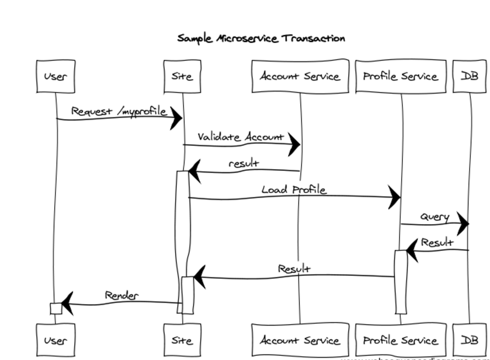

When a request comes into a monolithic application, it's fairly easy to trace through what happened as a result of that request because everything is self-contained. However, when a request comes into a microservice (remember GUI apps can be microservices, they just render HTML instead of JSON), that request could result in a cascading chain of 10 other HTTP calls to various other services. You might also be interested in knowing when a particular service makes non-HTTP calls, such as to a database or a message queue.

This guide discusses some of the things that are required from an architectural standpoint to support distributed tracing and then describes some implementations, tools, and libraries to facilitate this.

What you will discover is that the vast majority of modern distributed tracing solutions are either based on, or inspired by, the [Google Dapper Whitepaper](http://static.googleusercontent.com/media/research.google.com/en//pubs/archive/36356.pdf).

## What is Distributed Tracing?
Distributed tracing allows the logs (or other metadata) for applications to span servers. More importantly, these logs need to be able to span not only multiple instances of a single service, but need to be able to correlate the activity of multiple services.

When service A calls service B which in turn calls service C, you need to be able to correlate certain log data and statistics about that single request. Manually fishing through logs to try and find the trace related to one client-originated call across an ecosystem of many services, each with multiple application instances, is a nightmare.

The solution is distributed tracing. Regardless of how you implement it, it always involves the creation of an _origination ID_ as well as individual _span IDs_. The terminology may vary across different servers, libraries, and agent implementations, but the concepts are the same. Let's take a look at the following simple request:

* User requests the page `/myprofile`
  * Page calls account service
	* Account service calls LDAP
  * Page calls profile service
	* Profile service calls database
* User receives a profile page.

In order for a tracing system to monitor this entire request flow—with multiple instances of the web app, account service, and profile service running—an origination ID is needed that spans the entire request flow, no matter what gets called or how. Each individual step must generate and use _span IDs_ so that the trace for the individual steps can be viewed as a single step as well as part of a larger whole (the original request).

Decorated with IDs, we might have the following:


| Origination ID | Span ID | Activity |
| --- | --- | ---
| `abc123` | `span1` | User Requests the page `/myprofile` |
| `abc123` | `span1` | Page calls account service |
| `abc123` | `span2` | Account service handles request |
| `abc123` | `span1` | Page calls profile service |
| `abc123` | `span3` | Profile service handles request |
| `abc123` | `span3` | Profile service queries database |
| `abc123` | `span1` | Render requested page |


Drawn out as a sequence diagram, this single user-initiated request might look something like this:

The goal of distributed tracing is to maintain enough context so that you (or a tool) can collect sufficient data from distributed trace logs to reconstitute or _reverse_ a sequence diagram from the available data for any given initiating request.

Ideally, with the right metadata, tools, and libraries, you will be able to determine how much time was spent at each step in the sequence diagram, whether anything went wrong during those times, and dive into the detailed trace output for each step in the sequence. All of this should be available to you while being able to roll up or collapse the individual steps in the request so you can examine the entire request.

## Implementation in Java
There is nothing preventing you from creating your own code to solve this problem, however, the usual caveats apply when discussing large projects that reinvent the wheel. Keep in mind that your goal is to spend as much time as possible building applications, not building tools to support applications when such tools already exist.

Code-wise, the implementation core is relatively simple. For every inbound request, examine the HTTP headers. If there is a *trace id* then you know you are part of some larger activity. If there isn't, create a new one. Always create a new *span id*. Then, just make the trace and span context available to your code so you can add additional troubleshooting, diagnostic, and metric information for collection later.

### Tracing with Spring Cloud Sleuth and Zipkin
There are already tools and libraries that solve this problem in the **Spring Cloud** / **Spring Boot** space - _Sleuth_ and _Zipkin_.

Using these tools, the larger, outermost request (we referred to this as the originator or _origination ID_ above) is called the **trace**, and individual steps within this request are called **spans**. Additional information and metadata can be attached to a **span** through the use of **tags**.

You can learn more about using Zipkin in the guide: [Getting Started with Zipkin and Spring Boot](/guides/spring/spring-zipkin/).

## Implementation in .NET
The same general rules apply to .NET, maintain the trace and span context at the request inbound and outbound level, and emit log information to **STDOUT** decorated with that information.

You can use the extension points available in **WCF**, **ASP.NET** or the **Web API** to trap inbound and outbound requests, which would allow you to not only create and maintain trace and span contexts, but also do things like emit logs with elapsed time calculations per-span, which can then be rolled up by external tools.

There is a [.NET client library for Zipkin](https://github.com/openzipkin/zipkin4net) that can be used if you're interested in working with Zipkin.

Projects like [Steeltoe](https://steeltoe.io/) now utilize Zipkin.

## Implementation in Node
Once again, the same high-level rules apply. The goal is to emit information with enough context so that correlations can be determined by some monitoring or analysis tool. There are a number of frameworks available in Node that facilitate this kind of instrumentation.

## Use of Agent-Based Distributed Tracing Systems
There are a number of solutions to the distributed tracing problem that involve installing an agent on a virtual machine. This agent can then monitor traffic and perform correlation so that you can see a directed graph of correlated activity for your entire infrastructure. The problem with agent-based solutions is that they require installation on a virtual machine, which is a cloud native anti-pattern.

If you can avoid installing an agent then you should do so. There are plenty of implementations of the **Google Dapper** whitepaper available, none of which require agent installations and prefer instead to inject code aspects or annotations to deal with distributed tracing.

## Keep Learning
Distributed tracing is essential for troubleshooting microservices applications, so it’s worth the effort to learn about it. What you will discover is that the vast majority of modern distributed tracing solutions are either based on, or inspired by, the [Google Dapper Whitepaper](http://static.googleusercontent.com/media/research.google.com/en//pubs/archive/36356.pdf).

To learn more about observability in cloud native environments, visit our [Observability pattern](/patterns/observability/). And be sure and read the guide [Getting Started with Zipkin and Spring Boot](/guides/spring/spring-zipkin/) if you’re implementing microservices in the Spring environment.