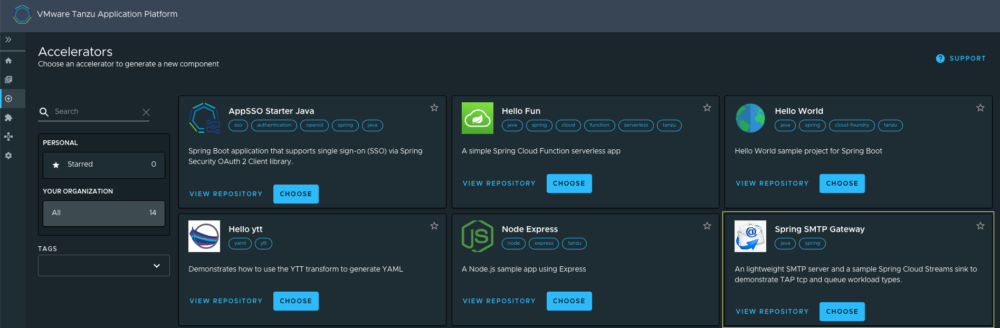

## Introduction

The combination of the Tanzu out-of-the-box supply chains along with Tanzu Cloud Native Runtimes (the most prominent based on Knative) gives developers a facilitated path for building and deploying web applications and micro services with a tool chest of capabilities such as managed revisions, auto scaling (even to 0), and ingress integration.  Although HTTP web app and REST API support are essential features for any modern cloud native platform, there are numerous contemporary architecture patterns that are not rooted in the HTTP paradigm.  Trying to deploy these contemporary service types on KNative either feels like trying to fit a square peg in a round hole or flat out doesn’t work at all.

A key value proposition of Tanzu Application Platform (TAP) is to bring curated opinions to an underlying Kubernetes platform whilst shepherding quick outcomes.  One of the brilliant realizations of TAP, however, is that it's aware that not every opinion will work for all scenarios and gives implementors a high degree of flexibility and extensibility for customizing TAP deployments for their own needs.  Supply chains and runtimes are no exception to this rule as they can be customized to give TAP the ability to build, deploy, and run services that do not adhere to the HTTP entrenched architecture.

In this guide, you will be introduced to two new workload types _tcp_ and _queue_ (currently still in Beta as of TAP 1.2), install new supply chains, and finally build and deploy a set of complimentary non-HTTP applications on TAP using your new supply chains.

## Prerequisites

This guide assumes the following prerequisites are met:

* **Tanzu Application Platform** -- Installation of TAP 1.1.x or TAP 1.2.x that has deployed out-of-the-box supply chains, out of the box templates, and TAP-GUI.
* **kubectl** -- You will use this to manage Kubernetes resources.  Installation instructions are [here](https://kubernetes.io/docs/tasks/tools/).
* **Tanzu CLI** -- You will use this to execute Tanzu specific operations.  Install instructions are [here](https://docs.vmware.com/en/VMware-Tanzu-Application-Platform/1.2/tap/GUID-install-tanzu-cli.html).
* **YTT** -- You will use the to install a supply chain with user provided values.  Install instructions are [here](https://carvel.dev/ytt/docs/v0.42.0/install/).
* You will need permissive access to the TAP Kubernetes cluster with kubectl and Tanzu cli tools

## TCP and Queue Workloads

[Queue](https://docs.vmware.com/en/VMware-Tanzu-Application-Platform/1.1/tap/GUID-workloads-queue.html) and[ TCP](https://docs.vmware.com/en/VMware-Tanzu-Application-Platform/1.1/tap/GUID-workloads-tcp.html) workload types were introduced as Beta features starting in TAP 1.1 and are described in some detail in the TAP [documentation](https://docs.vmware.com/en/VMware-Tanzu-Application-Platform/1.2/tap/GUID-workloads-workload-types.html). 

The _TCP_ type is ideal for workloads that need to support communication protocols and APIs that are not based on HTTP.  Examples include common communication protocols like SMTP and industry specific protocols like healthcare’s HL7 v2.x specification.  TCP workloads can also support exposing multiple TCP ports which is essential for protocols like XMPP which utilizes numerous ports for various functional capabilities.  It is also entirely possible (and in some cases desirable) to deploy HTTP workloads using the TCP type.  Although the TCP type supply chain automatically creates a Cluster IP _Service_ to expose the TCP ports, ingress is not automatically configured.  This is purposeful as it allows for a high degree of flexibility in how the _Service_ is ultimately exposed for external use, and it does require configuration outside of the supply chain.  Future revisions of the supply chain may include the ability to configure ingress using a workload.yaml descriptor.

The _Queue_ type is almost functionally identical to the TCP type with the exception that it does not expose any TCP ports with a _Service_ resource.  This type of workload is ideal for applications that need to run continuously without any TCP communication and/or communicate over asynchronous messaging systems like RabbitMQ or Kafka.

Both workload types do not use the KNative custom resources.  Instead, they utilize the Kubernetes native _Deployment_ resource which also changes the update pattern to a rolling update and removes KNative auto scaling capabilities.

### Supply Chain Installation

The TAP Beta docs for the TCP and Queue types spread the installation process into two different guides.  However, these two types are almost identical in function, meaning they both use many of the same supply chain templates.  In this section, you will install the supply chain components as well the necessary RBAC configuration to enable building and deploying TCP and Queue workload types.  

1. Add the TCP/Queue supply chain template components to your cluster with the following command: 

```sh
kubectl apply -f https://raw.githubusercontent.com/sample-accelerators/spring-smtp-gateway/main/supplyChains/tpc-queue-templates.yaml
```

2. Add the RBAC configuration to your TAP cluster with the following command: 

```sh
kubectl apply -f  https://raw.githubusercontent.com/sample-accelerators/spring-smtp-gateway/main/supplyChains/tpc-queue-rbac.yaml
```

3. Add the supply chain configuration using the following YTT command replacing the  REGISTRY-REPO, REGISTRY-SERVER, and GITOPS-SECRET placeholders with values from the supply chain section of your tap-values.yaml file.  NOTE: If you don’t have a Gitops secret, use the value "" for the GITOPS-SECRET value.

```sh
ytt -f https://raw.githubusercontent.com/sample-accelerators/spring-smtp-gateway/main/supplyChains/tpc-queue-supplychain.yaml -v registry_repo=REGISTRY-REPO -v registry_server=REGISTRY-SERVER -v gitops_secret=GITOPS-SECRET `| kubectl apply -f -`
```

Example:
```sh
ytt -f https://raw.githubusercontent.com/sample-accelerators/spring-smtp-gateway/main/supplyChains/tpc-queue-supplychain.yaml -v registry_repo=tapdev/supply-chain -v registry_server=reg.myregdomain.com -v gitops_secret="" `| kubectl apply -f -`
```

4. Verify the supply chains now exist by running the following command:
```sh
tanzu apps csc list
```

You should see an output similar to below containing the tcp and queue supply chains:

```text
NAME                 READY   AGE
basic-image-to-url   **Ready**   37d
queue                **Ready**   13s
source-to-url        **Ready**   37d
tcp                  **Ready**   13s
```

## Workload Build and Deployment

Now that the supply chains are locked and loaded, you can begin building and deploying workloads using these types.  This section will navigate you through creating two applications that communicate to one another over an asynchronous messaging channel.  The first of the two is an SMTP application that listens on a configurable TCP port.  When a valid SMTP message is received, the raw message content is sent outbound over a messaging channel.  The second is a trivially simple application that listens on that same messaging channel and outputs the raw message content to the standard out.

Our example will be utilizing RabbitMQ as the messaging implementation.  This introduces a couple of new concepts and operations that are typically performed by different personas outside of the developer’s purview.  The first operation is installing a RabbitMQ operator that is responsible for provisioning instances of a RabbitMQ cluster.  The next operation is provisioning a RabbitMQ cluster instance using the operator.  Both actions would typically be executed by a service operator role.  You will execute the first action of installing the RabbitMQ operator next and defer the second action to later in this guide, as you will be using a TAP application accelerator to curate the information needed to provision the RabbitMQ cluster.  

### Install RabbitMQ Operator

Installing the RabbitMQ operator is a relatively simple task as all the necessary resource definitions are contained in a single yaml file that is available at a public URL.  To install the RabbitMQ operator, run the following command:
```sh
kubectl apply -f https://github.com/rabbitmq/cluster-operator/releases/download/v1.13.1/cluster-operator.yml
```

Verify that the operator was successfully install and running by executing the following command:
```sh
kubectl get pod -l app.kubernetes.io/component=rabbitmq-operator  -n rabbitmq-system
```
 
You should see an output similar to below:
```text
NAME         	                READY   STATUS	RESTARTS   AGE
rabbitmq-cluster-operator-…     1/1	    Running  0     	   3m  
```
### Install Accelerator and Create Application Assets

The two sample applications have a few external moving parts.  Fortunately, these applications have been included as part of a publicly available TAP sample accelerator which greatly simplifies the process of creating all the resources and assets that we need.  The accelerator can be quickly added to your TAP cluster by executing the following command:
```sh
tanzu acc create smtp-gateway --git-repo https://github.com/sample-accelerators/spring-smtp-gateway --git-branch main
```

After a roughly 10 second waiting period, the _Spring SMTP Gateway_ application accelerator should be available in the TAP-GUI accelerators page.  



Open up a web browser of your choice, go to your TAP GUI home URL, select the Accelerators icon on the left navigation pane, and click the “choose” button for the Spring SMTP Gateway accelerator.  You can keep all of the default accelerator values (except you may need to change the name of the _Workload Namespace_ if you deploy applications to a different namespace), and each option is fully documented in the accelerator’s [GitHub page](https://github.com/sample-accelerators/spring-smtp-gateway/blob/main/README.md).  You may want to explicitly pay attention to the SMTP Gateway Container Port and SMTP Gateway Service Port options.  The container port is the actual port that the SMTP server application listens on while the service port is the TCP port exposed to the rest of the cluster and potentially to the outside world (once you configure ingress later in this guide).

Click on the _Next_ button and then the _Generate Accelerator_ button which will generate the necessary configuration files based on your selections.  Finally, click the _Download Zip File_ button to download the zip to your workstation and explode the contents of the zip to your workstation using your favorite unzipping tool.

### Provision RabbitMQ and Service Binding Resources

Before you can deploy the applications to your TAP cluster, you will first need to provision a RabbitMQ cluster.  As mentioned earlier, this is typically done by a service operator.  The exploded zip file in the previous section contains everything you (or if policy dictates, a service operator) will need to deploy a RabbitMQ cluster.

Navigate to the location where you exploded the zip file, and you will see a _config _directory that holds all the necessary configuration going forward.  The _config_ directory contains subdirectories corresponding to personas that own their specific operations and resources.  For provisioning the RabbitMQ cluster, go into the _service-operator_ sub folder which contains the resource descriptor for deploying the RabbitMQ cluster.  To deploy to the cluster, run the following commands from the _service-operator_ directory.  Assuming you used the default values in the accelerator, you may need to change the _service-instances _namespace below if you changed it in the accelerator:
```sh
kubectl create ns service-instances

kubectl apply -f rmqCluster.yaml
```

This will deploy a single node RabbitMQ cluster into your TAP cluster in the provided namespace.  Verify that the RabbitMQ cluster has been deployed successfully (it may take a few minutes) by running the following command (again, change the name of the namespace if you changed it in the accelerator):
```sh
kubectl get rabbitmq -n service-instances
```

You should see an output similar to below:
```text
NAME        	ALLREPLICASREADY   RECONCILESUCCESS   AGE
rmq-1       	True               True               15m
```
 
With the RabbitMQ cluster up and running, you need to configure your applications to connect to and utilize this cluster.  There are several Kubernetes methods for configuring connectivity to external services, but an optimal method is to use Kubernetes [service bindings](https://github.com/servicebinding/spec).  In a nutshell, service bindings automatically mount secrets into an application’s container in known locations so that the applications can consume these secrets and connect to the service.  Because our sample applications are written using Spring along with the spring-cloud-bindings library (automatically injected into our application’s classpath by the TAP build services), our applications know how to read service binding secrets and map those to appropriate Spring configuration parameters.

Service binding secrets are mapped to TAP workloads using resource claims which are part of the [Tanzu Services Toolkit](https://docs.vmware.com/en/Services-Toolkit-for-VMware-Tanzu-Application-Platform/0.7/svc-tlk/GUID-overview.html).  A full description of service bindings and resource claims are out of scope of this guide, however our application accelerator has already generated all the necessary yaml to create these resources.  Resource claim generation is generally done by an application operator, and the accelerator has created an _app-operator_ sub directory under the _config_ directory containing all the configuration you need.  To add the resource claim and other required configuration, run the following command from the _app-operator_ sub directory:
```sh
kubectl apply -f rmqResourceClaim.yaml
```

Verify that the resource claim has been created successfully and is ready for use by running the following command (assuming you are deploying the applications to the _workloads_ namespace):
```sh
kubectl get resourceclaim -n workloads
```
 
You should see an output similar to below:
```text
NAME	READY   REASON
rmq-1  True	 Ready
```

### Build and Deploy Applications

With the supply chains, RabbitMQ cluster, and resource claims in place, everything is ready for our applications to be submitted, built, and ultimately deployed to the TAP cluster.  The sometimes overwhelming details of building and deploying Kubernetes applications are abstracted from the platform using the Cartographer _Workload _resource, and similar to the previous sections, the accelerator has created the necessary yaml for you.  Depending on your organizational structure, submitting workloads to TAP can be (and likely will be) done by the application developer in a development cluster.  The accelerator contains a _developer_ sub directory under the _config_ directory containing all of the workload configuration for both of the sample applications.  To submit the applications to be built and deployed to TAP, run the following command from the _developer_ sub directory.
```sh
kubectl apply -f workloads.yaml
```

This will kick off the build and eventual deployment process of both applications.  If you wish to follow and monitor the build, you can submit the following command (assuming you deployed the application to the _workloads_ namespace):
```sh
tanzu apps workloads tail smtp-gateway -n workloads --since 10m --timestamp
```
 

Depending on existing cached artifacts, network speed and latency, and other factors, it may take a little while (possibly more than 10 minutes) for the applications to finally reach the state of being successfully deployed.  To verify that the applications have successfully deployed and are running, execute the following commands:
```sh
tanzu apps workloads get smtp-gateway -n workloads

tanzu apps workloads get smtp-sink -n workloads
```
 
You should see something similar to the following at the end of the output of each command once the applications have successfully deployed:
```text
Pods
NAME                               	   STATUS  	    RESTARTS   AGE
smtp-gateway-7dd5d76b86-gw9zt      	   Running 	    0          3m26s
smtp-gateway-build-1-build-pod     	   Succeeded	0          14m
smtp-gateway-config-writer-lvk5t-pod   Succeeded	0          4m23s

Pods
NAME                            	   STATUS  	RESTARTS  AGE
smtp-sink-build-1-build-pod     	   Succeeded	0     13m
smtp-sink-config-writer-rwbbg-pod      Succeeded	0     3m6s
smtp-sink-f68dc7878-w2knx              Running 	0         2m6s
```
 
### Testing

As mentioned earlier, neither of these applications are accessible via an HTTP interface.  In fact, the smtp-sink application doesn’t even have a TCP accessible endpoint; it just listens for incoming messages on an asynchronous channel.  To test our applications, you need to access them using their native TCP protocol which happens to be SMTP in this case.

In order to communicate with the SMTP application, some type of ingress is necessary.   By default, the TCP supply chain which built the SMTP application creates a Cluster IP only Kubernetes _Service_ resource.  Depending on the Kubernetes implementation you are using, the methods for creating an ingress resource can vary greatly and is beyond the scope of this guide.  To simplify things, this guide will have you use port forwarding from your workstation for the purpose of testing.  To create a port forward to the SMTP application, run the following command.  NOTE:  The SMTP service resource is listening on port 25** **by default.  If you choose to use this same port on your workstation, you may be required to have elevated privileges when running the following command.  This sample will use local port 1025 instead of the standard SMTP port 25.
```sh
kubectl port-forward service/smtp-gateway 1025:25 -n workloads
```

Once the port forward is in place, you can send a test message to the SMTP server using a series inputs through telnet command.  First, open up a telnet session to the SMTP server.
```sh
telnet localhost 1025
```

Next, create and send a message to the server.
```text
ehlo console

mail from: ea@vmware.com

rcpt to: gm@vmware.com

data

To: Evan Anderson &lt;ea@vmware.com>

From: Greg Meyer &lt;gm@vmware.com>

Subject: Application Test

MIME-Version: 1.0

message-id: 0c796d0e-4c76-43e8-be40-2cd5e30c1006

Date: Mon, 23 May 2023 07:57:27 -0500

 

Hello world!  I made it here.

.
```

Then shutdown the connection to the SMTP server using the SMTP _quit_ command.
```text
quit
```
 
Lastly, you can validate that the message was received by the SMTP server, sent over the RabbitMQ channel, and received by the _sink_ application which dumps the raw SMTP message content to standard out.  To verify that the message was received by the sink application, execute the following command (_assuming you deployed the application to the workloads namespace_):
```sh
kubectl logs -l app.kubernetes.io/component=run,carto.run/workload-name=smtp-sink --tail 20 -n workloads
```

You should see output similar to the following:
```text
2022-07-11 14:23:31.194  INFO 1 --- [message-group-1] c.j.e.s.functions.SMTPMessageSink    	: Received SMTP messages from queue.

Received: from console (localhost [127.0.0.1])

    	by smtp-gateway-7dd5d76b86-gw9zt

    	with SMTP (Spring SMTP Gateway) id L5GU4F3R

    	for gm@vmware.com;

    	Mon, 11 Jul 2022 14:23:31 +0000 (UTC)

To: Evan Anderson &lt;ea@vmware.com>

From: Greg Meyer &lt;gm@vmware.com>

Subject: Application Test

MIME-Version: 1.0

message-id: 0c796d0e-4c76-43e8-be40-2cd5e30c1006

Date: Mon, 23 May 2023 07:57:27 -0500
```

## What’s Next?

Congratulations! You have successfully built and deployed a set of non-HTTP workloads.  But, this is just the beginning.  There are an endless number of contemporary architectures that you can start building with your new TAP extended capabilities.  Imagine complex data flow streaming and analytics as example services that may not fit into a normal HTTP micro-service paradigm.  And, if the new supply chains do not meet all of your needs, they are always customizable and extensible to add on whatever additional value add requirements you have.  TAP is well positioned to fast-track your path from source to URL on Kubernetes with opinionated out-of-the-box solutions, but extensible to customize its capabilities to suit your ever-evolving needs.
