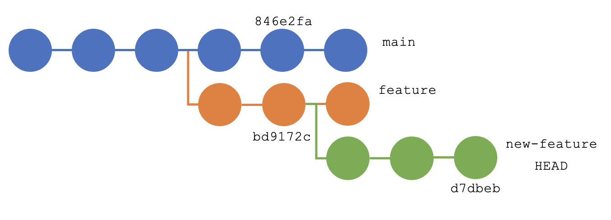

If you use git on a regular basis, no doubt you are familiar with the standard flow of things: create and check out a new feature branch, build your feature, commit, and eventually merge it into the deployable branch. 

While the specific steps in this process will vary from team to team, this is, essentially, the flow when everything is going smoothly. But what happens when things don’t go exactly as planned?

The command `git rebase --onto` is certainly not powerful enough to fix every scenario that can arise when teams start branching and merging at scale, but it is a powerful tool to have in your toolbox. And like any tool, you should be familiar with its operation. 

This guide will go over some of the scenarios in which you may want to try to use `git rebase --onto`. It will walk through some of the operation of this command and flag, and give some visual examples, as well as code, to help clarify things as you proceed. 

## What is git rebase, anyway? 

If you are unfamiliar with git rebase, essentially what it does is allow you to say, “Move the start of my branch to the head of another branch.” Below is an example. Here you have a main branch, and your current working “feature” branch. 


You have a few commits on to your branch, and, similarly, the main branch has also had a few commits merged in. 

Let’s say you want to take advantage of some of those commits in the main branch. Maybe there is a bug fix that you need to build your feature, or another feature was added that will make the implementation of your feature better somehow.

In any case, if you want to move your branch to the head of the main branch, from your working branch you would run:

```
git rebase main
```

This would result in the following scenario:


Here you can see that all of the most recent updates to the main branch are now available to you in your feature branch. 

Or maybe you have been in this scenario at some point (I know I have), where you created a new branch while working on another unrelated feature but weren’t paying attention to the branch you were on previously. 


In this case, you would not be able to merge the `new-feature` branch into `main` without also merging the first two commits to the `feature` branch. Ask my coworkers why I might include this scenario here. 

Again, running `git rebase main` from the `new-feature` branch would set things right. 


Pretty great, eh? But admittedly, as useful as this is, it is a pretty blunt instrument. What if you don’t want to include all of the commits in a certain branch? What if you don’t want to include all of the commits in your working branch? 

In the next section, you will learn about some of these scenarios. 

## Using the –onto flag

The `--onto` flag can be used for any scenario in which you might say to yourself, “I need to rebase my branch, but I need to be more specific about what commit I want to rebase from.”

Maybe there was a specific commit in the `main` branch, which fixed your bug but you aren’t quite ready to deal with any merge conflicts that might arise from pulling in commits past that point. Maybe you realized someone else on the team is working on a similar feature, and you can utilize their first two commits so you don’t have to reimplement it. Or maybe you just want to remove some of the commits in your branch. 

You will read about how to tackle specific scenarios in a moment, but first, a few words on syntax.

## How to use the –onto flag

The basic syntax goes something like this:

```
git rebase –onto <new-parent> <old-parent> <head-of-new-parent>
```

To put this into a semi-readable English sentence, you would say something like “rebase the commits whose base is `<old-parent>` on top of `<new-parent>` and make `HEAD` the `<head-of-new-parent>`.”

Clear as mud? Here is an example.

## Scenario 1: Move new-feature to a specific commit in main

Go back to the previous example where you have a `new-feature` branch based on another `feature` branch. Say there was some bug fix, or a more stable implementation of a dependency merged into the main branch. 


Now, as in the previous section, you know that if you simply wanted to move the `new-feature` branch to have its parent be the head of the main branch, you could do that with a simple `git rebase main`. No reason to get fancy if you don’t need to. 

But what if you just want to take advantage of a specific commit in `main`, without rebasing the whole branch? In this case, you would need to look at the commit hashes. 

Using `git rev-parse --short --all <branch-name>` you would get a list of hashes. Or `git log <branch-name>` would get you the same, but with more information to track down exactly the commits you are looking for. 

So using these methods, you find the following:



Here, you decide you would like to move all of the commits in the `new-feature` branch (whose parent is `bd9172c`) and move them to take advantage of everything in the `main` branch, up to and including `846e2fa` (in other words, you would like this commit to be the new parent of your branch).

Let’s say you run the following:

```
git rebase –onto 846e2fa bd9172c
```

This would have the following effect:


In this case, you notice that you did not include a third argument in the command. This is because if it is not explicitly stated, `git rebase` will default to taking the whole branch and moving it. 

But what if you want to be a bit more surgical with this rebase? The next section will look at a scenario more akin to a 3D chess move.

## Scenario 2: Move new-feature to a specific commit in main while removing the first commits in new-feature

So say you have been building out a new feature. And in doing this, you had to build out a dependency first. So you did that in your first commit. But come to find out someone on your team needed the same dependency, and it’s already merged into main. 

This scenario is a lot like the previous one, except now you not only need to move the `new-feature` branch, you also need to remove your first commit where you built out the same dependency (no reason to recreate the wheel, as they say). 

No problem! You can also do this with `git rebase –onto`. Using the same process as before to discover the necessary commit hashes, you find the following additional key commits:


To put it in plain English terms, you want to move all of the commits after (whose parent is) `e2ff2bc` and rebase them onto `846e2fa`. To do this, you still don’t need to add in the third argument. In fact, this is very similar to the previous example.

```
git rebase –onto 846e2fa e2ff2bc
```

This would result in the following:


Notice that in this case, the commit `e2ff2bc` has been effectively deleted as part of the rebase. This is because, if you recall, `git rebase –onto` uses the **parent** as a reference. To put it another way, you always reference the commit _before_ the commit you want to save. 

OK, in the next scenario, you will again do a move similar to scenarios 1 and 2. But rather than moving the whole branch as you did in scenario 1, or cutting off the first commit as you did in scenario 2, in this next example you will cut off the last commit in your branch. 

## Scenario 3: Move new-feature to a specific commit in main while removing the last commits in new-feature

In this scenario, similar to the previous two, you have written a `new-feature` branch but want to take advantage of code already merged into main, which you have duplicated.

But in this case, you didn’t duplicate it in your first commits. You duplicate it in your last ones. Again, this is no problem. And you will even take advantage of that elusive third argument. 

So again, you have run through `git log` and/or `git rev-parse` and found the commits you want to target. Something like this:


In English terms, you would again like to move all of the commits after (whose parent is) `bd9172c` and rebase them onto `846e2fa`, except you would like to omit everything after (whose parent is) `730f163`. Easy enough to do. 

```
git rebase –onto 846e2fa bd9172c 730f163
```

Running this would result in the following:


Recall that the third argument can be read as `head-of-new-parent`. So in this case you are saying that you want HEAD of the `new-feature` branch to be the commit `730f163`. This effectively deletes your last commit (or anything after it). 

OK, one more scenario, albeit a bit of a silly one.

## Scenario 4: Deleting commits in the middle of a branch

Admittedly in just about every scenario discussed, `git rebase –onto` is not the only option to reach the goal. You can of course delete the last `N` commits in a branch using `git reset --hard HEAD~N`. And `git revert <commit-hash>` or `git rebase -i <commit-hash>` will delete (or at least “remove”) an arbitrary commit from the middle of your code branch. 

But hacking is learning, and learning is hacking. Using tools in new and interesting ways can teach you new ways to get around problems. This may not necessarily be a recommended way of removing an arbitrary number of commits from the middle of a branch, but it is **a** way. 

So in this example, you have the following `feature` branch. And for whatever reason, you would like to remove the middle two commits from the branch. You have run through your git logs and have found the following reference points.


Recalling that you want to reference only the parents your command, in English what you want to do is take all of the commits after (whose parent is) `e2ff2bc` and rebase them onto `bd9172c`. Again, easy enough.

```
git rebase –onto bd9712c e2ff2bc
```

Running this results in the following:


Notice that you have effectively deleted two commits from your code base (and your git history). 

## In summary

Here I hope you have gained a better understanding of this powerful tool. It is not the tool for every situation. But it is one you should keep in your knowledge base in case you run into a scenario where it is the best fit, even if it’s just to impress your friends. 

Take a look at some of our other [git posts](https://tanzu.vmware.com/developer/tags/git/), and come back soon for more tricks!
