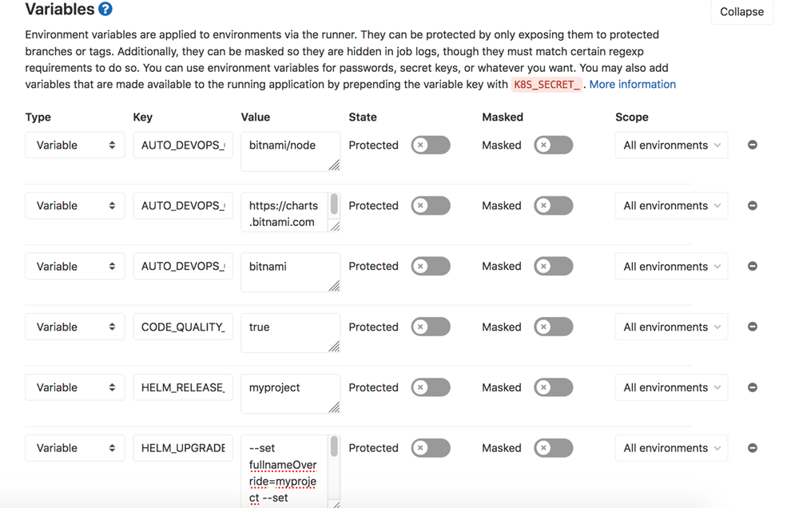
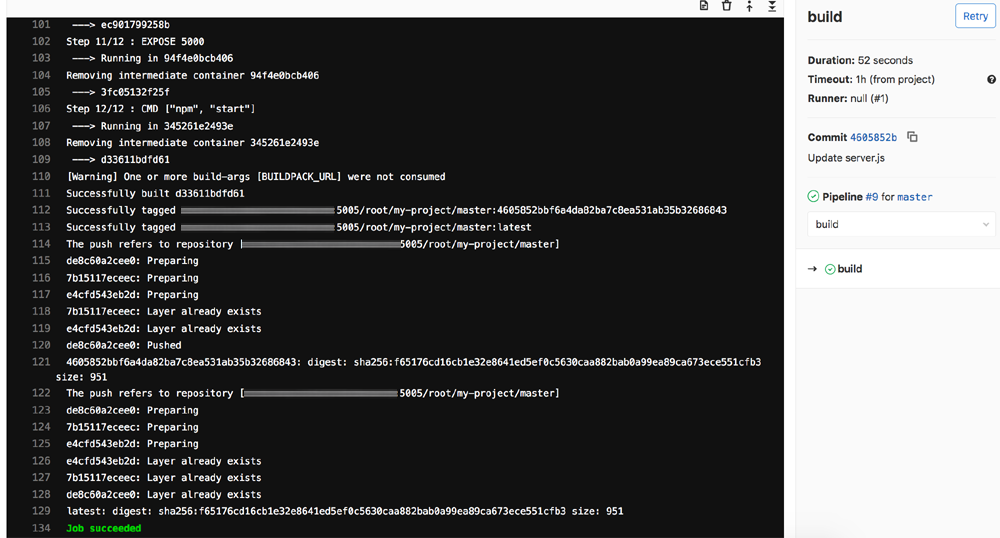
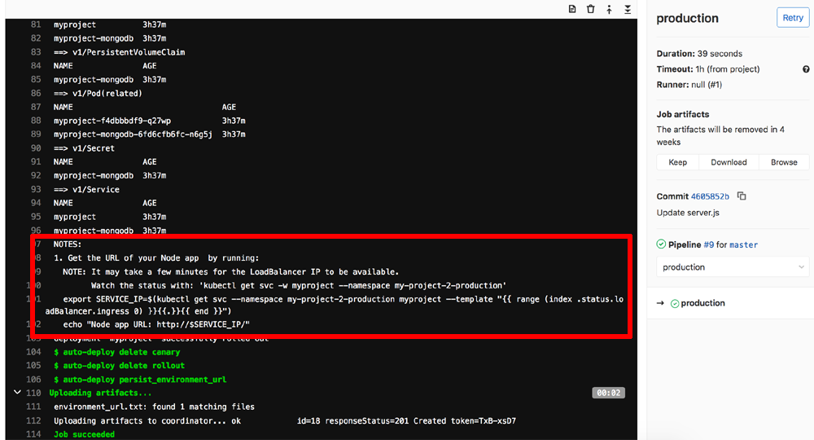
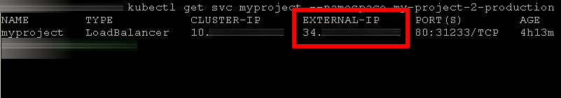
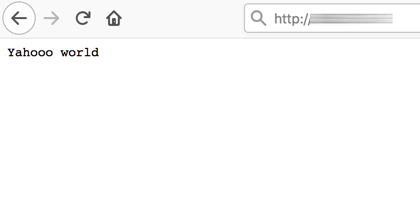

[Bitnami's GitLab CE stack](https://bitnami.com/stack/gitlab) is a popular solution for agile development teams, providing a secure and fully-functional GitLab instance for software development and deployment. GitLab CE includes a Continuous Integration and Delivery (CI/CD) system that can build, test, and deploy software updates as well as a private registry for Docker containers.

Bitnami also provides [Helm charts](https://github.com/bitnami/charts) for common applications. These charts make it easy to run applications on Kubernetes and are secure, up-to-date and built in conformance with current best practices. By combining these Helm charts with GitLab's CI/CD system, developers can quickly create custom deployment pipelines on Kubernetes infrastructure for development, testing and production scenarios.

This guide shows you how to integrate Bitnami's Helm charts with GitLab's Auto DevOps pipeline and create custom deployments on Kubernetes. With this configuration, every change to the application code in GitLab is automatically built as a Docker container and deployed to the Kubernetes cluster using [Bitnami's Node.js Helm chart](https://github.com/bitnami/charts/tree/master/bitnami/node). Bitnami's Helm charts support a number of additional parameters to ease this integration, including the ability to configure each deployment such that it is available at a public IP address for review and test. 

## Assumptions and prerequisites

This guide assumes that:

* You have deployed the [Bitnami GitLab CE stack](https://bitnami.com/stack/gitlab) on a cloud server, connected it with your Kubernetes cluster and configured a default Auto DevOps pipeline for your application. For more information on how to complete these tasks, refer to our [detailed tutorial on creating a CI/CD pipeline with GitLab and Kubernetes](https://docs.bitnami.com/tutorials/create-ci-cd-pipeline-gitlab-kubernetes/).

* Your application is a Node.js application and the application code is hosted in a GitLab repository. [Obtain the sample application's code and the Dockerfile to build it](https://docs.bitnami.com/tutorials/create-ci-cd-pipeline-gitlab-kubernetes/#step-6-commit-test-and-repeat).

{}
**Note**: Other programming languages or frameworks will require a different chart, but the broad steps to configure and integrate a custom Helm chart with GitLab's Auto DevOps will remain the same. 
{}

* You have [Git](https://git-scm.com/) and [*kubectl*](https://docs.bitnami.com/kubernetes/get-started-kubernetes#step-3-install-kubectl-command-line) installed and configured to work with your GitLab CE installation and Kubernetes cluster respectively.

## Step 1: Replace the default Auto DevOps Helm chart with a custom chart

GitLab configures the Auto DevOps pipeline with a default Helm chart, but it's possible to override this with a custom chart by either adding a chart to your code repository or, for charts hosted externally, by setting various pipeline variables that tell GitLab how to obtain the chart. In this tutorial, since the assumption is that you're using a Node.js application, the latter approach will be followed and GitLab will be configured to use the Bitnami Node.js chart from the Bitnami chart repository.

* Navigate to the project's "Settings -> CI/CD" page.
* In the "Variables" section, add the following variables and values:

  ```plaintext
  AUTO_DEVOPS_CHART=bitnami/node
  AUTO_DEVOPS_CHART_REPOSITORY=https://charts.bitnami.com/bitnami
  AUTO_DEVOPS_CHART_REPOSITORY_NAME=bitnami
  HELM_RELEASE_NAME=myproject
  HELM_UPGRADE_EXTRA_ARGS=--set fullnameOverride=myproject --set service.type=LoadBalancer --set getAppFromExternalRepository=false --set applicationPort=5000 --set image.pullSecrets={gitlab-registry} --set image.registry=
  ```

* Click "Save variables".



Here is a quick explanation of what these variables do:

* The *AUTO_DEVOPS_CHART* variable sets the name of the custom chart to use, while the *AUTO_DEVOPS_CHART_REPOSITORY* and *AUTO_DEVOPS_CHART_REPOSITORY_NAME* variables define the chart repository URL and chart repository name respectively.
* The *HELM_RELEASE_NAME* variable sets the Helm release name.
* The *HELM_UPGRADE_EXTRA_ARGS* variable sets the list of arguments to be passed to the custom chart (this varies per chart). 

For the Bitnami Node.js chart, the parameters passed via the *HELM_UPGRADE_EXTRA_ARGS* command are as follows:

* The *fullnameOverride* parameter configures the deployment name. It must be set to the same value as the *HELM_RELEASE_NAME* variable, or else Auto DevOps will fail to recognize the deployment and mark the pipeline as failed.
* The *service.type* parameter configures the deployment to be available at a public load balancer IP address so that it can be easily reviewed or tested.
* The *getAppFromExternalRepository* parameter is set to *false* because the application is already included in the generated container image and does not need to be downloaded from an external source.
* The *applicationPort* parameter exposes the application on port 5000, which is the port configured for the application in the *Dockerfile*. 
* The *image.registry* parameter is set to an empty value, because GitLab already provides its own image registry.
* The *image.pullSecrets* parameter specifies the secret holding the GitLab registry credentials. The secret is already created by Auto DevOps.

You can also view the [complete list of parameters supported by the chart](https://github.com/bitnami/charts/tree/master/bitnami/node#parameters).

{}
**Note**: Using a LoadBalancer service type will typically assign a static IP address for the deployment. Depending on your cloud provider's policies, you may incur additional charges for this static IP address.
{}

## Step 2: Commit code and test the pipeline

At this point, you are ready to commit some code to the project and have GitLab test and deploy it using the Bitnami Helm chart. This tutorial assumes that you have a simple "Hello, world" application in Node.js, together with a Dockerfile to build it. If you don't, you can [obtain the sample application's code and a Dockerfile to build it](https://docs.bitnami.com/tutorials/create-ci-cd-pipeline-gitlab-kubernetes/#step-6-commit-test-and-repeat).

* Commit a change to the application - for example, update the message "Hello world" in the *server.js* file to "Yahoo world" - and push the change to GitLab:

  ```plaintext
  sed -i 's/Hello world/Yahoo world/g' server.js
  git add .
  git commit -m "Modified message text"
  git push origin master
  ```

Pushing this commit should automatically trigger the Auto DevOps pipeline in GitLab. 

In the first stage, GitLab will attempt to build a container image containing the application code using the provided Dockerfile. The container will be pushed to the internal GitLab registry. Here's an example of the output you should see in this first stage:



Once the container image has been built and pushed, the second stage of the pipeline will attempt to deploy it to Kubernetes for review using Bitnami's Node.js Helm chart. If successful, the stage output will display the commands you must run to obtain the load balancer IP address which you can browse to in order to see the application in action. Here's an example of the output you should see in this second stage:



If you run the commands shown in the output, you should see the load balancer IP address, as shown below:



Browse to the service IP address listed in the output and you should see the output of the Node.js application, as shown below:



At this point, you have successfully customized the default Auto DevOps pipeline provided by GitLab to use Bitnami's Node.js Helm chart. Doing this ensures that your application deployments will always use a secure and up-to-date version of Node.js, while also giving you the flexibility to further customize the deployment as needed.

## Useful links

To learn more about the topics discussed in this guide, use the links below:

* [Bitnami GitLab CE stack documentation](https://docs.bitnami.com/general/apps/gitlab/)
* [Bitnami Node.js container](https://github.com/bitnami/bitnami-docker-node)
* [Bitnami Node.js Helm chart](https://github.com/bitnami/charts/tree/master/bitnami/node)
* [GitLab documentation](https://docs.gitlab.com)