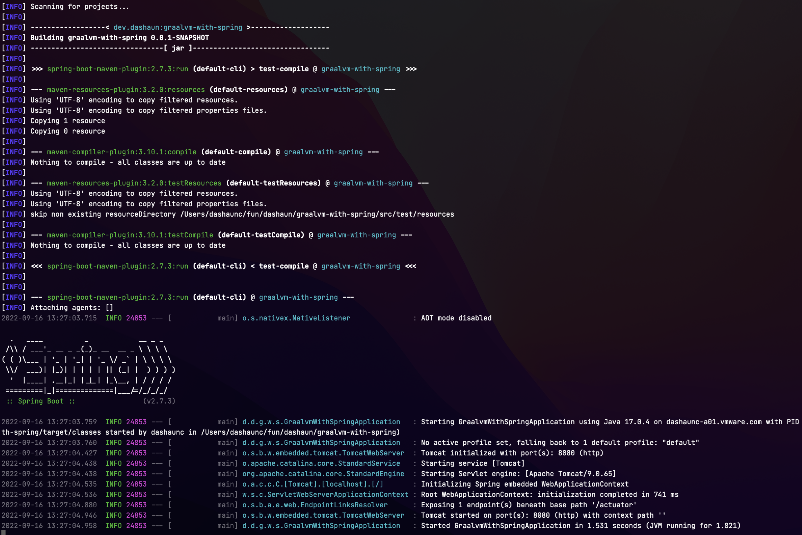
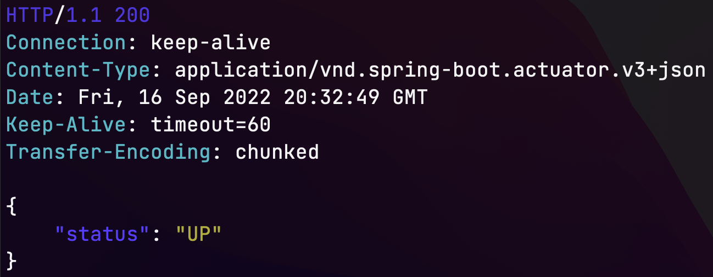
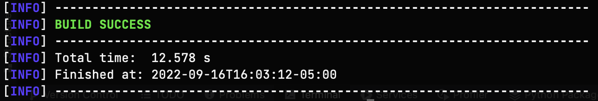
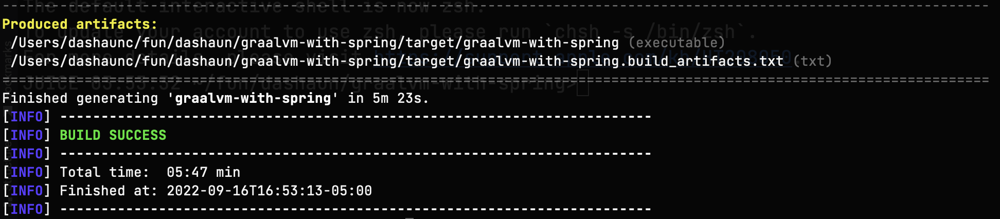
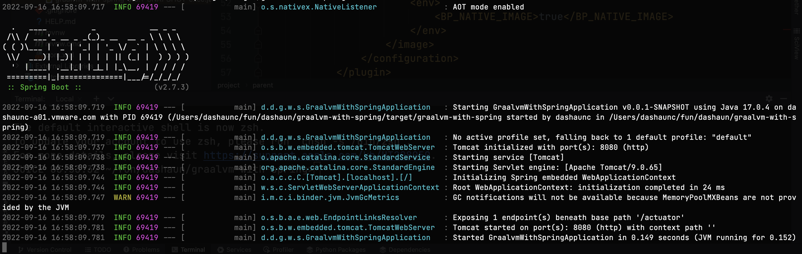

In this guide, you will learn how to create native images with Spring and GraalVM.
The resulting native executable will require less RAM, startup in milliseconds and be suitable for serverless use cases. 

### What Is GraalVM?

For the purpose of this guide, think of GraalVM as a JDK with two modes.

* Just in time (JIT) compiling 
* Ahead of time (AOT) compiling

The [GraalVM documentation](https://www.graalvm.org/docs/introduction/) has more information if you are interested.

### Before You Begin

You'll need to make sure two items are installed before starting this guide:

1. GraalVM JDK (latest version)
2. Native image extensions for the GraalVM JDK

```bash
# Install sdkman
curl -s "https://get.sdkman.io" | bash
# Install latest GraalVM version of Java 17
sdk install java 22.2.r17-grl
# Verify java version OpenJDK version 17 with GraalVM
java -version
# Install the native image extensions
gu install native-image
```

### Using GraalVM With Spring

You are probably familiar with [start.spring.io](https://start.spring.io).

If not, there are other guides that show you how to use the website.
* [Building an API with Spring Boot](https://tanzu.vmware.com/developer/guides/spring-build-api/)
* [Spring for GraphQL](https://tanzu.vmware.com/developer/guides/spring-for-graphql/)

You can use the website or `curl` to initialize your project
with the Spring Initializr Web API.

You are going to configure four different options for this guide.

1. Choose Spring Boot 2.7.3
2. Name the artifact
3. Choose Java 17
4. Include the `web`,`actuator` and `spring native` dependencies

```bash
# Make a new directory for your application
mkdir graalvm-with-spring
# Move into that directory
cd graalvm-with-spring
# Initialize a project via the Spring Initializer Web API
curl https://start.spring.io/starter.tgz \
-d bootVersion=2.7.3.RELEASE \
-d groupId=dev.dashaun \
-d artifactId=graalvm-with-spring \
-d name=graalvm-with-spring \
-d packageName=dev.dashaun.graalvm.with.spring \
-d dependencies=web,actuator,native \
-d javaVersion=17 | tar -xzf -
```

You now have application sources needed for your Spring Boot app, ready to run!

#### JIT compiling

Compile the Spring Boot app using the [Spring Boot Maven Plugin](https://docs.spring.io/spring-boot/docs/current/maven-plugin/reference/htmlsingle/).
Note that Spring Initializr included the plugin and a usable version of Maven along with our application sources.

```bash
./mvnw spring-boot:run
```
Example output:


With your application started, you can check its health at `http://localhost:8080/actuator/health`

```bash
# Use httpie to access the healthcheck endpoint
http :8080/actuator/health
```

Example output:


Your application is up and running and reporting that its healthy.
GraalVM with JIT compiling, doesn't require any extra thought it works similar to other Java Virtual Machines (JVM).

#### Start up time

From the last line of the image above:
```
Started GraalvmWithSpringApplication in 1.531 seconds (JVM running for 1.821)
```
You should see something similar.
Note that the process ID (PID) of the application is included in each log line, after the log level.
In the example above `INFO 24853` shows up on each log line.
The PID is therefore `24853` you will use the PID later in the guide.

#### Memory usage

Check how much memory your application is using, by using the PID.

```bash
#On Mac use `vmmap`
$ vmmap 24853 | grep Physical
Physical footprint:         115.1M
Physical footprint (peak):  115.1M
$
```

#### Packaging

Terminate your running application.
Package your application into a `jar` file.
This will be used for the last two metrics in this guide.

```bash
./mvnw clean package -DskipTests
```

Example output:


In the above example it took `12.578s` to package.
The `jar` file that was created will run on any JVM.

#### Size on Disk

```bash
#On Mac look at the file size of the jar
$ ls -lh target/*.jar | awk '{ print $5; }'
19M
$
```

The size of the `jar` file is 19M.

#### You have just used the GraalVM JDK with JIT Compiling!

#### AOT compiling

Spring Initializr created a `native` profile when you added the `spring-native` dependency.

#### Packaging

In order to use the AOT compilation, you need to use the `native` profile.

```bash
./mvnw -Pnative clean package -DskipTests
```
> The warnings can safely be ignored for this guide.

You will see that this approach takes much longer, 
as AOT compiling evaluates all the accessible branches of code.



In this example, the build took over 5 minutes.

Additionally, the resulting binary can only be executed on the same operating system (OS) and CPU architecture.

#### Running

The package output is a statically linked binary that can be executed natively.
Everything needed to run the application is included.

```bash
# Execute the native binary
./target/graalvm-with-spring
```

Example output:


We can verify the output, at the same location, using the same commands.

```bash
# Use HTTPie to access the healthcheck endpoint
http :8080/actuator/health
```

#### Start up time

From the above example we can see the startup time on the last line of the output.

```
Started GraalvmWithSpringApplication in 0.149 seconds (JVM running for 0.152)
```

This is an order of magnitude faster startup.

#### Memory Usage

You will see the PID in the logs, exactly as before.
Use the PID to see how much memory is being used.

```bash
$ vmmap 69419 | grep Physical
Physical footprint:         31.6M
Physical footprint (peak):  31.6M
$
```

This execution uses less than 30% of the memory from the previous example.

#### Size on disk

```bash
#On Mac look at the file size of the jar
$ ls -lh target/graalvm-with-spring | awk '{ print $5; }'
62M
$
```

The statically linked binary is `62M` but includes everything it needs from the JVM.

#### Summary

For some workloads, AOT compiling is the right choice 
even though it takes longer up front.
The result is a statically linked binary
that will consume less resources at runtime and starts up faster.

#### Keep Learning

[Spring Native Documentation](https://docs.spring.io/spring-native/docs/current/reference/htmlsingle/)
[GraalVM](https://www.graalvm.org/)