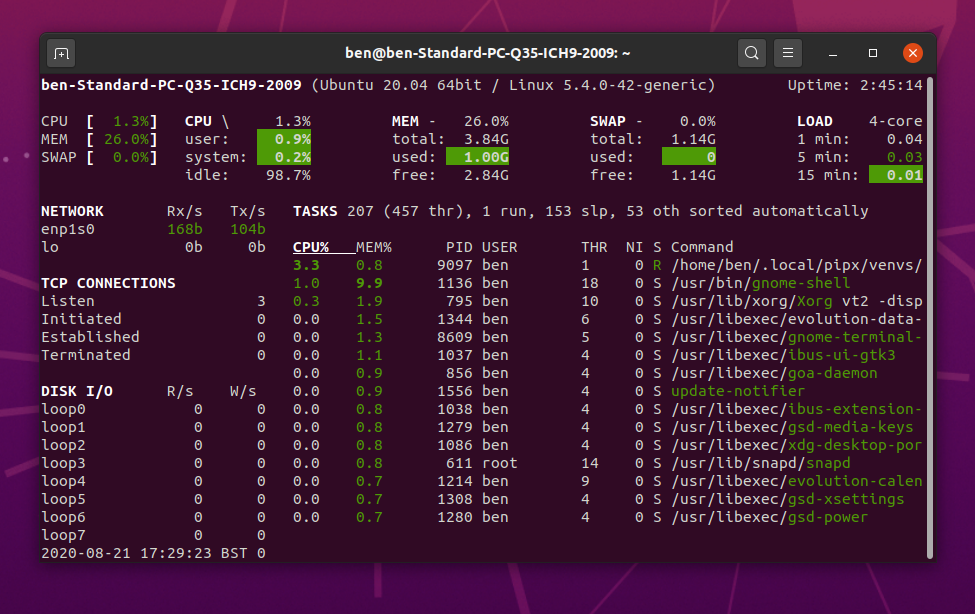
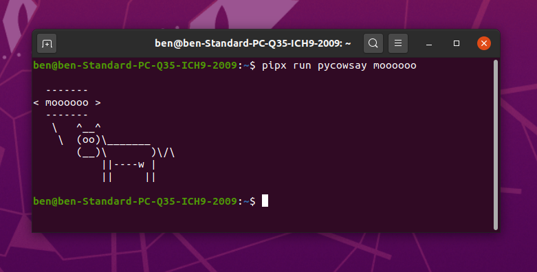

## Why You Need This Guide

There are loads of super-useful Python-based tools available in the [Python Package Installer][pip] --- also known as 'pip'. [MyPy][mypy] the static type checker, [Flake8][flake8] the awesome code linter, [Black][black] the 'uncompromising code formatter,' and [Glances][glances] the 'eye on your system,' are all great examples. These are Python packages that are useful globally, across all your Python projects, and beyond! 

But, as detailed in [pip's CLI tools documentation][pip-cli-tools-docs], "_installing packages and their dependencies to the same global environment can cause version conflicts, and break dependencies that the operating system has on Python packages_."

Unsurprisingly, the bright folks in 'python-land' have a solution to this problem --- in the form of [PipX][pipx]. PipX is a tool that allows the installation of Python packages in an isolated environment. Because PipX isolates them, their installation won't disrupt each other or your system. 

Follow the steps below to get started with PipX.

## Before You Start

[Ubuntu 20.04 LTS][ubuntu] provides the reference baseline operating system for this guide. Many Python developers use Linux, and Ubuntu is the most popular Linux distribution. Microsoft also distributes Ubuntu as part of the [Windows Subsystem for Linux][wsl], so it's available to most Windows 10 users. On Mac OS, most of the tools shown here are available from Homebrew.

When following this guide, it helps if you're starting from a clean system. That way, any existing or additional Python installs can't cause issues or confusion as you follow the steps below. If your system isn't clean, try following this guide in a new virtual machine first, so you know what to expect when you try it for real.

Finally, if you'd prefer to watch a video on this guide, scroll down to the bottom of the page and hit 'play.'

### Step 1: Install Pip And PipX

To install [PipX][pipx], you first need to install [pip][pip] into your system's Python environment. In Ubuntu --- and WSL environments based upon Ubuntu --- that means adding some packages from the built-in Ubuntu package manager like so:

```bash
sudo apt install python3-pip python3-venv
```

Now those packages are installed, go ahead and install [pipx][pipx] using pip, the system version of Python, and the following commands:

```bash
python3 -m pip install --user pipx
python3 -m pipx ensurepath
```

Now close your terminal for those changes to take effect.

```bash
exit
```

### Step 2: Install A Global Command Line Package With PipX

Open a new terminal window and test that `pipx` works by calling up pipx's built-in help.

```bash
pipx --help
```

The help details all the PipX commands. Now try installing the [Glances][glances] package globally using `pipx install` as follows:

```bash
pipx install glances
```

After you see the message confirming the installation is complete, run the glances command-line tool by typing `glances` at the prompt as follows:

```bash
glances
```

The Glances tool will start and show you various live statistics about your computer.



{}
**Note**: What's cool about [Glances][glances] is that it's cross-platform, can run in the terminal, but also offers a way for you to access the machine stats over the network using a web browser. Pretty neat!
{}


Quit glances by issuing the stop command `Ctrl-C`. 

To check the installation of Glances has not altered your system's `pip` packages, use the `pip list` command.  Glances will _not_ appear on this list.

To see a list of tools installed by `pipx`, use the `pipx list` command. You will see that Glances _is_ present on this list.

### Step 3: Run A Tool Without Installation With PipX 

When you're unsure if a package is right for you, PipX offers a way to try the package without installing it. Let's try this feature using the fun --- but mostly useless --- `pycowsay` package:

```bash
pipx run pycowsay mooooooo
```

The first argument after `pipx run` is always assumed to be the name of the package you would like to run. PipX will download `pycowsay` and run it in a temporary virtual environment. Any arguments after the package name go straight to the package you're running. The result of the command is the classic cow saying `moooooo` as seen in the screenshot below:




If you decide that `pycowsay` is definitely for you, you can install it permanently using the `pipx install` command you saw in Step 2.

## Keep Leaning

To find out more about PipX, check out the [PipX website][pipx], the [PipX docs][pipx-docs] or try `pipx --help`. To get help on a specific command type `pipx <command> --help`.

If you liked this guide, you might like the others in our 'Python Like A Pro' series:

- [Install Python Like A Pro!][gs-pyenv]
- [Managing Python Project Dependencies Like A Pro!][gs-pyenv-venv]
- [Build Python Docker Containers Like A Pro!][gs-cnb]
- [Run Python In Production Like A Pro!][gs-cf]

Here's the video to accompany this guide.



---


[pip]: https://pip.pypa.io/en/stable/
[pipx]: https://pipxproject.github.io/pipx/
[pipx-docs]: https://pipxproject.github.io/pipx/docs/
[pip-docs]: https://packaging.python.org/guides/installing-using-linux-tools/
[pip-cli-tools-docs]: https://packaging.python.org/guides/installing-stand-alone-command-line-tools/
[pip-linux]: https://packaging.python.org/guides/installing-using-linux-tools/
[ubuntu]: https://ubuntu.com/download/desktop
[wsl]: https://ubuntu.com/wsl
[glances]: https://nicolargo.github.io/glances/
[black]: https://black.readthedocs.io/en/stable/
[flake8]: https://flake8.pycqa.org/en/latest/
[mypy]: http://www.mypy-lang.org/

[gs-pyenv]: /guides/python/gs-python-like-a-pro
[gs-pyenv-venv]: /guides/python/gs-managing-python-packages
[gs-pipx]: /guides/python/gs-python-installing-global-packages
[gs-cnb]: /guides/python/cnb-gs-python
[gs-cf]: /guides/python/cf-gs

[playlist]: https://www.youtube.com/playlist?list=PLAdzTan_eSPRmqaxkzGISNNjok4F0SAAP