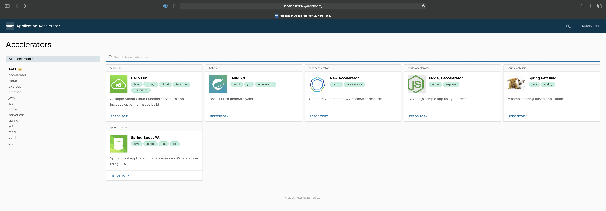
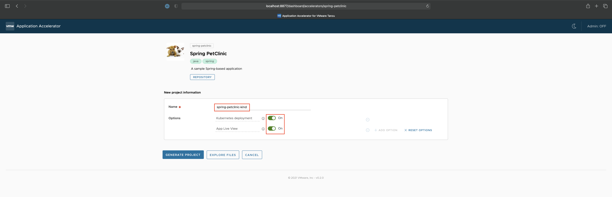
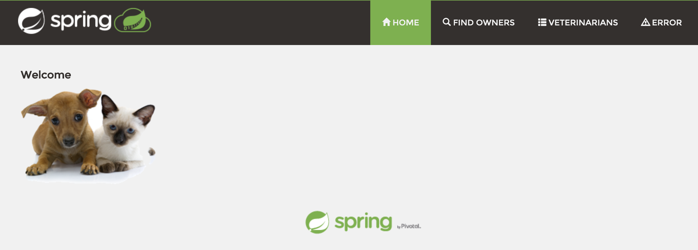

{} 
This post is for getting started with Beta 1. On October 5th 2021, VMware Tanzu Application Platform Beta 2 was released. And since then, other Betas have been released. Get more information on Tanzu Application Platform [here](https://tanzu.vmware.com/application-platform). 
{}

Now that you have been introduced to the VMware Tanzu Application Platform and its resources in my ["Getting Started with Tanzu Application Platform Beta 1"](/blog/getting-started-with-vmware-tanzu-application-platform-beta-1/) blog post, and learned to install all the individual components of the Tanzu Application Platform, Beta 1 in my [part 1](/guides/kubernetes/gs-tap-on-kind-pt1/) guide, you are ready to dive into the second and final post in this guide series. This one describes how you can use the Tanzu Application Platform to deploy a workload.

In this guide, you will use Application Accelerator for VMware Tanzu to start a new project from existing application code. Then you will set up automation to continually monitor and build that code into runnable containers using VMware Tanzu Build Service and a declarative image configuration.

Again, much as the previous install guide in [part 1](/guides/kubernetes/gs-tap-on-kind-pt1/) leveraged the [official install documentation](https://docs.vmware.com/en/VMware-Tanzu-Application-Platform/0.1/tap-0-1/GUID-install.html), this guide will leverage the [official tutorial](https://docs.vmware.com/en/VMware-Tanzu-Application-Platform/0.1/tap-0-1/GUID-tutorial.html) and largely take you through the same flow. Although some parts will be modified for this use case of a KIND deployment.


## Setting Up the Scenario

For the purpose of this guide, you are playing the part of a developer working for a company that specializes in veterinary IT systems. For today's task, your new client is asking for custom front office software that lets them track clients, their pets, appointments, and so on. 

Your company uses the Tanzu Application Platform, along with all its components, and already has a base application set up for this type of request. After all, this is not the first time your organization has built custom, front desk software for clients. 

So that is where you start. At the creation of this new project. 

## Starting a New Coding Project

Here, you will be accessing Application Accelerator for Tanzu and starting a new project for your client. 

1. Forward a port from KIND to your host. KIND does not include a `LoadBalancer`. This is one of the "gotchas" of using KIND for VMware Tanzu Application Platform referenced in the caveats section at the beginning of this series. So, the most straightforward way (not necessarily the only way) to gain access to services is with a `port-forward`. For example,
    ```
    kubectl port-forward svc/acc-ui-server 8877:80 -n accelerator-system 
    ```
    If you want to find this port, run `kubectl get svc -A` to get all services. The service you want to access is called `acc-ui-server`. This service uses port 80. Forward that to any open port on your host. Note, `8877` is used in the above example because it was an open option. 
    
    You are going to need to open an additional terminal window or tab while this is running. Make sure you are in the correct working directory after opening. 

2. Access the Application Accelerator for Tanzu web user interface.
    ```
    open http://localhost:8877/dashboard
    ```



3. Do all the following:

Click the `Spring Petclinic` starter template. 
Rename the project to `spring-petclinic-kind`. 
Enable `Kubernetes Deployment` and `App Live View`. 
Click `Generate Project`. This will pull down the application starter package to your Downloads folder. 

 

 4. Move the bundle into your current working directory. 
    ```
    mv ~/Downloads/spring-petclinic-kind.zip .
    ```

5. Unzip the application package.
    ```
    unzip spring-petclinic-kind.zip
    ```

6. Push this directory to your GitHub repository. To do this, you need to create a repository in GitHub. There is a good tutorial for how to do that [here](https://docs.github.com/en/get-started/quickstart/create-a-repo). 

7. Name this directory `spring-petclinic-kind`. It is the same name as your project and directory. 

8. Once this is created, change directories to the root code repository directory.
    ```
    cd spring-petclinic-kind
    ```
    `init` the directory as a GitHub repo.
    ```
    git init
    ```
    Add all files to be committed.
    ```
    git add .
    ```
    Commit all files for `push`.
    ```
    git commit -m "first commit"
    ```
    Rename your current branch to `main`.
    ```
    git branch -M main
    ```
    Add your new repo as the remote origin.
    ```
    git remote add origin https://github.com/anthonyvetter/spring-petclinic-kind.git
    ```
    Push the code to your repository.
    ```
    git push -u origin main
    ```

## Creating a Deployable Container

In this section you will be creating a declarative image configuration file that Tanzu Application Platform uses to continually and automatically keep your application image up-to-date whenever something changes. 

1. Go back to the `gs-tap-on-kind` directory.
    ```
    cd ..
    ```

2. Start by opening `image.yaml`. Modify the file so that it includes your correct Docker Hub and GitHub usernames so that the URL paths make sense. These lines are noted with `# change this`. 
    ```
    code image.yaml
    ```

3. Apply this image configuration to your cluster. The custom resource definitions set up by the Tanzu Build Service component of Tanzu Application Platform will take over and begin building your image. 
    ```
    kubectl apply -f image.yaml -n tap-install
    ```

4. List the builds in this environment.
    ```
    kp build list spring-petclinic-kind -n tap-install
    ```
    output:
    ```
    BUILD    STATUS      IMAGE    REASON
    1        BUILDING             CONFIG
    ```

5. Optionally, you can stream the logs locally and watch as Tanzu Build Service uses Cloud Native Buildpacks to build your application code into a runnable container. 
    ```
    kp build logs spring-petclinic-kind -n tap-install
    ```
    This will take a few minutes to build. Once it is done building, go to the next phase.

## Creating an Application Deployment Strategy

This phase does the same for deployments that creating a declarative image configuration in Tanzu Build Services will do when it continually and automatically monitors your application dependencies, and builds new containers, as necessary.

Using a declarative deployment configuration, Tanzu Application Platform will watch for new containers being built, and automatically deploy them as necessary.

1. Open `kapp-deploy-spring-petclinic.yaml`.
    ```
    code kapp-deploy-spring-petclinic.yaml
    ```
    This is the deployment configuration file for the project. It creates an instance of the application, and configures it to run on top of the knative runtime. 

2. Apply the deployment configuration file.
    ```
    kubectl apply -f kapp-deploy-spring-petclinic.yaml -n tap-install
    ```

3. Wait for the application pods to become ready.
    ```
    kubectl get pods -n tap-install --watch
    ```
    The application pods should be ready in a minute or less. Once done, go to the next phase.

## Accessing the Application and Application Metrics

Now that your application is deployed, let's access it. As in previous steps, one drawback of using KIND is no ingress `LoadBalancer` included for accessing the application. As such, we need to forward ports to access our application.

You will also access Application Live View. Here, you can look at statistics for your application and dive into the resources used, uptime, and so on. 

1. Find the proper `petclinic` pod and port.
    ```
    kubectl get pods -n tap-install
    ```
    output:
    ```
    NAME                                                   READY   STATUS      RESTARTS   AGE
    application-live-view-connector-658975c746-sj4ld       1/1     Running     0          96m 
    application-live-view-crd-controller-dd86785cd-lv6tc   1/1     Running     0          96m
    application-live-view-server-7cf45b55f5-ks56b          1/1     Running     0          96m
    coredns-6dc5c67fc9-nt8hr                               1/1     Running     0          103m
    petclinic-00001-deployment-94f5764df-kp52m             2/2     Running     0          36s
    spring-petclinic-kind-build-1-pzz9s-build-pod          0/1     Completed   0          82m
    spring-petclinic-kind-build-2-kx8rl-build-pod          0/1     Completed   0          30m
    spring-petclinic-kind-build-3-q74dv-build-pod          0/1     Completed   0          21m
    spring-petclinic-kind-build-4-n9psc-build-pod          0/1     Completed   0          14m
    spring-petclinic-kind-build-5-wqbz7-build-pod          0/1     Completed   0          9m
    ```
    Here, the pod you are interested in starts with `petclinic-00001-deployment-`. The other pod names vary, so modifying the next few commands will be necessary. 

2. Forward the port `8080`. You can find it in the application configuration located in the `/kubernetes/services.yaml` file within the application repository. 

But another way to find the pod is to `describe` it. Do that here.
    ```
    kubectl describe pod petclinic-00001-deployment-94f5764df-kp52m -n tap-install
    ```
    output (truncated):
    ```
    [...]
    Containers:
        user-container:
        [...]
        Environment:
            PORT:             8080
            K_REVISION:       petclinic-00001
            K_CONFIGURATION:  petclinic
            K_SERVICE:        petclinic
    [...]
    ``` 

3. Forward this port to your host.
    ```
    kubectl -n tap-install port-forward pod/petclinic-00001-deployment-94f5764df-kp52m 8080:8080
    ```
4. Since this is a running service, you will need to open another terminal window to continue with this guide. Be sure you are in the proper working directory once the new terminal is open. 

5. Open your browser to `localhost:8080` and view the running application.
    ```
    open http://localhost:8080
    ```


6. Access Application Live View for VMware Tanzu to take a look at your applications runtime metrics. This will require a port forward. You can find the port here by listing your services.
    ```
    kubectl get svc -n tap-install
    ```
    output:
    ```
    NAME                         TYPE           CLUSTER-IP      EXTERNAL-IP                                PORT(S)                                      AGE
    application-live-view-5112   LoadBalancer   10.96.59.140    <pending>                                  5112:31769/TCP                               134m
    application-live-view-7000   ClusterIP      10.96.15.108    <none>                                     7000/TCP                                     134m
    coredns                      NodePort       10.96.2.69      <none>                                     53:30053/UDP,53:30053/TCP,9153:32759/TCP     142m
    petclinic                    ExternalName   <none>          envoy.contour-internal.svc.cluster.local   80/TCP                                       35m
    petclinic-00001              ClusterIP      10.96.162.158   <none>                                     80/TCP                                       35m
    petclinic-00001-private      ClusterIP      10.96.71.0      <none>                                     80/TCP,9090/TCP,9091/TCP,8022/TCP,8012/TCP   35m
    ```
    Here, the one you are interested in is the `LoadBalancer` service called `application-live-view-5112`.

7. Port forward this service to your host.
    ```
    kubectl -n tap-install port-forward svc/application-live-view-5112 5112:5112
    ```
8. Since this is a running service, open another terminal window to continue with this guide. Be sure you are in the proper working directory once the new terminal is open. 

9. Open your browser to `localhost:5112` and view Application Live View for VMware Tanzu. Click around and explore your application.
    ```
    open http://localhost:5112
    ```

## Next Steps

That's it for this guide! You have successfully deployed the Tanzu Application Platform, deployed a workload, and used every component along the way. So what are some other things you could do to continue your learning?

1. Make some code changes! As a developer, this is the core to your day-to-day, and a huge part of what your experience will be working with Tanzu Application Platform. Make a code change to your application. I suggest `/src/main/resources/messages/messages.properties` for a good place to make some easy changes if you are not familiar with Java or Spring. 

2. Scale your application and watch the changes in Application Live View for VMware Tanzu! In `/kubernetes/deployment.yaml`, you can increase the replica count. Push this change and watch Tanzu Application Platform take over. 

3. Deploy on other platforms! KIND is great for certain things, but other platforms have value too. Try `minikube` for another local option. Or Amazon Web Services (AWS) or Azure for cloud options. It's a great way to continue to learn the system.

Be on the lookout for future updates to this Beta. I will try to keep these posts updated as new information is released. 