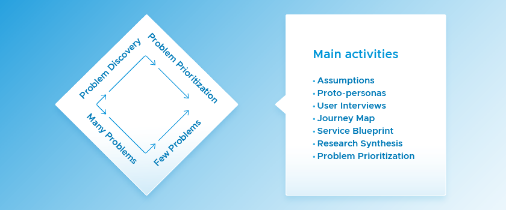
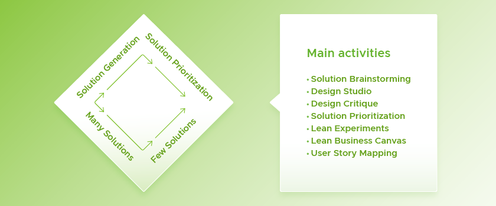
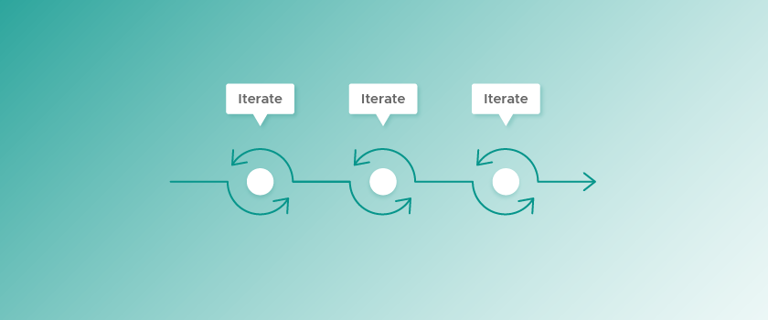

Discovery and Framing is a set of activities that enables a product team to reduce risk before starting delivery. The goal is to learn enough to start building a product that is valuable, usable, and feasible.

As the name suggests, it is divided into two stages: 

1. During Discovery, the team focuses on comprehensively understanding the problem space. This is followed by activities that prioritize which user problem to solve first. 
2. In Framing, the team focuses on reducing risk by validating a solution. During Framing, the team again goes wide and explores a range of possible solutions before using prioritization, concept testing, and experiments to iterate and focus down on a viable starting point. 

 

Discovery and Framing is often represented with a “double diamond” diagram which shows how teams pass through these different stages of _divergent_ and _convergent_ thinking.

## Who takes part in Discovery and Framing

Discovery and Framing is a journey for a [balanced team](https://tanzu.vmware.com/developer/learningpaths/application-development/balanced-teams/). Often this includes product designers, product managers, and engineers but, depending on the domain, this might also include subject matter experts (e.g., legal, financial, etc.), technical architects, end users, or other people who’ll be closely involved in shaping the product. 

A diverse, balanced team approach: 

* Ensures a range of perspectives
* Results in solutions that are both usable and feasible to build
* Aligns the entire team on why the product is worth building 

In parallel to the product discovery phase mentioned here, it might be valuable to run a technical discovery. This may involve activities such as [value stream mapping](https://tanzu.vmware.com/developer/practices/value-stream-map/), pipeline and codebase set up, and pushing a skeleton app through to the production environment to ensure that the team can start building and iterating as soon as they have defined a viable starting point for the product.

## Discovery

The goal of the Discovery phase is to clearly define an important problem that, if solved, will deliver the highest business and user value. Discovery typically happens over a fast-paced, two to three week period during which you’ll extensively learn about your users, problem space, the business drivers, and any existing technology or technical constraints.

Later on, you’ll take your chosen problem into the Framing phase, where you will focus on designing a solution.

There are many different workshops and activities you can run during this stage. Visit [Tanzu Labs Practices](https://tanzu.vmware.com/developer/practices/?filters=framing) for detailed workshop guides to use in Discovery.

The following are some of the main areas of activity you should cover during Discovery.

### Understand the business

A team often begins Discovery with a set of assumptions about the desired business outcome or the problems they should be solving for users. 

Your team should [capture these assumptions](https://tanzu.vmware.com/developer/practices/assumptions/) by involving a wide range of stakeholders and subject matter experts. The assumptions, particularly those that pose the most risk to product success, will help to guide your research efforts.

### Understand users

Once you’ve identified the underlying assumptions, engage with end users and subject matter experts to validate or invalidate those assumptions. It often helps to draw up some [proto-personas](https://tanzu.vmware.com/developer/practices/personas/) to help you decide which users to target.

You can employ [user research methods](https://tanzu.vmware.com/developer/practices/user-research-introduction-session/) such as 1:1 interviews with users or observing users in context. Although you will gather a lot of additional information, your focus will be on testing your riskiest assumptions. This helps your research remain efficient, effective, and focused.

Tools like [journey maps](https://tanzu.vmware.com/developer/practices/journey-map/) and [service blueprints](https://tanzu.vmware.com/developer/practices/service-blueprint/) can capture existing workflows and interactions, as well as visualizing pain points and opportunities. 

Throughout Discovery you will hear user comments that both confirm and conflict with your initial beliefs. [User research synthesis](https://tanzu.vmware.com/developer/practices/research-synthesis/) is a process that allows you to step back from your personal feelings and look objectively at the notes and data you’ve captured. During synthesis you’ll look across all of the research data and pull out key insights, patterns, and problems.

One common research pitfall is to jump to solutions too quickly. For example, you might get excited about building a possible feature or product and let that potential solution blind you to other, more interesting directions. Stay focused on needs, challenges, and behaviors during this stage. 

### Prioritize the key problem to solve

Your discovery will have uncovered various user problems—likely, too many to tackle at once. An important step in Discovery is to go through [problem prioritization](https://tanzu.vmware.com/developer/practices/problem-prioritization) to pick the problem you will focus on. 

As always, it’s important to involve the whole team. A team that has conducted the research and synthesized the learnings together is well positioned to do the hard work of prioritization.

Prioritization can be difficult because problems are often connected to one another, and we also like to take on as much as we can. You can break this habit by using a prioritization framework, such as the [2x2 matrix](https://tanzu.vmware.com/developer/practices/2x2/), that helps balance different decision-making factors. 

Ranking the problems by their relative business and user value is a great way to begin the decision-making process. If you’ve been creating proto-personas, now is also a great time to revisit these and prioritize which user segment you will solve problems for. 

Next, prioritize the relative feasibility or ease of solving these problems, and be sure to involve engineers, so as to keep this grounded in technical expertise. 

Your goal is to agree on a single problem that is both highly valuable, but also feasible to solve. 

This ruthless prioritization of a single problem over all others can feel like a risk itself, so it’s important to remember that this is actually a starting point. Focusing the team allows you to ship quickly and get clear data to determine if your product is solving the initial problem you identified. If you try to solve too much at once, you risk taking longer to ship and feedback loops will be longer and less conclusive.

## Framing

During Framing, your team’s goal is to determine a suitable starting point for building your product based on the problems you’ve identified in Discovery. During this stage you’ll explore, evaluate, and iterate on potential solutions.

There are many different workshops and activities you can run during this stage. Visit [Tanzu Labs Practices](https://tanzu.vmware.com/developer/practices/?filters=framing) for detailed workshop guides to use in Framing.

The following are some of the main areas of activity you should cover during Framing.

### Explore many solutions 

Framing often starts by generating many possible solutions that address your prioritized problem. Collaborative exercises, like [solution brainstorming](https://tanzu.vmware.com/developer/practices/solution-brainstorming/) or [design studios](https://tanzu.vmware.com/developer/practices/design-studio/), use the collective creativity of the team to quickly generate many options.

You shouldn’t feel limited to software ideas. Business processes and services, technical architectures, and other approaches may provide better solutions than software, so make sure to explore the whole range of opportunities.

Just as you include all team members in the Discovery process to ensure a shared understanding of the problem, it’s best to keep the team together during Framing as well. Having a balanced team working together to generate and evaluate solutions ensures that their unique insights and perspectives are included in a design early on. One activity that will gather early feedback from the team is [design critique](https://tanzu.vmware.com/developer/practices/design-critique/).

### Focus on a high-value starting point

Moving quickly isn’t about how fast you work, it’s about prioritizing effectively. Remember your framework for prioritizing problems? To prioritize solutions, you can use a similar [2x2 framework ](https://tanzu.vmware.com/developer/practices/solution-prioritization/)that weighs user and business values against technical complexity, and thereby find a high-value, low-complexity starting point.

Other times, you might choose to tackle a complex technical element early because it appears to be necessary for delivering value, but is also risky. In this case, consider building a proof of concept—the highest value core functionality pared down to its simplest form to quickly show whether it is feasible.

From here, you can begin evolving and iterating the product concept based on the initial high-value feature you’ve validated. 

### Run experiments to test concepts

As your team moves through the product design process, you’ll continually generate ideas about what will deliver value for users. 

These ideas contain assumptions. Some are low risk and easy to iterate on; others are high risk. If wrong, your team might build something of little value and waste all its effort. 

Build simple prototypes and use experiments to reduce those big risks. [Lean experiments](https://tanzu.vmware.com/developer/practices/lean-experiments/) are structured, short learning activities for testing our ideas and assumptions. They set out to validate the riskiest “leap of faith” assumptions in the quickest, cheapest way possible.

### Define your value proposition and metrics for success

Collaborate with your team and stakeholders to develop a value proposition. Make sure you revisit your goals, explaining how the product will drive business and user value and defining metrics to measure this. If you haven’t built one already, you can use a [lean business canvas](https://tanzu.vmware.com/developer/practices/lean-business-canvas/) to summarize who your early adopters will be, your value proposition, business assumptions, and key success metrics. 

## Moving into Delivery

The goal of Discovery and Framing is not to understand the entire problem ecosystem, or to design your entire product up front. Agreement on a single, validated feature and an initial backlog of [user stories](https://tanzu.vmware.com/developer/practices/user-stories/) is usually enough to start delivery.

You might know, for example, that your product has certain integrations, but you might not know exactly what data you need. That is enough for engineering to start building, while implementation details are discovered through research or user feedback.

You will learn most from putting working software into the hands of your users, because user research does not stop as you begin delivering software. 

In fact, feedback from your users will become _more_ vital as you ship features to production, continually prioritize your backlog of user stories, and iterate your [outcome-based roadmap](https://tanzu.vmware.com/developer/practices/outcome-oriented-roadmap/) from what you learn.
