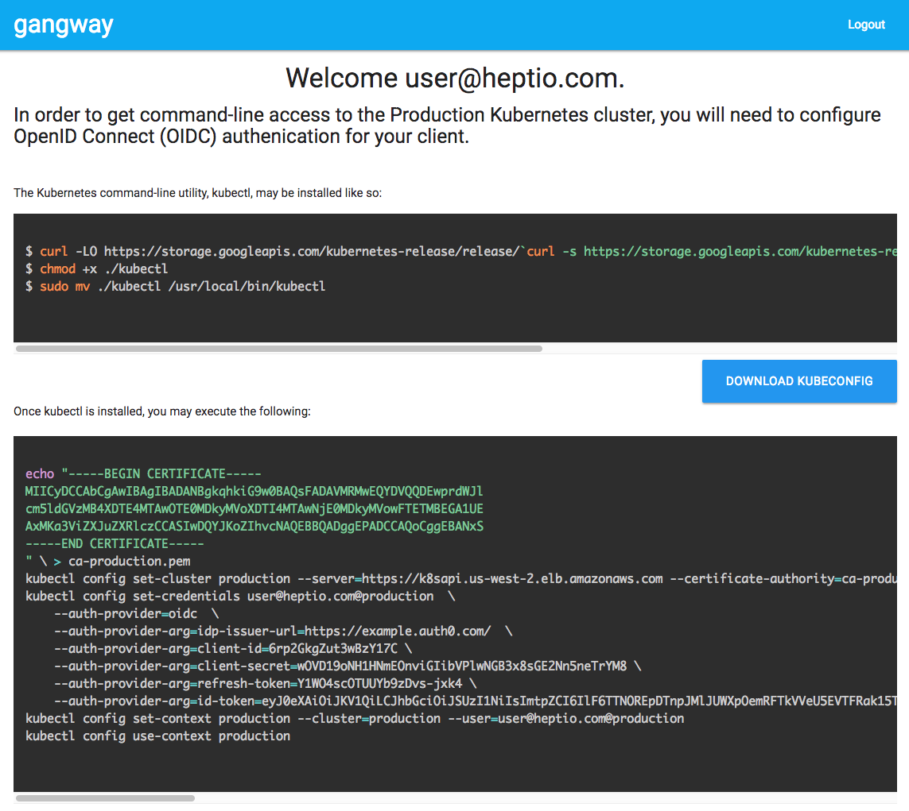

In order to deploy Kubernetes securely you need to implement the principle of
least privilege. What this means is that you will allow users to take actions
against the cluster (e.g. create Pods, Services, etc.), but you will ensure that
any privileges that you extend to a user will be constrained to include only
those that are necessary to fulfill the user's needs, and nothing more.

To ensure that users only have what they need, you will need to know about who
our users are. You will need to both authenticate their credentials, and then
once you have, you will need to ensure that they are allowed to perform the
actions they have requested. Similarly, you will want to be sure that you always
have a consistent view of this user data. This consistent view will ensure that
as users come and go, you always grant them only the access they are entitled
to.

Many newcomers to Kubernetes are sometimes surprised to learn that Kubernetes
does not have a User resource type. Unlike other platforms in the distributed
computing space, Kubernetes deliberately seeks to offload this functionality
onto other systems.

While Kubernetes does provide some primitive user management capabilities in the
form of Service Accounts, a production deployment should leverage an
organization-wide user identity store. Often times an organization will have a
common LDAP, Active Directory, or Open ID Connect (OIDC) infrastructure that is
leveraged across its environments. Kubernetes is capable of integrating
(directly or indirectly) with these systems, and doing so will provide that
common user identity integration that you are looking for. When a user leaves
the organization, their access is revoked from this common identity store, and
Kubernetes will in-turn revoke their access to the cluster.

## Open Identity Connect (OIDC)

If you have examined the Kubernetes documentation, you will notice that there
are quite a few options for integrating user identity systems, but that the only
standard protocol-based configuration involves OIDC.

With OIDC, a user will authenticate with the identity store, and upon successful
login, will obtain a JSON Web Token (JWT). This token will be presented as a
base64 string, but when decoded, it contains human-readable metadata about the
user. Some of this data may include the username, token issue time, token
expiration time, and most importantly, a field that provides what OIDC calls
"claims." These claims are typically an array of strings that indicate which
user groups this user should have access to. These groups will eventually be
mapped to Roles and ClusterRoles for the implementation of Kubernetes RBAC
rules.

Note that the Kubernetes API server may be configured to specify both a user
claim and a group claim. These fields would correspond to attributes within the
token.

A sample JWT may look like the following:

```json
{
  "iss": "https://auth.example.com",
  "sub": "Ch5hdXRoMHwMTYzOTgzZTdjN2EyNWQxMDViNjESBWF1N2Q2",
  "aud": "dDblg7xO7dks1uG6Op976jC7TjUZDCDz",
  "exp": 1517266346,
  "iat": 1517179946,
  "at_hash": "OjgZQ0vauibNVcXP52CtoQ",
  "username": "marysmith",
  "email": "marysmith@example.com",
  "email_verified": true,
  "groups": ["qa", "infrastructure"]
}
```

In this example, you would configure the API server to use the "username"
attribute as the username claim field and the "groups" attribute as the groups
claim. When developing RBAC rules, you will now be able to utilize these claims
as subjects for RoleBinding and ClusterRoleBinding resources:

```yaml
kind: RoleBinding
apiVersion: rbac.authorization.k8s.io/v1
metadata:
  name: web-rw-deployment
  namespace: some-web-app-ns
roleRef:
  kind: Role
  name: web-rw-deployment
  apiGroup: rbac.authorization.k8s.io
subjects:
  - kind: User
    name: marysmith
    apiGroup: rbac.authorization.k8s.io
```

or...

```yaml
kind: ClusterRoleBinding
apiVersion: rbac.authorization.k8s.io/v1
metadata:
  name: web-infra
roleRef:
  kind: Role
  name: web-infra
  apiGroup: rbac.authorization.k8s.io
subjects:
  - kind: Group
    name: "infrastructure"
    apiGroup: rbac.authorization.k8s.io
```

{} 
There are no direct LDAP or Active Directory integrations, but it is possible to
integrate these systems with tools that will act as identity brokers.

One very common tool for brokering various identity backends is
[Dex](https://github.com/dexidp/dex). This service, deployed in-cluster, will
allow us to connect various backends, such as LDAP, SAML, Active Directory, and
similar to an OIDC front-end. Kubernetes may then be configured to utilize Dex
as its identity source.

This project was developed by CoreOS, and is currently being proposed for
donation to the Cloud Native Computing Foundation.
{}

Once a user has authenticated against their identity store, they will receive a
JWT. The user then adds this token to their kubeconfig, and all subsequent
client requests will include this bearer token in the request's Authorization
header. The Kubernetes API server uses this token to identify and authorize the
user.

This flow can be complex, however, there are tools that will make this process
straightforward. [gangway](https://github.com/heptiolabs/gangway) is such a
tool, and it will provide an end user with all of the steps necessary to
integrate with an OIDC identity provider in a self-service fashion.



It should be noted that JWT tokens are not able to be revoked, but are also
time-bound. This expiration time is embedded in the token itself, and is
immutable. The identity server may scope this token for as long as it would
like, but remember that the token will be valid until it is expired. So, be sure
to choose a scope that makes sense - an hour is typically sufficient.

In addition to the access JWT token, the OIDC specification also calls for an
optional refresh token as well. If your identity server supports refresh tokens,
these may be exchanged for a new access token upon expiration. This
functionality makes it possible for a user to continually get new time-scoped
access tokens seamlessly.

## Other Means

While OIDC is the preferred integration protocol for identity and access
control, there are scenarios where, despite the availability of OIDC brokering
tools, this is still not possible. Fortunately, Kubernetes affords a number of
alternative means of identity and access control. Each of these, while capable,
may have drawbacks that make it a less favorable approach.

{} 
Identity in Kubernetes is not mutually exclusive. It allows for multiple
identity configurations simultaneously. While you are not likely in a scenario
where it will be hard to choose the best integration, you will want to consider
this feature in order to facilitate cluster operations. If you encounter a
scenario where an external user identity system were to become unavailable,
having alternate means of authentication is a great tool to have in order to
effect change during an incident.
{}

Let's take a brief look at some of the other integrations.

### X.509 Certificates

Kubernetes, when properly configured, leverages TLS to secure communication
throughout the cluster. All control plane surfaces utilize the encryption
features of TLS to encrypt all over-the-wire communication, but perhaps just as
importantly, they utilize the identity aspects of TLS to ensure that only the
clients that we have authorized will be able to communicate with each other.

Just as we can utilize these X.509 certificates to secure service-to-service
communication, we can use these certificates to secure and identify users as
well. In order to do so, we will need to generate an X.509 certificate signing
request that will then be signed against a certificate authority common to the
Kubernetes API server. This is a multi-step process that is outside the scope of
this documentation, but instructions may be found in the [Kubernetes
documentation](https://kubernetes.io/docs/concepts/cluster-administration/certificates/).

With X.509 certificates we may specify the username and groups that a user is a
member of by manipulating the standard fields of the cert.

```
openssl req -new -key marysmith.pem -out marysmith-csr.pem -subj "/CN=marysmith/O=group1/O=group2"
```

The Common Name field is used to indicate the username of the identity, and we
add the user to user groups by way of the Organization fields. Just as with the
OIDC case, these fields may be used in RBAC RoleBinding and ClusterRoleBindings.

X.509 certificates can be very difficult to work with in a practical way. First,
many users are often confused by the steps required to generate a certificate.
And this confusion often leads to reluctance when it comes to proper issuance of
credentials to new users and/or the reissuance in the case of compromise. In
fact, a common pattern that we have encountered in-the-wild has been for
certificates with broad privileges (e.g. cluster-admin) to be shared among many
users. This not only severely compromises security, but also limits your ability
to leverage features like audit logging.

Secondarily, these certificates must be signed against a common certificate
authority. In the best of scenarios, users will have a certificate authority
that may be used across the organization. But, in most cases, these certificates
are dedicated to the cluster itself. This will require new certificates for each
cluster a user interacts with.

Finally, and perhaps most problematic, is the fact that x.509 certificates are
note able to be revoked easily. The certificate will be valid until the
certificate expires or the server certificate has been rotated.

In short, the user experience with certificates is not great. And, poor user
experiences within the realm of security often leads to users circumventing
processes meant to secure all users. So, for general-purpose needs, we do not
recommend this approach.

With this said, however, X.509 certificates can be a very good option for "break
glass" access. As these certificates do not require any runtime infrastructure
they may be readily used in the event that other authentication means are
unexpectedly unavailable. Operations teams should ensure that these keys are
only used for remediation.

### Webhooks

Kubernetes also supports a generic mechanism for authentication by way of
webhooks. In this scenario, you may configure the API server to POST webhooks to
a service that will respond with the appropriate HTTP responses. These POSTs
will issue the Kubernetes TokenReview resource type to the authenticating
service. This type includes an attribute for the bearer token associated with
the request that is attempting to authenticate.

The authenticating webhook service will simply update the TokenReview object
with an `authenticated` boolean field, and return it to the calling Kubernetes
API service. In the case of `authenticated: true`, the webhook will also provide
detail about the user; username, groups, etc.

While this mechanism may be used in cases where there are no other viable
methods, we strongly discourage this type of integration. First, any
introduction of a downstream webhook into the regular API request flow will
introduce latencies. Secondly, this is now a (yet another) service that must be
maintained by those who are operating the Kubernetes platform, and this type of
work, while seemingly innocuous, can be non-trivial.

This should only be used when no other options exist.

### Static Tokens and Basic Authentication

And, finally, Kubernetes offers some mechanisms to provide the Kubernetes API
server with pointers to files that contain either static tokens and/or basic
authentication credentials. These files must exist on a disk local to the API
server and are neither secure nor scalable. These should be avoided at all cost.