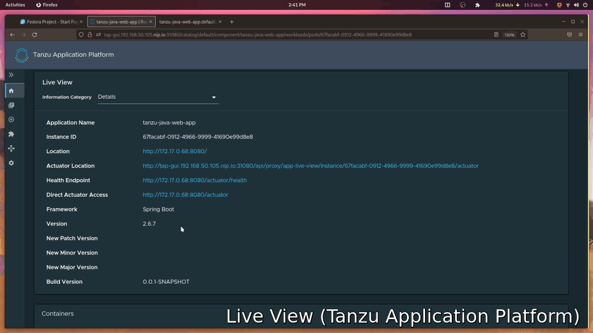
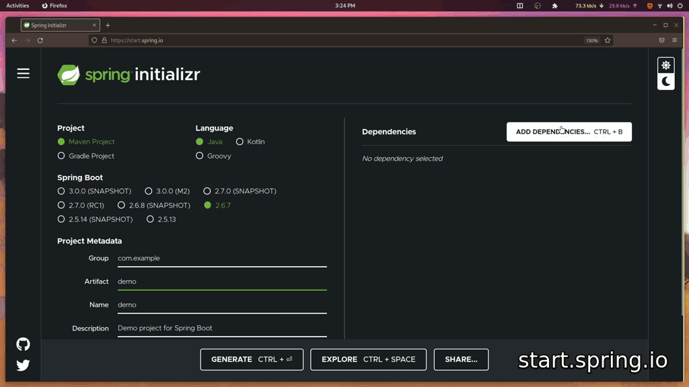
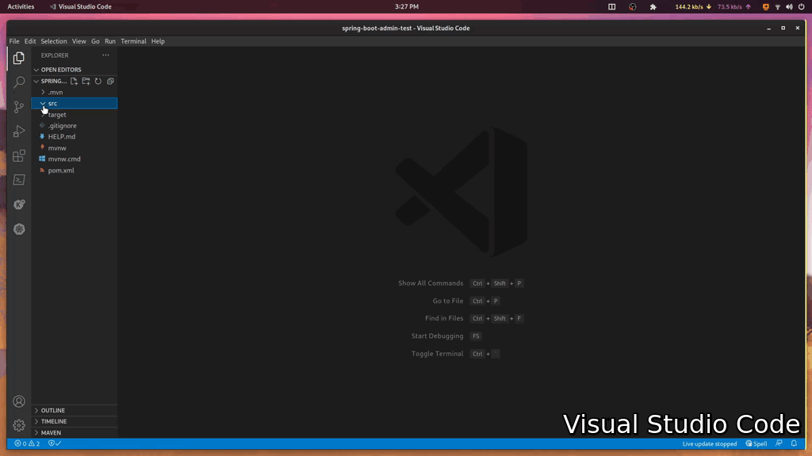
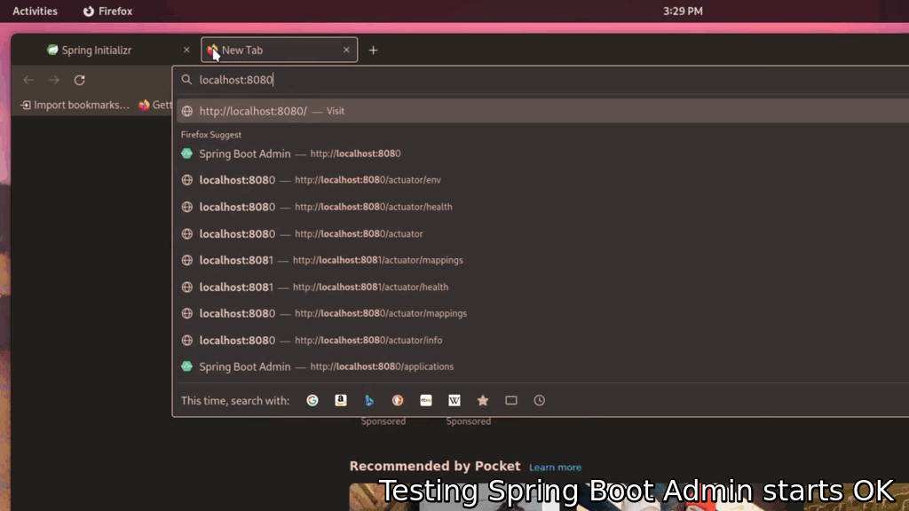
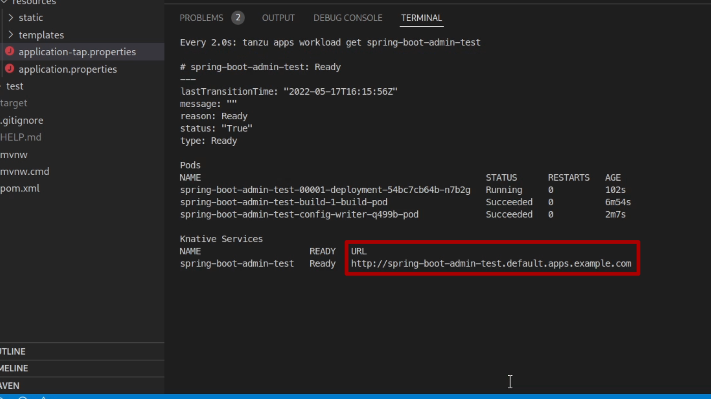
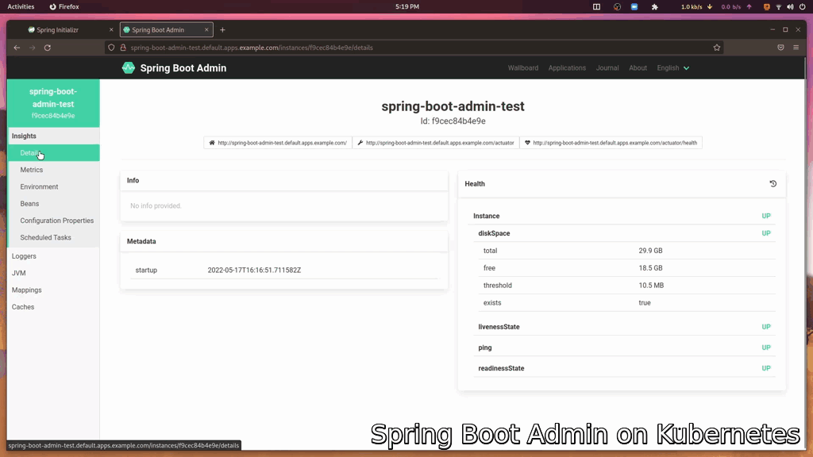

## What You'll Learn 

In this guide you'll learn how to get started with [Spring Boot Admin][sba]. You'll discover how to create an admin server, how to register apps with this server, and how to inspect your app settings using nothing but your mouse and browser. Let Spring Boot Admin take the stress out of inspecting and troubleshooting your microservices on Kubernetes!

{}
Prefer a video? Click [here](#video-of-this-guide) or scroll to the end.
{}

## Introduction

When you're pushing multiple Spring-based microservices to Kubernetes, it can be hard to remember all the various configs and settings you've applied to each app. Examining your setup with command line tools like `kubectl`, `curl`, can be challenging and slow. And if you're in a hurry — troubleshooting an urgent issue, for example — this friction can be frustrating.

Some Kubernetes-based application platforms do have features designed to help you examine your apps. For example, the [Tanzu Application Platform][tap] provides '[Live View](/videos/tap-alv-p1-onboarding/)'. Live View lets you inspect the various settings currently applied to your applications in real time while they're running inside Kubernetes. 

The settings exposed by Live View include:

* Environment variables,
* Configuration properties,
* Logging settings,
* Current memory consumption,
* And more!



But what if you're using vanilla Kubernetes? Or a Tanzu Application Platform profile that doesn't include Live View? Or a platform that's simply less 'application aware' than Tanzu?

That's where [Spring Boot Admin][sba] can help. Spring Boot Admin is an open-source application that lets you view the configuration settings and status of your Spring applications while they're running. 

It's easy to get started with Spring Boot Admin, and if you follow this guide you'll learn: 

* How to create a Spring Boot Admin server, 
* How to register a client, 
* How to deploy the server to a lightweight GUI-less version of the [Tanzu Application Platform][tap].


## Let's get started!

You begin by creating a Spring Boot application project using [start.spring.io][initializr]. From there, you can add the dependencies that you'll need for this exercise. They are: 

* Spring Web, 
* Spring Actuators, 
* Spring Security, 
* Spring Boot Admin Server, 
* Spring Boot Admin Client.

Remember to give the application a meaningful `Artifact` name and check the rest of the settings make sense before clicking the "GENERATE" button to download your project. 




Extract the Zip archive to your filesystem and open it inside your favorite IDE. I'm using Visual Studio Code in the video, but you could use Eclipse, IntelliJ, or [Spring Tools 4](https://spring.io/tools).



## Customize Your Spring Boot Admin Server

Spring Boot Admin has two logical parts, a server and a client. Clients register with the server. In this case, you're creating both a client and a server in one project — hence the addition of both the client and server dependencies in the previous step.

Setting up your Spring Boot Admin server requires very little code. First Add the `@EnableAdminServer` annotation to your main application class and resolve any missing imports. 

In the [demo code for this article][code], I'm also adding a security configuration so that my Spring Boot Admin dashboard can be accessed without a username and password. This is optional, but makes getting started easier and you can remove it later once you have configured your preferred security features.

```java
@EnableAdminServer
@SpringBootApplication
public class SpringBootAdminServerApplication {

	public static void main(String[] args) {
		SpringApplication.run(SpringBootAdminTestApplication.class, args);
	}

	@Configuration
    public static class SecurityPermitAllConfig extends WebSecurityConfigurerAdapter {
        @Override
        protected void configure(HttpSecurity http) throws Exception {
            http.authorizeRequests().anyRequest().permitAll()  
                .and().csrf().disable();
        }
    }
}
```

You further customize Spring Boot Admin server using an `application.properties` file. In this properties file, you should set the application name as follows:

```java
spring.application.name=spring-boot-admin-server
```

## Register Your Server as a Client Application

In the `application.properties` file, you can tell the Spring Boot Admin server to register as a client of itself. You do this by setting the `spring.boot.admin.client.URL` property to `localhost:8080`. You must also expose all the Spring Boot Actuator endpoints by setting the `management.endpoints.web.exposure.include` property to `*`. 

{}
Exposing the actuators on clients is important. Spring Boot Admin server reads the information from the actuators of the clients and presents their data in a friendly web-based user interface.
{}

Here's the completed `application.properties` file:

```java
spring.application.name=spring-boot-admin-server # <-- The application name to register
management.endpoints.web.exposure.include=* # <-- Expose some actuators
spring.boot.admin.client.url=http://localhost:8080 # <-- The API endpoint where clients register
spring.boot.admin.client.instance.service-base-url=http://localhost:8080 # <-- The root for my links in the SBA UI
```

## Test Your Spring Boot Admin Server

Once configured, test that the server starts correctly. Open a terminal, navigate to your project's folder, and start the Spring Boot Admin server application in the usual way. 

```bash
./mvnw spring-boot:run
```


You can see the Spring Boot Admin server dashboard by entering the URL [http://localhost:8080](http://localhost:8080) into your web browser. In the dashboard, you will see the first registered application, your Spring Boot Admin server! 




## Customizing For Kubernetes

Because running in the cloud often demands different settings, you can add additional Spring profiles to customize the server for each environment you'll run it in. In the [video](https://youtu.be/A7LMrVz8QhM?t=289), I'm running Spring Boot Admin on the [Tanzu Application Platform][tap] (sometimes referred to as "TAP" for short).

To create a profile for TAP I'll add another text file to the project's `/src/main/resources` folder with the name `application-tap.properties`. These properties will be activated whenever the `tap` profile is activated.

In the 'tap' profile, I'll add three properties which reconfigure the Spring Boot Admin application to work nicely on my [local TAP installation running on Minikube][tap-on-lap]. Some of the properties refer to environment variables which I'll set when I launch the app.

```java
spring.boot.admin.ui.public-url=http://${spring.application.name}.${NAMESPACE}.${DOMAIN} #The public URL
spring.boot.admin.client.url=http://localhost:8080 #Registering as a client of self
spring.boot.admin.client.instance.service-base-url=http://${spring.application.name}.${NAMESPACE}.${DOMAIN} #Make links work
```

## Running On Kubernetes

Running the application on Kubernetes is super easy. The [Tanzu Application Platform][tap] works in tandem with my source control system, checking out the code, building it, and running it on Kubernetes for me.

{}
Why not [install Tanzu Application Platform onto your Laptop](https://via.vmware.com/TAPonLAP) and try it for yourself?
{}

As this is a brand new project, Git source code tracking must be added. First, initialize the project with `git init`, then add all the source code to version control with `git add`, and finally, create the first commit with `git commit`. Here are the commands you need:

```bash
git init # Initialize the project as a Git project
git add --all # Add all the source code
git commit -am "initial commit" # Create the first commit
```

The code must then be pushed to a new remote repository on GitHub. You can do this using the [GitHub command line tool](https://cli.github.com/) as follows. 

```bash
gh repo create spring-boot-admin-server --public --source=. --remote=origin --push
```

Finally, the `tanzu` CLI can tell TAP to run Spring Boot Admin server on Kubernetes using the `apps workload create` command.

```bash
tanzu apps workload create spring-boot-admin-server \                
    --git-repo https://github.com/benwilcock/spring-boot-admin-server \   
    --git-branch main \
    --type web \
    --label app.kubernetes.io/part-of=spring-boot-admin-server \
    --label tanzu.app.live.view=false \
    --label tanzu.app.live.view.application.name=spring-boot-admin-server \
    --annotation autoscaling.knative.dev/minScale=1 \
    --namespace default \
    --env "NAMESPACE=default" \
    --env "DOMAIN=apps.example.com" \
    --env "JAVA_TOOL_OPTIONS=-Dmanagement.server.port=8080" \
    --env "SPRING_PROFILES_ACTIVE=tap" \
    --yes
```

{}
Notice how the `SPRING_PROFILE_ACTIVE` environment variable has been set to `tap`. This will activate the TAP profile. The `DOMAIN` and `NAMESPACE` environment variables relate to the other customizations in the `application-tap.properties` file.
{}

{}
The Tanzu Application Platform checks out the source code, builds it into a container, and runs that container on Kubernetes. Notice how there's absolutely **no YAML** using this method!
{}

You can watch the build and deploy process using the `apps workload tail` command.

```bash
tanzu apps workload tail spring-boot-admin-server --since 10m --timestamp
```

## Test Your Spring Boot Admin Server on Kubernetes

When the application has finished deploying, you can obtain its URL using the `apps workload get` command.

```bash
tanzu apps workload get spring-boot-admin-server
```



Open the URL in your browser.



{}
If you're not using Tanzu Application Platform, [expose the application as a Kubernetes service](https://kubernetes.io/docs/reference/generated/kubectl/kubectl-commands#expose) in the usual way and then navigate your browser to the application's URL.
{}

The Spring Boot Admin server dashboard is now ready to help you inspect and troubleshoot your application setup. You can register all your Spring applications as clients of Spring Boot Admin, and hopefully, you'll never again struggle to remember your configuration details! 

The Spring Boot Admin server dashboard shows which applications are registered. It also shows:

* Their current health status, 
* Their environment details, 
* Some basic metrics, 
* Their configuration settings,
* And more! 

Spring Boot Admin can even be configured to message you on Slack if any of your apps go offline!

{}
Check out the [Spring Boot Admin documentation](https://via.vmware.com/SBA-docs) for more information. 
{}

## Keep On Learning

You're on a roll! Why not continue your learning journey with these other resources?

* [Spring Boot Admin website][sba] and [documentation][sba-docs],
* [Sample code from this article][code],
* [Tanzu Application Platform product page][tap]
* [Install the Tanzu Application Platform on Your Laptop][tap-on-lap],
* [Try the Tanzu Application Platform Hands On Lab][tap-hol].

## Video of This Guide

Learn how to inspect and troubleshoot your Spring Boot microservices on Kubernetes with Spring Boot Admin. Click the play button, choose "watch later", or "share" with a friend. And don't forget to like & subscribe so you'll be notified whenever new Tanzu content goes live on [our channel][youtube-channel]!



---

[sba]: https://via.vmware.com/SBA
[sba-docs]: https://via.vmware.com/SBA-docs
[code]: https://via.vmware.com/SBA-demo 
[initializr]: https://start.spring.io
[tap]: https://via.vmware.com/TAP-prod 
[tap-on-lap]: https://via.vmware.com/TAPonLAP
[tap-hol]: https://via.vmw.com/TAP-HOL
[dev-gs-innerloop]: /guides/tanzu-application-platform-inner-loop
[youtube-channel]: https://www.youtube.com/channel/UCzd8R3vkpllD4CJn_5g5sKg