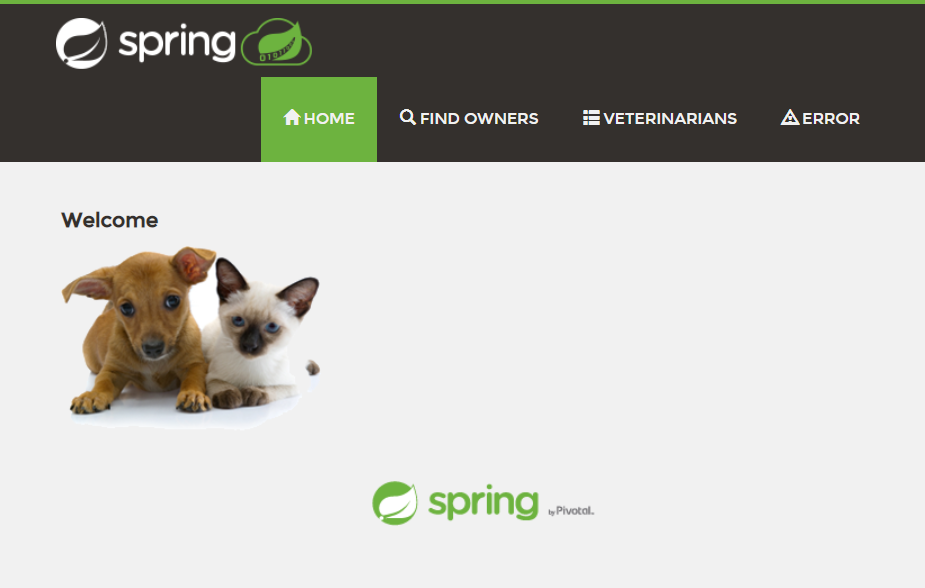

[kapp-controller](https://carvel.dev/kapp-controller) is a tool in the open source [Carvel](https://carvel.dev) suite.

> "kapp-controller's declarative APIs and layered approach enable you to build, deploy, and manage your own applications. It also helps package your software into easily distributable packages and enables your users to discover, configure, and install these packages on a Kubernetes cluster."
> 
> _source: [carvel.dev/kapp-controller](https://carvel.dev/kapp-controller)_

kapp-controller gives us a flexible way to fetch, template, and deploy our applications to Kubernetes. It will also keep our apps continuously up to date when the configuration in our source repository changes.

kapp-controller utilizes [`kapp`](https://carvel.dev/kapp/) to track the resources it's deploying. If you're new to kapp, check out the [Getting Started with kapp](/guides/kubernetes/kapp-gs) guide.


## Prerequisites

Before you get started, you will need to do the following:
* Create a Kubernetes cluster
	* If you use a [Tanzu Community Edition](https://tanzucommunityedition.io/) cluster, it will have kapp-controller installed and package management integrated.
* Install [`kubectl`](https://kubernetes.io/docs/tasks/tools/) locally
* Install the **latest** `kapp`, `ytt`, and `imgpkg` CLIs via one of these options:
	* [Homebrew](https://github.com/vmware-tanzu/homebrew-carvel)  
	  If you've installed them via `brew` previously, please run the following anyway to update:
      ```
      brew tap vmware-tanzu/carvel
      brew install kapp ytt imgpkg
      ```
	* Download the binaries from GitHub releases and move them to `/usr/local/bin` or add to your `$PATH` and run `chmod +x` to make them executable.
      * [kapp GitHub releases](https://github.com/vmware-tanzu/carvel-kapp/releases)
      * [ytt GitHub releases](https://github.com/vmware-tanzu/carvel-ytt/releases)	
      * [imgpkg GitHub releases](https://github.com/vmware-tanzu/carvel-imgpkg/releases)
* Install kapp-controller in the cluster:
	```
	kapp deploy -a kc -f https://github.com/vmware-tanzu/carvel-kapp-controller/releases/latest/download/release.yml -y
  ```
  Since we are bootstrapping the kapp-controller installation with kapp, it will wait for the controller to download, run, and become healthy.
  If this command completes successfully, we are good to continue.

## Main Use Cases

kapp-controller has three primary use cases, which we will talk about in this guide:
* Continuous Delivery
* Package Consumption
* Package Authoring
 
## Continuous Delivery

### Fork/Clone

This guide stores all of its configuration in a Git repository. 
It's possible to use other sources, such as an [imgpkg](https://carvel.dev/imgpkg/) bundle or regular container images, http, or a Helm registry as well.
For this walkthrough, you will want to clone your own copy of the repo.

```
git clone https://github.com/vmware-tanzu-labs/tdc-carvel-examples.git
cd tdc-carvel-examples
```

Optionally, fork the repository first before you clone, so that you can make your own updates to the cluster and see kapp-controller update your application.
Should you fork the repository, replace the references to the upstream repo to your own:
```bash
UPSTREAM=https://github.com/vmware-tanzu-labs/tdc-carvel-examples
FORK=https://github.com/<YOUR-USERNAME-HERE>/my-kapp-repo

git grep -l $UPSTREAM | xargs sed -i -e "s,$UPSTREAM,$FORK,g"

git diff
git commit -a "Update Apps for fork"
git push
```

### Setup

First, we will manually create an administrative, management Namespace called `apps-mgmt`.
We will use this Namespace to create other Namespaces for the applications to reside in as well as ServiceAccounts and RoleBindings so that those applications can be deployed with restricted permissions.

To take a look at the `apps-mgmt` cluster-admin Namespace and RBAC, you can run the following:
```
ytt -f ns-rbac --data-values-file apps-mgmt.values.yaml
```
```yaml
apiVersion: v1
kind: Namespace
metadata:
  name: apps-mgmt
---
apiVersion: v1
kind: ServiceAccount
metadata:
  name: kapp-cluster-admin
  namespace: apps-mgmt
---
kind: ClusterRoleBinding
apiVersion: rbac.authorization.k8s.io/v1
metadata:
  name: kapp-cluster-admin
subjects:
- kind: ServiceAccount
  name: kapp-cluster-admin
  namespace: apps-mgmt
roleRef:
  apiGroup: rbac.authorization.k8s.io
  kind: ClusterRole
  name: cluster-admin
```
> ytt is the YAML Swiss Army knife!  
> We'll need to create a lot of Namespaces, ServiceAccounts, and RoleBindings
> -- ytt allows us to reuse the same code to do so with different options.  
> Check out the ytt program in the `./ns-rbac` directory.
> 
> To learn more about [ytt](https://carvel.dev/ytt/), check out our [Getting Started with ytt guide](https://tanzu.vmware.com/developer/guides/kubernetes/ytt-gs/).

Now, deploy the `apps-mgmt` Namespace and RBAC with `ytt` and `kapp`:
```
kapp deploy -a apps-mgmt \
-f <(ytt -f ns-rbac --data-values-file apps-mgmt.values.yaml)
```
Hit `y` to continue and create the following resources:
```
Namespace  Name                Kind                Conds.  Age  Op      Op st.  Wait to    Rs  Ri
(cluster)  apps-mgmt           Namespace           -       -    create  -       reconcile  -   -
^          kapp-cluster-admin  ClusterRoleBinding  -       -    create  -       reconcile  -   -
apps-mgmt  kapp-cluster-admin  ServiceAccount      -       -    create  -       reconcile  -   -
```

We are using kapp to track these resources since they are not managed by kapp-controller.

Next, we want to have our applications be in the `dev` and `test` namespaces.
Using our new `apps-mgmt` namespace, we can ask kapp-controller to create them for us along with namespace-level ServiceAccounts for installing the namespaced web applications.

We will add two App Custom Resources to the `apps-mgmt` namespace:
```yaml
# kapp-controller/ns-rbac/ns-rbac-dev.yaml
apiVersion: kappctrl.k14s.io/v1alpha1
kind: App
metadata:
  name: ns-rbac-dev
  namespace: apps-mgmt
spec:
  serviceAccountName: kapp-cluster-admin
  fetch:
    - git:
        url: https://github.com/vmware-tanzu-labs/tdc-carvel-examples
        ref: origin/main
        subPath: ns-rbac
  template:
    - ytt: {}
  deploy:
    - kapp: {}
```
```yaml
# kapp-controller/ns-rbac/ns-rbac-test.yaml
apiVersion: kappctrl.k14s.io/v1alpha1
kind: App
metadata:
  name: ns-rbac-test
  namespace: apps-mgmt
spec:
  serviceAccountName: kapp-cluster-admin
  fetch:
    - git:
        url: https://github.com/vmware-tanzu-labs/tdc-carvel-examples
        ref: origin/main
        subPath: ns-rbac
  template:
    - ytt:
        inline:
          paths:
            values.yaml: |
              #@data/values
              ---
              namespace: test
  deploy:
    - kapp: {}
```

We see in these two Apps that they fetch from the `ns-rbac` subPath of the [vmware-tanzu-labs/tdc-carvel-examples](https://github.com/vmware-tanzu-labs/tdc-carvel-examples) GitHub repo.  
(If you forked the repo and did the find and replace, you should see your repo here instead.)

The first App manages the `dev` Namespace and RBAC.
The second App uses the same [ytt](https://carvel.dev/ytt/) program. However, the template section has an inline ytt value that changes the manifests to create the `test` Namespace and RBAC instead.

We can deploy these two namespace-managing apps like so:
```
kubectl apply -f kapp-controller/ns-rbac
```

kapp-controller will then fetch the GitHub repo, template the subPath for us using ytt with different values per-App, and then create the Namespaces for us.

We can see the status of these Apps with kubectl:
```
kubectl -n apps-mgmt get apps
```
```
NAME           DESCRIPTION           SINCE-DEPLOY   AGE
ns-rbac-dev    Reconcile succeeded   4s             5s
ns-rbac-test   Reconcile succeeded   4s             5s
```

Since kapp-controller uses kapp internally, you can also see the raw kapp state with the kapp CLI.
These will also have the suffix "`-ctrl`" to show that they are managed by kapp-controller.
```
kapp -n apps-mgmt ls
```
```
Name               Namespaces      Lcs   Lca
ns-rbac-dev-ctrl   (cluster),dev   true  49s
ns-rbac-test-ctrl  (cluster),test  true  49s
```

Since these Apps are in the `apps-mgmt` Namespace, their resources are reconciled to the cluster with the `apps-mgmt/kapp-cluster-admin` ServiceAccount.

By default, the kapp [state namespace](https://carvel.dev/kapp/docs/latest/state-namespace/) will match the namespace of each App Custom Resource.

These apps are tracking a branch in git, so if the git repository updates, kapp-controller will make any necessary changes to the Namespace and RBAC definitions.

### Plain YAML

Now that the Namespaces and RBAC are set up, we can have kapp-controller deploy our web application.

This [example](https://github.com/vmware-tanzu-labs/tdc-carvel-examples/blob/main/app-plain/spring-petclinic.yaml) has a Deployment and Service for the [Spring PetClinic](https://projects.spring.io/spring-petclinic/) application. 

We can take a look at the manifest here:
```
cat app-plain/spring-petclinic.yaml
```

Here is where kapp-controller comes in with this application. We are creating a resource of kind `App`. It fetches the code we just looked at from GitHub and then uses the ServiceAccount `dev/kapp-ns-admin` that we created previously to create the resources.

```yaml
apiVersion: kappctrl.k14s.io/v1alpha1
kind: App
metadata:
  name: spring-petclinic
  namespace: dev
spec:
  serviceAccountName: kapp-ns-admin
  fetch:
  - git:
      url: https://github.com/vmware-tanzu-labs/tdc-carvel-examples
      ref: origin/main
      subPath: app-plain
  template:
  - ytt: {}
  deploy:
  - kapp: {}
```

Now, let's create the App:
```
kubectl apply -f kapp-controller/apps/spring-petclinic-plain-dev.yaml
```

Now we can check the App object with kubectl. 
Run `Ctrl-C` when it finishes reconciling.
```
kubectl -n dev get apps -w
```
```
NAME                     DESCRIPTION           SINCE-DEPLOY   AGE
spring-petclinic   Reconcile succeeded   14s            15s
```

To see it working, we can port-forward the service.
```
kubectl -n dev port-forward svc/spring-petclinic 8080:80
```

Now, if you open [localhost:8080](http://localhost:8080) in your browser, you should see the following page:


We can end the port-forward with `Ctrl-C`.

To see the App we created, we can run we can use `kubectl` to look at it:
```
kubectl -n dev get app spring-petclinic -o yaml
```
We can find the managed App that kapp-controller created, `spring-petclinic-ctrl`, in the `dev` state namespace:
```
kapp -n dev list
```
```
Name                   Namespaces  Lcs   Lca
spring-petclinic-ctrl  dev         true  2m
```

We can use `kapp inspect` on this App and it will show us the same resources above:
```
kapp -n dev inspect -a spring-petclinic-ctrl
```
```
Namespace  Name                              Kind           Owner    Conds.  Rs  Ri  Age
dev        spring-petclinic                  Deployment     kapp     2/2 t   ok  -   1m
^          spring-petclinic                  Endpoints      cluster  -       ok  -   1m
^          spring-petclinic                  Service        kapp     -       ok  -   1m
^          spring-petclinic-5b4mq            EndpointSlice  cluster  -       ok  -   1m
^          spring-petclinic-b5976f9dd        ReplicaSet     cluster  -       ok  -   1m
^          spring-petclinic-b5976f9dd-fskp8  Pod            cluster  4/4 t   ok  -   1m
```

To see more details, you can add the `--status` flag:
```
kapp -n dev inspect -a spring-petclinic-ctrl --status
```

To see all of the Apps you currently have, run the following:
```
kapp list -A
```
```
Namespace  Name                   Namespaces                             Lcs   Lca
apps-mgmt  ns-rbac-dev-ctrl       (cluster),dev                          true  14m
^          ns-rbac-test-ctrl      (cluster),test                         true  14m
default    apps-mgmt              (cluster),apps-mgmt                    true  16m
^          kc                     (cluster),kapp-controller,kube-system  true  17m
dev        spring-petclinic-ctrl  dev                                    true  5m
```

> If you forked the repository, you can make a change, such as adding another label in `kapp-controller/apps/spring-petclinic-plain-dev.yaml`. 
> After you push a new commit up, kapp-controller will update your application with the new change. 
> You will be able to see that the update happened if you use `kapp inspect` to check the status as well as checking the resource with `kubectl`.

### ytt
Earlier, we saw how ytt was used for templating for Namespace and RBAC creation.
In this example, we are going to use a ytt-templatized version of the Spring PetClinic Deployment and Service manifest.

To take a look at the files, you can look in the `app-ytt` directory.

We can see that the output file is identical to what we had (there won't be any output).
```
ytt -f app-ytt > /tmp/app-ytt.yaml
diff /tmp/app-ytt.yaml app-plain/spring-petclinic.yaml
```

We are also going to change the Namespace from `dev` to `test` using inline ytt like we did with the Namespace and RBAC creation.
```yaml
apiVersion: kappctrl.k14s.io/v1alpha1
kind: App
metadata:
  name: spring-petclinic
  namespace: test
spec:
  serviceAccountName: kapp-ns-admin
  fetch:
    - git:
        url: https://github.com/vmware-tanzu-labs/tdc-carvel-examples
        ref: origin/main
        subPath: app-ytt
  template:
    - ytt:
        inline:
          paths:
            values.yaml: |
              #@data/values
              ---
              namespace: test
  deploy:
    - kapp: {}
```

Now let's run it.
```
kubectl apply -f kapp-controller/apps/spring-petclinic-ytt-test.yaml
```

Now we can check the App object with kubectl. 
Run `Ctrl-C` when it finishes reconciling.
```
kubectl -n test get apps -w
```

To see it working, we can port-forward the service like we did earlier:
```
kubectl -n test port-forward svc/spring-petclinic 8080:80
```

Now, if you open [localhost:8080](http://localhost:8080) in your browser, you'll see the same app as earlier.

We can end the port-forward with `Ctrl-C`.

We can then look at the resources here with `kapp` and `kubectl`:
```bash
kubectl -n test get app spring-petclinic -o yaml

kapp -n test inspect -a spring-petclinic-ctrl
kapp -n test inspect -a spring-petclinic-ctrl --status
```

To see more examples, check out the [App Walkthrough](https://carvel.dev/kapp-controller/docs/latest/walkthrough/) in the documentation.

## Package Consumption
kapp-controller can also be used for package management. We can use a package someone else created or one that we create. This can make software installation much simpler.
Let’s take a look at the software packages available for [VMware Tanzu Community Edition](https://tanzucommunityedition.io/). 
If you’re using a Tanzu Community Edition cluster, you will be able to just use the `tanzu` CLI for installing the package repo and packages. 
You’ll be able to see how to do this via the Tanzu Community Edition [documentation](https://tanzucommunityedition.io/docs/latest/).

```yaml
apiVersion: packaging.carvel.dev/v1alpha1
kind: PackageRepository
metadata:
 name: tanzu-community-edition
 namespace: apps-mgmt
spec:
 fetch:
   imgpkgBundle:
     image: projects.registry.vmware.com/tce/main:latest
```

The Carvel tool [imgpkg](https://carvel.dev/imgpkg/) is used for bundling the package repository.

Now, create the `PackageRepository` Custom Resource:
```
kubectl apply -f package-mgmt/repository.yaml
```

Wait for the `PackageRepository` Custom Resource to be reconciled:
```
kubectl -n apps-mgmt get packagerepository tanzu-community-edition -w
```

Once it finishes, we can take a look at what packages were added:
```
kubectl -n apps-mgmt get packages
```
```
NAME                                                   PACKAGEMETADATA NAME                            VERSION   AGE
velero.community.tanzu.vmware.com.1.5.2                velero.community.tanzu.vmware.com               1.5.2     9m20s
cert-manager.community.tanzu.vmware.com.1.4.0          cert-manager.community.tanzu.vmware.com         1.4.0     9m20s
cert-manager.community.tanzu.vmware.com.1.5.1          cert-manager.community.tanzu.vmware.com         1.5.1     9m20s
cert-manager.community.tanzu.vmware.com.1.3.1          cert-manager.community.tanzu.vmware.com         1.3.1     9m20s
contour.community.tanzu.vmware.com.1.15.1              contour.community.tanzu.vmware.com              1.15.1    9m20s
contour.community.tanzu.vmware.com.1.17.1              contour.community.tanzu.vmware.com              1.17.1    9m20s
external-dns.community.tanzu.vmware.com.0.8.0          external-dns.community.tanzu.vmware.com         0.8.0     9m20s
gatekeeper.community.tanzu.vmware.com.1.0.0            gatekeeper.community.tanzu.vmware.com           1.0.0     9m20s
fluent-bit.community.tanzu.vmware.com.1.7.5            fluent-bit.community.tanzu.vmware.com           1.7.5     9m20s
grafana.community.tanzu.vmware.com.7.5.7               grafana.community.tanzu.vmware.com              7.5.7     9m19s
harbor.community.tanzu.vmware.com.2.2.3                harbor.community.tanzu.vmware.com               2.2.3     9m19s
knative-serving.community.tanzu.vmware.com.0.22.0      knative-serving.community.tanzu.vmware.com      0.22.0    9m19s
local-path-storage.community.tanzu.vmware.com.0.0.19   local-path-storage.community.tanzu.vmware.com   0.0.19    9m19s
local-path-storage.community.tanzu.vmware.com.0.0.20   local-path-storage.community.tanzu.vmware.com   0.0.20    9m19s
multus-cni.community.tanzu.vmware.com.3.7.1            multus-cni.community.tanzu.vmware.com           3.7.1     9m19s
prometheus.community.tanzu.vmware.com.2.27.0           prometheus.community.tanzu.vmware.com           2.27.0    9m19s
```

We can use kapp-controller’s `PackageInstall` Custom Resource to install [Prometheus](https://prometheus.io/).
> **Note**: Make sure the version matches one of the available versions. This may be different by the time you are following along.
```yaml
apiVersion: packaging.carvel.dev/v1alpha1
kind: PackageInstall
metadata:
 name: prometheus
 namespace: apps-mgmt
spec:
 serviceAccountName: kapp-cluster-admin
 packageRef:
   refName: prometheus.community.tanzu.vmware.com
   versionSelection:
     constraints: 2.27.0
 values:
 - secretRef:
     name: pkg-demo-values
---
apiVersion: v1
kind: Secret
metadata:
 name: pkg-demo-values
 namespace: apps-mgmt
stringData:
 values.yml: |
   ---
   namespace: prometheus-addon
```

The field for `values` is optional.
You can use it to change default values in the package. 
Here, we are changing the namespace from the default of `prometheus` to `prometheus-addon`.

Let’s apply the YAML:
```
kubectl apply -f package-mgmt/prometheus.yaml
```

Create an environment variable for the version:
```
export PROM_VERSION=2.27.0
```

To take a look at the values schema for this package, run the following:
```
kubectl -n apps-mgmt get package prometheus.community.tanzu.vmware.com.${PROM_VERSION} -o yaml
```

And if you want to see the specific values file used for this package, you can pull down the bundle with `imgpkg` and look at it.
```
imgpkg pull -b projects.registry.vmware.com/tce/prometheus:${PROM_VERSION} -o /tmp/prom-pkg
cat /tmp/prom-pkg/config/values.yaml
```

Now we can wait for the `PackageInstall` Custom Resource to reconcile:
```
kubectl -n apps-mgmt get packageinstall prometheus -w
```

We can use kapp to see everything that was installed for Prometheus:
```
kapp -n apps-mgmt inspect -a prometheus-ctrl
```

To fully see that it’s working, you can port-forward the service.
```
​​kubectl -n prometheus-addon port-forward service/prometheus-server 8080:80
```

Then open [localhost:8080](http://localhost:8080) in a browser.
You could type `kubelet_running_pods` in the search for instance to get some data.

We can end the port-forward with `Ctrl-C`.

To learn more about Package Consumption, check out the [Package Consumption Walkthrough](https://carvel.dev/kapp-controller/docs/latest/package-consumption/) on the Carvel site.

## Package Authoring

With kapp-controller you can turn your own applications into a package. This is especially useful so you can easily share your applications with others. For example, we could turn the Spring PetClinic application into a package.

To see how to author a package, check out the [Package Author Walkthrough](https://carvel.dev/kapp-controller/docs/latest/package-authoring/) on the Carvel site.

## Tear Down
Now we can delete the resources we've created.
```bash
# Remove Prometheus
kubectl delete -f package-mgmt/prometheus.yaml
# Remove package repository
kubectl delete -f package-mgmt/repository.yaml
# Delete continuous delivery app
kubectl delete -f kapp-controller/apps
# Delete apps ns/rbac
kubectl delete -f kapp-controller/ns-rbac
# Delete apps-mgmt ns/rbac
kapp delete -a apps-mgmt -y
```

You can also uninstall kapp-controller if you'd like:
```
kapp delete -a kc -y
```

## Big Picture

We went through a lot there, especially if you're new to the Carvel tool suite. We used four tools: kapp, ytt, imgpkg, and kapp-controller.

kapp was used to deploy our applications. ytt was used to templatize our application manifests. imgpkg was used to unbundle a package. And kapp-controller was used to fetch, template, and deploy our applications. It was also used to consume a package to install software.

We can see that kapp-controller gives us the ability to take full control over the lifecycle of our software needs on Kubernetes. With kapp-controller, we can ask our cluster to perform continuous delivery for the things we own and delegate the installation and updates of other software packages to someone we trust.
kapp-controller and the rest of the Carvel toolset provide a foundation for more organized, flexible, and repeatable cloud native operations.

To learn more about Carvel, check out our other [guides](/guides/kubernetes/carvel).