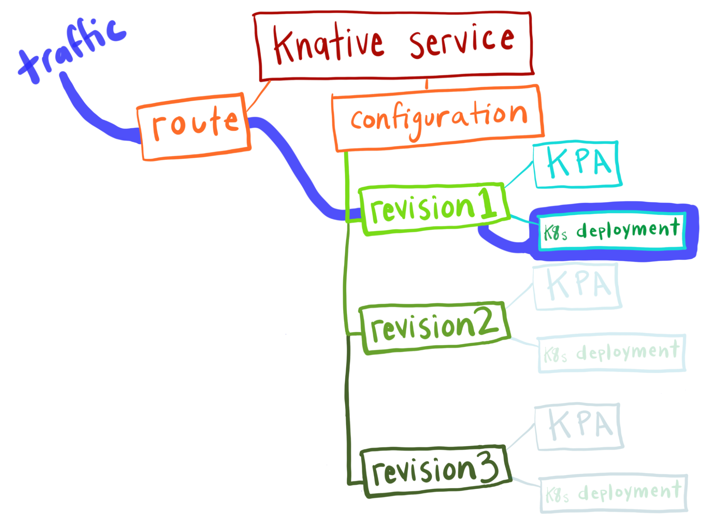

Although Knative has been community-maintained since 2018, there has been buzz around the project lately because [Google has recently submitted Knative to the Cloud Native Computing Foundation](https://knative.dev/blog/steering/knative-cncf-donation/) (CNCF) for consideration as an incubating project.

Cool! But what is Knative, exactly?

Simply put, Knative is a technology that **simplifies** and **enhances** the way that applications run on Kubernetes. Knative itself runs on Kubernetes and has two main facets: Knative Serving and Knative Eventing. This article is about Knative Serving.  

## Vanilla Kubernetes is complicated

How does Knative simplify the process of running an application on Kubernetes? To understand that, you must first understand this: **deploying an application on vanilla Kubernetes is complex**. You first make a _deployment_, which eventually manages many _ReplicaSets_ (one for each version of your application), and each ReplicaSet runs one or many _pods_, which is where your application containers run, usually one workload container per pod.  

But then you also need to create a _service_ to expose your application internally to the cluster (so that other parts of your application can access it), and an _ingress_ to make your application available outside of the cluster (so that the end user can access it). If you want autoscaling, you need to make a _HorizontalPodAutoscaler_ (HPA). You also need to manage your configuration and secrets separately from your application.  

That is a lot to consider. And it can be a high barrier of entry for developers—developers who should be spending their time writing application code anyway.  

Enter Knative.

With Knative, you need to make only one resource—a Knative Service—and then Knative reconciles a set of resources for you that accomplishes everything that we went over in the Kubernetes example above! In addition, defaults are set in such a way that you can run your application and access it externally with one command (or one applied YAML) right out of the box.  

## Knative simplifies application deployment

How does it work?

`kn create service sunshine –image=rainbows`

Run the **kn create** command*, supply your application name, application image, and any configuration (environment variables, preferred ports, that sort of thing), and Knative will create for you a Knative Service**.  

The Knative Service automatically creates a _configuration_ and a _route_ for your Service. The Configuration manages a stream of _revisions_, and each revision is associated with a Kubernetes deployment and a _Knative Pod Autoscaler (KPA)._

I will explain what each of these components is momentarily. But for now I want you to know two things:

1. When you run the **kn create** command, all of these objects are created for you, and the command returns to you a URL where you can access your running application. It is that easy.  
2. You can view, access, and manipulate all of these Knative resources in your Kubernetes cluster, in addition to the Kubernetes resources that underpin the Knative ones. Knative builds on top of Kubernetes, but it does not obscure it.  

## Knative scales to zero

How does traffic move through these Knative abstractions to get to the running application in the Kubernetes Deployment?

At this point, our system has only one Revision so it moves through like this:

Traffic comes into the cluster via the Knative Route. By default the Route sends 100 percent of the traffic to the latest revision, but this is configurable, as we discuss later in this article.  

The Knative Pod Autoscaler (KPA) is watching the number of requests that are received to the Revision and will automatically scale the number of pods in the Kubernetes Deployment up and down as needed. (Again, I’ll dig in on what revisions are here in a bit).  

And then check this out: when there is no traffic going to your application, Knative scales the number of pods to zero. That’s right! Unlike Kubernetes, where you need at least one instance of a pod up and running at all times in order to serve an application, Knative can **scale to zero*****. Then, when a client makes a request to access your application, that is when Knative starts actually running the application Pod. Impressive! This can save a lot of money that is wasted on keeping pods of seldom-used applications running every hour, every day, every year.  

## Tidier release management with Knative revisions

As I mentioned earlier, the Knative Configuration object manages a stream of revisions. What is a Knative revision? A revision is a **snapshot in time** of your current code and configuration, containing all of the information needed to run that particular version of your application. This is different (and in my humble opinion, superior) to how Kubernetes manages configuration, separately from source code.  

You want to upgrade your application to use the latest container image? Bam! Knative makes a new revision. Now you want to update your application’s configuration? Bam! New revision. These revisions are ordered, immutable, and can persist indefinitely.  

### Traffic splitting

Managing your releases using revisions has two major benefits. First, you can easily split traffic between revisions. This is especially useful when rolling out a new release. Say you currently have 100 percent of traffic going to Revision 2 and you are ready to upgrade to a newer version, Revision 3. At first, you can send a small amount of traffic to Revision 3, say 10 percent. Then you run some user tests, feel more confident, and now send 20 percent of your traffic to the new application. You can continue in this manner until 100 percent of traffic is going to Revision 3, and 0 percent to Revision 2.  

### Rollbacks

The second major benefit to revisions is rollbacks. Since a Knative revision represents a snapshot in time, you have the ability to jump back to any version of your application that you please. If you find out that one of your application dependencies has a vulnerability, you can direct traffic back to the most recent revision that doesn’t use that dependency—even if that vulnerability got introduced last year and there have been 20 releases since then. Sure, with Kubernetes you can roll back too, but with Kubernetes the rollbacks can be complex. It is a hard problem to track the configuration associated with each release, and rolling back more than one or two cycles can be especially difficult.  

## Knative gives fine-grained control over routes and access

What’s more, using Knative’s Route abstraction, you can set up routes to give internal access to revisions that are completely experimental and not meant to ever be exposed to the public.  You can set up a site and an internal route to do tests on different UI patterns, or to gauge the feasibility of a radical new idea. The Knative Route component gives you fine-grained control over routes and access.  

In summary, here are the many benefits of Knative Serving:

* Ease of deployment
* Scale to zero
* Traffic splitting
* Rollbacks
* Routes and access

Want to learn more? Get your hands dirty and play with Knative Serving in a [Knative Quickstart](https://knative.dev/docs/getting-started/) environment on your local machine! Or learn [Knative Fundamentals](https://tanzu.vmware.com/content/ebooks/knative-fundamentals) from Jacques Chester’s book, _Knative in Action_! Or both!

(◠‿·)—☆ 

\* Or you can do this declaratively by supplying a Knative Service definition YAML file to your cluster with the **kubectl apply** command.

** The Knative Service is a totally different abstraction than a Kubernetes Service. Not understanding this distinction personally tripped me up for a good hot minute.

*** This concept can also be called **serverless**, which is a loaded and confusing term, and why I am relegating it to the lowly footnotes.
