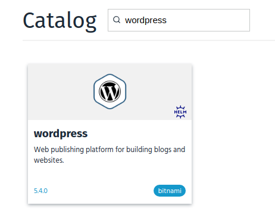
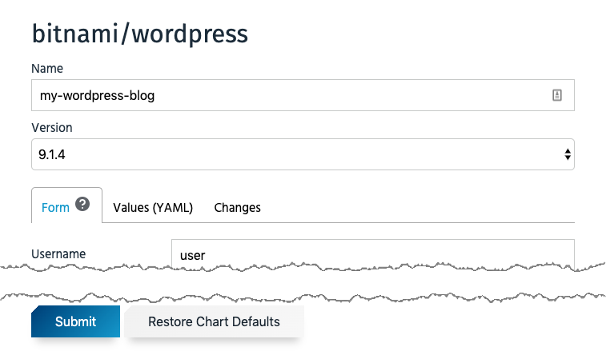
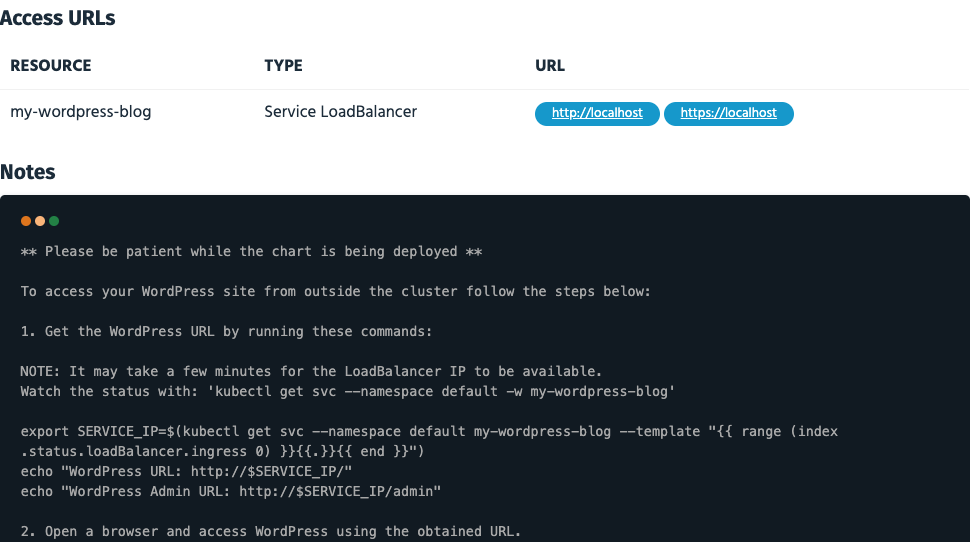
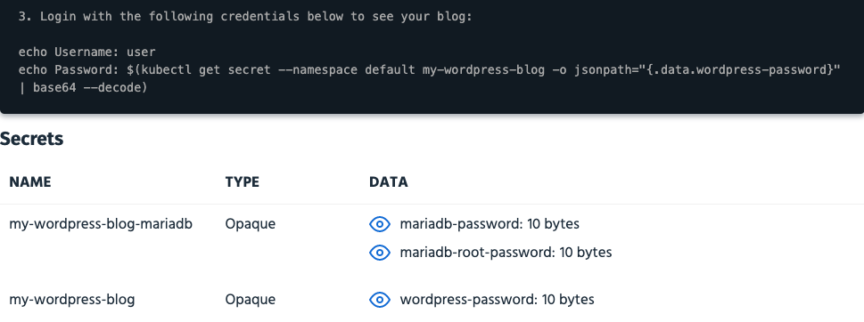
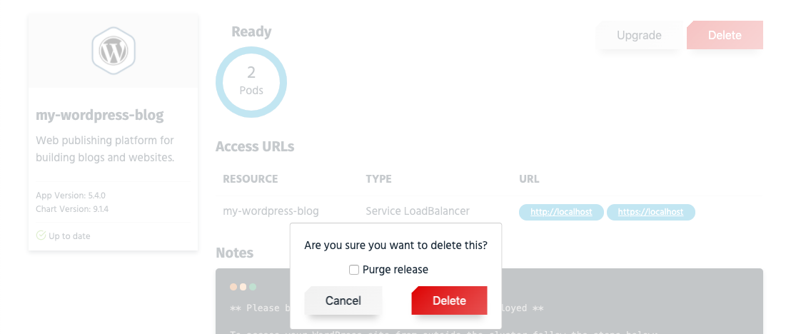

This guide will walk you through the process of deploying Kubeapps for your cluster and installing an example application.

{}
This getting started guide is a copy of
[Get Started with Kubeapps](https://github.com/kubeapps/kubeapps/blob/master/docs/user/getting-started.md)
in the [kubeapps/kubeapps repository](https://github.com/kubeapps/kubeapps)
inclusive of commit
[1e49264](https://github.com/kubeapps/kubeapps/commit/1e49264088094dfd327d2a24b62cda470cc547d0)
on April 20, 2020.
{}

This guide is also available in video form:



## Prerequisites

Kubeapps assumes a working Kubernetes cluster (v1.8+),
[`Helm`](https://helm.sh/) (2.14.0+) installed in your cluster and
[`kubectl`](https://kubernetes.io/docs/tasks/tools/install-kubectl/) installed
and configured to talk to your Kubernetes cluster. Kubeapps has been tested with
Azure Kubernetes Service (AKS), Google Kubernetes Engine (GKE), `minikube` and
Docker for Desktop Kubernetes. Kubeapps works on RBAC-enabled clusters and this
configuration is encouraged for a more secure install.

{}
On GKE, you must either be an "Owner" or have the "Container Engine Admin" role
in order to install Kubeapps.
{}

## Step 1: Install Kubeapps

Use the Helm chart to install the latest version of Kubeapps:

For Helm 2:

```bash
helm repo add bitnami https://charts.bitnami.com/bitnami
helm install --name kubeapps --namespace kubeapps bitnami/kubeapps
```

If you are using Helm 3, you need to set an extra flag to enable it:

```bash
helm repo add bitnami https://charts.bitnami.com/bitnami
kubectl create namespace kubeapps
helm install kubeapps --namespace kubeapps bitnami/kubeapps --set useHelm3=true
```

For detailed information on installing, configuring and upgrading Kubeapps,
checkout the
[chart README](https://github.com/kubeapps/kubeapps/blob/master/chart/kubeapps/README.md).

The above commands will deploy Kubeapps into the `kubeapps` namespace in your
cluster. It may take a few minutes to execute. Once it has been deployed and the
Kubeapps pods are running, continue to step 2.

## Step 2: Create a Kubernetes API token

Access to the Dashboard requires a Kubernetes API token to authenticate with the
Kubernetes API server.

```bash
kubectl create serviceaccount kubeapps-operator
kubectl create clusterrolebinding kubeapps-operator --clusterrole=cluster-admin --serviceaccount=default:kubeapps-operator
```

{}
**Note**: It's not recommended to create `cluster-admin` users for Kubeapps
production usage. Please refer to the
[Access Control](https://github.com/kubeapps/kubeapps/blob/master/docs/user/access-control.md)
documentation to configure fine-grained access control for users.
{}

To retrieve the token,

### On Linux/macOS:

```bash
kubectl get secret $(kubectl get serviceaccount kubeapps-operator -o jsonpath='{range .secrets[*]}{.name}{"\n"}{end}' | grep kubeapps-operator-token) -o jsonpath='{.data.token}' -o go-template='{{.data.token | base64decode}}' && echo
```

### On Windows:

Create a file called `GetDashToken.cmd` with the following lines in it:

```bat
@ECHO OFF
REM Get the Service Account
kubectl get serviceaccount kubeapps-operator -o jsonpath={.secrets[].name} > s.txt
SET /p ks=<s.txt
DEL s.txt

REM Get the Base64 encoded token
kubectl get secret %ks% -o jsonpath={.data.token} > b64.txt

REM Decode The Token
DEL token.txt
certutil -decode b64.txt token.txt
```

Open a command prompt and run the `GetDashToken.cmd` Your token can be found in
the `token.txt` file.

## Step 3: Start the Kubeapps Dashboard

Once Kubeapps is installed, securely access the Kubeapps Dashboard from your
system by running:

```bash
kubectl port-forward -n kubeapps svc/kubeapps 8080:80
```

This will start an HTTP proxy for secure access to the Kubeapps Dashboard. Visit
http://127.0.0.1:8080/ in your preferred web browser to open the Dashboard.
Here's what you should see:


Paste the token generated in the previous step to authenticate and access the
Kubeapps dashboard for Kubernetes.


***Note:*** If you are setting up Kubeapps for other people to access, you will
want to use a different service type or setup Ingress rather than using the
above `kubectl port-forward`. For detailed information on installing,
configuring and upgrading Kubeapps, checkout the
[chart README](https://github.com/kubeapps/kubeapps/blob/master/chart/kubeapps/README.md).

## Step 4: Deploy WordPress

Once you have the Kubeapps Dashboard up and running, you can start deploying
applications into your cluster.

- Use the "Deploy App" or click on the "Catalog" page in the Dashboard to select
  an application from the list of charts in any of the configured Helm chart
  repositories. This example assumes you want to deploy WordPress.

  

- Click the "Deploy" button.

  

- You will be prompted for the release name and values for the application. The
  form is populated by the values (YAML), which you can see in the adjacent tab.

  

- Click the "Submit" button. The application will be deployed. You will be able
  to track the new Helm deployment directly from the browser. The status will be
  shown at the top and you can also look at the individual resources lower in
  the page. It will also show the number of ready pods. If you run your cursor
  over the status, you can see the workloads and number of ready and total pods
  within them.

  

To access your new WordPress site, you can run the commands in the "Notes"
section to get the URLs or simply click a URL (HTTP and HTTPS) shown.

{}
**Note**: Depending on your cloud provider of choice, it may take some time
for an access URL to be available for the application and the Service will stay
in a "Pending" state until a URL is assigned. If using Minikube, you will need
to run `minikube tunnel` in your terminal in order for an IP address to be
assigned to your application.
{}




To get the credentials for logging into your WordPress account, refer to the
"Notes" section. You can also get the WordPress password by scrolling down to
"Secrets" and clicking the eye next to `wordpress-password`.



## [Optional] Step 5: Uninstall/Delete WordPress
If you want to uninstall/delete your WordPress application, you can do so by
clicking the "Delete" button. You can choose to click the checkbox for "Purge
Release" (default action with the Helm 3 CLI). If you do not click it, the Helm
chart history will remain (default action with Helm 2). This is fine, so long as
you don't attempt to install another chart with the same name in the same
namespace.



## Next Steps

Learn more about Kubeapps with the links below:

- [Detailed installation instructions](https://github.com/kubeapps/kubeapps/blob/master/chart/kubeapps/README.md)
- [Deploying Operators](https://github.com/kubeapps/kubeapps/blob/master/docs/user/operators.md)
- [Kubeapps Dashboard documentation](https://github.com/kubeapps/kubeapps/blob/master/docs/user/dashboard.md)
- [Kubeapps components](https://github.com/kubeapps/kubeapps/blob/master/docs/architecture/overview.md)
- [Roadmap](https://github.com/kubeapps/kubeapps/wiki/Roadmap)