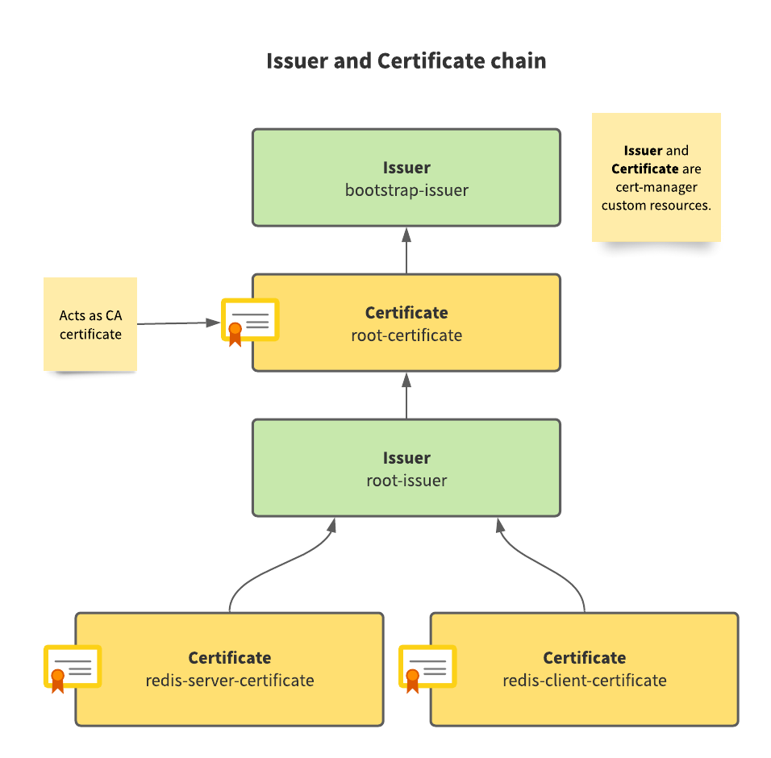
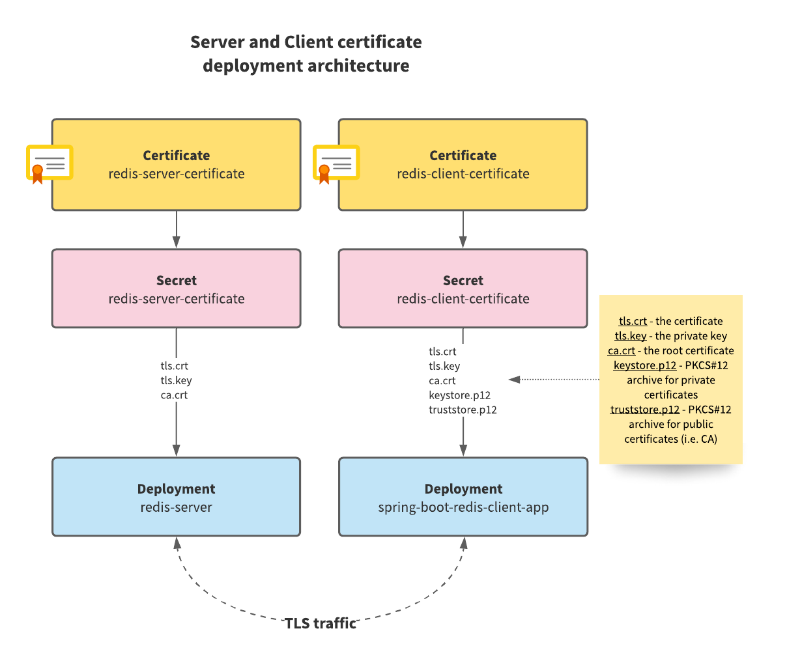
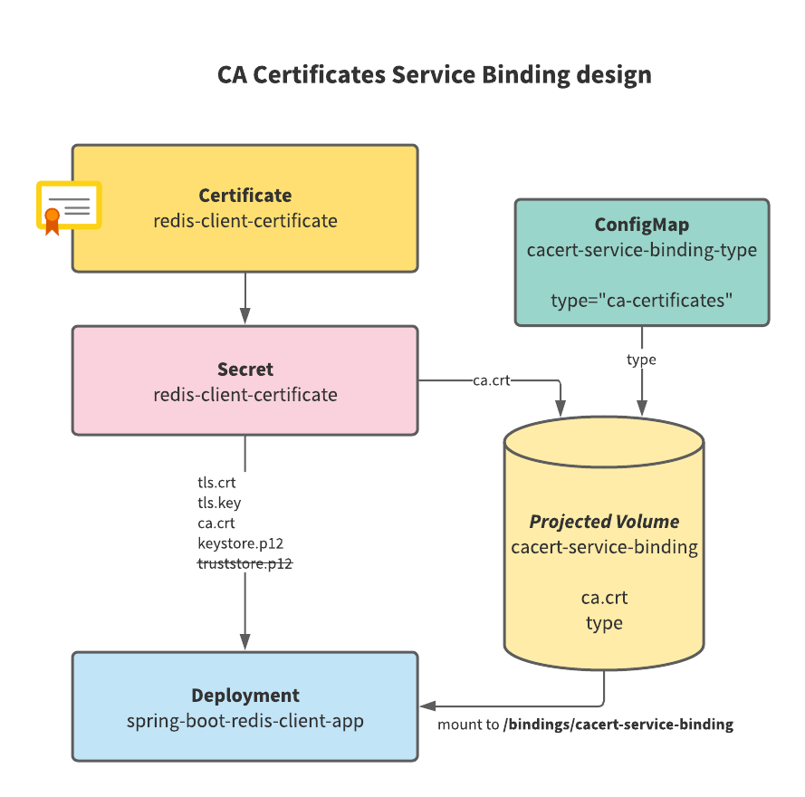

This guide is going to walk you through the steps for building a working implementation of Kubernetes workloads communicating internally using mutual TLS (mTLS). The example client application and service in this guide depict a
working instance of such architecture, and can be applied to many other open source or proprietary services that
support traffic encryption with mTLS. 

It is written specifically for application developers who want to add another layer of security to their Kubernetes workload
traffic using mutual TLS, and requires a working knowledge of basic Kubernetes constructs and command-line 
operations using `kubectl`.

Upon completing this guide, you should have a working knowledge and working reference implementation of workloads communicating 
using mutual TLS.

This guide has three sections:

- **Part I: Creating Workloads** defines a Redis workload and a Spring Boot client application workload communicating on the cluster 
without traffic encryption. 
- **Part II: Enabling mTLS** updates the design to include mutual TLS, and introduces a certificate manager into the cluster to aid 
the creation of required certificates for powering encrypted traffic using mutual TLS. 
- **Part II (Extended Cut): Managing CA Certificates Using Service Bindings** addresses a potential issue with a JVM-based CA certificate truststore that readers might find useful. This section is optional. 

## Part I: Creating Workloads

From a sandbox, set up a local, working Kubernetes cluster. 

Note: Because this guide is only for demonstration and evaluation purposes, it is recommended that you create workloads from a sandbox.

There are a few tools that you can use to set up a local Kubernetes cluster with a single node. The examples in this guide use [kind](https://kind.sigs.k8s.io/docs/user/quick-start/). 
Two other tools to consider are:

- [minikube](https://minikube.sigs.k8s.io/docs/start/)
- [MicroK8s](https://microk8s.io/).  

To verify a working Kubernetes environment, run:

```shell
kubectl cluster-info
```

To ensure you are working in a proper sandbox, verify your current context by running:

```shell
kubectl config current-context
```

You should see a familiar sandbox environment name. Verify that this is the context where you want to work.

Create an empty yaml file called `mtls-demo.yaml`. You are going to use this file as one of your primary artifacts for this
guide.

To start, create a Kubernetes namespace for this demonstration called `mtls-demo`:

> Append this definition to the empty `mtls-demo.yaml` file

```yaml
apiVersion: v1
kind: Namespace
metadata:
  name: mtls-demo
```

```shell
kubectl apply -f mtls-demo.yaml
```

Next, create a basic Redis server Kubernetes deployment and service within the cluster with the following
definition:

> Append this definition to `mtls-demo.yaml` file.

```yaml
---
apiVersion: apps/v1
kind: Deployment
metadata:
  namespace: mtls-demo
  name: redis-server
spec:
  replicas: 1
  selector:
    matchLabels:
      name: redis-server
  template:
    metadata:
      labels:
        name: redis-server
    spec:
      containers:
        - name: redis-server
          image: bitnami/redis:6.2.6
          ports:
            - containerPort: 6379
          env:
            - name: ALLOW_EMPTY_PASSWORD
              value: "yes"
---
apiVersion: v1
kind: Service
metadata:
  name: redis-server
  namespace: mtls-demo
spec:
  ports:
    - port: 6379
      targetPort: 6379
  selector:
    name: redis-server
```

```shell
kubectl apply -f mtls-demo.yaml
```

The Redis server does not enable TLS support by default. Part of the goal is to enable this support in future steps.
For now, you want to get a Redis server running and accessible within the cluster. Password support is disabled
in Redis for this demonstration so that you can focus on enabling TLS support. Refer to official Redis
guidelines as to the usage of proper password protection.

If all reconciles successfully, there should be a Redis server running in the cluster. To verify that you can
communicate with the Redis server, run:

```shell
kubectl exec deployment/redis-server -n mtls-demo -- redis-cli ping
```

You should see "PONG" as a response. This is Redis' response for a "ping" message which acts as an establishing
dial-tone.

---

Next, create a client application to connect to the Redis instance. For this step, use a
sample Spring Boot application with a Spring Data Redis library integration. The Docker image for the application is
built with the help of Spring Boot Gradle plugins' `bootBuildImage` task, which relies
on [Cloud Native Buildpacks](https://buildpacks.io/).

To review the code for this sample application [go here](https://github.com/ddubson/spring-boot-redis-mtls-demo).

The reusable Docker image is published
on [Docker Hub](https://hub.docker.com/repository/docker/ddubson/spring-boot-redis-mtls-demo) with name and
tag `ddubson/spring-boot-redis-mtls-demo:basic`.

Now, create a client application Deployment using the client application Docker image.

> Append this definition to `mtls-demo.yaml` file.

```yaml
---
apiVersion: apps/v1
kind: Deployment
metadata:
  labels:
    app: spring-boot-redis-client-app
  name: spring-boot-redis-client-app
  namespace: mtls-demo
spec:
  replicas: 1
  selector:
    matchLabels:
      app: spring-boot-redis-client-app
  template:
    metadata:
      labels:
        app: spring-boot-redis-client-app
    spec:
      containers:
        - image: ddubson/spring-boot-redis-mtls-demo:basic
          name: spring-boot-redis-client-app
          env:
            - name: SPRING_REDIS_HOST
              value: "redis-server"
            - name: SPRING_REDIS_PORT
              value: "6379"
          ports:
            - containerPort: 8080
              name: app-port
              protocol: TCP
          livenessProbe:
            httpGet:
              path: /actuator/health
              port: app-port
          readinessProbe:
            httpGet:
              path: /actuator/health
              port: app-port
---
apiVersion: v1
kind: Service
metadata:
  labels:
    app: spring-boot-redis-client-app
  name: spring-boot-redis-client-app
  namespace: mtls-demo
spec:
  ports:
    - name: service-port
      port: 8080
      protocol: TCP
      targetPort: 8080
  selector:
    app: spring-boot-redis-client-app
  type: ClusterIP
```

```shell
kubectl apply -f mtls-demo.yaml
```

The above Deployment definition of a Spring Boot client application relies on the Redis Service resource being available on
the cluster at host address `redis-server` on port `6379`. TLS support is not yet enabled, and so the definition does
not have any configuration besides the host and port of the Redis server.

The application is configured with a liveness and readiness probe. If it reconciles successfully, then you know it has
connected to Redis successfully. 

For extra verification, the client application comes with an API endpoint that can be queried. 
This specifically interacts with Redis:

```shell
kubectl port-forward svc/spring-boot-redis-client-app 8080:8080 -n mtls-demo

# In another terminal window/tab
curl -XGET http://localhost:8080/

# You should receive a random UUID string as a response.
```

> You can now stop port forwarding and proceed to the next steps.

The client application is able to interact with Redis in the cluster using an unencrypted connection. Now, you can focus
on securing the traffic between Redis and the client application using mutual TLS.

> Find the full `mtls-demo.yaml` up to this point for [reference here](https://github.com/ddubson/spring-boot-redis-mtls-demo/blob/main/mtls-demo-partI.yaml).

---

## Part II: Enabling mTLS

The mutual TLS (mTLS) scheme requires the use of digital certificates. The first step is to ensure 
the cluster has an entity in charge of managing certificates. In this example, use [**cert-manager**](https://cert-manager.io/).

As of the release of this guide, the latest cert-manager version is `1.6.1`. Follow the installation process for this
version, as outlined in [cert-manager install docs](https://cert-manager.io/docs/installation/).

```shell
kubectl apply -f https://github.com/jetstack/cert-manager/releases/download/v1.6.1/cert-manager.yaml
```

To verify that cert-manager is installed and operational, run:

```shell
kubectl rollout status deployment/cert-manager -n cert-manager 
# cert-manager should be successfully rolled out
```

Once cert-manager is installed and operational on the cluster, move to the next step of defining the required
components for mTLS.

Focus on creating components required for private Public Key Infrastructure (PKI). In this case, *private*
refers to components within an internal or non-public system interacting over encrypted channels using public/private
keys and digital certificates. Our client application and internal Redis server can be thought of as "private" because the
traffic between them never leaves the boundaries of the cluster.

For mutual TLS between server and client, you will be required to provide the components certificates. Specifically, you
are going to need a server certificate, client certificate, and Certificate Authority (CA) certificate. The certificates and the
authorities issuing those certificates within a Kubernetes cluster are managed by cert-manager. The final
certificate chain is going to look like:



"Leaf" certificates are server and client certificates. The server certificate is provided to Redis. The
client certificate to the client application.

Here is what the final arrangement looks like:



Start with creating your first cert-manager `Issuer` custom resource. An `Issuer` is responsible for handling the
process of requesting and subsequently issuing certificates to interested parties. The first `Issuer` you create is
going to be responsible for issuing a root certificate. A root certificate acts as the trusted certificate
authority (CA) certificate within the mTLS scheme.

> IMPORTANT: Add this definition right after the `mtls-demo` namespace definition in `mtls-demo.yaml`.

```yaml
---
apiVersion: cert-manager.io/v1
kind: Issuer
metadata:
  name: bootstrap-issuer
  namespace: mtls-demo
spec:
  selfSigned: { }
```

```shell
kubectl apply -f mtls-demo.yaml

# Verify that the Issuer is ready for use
kubectl wait --for=condition=Ready=True issuer bootstrap-issuer -n mtls-demo
# You should receive a "condition met" message.
```

For this demonstration, the type of `Issuer` is [`SelfSigned`](https://cert-manager.io/docs/configuration/selfsigned/),
but you can change this to other cert-manager supported types such
as [`CA` Issuer](https://cert-manager.io/docs/configuration/ca/) for production purposes.

Next, define the root `Certificate` for the namespace. All components rely on this as the trusted root
certificate:

> Add this definition right after the bootstrap Issuer in `mtls-demo.yaml`

```yaml
---
apiVersion: cert-manager.io/v1
kind: Certificate
metadata:
  name: root-certificate
  namespace: mtls-demo
spec:
  isCA: true
  secretName: root-certificate
  commonName: "Root Certificate"
  privateKey:
    algorithm: RSA
    size: 4096
    encoding: PKCS8
  issuerRef:
    name: bootstrap-issuer
    kind: Issuer
```

```shell
kubectl apply -f mtls-demo.yaml

# Verify that the Certificate has been issued
kubectl wait --for=condition=Ready=True cert root-certificate -n mtls-demo
# You should receive "condition met" message.
```

Observe that the `Issuer` for this certificate is the bootstrap `Issuer` from the previous step. Without the
initial `Issuer`, there would be no one to issue the root certificate.

You can now define the root `Issuer` (not to be confused with our bootstrapping `Issuer`). The root `Issuer` is responsible for issuing certificates geared towards server or client uses.

> Add this definition right after the root `Certificate` definition in `mtls-demo.yaml`

```yaml
---
apiVersion: cert-manager.io/v1
kind: Issuer
metadata:
  name: root-issuer
  namespace: mtls-demo
spec:
  ca:
    secretName: root-certificate
```

```shell
kubectl apply -f mtls-demo.yaml

# Verify that the Issuer is ready for use.
kubectl wait --for=condition=Ready=True issuer root-issuer -n mtls-demo
# You should receive "condition met" message.
```

For the mutual TLS scheme to work, parties seeking to communicate require two certificates. The providing service (i.e.
Redis) needs a "server certificate", whereas all the clients of the service (i.e., Spring Boot app) need a "client
certificate". Define both types of certificates for this purpose.

To start, you need to define a server certificate. TLS support in Redis (and in most other services) is predicated upon
launching the service with a digital certificate (`.crt` file), private key (`.key` file), and CA certificate (`.crt`
file) provided. Check out [Redis TLS support documentation](https://redis.io/topics/encryption) for details.

> Add this definition right after the root `Issuer` definition in `mtls-demo.yaml`.

```yaml
---
apiVersion: cert-manager.io/v1
kind: Certificate
metadata:
  name: redis-server-certificate
  namespace: mtls-demo
spec:
  secretName: redis-server-certificate
  privateKey:
    algorithm: RSA
    encoding: PKCS8
    size: 4096
  commonName: "redis demo"
  usages:
    - server auth
    - key encipherment
    - digital signature
  issuerRef:
    name: root-issuer
    kind: Issuer
```

```shell
kubectl apply -f mtls-demo.yaml

# Verify that the Certificate has been issued.
kubectl wait --for=condition=Ready=True cert redis-server-certificate -n mtls-demo
# You should receive "condition met" message.
```

You have successfully obtained a server certificate for Redis, and can move on to creating a client certificate for
use by Redis clients.

> Add this definition right after server certificate definition `mtls-demo.yaml`.

```yaml
---
apiVersion: v1
kind: Secret
metadata:
  name: redis-client-certificate-keystore-password
  namespace: mtls-demo
data:
  password: cGFzc3dvcmQxMjM= # "password123"  
---
apiVersion: cert-manager.io/v1
kind: Certificate
metadata:
  name: redis-client-certificate
  namespace: mtls-demo
spec:
  secretName: redis-client-certificate
  privateKey:
    algorithm: RSA
    encoding: PKCS8
    size: 4096
  commonName: "redis demo"
  usages:
    - client auth
    - key encipherment
    - digital signature
  issuerRef:
    name: root-issuer
    kind: Issuer
  keystores:
    pkcs12:
      create: true
      passwordSecretRef:
        name: redis-client-certificate-keystore-password
        key: password
```

```shell
kubectl apply -f mtls-demo.yaml

# Verify that the Certificate has been issued.
kubectl wait --for=condition=Ready=True cert redis-client-certificate -n mtls-demo
# You should receive "condition met" message.
```

You have now obtained a client certificate to be used with any Redis client that is TLS-enabled. Above, you define a
Secret resource containing a password for the PKCS#12 keystore and truststore that cert-manager is going to create as part of
its Certificate issuance process. You need a PKCS#12 keystore and truststore because the client is JVM based,
and the certificate for the client and the CA certificate is enclosed within these stores, and used by the JVM at
runtime. Keystores contain private certificates and truststores contain publicly available certificates like CA
certificates.

You are now ready to enable TLS support in Redis server, but first, revisit the Deployment definition of Redis server.
According to [Redis documentation on TLS support](https://redis.io/topics/encryption), you must tell Redis that TLS is
enabled, and provide the server certificate, the server private key, and the CA certificate.

As an example, Redis may be started in TLS mode over the command line:

```shell
# The certificate, key, and CA cert specified below is an example. You do not have these files locally.
redis-server --tls-port 6379 --port 0 \
    --tls-cert-file ./redis.crt \
    --tls-key-file ./redis.key \
    --tls-ca-cert-file ./ca.crt
```

Now, translate this example in Deployment definition terms.

> Replace the existing definition of `redis-server` Deployment in `mtls-demo.yaml`.

```yaml
apiVersion: apps/v1
kind: Deployment
metadata:
  namespace: mtls-demo
  name: redis-server
spec:
  replicas: 1
  selector:
    matchLabels:
      name: redis-server
  template:
    metadata:
      labels:
        name: redis-server
    spec:
      volumes:
        - name: certs
          secret:
            secretName: redis-server-certificate
      containers:
        - name: redis-server
          image: bitnami/redis:6.2.6
          ports:
            - containerPort: 6379
          volumeMounts:
            - mountPath: /certs
              name: certs
          env:
            - name: ALLOW_EMPTY_PASSWORD
              value: "yes"
            - name: REDIS_TLS_ENABLED
              value: "yes"
            - name: REDIS_TLS_PORT
              value: "6379"
            - name: REDIS_TLS_CERT_FILE
              value: "/certs/tls.crt"
            - name: REDIS_TLS_KEY_FILE
              value: "/certs/tls.key"
            - name: REDIS_TLS_CA_FILE
              value: "/certs/ca.crt"
```

```shell
kubectl apply -f mtls-demo.yaml
```

Mount a server certificate Secret resource as a Volume onto the Redis Pod, and place it into `/certs` directory on
the Pod. The Secret resource is a reference to the Redis server certificate and contains the following
files: 

- `tls.crt` (the server certificate)
- `tls.key` (the private key)
- `ca.crt` (the CA certificate). 

All files from the Secret are placed into the `/certs` directory.

Define a few environment variables for the container which direct Redis to look for the server certificate files at
the appropriate locations.

Redis should now be started in TLS mode. You can check it by running the following command:

```shell
kubectl exec deployment/redis-server -n mtls-demo -- redis-cli ping
```

You should see the following message: `Error: Connection reset by peer`. The connection cannot be established to Redis
and this is correct. You now need the client certificate on the client end (in this case, `redis-cli`) to be able to
properly establish a TLS connection. Establishing a connection using `redis-cli` to a TLS-enabled Redis server is an
exercise left to the reader since the focus here is on enabling a client Spring Boot application instead.

You now move on to enabling the Spring Boot Redis client application to connect to TLS-enabled Redis.

Replace the existing Deployment definition of the Spring Boot Redis client application to insert the Redis
client certificate that was issued in a previous step. Additionally, create a Secret resource to capture Java VM
options to modify the loaded certificates within the runtime. 

> Replace the existing definition of `spring-boot-redis-client-app` Deployment in `mtls-demo.yaml`
> Add `spring-boot-redis-client-app-java-opts` Secret before the Deployment.

```yaml
---
apiVersion: v1
kind: Secret
metadata:
  name: spring-boot-redis-client-app-java-opts
  namespace: mtls-demo
stringData:
  JAVA_OPTS: >-
    -Djavax.net.ssl.keyStoreType=PKCS12
    -Djavax.net.ssl.keyStore=/certs/keystore.p12
    -Djavax.net.ssl.keyStorePassword=password123
    -Djavax.net.ssl.trustStoreType=PKCS12
    -Djavax.net.ssl.trustStore=/certs/truststore.p12
    -Djavax.net.ssl.trustStorePassword=password123
---
apiVersion: apps/v1
kind: Deployment
metadata:
  labels:
    app: spring-boot-redis-client-app
  name: spring-boot-redis-client-app
  namespace: mtls-demo
spec:
  replicas: 1
  selector:
    matchLabels:
      app: spring-boot-redis-client-app
  template:
    metadata:
      labels:
        app: spring-boot-redis-client-app
    spec:
      volumes:
        - name: client-certificate
          secret:
            secretName: redis-client-certificate
      containers:
        - image: ddubson/spring-boot-redis-mtls-demo:basic
          name: spring-boot-redis-client-app
          volumeMounts:
            - mountPath: /certs
              name: client-certificate
          env:
            - name: SPRING_REDIS_HOST
              value: "redis-server"
            - name: SPRING_REDIS_PORT
              value: "6379"
            - name: SPRING_REDIS_SSL
              value: "true"
          envFrom:
            - secretRef:
                name: spring-boot-redis-client-app-java-opts
          ports:
            - containerPort: 8080
              name: app-port
              protocol: TCP
          livenessProbe:
            httpGet:
              path: /actuator/health
              port: app-port
          readinessProbe:
            httpGet:
              path: /actuator/health
              port: app-port
```

```shell
kubectl apply -f mtls-demo.yaml
```

Mount the Redis client certificate Secret resource as a Volume onto the application Pod. Specify the path
as `/certs`. Notify Spring Data Redis library via configuration environment variable `SPRING_REDIS_SSL` that Redis is
accepting TLS connections. The key part of introducing the Redis client certificate and CA certificate into the
application's JVM is the injection of the `spring-boot-redis-client-app-java-opts` Secret as a set of environment
variables containing a single `JAVA_OPTS` environment variable allows us to define VM options for the JVM. This is where you 
specify [Java Secure Socket Extension (JSSE)](https://docs.oracle.com/javase/8/docs/technotes/guides/security/jsse/JSSERefGuide.html)
environment variables: 

- `javax.net.ssl.keyStore` is the container for private certificates because it contains the Redis client
certificate (`tls.crt`).
- `javax.net.ssl.trustStore` is the container for public certificates because it contains the CA
certificate (`ca.crt` - our root certificate).

> Refer to [Java Secure Socket Extension (JSSE) Reference Guide](https://docs.oracle.com/javase/8/docs/technotes/guides/security/jsse/JSSERefGuide.html#CustomizingStores)
> for more about keystores and truststores.

cert-manager creates the keystore and truststore files on the fly as part of its Certificate issuance
process, so you get it out of the box. Keystore and truststore passwords are in plain text. Obfuscating the password is
out-of-scope for this guide but is highly suggested for production definitions. The password referred to in plain text
must be the same as the contents of the Secret `redis-client-certificate-keystore-password`.

Verify that the application has now connected to a TLS-enabled Redis server:

```shell
kubectl port-forward svc/spring-boot-redis-client-app 8080:8080 -n mtls-demo

# In another terminal window/tab
curl -XGET http://localhost:8080/

# You should receive a random UUID string as a response.
```

> You can now stop port forwarding and proceed to the next steps.

> ⚠️ Warning
>
> A caveat to be aware of is when you specify an explicit truststore via VM option and pass it to the JVM because it *overrides*
> the default truststore! This can become a problem in cases where you need all the CA certificates from the default
> truststore (usually located in `$JAVA_HOME/lib/security/cacerts`), AND a custom CA certificate truststore that is
> dynamically issued by cert-manager. Read the **Part II Extended Cut: Managing CA certificates using Service Bindings**
> section for more information.

Congratulations! You have ensured that the traffic within the cluster between Redis and the client
application relies on TLS and is encrypted.

Skip to [Finale](#finale) if you are not interested in the next optional section on CA certificates and JVM truststores.

## Part II (Extended Cut): Managing CA Certificates Using Service Bindings

> Skip this section if your client application is not Spring Boot or Docker image built with
> Cloud Native Buildpacks.

You got the client application communicating with Redis using mutual TLS scheme in the cluster. Excellent!

This is an extra section specifically meant to address the issue of overriding the default JVM truststore in the Spring
Boot client application, built with Cloud Native Buildpacks.

To add the Redis client CA certificate to the existing default JVM truststore of Cloud Native Buildpack-built
image, create a [runtime Service Binding](https://paketo.io/docs/howto/configuration/#what-is-a-binding) within the
container and populate it with the CA certificate. Here is what the design of our solution looks like:



> Replace the existing definition of `spring-boot-redis-client-app` Deployment in `mtls-demo.yaml`.
> Add `cacert-service-binding-type` ConfigMap and modify existing `spring-boot-redis-client-app-java-opts` Secret.

```yaml
---
apiVersion: v1
kind: ConfigMap
metadata:
  name: cacert-service-binding-type
  namespace: mtls-demo
data:
  type: "ca-certificates"
---
apiVersion: v1
kind: Secret
metadata:
  name: spring-boot-redis-client-app-java-opts
  namespace: mtls-demo
stringData:
  JAVA_OPTS: >-
    -Djavax.net.ssl.keyStoreType=PKCS12
    -Djavax.net.ssl.keyStore=/certs/keystore.p12
    -Djavax.net.ssl.keyStorePassword=password123
---
apiVersion: apps/v1
kind: Deployment
metadata:
  labels:
    app: spring-boot-redis-client-app
  name: spring-boot-redis-client-app
  namespace: mtls-demo
spec:
  replicas: 1
  selector:
    matchLabels:
      app: spring-boot-redis-client-app
  template:
    metadata:
      labels:
        app: spring-boot-redis-client-app
    spec:
      volumes:
        - name: client-certificate
          secret:
            secretName: redis-client-certificate
        - name: cacert-service-binding
          projected:
            sources:
              - configMap:
                  name: cacert-service-binding-type
              - secret:
                  name: redis-client-certificate
                  items:
                    - key: ca.crt
                      path: ca.crt
      containers:
        - image: ddubson/spring-boot-redis-mtls-demo:basic
          name: spring-boot-redis-client-app
          volumeMounts:
            - mountPath: /certs
              name: client-certificate
            - mountPath: /bindings/cacert-service-binding
              name: cacert-service-binding
          env:
            - name: SERVICE_BINDING_ROOT
              value: "/bindings"
            - name: SPRING_REDIS_HOST
              value: "redis-server"
            - name: SPRING_REDIS_PORT
              value: "6379"
            - name: SPRING_REDIS_SSL
              value: "true"
          envFrom:
            - secretRef:
                name: spring-boot-redis-client-app-java-opts
          ports:
            - containerPort: 8080
              name: app-port
              protocol: TCP
          livenessProbe:
            httpGet:
              path: /actuator/health
              port: app-port
          readinessProbe:
            httpGet:
              path: /actuator/health
              port: app-port
```

```shell
kubectl apply -f mtls-demo.yaml
```

Remove any VM options previously set regarding the truststore in
the `spring-boot-redis-client-app-java-opts` Secret resource, which is going to be loaded in a different fashion using a
Service Binding and a projected Volume.

A [Service Binding](https://paketo.io/docs/howto/configuration/#what-is-a-binding) is a structured folder mounted as a
Volume in the client application Pod. In this case, it contains a file called `type` with literal text `ca-certificates`
because you are using a CA certificates Service Binding type, and the certificate file (i.e. `ca.crt`). Create
a `SERVICE_BINDING_ROOT` environment variable where you define the root directory of all bindings. In this case, it is set
to `/bindings` directory in the container.

Use a [Projected Volume](https://kubernetes.io/docs/concepts/storage/projected-volumes/) to gather the required files
into a directory structure with required files. You have created a `ConfigMap` to store a key `type` with
value `ca-certificates` to define in the projected volume as one of the sources. You have also taken the `ca.crt`
file from `redis-client-certificate` and used it as a second source for the projected volume. Together, these files
represent a single entity that you can mount into the client application container.

Here is what the set of Service Bindings looks like as a file tree in the container:

```text
/bindings
   /cacert-service-binding
      ca.crt
      type
```

Create only one binding for this demonstration with the name of `cacert-service-binding`. The Service Binding
mechanism of the Spring Boot image that you are using automatically registers the `ca-certificates` binding and loads
the CA certificate into the default JVM truststore.

To verify that the Service Binding mechanism worked, run:

```shell
kubectl logs deploy/spring-boot-redis-client-app -n mtls-demo | head -n1

# Observe that the line in the log reads:
# "Added 1 additional CA certificate(s) to system truststore"

kubectl port-forward svc/spring-boot-redis-client-app 8080:8080 -n mtls-demo

# In another terminal window/tab
curl -XGET http://localhost:8080/

# You should receive a random UUID string as a response.
```

> You can now stop port forwarding.

This verifies that the Redis client certificate is loaded into the JVM truststore, and you are able to once again
communicate with Redis over a TLS connection.

---

## Finale

You can find the complete Kubernetes resource definitions for each part
here:

- [**Part I: Creating Workflows**](https://github.com/ddubson/spring-boot-redis-mtls-demo/blob/main/mtls-demo-partI.yaml)
- [**Part II: Enabling mTLS**](https://github.com/ddubson/spring-boot-redis-mtls-demo/blob/main/mtls-demo-partI.yaml) (Requires
  cert-manager pre-installed.)
- [**Part II (Extended Cut): Managing CA Certificates Using Service Bindings**](https://github.com/ddubson/spring-boot-redis-mtls-demo/blob/main/mtls-demo-partII-extended.yaml) (Requires cert-manager pre-installed.)

Finally, do not forget to clean up your cluster, run:

```shell
kubectl delete namespace mtls-demo
kubectl delete -f https://github.com/jetstack/cert-manager/releases/download/v1.6.1/cert-manager.yaml
```

This removes all deployments, services, and other configurations specific to the `mtls-demo` namespace, as well as
the cert-manager installation from the cluster.
