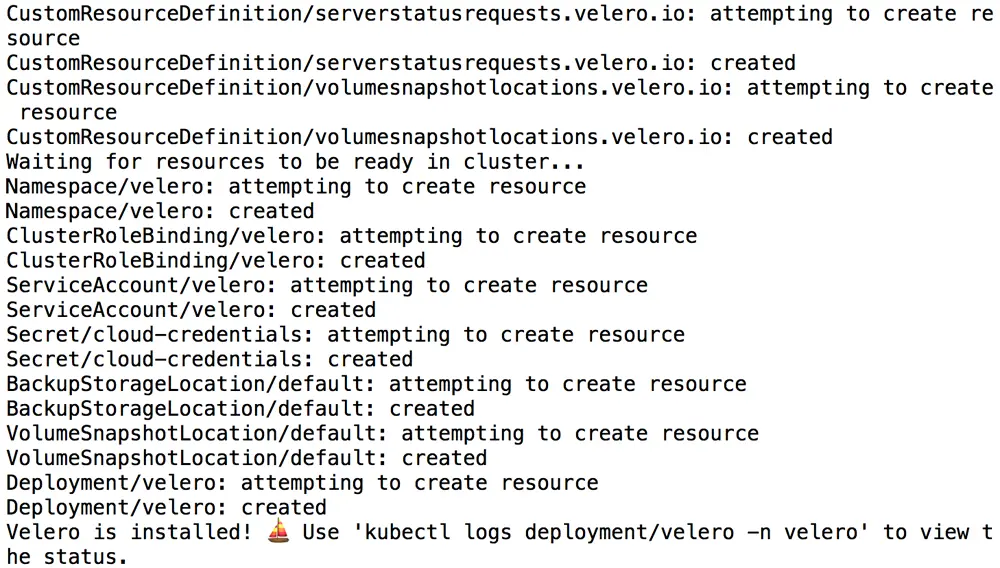

First published on [https://docs.bitnami.com/tutorials/backup-restore-data-kafka-kubernetes/](https://docs.bitnami.com/tutorials/backup-restore-data-kafka-kubernetes/)

[Apache Kafka](https://kafka.apache.org/) is a scalable and highly-available data streaming platform. It is a powerful tool for stream processing and is available under an open source license.

Bitnami's [Apache Kafka Helm chart](https://github.com/bitnami/charts/tree/master/bitnami/cassandra) makes it easy to get started with an Apache Kafka cluster on Kubernetes. This Helm chart is compliant with current best practices and can also be easily upgraded to ensure that you always have the latest fixes and security updates.

Once the cluster is deployed and in operation, it is important to back up its data regularly and ensure that it can be easily restored as needed. Data backup and restore procedures are also important for other scenarios, such as off-site data migration/data analysis or application load testing.

This guide explains how to back up and restore an Apache Kafka deployment on Kubernetes using [Velero](https://velero.io/), an open-source Kubernetes backup/restore tool.

## Assumptions and prerequisites

This guide makes the following assumptions:

* You have two separate Kubernetes clusters - a source cluster and a destination cluster - with *kubectl* and Helm v3 installed. This guide uses Google Kubernetes Engine (GKE) clusters but you can also use any other Kubernetes provider. Learn about [deploying a Kubernetes cluster on different cloud platforms](https://docs.bitnami.com/kubernetes/) and [how to install *kubectl* and Helm](https://docs.bitnami.com/kubernetes/get-started-kubernetes#step-3-install-kubectl-command-line).
* You have previously deployed the Bitnami Apache Kafka Helm chart on the source cluster and added some data to it. Example command sequences to perform these tasks are shown below.

    ```bash
    helm repo add bitnami https://charts.bitnami.com/bitnami
    helm install kafka bitnami/kafka
    kubectl run kafka-client --restart='Never' --image docker.io/bitnami/kafka:2.8.0-debian-10-r27 --namespace default --command -- sleep infinity
    kubectl exec --tty -i kafka-client --namespace default -- bash
    kafka-console-producer.sh --broker-list kafka-0.kafka-headless.default.svc.cluster.local:9092 --topic test
    >first
    >second
    >third
    exit
    ```

* The Kubernetes provider is [supported by Velero](https://velero.io/docs/master/supported-providers/).
* Both clusters are on the same Kubernetes provider, as this is a requirement of [Velero's native support for migrating persistent volumes](https://velero.io/docs/v1.5/migration-case/).
* The restored deployment on the destination cluster will have the same name, namespace and credentials as the original deployment on the source cluster.

| NOTE: For persistent volume migration across cloud providers with Velero, you have the option of using Velero's [Restic integration](https://velero.io/docs/v1.5/restic/). This integration is not covered in this guide.

## Step 1: Install Velero on the source cluster

[Velero](https://velero.io/) is an open source tool that makes it easy to backup and restore Kubernetes resources. It can be used to back up an entire cluster or specific resources such as persistent volumes.

* Modify your context to reflect the source cluster (if not already done).
* Follow the [Velero plugin setup instructions for your cloud provider](https://velero.io/docs/master/supported-providers/). For example, if you are using Google Cloud Platform (as this guide does), follow [the GCP plugin setup instructions](https://github.com/vmware-tanzu/velero-plugin-for-gcp#setup) to create a service account and storage bucket and obtain a credentials file.

* Then, install Velero on the source cluster by executing the command below, remembering to replace the BUCKET-NAME placeholder with the name of your storage bucket and the SECRET-FILENAME placeholder with the path to your credentials file:

  ```bash
  velero install --provider gcp --plugins velero/velero-plugin-for-gcp:v1.2.0 --bucket BUCKET-NAME --secret-file SECRET-FILENAME
  ```

  You should see output similar to the screenshot below as Velero is installed:

  

* Confirm that the Velero deployment is successful by checking for a running pod using the command below:
  
  ```bash
  kubectl get pods -n velero
  ```

## Step 2: Back up the Apache Kafka deployment on the source cluster

The next step involves using Velero to copy the persistent data volumes for the Apache Kafka pods. These copied data volumes can then be reused in a new deployment.

* Create a backup of the volumes in the running Apache Kafka deployment on the source cluster. This backup will contain both the primary and secondary node volumes.

  ```bash
  velero backup create kafka-backup --include-resources=pvc,pv --selector app.kubernetes.io/instance=kafka
  ```

* Execute the command below to view the contents of the backup and confirm that it contains all the required resources:

  ```bash
  velero backup describe kafka-backup  --details
  ```

* To avoid the backup data being overwritten, switch the bucket to read-only access:

  ```bash
  kubectl patch backupstoragelocation default -n velero --type merge --patch '{"spec":{"accessMode":"ReadOnly"}}'
  ```

## Step 3: Restore the Apache Kafka deployment on the destination cluster

You can now restore the persistent volumes and integrate them with a new Apache Kafka deployment on the destination cluster.

* Modify your context to reflect the destination cluster.
* Install Velero on the destination cluster as described in [Step 1](#step-1-install-velero-on-the-source-cluster). Remember to use the same values for the BUCKET-NAME and SECRET-FILENAME placeholders as you did originally, so that Velero is able to access the previously-saved backups.

  ```bash
  velero install --provider gcp --plugins velero/velero-plugin-for-gcp:v1.2.0 --bucket BUCKET-NAME --secret-file SECRET-FILENAME
  ```

* Confirm that the Velero deployment is successful by checking for a running pod using the command below:

  ```bash
  kubectl get pods -n velero
  ```

* Restore the persistent volumes in the same namespace as the source cluster using Velero.

  ```bash
  velero restore create --from-backup kafka-backup
  ```

* Confirm that the persistent volumes have been restored:

  ```bash
  kubectl get pvc
  ```

* Create a new Apache Kafka deployment. Use the same name, namespace and cluster topology as the original deployment. Replace the PASSWORD placeholder with the same administrator password used in the original deployment.

  ```bash
  helm repo add bitnami https://charts.bitnami.com/bitnami
  helm install kafka bitnami/kafka
  ```

| NOTE: The deployment command shown above is only an example. It is important to create the new deployment on the destination cluster using the same namespace, deployment name, credentials and cluster topology as the original deployment on the source cluster.

  This will create a new deployment that uses the original pod volumes (and hence the original data).

* Connect to the new deployment and confirm that your original messages are intact using a query like the example shown below.

  ```bash
  kubectl run kafka-client --restart='Never' --image docker.io/bitnami/kafka:2.8.0-debian-10-r27 --namespace default --command -- sleep infinity
  kubectl exec --tty -i kafka-client --namespace default -- bash
  kafka-console-consumer.sh  --bootstrap-server kafka.default.svc.cluster.local:9092 --topic test --from-beginning
  ```
Confirm that your original data is intact.

## Useful links

* [Bitnami Apache Kafka Helm chart](https://github.com/bitnami/charts/tree/master/bitnami/kafka)
* [Velero documentation](https://velero.io/docs/master/)

