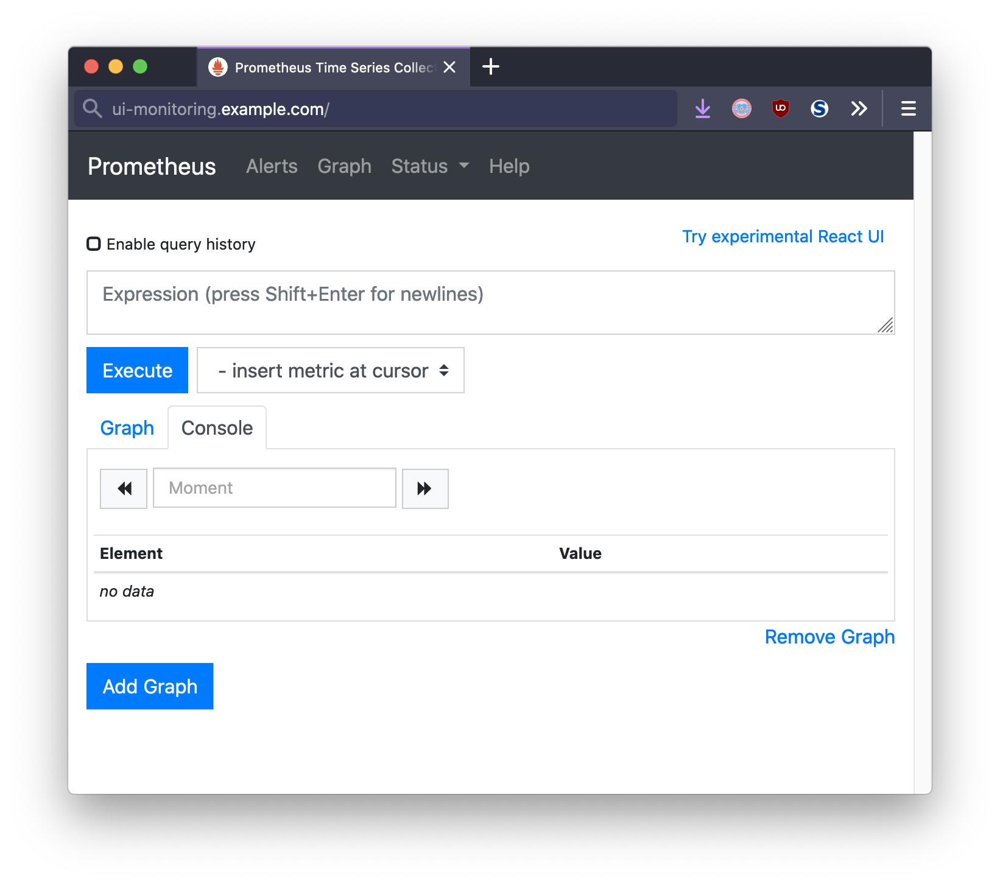
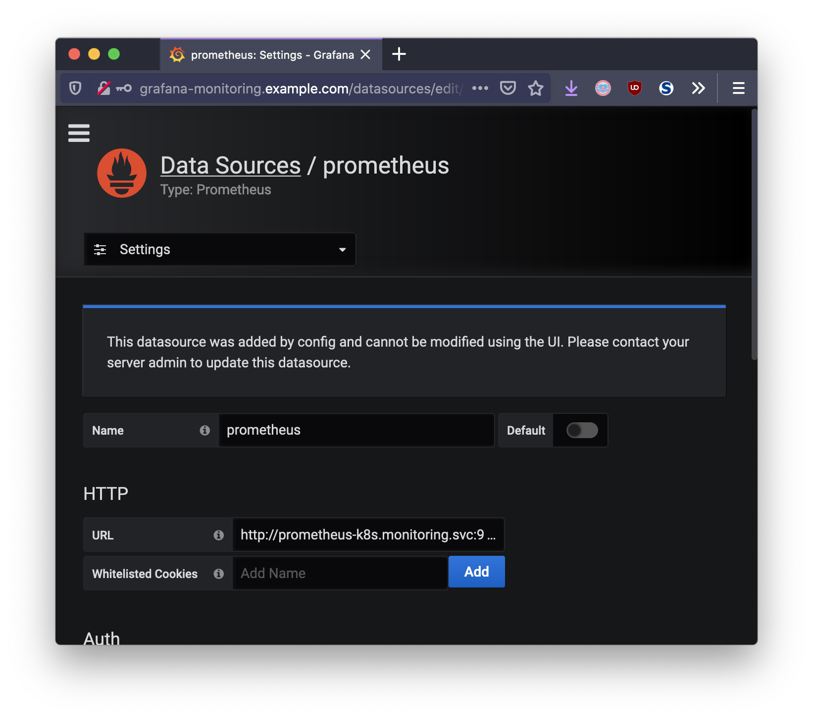
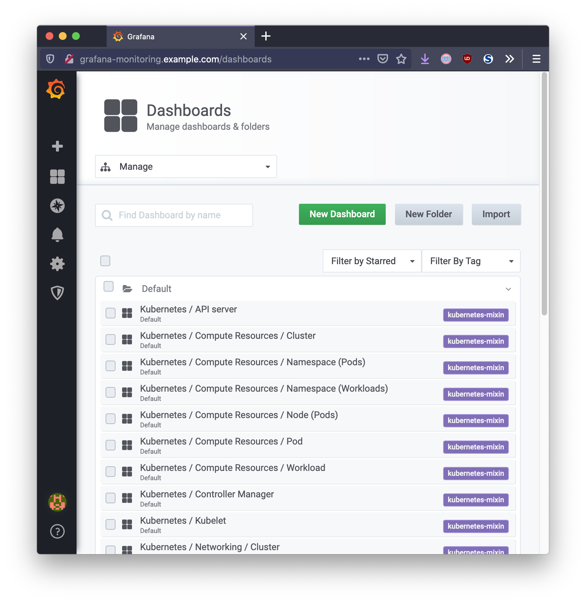
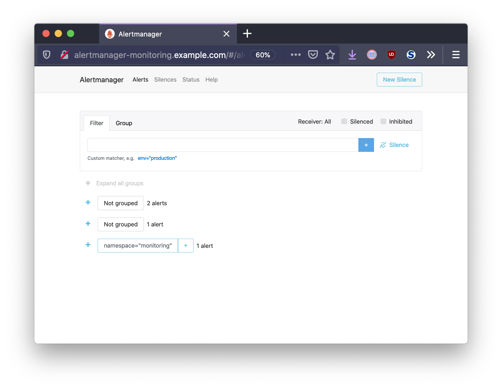
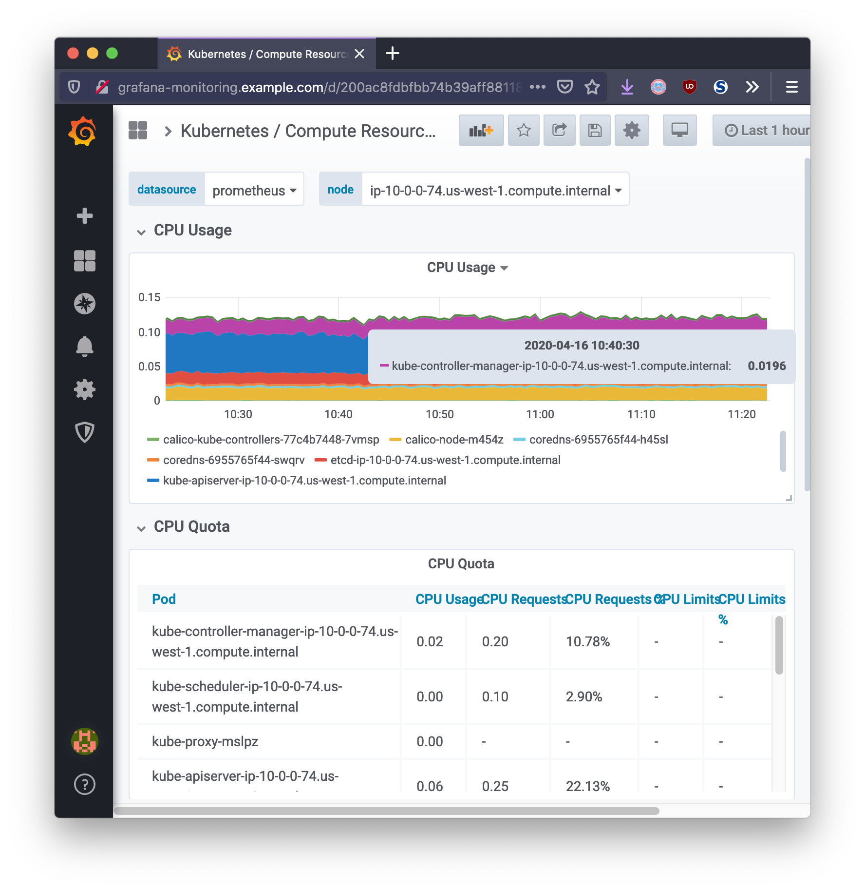

This document details platform monitoring and alerting for Kubernetes clusters,
such as those provided by Tanzu Kubernetes Grid (TKG). It covers architectural
considerations, best practices, and will provide guidance for offering alerting
and monitoring to resident applications . This document represents how the
VMware field team approaches monitoring in large enterprise Kubernetes
environments.


## Tooling

For new implementations of monitoring, it is suggested to run Prometheus inside
of Kubernetes. The recommended approach is to utilize the existing
[kube-prometheus](https://github.com/coreos/kube-prometheus) repository provided
by CoreOS (Red Hat). This project allows an administrator to deploy and tune an
end-to-end Prometheus solution within a Kubernetes cluster. It contains the
following components:

- Prometheus operator
- Highly available `alert-manager`
- Prometheus node-exporter
- Prometheus Adapter for Kubernetes Metrics APIs
- `kube-state-metrics`
- Grafana

### `kube-state-metrics`

[kube-state-metrics](https://github.com/kubernetes/kube-state-metrics) is a
first-party project of Kubernetes. Running as a DaemonSet on the Kubernetes
cluster, this component generates metrics from API events that occur within
Kubernetes. Its focus is on exposing events related to Kubernetes objects within
the cluster in a raw and unmodified format.

### Prometheus

Prometheus is a CNCF project widely used for Kubernetes platform monitoring as
well as metrics collection and aggregation. Prometheus works by scraping data
from configured endpoints, parsing it and storing it in its internal time-series
database. This data can then be easily queried directly with
[PromQL](https://prometheus.io/docs/prometheus/latest/querying/basics), or
displayed using a visualization tool such as Grafana.

Prometheus has [push-gateway](https://prometheus.io/docs/practices/pushing/)
facility as well, for instrumenting applications with the available client
libraries to push metrics when exposing an endpoint to scrape is not suitable.
Ephemeral jobs such as pipelines are a good example of tasks in which pushing
data to the metrics server make sense.

### Prometheus node-exporter

[node-exporter](https://github.com/prometheus/node_exporter) is a separate
binary in the Prometheus project. It exposes metrics for underlying container
platform, os, and hardware of each Kubernetes node to be consumed by Prometheus.
It can be configured with various collectors to determine what kind of system
data to be provided. The `node-exporter` is implemented as a DaemonSet running
as a service on each node in the Kubernetes cluster.

### Prometheus Adapter for Kubernetes Metrics APIs

[k8s-prometheus-adapter](https://github.com/DirectXMan12/k8s-prometheus-adapter)
is an agent that runs as an application Deployment in your cluster. It is an
implementation of the Kubernetes resource metrics API and custom metrics API
that acts downstream of Prometheus to provide feedback on applications using
metrics data. It implements `HorizontalPodAutoscaler` functionality that can
react and scale applications based on real-time metrics data.

### Prometheus Alertmanager

[alert-manager](https://github.com/prometheus/alertmanager) is the handler for
alerts sent by the Prometheus server. Alertmanager handles integrating with
external services by responding to metric-related events such as notifying
email, PagerDuty, or OpsGenie. Alertmanager provides a CRD that can be tuned via
replica-count and other parameters.

### Grafana

Grafana is a second UI layer that is optional, however provides much more
flexibility in visualizing metrics data through the creation of custom
dashboards. Grafana is suggested for operational environments because of its
rich set of RBAC, authentication, and customizable dashboards.

## Installation & Configuration


The installation in this guide follows the kube-prometheus <a
href="https://github.com/coreos/kube-prometheus#quickstart"> Quick-start
Guide</a>. As an alternate to the quick-start, it is recommended to customize
the kube-prometheus library via compiling the kube-prometheus manifests
yourself. In order to address long-term maintenance, it is difficult to manage
YAML customizations made in the quick-start method. Please refer to <a
href="https://github.com/coreos/kube-prometheus#customizing-kube-prometheus">Customizing
kube-prometheus</a> for the advanced compilation method via <a
href="http://jsonnet.org/">Jsonnet</a>.


In order to install platform monitoring, clone the
[kube-prometheus](https://github.com/coreos/kube-prometheus) git repository and
apply the manifests specified in the install guide:

```bash
# Create the namespace and CRDs, and then wait for them to be availble before creating the remaining resources
kubectl create -f manifests/setup
until kubectl get servicemonitors --all-namespaces ; do date; sleep 1; echo ""; done
kubectl create -f manifests/
```

### Expose Route

[kube-prometheus](https://github.com/coreos/kube-prometheus) is installed by
simply applying the manifest to the existing Kubernetes cluster. In order to
access the Prometheus, Alert-manager, and Grafana UIs, their Service will need
to be exposed. Depending on the security-model and end-users, they can be
exposed publicly via DNS, or temporarily using `kubectl port-forward` . This
example uses [Contour](https://github.com/projectcontour/contour) ingress, and
therefore the following objects can be created:

```yaml
apiVersion: projectcontour.io/v1
kind: HTTPProxy
metadata:
  annotations:
  name: ui
  namespace: monitoring
spec:
  routes:
    - conditions:
        - prefix: /
      enableWebsockets: true
      loadBalancerPolicy:
        strategy: Cookie
      services:
        - name: prometheus-k8s
          port: 9090
  virtualhost:
    fqdn: ui-monitoring.example.com
---
apiVersion: projectcontour.io/v1
kind: HTTPProxy
metadata:
  annotations:
  name: grafana
  namespace: monitoring
spec:
  routes:
    - conditions:
        - prefix: /
      enableWebsockets: true
      loadBalancerPolicy:
        strategy: Cookie
      services:
        - name: grafana
          port: 3000
  virtualhost:
    fqdn: grafana-monitoring.example.com
---
apiVersion: projectcontour.io/v1
kind: HTTPProxy
metadata:
  annotations:
  name: alertmanager
  namespace: monitoring
spec:
  routes:
    - conditions:
        - prefix: /
      enableWebsockets: true
      loadBalancerPolicy:
        strategy: Cookie
      services:
        - name: alertmanager-main
          port: 9093
  virtualhost:
    fqdn: alertmanager-monitoring.example.com
```



### Prometheus Scrape Configs

Out of the box, `kube-prometheus` ships with a set of default [Prometheus
rules](https://prometheus.io/docs/prometheus/latest/configuration/recording_rules/)
configured to scrape `kube-state-metrics`. The Prometheus operator does this by
generating a ConfigMap containing the Prometheus configuration. In order to add
additional scrape configuration, you can create an additional ConfigMap and
specify it in the Prometheus CRD. Please see [Additional Scrape
Configuration](https://github.com/coreos/prometheus-operator/blob/master/Documentation/additional-scrape-config.md)
for the specific steps.

### Grafana Data Sources & Dashboards

`kube-prometheus` also ships with a default datastore for Prometheus already set
up with the parameters needed to ingest time-series data.



`kube-prometheus` also provides a set of default [Grafana
Dashboards](http://grafana.com/) that provide a number of windows into viewing
this data.



It is possible that a custom dashboard is required, for example, visualizing
metrics from a custom application. This can manually be added in via the Grafana
UI, or through additional configuration specified in ConfigMap resources
attached to the Grafana Deployment object.

### Alert Manager



Alert Manager is provided with a default set of rules and a watchdog input. A
"watchdog" refers to a Dead Man's switch. The alert is always firing from
Prometheus, and therefore should fire in Alert Manager. If it ever ceases to
fire, then it is possible to detect failure in the alerting system.

This configuration is defined in a Secret from the file
`alertmanager-secret.yaml` and may be modified after deploying `kube-prometheus`
by modifying the secret and redeploying the Alert Manager StatefulSet.

```bash
kubectl get secret alertmanager-main -n monitoring --template '{{ index .data "alertmanager.yaml" }}' | base64 -d
```

```yaml
"global":
  "resolve_timeout": "5m"
"inhibit_rules":
  - "equal":
      - "namespace"
      - "alertname"
    "source_match":
      "severity": "critical"
    "target_match_re":
      "severity": "warning|info"
  - "equal":
      - "namespace"
      - "alertname"
    "source_match":
      "severity": "warning"
    "target_match_re":
      "severity": "info"
"receivers":
  - "name": "Default"
  - "name": "Watchdog"
  - "name": "Critical"
"route":
  "group_by":
    - "namespace"
  "group_interval": "5m"
  "group_wait": "30s"
  "receiver": "Default"
  "repeat_interval": "12h"
  "routes":
    - "match":
        "alertname": "Watchdog"
      "receiver": "Watchdog"
    - "match":
        "severity": "critical"
      "receiver": "Critical"
```

Downstream services that receive alerts will need to be specified in the
**receivers** section. Alert Manager provides many capabilities to alert with
external systems like email, Slack, Wechat, etc. For example, in order to add
WeChat functionality to the `Critical` receiver, you would add a `wechat_config`
field to your receiver titled **Critical**.

It is important to lock down Alertmanager from unauthorized access. This can be
done by removing the Ingress or securing the route using TLS certificates. As
stated in the documentation: "Any user with access to the Alertmanager HTTP
endpoint has access to its data. They can create and resolve alerts. They can
create, modify and delete silences."

## Monitoring Cluster

Grafana provides the cluster administrator with a single pane of glass view into
the Kubernetes cluster operations. Using dashboards, Grafana can present the
monitoring data with respect to time in a way that is meaningful for measuring
the health of infrastructure, workloads, and network related data.



## Ingesting Custom Application Metrics

When developing an application, Prometheus will by default expect metrics to be
accessible via `/metrics`. This can also be configured. This is specified
through the ServiceMonitor resource, which monitors Service resources for your
particular application and updates Prometheus with the necessary corresponding
scrape configuration. This allows Prometheus to ingest these metrics like it
would normally expect from a Prometheus config file.

```yaml
kind: ServiceMonitor
apiVersion: monitoring.coreos.com/v1
metadata:
  name: sample-app
  labels:
    app: sample-app
spec:
  selector:
    matchLabels:
      app: sample-app
  endpoints:
    - port: http
      interval: 5s
```

The above resource will monitor a Service `sample-app` and the Prometheus
operator will add the necessary scrape configuration. This will allow the
metrics to be recorded by Prometheus.

## Scaling Applications in Response to Monitoring

Now that this custom application is recording metrics in Prometheus, what if you
wanted Kubernetes to respond to changes in a specific metric and scale the
application? Kubernetes provides a [Custom Metrics
API](https://github.com/kubernetes/community/blob/master/contributors/design-proposals/instrumentation/custom-metrics-api.md)
which can be leveraged to automatically scale application deployments in
real-time. This is highly flexible and also evolving.


The Custom Metrics API is a framework for exposing arbitrary metrics as
Kubernetes API metrics. It allows them to appear via
`/apis/custom.metrics.k8s.io/` and be fetched internally by
[HorizontalPodAutoscalers](https://kubernetes.io/docs/tasks/run-application/horizontal-pod-autoscale/).
While Horizontal Pod Autoscalers ship with built-in CPU and memory
resource-based scaling, it is sometimes necessary to utilize custom
application-supplied metrics to scale the application. This is necessary for
scaling beyond the built-in CPU and memory metrics. The example below is based
on the in-depth
[guide](https://github.com/DirectXMan12/k8s-prometheus-adapter/blob/master/docs/walkthrough.md)
provided with `k8s-prometheus-adapter`.

{} Currently scaling on memory and custom metrics are
only supported by `HorizontalPodAutoscaler` `autoscaling/v2beta2` API version.
{}

The following is an example `HorizontalPodAutoScaler` that watches the
`http_requests` metric of the **sample-app** Deployment:

```yaml
kind: HorizontalPodAutoscaler
apiVersion: autoscaling/v2beta2
metadata:
  name: sample-app
spec:
  scaleTargetRef:
    apiVersion: apps/v1
    kind: Deployment
    name: sample-app
  minReplicas: 1
  maxReplicas: 10
  metrics:
    - type: Pods
      pods:
        metric:
          name: http_requests
        target:
          type: AverageValue
          averageValue: 500m
```

Behind the scenes, the HPA controller detects the presence of this object, and
determines the custom metrics required.

The metrics endpoint is specified by an `APIService` resource:

```yaml
apiVersion: apiregistration.k8s.io/v1beta1
kind: APIService
metadata:
  name: v1beta1.custom.metrics.k8s.io
spec:
  service:
    name: prometheus-adapter
    namespace: monitoring
  group: custom.metrics.k8s.io
  version: v1beta1
  insecureSkipTLSVerify: true
  groupPriorityMinimum: 100
  versionPriority: 100
```

The above resource is what ties the custom API endpoint to the Kubernetes
Prometheus Adapter. The adapter runs as a sort-of translation layer between
Kubernetes API requests, and the Prometheus server.

Therefore, if an application `sample-app` is deployed and configured with a HPA
resource, this application can be scaled horizontally as `http_requests`
increases.

```bash
$ kubectl describe hpa.v2beta2.autoscaling sample-app
Name:                       sample-app
Namespace:                  default
Labels:                     <none>
Annotations:                <none>
CreationTimestamp:          Fri, 17 Apr 2020 13:30:15 -0500
Reference:                  Deployment/sample-app
Metrics:                    ( current / target )
  "http_requests" on pods:  386m / 500m
Min replicas:               1
Max replicas:               10
Deployment pods:            4 current / 4 desired
Conditions:
  Type            Status  Reason              Message
  ----            ------  ------              -------
  AbleToScale     True    ReadyForNewScale    recommended size matches current size
  ScalingActive   True    ValidMetricFound    the HPA was able to successfully calculate a replica count from pods metric http_requests
```

```bash
Every 2.0s: kubectl get pods                archlinux: Fri Apr 17 15:18:43 2020

NAME                          READY   STATUS    RESTARTS   AGE
sample-app-579bc6774c-cdpd2   1/1     Running   0          103m
sample-app-579bc6774c-dv865   1/1     Running   0          103m
sample-app-579bc6774c-lbm5k   1/1     Running   0          21h
sample-app-579bc6774c-zp482   1/1     Running   0          103m
```