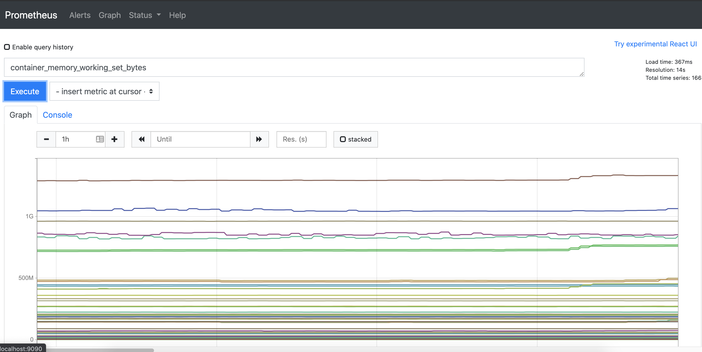
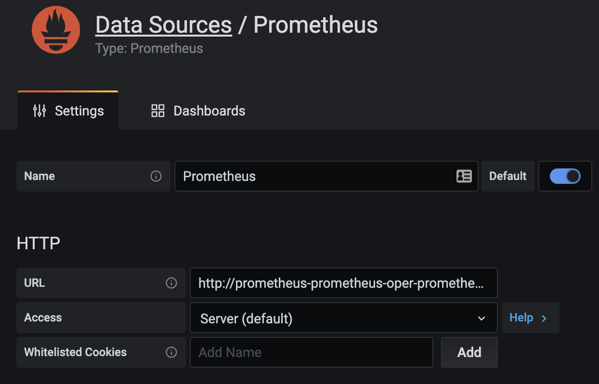
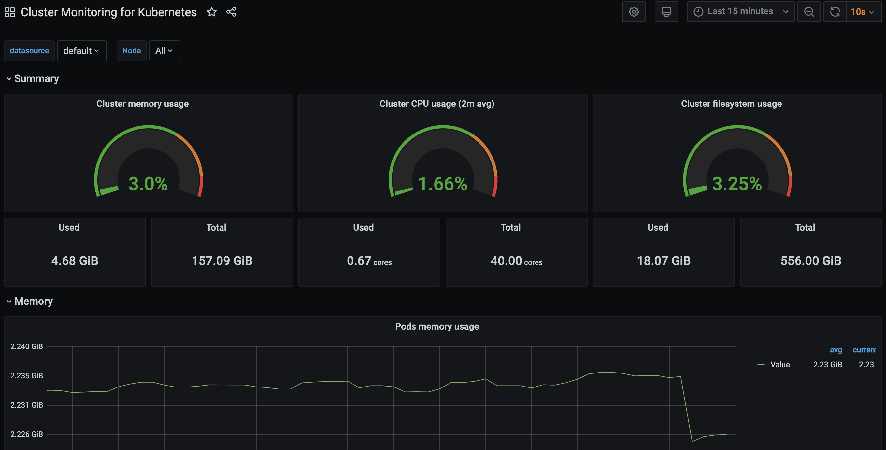

---
aliases:
- "/guides/kubernetes/prometheus-grafana-p1"
- "/guides/kubernetes/observability-prometheus-grafana-p1"
date: '2021-02-24'
description: Learn how to set up Prometheus and Grafana, two open source tools for
  gathering metrics and visualizing, on an existing Kubernetes cluster.
lastmod: '2021-03-07'
linkTitle: Prometheus and Grafana
metaTitle: Gathering Metrics from Kubernetes with Prometheus & Grafana
parent: Platform Observability
patterns:
- Observability
tags:
- Kubernetes
- Observability
- Prometheus
- Grafana
team:
- Brian McClain
title: Gathering Metrics from Kubernetes with Prometheus and Grafana
weight: 2
oldPath: "/content/guides/kubernetes/observability-prometheus-grafana-p1.md"
level1: Managing and Operating Kubernetes
level2: Monitoring and Observing Kubernetes
faqs:
  faq:
  - question: What are Bitnami Helm charts?
    answer: "[Bitnami](https://bitnami.com/) offers automated application deployments
      of open source server apps and allows developers to deploy an application using
      Bitnami's Helm charts."
  - question: What is the difference between Prometheus and Grafana in Kubernetes?
    answer: Prometheus and Grafana are two open source tools. Prometheus excels at
      gathering metrics from a wide array of sources, while Grafana is the go-to tool
      for visualizing complex time-series data.
  - question: How do you install Prometheus using Helm for Kubernetes?
    answer: To install Prometheus, you must start with the Bitnami Helm repository.
      Please refer to the section above titled 'Installing Prometheus' for specific
      commands that need to be installed.
  - question: How do you install Grafana using Helm for Kubernetes?
    answer: There are many configuration options when installing Grafana. For a thorough
      walkthrough of installing bitnami/grafana Helm chart, refer to the section above
      titled 'Installing Grafana.'
  - question: Can you use data in both Prometheus and Grafana?
    answer: Yes, any data gathered from Prometheus can be used in Grafana, meaning
      any pod with the proper annotations will automatically get scraped by Prometheus.
---

You have your Kubernetes cluster up, it’s running your applications, and
everything seems to be running great. Your work is done, right?

If only it was that simple. Running in production means keeping a close eye on
how things are performing, so having data that provides such insight is
important. After all, being able to recognize potentially problematic patterns
in how your applications are performing or how Kubernetes is handling specific
workloads can mean the difference between making a quick fix and getting a call
at 3 a.m. because your website is down.

Two open source tools that can help with this are Prometheus and Grafana.
Prometheus excels at gathering metrics from a wide array of sources, while
Grafana is the go-to tool for visualizing complex time-series data. These two
tools working in tandem are very powerful, and are very easy to install and use!

In this guide, you’ll be setting up Prometheus and Grafana on an existing Kubernetes cluster, as well as setting up a dashboard in Grafana to visualize the data gathered from that cluster. You can use any Kubernetes installation of your choosing, whether it’s hosted on a cloud provider or even something like [Minikube](https://minikube.sigs.k8s.io/docs/) running on your local machine.

## Installing Prometheus

Luckily, there’s a comprehensive
[Helm chart for Prometheus](https://github.com/bitnami/charts/tree/master/bitnami/kube-prometheus)
with an extensive list of configuration options. If you’re not familiar with
Helm, make sure to check out
[Helm: What Is it?](/guides/kubernetes/helm-what-is/) and
[Getting Started With Helm](/guides/kubernetes/helm-gs/). For this walkthrough,
you’ll be keeping things fairly straightforward, so if you’ve used Helm before,
or are just starting to learn, you will have seen most of what’s in this guide.

To install Prometheus, you first need to add the Bitnami Helm repository by
using the `helm repo add` command followed by the `helm repo update` command to
pull in the latest metadata:

```bash
helm repo add bitnami https://charts.bitnami.com/bitnami
```

```bash
helm repo update
```

Before you install Prometheus, check out the
[configuration options](https://github.com/bitnami/charts/tree/master/bitnami/kube-prometheus#parameters)
you have, because there are a lot of them. In this example, it’s assumed that
you’ll be installing with the default configuration into a Kubernetes cluster
with no specific requirements. As you can see, there are options for everything
from how each component is exposed (i.e., the type of ingress used, if it’s
behind a load balancer, etc.) to how data is stored and more. If this was a
production installation, you’d want to thoroughly sort out these options, but
for the purposes of this demo, you can install Prometheus with the default
configuration using the `helm install` command:

```bash
helm install prometheus bitnami/kube-prometheus
```

After a few moments, you’ll see a few new pods created:

```bash
alertmanager-prometheus-prometheus-oper-alertmanager-0   2/2     Running   0          25m
prometheus-kube-state-metrics-68cb46fdd4-gk4jh           1/1     Running   0          25m
prometheus-node-exporter-rkg84                           1/1     Running   0          25m
prometheus-prometheus-oper-operator-745f4b599c-xjjsn     1/1     Running   0          25m
prometheus-prometheus-prometheus-oper-prometheus-0       3/3     Running   1          25m
```

There are a few ways you can access Prometheus, but it largely depends on how
your Kubernetes cluster is configured. As the Prometheus documentation points
out, traditionally you would expose the server through a reverse proxy, such as
nginx. But since the default configuration of the Prometheus Helm chart only
exposes it to other pods in the Kubernetes cluster, you can instead take
advantage of the `kubectl port-forward` command. Open a new terminal and keep it
open after running the following:

```bash
kubectl port-forward --namespace default svc/prometheus-kube-prometheus-prometheus 9090:9090
```

Great! The above command forwards all traffic to port 9090 on your machine to
the `prometheus-server` pod, which you can see by visiting
[http://localhost:9090](http://localhost:9090).



## Installing Grafana

Much like Prometheus, Grafana has a great
[Helm chart](https://hub.helm.sh/charts/bitnami/grafana) for installing it.
Again, you’ll see a plethora of configuration options to tweak the installation
to your needs, but for this demo, you can just install it with the default
configuration to see it in action. You can install the `bitnami/grafana` Helm
chart with the following command:

```bash
helm install grafana bitnami/grafana
```

After a few moments, you’ll see a new pod created:

```bash
grafana-66c98bcb86-xpd5t                         1/1     Running   0          2d23h
```

There’s one additional step you’ll need to take. The Grafana Helm chart
generates a random password for you and stores it as a secret in Kubernetes. You
can retrieve this password by running the following command:

```bash
echo "$(kubectl get secret grafana-admin --namespace default -o jsonpath="{.data.GF_SECURITY_ADMIN_PASSWORD}" | base64 --decode)"
```

Note the password, as you’ll be needing it shortly. Like the Prometheus install,
you may have different requirements or capabilities for exposing services
outside of your Kubernetes cluster, but you can again use the
`kubectl port-forward` command. Open a new terminal and run:

```bash
export POD_NAME=$(kubectl get pods --namespace default -l "app.kubernetes.io/name=grafana,app.kubernetes.io/instance=grafana" -o jsonpath="{.items[0].metadata.name}")
kubectl --namespace default port-forward $POD_NAME 3000
```

With this command running, you can now access Grafana at
[http://localhost:3000](http://localhost:3000)! You’ll be prompted for a
username, which by default is `admin`, along with the password you just
retrieved. Though when you log in, you may notice that things are a bit bare.
That’s because, while Prometheus is automatically gathering metrics from your
Kubernetes cluster, Grafana doesn’t know anything about your Prometheus install.
It does, however, know how to speak to a Prometheus server, and makes it very
easy to configure it as a data source.

## Visualizing Prometheus Data in Grafana

If you mouse over the cogwheel on the left-hand side of the Grafana screen,
you’ll be prompted with several configuration options. Choose “Data Sources,”
followed by “Add data source.” Here, you’ll see a long list of data sources that
Grafana knows how to talk to automatically, and luckily Prometheus is on that
list. Choose “Prometheus” and you’ll be brought to the configuration screen for
your new data source.

If you didn’t change the default configuration when installing Prometheus,
you’ll only need to give it a name of your choosing, as well as the URL where
Prometheus is running. Since both are running in the same cluster, you can
connect Grafana to Prometheus using the internal DNS to Kubernetes by providing
it the service name that Prometheus is connected to:
`http://prometheus-kube-prometheus-prometheus.default.svc.cluster.local:9090`



If you’re already familiar with creating dashboards and
[panels](https://grafana.com/docs/grafana/latest/panels/panels-overview/) in
Grafana, you’re all set! However, if you’re new to Grafana, don’t worry; this is
where you can once again look to the great community for information about these
tools. The Grafana website has a huge repository of dashboards that can be
easily shared and imported into your own Grafana installation. And all you need
in order to import one of these dashboards from the Grafana site is a single ID
number. Take [this dashboard](https://grafana.com/grafana/dashboards/10000), for
example. You can see that it has an ID of “10000.”

To import this dashboard, mouse over the “Dashboards” section on the left-hand
side of the Grafana screen (the icon is four squares) and choose “Manage.” On
the top right of the dashboard management screen, click “Import” and you’ll be
prompted for the URL, ID, or JSON for the dashboard that you wish to import.
Under “Import via grafana.com,” enter “10000,” matching the ID of the dashboard
that you wish to import. Feel free to change the name or the unique identifier,
but the one thing you must provide is the data source, which is asked for on the
bottom of the configuration screen. Choose your Prometheus data source, click
“Import,” and you will be greeted by your newly created, but fully populated,
dashboard!



## What’s Next?

The great news is that any data gathered from Prometheus can be used in Grafana.
That means any pod with the
[proper annotations](https://github.com/helm/charts/tree/master/stable/prometheus#scraping-pod-metrics-via-annotations)
will automatically get scraped by Prometheus. Many languages and frameworks have
[libraries that support exposing metrics](https://prometheus.io/docs/instrumenting/clientlibs/)
that Prometheus can gather, including
[Spring](https://docs.spring.io/spring-boot/docs/current/reference/html/production-ready-features.html#production-ready-metrics-export-prometheus).
Make sure to check out the libraries available for your language of choice!
Additionally, if you're looking to learn more about observability and how to get
better insight into your applications, make sure to check out our
[growing collection of guides](/patterns/observability/).