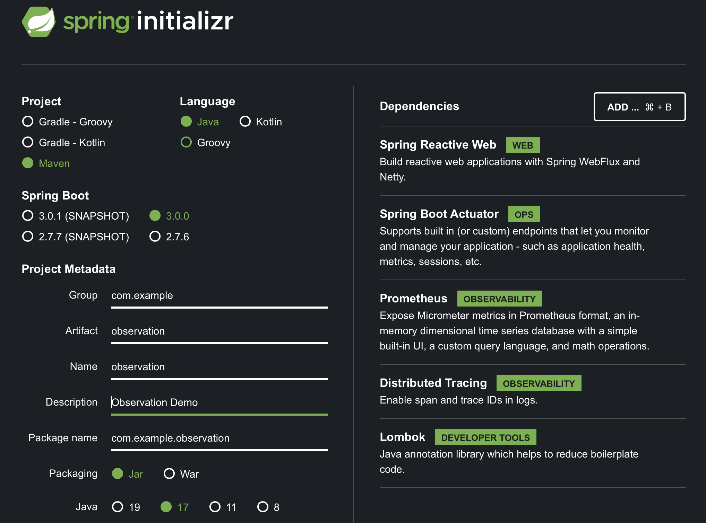

Since Spring Framework 6, metrics and tracing get handled by [Micrometer](https://micrometer.io) - a vendor-neutral API for instrumenting code. Micrometer also makes available and sends metrics to aggregators such as [Prometheus](https://prometheus.io), [InfluxDB](https://influxdata.com), [Netflix Atlas](https://netflix.github.io/atlas-docs/overview/) and more. Furthermore, Spring Actuator and Micrometer work together - Micrometer gathers metrics and can make them available on `management` endpoints via the Actuator.

In this guide, we will take a look at the updated support for [Micrometer Tracing](https://micrometer.io/docs/tracing), which replaces [Spring Cloud Sleuth](https://spring.io/projects/spring-cloud-sleuth) support. There is a great [write-up](https://spring.io/blog/2022/10/12/observability-with-spring-boot-3) on this, which takes care of explaining a good chunk of details in a `WebMVC` setting.

In case you are looking to migrate from Sleuth to Micrometer, please see [this helpful Wiki page](https://github.com/micrometer-metrics/micrometer/wiki/Migrating-to-new-1.10.0-Observation-API). 
It describes and gives samples related to the scenarios you will encounter when deciding/making the change from Sleuth to the new Micrometer API.

## Start with an `Observation` example

Let's start with a quick [example](https://github.com/marios-code-path/path-to-springboot-3/tree/main/manual-observation) demonstrating Micrometer's `Observation` API in a thread-friendly setting. For instance, we can use it to observe a `Runnable` submitted to an `Executor`. 

Create the sample application with the following settings on [the Spring Initializr](https://start.spring.io):

Artifact ID:
 * `sample-observation`

Dependencies: 
  * Lombok
  * Actuator

Platform Version:
  * 3.0.0

Packaging: 
  * Jar

Java Version:
  * 17

Type:
  * Maven


The full sample listing follows in `SimpleObservationApplication.java`:

```java
@Slf4j
@SpringBootApplication
public class SimpleObservationApplication {
    
    public static void main(String[] args) {
        SpringApplication.run(SimpleObservationApplication.class, args);
    }

    @Bean
    public ApplicationListener<ApplicationStartedEvent> doOnStart(ObservationRegistry registry) {
        return event -> {
            generateString(registry);
        };
    }

    public static void generateString(ObservationRegistry registry) {
        String something = Observation
                .createNotStarted("server.job", registry)    // 1
                .lowCardinalityKeyValue("jobType", "string") // 2                
                .observe(() -> {    // 3
                    log.info("Generating a String...");
                    try {
                        // do something taking time on the thread
                        Thread.sleep(1000);
                    } catch (InterruptedException e) {
                        e.printStackTrace();
                        return "NOTHING";
                    }
                    return "SOMETHING";
                });

        log.info("Result was: " + something);
    }
}
```

A few things are happening in this code: 
 1. Create an instance of `Observation` and bind it to an `ObservationRegistry` as stated in [the documentation](https://micrometer.io/docs/observation).
 2. To better observe our invocation - to be able to filter it later - add some _low cardinality_ keys. These are tags that have little or no variations in value. For _high cardinality_ keys - which have many possible values - use the `.highCardinalityKeyValue()` method.
 3. Rather than manually calling `.start()` and `.stop()`, use the `observe(Runnable)]` method to isolate the monitored code in its own `Runnable` closure.

## How Micrometer observation works

An [ObservationHandler](https://github.com/micrometer-metrics/micrometer/blob/main/micrometer-observation/src/main/java/io/micrometer/observation/ObservationHandler.java) wraps the `Observation` lifecycle and execute its methods on lifecycle events. An `ObservationHandler` reacts only to supported implementations of an `Observation.Context` - this context passes state between handler methods - and can create all kinds of instrumentation like metrics, spans, or logs by reacting to the lifecycle events of an observation, such as:

* `start` -  This happens when the `Observation#start()` method is called.
* `stop` - This happens when the `Observation#stop()` method is called.
* `error` - This event happens when the `Observation#error(exception)` method is called.
* `event` -  This happens when the `Observation#event(event)` method gets called.
* `scope started` - Observation opens a scope. The scope must be closed when no longer used. Handlers can create thread-local variables on start that are cleared when the scope is completed. This event happens when the `Observation#openScope()` method is called.
* `scope stopped` - Observation stops a scope. This event happens when the `Observation.Scope#close()` method is called.

An observation state diagram:


The state diagram for observation scopes:


The Spring Boot autoconfiguration creates an `ObservationRegistry` responsible for managing the observations state. Additionally, we get multiple `ObservationHandlers` that handle various instrumentation objectives (e.g., tracing, metrics, logging, etc..). As an  example, the [MeterObservationHandler](https://github.com/micrometer-metrics/micrometer/blob/main/micrometer-core/src/main/java/io/micrometer/core/instrument/observation/DefaultMeterObservationHandler.java#L23) provides micrometer [Timer](https://micrometer.io/docs/concepts#_timers) and [Counter](https://micrometer.io/docs/concepts#_counters) metrics to observations. 

Additionally, non-auto-configured handlers exist, such as the [ObservationTextPublisher](https://github.com/micrometer-metrics/micrometer/blob/main/micrometer-observation/src/main/java/io/micrometer/observation/ObservationTextPublisher.java#L24). This handler logs the context during each handled event.

Log observation events by declaring a bean of type `ObservationTextPublisher`:

```java
@Component
public class TextPublishingObservationHandler extends ObservationTextPublisher { }
```

We will see logs that the `ObservationTextPublisher` emitted when we execute our `SimpleObservationApplication`. I've removed timestamps and only included one descriptive log line for brevity:

```log
INFO 90538 --- [           main] i.m.o.ObservationTextPublisher           : START - name='server.job', contextualName='null', error='null', lowCardinalityKeyValues=[jobType='string'], highCardinalityKeyValues=[], map=[]
INFO 90538 --- [           main] i.m.o.ObservationTextPublisher           :  OPEN - 
name='server.job', contextualName='null', error='null', lowCardinalityKeyValues=
[jobType='string'], highCardinalityKeyValues=[], map=[class io.micrometer.core.instrument.
Timer$Sample='io.micrometer.core.instrument.Timer$Sample@205bed61', class io.micrometer.core.
instrument.LongTaskTimer$Sample='SampleImpl{duration(seconds)=5.60409E-4, duration(nanos)
=560409.0, startTimeNanos=}']
INFO 90538 --- [           main] c.e.o.ManualObservationApplication       : Generating a String...
INFO 90538 --- [           main] i.m.o.ObservationTextPublisher           : CLOSE - name='server.job',...]
INFO 90538 --- [           main] i.m.o.ObservationTextPublisher           :  STOP - name='server.job',...]
INFO 90538 --- [           main] c.e.o.ManualObservationApplication       : Result was: SOMETHING
```

Our `ObservationTextPublisher` shows the various stages this Observation went through, along with its metadata.  Notice that we have no `traceId` or `spanId` as usual since the bare minimum tracers are of the `NOOP` variety. The following section will add `Zipkin/Brave` implementations that are auto-configured with additional dependencies. 

## The reactive sample setup

Let's create a REST application. But, first, go to our second favorite website, the Spring Initializr - [start dot spring dot io](https://start.spring.io), and make the following selections:

Dependencies: 

  * Webflux
  * Actuator
  * Prometheus
  * Lombok

Platform Version:

  * 3.0.0

Packaging: 

  * Jar

JVM Version:

  * 17

Type:

  * Maven

Here is a screenshot (for reference) of what the configuration on `start.spring.io` looks like:



Alternatively, if you have the `curl` client installed, you can generate the same application from the command line:

```shell
curl -G https://start.spring.io/starter.zip -o observable.zip -d dependencies=web,actuator,prometheus,lombok -d packageName=com.example.observation \
-d description=REST%20Observation%20Demo -d type=maven-project -d language=java -d platformVersion=3.0.0-SNAPSHOT \
-d packaging=jar -d jvmVersion=17 -d groupId=com.example -d artifactId=observation -d name=observation  
```

The first thing to do after unzipping the project is to add two necessary dependencies that bring in the  Micrometer Observation, the Micrometer tracing API, and the Zipkin reporting bridge for reporting traces to Zipkin-compatible tracing endpoints:

```xml
		<dependency>
			<groupId>io.micrometer</groupId>
			<artifactId>micrometer-tracing-bridge-brave</artifactId>
		</dependency>
		<dependency>
			<groupId>io.zipkin.reporter2</groupId>
			<artifactId>zipkin-reporter-brave</artifactId>
		</dependency>
```

Open this project in your favorite IDE and follow along, or simply [browse](https://github.com/marios-code-path/path-to-springboot-3/tree/main/webflux-observation) the source for reference. For clarification, we will be adding dependencies as this guide progresses.

Let's move on and establish some basic application properties; app name, server port, and logging format.

application.properties:

```properties
spring.application.name=test-service
server.port=8787
spring.main.web-application-type=reactive
logging.pattern.level=%5p [${spring.application.name:},%X{traceId:-},%X{spanId:-}]
```

### A greeting service

The following sample creates a simple controller that calls another HTTP endpoint, allowing us to establish service hand-offs during traces. In this example, we only return a specific payload: `Greeting`.

The payload is a simple record:

Greeting.java:
```java
record Greeting(String name) {}
```

The service we want to use in our REST controller:

GreetingService.java:
```java
@Service
@Slf4j
class GreetingService {

    private final Supplier<Long> latencySupplier = () -> new Random(System.currentTimeMillis()).nextLong(250);

    private final ObservationRegistry registry;

    GreetingService(ObservationRegistry registry) {
        this.registry = registry;
    }

    public Mono<Greeting> greeting(String name) {

        Long lat = latencySupplier.get();
        return Mono
                .just(new Greeting(name))
                .delayElement(Duration.ofMillis(lat))
                ;
    }
}
```

The class is a standard REST endpoint, with nothing notable except the inclusion of an `ObservationRegistry`.

### Add a REST endpoint

Next, we will add a REST endpoint that returns a greeting for a name derived from the path parameter `{name}`:

```kotlin
@RestController
class GreetingController {
    private final GreetingService service;
 
    GreetingController(GreetingService service) { this.service = service; }

    @GetMapping("/hello/{name}")
    public Mono<Greeting> greeting(@PathVariable("name") String name) {
        return service
                .greeting(name);
    }
}
```

> **_TIP:_** [WebFluxObservationAutoConfiguration](https://github.com/spring-projects/spring-boot/blob/main/spring-boot-project/spring-boot-actuator-autoconfigure/src/main/java/org/springframework/boot/actuate/autoconfigure/observation/web/reactive/WebFluxObservationAutoConfiguration.java) is the autoconfiguration class for observation in WebFlux. It includes all of the `ObservationHandler` and `WebFilter` instances needed to observe (draw traces and meters from) HTTP requests and responses.

Now, with the basic shape of our primary sample out of the way, we can gain some insights as to how observation gets injected into raw reactive streams. The following section will review the necessary steps to achieve full interoperability between Reactor and Micrometer.

## Reactive stream observation

Project reactor comes with [built-in support for Micrometer](https://github.com/reactor/reactor-core/blob/main/docs/asciidoc/metrics.adoc) instrumentation implementations.

We will use the reactive `tap` operator to instrument the streams in this sample. The `tap` operator uses a stateful per-subscription [SignalListener](https://projectreactor.io/docs/core/3.5.0-M2/api/reactor/core/observability/SignalListener.html) to manage the state of the `Observation` in progress.

To get a micrometer signal listener, import the [reactor-core-micrometer](https://github.com/reactor/reactor-core/tree/main/reactor-core-micrometer) dependency. Note that this API also relies on [context-propagation](https://micrometer.io/docs/contextPropagation) to propagate observability information along the lifetime of the reactive stream.

Here are the additions we will add to `pom.xml` to enable Micrometer Reactive Stream APIs:

```xml
		<!-- Micrometer API -->
		<dependency>
			<groupId>io.projectreactor</groupId>
			<artifactId>reactor-core-micrometer</artifactId>
		</dependency>
		<dependency>
			<groupId>io.micrometer</groupId>
			<artifactId>context-propagation</artifactId>
			<version>1.0.0</version>
		</dependency>
```

In this example, we are interested in the `reactor.core.observability.micrometer.Micrometer` API that provides us with the `StreamListener` needed to observe the stream. This API supports instrumentation of `reactor.core.scheduler.Scheudler`'s, as well as applying Meters and Observations on a per-subscription basis to the reactive stream. This example will observe our stream using the `Micrometer.observation` API that hooks into Micrometer's `Observation` framework.

We can take our `GreetingService` from earlier and embellish it with additional `Observation` related sections.

GreetingService.java:
```java
        return Mono
                .just(new Greeting(name))
                .delayElement(Duration.ofMillis(lat))
                .name("greeting.call")                  // 1
                .tag("latency", lat.toString())         // 2
                .tap(Micrometer.observation(registry))  // 3
```

Given the above, we will have a child span for the parent HTTP controller span. The main additions are as follows:

1. Using `.name` to specify the `Observation` name.
2. Add low cardinality tags and attributes to the measurements with `.tag`.
3. Produce the `Observation`-specific signal listener for the `tap` operator. This operator covers the entire length of the reactive sequence.

You can read more about Micrometer Metrics in streams in the [Micrometer Observation Docs](https://micrometer.io/docs/observation).

## Introduction of the Monitoring Platform

In this guide, we will have the experience of a single-page observation. With this idea going forward, we can move through logs, traces, and metrics in one location. To achieve this kind of integration, we will make use of a specific `operations` service infrastructure:

Infra:

  * [Prometheus](https://prometheus.io) - Metrics

  * [Loki](https://grafana.com/go/webinar/getting-started-with-logging-and-grafana-loki/?pg=hp&plcmt=upcoming-events-3) - Log Aggregation

  * [Tempo](https://grafana.com/go/webinar/getting-started-with-tracing-and-grafana-tempo-emea/?pg=hp&plcmt=upcoming-events-2) - Trace Backend
  
  * [Grafana](https://grafana.com/grafana/) - Dashboard Visualization

For this example, there are pre-configured instances of Prometheus, Grafana, Tempo, and Loki located within the `infra` directory. Provided in this directory are the Docker Compose scripts and server configuration files. You can bring the whole thing up with the following command:

```bash
cd infra/
docker compose up
```

This startup may take a minute or two since it may need to download containers over the network. So have a few sips of that tea, coffee, or water you might have on hand! Next, we can move on and examine this infrastructure as it relates to our example app.

### Prometheus Setup

On the application-facing side of our Prometheus setup, we need to configure a set of [scrape config](https://prometheus.io/docs/prometheus/latest/configuration/configuration/) for ingesting our app's `/actuator/prometheus` endpoint. 

The specific `scrape config` is listed below:

```yaml
global:
    scrape_interval: 2s
    evaluation_interval: 2s

scrape_configs:
    - job_name: 'prometheus'
      static_configs:
          - targets: ['host.docker.internal:9090']
    - job_name: 'spring-apps'
      metrics_path: '/actuator/prometheus'
      static_configs:
        - targets: ['host.docker.internal:8787']
```

### Enable the Prometheus Actuator endpoint

Here, we will configure our app to expose the specific `/actuator/prometheus` endpoint used during the scrape process in Prometheus:

In `application.properties`, add:
```properties
management.endpoints.web.exposure.include=prometheus
```

Micrometer [supports](https://micrometer.io/docs/concepts#_histograms_and_percentiles) publishing histograms for computing percentile distributions with the `management.metrics.distribution.percentiles-histogram` property. We can apply a [per meter customization](https://docs.spring.io/spring-boot/docs/current/reference/html/actuator.html#actuator.metrics.customizing.per-meter-properties) to the WebFlux/WebMVC `http.server.requests` metrics and produce the target percentiles histogram as follows:

In `application.properties`, add:
```properties
management.metrics.distribution.percentiles-histogram.http.server.requests=true
```

> **NOTE:** percentiles histograms are required for Exemplars to function. Percentile histograms do not affect systems that do not support histogram-based percentile approximations.

### Configure Loki log aggregation

Grafana will query Loki to add log correlation with our traces and metrics. Then, we will configure a Logback appender to emit our logs directly to Loki. This appender - `com.github.loki4j.logback.Loki4jAppender` -  comes from [Loki4J](https://loki4j.github.io/loki-logback-appender/).

Place `logback-spring.xml` into `src/main/resources` of the project and ensure the appender for Loki has the correct URL configured.

To make this work, we use the `loki-logback-appender` dependency as configured with maven:

```xml
		<dependency>
			<groupId>com.github.loki4j</groupId>
			<artifactId>loki-logback-appender</artifactId>
			<version>1.4.0-rc1</version>
		</dependency>
```

Put the  source to our `logback-spring.xml` under `resources`:

```xml
<?xml version="1.0" encoding="UTF-8"?>
<configuration>
    <include resource="org/springframework/boot/logging/logback/base.xml" />
    <springProperty scope="context" name="appName" source="spring.application.name"/>

    <appender name="LOKI" class="com.github.loki4j.logback.Loki4jAppender">
        <http>
            <url>http://localhost:3100/loki/api/v1/push</url>
        </http>
        <format>
            <label>
                <pattern>app=${appName},host=${HOSTNAME},traceID=%X{traceId:-NONE},level=%level</pattern>
            </label>
            <message>
                <pattern>${FILE_LOG_PATTERN}</pattern>
            </message>
            <sortByTime>true</sortByTime>
        </format>
    </appender>

    <root level="INFO">
        <appender-ref ref="LOKI"/>
    </root>
</configuration>
```

### Tempo configuration

This example will use [Micrometer tracing](https://micrometer.io/docs/tracing) that ships trace data to Tempo. We can ship traces to Tempo's Zipkin receiver with the help of [Openzipkin Brave](https://github.com/openzipkin/zipkin-reporter-java/tree/master/brave) and the [Micrometer bridge for Brave](https://github.com/micrometer-metrics/tracing/tree/main/micrometer-tracing-bridges). No additional project dependencies are required because we already placed them during the sample setup. However, for reference, they are: `micrometer-tracing-bridge-brave` and `zipkin-reporter-brave`.

We will use local filesystem storage since provisioning block storage is a bit complex for this example. 

Enabling the Zipkin receiver requires TCP port `9411` (Zipkin). This configuration uses the 'Push with HTTP' option per [Tempo documentation](https://grafana.com/docs/tempo/latest/api_docs/pushing-spans-with-http/).


tempo-local.yaml:
```yaml
server:
    http_listen_port: 3200

distributor:
    receivers:
        zipkin:

storage:
    trace:
        backend: local
        local:
            path: /tmp/tempo/blocks
```

Finally, we will ensure every trace gets to our Zipkin receiver endpoints by adding the following lines to `application.properties`:

```properties
management.tracing.enabled=true
management.tracing.sampling.probability=1.0
```

### Grafana dashboards

Grafana provisions with external data from configuration within [infra/docker/grafana/provisioning/datasources/datasource.yml](https://github.com/marios-code-path/path-to-springboot-3/blob/main/infra/docker/grafana/provisioning/datasources/datasource.yml). This tells Grafana where to find each external source of data. We will track spans from Tempo, Loki logs, and Prometheus Metrics.

This dashboard configuration is provided in [infra/docker/grafana/provisioning/dashboards/logs_traces_metrics.json](https://raw.githubusercontent.com/marios-code-path/path-to-springboot-3/main/infra/docker/grafana/provisioning/dashboards/logs_traces_metrics.json) and acts as our standard example dashboard called `logs_traces_metrics`. This dashboard code is borrowed mainly from [a recent observability blog post](https://spring.io/blog/2022/10/12/observability-with-spring-boot-3).

## Observing the WebFlux app

Execute the application as-is:

```shell
mvn spring-boot:run
```

Prometheus will scrape the  `/actuator/prometheus` endpoint, populating the metrics when the application starts. But first, let's create some traffic.

```bash
while true; do http :8787/hello/spring-boot-3 ; sleep 1; done
```

Run that on your local Unix-compatible shell. You could use tools like `ab` alternatively. The script uses `curl` to call our endpoint every second. Allow it to run for a minute or two so Prometheus can collect metrics. Then go to `http://localhost:3000/dashboards` and select `General`, then select the  `Logs, Traces, Metrics` dashboard. You'll see something like this:


Notice that we have several gray squares - these are the `exemplars` correlating metrics with traces. The exemplar data is located by hovering over a square and revealing the popup DIV. 


Search for the trace in Loki at the top of the dashboard. Tempo data will display. Click on  `Query with Tempo` to produce similar information.


The full trace view can be expanded. Note we also see the trace generated through our service call - the reactive stream observation made as a child trace to the main HTTP request.


## Conclusion

We learned to configure Spring Boot 3 reactive apps with Micrometer. With additional support, we broadened the scope of our monitoring objectives and provided tracing and distributed logging alongside metrics. Furthermore, tying concerns together allowed us to demonstrate Prometheus's powerful `exemplar` feature. 

Project Reactor comes with baked-in support for Micrometer instrumentation, allowing us to stand up a fully observed, reactive Spring Boot 3 application in just a few minutes!

## Links and Readings

[Spring Actuator Reference](https://docs.spring.io/spring-boot/docs/current/reference/html/actuator.html#actuator.enabling)

[Spring Metrics Docs](https://docs.spring.io/spring-metrics/docs/current/public/prometheus)

[Micrometer Docs](https://micrometer.io/docs)

[Prometheus Docs](https://prometheus.io/docs/introduction/overview/)

[Grafana Tempo Docs](https://grafana.com/docs/tempo/latest/?pg=oss-tempo)

[Grafana Loki Docs](https://grafana.com/docs/loki/latest/?pg=oss-loki)

[Grafana Docs](https://grafana.com/docs/grafana/latest/introduction/)

[When to use the Pushgateway?](https://prometheus.io/docs/practices/pushing/)

[Observability in Spring Boot 3 write-up](https://spring.io/blog/2022/10/12/observability-with-spring-boot-3)

[Exposing Reactor metrics with Micrometer](https://projectreactor.io/docs/core/release/reference/#metrics)

[Observability Migration from Sleuth](https://github.com/micrometer-metrics/micrometer/wiki/Migrating-to-new-1.10.0-Observation-API)

[Reactor - Contextual Logging Pattern](https://projectreactor.io/docs/core/release/reference/#faq.mdc)

[Tempo configuration](https://grafana.com/docs/tempo/latest/configuration/) 