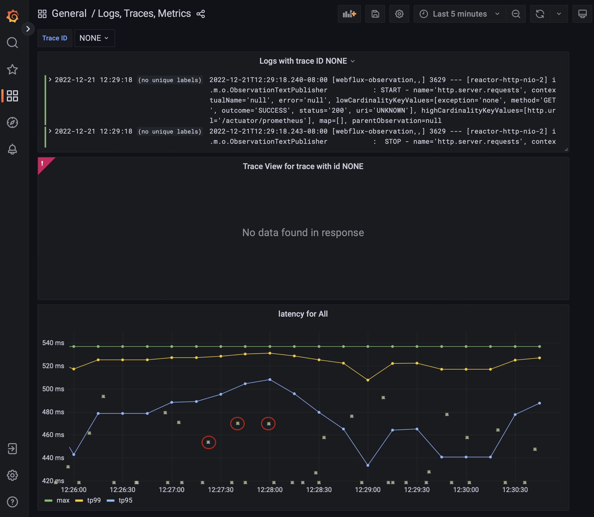

Since Spring Framework 6/SpringBoot 3, metrics and tracing get handled by [Micrometer](https://micrometer.io) - a vendor-neutral API for instrumenting code. Micrometer also makes available and sends metrics to aggregators such as [Prometheus](https://prometheus.io), [InfluxDB](https://influxdata.com), [Netflix Atlas](https://netflix.github.io/atlas-docs/overview/) and more. Furthermore, Spring Boot Actuator and Micrometer work together - Micrometer gathers metrics and can make them available on `management` endpoints via the Actuator.

In this guide, we will take a look at the updated support for [Micrometer Tracing](https://micrometer.io/docs/tracing), which replaces [Spring Cloud Sleuth](https://spring.io/projects/spring-cloud-sleuth) support. There is a great [write-up](https://spring.io/blog/2022/10/12/observability-with-spring-boot-3) on this, which takes care of explaining a good chunk of details in a `WebMVC` setting.

In case you are looking to migrate from Sleuth to Micrometer, please see [this helpful Wiki page](https://github.com/micrometer-metrics/micrometer/wiki/Migrating-to-new-1.10.0-Observation-API). 
It describes and gives samples related to the scenarios you will encounter when deciding/making the change from Sleuth to the new Micrometer API.

## Start with an `Observation` example

Let's start with a quick [example](https://github.com/marios-code-path/path-to-springboot-3/tree/main/manual-observation) demonstrating Micrometer's `Observation` API in a thread-friendly setting. For instance, we can use it to observe a `Runnable` submitted to an `Executor`. 

Create the sample application with the following settings on [the Spring Initializr](https://start.spring.io):

Artifact ID:
 * `simple-observation`

Dependencies: 
 * Lombok
 * Actuator

Spring Boot:
 * 3.0.0

Packaging: 
 * Jar

Java Version:
 * 17

Type:
 * Maven


The full sample listing follows in `ObservationApplication.java`:

```java
@Slf4j
@SpringBootApplication
public class ObservationApplication {
 
 public static void main(String[] args) {
 SpringApplication.run(ObservationApplication.class, args);
 }

	@Bean
	ApplicationListener<ApplicationStartedEvent> doOnStart(ObservationRegistry registry) {
		return event -> generateString(registry);
	}

	public void generateString(ObservationRegistry registry) {
		String something = Observation
				.createNotStarted("server.job", registry)	//1
				.lowCardinalityKeyValue("jobType", "string")	//2
				//3
				.observe(() -> {
					log.info("Generating a String...");
					try {
						Thread.sleep(1000);
					} catch (InterruptedException e) {
						e.printStackTrace();
						return "NOTHING";
					}
					return "SOMETHING";
				});

		log.info("Result was: " + something);
	}
}
```

A few things are happening in this code: 
 1. Create an instance of `Observation` and bind it to an `ObservationRegistry` as stated in [the Micrometer documentation](https://micrometer.io/docs/observation).
 2. To better observe our invocation - to be able to filter it later - add _low cardinality_ keys. These are keys whose value will have a bounded number of possibile values. For _high cardinality_ keys - having an unbounded possible values - use the `.highCardinalityKeyValue()` method.
 3. Rather than manually calling `.start()` and `.stop()`, use the `observe(Runnable)` method to isolate the monitored code in its own `Runnable` closure. You can also use the `observeChecked(CheckedRunnable)` for methods that throw Exceptions.

## How Micrometer observation works

An [ObservationHandler](https://github.com/micrometer-metrics/micrometer/blob/main/micrometer-observation/src/main/java/io/micrometer/observation/ObservationHandler.java) wraps the `Observation` lifecycle and execute its methods on lifecycle events. An `ObservationHandler` reacts only to supported implementations of an `Observation.Context` - this context passes state between handler methods - and can create all kinds of instrumentation like metrics, spans, or logs by reacting to the lifecycle events of an observation, such as:

* `start` - This happens when the `Observation#start()` method gets called.
* `stop` - This happens when the `Observation#stop()` method gets called.
* `error` - This event happens when the `Observation#error(exception)` method gets called.
* `event` - This happens when the `Observation#event(event)` method gets called.
* `scope started` - Observation opens a scope. The scope must be closed when no longer used. Handlers can create thread-local variables on start that get cleared when the scope is complete. This event happens when the `Observation#openScope()` method gets called.
* `scope stopped` - Observation stops a scope. This event happens when the `Observation.Scope#close()` method gets called.

An observation state diagram (per documentation) looks like:

```
         Observation          Observation
         Context              Context
 Created ───────────► Started ───────────► Stopped
```
The state diagram for observation scopes:

```
               Observation
               Context
 Scope Started ─────────────────► Scope Finished
```

> **_NOTE:_** Access to the [Observation Docs](https://micrometer.io/docs/observation) is important to gain more details as your needs evolve.

The Spring Boot autoconfiguration creates an `ObservationRegistry` responsible for managing the observations state. Additionally, we get multiple `ObservationHandlers` that handle various instrumentation objectives (e.g., tracing, metrics, logging, etc..). As an example, the [DefaultMeterObservationHandler](https://github.com/micrometer-metrics/micrometer/blob/main/micrometer-core/src/main/java/io/micrometer/core/instrument/observation/DefaultMeterObservationHandler.java#L23) provides micrometer [Timer](https://micrometer.io/docs/concepts#_timers) and [Counter](https://micrometer.io/docs/concepts#_counters) metrics to observations. 

Additionally, non-auto-configured handlers exist, such as the [ObservationTextPublisher](https://github.com/micrometer-metrics/micrometer/blob/main/micrometer-observation/src/main/java/io/micrometer/observation/ObservationTextPublisher.java#L24). This handler logs the context during each handled event.

Log observation events by declaring a bean of type `ObservationTextPublisher` in the main application configuration:

```java
public class ObservationApplication {
 ...
 @Bean
 ObservationTextPublisher otp() {
 	return new ObservationTextPublisher();
 }
}
```

Execute the application:

```shell
mvn spring-boot:run
```

You will see logs that the `ObservationTextPublisher` emitted when we execute our `ObservationApplication`. I've removed timestamps and only included one descriptive log line for brevity:

```log
INFO 90538 --- [ main] i.m.o.ObservationTextPublisher : START - name='server.job', contextualName='null', error='null', lowCardinalityKeyValues=[jobType='string'], highCardinalityKeyValues=[], map=[]
INFO 90538 --- [ main] i.m.o.ObservationTextPublisher : OPEN - 
name='server.job', contextualName='null', error='null', lowCardinalityKeyValues=
[jobType='string'], highCardinalityKeyValues=[], map=[class io.micrometer.core.instrument.
Timer$Sample='io.micrometer.core.instrument.Timer$Sample@205bed61', class io.micrometer.core.
instrument.LongTaskTimer$Sample='SampleImpl{duration(seconds)=5.60409E-4, duration(nanos)
=560409.0, startTimeNanos=}']
INFO 90538 --- [ main] c.e.o.ObservationApplication : Generating a String...
INFO 90538 --- [ main] i.m.o.ObservationTextPublisher : CLOSE - name='server.job',...]
INFO 90538 --- [ main] i.m.o.ObservationTextPublisher : STOP - name='server.job',...]
INFO 90538 --- [ main] c.e.o.ObservationApplication : Result was: SOMETHING
```

The `ObservationTextPublisher` shows each stage that  this Observation went through, along with some metadata. 

Now that we have reviewed the basics, lets move on to put togehter an example using the reactive Spring WebFlux and Micrometer.

## The reactive sample setup

Let's create an HTTP Controller application. But, first, go to our second favorite website, the Spring Initializr - [start dot spring dot io](https://start.spring.io), and make the following selections:

Dependencies: 

 * Webflux
 * Actuator
 * Prometheus
 * Distributed-tracing
 * Lombok

Platform Version:

 * 3.0.0

Packaging: 

 * Jar

JVM Version:

 * 17

Type:

 * Maven

Here is a screenshot (for reference) of what the configuration on `start.spring.io` looks like:


Alternatively, if you have the `curl` client installed, you can generate the same application from the command line:

```shell
curl -G https://start.spring.io/starter.zip -o observable.zip -d dependencies=webflux,actuator,prometheus,distributed-tracing,lombok -d packageName=com.example.observation \
-d description=Observation%20Demo -d type=maven-project -d language=java -d platformVersion=3.0.0 \
-d packaging=jar -d jvmVersion=17 -d groupId=com.example -d artifactId=observation -d name=observation 
```

Open this project in your favorite IDE and follow along, or simply [browse](https://github.com/marios-code-path/path-to-springboot-3/tree/main/webflux-observation) the source for reference. For clarification, you will add dependencies as this guide progresses.

Next, establish basic application properties: app name, server port, and logging format.

application.properties:

```properties
spring.application.name=test-service
server.port=8787
spring.main.web-application-type=reactive
logging.pattern.level=%5p [${spring.application.name:},%X{traceId:-},%X{spanId:-}]
```

### A greeting service

The following sample creates an HTTP Controller that calls a service. In this example, we only return a specific payload: `Greeting`.

The payload is a simple record:

Greeting.java:
```java
record Greeting(String name) {}
```

The service class uses a latency generator to add some dimension to the latency graph we will see later. 

GreetingService.java:
```java
@Service
class GreetingService {

    private final Supplier<Long> latency = () -> new Random().nextLong(500);
    
    private final ObservationRegistry registry;

    GreetingService(ObservationRegistry registry) {
        this.registry = registry;
    }

    public Mono<Greeting> greeting(String name) {
        Long lat = latency.get();
        return Mono
                .just(new Greeting(name))
                .delayElement(Duration.ofMillis(lat))
                ;
    }
}
```

### Add a RestController endpoint

In this Controller, you will define a `GetMapping` that exposes an endpoint to return a greeting. The greeting will contain a name derived from the path parameter `{name}`:

```kotlin
@RestController
class GreetingController {
    private final GreetingService service;

    GreetingController(GreetingService service) {
        this.service = service;
    }

    @GetMapping("/hello/{name}")
    public Mono<Greeting> greeting(@PathVariable("name") String name) {
        return service
                .greeting(name);
    }
}
```

> **_TIP:_** [WebFluxObservationAutoConfiguration](https://github.com/spring-projects/spring-boot/blob/main/spring-boot-project/spring-boot-actuator-autoconfigure/src/main/java/org/springframework/boot/actuate/autoconfigure/observation/web/reactive/WebFluxObservationAutoConfiguration.java) is the autoconfiguration class for observation in WebFlux. It includes all of the `ObservationHandler` and `WebFilter` instances needed to observe (draw traces and meters from) HTTP requests and responses.

## Reactive stream observation

Project reactor comes with [built-in support for Micrometer](https://github.com/reactor/reactor-core/blob/main/docs/asciidoc/metrics.adoc) instrumentation implementations.

Use the reactive `tap` operator to instrument the streams in this sample. The `tap` operator uses a stateful per-subscription [SignalListener](https://projectreactor.io/docs/core/3.5.0-M2/api/reactor/core/observability/SignalListener.html) to manage the state of the `Observation` in progress.

To get a micrometer signal listener, import the [reactor-core-micrometer](https://github.com/reactor/reactor-core/tree/main/reactor-core-micrometer) dependency. Note that this API also puls in the [context-propagation](https://micrometer.io/docs/contextPropagation) library to propagate observability information along the lifetime of the reactive stream.

Here are the additions to `pom.xml` that enable Micrometer Reactive Stream integration:

```xml
		<dependency>
			<groupId>io.projectreactor</groupId>
			<artifactId>reactor-core-micrometer</artifactId>
		</dependency>
```

The `reactor.core.observability.micrometer.Micrometer` API provides the `StreamListener` to observe a stream. In addition, the `StreamListener` allows `ObservationHandlers` to respond to the observed lifecycle of a stream. This example observes the stream using the `Micrometer.observation` API that hooks into Micrometer's `Observation` framework.

Modify the `GreetingService` from earlier to use the `Observation` API:

```java
        return Mono
                .just(new Greeting(name))
                .delayElement(Duration.ofMillis(lat))
                .name("greeting.call")		//1
                .tag("latency", lat > 250 ? "high" : "low")	//2
                .tap(Micrometer.observation(registry));	//3

```

This block will track a span underneath the Rest Controller invocation. The main additions are as follows:

1. Use `.name` to specify the `Observation` name.
2. Add low cardinality tags and attributes to the measurements with `.tag`. The example latency string is either 'high' or 'low'.
3. Produce the `Observation`-specific signal listener for the `tap` operator. This operator covers the entire length of the reactive stream.

Read more about Micrometer Metrics in streams in the [Micrometer Observation Docs](https://micrometer.io/docs/observation).

## Building an OSS observability stack

There are many pre-existing SAAS observability suites out there, of which VMWare's Wavefront is one good option. In addition, SAAS observability suites are easier to set up and integrate. But, in the interest of exploration, we're going to manually assemble a solution using open-source components: Tempo, Loki, Grafana, and Prometheus.

Next, configure a Grafana dashboard to view logs, traces, and metrics in one location. The following additional projects are required to get started:

 * [Prometheus](https://prometheus.io) - Metrics
 * [Loki](https://grafana.com/go/webinar/getting-started-with-logging-and-grafana-loki/?pg=hp&plcmt=upcoming-events-3) - Log Aggregation
 * [Tempo](https://grafana.com/go/webinar/getting-started-with-tracing-and-grafana-tempo-emea/?pg=hp&plcmt=upcoming-events-2) - Trace Backend
 * [Grafana](https://grafana.com/grafana/) - Dashboard Visualization

There are pre-configured instances of Prometheus, Grafana, Tempo, and Loki located within the `infra` directory. Docker Compose scripts and server configuration files are provided in this directory. Bring the whole thing up with the following command:

```bash
cd infra/
docker compose up
```

This startup may take a minute or two since it may need to download images over the network. So have a few sips of that tea, coffee, or water you might have on hand! Next, move on and examine this infrastructure as it relates to the example app.

### Prometheus Setup

On the application-facing side of Prometheus, you will configure a set of [scrape configurations](https://prometheus.io/docs/prometheus/latest/configuration/configuration/) for ingesting the application's `/actuator/prometheus` endpoint.

The specific scrape configuration for the example application is listed below:

```yaml
global:
    scrape_interval: 2s
    evaluation_interval: 2s

scrape_configs:
    - job_name: 'prometheus'
      static_configs:
          - targets: ['host.docker.internal:9090']
    - job_name: 'apps'
      metrics_path: '/actuator/prometheus'
      static_configs:
        - targets: ['host.docker.internal:8787']
```

### Enable the Prometheus Actuator endpoint

Configure the application to expose the specific `/actuator/prometheus` endpoint used for Prometheus's scraping process:

In `application.properties`, add:
```properties
management.endpoints.web.exposure.include=prometheus
```

Micrometer [supports](https://micrometer.io/docs/concepts#_histograms_and_percentiles) publishing histograms for computing percentile distributions with the `management.metrics.distribution.percentiles-histogram` property. We can apply a [per Meter customization](https://docs.spring.io/spring-boot/docs/current/reference/html/actuator.html#actuator.metrics.customizing.per-meter-properties) to the WebFlux or MVC `http.server.requests` metrics and produce the target percentiles histogram as follows:

In `application.properties`, add:
```properties
management.metrics.distribution.percentiles-histogram.http.server.requests=true
```

> **_NOTE:_** percentiles histograms are required for Prometheus Exemplars to function. Percentile histograms do not affect systems that do not support histogram-based percentile approximations.

### Configure Loki log aggregation

Grafana queries Loki to add log correlation with traces and metrics. To apply this behavior to the application, configure a Logback appender to emit logs directly to Loki. This appender - `com.github.loki4j.logback.Loki4jAppender` - comes from [Loki4J](https://loki4j.github.io/loki-logback-appender/).

To make this work, use the `loki-logback-appender` dependency:

```xml
		<dependency>
			<groupId>com.github.loki4j</groupId>
			<artifactId>loki-logback-appender</artifactId>
			<version>1.3.2</version>
		</dependency>
```

Place `logback-spring.xml` into `src/main/resources` of the project and ensure the appender for Loki has the correct URL configured.
```xml
<?xml version="1.0" encoding="UTF-8"?>
<configuration>
    <include resource="org/springframework/boot/logging/logback/base.xml" />
    <springProperty scope="context" name="appName" source="spring.application.name"/>

    <appender name="LOKI" class="com.github.loki4j.logback.Loki4jAppender">
        <http>
            <url>http://localhost:3100/loki/api/v1/push</url>
        </http>
        <format>
            <label>
                <pattern>app=${appName},host=${HOSTNAME},traceID=%X{traceId:-NONE},level=%level</pattern>
            </label>
            <message>
                <pattern>${FILE_LOG_PATTERN}</pattern>
            </message>
            <sortByTime>true</sortByTime>
        </format>
    </appender>

    <root level="INFO">
        <appender-ref ref="LOKI"/>
    </root>
</configuration>
```

> **_WARNING:_** For illustrative purposes, this log configuration includes the 'traceID' label which holds lots of values. The [Loki Doc](https://grafana.com/docs/loki/latest/fundamentals/labels/) states: "High cardinality causes Loki to build a huge index (read: expensive!) and to flush thousands of tiny chunks to the object store (read: slow).". Therefore, this isn't recommended for production uses.

### Tempo configuration

This example uses [Micrometer Tracing](https://micrometer.io/docs/tracing) to ship trace data to Tempo. The [Openzipkin Brave](https://github.com/openzipkin/zipkin-reporter-java/tree/master/brave) and [Micrometer bridge for Brave](https://github.com/micrometer-metrics/tracing/tree/main/micrometer-tracing-bridges) ships the trace data to Tempo's Zipkin receiver.

Use local filesystem storage since provisioning block storage is a bit complex for this example. 

The Zipkin receiver requires the default TCP port `9411` (Zipkin). This configuration uses the "Push with HTTP" option per [Tempo documentation](https://grafana.com/docs/tempo/latest/api_docs/pushing-spans-with-http/).


tempo-local.yaml:
```yaml
server:
    http_listen_port: 3200

distributor:
    receivers:
        zipkin:

storage:
    trace:
        backend: local
        local:
            path: /tmp/tempo/blocks

```

Ensure every trace gets to Zipkin endpoints by adding the following lines to `application.properties`:

```properties
management.tracing.sampling.probability=1.0
```

### Grafana dashboards

Grafana provisions external data with configuration from [infra/docker/grafana/provisioning/datasources/datasource.yml](https://github.com/marios-code-path/path-to-springboot-3/blob/main/infra/docker/grafana/provisioning/datasources/datasource.yml). The following datasource configuration tells Grafana where to find each external source of data:

```yaml
apiVersion: 1

datasources:
    - name: Prometheus
      type: prometheus
      access: proxy
      url: http://host.docker.internal:9090
      editable: false
      jsonData:
        httpMethod: POST
        exemplarTraceIdDestinations:
          - name: trace_id
            datasourceUid: 'tempo'
    - name: Tempo
      type: tempo
      access: proxy
      orgId: 1
      url: http://tempo:3200
      basicAuth: false
      isDefault: true
      version: 1
      editable: false
      apiVersion: 1
      uid: tempo
      jsonData:
          httpMethod: GET
          tracesToLogs:
              datasourceUid: 'loki'
    - name: Loki
      type: loki
      uid: loki
      access: proxy
      orgId: 1
      url: http://loki:3100
      basicAuth: false
      isDefault: false
      version: 1
      editable: false
      apiVersion: 1
      jsonData:
          derivedFields:
              -   datasourceUid: 'tempo'
                  matcherRegex: \[.+,(.+?),
                  name: TraceID
                  url: $${__value.raw}
```

This dashboard configuration, located at [infra/docker/grafana/provisioning/dashboards/logs_traces_metrics.json](https://raw.githubusercontent.com/marios-code-path/path-to-springboot-3/main/infra/docker/grafana/provisioning/dashboards/logs_traces_metrics.json) is called `logs_traces_metrics`. This dashboard code is borrowed thanks to this [observability blog post on spring.io](https://spring.io/blog/2022/10/12/observability-with-spring-boot-3).

```yaml
{
    "annotations": {
        "list": [
            {
                "builtIn": 1,
                "datasource": {
                    "type": "grafana",
                    "uid": "-- Grafana --"
                },
                "enable": true,
                "hide": true,
                "iconColor": "rgba(0, 211, 255, 1)",
                "name": "Annotations & Alerts",
                "target": {
                    "limit": 100,
                    "matchAny": false,
                    "tags": [],
                    "type": "dashboard"
                },
                "type": "dashboard"
            }
        ]
    },
    "editable": true,
    "fiscalYearStartMonth": 0,
    "graphTooltip": 0,
    "id": 6,
    "iteration": 1654517000502,
    "links": [],
    "liveNow": false,
    "panels": [
        {
            "datasource": {
                "type": "loki",
                "uid": "loki"
            },
            "description": "",
            "gridPos": {
                "h": 10,
                "w": 23,
                "x": 0,
                "y": 0
            },
            "id": 2,
            "options": {
                "dedupStrategy": "none",
                "enableLogDetails": true,
                "prettifyLogMessage": true,
                "showCommonLabels": true,
                "showLabels": true,
                "showTime": true,
                "sortOrder": "Ascending",
                "wrapLogMessage": true
            },
            "targets": [
                {
                    "datasource": {
                        "type": "loki",
                        "uid": "loki"
                    },
                    "editorMode": "builder",
                    "expr": "{traceID=\"$traceID\"}",
                    "queryType": "range",
                    "refId": "A"
                }
            ],
            "title": "Logs with trace ID $traceID",
            "type": "logs"
        },
        {
            "datasource": {
                "type": "tempo",
                "uid": "tempo"
            },
            "description": "",
            "gridPos": {
                "h": 15,
                "w": 23,
                "x": 0,
                "y": 10
            },
            "id": 6,
            "targets": [
                {
                    "datasource": {
                        "type": "tempo",
                        "uid": "tempo"
                    },
                    "query": "$traceID",
                    "queryType": "traceId",
                    "refId": "A"
                }
            ],
            "title": "Trace View for trace with id $traceID",
            "type": "traces"
        },
        {
            "datasource": {
                "type": "prometheus",
                "uid": "PBFA97CFB590B2093"
            },
            "fieldConfig": {
                "defaults": {
                    "color": {
                        "mode": "palette-classic"
                    },
                    "custom": {
                        "axisLabel": "",
                        "axisPlacement": "auto",
                        "barAlignment": 0,
                        "drawStyle": "line",
                        "fillOpacity": 0,
                        "gradientMode": "none",
                        "hideFrom": {
                            "legend": false,
                            "tooltip": false,
                            "viz": false
                        },
                        "lineInterpolation": "linear",
                        "lineWidth": 1,
                        "pointSize": 5,
                        "scaleDistribution": {
                            "type": "linear"
                        },
                        "showPoints": "auto",
                        "spanNulls": false,
                        "stacking": {
                            "group": "A",
                            "mode": "none"
                        },
                        "thresholdsStyle": {
                            "mode": "off"
                        }
                    },
                    "mappings": [],
                    "thresholds": {
                        "mode": "absolute",
                        "steps": [
                            {
                                "color": "green",
                                "value": null
                            },
                            {
                                "color": "red",
                                "value": 80
                            }
                        ]
                    },
                    "unit": "s"
                },
                "overrides": []
            },
            "gridPos": {
                "h": 10,
                "w": 23,
                "x": 0,
                "y": 25
            },
            "id": 4,
            "options": {
                "legend": {
                    "calcs": [],
                    "displayMode": "list",
                    "placement": "bottom"
                },
                "tooltip": {
                    "mode": "single",
                    "sort": "none"
                }
            },
            "targets": [
                {
                    "datasource": {
                        "type": "prometheus",
                        "uid": "PBFA97CFB590B2093"
                    },
                    "editorMode": "code",
                    "exemplar": true,
                    "expr": "histogram_quantile(1.00, sum(rate(http_server_requests_seconds_bucket{uri=~\".*\"}[$__rate_interval])) by (le))",
                    "legendFormat": "max",
                    "range": true,
                    "refId": "A"
                },
                {
                    "datasource": {
                        "type": "prometheus",
                        "uid": "PBFA97CFB590B2093"
                    },
                    "editorMode": "code",
                    "exemplar": true,
                    "expr": "histogram_quantile(0.99, sum(rate(http_server_requests_seconds_bucket{uri=~\".*\"}[$__rate_interval])) by (le))",
                    "hide": false,
                    "legendFormat": "tp99",
                    "range": true,
                    "refId": "B"
                },
                {
                    "datasource": {
                        "type": "prometheus",
                        "uid": "PBFA97CFB590B2093"
                    },
                    "editorMode": "code",
                    "exemplar": true,
                    "expr": "histogram_quantile(0.95, sum(rate(http_server_requests_seconds_bucket{uri=~\".*\"}[$__rate_interval])) by (le))",
                    "hide": false,
                    "legendFormat": "tp95",
                    "range": true,
                    "refId": "C"
                }
            ],
            "title": "latency for All",
            "type": "timeseries"
        }
    ],
    "schemaVersion": 36,
    "style": "dark",
    "tags": [],
    "templating": {
        "list": [
            {
                "current": {
                    "selected": false,
                    "text": "0003776c79e02b6c",
                    "value": "0003776c79e02b6c"
                },
                "datasource": {
                    "type": "loki",
                    "uid": "loki"
                },
                "definition": "label_values(traceID)",
                "hide": 0,
                "includeAll": false,
                "label": "Trace ID",
                "multi": false,
                "name": "traceID",
                "options": [],
                "query": "label_values(traceID)",
                "refresh": 1,
                "regex": "",
                "skipUrlSync": false,
                "sort": 0,
                "type": "query"
            }
        ]
    },
    "time": {
        "from": "now-15m",
        "to": "now"
    },
    "timepicker": {},
    "timezone": "",
    "title": "Logs, Traces, Metrics",
    "uid": "szVLMe97z",
    "version": 7,
    "weekStart": ""
}
```

## Observing the WebFlux Application

Execute the application as-is:

```shell
mvn spring-boot:run
```

Prometheus scrapes the `/actuator/prometheus` endpoint, populating metrics when the application runs. Generate traffic to the application by executing this script: 

```bash
while true; do http :8787/hello/spring-boot-3 ; sleep 1; done
```

Run that on your local Unix-compatible shell. You could use tools like [ab](https://httpd.apache.org/docs/2.4/programs/ab.html) alternatively. This script uses `curl` to call the `/hello` endpoint every second. Allow it to run for a minute or two so Prometheus can collect metrics. Go to `http://localhost:3000/dashboards` and select `General`, then select the `Logs, Traces, Metrics` dashboard. You will see something like this:



Look under 'latency for all' to see the observed latencies. There are free floating yellow/green X's, some which are circled in red - these are the Prometheus Exemplars correlating metrics with traces. The Prometheus Exemplar data is located by hovering over a X and revealing the Exemplar view box. 


The Tempo panel displays trace information correlated by a `traceId`.


The service call has it's own distinct span that gets tied to the parent HTTP request.


## Conclusion

You configured a Spring Boot 3 reactive application with Micrometer. You learned how Micrometer 'observes' method calls and Reactive stream subscriptions in order to derive metric and trace data. An Open Source dashboard stack allows us to demonstrate the effectiveness of this configuration. Micrometer now supports both metrics and traces. In addition, you integrated Prometheus Exemplars.

## Links and Readings

* [Spring Boot Actuator Reference](https://docs.spring.io/spring-boot/docs/current/reference/html/actuator.html#actuator.enabling)
* [Micrometer Docs](https://micrometer.io/docs)
* [Prometheus Docs](https://prometheus.io/docs/introduction/overview/)
* [Grafana Tempo Docs](https://grafana.com/docs/tempo/latest/?pg=oss-tempo)
* [Grafana Loki Docs](https://grafana.com/docs/loki/latest/?pg=oss-loki)
* [Grafana Docs](https://grafana.com/docs/grafana/latest/introduction/)
* [When to use the Pushgateway?](https://prometheus.io/docs/practices/pushing/)
* [Observability in Spring Boot 3 write-up](https://spring.io/blog/2022/10/12/observability-with-spring-boot-3)
* [Exposing Reactor metrics with Micrometer](https://projectreactor.io/docs/core/release/reference/#metrics)
* [Observability Migration from Sleuth](https://github.com/micrometer-metrics/micrometer/wiki/Migrating-to-new-1.10.0-Observation-API)
* [Reactor - Contextual Logging Pattern](https://projectreactor.io/docs/core/release/reference/#faq.mdc)
* [Tempo configuration](https://grafana.com/docs/tempo/latest/configuration/) 