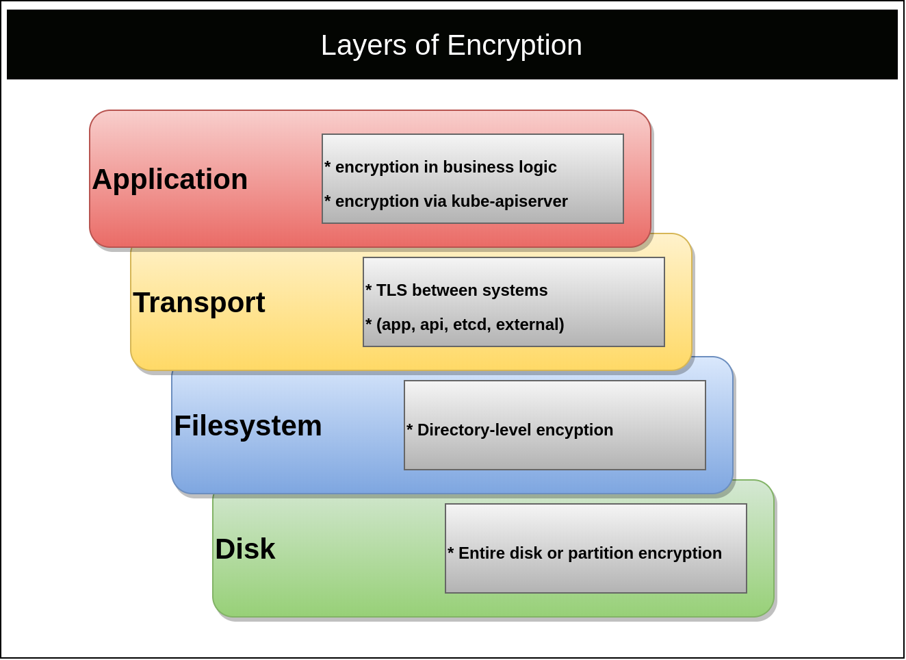

This document details secret management and distribution for Kubernetes
clusters, such as those provided by Tanzu Kubernetes Grid (TKG). It covers
architectural considerations, secret provider integration approaches, and best
practices. This document represents how the VMware field team approaches secrets
in large enterprise Kubernetes environments.

Each section covers architectural recommendations and, at times, configuration
for each concern. At a high-level, the key recommendations are:

- To support secrets, encryption should be active at the application, transport,
  and filesystem levels.
- Prefer external secret management solutions, such as
  [Vault](https://www.vaultproject.io) over using Kubernetes as a secret store.
  - _While Vault is the most mature, weigh it against what you're most familiar
    with._
- If using Kubernetes as a secret store, prefer using a Key Management Service
  (KMS)-plugin to achieve envelope encryption.
  - _KMS-plugins are largely immature, unless using a managed offering._
- If using Kubernetes as a secret store and a KMS-plugin is a non-option,
  configure encryption at rest using a static key.
- If storing secrets declaratively is desired (e.g. in git) use sealed-secrets.
- Expose secrets in volumes; not environment variables.
- Keep applications unaware of secret providers (Vault, Kubernetes, or
  otherwise).

## Encryption Layers

There are many layers to ensuring secrets are safe. The focus of this reference
architecture is cover application-level encryption. However, this document must
first address all layers. Ignoring encryption on a layer, such as transport,
could cause secrets to be leaked (e.g. plain-text over HTTP) regardless of how
secure a secret management solution is. The layers that should be encrypted
include the Filesystem (or Disk), Transport, and Application.



### Filesystem

Master nodes should always use encrypted disks. If etcd does not run on the same
nodes as the Kubernetes control plane, its disk should also be fully encrypted.
Encrypting the filesystem ensures volume backups, snapshots, and physical drives
are protected against unauthorized access. Kubernetes master nodes typically
contain secret data from certificate keys to application secrets (in etcd). On
the lowest level, there is also disk encryption, which typically covers the
entire disk and will include all metadata. See
[disk encryption vs filesystem](https://en.wikipedia.org/wiki/Disk_encryption#Disk_encryption_vs._filesystem-level_encryption)
for more details.

### Transport

Transport Layer Security (TLS) should be used for communication to and from all
control plane components. This is the default mode for most Kubernetes
distributions and provisioning methods. Validation of TLS should be done against
the `kube-apisever` and etcd.

Proper transport encryption between kube-apiserver, its clients, and etcd can be
verified with the following flags.

```yaml
spec:
  containers:
    - command:
        - kube-apiserver
        - --client-ca-file=/etc/kubernetes/pki/ca.crt
        - --etcd-cafile=/etc/kubernetes/pki/etcd/ca.crt
        - --etcd-certfile=/etc/kubernetes/pki/apiserver-etcd-client.crt
        - --etcd-keyfile=/etc/kubernetes/pki/apiserver-etcd-client.key
        - --etcd-servers=https://127.0.0.1:2379
        - --insecure-port=0 # disabled and set to 0
        - --kubelet-client-certificate=/etc/kubernetes/pki/apiserver-kubelet-client.crt
        - --kubelet-client-key=/etc/kubernetes/pki/apiserver-kubelet-client.key
        - --proxy-client-cert-file=/etc/kubernetes/pki/front-proxy-client.crt
        - --proxy-client-key-file=/etc/kubernetes/pki/front-proxy-client.key
        - --secure-port=6443
        - --service-account-key-file=/etc/kubernetes/pki/sa.pub
        - --tls-cert-file=/etc/kubernetes/pki/apiserver.crt
        - --tls-private-key-file=/etc/kubernetes/pki/apiserver.key

      ##### Additional flags removed for brevity #####

      image: k8s.gcr.io/kube-apiserver:v1.17.3
```

Proper transport encryption between etcd members can be verified with the
following flags.

```yaml
spec:
  containers:
    - command:
        - etcd
        # should use https:
        - --advertise-client-urls=https://192.168.201.0:2379
        # should be set for tls cert
        - --cert-file=/etc/kubernetes/pki/etcd/server.crt
        - --client-cert-auth=true
        - --initial-advertise-peer-urls=https://192.168.201.0:2380
        - --initial-cluster=master-0=https://192.168.201.0:2380
        - --key-file=/etc/kubernetes/pki/etcd/server.key
        - --listen-client-urls=https://127.0.0.1:2379,https://192.168.201.0:2379
        - --listen-metrics-urls=http://127.0.0.1:2381
        - --listen-peer-urls=https://192.168.201.0:2380
        - --peer-cert-file=/etc/kubernetes/pki/etcd/peer.crt
        - --peer-client-cert-auth=true
        - --peer-key-file=/etc/kubernetes/pki/etcd/peer.key
        - --peer-trusted-ca-file=/etc/kubernetes/pki/etcd/ca.crt
        - --trusted-ca-file=/etc/kubernetes/pki/etcd/ca.crt

      ##### Additional flags removed for brevity #####

      image: k8s.gcr.io/etcd:3.4.3-0
```

### Application

The application layer refers to encrypting a secret **before** persisting it to
a filesystem. There are many points in time where this encryption could occur.
For example, an application could retrieve a key for an external location,
encrypt or decrypt a secret, and then act on the secret. More commonly, the
application relies on a system capable of secret management, such as Kubernetes
or HashiCorp's Vault. This reference architecture covers the variety of
approaches, architectures, and recommendations to achieve the latter. The goal
is to provide applications an enterprise-grade way to store and retrieve secret
objects.

## Secret API Overview

Kubernetes provides a [Secret
API](https://kubernetes.io/docs/concepts/configuration/secret). These objects
are similar to
[ConfigMaps](https://kubernetes.io/docs/tasks/configure-pod-container/configure-pod-configmap)
in that they can be added through the API server and injected into applications.
Secrets are typically injected via environment variables or volumes, which
Kubernetes can do automatically. Alternatively, some applications consume
Secrets by calling the Kubernetes API server directly. The key difference is
that Secrets are managed via their own RBAC, which has different implications
than ConfigMaps. Additionally, secret data is base64 encoded. While this is not
a security measure, it is a minor detail to note.

## Kubernetes Secret Defaults

The [Secret](https://kubernetes.io/docs/concepts/configuration/secret) object is
present in every Kubernetes cluster under the [v1 core
APIs](https://kubernetes.io/docs/reference/generated/kubernetes-api/v1.17/#secret-v1-core).
The two primary fields supported by this API are:

- `data`: data that is base64 encoded and unencrypted.
- `stringData`: data unencoded and unencrypted. It is stored and retrieved
  encoded (base64).

In summary, the following manifests produce equivalent objects once processed by
the `kube-apiserver`.

```yaml
apiVersion: v1
kind: Secret
metadata:
  name: mysecret
type: Opaque
data:
  dbuser: aGVwdGlvCg==
  dbkey: YmVhcmNhbm9lCg==
```

```yaml
apiVersion: v1
kind: Secret
metadata:
  name: mysecret
type: Opaque
stringData:
  dbuser: heptio
  dbkey: bearcanoe
```

Technically, the annotation `kubectl.kubernetes.io/last-applied-configuration`
will show the originally sent data from `kubectl`, meaning the dbuser and dbkey
will be readable without decoding in the latter example. However, since
`encoding` is not a security measure, we consider these equal.


### Encryption at Rest (Static Key)

{}
Ideally, you should not rely solely on encryption at rest using a static key.
While better than storing secrets in an encoded format, the encryption key lives
in plain text on each kubernetes-master. Additionally, key rotation must be
handled by you. You should prefer using an external secret store or leveraging a
KMS-plugin. Both of these alternative approaches are covered in subsequent
sections.
{}

The Kubernetes API server supports encrypting secrets at rest. This is achieved
by providing the Kubernetes API server with an encryption key, which it will use
to encrypt all secret objects before sending them to etcd.


The supported encryption providers are

- `secretbox`: XSalsa20 and Poly1305; **Recommended**
- `aescbc`: Uses [Advanced Encryption
  Standard](https://en.wikipedia.org/wiki/Advanced_Encryption_Standard)
  (AES) [Cipher Block
  Chaining](https://en.wikipedia.org/wiki/Block_cipher_mode_of_operation#Cipher_Block_Chaining_.28CBC.29)
  (CBC)
  - Assumes [PKCS#7](https://tools.ietf.org/html/rfc5652#section-1) or PKCS#5 padding; [they are interchangeable](https://en.wikipedia.org/wiki/Padding_%28cryptography%29#PKCS#5_and_PKCS#7).
- `aesgcm`: AES-GCM with random nonce

As of Kubernetes `1.17`, the documentation recommends using `aescbc`. However,
this should be considered carefully. This provider is vulnerable to
[Padding oracle attacks](https://en.wikipedia.org/wiki/Padding_oracle_attack).
Additionally, it is less secure and performant than `secretbox`. Issue
[kubernetes/kubernetes#81127](https://github.com/kubernetes/kubernetes/issues/81127)
is tracking the task to align documentation with best practices. If using static
key encryption at rest, you may wish to consider an alternative such
as`secretbox`. There are some critics for `secretbox`, stating its immaturity in
the crypto ecosystem may make it a non-option for some organizations.
Partnering with your security team to explain the available options and their
trade-offs is recommended. The following will demonstrate the static key
approach using `secretbox`.

If static key encryption is used, a 32 byte key must be generated to encrypt and
decrypt secretbox (it is symmetric). Organizations should ensure they're
following security policies and using appropriate tools to generate keys. The
following example demonstrates how to generate a key on a Linux host.

```bash
head -c 32 /dev/urandom | base64
```

{}
On Linux hosts, `/dev/urandom` is similar to `/dev/random`, but it does not
block to ensure entropy. Typically `/dev/urandom` is adequate for crypto
operations, but organizations should consult their security teams before using
this method.
{}

Using the key data above, an `EncryptionConfiguration` should be added to all
nodes running a `kube-apiserver`. This static file should be added using
configuration management such as [Ansible](https://www.ansible.com) or
[KubeadmConfigSpec](https://godoc.org/github.com/kubernetes-sigs/cluster-api-bootstrap-provider-kubeadm/api/v1alpha2#KubeadmConfigSpec).
if using Cluster API. This ensures keys can be added, deleted, and rotated. The
following example assumes the configuration is stored at
`/etc/kubernetes/pki/secrets/encryption-config.yaml`.

```yaml
apiVersion: apiserver.config.k8s.io/v1
kind: EncryptionConfiguration
resources:
  - resources:
      - secrets
    providers:
      - secretbox:
          keys:
            - name: secret-key-1
              secret: u7mcOcHKbFh9eVluB18hbFIsVfwpvgbXv650QacDYXA=
      # identity is a required (default) provider
      - identity: {}
```

Placed inside of a
[KubeadmConfigSpec](https://godoc.org/github.com/kubernetes-sigs/cluster-api-bootstrap-provider-kubeadm/api/v1alpha2#KubeadmConfigSpec),
this would look as follows.

```yaml
kind: KubeadmControlPlane
apiVersion: controlplane.cluster.x-k8s.io/v1alpha3
metadata:
  name: k8s-capa
spec:
  infrastructureTemplate:
    apiVersion: infrastructure.cluster.x-k8s.io/v1alpha3
    kind: AWSMachineTemplate
    name: k8s-capa-controlplane
  kubeadmConfigSpec:
    files:
      - content: |
          apiVersion: apiserver.config.k8s.io/v1
          kind: EncryptionConfiguration
          resources:
            - resources:
              - secrets
              providers:
              - secretbox:
                  keys:
                  - name: secret-key-1
                    secret: u7mcOcHKbFh9eVluB18hbFIsVfwpvgbXv650QacDYXA= 
              # identity is a required (default) provider
              - identity: {}
        owner: "root:root"
        path: "/etc/kubernetes/etcd-encryption/encryption.yaml"
        permissions: "0644"
```

The list of providers above are ordered. Meaning encryption will always occur
using the first key and decryption will be attempted in order of keys listed
above. Identity is the default, plain-text provider and should be last. If it's
first, secrets will not be encrypted.

To respect the above configuration, every instance of the `kube-apiserver` must
be updated to load the `EncryptionConfiguration` locally. In
`/etc/kubernetes/manifests/kube-apiserver.yaml` an argument can be added as
follows.

```bash
--encryption-provider-config=/etc/kubernetes/pki/secrets/encryption-config.yaml
```

Once the `kube-apiserver`(s) restart, this change will take effect and secrets
will be encrypted before being sent to etcd.

{}
While data is encrypted in etcd, anyone with proper RBAC permissions to access
the secret will be able to retrieve the unencrypted, base64 encoded, value.
Improper RBAC configuration or inappropriate access to a service account can
leak secrets. Additionally, if anyone gains read access to the
`/etc/kubernetes/pki/secrets` directory from above, they will have access to
decrypt secrets from etcd (assuming access to etcd).
{}

Validation from within etcd should **always** be performed when enabling
encryption. All existing secrets will **not** be encrypted unless they are
updated via the `kube-apiserver`. The following helper script can be run from a
master node to interact with etcd. This assumes
[etcdctl](https://github.com/etcd-io/etcd/tree/master/etcdctl) is available on
the master node.

```bash
#!/bin/bash

# This script assumes you're running from a master node
# hosting the kube-apiserver.

# Change this based on location of etcd nodes
ENDPOINTS='127.0.0.1:2379'

ETCDCTL_API=3 etcdctl \
  --endpoints=${ENDPOINTS} \
  --cacert="/etc/kubernetes/pki/etcd/ca.crt" \
  --cert="/etc/kubernetes/pki/apiserver-etcd-client.crt" \
  --key="/etc/kubernetes/pki/apiserver-etcd-client.key" \
  ${@}
```

To validate encryption, one must retrieve an existing secret (pre-encryption
configuration) and a new secret (post-encryption configuration). Kubernetes
stores secrets in `etcd` using the format of
`/registry/secrets/${NAMESPACE}/${SECRET_NAME}`.

Assuming a pre-existing secret named `login1` in the `default` namespace, using
the above script reveals the plaintext data.

```bash
./etcctl-script get /registry/secrets/default/login1
```

```
/registry/secrets/default/login1
k8s


v1Secret

        login1default"*$6c991b48-036c-48f8-8be3-58175913915c2bB
0kubectl.kubernetes.io/last-applied-configuration{"apiVersion":"v1","data":{"dbkey":"YmVhcmNhbm9lCg==","dbuser":"aGVwdGlvCg=="},"kind":"Secret","metadata":{"annotations":{},"name":"login1","namespace":"default"},"type":"Opaque"}
z
dbkey
bearcanoe

dbuserheptio
Opaque"
```

Applying a new secret, e.g. `login2`, should produce results that are clearly
encrypted, such as the following.

```bash
./etcctl-script get /registry/secrets/default/login2
```

```
/registry/secrets/default/login2
k8s:enc:secretbox:v1:secret-key-1:^Dʜ
                                     HN,lU/:L kdR<_h (fO$V
y.
  r/m
MٜjVĄGP<%B0kZHY}->q|&c?a\i#xoZsVXd+8_rCצgcj[Mv<X5N):MQ'7݋t
'pLBxqݡ)b݉/+r49ޓ`f
                 6(iciQⰪſ$'.ejbprλ=Cp+R-D%q!r/pbv1_.izyPlQ)1!7@X\0
                                                                  EiĿr(dwlS
```

With encryption set up, policies for key retention and rotation must be defined.
Based on a schedule, the key should be rotated. To rotate keys, one must add a
new key to the top of the list inside the provider. Since this key is first, it
will be used for all new encryption. When secret objects are updated, they will
be re-encrypted using this new key over time. Until then, the original key can
remain in the list as a fall back decryption option.

### Envelope Encryption with Key Management Service (KMS)

{}
The following section details a viable design approach for secret management
with etcd (Kubernetes) as the secret store. However, it relies on plugin
implementations that are only available to cloud-providers and are largely
immature. Be sure to understand the available plugins and their maturity before
continuing with this approach.
{}

Kubernetes `1.10` and later supports integrating with a KMS to achieve envelope
encryption. Envelope encryption involves two keys; the Key Encryption Key (KEK)
and the data encryption key (DEK). KEKs are stored externally in a KMS and
aren't at risk unless the KMS provider is compromised. KEKs are used to encrypt
DEKs, which are responsible for encrypting Secret objects. Each Secret object
gets its own unique DEK to encrypt and decrypt the data. Since DEKs are
encrypted by a KEK, they can be stored with the data itself, preventing the
`kube-apiserver` from needing to be aware of many keys. Architecturally, the
flow of envelope encryption would look as follows.


There can be some variance in how the above works, based on a KMS provider, but
generally this demonstrates how envelope encryption functions. There are
multiple benefits to the above model.

- KMS is external to Kubernetes; increasing security via isolation.
- Centralization of KEKs enables easy rotation of keys.
- Separation of DEK and KEK means secret data is never sent to or known by the KMS
  - KMS is only concerned with decrypting DEKs.
- Encryption of DEKs means they are easy to store alongside their secret,
  making management of keys in relation to their secrets easy.

The provider plugins work by running a privileged container [implementing a gRPC
server that can communicate with a remote
KMS](https://kubernetes.io/docs/tasks/administer-cluster/kms-provider/#implementing-a-kms-plugin).
This container runs exclusively on master nodes where a `kube-apiserver` is
present. Then, similar to setting up encryption in the previous section, an
`EncryptionConfiguration` must be added to master nodes with settings to
communicate with the KMS plugin.

```yaml
apiVersion: apiserver.config.k8s.io/v1
kind: EncryptionConfiguration
resources:
  - resources:
  - secrets
providers:
  - kms:
      name: myKmsPlugin
      endpoint: unix:///tmp/socketfile.sock
      cachesize: 100
      timeout: 3s
  # required, but not used for encryption
  - identity: {}
```

Assuming the above is saved on each master node at
`/etc/kubernetes/pki/secrets/encryption-config.yaml`, the `kube-apiserver`
arguments must be updated to include the following.

```bash
--encryption-provider-config=/etc/kubernetes/pki/secrets/encryption-config.yaml
```

Changing the value should restart the `kube-apiserver`. If it doesn't, a restart
is required for the change to take effect.

From a design perspective, this is a viable model. However, kms-plugin
implementations are scarce and the ones that do exist are immature. As of March
2020, the following data points are true. There are no tagged releases for the
[aws-encryption-provider
(AWS)](https://github.com/kubernetes-sigs/aws-encryption-provider) or the
[k8s-cloudkms-plugin
(Google)](https://github.com/GoogleCloudPlatform/k8s-cloudkms-plugin). Azure's
plugin [kubernetes-kms](https://github.com/Azure/kubernetes-kms) has notable
limitations such as no support for key rotation. So with the exception of
running in a managed service, such as GKE where the KMS-plugin is automatically
available and supported by Google, usage may prove unstable. Lastly, the only
cloud-provider agnostic KMS plugin available was kubernetes-vault-kms-plugin,
which was only partially implemented and has been archived (abandoned).

## External Secret Management

Our preference is to use an external secret store instead of Kubernetes.
Regardless of whether Kubernetes secrets are encrypted at rest. Instead, we
recommend using an external secret store such as [HashiCorp's
Vault](https://www.vaultproject.io/docs). Over time, if KMS-plugins mature and
see larger adoption, they could be a viable alternative to external stores. Most
external secret stores feature advanced management capabilities, permission
configuration, [HSM](https://en.wikipedia.org/wiki/Hardware_security_module)
support, and key rotation settings. The primary downside to using an external
secret store is you must gain familiarity with it and, most importantly, you may
need to operate the store. As secrets are often critical to the overall
platform, operating this in a performant and resilient manner adds to an
organization's operational overhead.

VMware does not prefer any specific store. Vault is used as the example for many
of the following secret integration patterns. Vault is not a VMware project or
supported by VMware. It is [a CNCF
project](https://landscape.cncf.io/selected=vault), widely adopted inside and
outside of Kubernetes, has been used in many customer deployments, and has many
integration capabilities with Kubernetes. It is crucial an organization
understands how to operate Vault before adopting it as their secret manager.

For testing purposes, Vault can be deployed inside Kubernetes using the Helm
chart at https://www.vaultproject.io/docs/platform/k8s/helm/run. This is not a
production-ready deployment of Vault. Individuals with Vault expertise and/or
HashiCorp should be consulted if running Vault in production.

Once an external secret store is available to workloads in Kubernetes, there are
several options for retrieval. The following covers these approaches, our
recommendations, and trade-offs. In the following, we'll cover each design
approach to consuming secrets and describe Vault's implementation.

### Workload Sidecar Retrieval

This approach runs an
[initContainer](https://kubernetes.io/docs/concepts/workloads/pods/init-containers)
and/or sidecar container to communicate with an external secret store.
Typically, secrets are injected into the pod's filesystem, making them available
to all containers running in a pod. We **highly recommend** this approach when
possible. The major benefit is it decouples the secret store entirely from the
application. However, this does make the platform more complex, as facilitating
secret injection is now an offering of the Kubernetes-based platform.

Vault's implementation of this model uses a
[MutatingWebhook](https://kubernetes.io/docs/reference/access-authn-authz/extensible-admission-controllers/)
pointed at a `vault-agent-injector`. As pods are created, based on annotations,
the vault-agent-injector adds an `initContainer` (used for retrieval of the
initial secret) and a sidecar container to keep secrets updated, if needed.


To facilitate mutation via the `vault-agent-injector`, a
`MutatingWebhookConfiguration` is added, as follows.

```yaml
apiVersion: admissionregistration.k8s.io/v1
kind: MutatingWebhookConfiguration
metadata:
  labels:
    app.kubernetes.io/instance: vault
    app.kubernetes.io/managed-by: Helm
    app.kubernetes.io/name: vault-agent-injector
  name: vault-agent-injector-cfg
webhooks:
  - admissionReviewVersions:
      - v1beta1
    clientConfig:
      caBundle: REDACTED
      service:
        name: vault-agent-injector-svc
        namespace: default
        path: /mutate
        port: 443
    failurePolicy: Ignore
    matchPolicy: Exact
    name: vault.hashicorp.com
    namespaceSelector: {}
    objectSelector: {}
    reinvocationPolicy: Never
    rules:
      - apiGroups:
          - ""
        apiVersions:
          - v1
        operations:
          - CREATE
          - UPDATE
        resources:
          - pods
        scope: "*"
    sideEffects: Unknown
    timeoutSeconds: 30
```

The mutating webhook is invoked on **every** pod `CREATE` or `UPDATE` event.
While evaluation will occur on every pod, not every pod will be mutated, or
injected with a `vault-agent`. The `vault-agent-injector` is looking for 2
annotations in every pod spec.

- `vault.hashicorp.com/agent-inject: "true"`: Instructs the injector to include
  a `vault-agent` `initContainer`, which retrieves secrets and writes them to
  the pod's filesystem, prior to other containers starting.
- `vault.hashicorp.com/agent-inject-status: "update"`: Instructs the injector to
  include a `vault-agent` sidecar, which runs alongside the workload. It will
  update the secret, should it change in Vault. The `initContainer` still runs
  in this mode. This parameter is optional and when it is not included, the
  sidecar is not added.

When the `vault-agent-injector` does a mutation based on
`vault.hashicorp.com/agent-inject: "true"`, the following is added.

```yaml
initContainers:
  - args:
      - echo ${VAULT_CONFIG?} | base64 -d > /tmp/config.json && vault agent -config=/tmp/config.json
    command:
      - /bin/sh
      - -ec
    env:
      - name: VAULT_CONFIG
        value: eyJhd
    image: vault:1.3.2
    imagePullPolicy: IfNotPresent
    name: vault-agent-init
    securityContext:
      runAsGroup: 1000
      runAsNonRoot: true
      runAsUser: 100
    volumeMounts:
      - mountPath: /vault/secrets
        name: vault-secrets
```

Note: Some configuration was removed for brevity.

When the `vault-agent-injector` sees the annotation
`vault.hashicorp.com/agent-inject-status: "update"`, the following is added.

```yaml
containers:
  #
  # ORIGINAL WORKLOAD CONTAINER REMOVED FOR BREVITY
  #
  - name: vault-agent
    args:
      - echo ${VAULT_CONFIG?} | base64 -d > /tmp/config.json && vault agent -config=/tmp/config.json
    command:
      - /bin/sh
      - -ec
    env:
      - name: VAULT_CONFIG
        value: asdfasdfasd
    image: vault:1.3.2
    imagePullPolicy: IfNotPresent
    securityContext:
      runAsGroup: 1000
      runAsNonRoot: true
      runAsUser: 100
    volumeMounts:
      - mountPath: /vault/secrets
        name: vault-secrets
```

Note: Some configuration was removed for brevity.

{}
An unfortunate detail (as of March 2020) of the vault-sidecar implementation is
the use of the **entire** [vault image](https://hub.docker.com/_/vault). This is
the entire image (~50MB) used to run a Vault server, not just a client. Thus
there is unneeded bloat from packages, code, and more.
{}

With the agents present, they will retrieve and download secrets based on the
pod annotations, such as the following annotation that requests a database
secret from Vault.

```
vault.hashicorp.com/agent-inject-secret-db-creds: "serets/db/creds"
```

By default, secret value will be persisted as if a [Go
map](https://tour.golang.org/moretypes/19) was printed out. Syntactically, it
appears as follows. All secrets are put into `/vault/secrets`.

```txt
key: map[k:v],
key: map[k:v]
```

Where `k` would be the key and `v` would be the value.

To ensure formatting of a secret is optimal for consumption, Vault supports
adding templates into the annotation of pods. This uses standard [Go
templating](https://golang.org/pkg/text/template/). For example, to create a
JDBC connection string, the following template can be applied to a secret named
`creds`.

```yaml
spec:
  template:
    metadata:
      annotations:
        vault.hashicorp.com/agent-inject: "true"
        vault.hashicorp.com/agent-inject-status: "update"
        vault.hashicorp.com/agent-inject-secret-db-creds: "secrets/db/creds"
        vault.hashicorp.com/agent-inject-template-db-creds: |
          {{- with secret "secrets/db/creds" -}}
          jdbc:oracle:thin:{{ .Data.data.username }}/{{ .Data.data.password }}@//192.168.34.212:4464/app
          {{- end }}
```

If using Vault's sidecar injector, be sure to review [the available
annotations](https://www.vaultproject.io/docs/platform/k8s/injector/annotations).

### Application Secret Retrieval

In this approach, the application hosts logic to communicate with the external
secret store. Ideally, depending on the technology, using pre-existing client
libraries. The major benefit to this approach is taking secret consumption
concerns out of the realm of the platform. This is especially important when
there is no centralized secret management facilities and application teams use a
wide array of technologies. However, this comes with two major downsides. One is
applications must be "aware" of the secret store provider. They cannot just rely
on an environment variable or a volume existing, making them less portable.
Second, there is more code required from application teams. This increases
application concerns and introduces opportunity for security mistakes to be
made, such as accidentally leaving a `logger` present that prints out what is
retrieved from Vault.

The Vault project features several client-libraries that enable applications to
talk directly to Vault. The Vault project's API docs has a [master
reference](https://www.vaultproject.io/api-docs/libraries).

An example of this approach can be seen in [The Spring
Framework](https://spring.io/projects/spring-vault#overview). A developer can
utilize the Vault integration by importing
`org.springframework.vault.spring-vault-dependencies`.

```xml
<dependencyManagement>
  <dependencies>
    <dependency>
      <groupId>org.springframework.vault</groupId>
      <artifactId>spring-vault-dependencies</artifactId>
      <version>2.2.1.RELEASE</version>
      <scope>import</scope>
      <type>pom</type>
    </dependency>
  </dependencies>
</dependencyManagement>
```

A bean can then be created describing where and how to reach Vault.
`ClientAuthentication` is shown below, but realistically developers will use a
system such as `AWS-IAM`, `GCP-IAM`, or `TLS-Cert`. Examples of every
authentication method can be found in the [reference
documentation](https://docs.spring.io/spring-vault/docs/2.2.1.RELEASE/reference/html/#vault.core.authentication).

```java
@Configuration
public class VaultConfig extends AbstractVaultConfiguration {

    /**
     * Endpoint for vault load balancer.
     */
    @Override
    public VaultEndpoint vaultEndpoint() {
        return new VaultEndpoint();
    }

    /**
     * Credentials for client
     * You SHOULD replace this
     */
    @Override
    public ClientAuthentication clientAuthentication() {
        return new TokenAuthentication("…");
    }
}
```

Spring developers may then utilize `@VaultPropertySource` to inject secrets
throughout their application.

```java
@Configuration
@VaultPropertySource("secret/db-creds")
public class AppConfig {

       @Autowired
       Environment env;

       @Bean
       public TestBean testBean() {
               TestBean testBean = new TestBean();
               testBean.setPassword(env.getProperty("database.password"));
               return testBean;
       }
}
```

These examples provide Java developers ultimate flexibility in their consumption
and usage of Vault-managed secrets.

### CSI Secret Store Driver Retrieval

The
[Kubernetes-Secrets-Store-CSI-Driver](https://github.com/kubernetes-sigs/secrets-store-csi-driver/blob/master/README.md)
offers a common way to expose secrets, hosted in enterprise-grade
secret-management systems. They are exposed through Kubernetes volumes. This
model achieves the same as the injector-sidecar described in the previous
section. With the added benefit of a consistent driver experience where
providers can be plugged in. It offers creation of StorageClasses, which
developers can then consume with details about the specific secret they need.

```yaml
apiVersion: secrets-store.csi.x-k8s.io/v1alpha1
kind: SecretProviderClass
metadata:
  name: db-creds
spec:
  provider: vault
  parameters:
    roleName: "my-role"
    vaultAddress: "http://192.32.122.111:8000"
    vaultSkipTLSVerify: "true"
    objects: |
      array:
        - |
          objectPath: "/secret/db"
          objectName: "creds"
          objectVersion: ""
```

Workloads can then consume the secret as a `volume`.

```yaml
kind: Pod
apiVersion: v1
metadata:
  name: busybox
spec:
  containers:
    - image:
      name: busybox
      volumeMounts:
        - name: secrets-store-inline
          mountPath: "/vault/secrets"
          readOnly: true
  volumes:
    - name: secrets-store-inline
      csi:
        driver: secrets-store.csi.k8s.com
        readOnly: true
        volumeAttributes:
          secretProviderClass: "db-creds"
```

Ideally, this approach will be the future of external secret store integration.
However, we **do not** recommend this approach today. As of Kubernetes 1.18, the
providers
([Azure](https://github.com/Azure/secrets-store-csi-driver-provider-azure) and
[Vault](https://github.com/hashicorp/secrets-store-csi-driver-provider-vault))
are only partially implemented. Tracking this project or creating your own
provider is advised as a future replacement for the Workload Sidecar Injector
approach.

## Sealed Secrets

{}
Sealed secrets are not a replacement for proper secret management; Their primary
benefit is to enable developers to encrypt secrets and store them safely in
locations such as git repositories. From a Kubernetes perspective, the private
key used by the controller is stored in plain text in etcd. Additionally, the
unsealed version of secrets are stored and managed as plain-text Kubernetes
secrets. Thus, application-level encryption of secrets in etcd remains a
critical concern.
{}

Sealed secrets offer a mechanism to enable developers to encrypt secrets
locally. These encrypted secrets can only be decrypted by the controller running
in the Kubernetes cluster. This makes secrets safe, even when stored in public
locations. This encrypting happens through a command-line utility run by
developers, called
[kubeseal](https://github.com/bitnami-labs/sealed-secrets#installation). Along
with `kubeseal`, a `sealed-secret-controller` runs in the cluster facilitating
decryption of requested secrets. In essence, sealed secrets leverage [asymmetric
cryptography](https://en.wikipedia.org/wiki/Public-key_cryptography) where
clients can use the public key to encrypt but only the
`sealed-secret-controller` holds the private key to decrypt. The
`sealed-secret-controller` is deployed first in the cluster.

```yaml
kubectl apply -f https://github.com/bitnami-labs/sealed-secrets/releases/download/v0.12.6/controller.yaml
```

Releases of sealed secrets can be found at the
[GitHub releases page](https://github.com/bitnami-labs/sealed-secrets/releases).

Upon deployment, the controller generates the public and private key pair. After
a developer downloads
[kubeseal](https://github.com/bitnami-labs/sealed-secrets/releases), it can
fetch the **public key**, which is used for encryption. The public (cert) and
private (key) are stored in a Kubernetes Secret under
`kube-system/sealed-secret-key`. Fetching the public cert will be done
automatically by creating a proxy to the `sealed-secret-controller` via the
`kube-apiserver`. You can force retrieval with the following command.

```bash
kubeseal --fetch-cert
```


This cert can be stored locally or in alternative external locations if this
flow is not realistic for all developer workstations.

Interaction to download the public key is achieved via the controller. Users
should **not** be given access to `kube-system/sealed-secret-key`. This object
contains the private key.

Once the public key is loaded in `kubeseal`, developers can generate
`SealedSecret` CRDs that contain (encrypted) secret data. These CRDs are stored
in etcd. The `sealed-secret-controller` makes the secrets available using
standard Kubernetes Secrets. To ensure `SealedSecret` data is converted to a
Secret correctly, developers specify templates in the `SealedSecret` object.

Developers can start with a Kubernetes secret, like any other.

```yaml
apiVersion: v1
kind: Secret
metadata:
  name: mysecret
type: Opaque
data:
  dbuser: aGVwdGlvCg==
  dbkey: YmVhcmNhbm9lCg==
```

To "seal" the secret, a developer may run `kubeseal` against the above secret
and it will generate an encrypted output in JSON.

```bash
kubeseal mysecret.yaml
```

```yaml
{
  "kind": "SealedSecret",
  "apiVersion": "bitnami.com/v1alpha1",
  "metadata":
    { "name": "mysecret", "namespace": "default", "creationTimestamp": null },
  "spec":
    {
      "template":
        {
          "metadata":
            {
              "name": "mysecret",
              "namespace": "default",
              "creationTimestamp": null,
            },
          "type": "Opaque",
        },
      "encryptedData":
        { "dbkey": "gCHJL+3bTRLw6vL4Gf......", "dbuser": "AgCHJL+3bT......" },
    },
  "status": {},
}
```

The above `SealedSecret` object can be placed anywhere. As long as the sealing
key, held by the `sealed-secret-controller` is not compromised, the data will be
safe. Rotation is **especially important** in this model. It's covered in a
subsequent section.

Once applied, the flow and storage looks as follows.


The Secret object, made by the `sealed-secret-controller` is owned by its
corresponding `SealedSecret` CRD.

```yaml
ownerReferences:
  - apiVersion: bitnami.com/v1alpha1
    controller: true
    kind: SealedSecret
    name: mysecret
    uid: 49ce4ab0-3b48-4c8c-8450-d3c90aceb9ee
```

This means if the SealedSecret is deleted, its corresponding `Secret` object
will be garbage collected.

### Key Renewal

If the sealed-secret private key is leaked (perhaps due to RBAC
misconfiguration), every secret should be considered compromised. It's
especially important that the sealing key is renewed on an interval and that you
understand the scope of "renewal". The default behavior is for this key to be
renewed every 30 days. It does not **replace** the existing keys; instead it is
appended to the existing list of keys that can unseal. However, the new key is
used for all **new** encryption activity. Most importantly, **existing sealed
secrets are not re-encrypted**.

In the event of a leaked key, you should:

- Immediately renew your secret.
- Rotate all existing secrets.

Remember that just re-encrypting isn't good enough. For example, someone could
easily go into git history, find the old encrypted asset, and use the
compromised key on it. Generally speaking, you should have rotation and renewal
strategies for passwords and keys respectively.

Sealed-secrets does not support integration with HSM modules or KMS providers.

### Access Policy

Sealed Secrets use a trick where the namespace is used during encryption. This
provides an isolation mechanic where a `SealedSecret` truly belong to the
namespace it was created in and cannot just be moved between them. Generally,
this default behavior is the most secure and should just be left as is. However
there are additional access policies for those that need more flexibility. The
following scopes can be set on the controller.

- `strict` (default): the secret must be sealed with exactly the same name and
  namespace. These attributes become part of the encrypted data and thus
  changing name and/or namespace would lead to "decryption error".

- `namespace-wide`: you can freely rename the sealed secret within a given
  namespace.

- `cluster-wide`: the secret can be unsealed in any namespace and can be given
  any name.

## Application Considerations

Application consumption of secrets is highly dependent on the language and
frameworks at play. While variance is high, there are general best practices we
recommend encouraging application developers consider.

### Always Audit Secret Interaction

Kubernetes cluster should be configured with auditing enabled. Auditing allows
you to specify the events that occur around specific resources. This will tell
you when and by whom a resource was interacted with. For mutations, it will also
detail what changed. Auditing secret events is critical in reacting to access
issues. For details about auditing, see the
[cluster audit documentation](https://kubernetes.io/docs/tasks/debug-application-cluster/audit/).

### Don't leak secrets

While leaking secrets is never desirable, in multi-tenant Kubernetes
environments it's important to consider how secrets can be leaked. A common
occurrence is to accidentally log a secret. Logs go to stdout/stderr and are, in
many Kubernetes-based platforms, forwarded to a log analysis platform. This
means the secret may pass in plain text through many environments and systems.

Kubernetes is primarily a declarative system. Developers write manifests that
can easily contain secret data, especially when testing. Developers should work
with caution to ensure secrets used while testing don't get committed into
source control repositories. If storing secret data declaratively alongside the
application is desirable, see the sealed-secret section of this reference
architecture.

### Prefer volumes over environment variables

The most common ways to access secrets provided by Kubernetes is to propagate
the value into an environment variable or volumes. For most applications,
volumes should be preferred. Environment variables have a higher chance of being
leaked through various means. For example, an echo command performed while
testing. Most importantly, when secrets change, volumes are automatically
updated; this will enable hot-reloading of secrets such as tokens. For a secret
change to take place with environment variables, pods must be restarted.

### Make secret store providers unknown to your application

There are several approaches an application can take to retrieve and consume its
required secrets. These can range from calling a secret store within business
logic to expecting an environment variable to be set on start-up. Following the
philosophy of separation of concerns, we recommend implementing secret
consumption in a way that whether Kubernetes, Vault, or other providers are
managing the secret does not matter to the application. Achieving this makes
your application portable, platform agnostic, and reduces complexity of your
apps interaction. Complexity is considered reduced because for an application to
retrieve secrets from a provider it needs to both understand how to talk to the
provider and be able to authenticate for communication with the provider.

To achieve this provider-agnostic implementation, applications should prefer
loading secrets from Environment variables or volumes. Considering the coverage
in previous sections, volumes are the most ideal. In this model, an application
will assume the presence of secrets in one or many volumes. Since volumes can be
updated dynamically (without pod restart) the application can watch the
filesystem if a hot-reload of secrets is desired. By consuming from the
container's local filesystem, it does not matter whether the backing store is
Kubernetes or otherwise. See the Vault section of this reference architecture to
understand how injection sidecar containers can be used to achieve this model.

Some application frameworks, such as Spring, include libraries to communicate
directly to the API server and auto inject secrets and configuration. While
these utilities are convenient, consider the points above to determine what
approaches hold most value to your application.