This document details the philosophy and methods for providing workload identity
in a Kubernetes cluster. It covers architectural considerations, tooling
integrations, and best practices. This document represents how the VMware field
team approaches workload identity in enterprise Kubernetes environments.

Each section covers architectural recommendations and, at times, configuration
for each concern. At a high-level, the key recommendations are:

- Selectors that determine the identity of a workload (image ID, service
  account, node name etc...) should be scoped as tightly as possible to ensure a
  strong guarantee of unique identity.
- Identity-providing systems should be able to easily rotate and revoke granted
  identities in the case of compromise.
- Prefer integrating identity solutions into a service mesh or sidecar to avoid
  tightly-coupling identity into your applications.
- Ensure you understand the security model (including the blast radius of a
  compromise at any level) of your identity provider. Develop and test a
  contingency strategy should credentials be compromised at different points.
- Avoid using network primitives (IP addresses, etc...) as identities.
- Understand the domains throughout which identity has to be proved (single /
  multi-cluster, single / multi-cloud, Kubernetes / non-Kubernetes, etc...).

## Identity and Authentication

{}
Authentication is the process of establishing the identity of an application or
user. This is primarily the focus of this guide.

Authorization is the process of determining what actions an application or user
are able to do, after they have been authenticated.
{}

Establishing identity (usually for the purposes of authentication) is a key
requirement of almost every distributed system. In this context 'identity' means
a verifiable, unique (within the desired scope), set of information that can be
used to identify an actor (this guide focuses on use cases where the actor is an
application, rather than a user). Examples are username / password combinations,
certificates, tokens, and more.

Establishing the identity of an actor is important so that you can make
decisions about whether the actor is allowed access to a system, what actions
they can take and what data they have access to (broadly, authorization).

## Authentication Methods

There are a number of different authentication methods in wide use. All have
different properties, advantages and disadvantages. Some are cross-platform (or
platform-agnostic), some are integrated with specific platforms. In addition to
providing identity, some of the methods described may also provide encryption.
For example, the
[CSR](https://en.wikipedia.org/wiki/Certificate_signing_request) flow used by
Kubernetes provides certificates that could be used in a Mutual TLS (mTLS) flow.
However, encryption is not the focus of this guide and that is an incidental
benefit of those methods of identity grants.

### Shared Secrets

A shared secret is a unique piece (or set) of information that is held by the
calling application and the server. For example, when an application needs to
connect to a MySQL database, it can use a username and password combination to
authenticate. This method necessitates that both parties have access to that
combination in some form. You must create an entry in MySQL with that
information, and then distribute the secret to any calling application that may
need it.

You also need a way to easily rotate secret credentials in the case of a
compromise. Again you need to ensure that secrets are distributed to all calling
applications and kept in sync. There are many secret stores ([HashiCorp
Vault](https://www.hashicorp.com/products/vault/) is a prominent and mature
example) that offer integrations that get close to this goal however these still
suffer from the initial _secure introduction problem_.

The [secure introduction
problem](https://learn.hashicorp.com/vault/identity-access-management/iam-secure-intro)
is the issue that is faced when initially bootstrapping application access to a
secret store. Once the authenticated communication is established, you have no
problems refreshing / rotating and so on. However, how does the application
authenticate to the secret store _*initially*_?

In the example below, the backend application holds a database of authorized
credentials. However, you need to distribute a set of credentials to the
frontend application in order for a connection to be established.

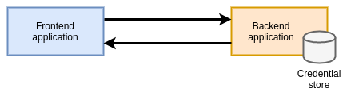

Advantages:

- Well-understood and supported pattern by almost all applications & platforms.

Disadvantages:

- Suffers from the secure introduction problem.
- Keeping track of, rotating and revoking credentials is challenging, especially
  in large environments.

Shared secrets should only be used in conjunction with a robust secret store /
platform, and additional tooling / approaches are required to bootstrap the
initial connection between applications requesting identity / credentials and
the secrets store.

### 'Traditional' Network Primitives

Network primitives like IP addresses, VPNs, firewalls, etc... have historically
been used as a form of identity for restricting which applications have access
to what services. However in a cloud-native ecosystem these methods are breaking
down.

Multiple workloads are now sharing networking stacks and underlying machines.
Workloads are increasingly ephemeral and move between nodes often. This results
in a constant churn of IP addresses and network changes.

In a multi-cloud and API-driven world, the network is no longer a primary
boundary in many systems, with calls to external services across multiple
providers, each of which may need a way to prove identity of our calling
applications (and vice versa).

Existing traditional (platform level) network primitives (host IP addresses,
firewalls, etc...) are no longer suitable for establishing workload identity and
if used at all should be only as an additional layer of defense in depth. This
is not to say that network primitives _in general_ are bad, but that they must
have additional workload context to be effective. This guide covers these
scenarios in more detail in the CNI section below.

### Platform Mediated Node Identity

In cases where all workloads are running on a homogenous platform (for example,
AWS), it is possible for the platform itself to determine and assign identities
to workloads because of the contextual metadata they possess about the workload.

Identity is not asserted by the workload itself but determined based on its
properties by an out-of-band provider. The provider returns the workload a
credential to prove identity that may be used to communicate with other services
on the platform. It then becomes trivial for the other services to verify that
credential as they too are on the same underlying platform.

On AWS, an EC2 instance may request credentials to connect to a different
service like an S3 bucket. The AWS platform inspects the metadata of the
instance, and can provide role-specific credentials back to the instance with
which to make the connection.

Note that the platform still has to perform _Authorization_ on the request to
ensure that the identity being used has the appropriate permissions. This method
is only being used to _Authenticate_ the request.

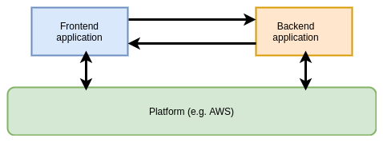

Advantages:

- Transparent to end users.
- Tight integration with the platform (AWS, GCP, etc...).

Disadvantages:

- Requires all workloads to be running on the same platform.
- Granularity of identifying metadata may not match granularity of workloads
  (_see AWS section below_).

## Kubernetes Identity Primitives / Methods

Kubernetes has several primitives built into the platform to provide identity,
all with varying degrees of guarantees, complexity and versatility.

### Certificate Signing Requests (CSR)

Any entity with appropriate RBAC permissions can submit a certificate signing
request (containing metadata to be encoded into a x509 certificate) to a
Kubernetes cluster. A user (or automated tooling) then approves or denies the
request. If the request is approved, a certificate signed by the Kubernetes CA
is created and made available for retrieval. This certificate can then be used
in a TLS flow.

Note that in order for the CSR flow to function correctly the controller-manager
needs to be configured with the `--cluster-signing-cert-file` and
`--cluster-signing-key-file` parameters as shown below. The CA does _not_ have
to be the Kubernetes CA, however if you choose to use a different one then it is
your responsibility to make the CA available to applications, for example by
publishing it in a config map.

```yaml
spec:
  containers:
    - command:
        - kube-controller-manager
        - --cluster-signing-cert-file=/etc/kubernetes/pki/ca.crt
        - --cluster-signing-key-file=/etc/kubernetes/pki/ca.key
      # Additional flags removed for brevity
      image: k8s.gcr.io/kube-controller-manager:v1.17.3
```

Firstly the application needs to create (or utilize an existing) private key and
create a CSR. The example shows using `openssl` to create this, but libraries
exist for programmatic creation.

```shell
openssl req -new -key my-app.key -out my-app.csr -subj "/CN=my-application"
```

Next you need to apply a CSR object into the cluster that utilizes the created
`my-app.csr` file above. Below is an example of the request as a YAML object,
but this could (and probably would, in an automated flow) be applied
programmatically via the Kubernetes API.

```yaml
cat <<EOF | kubectl apply -f -
apiVersion: certificates.k8s.io/v1beta1
kind: CertificateSigningRequest
metadata:
  name: my-app
spec:
  request: $(cat my-app.csr | base64 | tr -d '\n')
  usages:
  - client auth
EOF
```

This creates a CSR object in Kubernetes in a `pending` state, awaiting approval.

```shell
(⎈ kubernetes) $ kubectl get csr
NAME     AGE   REQUESTOR                               CONDITION
my-app   17h   system:serviceaccount:default:default   Pending
```

This CSR object contains the (base64-encoded) signing request and the username
of the requestor. If using a service account token to authenticate to the
Kubernetes API (as a Pod would in an automated flow) then the username will be
the service account name.

```yaml
apiVersion: certificates.k8s.io/v1beta1
kind: CertificateSigningRequest
metadata:
  name: my-app
spec:
  groups:
    - system:serviceaccounts
    - system:serviceaccounts:default
    - system:authenticated
  request: LS0tLS1CRUdJTiBDRVJUSUZJQ0FURSBSRVFVRVNULS0tLS0KTUlJQ1hqQ0NBVVlDQVFBd0dURVhNQlVHQTFVRUF3d09iWGt0WVhCd2JHbGpZWFJwYjI0d2dnRWlNQTBHQ1NxRwpTSWIzRFFFQkFRVUFBNElCRHdBd2dnRUtBb0lCQVFEb1hiV2FhUXVGTG9wckx6cjNNZVZnQWVwTThOUnRUQ2diClNiczk2bHVmY0tjMjFkamNFN0JHNkNmYS91NE1zTktyQnRWN2g1SEZxekM5TTArVGJwN1lmcHJLcHFYTEZhdmIKVUdSbExHZk5hUDdtS0xOMFVQTmV6d3d4d1NRdUJTNXcxMTJONElpWnV1eFhXQlNqeFVRNmtEYkx4U1pSQkxzUgp6YTBldVJkRm0wSnJuRzFzVmp4ZUFUZUx5WU90YmV0VXhTOThnOUtIZXJoSFVuNzBOM0hqeXRwRXdOT3lPV2QwCnlVVVlEYWp4bFcwSFl0VndwYkx6VnYvVk92cjFibmR1NUh0MFBwbmY5cUVsSCtxZ1hqOTIxNWFUaG1WY0RXVmQKMUhTMFdwNEVNRnpnRmMzSlRSUGtMYk9wY0haRGxuSS9ESFpkZm81TVZUblFQTzM3YzJBSkFnTUJBQUdnQURBTgpCZ2txaGtpRzl3MEJBUXNGQUFPQ0FRRUFUalV4Y25tOTZKT1VWSVNibWxjaW1wSndGSDhmZG4ydXlBSmJyaFpmCkNiOEYvdE5KWXhtUlRRWVpvQ0Z5aGEzb1hRSGh4T0FGeUZsREUrZ0tDem9CL2JPenFqZjdQZFlQVG1uTldHc0kKcndnZmZ1U2NXUkJsMGZrNGlUNU0vK0x0aUIvNnkzQTJIODE0dTF5dTQ5SmNBYXB2NE5XbUNra08vZE01cDlXcQorbmFubmVWS0FjZzlTQVpFK0JUQ2N6dVhQUm4zV2RxTzRoMUM5djgzQXRzRWt4Q0xBU1g4TU1QM1hJUnhPaHdUCkhkQWZ6bitMa0lQNTNndDNWeFFaK3RsOUVxNXN4OWZBM1JxcWEzZktsREpXN2MvSWZPcjN1Rnd2OGlid0ZuY3cKRUJnLzA3ZXdPNmR0ZjJRdUhzeHNuNW1KL2FicUdJWEppYW5CdTF4Mjl6Z0xsQT09Ci0tLS0tRU5EIENFUlRJRklDQVRFIFJFUVVFU1QtLS0tLQo=
  usages:
    - client auth
  username: system:serviceaccount:default:default
status: {}
```

In this flow, a Kubernetes platform operator is responsible for ensuring that
the certificate should be granted, based on the metadata contained within the
request and the username / service account of the requestor. Once approved, the
requestor can retrieve the certificate (in the `status` field of the CSR) and
use it (in conjunction with their private key) in TLS communications.

```yaml
apiVersion: certificates.k8s.io/v1beta1
kind: CertificateSigningRequest
metadata:
  name: my-app
# Additional fields removed for brevity
status:
  certificate: LS0tLS1CRUdJTiBDRVJUSUZJQ0FURS0tLS0tCk1JSURBRENDQWVpZ0F3SUJBZ0lVWm9JL3pCQS9xckhmVzhWQ3o4dGJST0ZGU1g4d0RRWUpLb1pJaHZjTkFRRUwKQlFBd0ZURVRNQkVHQTFVRUF4TUthM1ZpWlhKdVpYUmxjekFlRncweU1EQXpNRFF4TlRReE1EQmFGdzB5TVRBegpNRFF4TlRReE1EQmFNQmt4RnpBVkJnTlZCQU1URG0xNUxXRndjR3hwWTJGMGFXOXVNSUlCSWpBTkJna3Foa2lHCjl3MEJBUUVGQUFPQ0FROEFNSUlCQ2dLQ0FRRUE2RjIxbW1rTGhTNktheTg2OXpIbFlBSHFUUERVYlV3b0cwbTcKUGVwYm4zQ25OdFhZM0JPd1J1Z24ydjd1RExEU3F3YlZlNGVSeGFzd3ZUTlBrMjZlMkg2YXlxYWx5eFdyMjFCawpaU3hueldqKzVpaXpkRkR6WHM4TU1jRWtMZ1V1Y05kZGplQ0ltYnJzVjFnVW84VkVPcEEyeThVbVVRUzdFYzJ0Ckhya1hSWnRDYTV4dGJGWThYZ0UzaThtRHJXM3JWTVV2ZklQU2gzcTRSMUorOURkeDQ4cmFSTURUc2psbmRNbEYKR0EybzhaVnRCMkxWY0tXeTgxYi8xVHI2OVc1M2J1UjdkRDZaMy9haEpSL3FvRjQvZHRlV2s0WmxYQTFsWGRSMAp0RnFlQkRCYzRCWE55VTBUNUMyenFYQjJRNVp5UHd4MlhYNk9URlU1MER6dCszTmdDUUlEQVFBQm8wUXdRakFUCkJnTlZIU1VFRERBS0JnZ3JCZ0VGQlFjREFqQU1CZ05WSFJNQkFmOEVBakFBTUIwR0ExVWREZ1FXQkJUdWp1WE0KbUVGNFNxNHlkVkljM04zUW01WGdnVEFOQmdrcWhraUc5dzBCQVFzRkFBT0NBUUVBaUIzOS9aWFpRTjQwYmhJRQoxQXc3UmZwaGhqVkZVTEMvT1M3QldPRUxLMjdyVVNYR1U5UWdtejNDbXdwUlo2MktFZ0RLNldGMkdqRXo0K3lvCnpiQitRMU9wd1VaLysvalJiaS91ZE1VUnZEbGdENDNXV2RObnZiYUlTZTI0aGNYSnhjQ2hlWDdmSDNsTUVXVGsKTnJaM3Y4L2dGZEErQVdSV0lJamhHY1UxTi9WZmpNSXhDWVFIK3E1a2NYSFVVTXN1OEtzcFd4elc0encvNnpTbQpISVVyTWMwb2xwQU1lUGQ0cTJvTDZ1VHJZK0lJWWcxUGFSdWhHVjg2cTJ3dVFraFBCTks4Tm5ybTNNY2s4TUczCmJPM0Ntcm9SZnJZQ0VtNnk4dmpmTnZzbzhCd25qR1R0QUY0RlQybEtIQjZqVnVDaHF2Y01vYWpranViUXlmZmsKQWJ5bjVnPT0KLS0tLS1FTkQgQ0VSVElGSUNBVEUtLS0tLQo=
  conditions:
    - lastUpdateTime: "2020-03-04T15:45:30Z"
      message: This CSR was approved by kubectl certificate approve.
      reason: KubectlApprove
      type: Approved
```

In this example, other applications within the cluster can use the Kubernetes CA
that is mounted into each Pod to verify a presented certificate to establish the
identity of the calling application. As noted above, if you are not using the
Kubernetes CA as a root for CSRs, the CA must be made available to all
applications that require the ability to verify provided certificates.

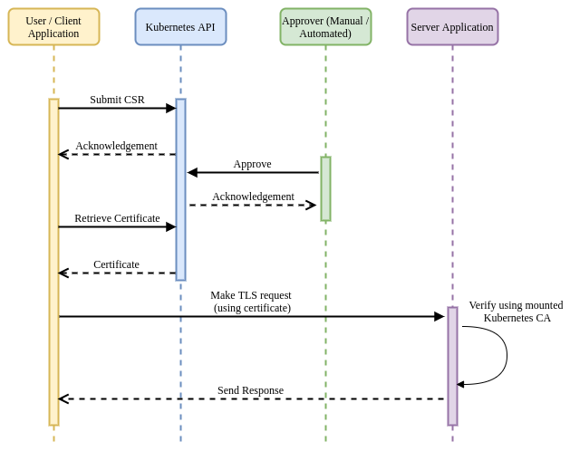

Advantages:

- Tight integration with the platform (Kubernetes).
- Flexible, supports a wide range of [key
  usages](https://godoc.org/k8s.io/api/certificates/v1beta1#KeyUsage) (signing,
  client, server, etc...).
- Provides identity in a well-understood and consumable format (x509).

Disadvantages:

- Requires manual intervention or development of additional tooling to verify
  and approve certificate requests.
- Impossible to revoke certificates in the case of compromise. This could be
  mitigated by using certificates with short TTLs but would require additional
  logic to keep requesting new certs.
- Only works with services running on a single Kubernetes cluster.

### Service Account Tokens (SAT)

{}
Service Accounts are primitives in Kubernetes that provide identity for groups
of pods. Every pod runs under a service account. If a service account is not
pre-created by an administrator and assigned to a pod, they are assigned a
default service account for the namespace they reside in.

Service account tokens are JSON Web Tokens (JWT) that are created as Kubernetes
secrets when a service account is created (including the default service
account). Unless otherwise specified, these tokens are mounted into each pod
running under that service account and can be used to make requests to the
Kubernetes API (and as this section shows, other services).
{}

Kubernetes Service Accounts provide a way of assigning identity to a set of
workloads. Role-Based Access Control (RBAC) rules then can be applied within the
cluster to limit the scope of access for a specific service account. Service
accounts are the way that Kubernetes itself usually authenticates in-cluster
access to the API.

```yaml
apiVersion: v1
kind: ServiceAccount
metadata:
  name: default
  namespace: default
secrets:
  - name: default-token-mf9v2
```

When a service account is created, an associated Secret is also created
containing a unique JWT identifying the account.

```yaml
apiVersion: v1
data:
  ca.crt: LS0tLS1CRUdJTiBDRVJUSUZJQ0FURS0tLS0tCk1JSUN5ekNDQWJPZ0F3SUJBZ0lCQURBTkJna3Foa2lHOXcwQkFRc0ZBREFWTVJNd0VRWURWUVFERXdwcmRXSmwKY201bGRHVnpNQjRYRFRJd01ETXdNVEl4TVRZeU5sb1hEVE13TURJeU56SXhNakV5Tmxvd0ZURVRNQkVHQTFVRQpBeE1LYTNWaVpYSnVaWFJsY3pDQ0FTSXdEUVlKS29aSWh2Y05BUUVCQlFBRGdnRVBBRENDQVFvQ2dnRUJBTmVECnFsSVREbzh5QXNHb3RNbUFENDdKS3pKNXNtbTVPMWkwVFphN3QwOSttT3YrS01zYmdiQ0JQUG1Hc0FCdlU4SEQKbmw3djc0a1YvMXJHRjNUalJ1dzFQN3VWZWN2WisvTThYa1Y2ZFlnRmllTjBEUFdYWGppS1U1RXAwS21Gc28zeAplOFVUdWtFWm1TRWx4QzBtTGxtMW9SRldVUzMrRmE0MWtVakRjRWxENHNVZnVMK1JMSTh3eEZ4NkcvWHR4VzdmCnI4d0pjVFVOTnZuK3B0YjFwYzBVMXdsYU56TDl6eEI4aytIMkFNSDIyY0FyWmNTNlZybS9JZW5ZVEd4QnczSnkKOE8rMk1hOExaRHljQjRYNkNSdThkK3JISDVDdy80K0VMc2pNWnBTTDIwRDBmS2EzOEFGZFl3M0ZuZUcraUgwdQpFazhYdUxhV0NmWjBha1VPZkRNQ0F3RUFBYU1tTUNRd0RnWURWUjBQQVFIL0JBUURBZ0trTUJJR0ExVWRFd0VCCi93UUlNQVlCQWY4Q0FRQXdEUVlKS29aSWh2Y05BUUVMQlFBRGdnRUJBRWZPdjFBVnZCL2d6bTJjdS9zYzhkWGYKNjhOaWV2aW1DMTVaL0k0cUMrdHkzZFJIWTErMndVZlpKT0M4YWwxMEIraVF3ZlRUOUcybitDM0V0NktvcDlmTApNUmVQbFBMK0RDQ1VtUHhjVy9DcENXTE5GQzJNSWZ2OERrS3cvL0RaN0xVZ1dmckIvY3pKUytyMldKLzRZemNZClRKSHZrUTNnV3d0RmlLaGE0SzZ4SjFrSXZyam9yNGFyM0w1TCtqbXlmbzhKRUo5Um1XZUk0S1MzMFFPaTNKYXEKc21wY3dHdG5RSFZNNWZWNFdxcnNRd2lXRDI5eTdCZVJsRWxCYkNvOUYxd0RYa1MvbGNvQUlVNFMzL1IvWmh4aApERHFSUG1tOTVkMnFsaWVjZGZUODFGT1F2aUFndGIxZW9Fa0pqRUpVc3QrcGQ3Qk1wQno2Z2ZDQnRVN0hZWjQ9Ci0tLS0tRU5EIENFUlRJRklDQVRFLS0tLS0K
  namespace: ZGVmYXVsdA==
  token: ZXlKaGJHY2lPaUpTVXpJMU5pSXNJbXRwWkNJNklqRlBXUzFGTkVSRVVtSmFSRlJKWTNWSE5GcGZZV3B6T1hBNUxUTmZUR2RTTXpCV09VTlBkemxQVVUwaWZRLmV5SnBjM01pT2lKcmRXSmxjbTVsZEdWekwzTmxjblpwWTJWaFkyTnZkVzUwSWl3aWEzVmlaWEp1WlhSbGN5NXBieTl6WlhKMmFXTmxZV05qYjNWdWRDOXVZVzFsYzNCaFkyVWlPaUprWldaaGRXeDBJaXdpYTNWaVpYSnVaWFJsY3k1cGJ5OXpaWEoyYVdObFlXTmpiM1Z1ZEM5elpXTnlaWFF1Ym1GdFpTSTZJbVJsWm1GMWJIUXRkRzlyWlc0dGJXWTVkaklpTENKcmRXSmxjbTVsZEdWekxtbHZMM05sY25acFkyVmhZMk52ZFc1MEwzTmxjblpwWTJVdFlXTmpiM1Z1ZEM1dVlXMWxJam9pWkdWbVlYVnNkQ0lzSW10MVltVnlibVYwWlhNdWFXOHZjMlZ5ZG1salpXRmpZMjkxYm5RdmMyVnlkbWxqWlMxaFkyTnZkVzUwTG5WcFpDSTZJalU1WVdWbE5EUTJMV0l6Tm1VdE5ESXdaaTA1T1dWaUxXRTJPRGc1TlRBNE5HTTVPQ0lzSW5OMVlpSTZJbk41YzNSbGJUcHpaWEoyYVdObFlXTmpiM1Z1ZERwa1pXWmhkV3gwT21SbFptRjFiSFFpZlEuUlVqSHNHV3J5djI4Z3hTQ3I3RTczMUlJeUpDcVE1Z1Vfclc4Z1pGdDg4YzdNQVVicmRNYlZBaWN5LW5WTXdWd1JnYVZ1OWMzQTJyRGgxTHVBZkZ3SWlGNklRNzE5QzhNRlY0ZjFIbFI0U1d2Mll6SExJM1RnUmZCWlNxQ3FwZEJMMXg1bmQyc0drSHBvNTYtcGZFdVVJZllfX09KN0lMS09jQkFSVW1hSGlnSWlDRWQ4NURVR3d6eGRjV3BnWUdBOGp5U0hhNkhzLXNwbG9uNjgyS3pVS2hNNTlaaTVxRzlpcHlBN0hMTkpXVEZUSG1SN3NPX0ptWmpfUlV6cVBwZ0FLQ3UtNGZGUEp4NkFwZENsLTRJS01TekhfV0hfbVZfdnozOEVibldyWEFLMnpmSVZmNVlBdm96S0t4STJYaFFjOWlhRmMyRUVqcEdMSGp6TU9vc0ln
kind: Secret
metadata:
  annotations:
    kubernetes.io/service-account.name: default
    kubernetes.io/service-account.uid: 59aee446-b36e-420f-99eb-a68895084c98
  name: default-token-mf9v2
  namespace: default
type: kubernetes.io/service-account-token
```

By default, Pods will automatically get the `default` service account token for
their namespace mounted if they do not specify a specific service account to
use. This can (and should) [be
disabled](https://kubernetes.io/docs/tasks/configure-pod-container/configure-service-account/#use-the-default-service-account-to-access-the-api-server)
to ensure that all service account tokens are explicitly mounted to Pods and
their access scopes are well understood and defined (rather than falling back
and assuming a default).

To specify a service account for a Pod, use the `serviceAccountName` field in the Pod spec:

```yaml
apiVersion: v1
kind: Pod
metadata:
  name: my-pod
spec:
  serviceAccountName: my-pod-sa
# Additional fields removed for brevity
```

This will cause the service account's Secret (containing the token) to be
mounted into the Pod at `/var/run/secrets/kubernetes.io/serviceaccount/`. The
application can retrieve the token and use it in a request to other applications
/ services in the cluster.

The destination application can verify the provided token by calling the
Kubernetes `TokenReview` API:

```shell
curl -X "POST" "https://{kubernetes API IP}:{kubernetes API Port}/apis/authentication.k8s.io/v1/tokenreviews" \
     -H 'Authorization: Bearer {application bearer token}' \
     -H 'Content-Type: application/json; charset=utf-8' \
     -d $'{
  "kind": "TokenReview",
  "apiVersion": "authentication.k8s.io/v1",
  "spec": {
    "token": "{token to verify}"
  }
}'
```

The Kubernetes API will respond with metadata about the token to be verified, in
addition to whether or not it has been authenticated.

```json
{
  "kind": "TokenReview",
  "apiVersion": "authentication.k8s.io/v1",
  "metadata": {
    "creationTimestamp": null
  },
  "spec": {
    "token": "<token to verify>"
  },
  "status": {
    "authenticated": true,
    "user": {
      "username": "system:serviceaccount:default:default",
      "uid": "4afdf4d0-46d2-11e9-8716-005056bf4b40",
      "groups": [
        "system:serviceaccounts",
        "system:serviceaccounts:default",
        "system:authenticated"
      ]
    }
  }
}
```

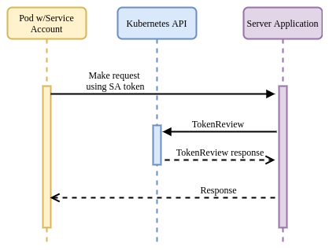

Advantages:

- Tight integration with the platform (Kubernetes).
- Provides identity in a well-understood and consumable format (JWT).
- Invalidated once the service account / Secret is deleted.

Disadvantages:

- Tokens do not have a TTL and not expire (unless the service account / Secret
  is deleted).
- Tokens are scoped to the service account so are not a good unique way of
  identifying either a Pod or a container.
- Additional functionality must be added to applications to be aware of and
  verify Kubernetes tokens.
- Tokens are persisted in the Kubernetes Secrets API and must have access to them
  restricted.
- Only works with services running on a single Kubernetes cluster.

{}
To ensure that permissions can be granted to applications in an appropriately
granular way, unique service accounts should be created for each workload that
requires access to the Kubernetes API server.

Additionally, if a workload _does not_ require access to the Kubernetes API
server, disable the mounting of a service account token by specifying the
`automountServiceAccountToken: false` field on either the `ServiceAccount` or
`Pod` objects. Note that the `Pod` field takes precedence if both are set.
{}

### Projected Service Account Tokens (PSAT)

Beginning with Kubernetes v1.12 there is an additional method of identity
available that builds on the ideas in Service Account Tokens but seeks to
address some of the weaknesses (such as lack of TTL, wide scoping and
persistence).

Note that in order for the PSAT flow to function correctly the API server needs
to be configured with the parameter keys shown below (all are configurable
though).

```yaml
spec:
  containers:
    - command:
        - kube-apiserver
        - --service-account-signing-key-file=/etc/kubernetes/pki/sa.key
        - --service-account-key-file=/etc/kubernetes/pki/sa.pub
        - --service-account-issuer=api
        - --service-account-api-audiences=api
      # Additional flags removed for brevity
      image: k8s.gcr.io/kube-apiserver:v1.17.3
```

The flow for establishing and verifying identity is similar to the SAT method.
However instead of having our Pod / application read the auto-mounted service
account token, you instead mount a projected service account token as a volume.
This also injects a token into the Pod, but you can specify a TTL and custom
audience for the token.

```yaml
apiVersion: v1
kind: Pod
metadata:
  name: test
  labels:
    app: test
spec:
  serviceAccountName: test
  containers:
    - name: test
      image: ubuntu:bionic
      command: ["sh", "-c", "echo Hello Kubernetes! && sleep 3600"]
      volumeMounts:
        - mountPath: /var/run/secrets/tokens
          name: app-token
  volumes:
    - name: app-token
      projected:
        sources:
          - serviceAccountToken:
              audience: api
              expirationSeconds: 600
              path: app-token
```

Note that when using PSAT, a designated service account must be created and
used. PSAT will not work with the namespace default service accounts.

The calling application can read the projected token and use that in requests
within the cluster. Destination applications can verify the token by calling the
`TokenReview` API and passing the received token. With the PSAT method, the
review will also verify that the TTL has not expired, and will return additional
metadata about the presenting application, including specific Pod information.
This provides a tighter scope than regular SATs (which only assert a service
account).

```json
// Additional fields removed for brevity
"extra": {
  "authentication.kubernetes.io/pod-name": ["test"],
  "authentication.kubernetes.io/pod-uid": ["8b9bc1be-c71f-4551-aeb9-2759887cbde0"]
}
```

As shown below, there is no real difference between the SAT and PSAT flows
themselves (aside from the server verifying the audience field), only in the
validity and granularity of the identity asserted by the token.

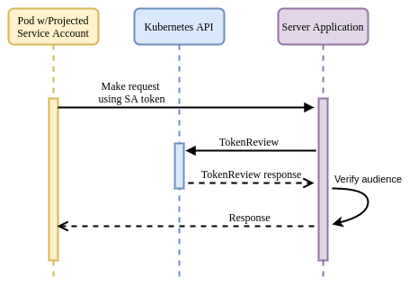

Advantages:

- Tight integration with the platform (Kubernetes).
- Provides identity in a well-understood and consumable format (JWT).
- Invalidated once the service account / Secret is deleted.
- Scoped to individual Pods.
- Configurable TTL.
- Configurable audience.
- Not persisted in the Kubernetes Secrets API.
- Tokens are rotated before expiry automatically by the Kubelet (if using projection).

Disadvantages:

- Additional functionality must be added to applications to be aware of and
  verify Kubernetes tokens.
- Only works with services running on a single Kubernetes cluster.

### Container Network Interface (CNI)

Some CNI solutions provide a degree of identity based on a combination of
network primitives and metadata they have access to via the Kubernetes API, in
addition to combining with other tooling. Deep dives into these CNI technologies
are out of scope for this guide and we will only be covering their capabilities
as they relate to identity.

#### Calico

[Calico](https://www.projectcalico.org/) provides network policy enforcement at
layers 3 & 4, enabling users to restrict communication between Pods based on
their namespace and other metadata (labels for example). This enforcement is all
enabled by modifying the network configuration `iptables` / `ipvs`) to allow /
disallow IP addresses.

Calico also supports making policy decisions based on service accounts using a
component called Dikastes when used in combination with [Envoy
proxy](https://www.envoyproxy.io/) (either standalone or part of a service mesh
like [Istio](https://istio.io/)). This approach enables enforcement at layer 7,
based on attributes of the application protocol (headers etc...) and relevant
cryptographic identities (certificates, etc...).

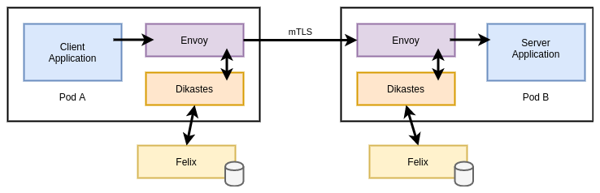

By default, Istio (Envoy) will only perform mTLS and ensure that workloads
present certificates signed by the Istio CA (Citadel). Dikastes runs as a
sidecar alongside Envoy as a plugin. Envoy verifies the CA before consulting
Dikastes for a decision on whether to admit or reject the request. Dikastes
makes this decision based on user-defined Calico `NetworkPolicy` or
`GlobalNetworkPolicy` objects.

```yaml
apiVersion: projectcalico.org/v3
kind: GlobalNetworkPolicy
metadata:
  name: summary
spec:
  selector: app == 'summary'
  ingress:
    - action: Allow
      source:
        serviceAccounts:
          names: ["customer"]
        namespaceSelector: app == 'bank'
  egress:
    - action: Allow
```

The above rule is specifying that the policy be applied to any Pods with the
label `app: summary` and restrict access to Pods calling from the `customer`
service account (in namespaces with the label `app: bank`). This works because
the Calico control-plane (the Felix node agent) computes rules by reconciling
Pods that are running under a specific service account with their IP addresses
and subsequently syncing this information to Dikastes via a Unix socket.

This out-of-band verification is important as it mitigates a potential attack
vector in an Istio environment. Istio stores each service account's PKI assets
in a Secret in the cluster. Without this additional verification, an attacker
who was able to steal that Secret would be able to masquerade as the asserted
service account (by presenting those PKI assets), even though it may not be
running as that account.

Advantages:

- If platforms are already leveraging Calico (either as CNI or only for network
  policy), Dikastes provides an extra layer of defense in depth.
- Easy-to-understand syntax / user experience and format (CRDs).
- Calico and Istio are cross-platform so can be used across Kubernetes and
  non-Kubernetes environments.

Disadvantages:

- Requires platforms to already be using a mesh or proxy solution, this often
  comes with additional complexity overhead.
- Adds additional latency into the data plane (Dikastes is consulted on every request).
- Identity claims are not independently cryptographically verifiable, relying
  on the mesh to be present with every connected service.

#### Cilium

Like Calico, [Cilium](https://docs.cilium.io/) also provides network policy
enforcement at layers 3 & 4, enabling users to restrict communication between
Pods based on their namespace and other metadata (labels for example). Cilium
also supports (without additional tooling) the ability to apply policy at layer
7 and restrict access to services via service accounts.

Unlike Calico, enforcement in Cilium is not based on IP address (and updating
node networking configurations). Instead, Cilium calculates identities for each
unique Pod / endpoint (based on a number of selectors) and encodes these
identities into each packet. It then enforces whether packets should be allowed
based on these identities using [BPF](https://lwn.net/Articles/747551/) kernel
hooks at various points in the datapath.

The example below shows the output of listing Cilium endpoints (Pods). The
`deathstar-657477f57d-zzz65` has one additional label from the other Pods in the
Deployment, and is assigned a different identity. All Pods in the Deployment
share a namespace, service account and several arbitrary Kubernetes labels.

```shell
NAMESPACE     NAME                              ENDPOINT ID   IDENTITY ID   INGRESS ENFORCEMENT
default       deathstar-657477f57d-jpzgb        1474          1597          true
default       deathstar-657477f57d-knxrl        2151          1597          true
default       deathstar-657477f57d-xw2tr        16            1597          true
default       deathstar-657477f57d-xz2kk        2237          1597          true
default       deathstar-657477f57d-zzz65        1             57962         true
```

After removing the divergent label, the `deathstar-657477f57d-zzz65` Pod is
re-assigned the same identity as its peers.

Cilium implements the Kubernetes-native `NetworkPolicy` API, but like Calico
also exposes more fully-featured capabilities in the form of
`CiliumNetworkPolicy` and `CiliumClusterwideNetworkPolicy` objects.

```yaml
apiVersion: "cilium.io/v2"
kind: CiliumNetworkPolicy
metadata:
  name: "k8s-svc-account"
spec:
  endpointSelector:
    matchLabels:
      io.cilium.k8s.policy.serviceaccount: leia
  ingress:
    - fromEndpoints:
        - matchLabels:
            io.cilium.k8s.policy.serviceaccount: luke
      toPorts:
        - ports:
            - port: "80"
              protocol: TCP
          rules:
            http:
              - method: GET
                path: "/public$"
```

In the example above, we are using special `io.cilium.k8s.policy.*` label
selectors to target specific service accounts in the cluster. Cilium then uses
its registry of identities to restrict / allow access as necessary.

Advantages:

- Cilium is cross-platform so can be used across Kubernetes and
  non-Kubernetes environments.
- No additional solutions besides Cilium are required.
- Increases the complexity of the network stack (for troubleshooting /
  debugging, etc...).

Disadvantages:

- Identity claims are not independently cryptographically verifiable, relying
  on Cilium to be present with every connected service.

## AWS Platform Identity Methods / Tooling

Note that many cloud vendors expose functionality described in this section.
This guide focuses on Amazon Web Services (AWS) because they are most commonly
seen in the field and their offerings are the most mature.

AWS provides a strong identity solution at the node level via the EC2 metadata
API. This is an example of a platform mediated system, whereby the platform
(AWS) is able to determine the identity of a calling entity based on a number of
intrinsic properties without the entity asserting any credentials / identity
claim itself. The platform can then deliver secure credentials to the instance
(in the form of a role, for example) that allows it to access any services
defined by the relevant policies.

This model underpins how AWS (and many other vendors) provide secure access to
their own cloud services. However with the rise of containers and other
multi-tenant application models, this per-node identity / authentication system
breaks down and requires additional tooling and alternative approaches.

### Kube2IAM

{}
Kube2IAM requires that every node in the cluster be able to assume a superset of
all the roles that Pods may require. This security model means that the scope of
access provided should a break out occur is potentially huge. For this reason
it is strongly advised not to use Kube2IAM.
{}

[Kube2IAM](https://github.com/jtblin/kube2iam) is an open source (OSS) tool that
acts as a proxy between running workloads and the AWS EC2 metadata API. The
architecture is shown below:

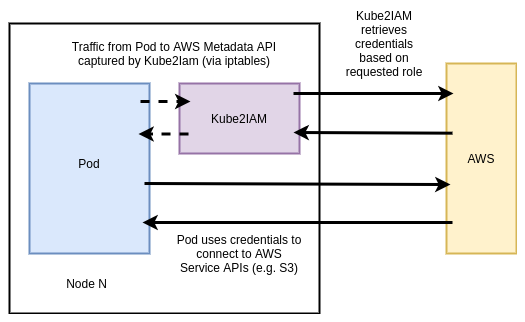

Kube2IAM Pods run on every node via a DaemonSet. Each Pod injects an iptables
rule to capture outbound traffic to the metadata API and redirect it to the
running instance of Kube2IAM on that node.

Pods that want to interact with AWS APIs should specify the role they want to
assume as an annotation in the spec:

```yaml
apiVersion: apps/v1
kind: Deployment
metadata:
  name: nginx-deployment
spec:
  replicas: 3
  template:
    metadata:
      annotations:
        iam.amazonaws.com/role: <role-arn>
      labels:
        app: nginx
    spec:
      containers:
        - name: nginx
          image: nginx:1.9.1
          ports:
            - containerPort: 80
```

### KIAM

{}
While safer than Kube2IAM, KIAM also introduces a potentially serious security
flaw. This section describes a mitigation of the flaw, however you should still
use caution and understand the attack vector when using KIAM.
{}

Like Kube2IAM, [KIAM](https://github.com/uswitch/kiam) is an open source (OSS)
tool that acts as a proxy to the AWS EC2 metadata API, although it's
architecture (and as a result, security model) are different / slightly
improved.

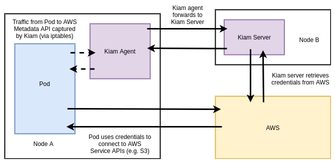

KIAM has both server and agent components. The agents run as a DaemonSet on
every node in the cluster. The server component can (and should) be restricted
to the either the control-plane nodes or a subset of cluster nodes. Agents
capture EC2 metadata API requests and forward them to the server components to
complete the appropriate authentication with AWS. Only the server nodes require
access to assume AWS IAM (Identity and Access Management) roles (again, a
superset of all roles that Pods may require).

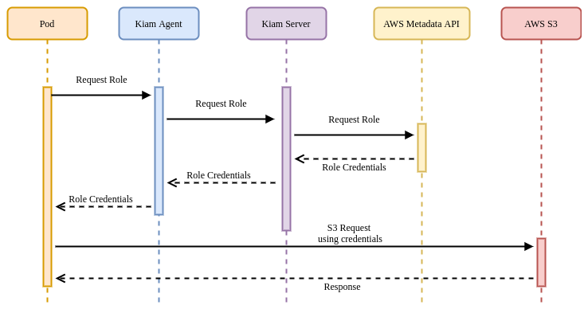

In this model, there should be controls in place to ensure that no workloads are
able to run on the server nodes (and thereby obtain unfettered AWS API access).
Assumption of roles is achieved (like Kube2IAM) by annotating Pods with the
desired role:

```yaml
apiVersion: apps/v1
kind: Deployment
metadata:
  name: nginx-deployment
spec:
  replicas: 3
  template:
    metadata:
      annotations:
        iam.amazonaws.com/role: <role-arn>
      labels:
        app: nginx
    spec:
      containers:
        - name: nginx
          image: nginx:1.9.1
          ports:
            - containerPort: 80
```

While the security model is better than Kube2IAM, KIAM still has a potential
attack vector whereby if a user is able to directly schedule a Pod onto a node
(by populating it's `nodeName` field, bypassing the Kubernetes scheduler and any
potential guards) they would have unrestricted access to the EC2 metadata API.

The mitigation for this issue is to run a mutating or validating admission
webhook that ensures the `nodeName` field is always populated on Pod create &
update requests to the Kubernetes API.

KIAM provides a strong story for enabling individual Pods to access AWS APIs,
using a model that existing AWS users will be familiar with (role assumption).
This is a viable solution in many cases, provided the mitigation above is put in
place prior to use.

### IAM Roles for Service Accounts (IRSA)

{}
Although the setup for IRSA is a little clunky, it possesses the best security
model of all approaches to Pod IAM Role assumption.
{}

Since late 2019, AWS has provided a native integration between Kubernetes and
IAM called
[IAM Roles for Service Accounts](https://aws.amazon.com/blogs/opensource/introducing-fine-grained-iam-roles-service-accounts/)
(IRSA).

At a high level, IRSA exposes a similar experience to KIAM and Kube2IAM, in
that users can annotate their Pods with an AWS IAM role they want it to assume.
The implementation is very different though, eliminating the security concerns
of the earlier approaches.

AWS IAM supports federating identity out to a third-party OIDC provider, in this
case the Kubernetes API server. As you saw already with PSATs, Kubernetes is
capable of creating and signing short-lived tokens on a per-Pod basis.

AWS IRSA combines these features with an additional credential provider in their
SDKs that calls `sts:AssumeRoleWithWebIdentity`, passing the PSAT. The PSAT and
desired role need to be injected as environment variables within the Pod (there
is a webhook that will do this automatically based on the `serviceAccountName`
if desired).

```yaml
apiVersion: apps/v1
kind: Pod
metadata:
  name: myapp
spec:
  serviceAccountName: my-serviceaccount
  containers:
  - name: myapp
    image: myapp:1.2
    env:
    - name: AWS_ROLE_ARN
      value: arn:aws:iam::123456789012:role/eksctl-irptest-addon-iamsa-default-my-serviceaccount-Role1-UCGG6NDYZ3UE
    - name: AWS_WEB_IDENTITY_TOKEN_FILE
      value: /var/run/secrets/eks.amazonaws.com/serviceaccount/token
    volumeMounts:
    - mountPath: /var/run/secrets/eks.amazonaws.com/serviceaccount
        name: aws-iam-token
        readOnly: true
  volumes:
  - name: aws-iam-token
    projected:
      defaultMode: 420
      sources:
      - serviceAccountToken:
          audience: sts.amazonaws.com
          expirationSeconds: 86400
          path: token
```

Kubernetes does not natively expose a `.well-known` OIDC endpoint, so there is
some additional work required to configure this at a public location (static S3
bucket) so that AWS IAM can verify the token using Kubernetes' public service
account signing key.

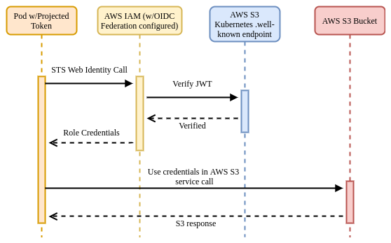

Once verified, AWS IAM responds to the application's request, exchanging the
PSAT for the desired IAM role credentials.

Advantages:

- Tight integration with AWS using familiar primitives for those customers
  already invested in the platform.
- Easy-to-understand mapping model between service accounts and roles.
- Webhook makes consumption straightforward once everything else is configured.
- Strong security model.

Disadvantages:

- Complex to configure if not using EKS.

_*IRSA is the recommended approach for providing AWS access to applications
running on Kubernetes.*_

## SPIFFE / SPIRE

Secure Production Identity Framework for Everyone (SPIFFE) is a standard that
specifies a syntax for identity (SPIFFE Verifiable Identity Document, SVID) that
can leverage existing cryptographic formats such as x509 and JWT. It also
specifies a number of APIs for providing and consuming these identities.

Example SPIFFE ID format: `spiffe://trust-domain/hierarchical/workload`

SPIRE (SPIFFE Runtime Environment) is the reference implementation of SPIFFE and
has a number of SDKs and integrations to allow applications to make use of (both
providing, and consuming) SVIDs.

This section will assume use of SPIFFE & SPIRE together unless otherwise noted.

### Architecture & Concepts

SPIRE runs a server component that acts a signing authority for identities, and
maintains a registry of all workload identities and the conditions required for
an identity document to be issued.

SPIRE agents run on every node as a DaemonSet where they expose an API for
workloads to request identity via a Unix socket. The agent is also configured
with read-only access to the Kubelet to determine metadata about Pods on the Node.

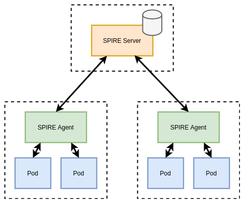

When agents come online they verify and register themselves to the server by a
process called _node attestation_. This process utilizes environmental context
(for example the AWS EC2 metadata API or Kubernetes PSATs) to identify a node
and assign it a SPIFFE ID. The server then issues the node an identity in the
form of a x509 SVID. Shown below is an example registration for a node:

```shell
/opt/spire/bin/spire-server entry create \
  -spiffeID spiffe://cnr-trust-domain/nodes \
  -selector k8s_psat:cluster:cnr-cluster \
  -selector k8s_psat:agent_ns:spire \
  -selector k8s_psat:agent_sa:spire-agent \
  -node
```

The above tells the SPIRE server to assign the SPIFFE ID
`spiffe://cnr-trust-domain/nodes` to any node where the agent Pod satisfies the
selectors specified. In this case, that the Pod is running under a specific
cluster, namespace, and service account (verified via the PSAT).

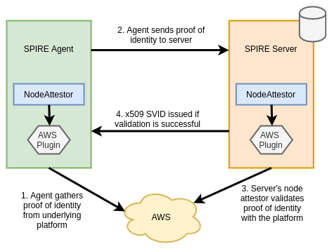

When workloads come online they call the node-local workload API to request an
SVID. The SPIRE agent uses information available to it on the platform (from the
kernel, Kubelet, etc...) to determine the properties of the calling workload.
This process is referred to as _workload attestation_. The SPIRE server then
matches the properties against known workload identities based on their
selectors and returns an SVID to the workload (via the agent) that can be used
for authentication against other systems.

```shell
/opt/spire/bin/spire-server entry create \
  -spiffeID spiffe://cnr-trust-domain/service-a \
  -parentID spiffe://cnr-trust-domain/nodes \
  -selector k8s:ns:default \
  -selector k8s:sa:service-a \
  -selector k8s:pod-label:app:frontend \
  -selector k8s:container-image:docker.io/johnharris85/service-a:v0.0.1
```

The above tells the SPIRE server to assign the SPIFFE ID
`spiffe://cnr-trust-domain/service-a` to any workload that:

- Is running on a node with ID `spiffe://cnr-trust-domain/nodes`.
- Is running in the `default` namespace.
- Is running under the `service-a` service account.
- Has the Pod label `app: frontend`.
- Was built using the `docker.io/johnharris85/service-a:v0.0.1` image.

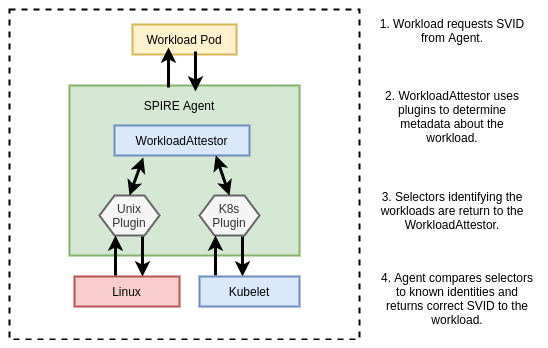

Note that the kubelet uses the `TokenReview` API to validate bearer tokens. This
requires reachability to the Kubernetes API server. Therefore API server
downtime can interrupt workload attestation. The
`--authentication-token-webhook-cache-ttl` kubelet flag controls how long the
kubelet caches TokenReview responses and may help to mitigate this issue. A
large cache TTL value is not recommended however, as that can impact permission
revocation.

Advantages:

- Leverages well understood and widely supported cryptographic standards (x509 &
  JWT).
- Cross-platform supporting both Kubernetes and non-Kubernetes workloads.
- Can leverage an upstream CA if required.
- All certificates can be provided in-memory to mitigate compromised disk
  access.
- Supports many application integration points (see below).
- Supports more granular property selectors than other identity providers.
- CNCF project.
- Supports federation between clusters.
- Regular rotation of secrets.

Disadvantages:

- Doesn't support separate certificate authorities for client and server.
- Is another component to maintain in an environment.
- Nodes and workloads identities need to be registered. This is manual out of
  the box (but could be automated).
- Requires a backing datastore to persist identity data (sqlite by default),
  raising the complexity of maintaining the solution.

### Integration Points

SPIFFE / SPIRE have a number of integration points with workload applications.
Which integration point is appropriate will depend on the desired level of
coupling to the platform and the amount of control users have over the environment.

#### Direct Application Access

{}
Direct integration is not a recommended approach (unless building intermediate tooling) for
the following reasons:

- Tightly couples the application with the platform / implementation.
- Requires mounting the SPIRE agent Unix socket into the Pod.
- Not easily extensible.
  {}

SPIRE provides SDKs for Go, C and Java for applications to directly integrate
with the SPIFFE workload API. These wrap existing HTTP libraries but provide
native support for obtaining and verifying identities. Below is an example in Go
calling a Kubernetes service `service-b` and expecting a specific SPIFFE ID to
be presented (through a x509 SVID).

```go
err := os.Setenv("SPIFFE_ENDPOINT_SOCKET", "unix:///run/spire/sockets/agent.sock")
conn, err := spiffe.DialTLS(ctx, "tcp", "service-b", spiffe.ExpectPeer("spiffe://cnr-trust-domain/service-b"))
if err != nil {
  log.Fatalf("Unable to create TLS connection: %v", err)
}
```

The SPIRE agent also exposes a [gRPC](https://grpc.io/about/) API for those
users who want a tighter integration with the platform but are working in a
language without SDK availability.

#### Sidecar Proxy

SPIRE natively supports the Envoy SDS API for publishing certificates to be
consumed by an Envoy proxy. Envoy can then use the SVID x509 certificate to
establish TLS connections with other services, and use the trust bundle to
verify incoming connections.

Envoy also supports verifying that only specific SPIFFE IDs (encoded into the
SVID) should be able to connect. There are two methods to implement this
verification:

1. By specifying a list of `verify_subject_alt_name` values in the Envoy configuration.
2. By utilizing Envoy's External Authorization API to delegate admission
   decisions an external system (for example, OPA). Below is an example of a
   Rego policy to achieve this:

```rego
package envoy.authz

import input.attributes.request.http as http_request
import input.attributes.source.address as source_address

default allow = false

allow {
    http_request.path == "/api"
    http_request.method == "GET"
    svc_spiffe_id == "spiffe://cnr-trust-domain/frontend"
}

svc_spiffe_id = client_id {
    [_, _, uri_type_san] := split(http_request.headers["x-forwarded-client-cert"], ";")
    [_, client_id] := split(uri_type_san, "=")
}
```

In the above example, Envoy verifies the request's TLS certificate against the
SPIRE trust bundle then delegates authorization to OPA. The Rego policy inspects
the SVID and allows the request if the SPIFFE ID matches
`spiffe://cnr-trust-domain/frontend`.

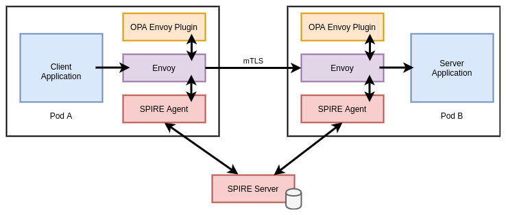

#### Service Mesh

Istio's CA creates SVIDs for all service accounts, encoding a SPIFFE ID in the
format `spiffe://cluster.local/ns/<namespace>/sa/<service_account>`. Therefore
services in an Istio mesh can leverage SPIFFE aware endpoints.

Note that while service meshes are out of scope for this guide, many attempt to
address the issue of identity and authentication. Most of these attempts include
or build on the methods and tooling detailed in this guide.

#### Other

In addition to the primary methods above, SPIRE also supports the following:

- Pulling SVIDs and trust bundles directly to a filesystem, enabling
  applications to detect changes and reload. While this enables applications to
  be somewhat agnostic to SPIRE, it also opens an attack vector for
  certificates to be stolen from the filesystem.
- Nginx module that allows for certificates to be streamed from SPIRE (similar
  to the Envoy integration described above). There are custom modules for Nginx
  that enable users to specify the SPIFFE IDs that should be allowed to connect
  to the server.

### Integration with Secrets Store (Vault)

SPIRE can be used to solve the secure introduction problem when an application
needs to obtain some shared secret material from [HashiCorp
Vault](https://www.vaultproject.io/). Vault can be configured to authenticate
clients using OIDC federation with the SPIRE server as an OIDC provider.

Roles in Vault can be bound to specific subjects (SPIFFE IDs) so that when a
workload requests a JWT SVID from SPIRE, that is valid to obtain a role and
therefore accessor credentials to Vault.

### Integration with AWS

SPIRE can also be used to establish identity and authenticate to AWS services.
This process utilizes the same OIDC federation idea in the AWS IRSA and Vault
sections above. Workloads request JWT SVIDs that are then verified by AWS by
validating against the federated OIDC provider (SPIRE server). The downside of
this approach is that SPIRE must be publicly accessible for AWS to discover the
JSON Web Key Set (JWKS) material required to validate the JWTs.