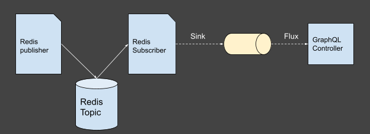

Customers expect modern web applications to provide a seamless, dynamic, and intuitive user experience. Users are no longer willing to wait for a few seconds to get an update. As a result, digital products are seeing a high demand for real-time data updates. Reactive programming addresses this need by handling asynchronous non-blocking exchanges between the client and server. Libraries like Project Reactor and Reactive Extensions (also known as _ReactiveX_) have been developed to create effective reactive systems. [Project Reactor](https://projectreactor.io/), built and supported by VMware, is designed to implement reactive programming for Java- and Kotlin-based applications. It directly integrates the robust Spring Boot framework and valuable features like “back-pressure.”

This article provides the design and implementation to integrate Reactor with a GraphQL subscription and Redis topic.

## Overview

Let’s start with an example application that will create a GraphQL subscription provider that can listen to updates in the Reactor flux and send those updates to the client. For the application to be deployed to a distributed environment, the GraphQL subscriptions need to be backed up by a fanout/pub-sub model. The Redis topic’s publisher-subscriber concept is used to maintain a stateless model in the multi-instance deployment scenario. 

The resulting design looks like this:



The publisher emits numbers at a scheduled interval, and these updates are made available to the GraphQL subscription consumer. The code is written in the Kotlin language and built using the Spring Boot framework and initialized with Spring Initializr. 

The first step is to include the dependencies and configuration needed to bring this pattern together. 

## Dependencies and configuration

The additional dependencies for Redis topics, GraphQL subscriptions, and Project Reactor are listed below. These have to be included along with the ones for Spring Boot. 

```java
dependencies {
	implementation("org.springframework.boot:spring-boot-starter-data-redis")
	implementation("org.jetbrains.kotlinx:kotlinx-coroutines-reactor")
	implementation("com.graphql-java-kickstart:graphql-spring-boot-starter:7.0.1")
}
```
Once the dependencies are added, the next step is to set up the reactive sink and flux configuration. The sink and flux are created as beans that will be injected into the subscriber and the GraphQL controller.

```java
@Configuration
class SubscriptionConfig {

	@Bean
	fun valueSink(): Sinks.Many<String> {
		return Sinks.many().multicast().onBackpressureBuffer(20)
	}

	@Bean
	fun valueFlux(): Flux<String> {
		return valueSink().asFlux()
	}
}
```

Subsequent configuration is for Redis topic publishers and subscribers. The publisher will use the Redis template to put the messages in the topic queue and the subscriber class is passed to the `listenerAdapter` bean.

```java
@Bean
	fun redisCustomTemplate( 
redisConnectionFactory: RedisConnectionFactory
):RedisTemplate<String, Int> {
		val redisTemplate =  RedisTemplate<String, Int>()
		redisTemplate.setConnectionFactory(redisConnectionFactory)
		return redisTemplate
	}


@Bean
	fun listenerAdapter(redisSubscriber: RedisSubscriber): MessageListenerAdapter {
		val messageListenerAdapter = MessageListenerAdapter(redisSubscriber)
		return messageListenerAdapter
	}
```

## Redis publisher and subscriber with reactive programming

Now that the Redis template configuration is completed, we will create the publisher. In this case, the publisher is simply scheduled to publish the numbers incremented by 5 to a Redis topic named “my-topic” every 5 seconds.

```java
@Service
class PublisherService(val redisCustomTemplate: RedisTemplate<String, String>) 
{

    private val topic: String = "my-topic"
    private val counter: AtomicInteger = AtomicInteger()

    @Scheduled(fixedRate = 5000)
    fun publish() {
        redisCustomTemplate.convertAndSend(topic, "${counter.addAndGet(5)}")
    }
}
```

Next, we incorporate Redis subscriber listening to the messages in the topic. The subscriber utilizes reactive programming to emit the same message in the sink for the GraphQL controller to consume. 

```java
@Service
class RedisSubscriber(val valueSink: Many<String>) {
        fun handleMessage(value: String) {
            valueSink.tryEmitNext(value)
        }
}
```

The final piece of the puzzle is the GraphQL subscription; we will create the GraphQL controller and link it with the `valueFlux` bean to receive the messages published by the Redis publisher and emitted in the sink by the Redis subscriber.

The GraphQL schema file has a type declared for the subscription, that outputs string values.

```java
type Subscription {
    topicReads: String
}
```

The subscription resolver uses the `valueFlux` bean to output messages emitted by the Redis subscriber, to the client.

```java
class GraphQlController(val valueFlux: Flux<String>) : GraphQLSubscriptionResolver {

    fun topicReads(): Publisher<String> {
        return valueFlux.map { "The counter now sits at $it" }
    }
}
```

If the server has started on port 8080, then the GraphQL subscription can be run locally on [`http://localhost:8080/graphql`](http://localhost:8080/graphql) by providing the following body:

```java
subscription topicReads {
   topicReads
}
```

Once all the components have been wired successfully, then the output should look like this:

```java
data: {"data":{"topicReads":"The counter now sits at 5"}}

data: {"data":{"topicReads":"The counter now sits at 10"}}

data: {"data":{"topicReads":"The counter now sits at 15"}}

data: {"data":{"topicReads":"The counter now sits at 20"}}

data: {"data":{"topicReads":"The counter now sits at 25"}}

data: {"data":{"topicReads":"The counter now sits at 30"}}

**...**
```

## Testing the setup

Finally, we can test out the entire integration as a Spring Boot test. In this example, to facilitate the testing of GraphQL subscriptions, we will use the `GraphQLTestSubscription` from the GraphQL `kickstart` library. This enables us to start and wait for the subscription outputs and then stop the subscription. 

To begin, we should set up the `GraphQLTestSubscription` by auto-wiring the environment and object mapper.

```java
@SpringBootTest(webEnvironment = SpringBootTest.WebEnvironment.RANDOM_PORT)
class TopicReadSubscriptionTest {
    

   private lateinit var graphQLTestSubscription: GraphQLTestSubscription
    
   @Autowired
    protected lateinit var environment: Environment
    
    @Autowired
    protected lateinit var objectMapper: ObjectMapper
    
   @BeforeEach
    fun setUp() {
        graphQLTestSubscription = GraphQLTestSubscription(environment, objectMapper, "subscriptions")
    }

    @AfterEach
    fun tearDown() {
        graphQLTestSubscription.reset()
    }
```


To write the test, we will start the subscription, pass it the path of the test subscription schema, and wait for 6 seconds, so we will have exactly two outputs from the subscription (the publisher is scheduled to publish every 5 seconds).

Lastly, we will assert that response data contains the expected output from the controller and we have received exactly two of these outputs.

```java
@Test
    fun `can receive incremental numbers ` () {
        val graphQLResponses: List<GraphQLResponse> =  graphQLTestSubscription
            .start("subscription.graphql")
            .awaitAndGetAllResponses(Duration.ofSeconds(6));

        assertThat(graphQLResponses)
            .extracting( {response: GraphQLResponse ->
                response.get(
                    "$.data.topicReads",
                    String::class.java
                )
            })
            .containsExactly(tuple("The counter now sits at 5"), tuple("The counter now sits at 10"))
        assertThat(graphQLTestSubscription.isStopped)
    }
```

## Conclusion

To conclude, using the above steps, we can combine the concepts of GraphQL subscriptions, Project Reactor, and Redis topics into one microservice. The client consuming the GraphQL subscription endpoint will get updates as they will become available in the Redis topic. We hope this article provides you with a starting point to understand and implement reactive programming with various technologies as needed.
