[Prometheus](https://prometheus.io/), coupled with
[Grafana](https://grafana.com/), is a popular monitoring solution for Kubernetes
clusters. It allows SRE teams and developers to capture metrics and telemetry
data for applications running in a cluster, allowing deeper insights into
application performance and reliability.

The Prometheus/Grafana combination works well for individual clusters, but as
teams scale out and start working with multiple clusters, monitoring
requirements become correspondingly more complex. For effective multi-cluster
monitoring, a "single pane of glass" with centralized real-time monitoring, time
series comparisons across and within clusters and high availability is essential
for teams operating with multiple clusters and multiple providers.

[Thanos](https://thanos.io/) is a monitoring system that aggregates data from
multiple Prometheus deployments. This data can then be inspected and analyzed
using Grafana, just as with regular Prometheus metrics. Although this setup
sounds complex, it's actually very easy to achieve with the following Bitnami
Helm charts:

* [Bitnami's Prometheus Operator Helm chart](https://github.com/bitnami/charts/tree/master/bitnami/prometheus-operator)
  lets you deploy Prometheus in your Kubernetes cluster with an additional
  Thanos sidecar container.
* [Bitnami's Thanos Helm chart](https://github.com/bitnami/charts/tree/master/bitnami/thanos)
  lets you deploy all the Thanos components together with MinIO and Alertmanager
  so you can quickly bootstrap a Thanos deployment.
* [Bitnami's Grafana Helm chart](https://github.com/bitnami/charts/tree/master/bitnami/grafana)
  lets you deploy Grafana in your Kubernetes cluster.

This guide walks you through the process of using these charts to create a
Thanos deployment that aggregates data from Prometheus Operators in multiple
clusters and allows further monitoring and analysis using Grafana.

## Assumptions and prerequisites

* You have three separate multi-node Kubernetes clusters running on the same
  cloud provider:

  * Two "data producer" clusters which will host Prometheus deployments and
    applications that expose metrics via Prometheus.
  * One "data aggregator" cluster which will host Thanos and aggregate the data
    from the data producers. This cluster will also host Grafana for data
    visualization and reporting.

* You have the *kubectl* CLI and the Helm v3.x package manager installed and configured to work with your Kubernetes clusters. [Learn how to install *kubectl* and Helm v3.x](https://docs.bitnami.com/kubernetes/get-started-kubernetes#step-3-install-kubectl-command-line).

This guide uses clusters hosted on the Google Kubernetes Engine (GKE) service
but you can use any Kubernetes provider. Learn about
[deploying a Kubernetes cluster on different cloud platforms](https://docs.bitnami.com/kubernetes/).

## Step 1: Install the Prometheus Operator on each cluster

[Bitnami's Prometheus Operator chart](https://github.com/bitnami/charts/tree/master/bitnami/prometheus-operator)
provides easy monitoring definitions for Kubernetes services and management of
Prometheus instances. It also includes an optional Thanos sidecar container,
which can be used by your Thanos deployment to access cluster metrics.

Only one instance of the Prometheus Operator component should be running in a
cluster.

* Add the Bitnami charts repository to Helm:

  ```bash
  helm repo add bitnami https://charts.bitnami.com/bitnami
  ```

* Install the Prometheus Operator in the first "data producer" cluster using the command below:

  ```bash
  helm install prometheus-operator \
    --set prometheus.thanos.create=true \
    --set operator.service.type=ClusterIP \
    --set prometheus.service.type=ClusterIP \
    --set alertmanager.service.type=ClusterIP \
    --set prometheus.thanos.service.type=LoadBalancer \
    --set prometheus.externalLabels.cluster="data-producer-0" \
    bitnami/prometheus-operator
  ```
  
  The *prometheus.thanos.create* parameter creates a Thanos sidecar container,
  while the *prometheus.thanos.service.type* parameter makes the sidecar service
  available at a public load balancer IP address. Note the
  *prometheus.externalLabels* parameter which lets you define one or more unique
  labels per Prometheus instance - these labels are useful to differentiate
  different stores or data sources in Thanos.
    
  The command above exposes the Thanos sidecar container in each cluster at a
  public IP address using a *LoadBalancer* service. This makes it easy for
  Thanos to access Prometheus metrics in different clusters without needing any
  special firewall or routing configuration. However, this approach is highly
  insecure and should be used only for demonstration or testing purposes. In
  production environments, it is preferable to deploy an NGINX Ingress
  Controller to control access from outside the cluster and further limit access
  using whitelisting and other security-related configuration.

* Use the command below to obtain the public IP address of the sidecar service.
  You will use this IP address in the next step.

  ```
  kubectl get svc | grep prometheus-operator-prometheus-thanos
  ```

Repeat the steps shown above for the second "data producer" cluster. Use a
different value for the *prometheus.externalLabels.cluster* parameter, such as
*data-producer-1*.

## Step 2: Install and configure Thanos

The next step is to install Thanos in the "data aggregator" cluster and
integrate it with Alertmanager and MinIO as the object store.

* Modify your Kubernetes context to reflect the cluster on which you wish to install Thanos.

* Create a *values.yaml* file as shown below. Replace the KEY placeholder with a
  hard-to-guess value and the SIDECAR-SERVICE-IP-ADDRESS-X placeholders with the
  public IP addresses of the Thanos sidecar containers in the "data producer"
  clusters.

  ```yaml
  objstoreConfig: |-
    type: s3
    config:
      bucket: thanos
      endpoint: {{ include "thanos.minio.fullname" . }}.monitoring.svc.cluster.local:9000
      access_key: minio
      secret_key: KEY
      insecure: true
  querier:
    stores:
      - SIDECAR-SERVICE-IP-ADDRESS-1:10901
      - SIDECAR-SERVICE-IP-ADDRESS-2:10901
  bucketweb:
    enabled: true
  compactor:
    enabled: true
  storegateway:
    enabled: true
  ruler:
    enabled: true
    alertmanagers:
      - http://prometheus-operator-alertmanager.monitoring.svc.cluster.local:9093
    config: |-
      groups:
        - name: "metamonitoring"
          rules:
            - alert: "PrometheusDown"
              expr: absent(up{prometheus="monitoring/prometheus-operator"})
  minio:
    enabled: true
    accessKey:
      password: "minio"
    secretKey:
      password: "KEY"
    defaultBuckets: "thanos"
  ```
 
* Install Thanos using the command below:

  ```bash
  helm install thanos bitnami/thanos \
    --values values.yaml
  ```
 
* Wait for the deployment to complete and note the DNS name and port number for
  the Thanos Querier service in the deployment output, as shown below:

  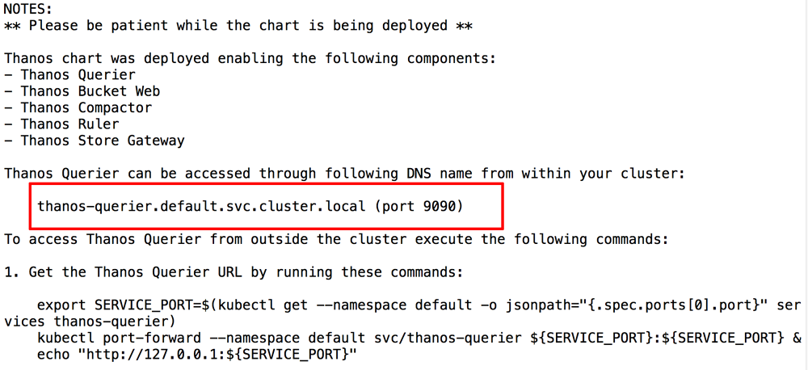

* Follow the instructions shown in the chart output to connect to the Thanos
  Querier Web interface and navigate to the "Stores" tab. Confirm that both
  sidecar services are running and registered with Thanos, as shown below:

  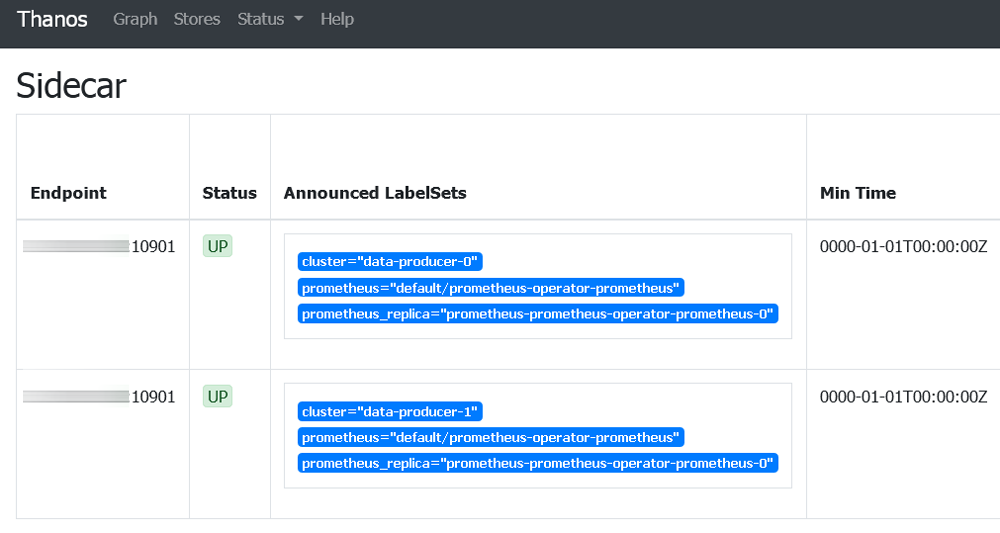

  Confirm also that each service displays a unique *cluster* labelset, as configured in [Step 1](#step-1-install-the-prometheus-operator-on-each-cluster).

## Step 3: Install Grafana

The next step is to install Grafana, also on the same "data aggregator" cluster
as Thanos.

* Use the command below, replacing GRAFANA-PASSWORD with a password for the
  Grafana application:

  ```bash
  helm install grafana bitnami/grafana \
    --set service.type=LoadBalancer \
    --set admin.password=GRAFANA-PASSWORD
  ```
  
* Wait for the deployment to complete and obtain the public IP address for the
  Grafana load balancer service:

  ```bash
  kubectl get svc | grep grafana
  ```

* Confirm that you are able to access Grafana by browsing to the load balancer
  IP address on port 3000 and logging in with the username *admin* and the
  configured password. Here is what you should see:

  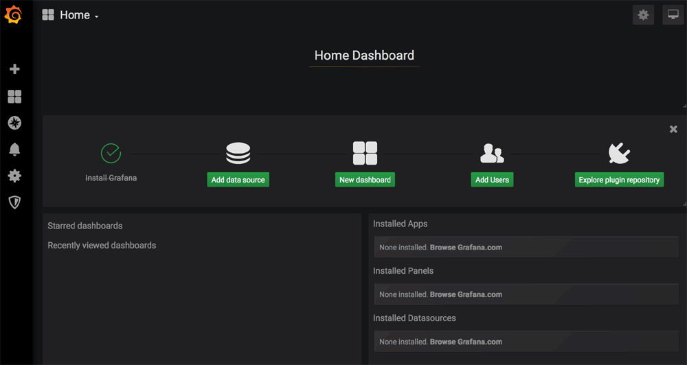

## Step 4: Configure Grafana to use Thanos as a data source

Follow these steps:

* From the Grafana dashboard, click the "Add data source" button.
* On the "Choose data source type" page, select "Prometheus".

  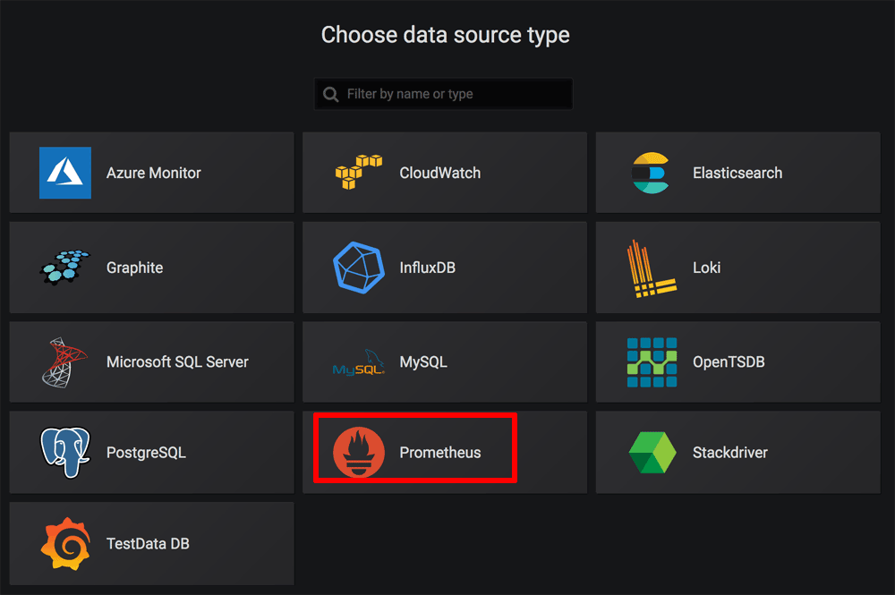

* On the "Settings" page, set the URL for the Prometheus server to
  *http://NAME:PORT*, where NAME is the DNS name for the Thanos service obtained
  at the end of [Step 2](#step-2-install-and-configure-thanos) and PORT is the
  corresponding service port. Leave all other values at their default.

  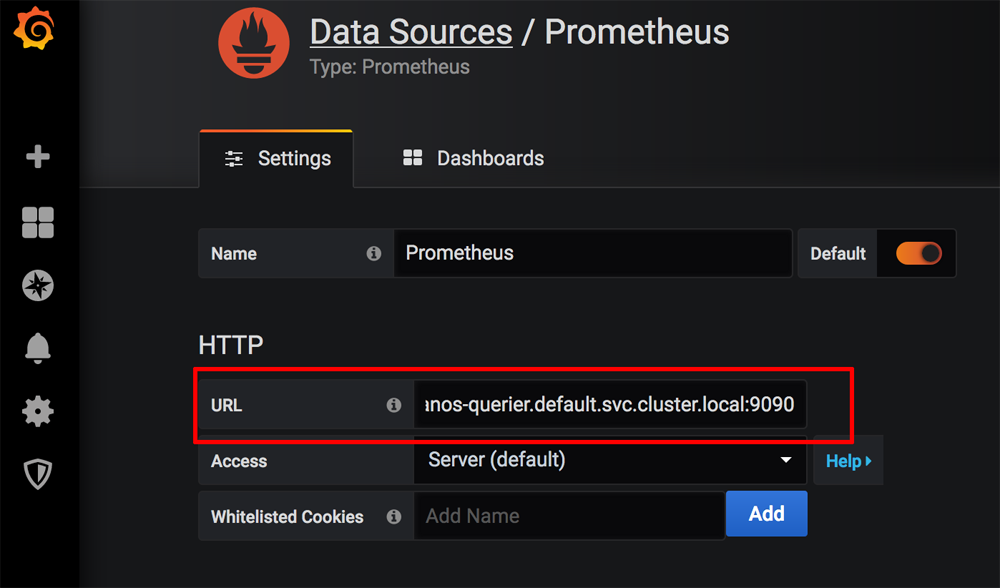

* Click "Save & Test" to save and test the configuration. If everything is
  configured correctly, you should see a success message like the one below.

  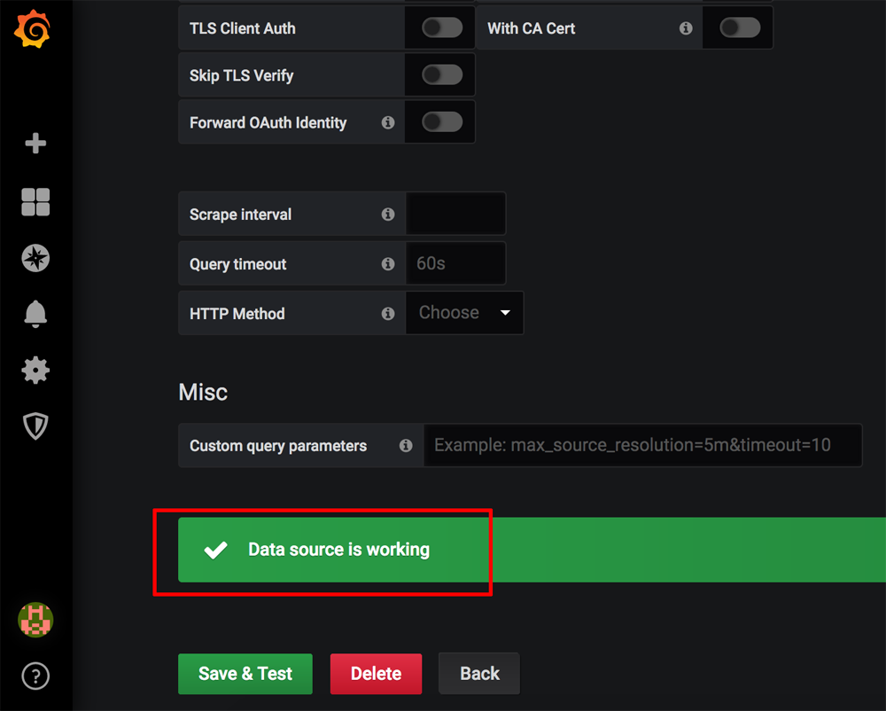


## Step 5: Test the system

At this point, you can start deploying applications into your "data producer"
clusters and collating the metrics in Thanos and Grafana. For demonstration
purposes, this guide will deploy a MariaDB replication cluster using Bitnami's
MariaDB Helm chart in each "data producer" cluster and display the metrics
generated by each MariaDB service in Grafana.

* Deploy MariaDB in each cluster with one master and one slave using the
  production configuration with the commands below. Replace the
  MARIADB-ADMIN-PASSWORD and MARIADB-REPL-PASSWORD placeholders with the
  database administrator account and replication account password respectively.
  You can also optionally create a MariaDB user account for application use by
  specifying values for the USER-PASSWORD, USER-NAME and DB-NAME placeholders.

  ```bash
  helm install mariadb \
    --set rootUser.password=MARIADB-ADMIN-PASSWORD \
    --set replication.password=MARIADB-REPL-PASSWORD \
    --set db.user=USER-NAME \
    --set db.password=USER-PASSWORD \
    --set db.name=DB-NAME \
    --set slave.replicas=1 \
    --set metrics.enabled=true \
    --set metrics.serviceMonitor.enabled=true \
    bitnami/mariadb 
  ```
  
  Note the *metrics.enabled* parameter, which enables the Prometheus exporter
  for MySQL server metrics, and the *metrics.serviceMonitor.enabled* parameter,
  which creates a Prometheus Operator ServiceMonitor.

* Once deployment in each cluster is complete, note the instructions to connect
  to each database service.

  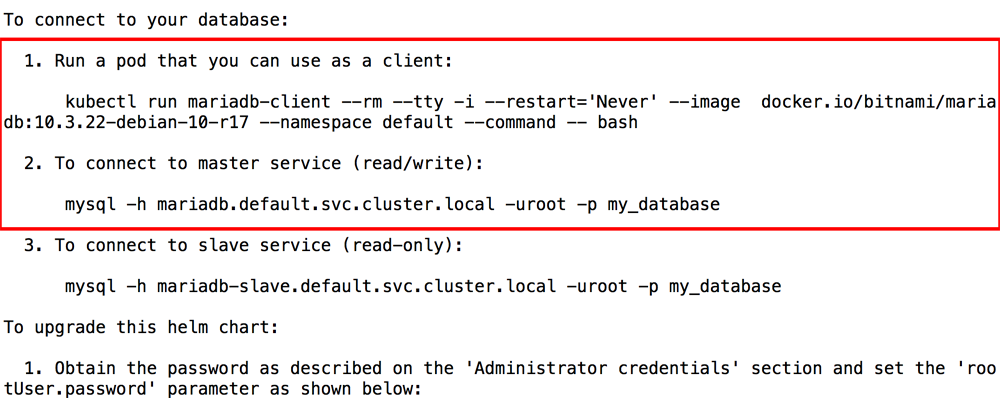

* Browse to the
  [MySQL Overview dashboard in the Percona GitHub repository](https://github.com/percona/grafana-dashboards/blob/master/dashboards/MySQL_Overview.json)
  and copy the JSON model.
* Log in to Grafana. From the Grafana dashboard, click the "Import -> Dashboard"
  menu item.
* On the "Import" page, paste the JSON model into the "Or paste JSON" field.

  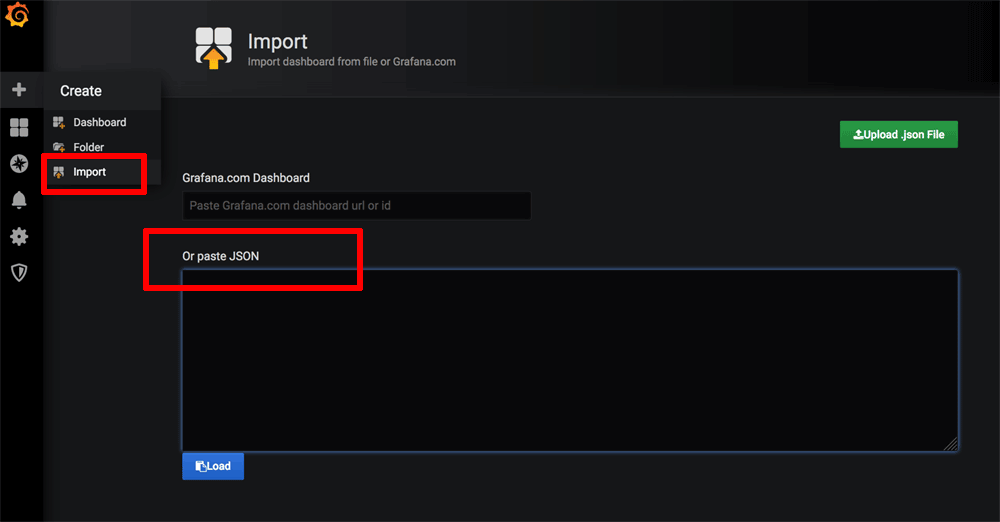

* Click "Load" to load the data and then "Import" to import the dashboard. The
  new dashboard should appear in Grafana, as shown below:

  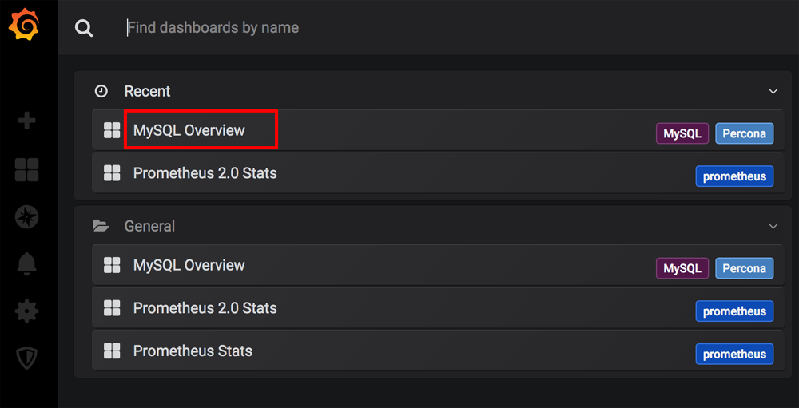

* Connect to the MariaDB service in the first "data producer" cluster and
  perform some actions, such as creating a database, adding records to a table
  and executing a query. Perform similar actions in the second "data producer"
  cluster. You should see your activity in each cluster reflected in the MySQL
  Overview chart in Grafana, as shown below:

  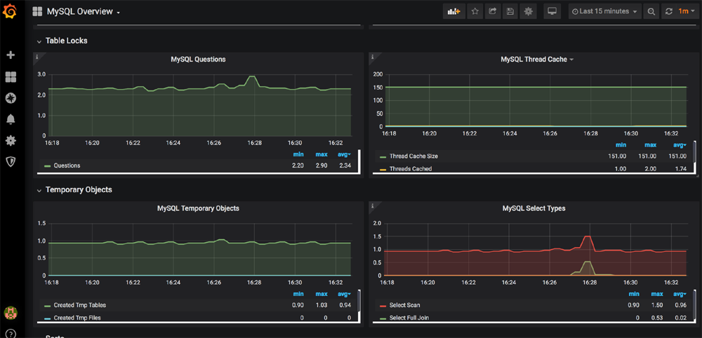

  You can view metrics from individual master and slave nodes in each cluster by
  selecting a different host in the "Host" drop down of the dashboard, as shown
  below:

  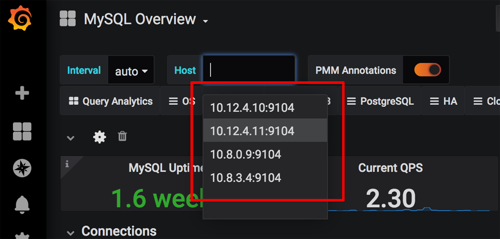
  
You can now continue adding more applications to your clusters. So long as you
enable Prometheus metrics and a Prometheus Operator ServiceMonitor for each
deployment, Thanos will continuously receive and aggregate the metrics and you
can inspect them using Grafana.  

## Useful links

To learn more about the topics discussed in this guide, use the links below:

* [Bitnami Prometheus Operator Helm chart](https://github.com/bitnami/charts/tree/master/bitnami/prometheus-operator)
* [Bitnami's Thanos Helm chart](https://github.com/bitnami/charts/tree/master/bitnami/thanos)
* [Bitnami's Grafana Helm chart](https://github.com/bitnami/charts/tree/master/bitnami/grafana)
* [Bitnami MariaDB Helm chart](https://github.com/bitnami/charts/tree/master/bitnami/mariadb)
* [NGINX Ingress controller documentation](https://github.com/kubernetes/ingress/tree/master/controllers/nginx)
* [Secure Kubernetes Services with Ingress, TLS and Let's Encrypt](https://docs.bitnami.com/tutorials/secure-kubernetes-services-with-ingress-tls-letsencrypt/)