On this page, you’ll find examples of some VMware employees’ setups within their home in order to give you insight and inspiration on how to set up your own physical space. In addition to these examples, you’ll find a quick interview with each practitioner about how and why they set up their space this way.

## Setup examples

### Alex Sherman (Product Manager, Atlanta)

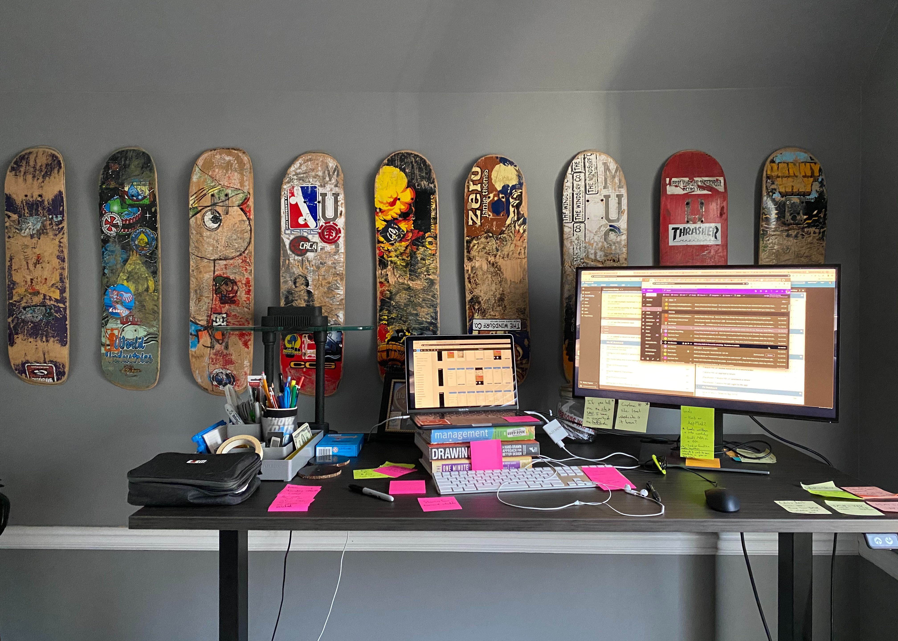

#### How comfortable are you within your home physical space?

I’m very comfortable with my setup. I love it! I still switch it up by working a little bit in our dining room and then making my way up to my area upstairs. It’s hard to be in a single room all day!

#### What are your favorite items and why?

I’m enjoying my standup desk and balance board more than I thought I would. I feel like I’m able to focus a bit more by standing. I still take sitting breaks often. Having a second monitor is helpful as well.

#### Are there particular elements that stimulate your creativity?

Yes! Having my old skateboard decks up in front of me give me something else to focus on outside of my screen. I love looking off into the different stickers, designs, and scratches that make up the decks.

#### Are there constraints you have and had to work around?

The only thing I feel restricted on is the impromptu conversations with coworkers. Yes, I’m able to get on a Zoom last minute with our team or Zoom bomb some engineers pairing, but it just feels like everything has to be scheduled. Physically I have everything I feel like I need except for the daily provided breakfasts.

### Anneliese Fish (Designer, Washington)

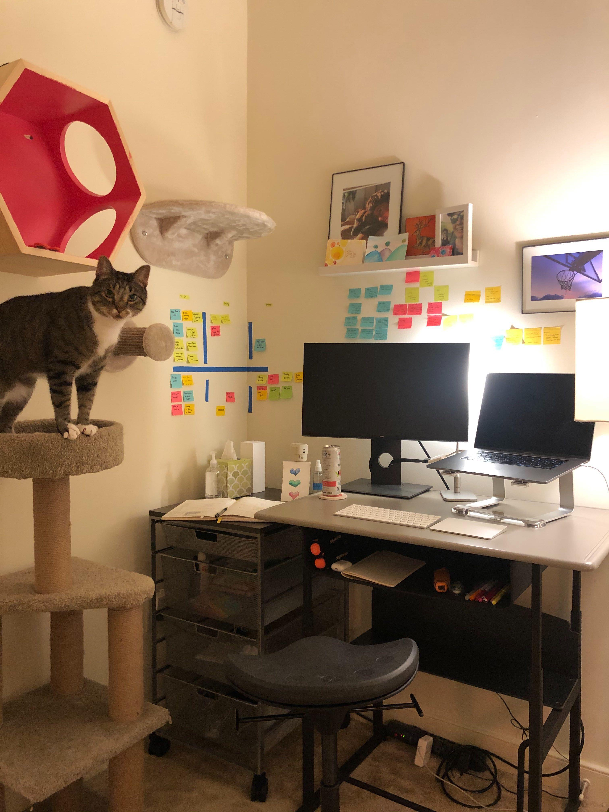

#### How comfortable are you within your home physical space?

I am quite comfortable—in fact, I am exponentially more comfortable now that I have an office (room). I can close the door for privacy and sound reduction. Also, I decorated the entire space in a way that is conducive to me and brings me peace and inspiration.

#### What are your favorite items and why?

My favorite items are my pivot chair and standing desk. They help me feel awake and supported, while helping me remember to sit up straight. A close runner up is the nearby cat furniture, for pets and peace to help get through the day.

#### Are there particular elements that stimulate your creativity?

The Kanban board on my wall helps me focus. The absence of clutter works the same way. Clean, clear and focused boosts my ability to focus on tasks. Also the chair in the corner is a good spot for me to take a break and read to promote continuous learning.

#### Are there constraints you have and had to work around?

Previously I was working out of the bedroom and my partner had a desk in the living room. This was challenging as my coworkers could hear her talking on a call and so I became conscious about not being on mute, which I think affected my productivity slightly. I was tempted to stay in bed during the day, but found a way to put my work “to bed” on weekends by stowing away all my gear in a backpack.

### Scott Windsor (Engineer, Seattle)

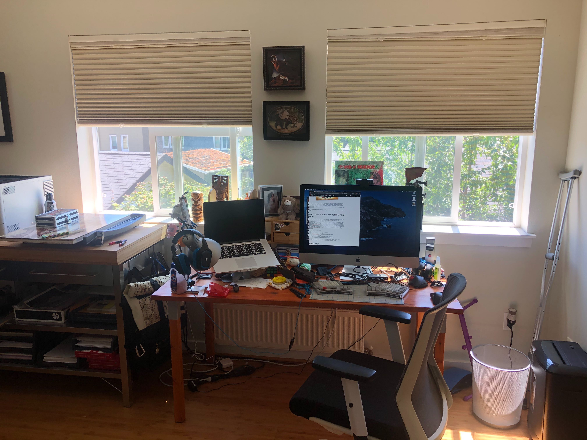

#### How comfortable are you within your home physical space?

I’m fairly comfortable at home. I have a good, big desk with lots of space, headset, comfortable chair, and my ergonomic keyboard (I also have an ergo keyboard at work, so not that different).

#### What are your favorite items and why?

Probably the keyboard (it’s one of many that I’ve made).

#### Are there particular elements that stimulate your creativity?

I like having a bookcase close by with tech books for reference. We just added that. I also have a lot of figures/toys but that’s just normal for the house.

#### Are there constraints you have and had to work around?

I think the big one is my wife getting used to me talking at home all day while pairing. Noise canceling headphones has been important for her to be able to work again.

## Gallery

### Gereon Buschmann (Product Manager, Munich)

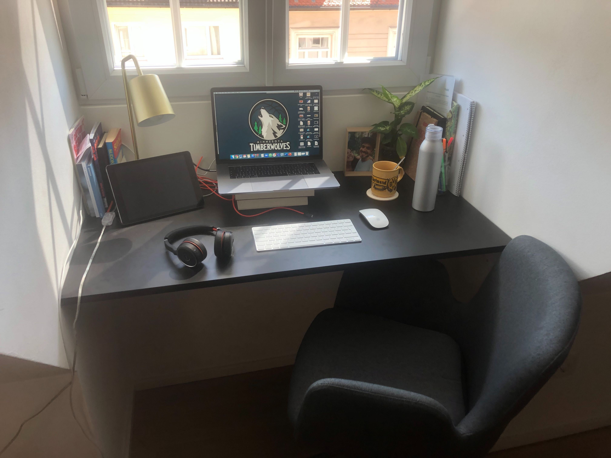

### Florent Biville (Engineer, France/Remote)

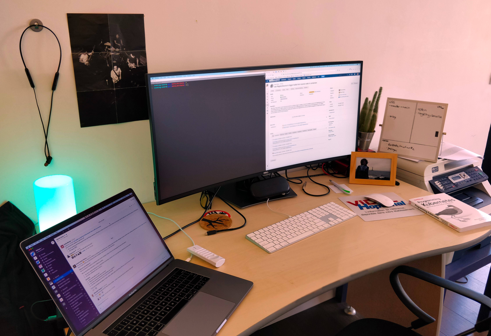

### Hayk Galystan (Engineer, Yerevan)

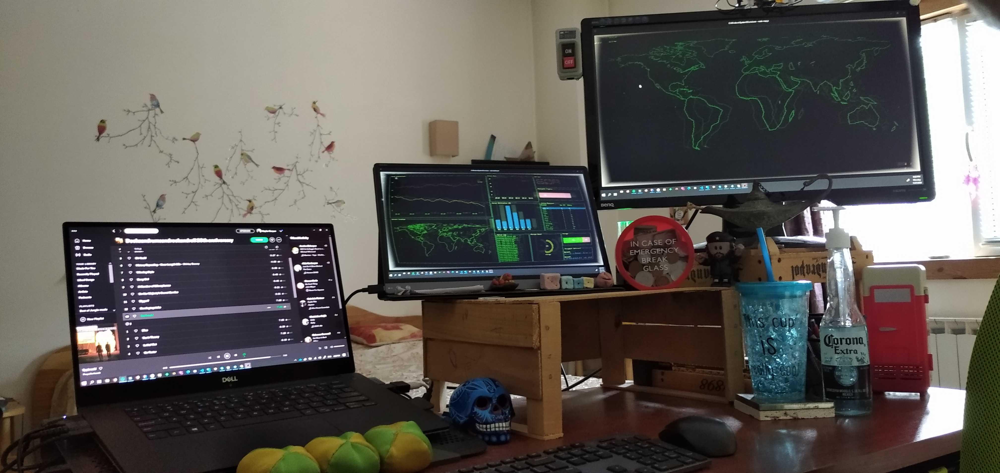

### Red Dolan (Designer, Portland)

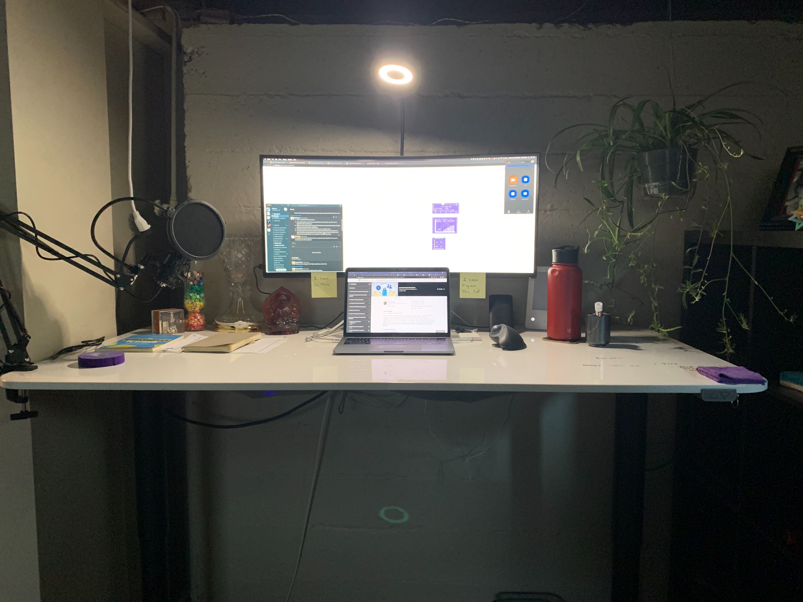

### Peter Tran (Engineer, Toronto)

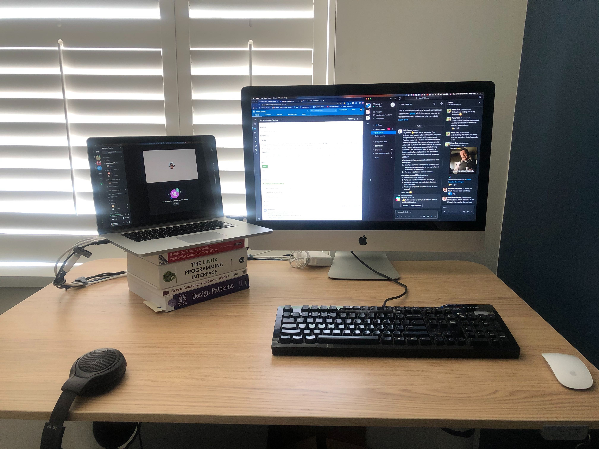

### Nana Asiedu-Ampem (Engineer, London)

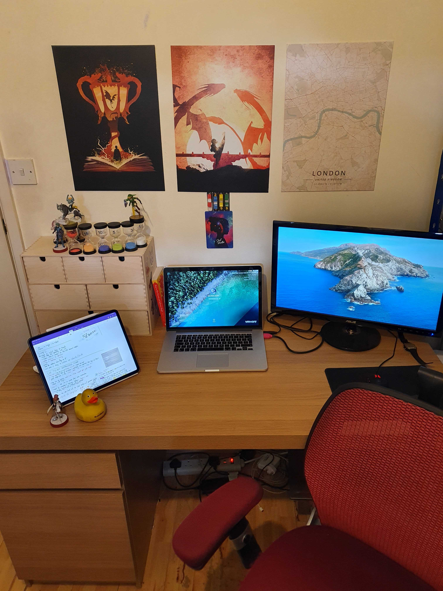

### Bill Glover (Platform Architect, London)

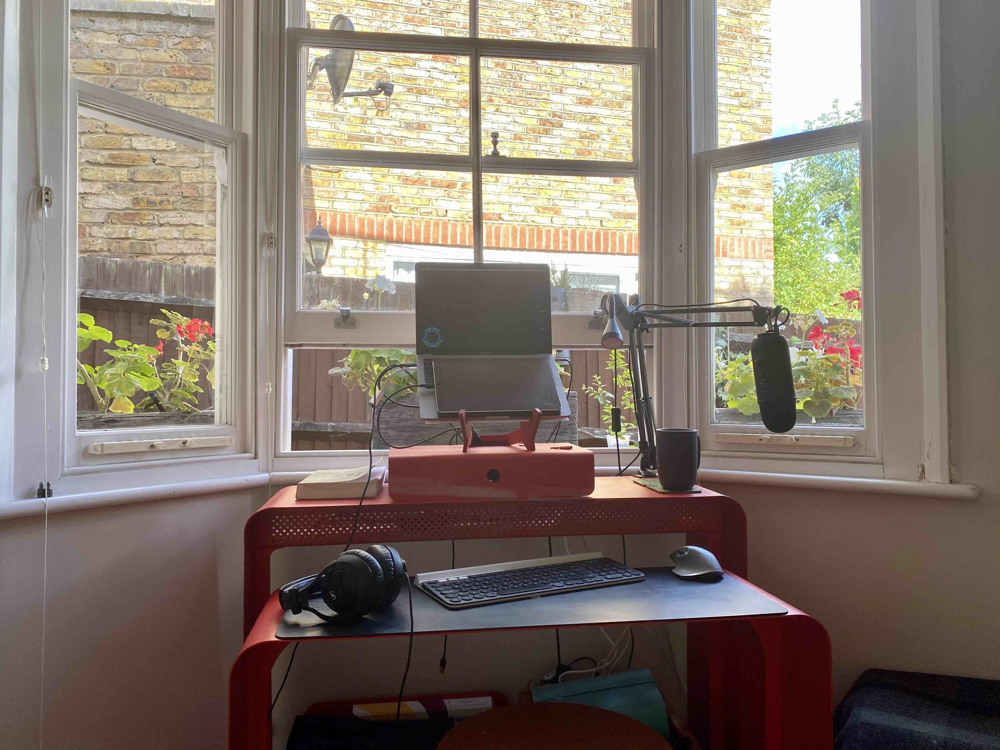

### Janet Amaro (Product Desgber, Palo Alto)

### Jonathan Sharpe (Engineering Manager, London)

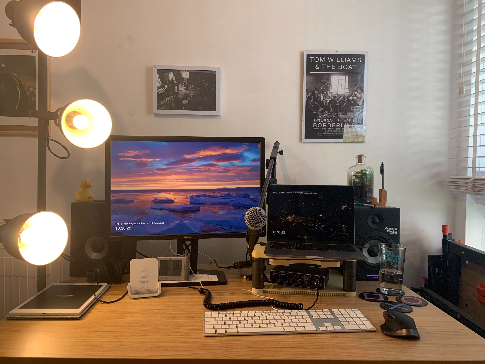

#### Ryan Hall (Engineer, Remote USA)

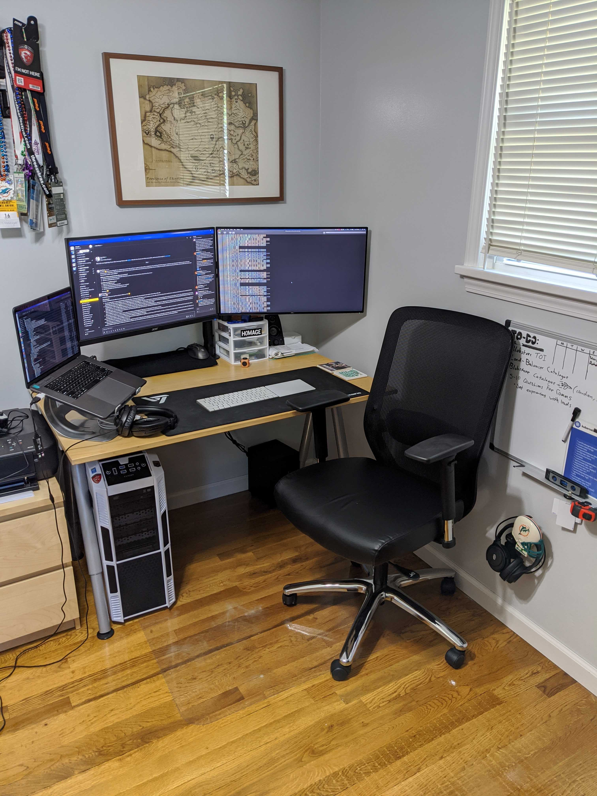

