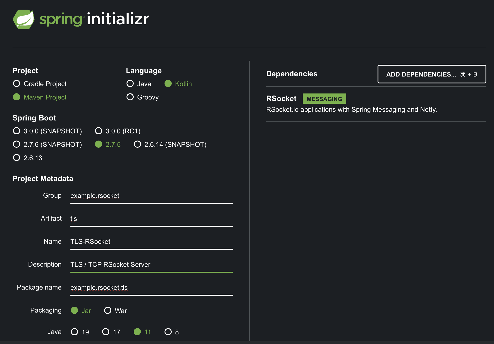

This guide will explore TLS credential generation, and configuration for RSocket services with Spring Boot 2.7.x. We will review a few options for generating the certificate, as well as importing and utilizing that certificate in your Spring Boot application.

It is assumed the developer knows about OpenSSL, Kotlin or at least JAVA 11 and uses Spring Boot. Do not worry if you're new to RSocket for Spring Boot or Reactive streams. All of the TLS security concerns relate to the Transport, not the protocol itself. Of course, the best place to understand are [the reference docs](https://docs.spring.io/spring-boot/docs/current/reference/htmlsingle/#appendix.application-properties.rsocket), so please read them!

## A Brief Background on PKI

SSL/TLS is a type of Public Key Infrastructure. PKI have concepts of a private and public key pair. Servers of an encrypted message will use the private key to generate the encrypted bits and ensure the identity of the creator. Meanwhile, clients or other non-trusted parties can use the public portion to decrypt the message.

SSL/TLS Certificates allow a server to join the `chain-of-trust` with other entities involved in the exchange of encrypted messages.  The [X.509](https://en.wikipedia.org/wiki/X.509) certificate format contain a public key, and a set of metadata that identifies the entity it represents. SSL/TLS certificates represent the most common types of X.509 certificates in the PKI stack. 

>_**NOTE**_: SSL is the deprecated standard. For intents and purposes, TLS is the reigning standard. See the [TLS Wiki](https://en.wikipedia.org/wiki/Transport_Layer_Security) on why.

A `chain-of-trust` is the relationship model that forms around a repository called a `truststore` (a keystore for declaring trusted certificates) which is commonly found in every browser and JDK. This `truststore` allows software to validate that an X.509 has a link with trusted parties.

### Keystore vs truststore

The keystore contains a private key and certificates that an app will present to other parties. In this example, our server will have a keystore containing it's own private key along with the signed certificate.

A truststore will contain the Root certificates that the holding entity (e.g. client) trusts. The Root certificates are those owned by top-level certificate signers known as the Certificate Authority - called CA. By installing all of the known CA Root certificates into the client truststore, we allow the client to trust third parties that present certificates signed by one of these CA's.

When developing apps, you will find (confusingly conflated names) that truststores are a _kind_ of keystore.

### One-Way TLS vs Two-Way TLS

In most day-to-day scenarios, you are using whats called [one way TLS](https://www.ibm.com/docs/en/sim/7.0.1.13?topic=communication-one-way-two-way-ssl-authentication). One-Way TLS is similar to every web browsing experience where the client identifies the TLS server by looking up the certificate fingerprint in it's truststore. In one-way TLS, a server creates a keystore holding it's private key and certificate while a client creates a truststore holding the Root certificate. In this example, we will make use of one-way TLS.

In [two way TLS](https://www.ibm.com/docs/en/sim/7.0.1.13?topic=communication-one-way-two-way-ssl-authentication), both parties offer TLS certificates. In addition to the above scenario, the client will present it's certificate to the server. In two-way TLS, a server creates a keystore as above, but also a truststore for validating client certificates. Additionally, the client creates a keystore for holding it's own private key and certificate.

## Establishing or Breaking the Chain of Trust 

TLS Certificates are usually issued by well known and trusted Certificate Authorities (CA). It's sometimes feasible to get around this by issuing a [self signed](https://en.wikipedia.org/wiki/Self-signed_certificate) certificate in that _only_ the user issuing it trusts. Self-signed certificates cannot be trusted outside the scope of the user/app who created it; they are really useful for one-off (test/proving) situations.

A Self Signed certificate is easy to generate with one command:
```bash
openssl req -newkey rsa:2048 -nodes -keyout key.pem -x509 -days 365 -out certificate.pem
```

Clients talking to servers that hold this certificate may not allow the connection to continue, since the `chain-of-trust` does not encompass this certificate! The next section will discuss another option, however which gives us more flexibility.

### The In-House Certificate Authority

In this option, organizations create their own trusted CA, and sign TLS certs from it. This is ideal for wider deployments since we will have little in the way of logistics - everyone involved can trust the Root cert or will implicitly do so if the in-house Root cert is signed by an already trusted CA such as Verisign.

We will create the private key, then generate a Root certificate. This Root certificate gets distributed to all devices and software. This establishes the `chain of trust` and allows us to sign other (application specific) certificates with it.

Ultimately, we need to get the certificate(s) installed onto hosts in a format that our server/client/device can understand. Since we are securing an RSocket server, we have a couple options for that format: [JKS](https://vdc-download.vmware.com/vmwb-repository/dcr-public/93c0444e-a6cb-46a0-be25-b27a20f8c551/ac6ea73b-569b-4fff-80f1-e4144f541ac8/GUID-7FB0CDA2-BE63-49A4-B76C-BB806C3194AC.html) which is a JAVA specification for storing certificates, and [PKCS#12](https://en.wikipedia.org/wiki/PKCS_12) which is the platform agnostic format.

In this guide we will explore exporting keystores in the PKCS#12 format, on the premise that JKS being deprecated at a later date.

## A Spring Boot Application

The server is a simple RSocket process. It only needs to respond to a message endpoint, and be encrypted along the way. Lets begin at [start.spring.io](https://start.spring.io) and add code bits from there.

Just one dependency - 'RSocket Messaging' is needed to get this going. Create the project and open it in your IDE. Otherwise, browse the [source code](https://github.com/Mario5Gray/rsocket-tls-spring-boot) here.



This application will expose a messaging endpoint that lets us exercise the TLS connectivity through RSocket. We just need a single controller to do the work:

ControllerMapping.kt
```kotlin
package example.rsocket.tls

import org.springframework.messaging.handler.annotation.MessageMapping
import org.springframework.stereotype.Controller
import reactor.core.publisher.Mono

@Controller
class ControllerMapping {
    @MessageMapping("status")
    fun status() = Mono.just("OK")
}
```

The RSocket messaging endpoint 'status' which return 'OK' will suffice our connectivity needs. Next, we need to generate some certificates that our server can use, as well as the truststores for both server and clients.

First, create a directory to perform the key generation:

```bash
mkdir keys
cd keys
```

This will be our working directory for the next few sections.

### Generating our CA's Private Key

To get started, we will need to generate the public/private key pair of our own CA. 

Lets generate the RSA 2048-bit key pair for our Root certificate:
```bash
openssl genrsa -out ca.key 2048 -aes256 -sha256 -passin pass:111111
```

This tells OpenSSL to generate a new RSA key 2048 bits long and store it in a file `ca.key`. The `aes256` flag tells it to encrypt the key using [AES256](https://en.wikipedia.org/wiki/Advanced_Encryption_Standard) encryption algorithm. We provided a password using the `passin` flag. `sha256` tells which hashing algorithm to generate the fingerprint with. The resulting file is Base64 encoded.

You can even check and inspect the key:
```bash
openssl rsa -in ca.key -text -check
```

The output is somewhat lengthy and includes a status indicator of the key's validity, the hexadecimal representation of the numeric key, and it's Base64 encoding. Next, we will use this key to create the Root certificate.

### Create the Root Certificate

Since we have the root key, we will create an X.509 certificate to be used in signing other keys.

Using OpenSSL, create the root certificate from the key generated earlier:
```bash
openssl req -x509 -new -key ca.key -passout pass:111111 -out ca.cer -days 365 -sha256 -subj "/CN=CARoot"
```

This tells OpenSSL to generate a CSR using the `key` flag to specify our private key for signing the request. The `subj` flag allows us to place [Distinguished Name](https://docs.oracle.com/cd/E19182-01/820-6573/ghusi/index.html) metadata for this instance.

The output is a file `ca.cer` containing the root X.509 certificate. Now for the fun part; lets create some certificates signed by our in-house CA!

### Create a Server Certificate

We can start the [Certificate Signing Request](https://en.wikipedia.org/wiki/Certificate_signing_request) (CSR) process by generating a private key for the entity we wish to represent; In this case, an RSocket server:

```bash
openssl genrsa -out server.key 2048 -aes256 -sha256 -passout pass:111111
```

This private key is similar but to the one we created earlier; it is just a different giant number.

The CSR file contains a public key with some organizational metadata used to identify the originating entity. Since we will be the signing party that uses our Root certificate to sign a CSR. The resultant certificate will have the fingerprint of our Root, and establishes the `chain-of-trust`.

The CSR will contain the Distinguished Name (DN) that identifies the requesting entity. This DN will include pieces of information such as:

* Private Key
* FQDN - Fully Qualified Domain Name
* CN - Common Name of the server
* Owner - Distinguished Name of the owner entity
* Email

We largely ignore the details of metadata in this guide. However, in specific cases, metadata is expected to appear with a formalized value such as FQDN having the local root of a domain name.  This demo doesn't require such measures beyond Common Name (CN) matching our server, thus we will use 'Unknown' for every other metadata and put 'Server'/'Client' as the CN.

We can create the CSR file using the private key we just generated:
```bash
openssl req -new -key server.key -sha256 -out server.csr -subj "/CN=server,OU=Unknown,O=Unknown,L=Unknown,ST=Unknown,C=Unknown" -passin pass:111111
```
The output is 'server.csr' containing the Base64 encoded CSR.

Now, we can sign the server's CSR with our Root certificate.

## Signing the Server Certificate

Using OpenSSL to sign the server's CSR and generate the server TLS certificate:

```bash
openssl x509 -req -CA ca.cer -CAkey ca.key -in server.csr -out server.pem -days 3650 -CAcreateserial -sha256
```

This takes the server's private key, the server's CSR and the Root certificate to generate the server's certificate. A Serial number is generated so that the CA may perform operations including revocation of the certificate (maybe it's compromised) at a later time.

The file `server.pem` will contain our newly generated TLS certificate.

## Create the Server Keystore

Now, we need to insert this certificate into a keystore that our Java app can understand. Lets create a `PKCS#12` keystore to store our Root, and signed server cert.

We'll first need to concatenate the Root and server certificates. Then use an OpenSSL command to export them into a PKCS#12 keystore:

```bash
cat ca.cer server.pem > serverca.pem
openssl pkcs12 -export -in serverca.pem -inkey server.key -name localhost -passout pass:111111 > server-ks.p12
```

>_**NOTE**_:  If you already have a JKS keystore in tow, simply convert that keystore into `PKCS#12` using Java [Keytool](https://docs.oracle.com/javase/8/docs/technotes/tools/unix/keytool.html):

```bash
keytool -importkeystore -srckeystore KEYSTORE-FILENAME.jks -destkeystore KEYSTORE-FILENAME.p12 -srcstoretype JKS -deststoretype PKCS12 -srcstorepass somepassword -deststorepass somepassword
```

Later, we will create an RSocket server that gets configured with TLS capabilities with use of this keystore.

### Create the Client/Server truststore

This is done by exporting the Root certificate into a `PKCS#12` keystore, then distributing to the client and server.

Create the trust store (keystore) file:

```bash
openssl pkcs12 -export -name localhost -in ca.cer -inkey ca.key -passout pass:111111 > truststore.p12
```

This command exports the `in` root certificate into the new `PKCS#12` keystore.


At this point, we have all of the keystores necessary to make the application work. We need to copy this to a directory under `src/main/resources`

```bash
mkdir ../src/main/resources/keystore
cp *p12 ../src/main/resources/keystore
```

The application can now take advantage of the keystore that contain the certificates our server will present to the client. For the client, we have the truststore that will allow it to trust the server certificate.

### Spring Boot RSocket/TLS support

Let's add TLS to our RSocket Server by including some necessary paths and TLS related configuration options in `application.properties`:

application.properties
```properties
spring.application.name=rsocket-tls
spring.rsocket.server.port=9090

spring.rsocket.server.ssl.enabled=true
spring.rsocket.server.ssl.client-auth=none
spring.rsocket.server.ssl.protocol=TLS
spring.rsocket.server.ssl.enabled-protocols=TLSv1.2
spring.rsocket.server.ssl.key-store=classpath:keystore/server-ks.p12
spring.rsocket.server.ssl.key-store-type=pkcs12
spring.rsocket.server.ssl.key-store-password=111111
my.ssl.trust-store=classpath:keystore/truststore.p12
my.ssl.trust-store-password=111111
```

SSL configuration is not specific to SSL as it applies to TLS - remember TLS supersedes SSL. The above configuration applies to the [SSL](https://docs.spring.io/spring-boot/docs/current/api/org/springframework/boot/web/server/Ssl.html) configuration class at runtime.


Specifying [client-auth](https://docs.spring.io/spring-boot/docs/current/api/org/springframework/boot/web/server/Ssl.ClientAuth.html) with `'NONE'` tells our app that only the server will present certificates. Change this option to `'WANT'` or `'NEED'` when you want to make mutual TLS (mTLS) the desired client authentication mechanism.

The rest of the properties lets us specify the location and what the keystore format is in addition to their passwords. Additionally, we have the non-standard `my.` client truststore properties for injecting keystore details for our client configuration.

> _**WARNING**_ Please keep credentials for your keystores safe and out of source code.

### Client Configuration

The client is a standard [RSocketRequester](https://docs.spring.io/spring-framework/docs/current/javadoc-api/org/springframework/messaging/rsocket/RSocketRequester.html) that uses a TCP socket to transmit frames. We can allow the client to trust our server's certificate  with help of [TcpClientTransport](https://github.com/rsocket/rsocket-java/blob/master/rsocket-transport-netty/src/main/java/io/rsocket/transport/netty/client/TcpClientTransport.java) configured with a [TrustManager](https://docs.oracle.com/javase/8/docs/api/javax/net/ssl/TrustManagerFactory.html) and sending it to the Requester.  Lets take a look at client configuration for our `TcpClientTransport` below;

```kotlin
class PKITransportFactory(private val trust: File,
                               private val storePass: String) {

    fun tcpClientTransport(host: String, port: Int): TcpClientTransport {

        val trustManager = TrustManagerFactory
                .getInstance(TrustManagerFactory.getDefaultAlgorithm())
                .apply {
                    val ks = KeyStore.getInstance("pkcs12")
                            .apply {
                        this.load(FileInputStream(trust), storePass.toCharArray())
                    }
                    this.init(ks)
                }

        return TcpClientTransport.create(
                TcpClient.create()
                        .host(host)
                        .port(port)
                        .secure { s ->
                            s.sslContext(
                                    SslContextBuilder
                                            .forClient()
                                            .keyStoreType("pkcs12")
                                            .trustManager(trustManager)
                                            .build()
                            )
                        })
    }
}
```

In this factory class, we will accept the truststore path and it's password that get used to initialize the `TrustManagerFactory` which
gets sent to the [SSLContextBuilder](https://netty.io/4.1/api/io/netty/handler/ssl/SslContextBuilder.html). Additionally, `SSLContextBuilder` can also be configured to turn on mTLS.

In our application configuration, we will need to setup the Bean instance for our `PKITransportFactory`:

```kotlin
    @Bean
    fun secureClientConnection(@Value("\${my.ssl.trust-store}") trustStoreFile: File,
                               @Value("\${my.ssl.trust-store-password}") jksPass: String): PKITransportFactory =
            PKITransportFactory(trustStoreFile, jksPass)
```

Finally, we are ready to test our client and server.

## Testing the TLS Setup

To test the whole thing - validity of certificates and their positions in the keystore and the client's truststore -  we will write a test.

First, we will need to create the requester, and it's TCP connection:

```kotlin
	@Autowired
	private lateinit var secureConnection: PKITransportFactory

	private lateinit var requester: RSocketRequester

	@BeforeAll
	fun setupOnce(@Value("\${spring.rsocket.server.port}") port: Int) {
		val securecon = secureConnection.tcpClientTransport("localhost", port)
		requester = RSocketRequester.builder().transport(securecon)
	}
```

Now, we can test the secure connection here:

```kotlin
    @Test
    fun testStatusRoute() {
        val req = requester
                .route("status")
                .retrieveMono<String>()

        StepVerifier
                .create(req)
                .assertNext {
                    Assertions
                            .assertThat(it)
                            .isNotNull
                            .isEqualTo("OK")
                }
                .verifyComplete()
    }
```

Running the tests show we are able to hit the 'status' endpoint and receive the result. The whole interaction was encrypted end-to-end and sows the beginning of our TLS journey.

## Closing and Next Steps

This guide bootstrapped security to your RSocket servers through TLS. If you were in the dark about TLS security in general, then it hopefully offered some assistance in discovering the nature of the protocol. One caveat we can mitigate for production is the storage and retrieval of keystores and credentials. Understanding that there are more options available is 'key' here. As your services scale, you may want to take advantage of [Spring Vault](https://cloud.spring.io/spring-cloud-vault/reference/html/), [CredHub](https://docs.cloudfoundry.org/credhub/) and a variety of options that help manage the provisioning of the certificates.

The next step in this topic will take advantage of [Spring Vault](https://spring.io/projects/spring-vault) as a source of certificates. This should reduce the amount of time a developer spends in managing all credentials used in production in addition to making a secure barrier to further hardening your application pipelines, and production data transmissions.

## Information and Learning

[Standard Cipher Names](https://docs.oracle.com/javase/9/docs/specs/security/standard-names.html)

[SSL Self-signing guide](https://knowledge.broadcom.com/external/article/166370/how-to-create-a-selfsigned-ssl-certifica.html)

[Common Distinguished Names](https://www.ibm.com/docs/en/ibm-mq/7.5?topic=certificates-distinguished-names)

[Write-up of OpenSSL Workings](https://opensource.com/article/19/6/cryptography-basics-openssl-part-2)

[Another write-up on SSL](https://docs.apigee.com/api-platform/system-administration/about-ssl)

[Example Process of Generating SSL](https://www.digicert.com/kb/ssl-support/openssl-quick-reference-guide.htm)

[Converting Certs to PKCS#12](https://docs.vmware.com/en/VMware-Horizon-7/7.13/horizon-scenarios-ssl-certificates/GUID-17AD1631-E6D6-4853-8D9B-8E481BE2CC68.html)