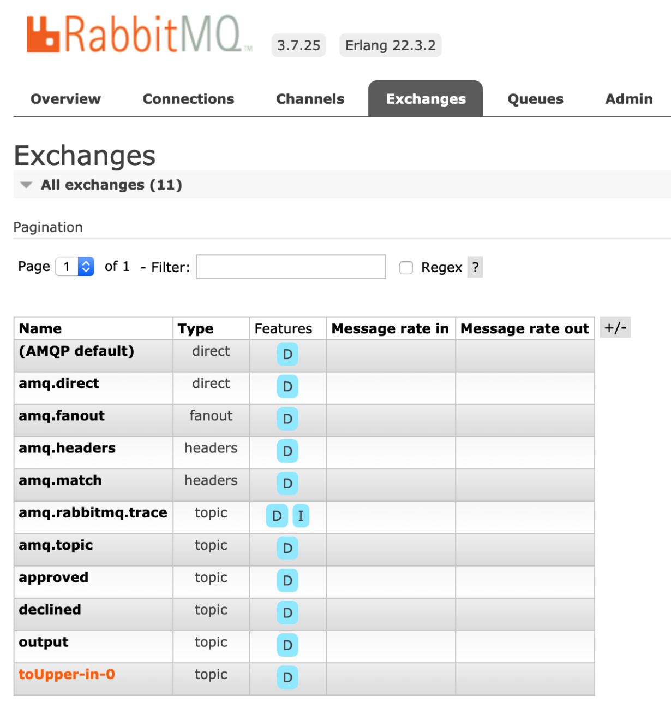
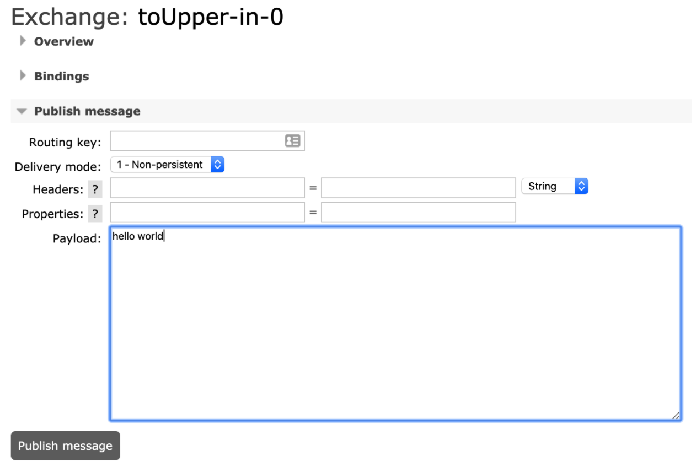

Spring Cloud Stream is a framework for building highly scalable, event-driven microservices connected with shared messaging systems. Spring Cloud Stream provides components that abstract the communication with many message brokers away from the code. If you'd like to learn more, make sure to check out [Spring Cloud Stream: What Is It?](/guides/event-streaming/scs-what-is/). In this guide, you'll go through writing a fictitious loan check system. One service will generate new loan applications, containing the applicant name and requested amount. That service will leverage Spring Cloud Stream to send that application to a second service, which will approve or decline loan applications.  

## Before You Begin
Before you begin, there are a few tools you will need:

- [Docker](https://docs.docker.com/get-docker/). You’ll run a RabbitMQ server and a Kafka server in containers to ease the setup.
- [Docker Compose](https://docs.docker.com/compose/install/). This example has a `docker-compose.yml` file to make setting up the multiple containers easier.
- Your text editor or IDE of choice.
[JDK 1.8](https://www.oracle.com/java/technologies/javase-downloads.html) or newer.

You can see the [completed example on GitHub](https://github.com/benwilcock/spring-cloud-stream-demo).

## Setting Up the Message Brokers
To simplify the setup of both RabbitMQ and Kafka, you can use the `docker-compose.yml` file included with the example:

```
curl https://raw.githubusercontent.com/benwilcock/spring-cloud-stream-demo/master/docker-compose.yml -o docker-compose.yml

docker-compose up
```

This will stand up both RabbitMQ and Kafka, as well as forward all of the required ports to both so that they can be connected to over `localhost`. If you’re new to either, make sure to check out [Getting Started with RabbitMQ](/guides/messaging-and-integration/rabbitmq-gs) and [Getting Started with Kafka](/guides/messaging-and-integration/kafka-gs).

## Simplified Code Example
You can actually get up and running with consuming messages from the message broker of your choice in just a few lines of code. In your `pom.xml` file, you’ll only need to include Spring Cloud Stream, as well as the binder of your choice. In the case of RabbitMQ, it would look like this:

```xml
<dependency>
    <groupId>org.springframework.cloud</groupId>
    <artifactId>spring-cloud-stream</artifactId>
</dependency>
<dependency>
    <groupId>org.springframework.cloud</groupId>
    <artifactId>spring-cloud-stream-binder-rabbit</artifactId>
</dependency>
```

From here, all that remains is setting up the `Consumer` that will handle receiving messages, then writing the code to do something with that message. Consider the following example, which takes in a message, converts it to uppercase, then logs it to the console.

```java
@SpringBootApplication
public class ScsGettingStartedApplication {
 
   public static void main(String[] args) {
       SpringApplication.run(ScsGettingStartedApplication.class, args);
   }
 
   @Bean
   public Consumer<String> toUpper() {
       return s -> {
           System.out.println(s.toUpperCase());       
       };
   }  
 
}
```

Here, a bean of type `Consumer` is created, and since this is the only bean of that type, Spring will automatically use it to handle incoming messages from the RabbitMQ binder. In this example, each message will come into the function, capitalized, and then printed out to the terminal. That’s all that is required to start consuming messages, and you can actually run this code as-is:

```
./mvnw spring-boot:run
```

This will compile and start the code and then attach it to the RabbitMQ servers you set up using Docker Compose, which will be listening at `localhost:5672`. Since this code only listens for messages, you’ll still need a way to send them. For that, you can use the RabbitMQ Management UI, which can be reached at http://localhost:15672/ with the username `guest` and password `guest`. Once logged in, choose “Exchanges” from the top navigation. You’ll notice a whole list of exchanges, but one should stand out: Spring Cloud Stream automatically set up an exchange for us, named `toUpper-in-0` !



Click on the `toUpper-in-0` exchange and you’ll be taken to a collection of information about it, as well as a way to easily publish messages to it. Expand the “Publish Message” section if it’s not expanded already, type in the message of your choice, and click “Publish Message.”



Watch the terminal running your code and you’ll see your message written to the console, but all in capital letters:

```
> HELLO WORLD
```

Great! With the basics covered, you’ll have a bit of context for the [loan check example](https://github.com/benwilcock/spring-cloud-stream-demo).

## The Loan Check Example

The Loan Check example consists of two parts:

- The `loansource` application (located in the `/loansource` folder). This application will randomly generate loan applications, consisting of a `name`, `amount`, and a `status`, which is automatically set to `PENDING`.
- The `loancheck` application (located in the `/loancheck` folder). This application processes loans,marking them as either `APPROVED` or `DECLINED`.

This demo also ships with two binders—one for RabbitMQ and one for Kafka—to demonstrate that your code isn’t specific to one particular message broker. Rather, the communication between application and message broker is handled entirely by Spring. That said, there are subsequently a couple of similarities between the two applications that should be called out.

First, the `pom.xml` file of each application has two profiles defined: one for RabbitMQ, and one for Kafka. Whichever profile is active will determine which binder is used in your code:

```xml
<profile>
    <id>rabbit</id>
    <properties>
        <spring.profile.activated>rabbit</spring.profile.activated>
    </properties>
    <activation>
        <activeByDefault>false</activeByDefault>
    </activation>
    <dependencies>
        <dependency>
            <groupId>org.springframework.cloud</groupId>
            <artifactId>spring-cloud-stream-binder-rabbit</artifactId>
            <version>${spring-cloud-stream.version}</version>
        </dependency>
    </dependencies>
 </profile>
```

Here you can see the `rabbit` profile, which brings in the `spring-cloud-stream-binder-rabbit` dependency. Likewise, there’s a similar one for Kafka.

Second, both applications will include a `resources` directory in the source code where you will find configuration files for both RabbitMQ and Kafka. The configuration included is minimal and largely cosmetic; it merely changes the application name and startup banner. The code would actually work without this configuration since the message brokers are running on `localhost` and their default ports, but it’s worth pointing out nonetheless.

### Generating Loan Applications

First up is the `loansource` application, which randomly generates loan applications. There’s a few files in the `/src/main/java/io/pivotal/loansource` directory, such as the `Statuses.java` file, which includes an `enum` of possible statuses a loan application could have, as well as the `Loan.java` file, which is a plain Java object defining what a loan is. You’ll want to look at the `LoansourceApplication.java` file.

This code introduces a new concept: the [`Supplier` interface](https://cloud.spring.io/spring-cloud-stream/reference/html/spring-cloud-stream.html#_suppliers_sources). There’s quite a bit that goes into the `Supplier` interface and it’s highly recommended to read through the documentation. Additionally, Spring will recognize that this is the only `Supplier` bean defined, and use it as the default method for emitting messages to the message broker. You can see how the interface is used below:

```java
@SpringBootApplication
public class LoansourceApplication {

    private static final Logger log = LoggerFactory.getLogger(LoansourceApplication.class);

    private List<String> names = Arrays.asList("Donald", "Theresa", "Vladimir", "Angela", "Emmanuel", "Shinzō", "Jacinda", "Kim");
    private List<Long> amounts = Arrays.asList(10L, 100L, 1000L, 10000L, 100000L, 1000000L, 10000000L, 100000000L, 100000000L);

    public static void main(String[] args) {
        SpringApplication.run(LoansourceApplication.class, args);
        log.info("The Loansource Application has started...");
    }

    @Bean
    public Supplier<Loan> supplyLoan() {
        return () -> {
            String rName = names.get(new Random().nextInt(names.size()));
            Long rAmount = amounts.get(new Random().nextInt(amounts.size()));

            Loan loan = new Loan(UUID.randomUUID().toString(), rName, rAmount);

            log.info("{} {} for ${} for {}", loan.getStatus(), loan.getUuid(), loan.getAmount(), loan.getName());

            return loan;
        };
    }
}
```

Here you can see that `Supplier` will randomly generate a new `Loan` object and then return it. No additional configuration for this `Supplier` has been added, so by default it will trigger once a second. You’ll also notice there’s no information on how to serialize the `Loan` object to be transmitted to the message broker. Since the `Loan` object has proper getters and setters, the binder will be able to automatically serialize this object to JSON when it’s ready to be sent to the message broker.

This code is ready to run! Since RabbitMQ was used in the example above, go ahead and use it for this example as well:

```
./mvnw spring-boot:run -Prabbit
```

This will start the code, activating the `rabbit` profile, and in turn activate the RabbitMQ binder. If you’d rather use Kafka, you can replace `-Prabbit` with `-Pkafka`. After a few moments, you’ll see the application connect to the message broker, begin generating loan applications, and start sending them to RabbitMQ!

```
2020-04-24 11:29:49.593  INFO 70121 --- [sk-scheduler-10] i.p.loansource.LoansourceApplication     : PENDING ccffc96f-822a-4e81-aa90-d51acf8fad1f for $100000 for Emmanuel
```

### Processing Loan Applications

Now that you’re sending loan applications, it’s time to build the other end and begin checking for them. First, take a look at the `loancheck` application, where you will find a lot of similarities. Notably, you’ll see the same profile definitions in the `pom.xml` file, as well as the same configurations for RabbitMQ and Kafka in the `/loancheck/src/main/resources` directory. In the `src` directory you’ll find the same `Loan.java` and `Statuses.java` files. However, there’s a bit more going on in there. The `loancheck` application will take in a loan, determine if it’s approved or not, then send it to one of two output queues: one for approved applications and one for those that are declined.

First, take a look at the code in `LoanProcessor.java`. This code explicitly defines each channel, since there are two output channels and Spring cannot implicitly determine when to use which one.

```java
@Component
public interface LoanProcessor {
    String APPLICATIONS_IN = "output";
    String APPROVED_OUT = "approved";
    String DECLINED_OUT = "declined";

    @Input(APPLICATIONS_IN)
    SubscribableChannel sourceOfLoanApplications();

    @Output(APPROVED_OUT)
    MessageChannel approved();

    @Output(DECLINED_OUT)
    MessageChannel declined();
}
```

Note the three variables defined at the top of the interface. By default, in the `loansource` application, Spring Cloud Stream defines a channel named `output` to use for generated loan applications. To match it, the code creates an `@Input` using the same name so that it’s reading from the same channel. Additionally, two `@Output` annotations are used to create two channels, one for each output.

Next, check out the `LoanChecker.java` file:

```java
@Component
public class LoanChecker {

    public static final Logger log = LoggerFactory.getLogger(LoanChecker.class);

    private static final Long MAX_AMOUNT = 10000L;

    private LoanProcessor processor;

    @Autowired
    public LoanChecker(LoanProcessor processor) {
        this.processor = processor;
    }

    @StreamListener(LoanProcessor.APPLICATIONS_IN)
    public void checkAndSortLoans(Loan loan) {
        log.info("{} {} for ${} for {}", loan.getStatus(), loan.getUuid(), loan.getAmount(), loan.getName());

        if (loan.getAmount() > MAX_AMOUNT) {
            loan.setStatus(Statuses.DECLINED.name());
            processor.declined().send(message(loan));
        } else {
            loan.setStatus(Statuses.APPROVED.name());
            processor.approved().send(message(loan));
        }

        log.info("{} {} for ${} for {}", loan.getStatus(), loan.getUuid(), loan.getAmount(), loan.getName());
    }

    private static final <T> Message<T> message(T val) {
        return MessageBuilder.withPayload(val).build();
    }
}
```

Here you can see where the real logic of this application lives. What’s most important to note is the `StreamListener` annotation; notice that it’s referencing the `LoanProcessor.APPLICATIONS_IN` defined in `LoanProcessor.java`. This is how Spring will know to invoke the `checkAndSortLoans()` method when it receives a new message. Next, this method will inspect the loan application and determine if it should be approved or declined (based on the amount being asked for). Finally, the code will get the appropriate channel to send the result to from the processor—with `processor.approved()` or `processor.declined()`—wrap up the object with the `MessageBuilder` in the `message` method, and send it to the message broker.

Like the `loansource` application, this can be run using Maven, activating the `rabbit` profile. If you’ve chosen to use Kafka instead, make sure to use the Kafka profile with `-Pkafka`.

```
./mvnw spring-boot:run -Prabbit
```

Once the application starts, it begins receiving applications and sending out the results:

```
2020-04-24 14:06:05.539  INFO 53718 --- [DWWVxSWhc8Hgw-1] io.pivotal.loancheck.LoanChecker         : PENDING 81ca97f3-ff6a-4df2-8b0d-b3dca9f22341 for $10 for Angela
2020-04-24 14:06:05.541  INFO 53718 --- [DWWVxSWhc8Hgw-1] io.pivotal.loancheck.LoanChecker         : APPROVED 81ca97f3-ff6a-4df2-8b0d-b3dca9f22341 for $10 for Angela
```

## Keep Learning

Hopefully you’ve now learned how Spring Cloud Stream allows you to implement messaging in your code in an easy and portable way. If you’d like to learn more, be sure to check out the [Spring Cloud Stream page on spring.io](https://spring.io/projects/spring-cloud-stream) where you will find reference documentation as well as more great guides and samples.