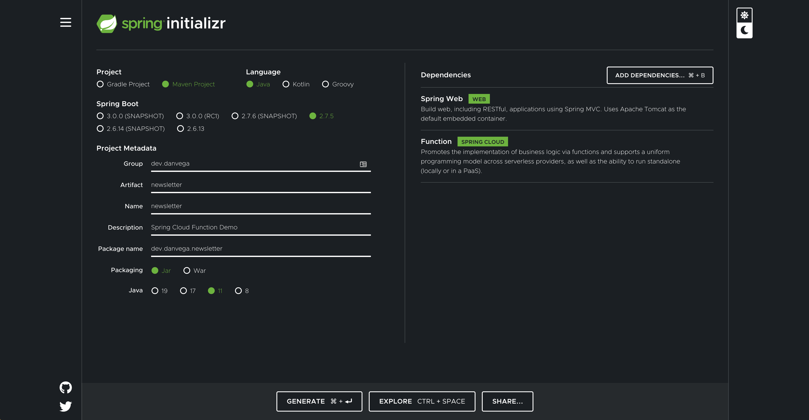
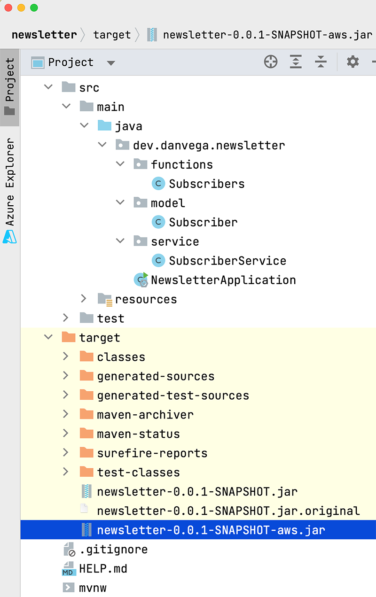
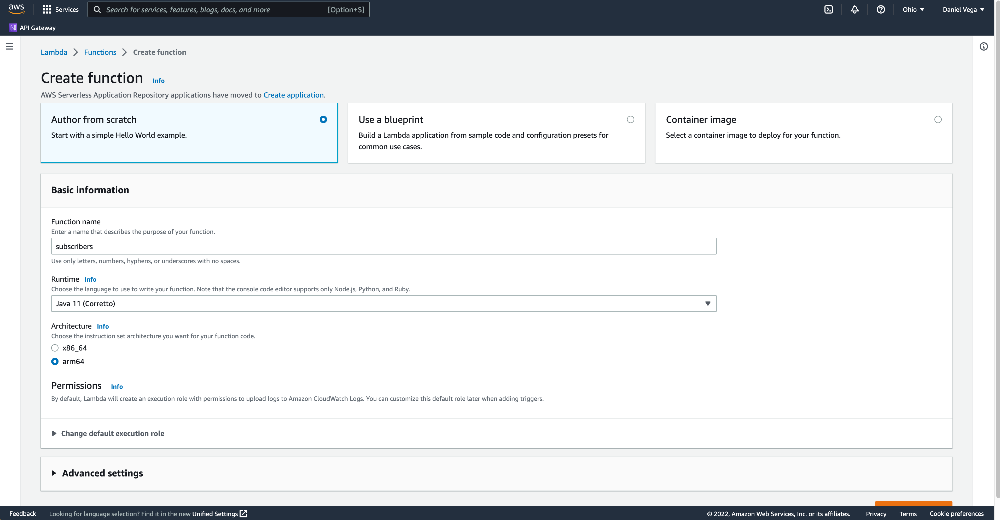
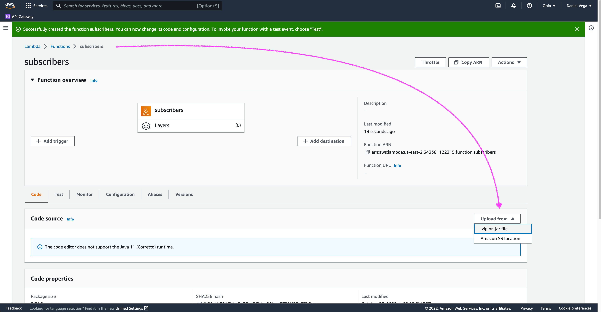
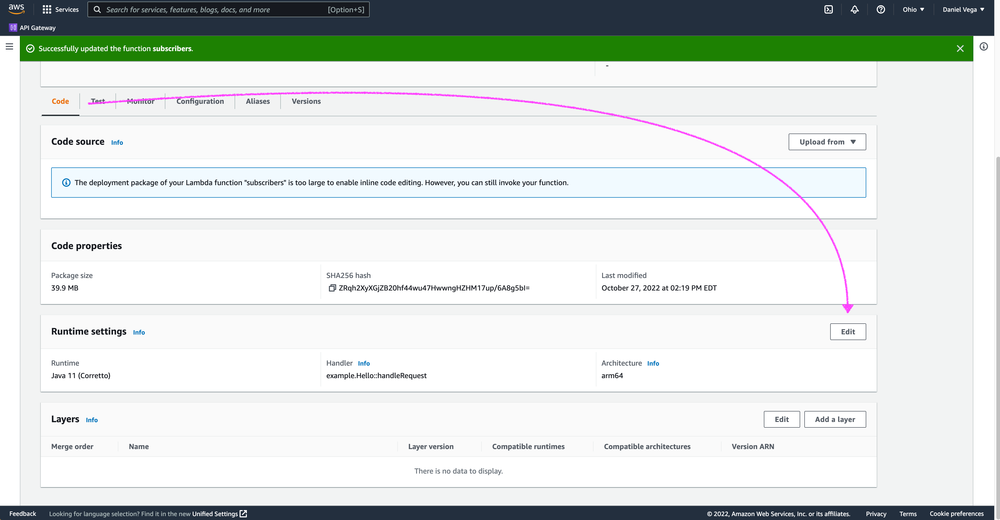
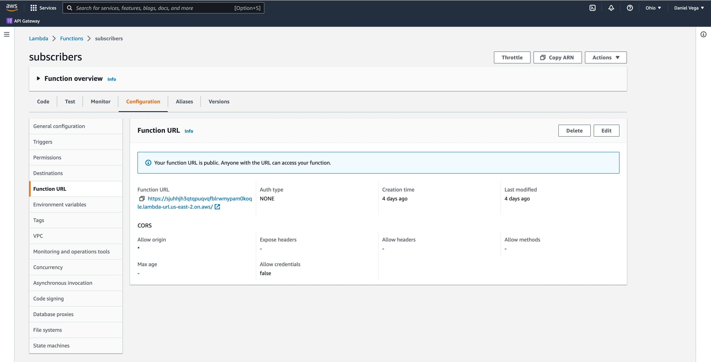
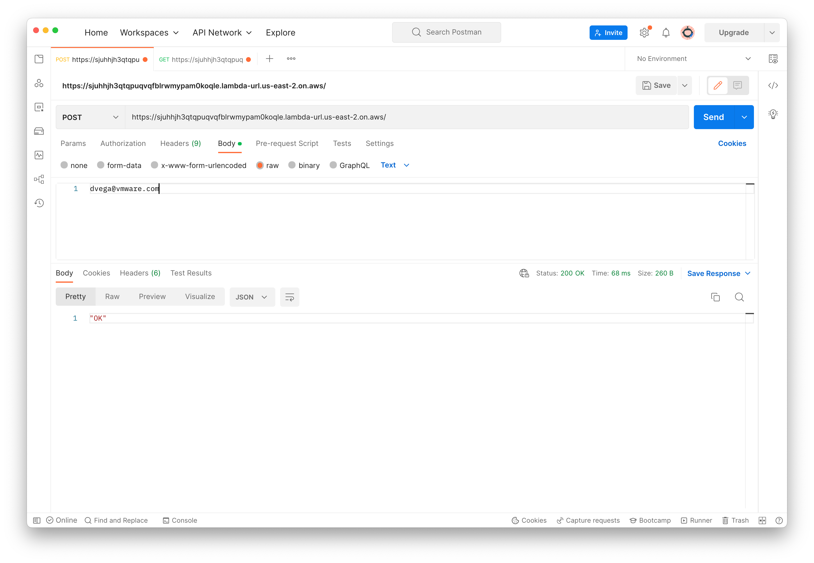
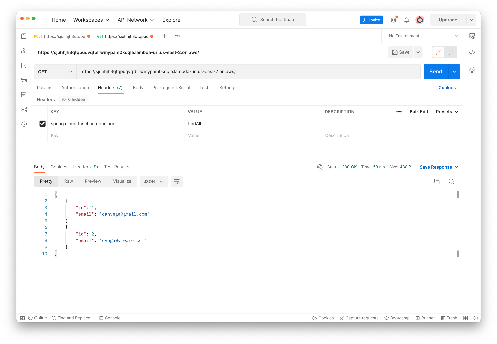

When you sit down to learn something new It’s important to not only understand what it is but why you should learn it. In this guide I will attempt to explain what serverless is and where Spring fits into the conversation. After that you will go through a step by step guide on how to create a serverless function and deploy it to a cloud provider like AWS. By the end of this article you will have an understanding of when to reach for serverless and how to create functions using Spring.

## What, When & Why

If you’re building solutions for the web chances are you have heard the term Serverless before, but what does it really mean? If you have experience deploying applications you know how to package an entire application and push it to a server somewhere. This could be in your own on-prem data center or a server in the Cloud. In most cases this server was provisioned by someone to handle that application you have deployed.

In a serverless world, or at least the one we are discussing today you aren’t dealing with an entire applications and instead focused on individual functions. This is why you will often hear serverless referred to as serverless functions or Functions as a Service (FaaS). As you have probably already guessed there are servers involved, the serverless part in the name just implies that you don’t have to provision them or care about who has.

Now that you have an idea of **what** a serverless function is lets talk about **when** you might want to reach for serverless functions. In a traditional application that you have deployed you might be taking requests and returning responses all day long. In those situations it makes sense to host your application on a server that is always up and always waiting for requests.

What happens in a scenario where you aren’t taking requests all day? Let’s say you created a new landing page for a newsletter that you started. On this landing page subscribers could sign up to receive your weekly newsletter by entering their email address and clicking the sign-up button. I currently have about 4,000 subscribers on my newsletter and at best get about 5 new subscribers per day. In this situation does it really make sense to pay for a server to be running all day long to handle 5 requests?

The answer to this no and its a perfect use case for moving this functionality to serverless functions. This isn’t the only reason why to reach for serverless though, it has many features:

-   **Scalability**: Serverless functions can be auto provisioned to scaled depending on load. This means that if your newsletter gets really popular you can be confident that the service will be able to handle the increase in traffic.
-   **Cost**: When it comes to serverless you only pay for what you use. This means that while your functions are not being used and just sitting idle you are not paying for them. ​​
-   **Security**: Serverless platforms are patching your systems and runtimes on your behalf and this is one less thing you need to manage.

You just saw one good use case for serverless but we want to leave you with a few others that might peak your curiosity:

-   Full Application (Static Site + BaaS)
-   Backend as a Service (BaaS)
-   REST API
-   Authentication
-   Multimedia Transformation
-   Email Notification
-   Data Transformation
-   CRON Jobs

## Spring Cloud Function

Now that you have a better understanding of what serverless functions are and when you might reach for them, how can you build them? You could build them in Java without the need of any additional libraries or frameworks. After moving past the quintessential hello world application you will quickly realize that you need features like logging, configuration, database access and more.

This is where Spring Boot + [Spring Cloud Function](https://spring.io/projects/spring-cloud-function) enter the conversation. You can use the tools you are already familiar with to get all of those features and more. In addition you can write all of your functions with the same consistent programming model across serverless providers as well as the ability to run standalone (locally or in a PaaS).

### Serverless Spring Guide

Things you need to know before getting started:

-   The Spring Boot application you will follow along with today uses Java 11. The reason we are using an older version of Java is because the target platform (AWS) currently supports that.
-   Basic understanding of Java
-   Basic understanding of Spring Boot

The final code for this guide can be located on [Github](https://github.com/danvega/newsletter-guide).

### Getting Started

The application you are building today is around the idea of starting your own newsletter. Before you can worry about sending out your newsletter you need to build your list of subscribers. To support this will you need the ability to add subscribers and a way to find all of the subscribers on your list. To get started head over to [start.spring.io](http://start.spring.io), fill in metadata about the project and select **Spring Web** and **Spring Cloud Function** as your dependencies.



When you’re done you can click on the generate button at the bottom which will download a zip file with the starting code for your project. You can open that project in whatever text editor or IDE you’re comfortable with. In this article, we are using [IntelliJ IDEA](https://www.jetbrains.com/idea/).

### Functional Catalog and Flexible Function Signatures

One of the main features of Spring Cloud Function is to adapt and support a range of type signatures for user-defined functions, while providing a consistent execution model. That’s why all user defined functions are transformed into a canonical representation by `FunctionalCatalog`. While users don’t normally have to care about the `FunctionalCatalog` at all, it is useful to understand what kind of functions are supported in user code.

#### Java 8 Function Support

Spring Cloud Function embraces and builds on top of the 3 core functional interfaces defined by Java and available to us since Java 8 in the [java.util.function package](https://docs.oracle.com/en/java/javase/11/docs/api/java.base/java/util/function/package-summary.html).

-   `Supplier<O>`: Returns output (GET)
-   `Function<I,O>`: Accepts input and returns output (GET/POST)
-   `Consumer<I>`: Accepts input (POST)

In a nutshell, any bean in your Application Context that is of type `Supplier`, `Function` or `Consumer` could be registered with `FunctionCatalog`.

### Creating you first Function

Now that you have some background on the functional catalog and flexible function signatures at your disposal it’s time to create your first function. For this simple example you will create a function that takes a String as input and returns the uppercase value of that input.

Based on your knowledge from the previous section what functional interface would you choose to meet those requirements? If you said `Function<I,O>` you are correct! To create a new function you can either create a class that implements that interface or because it is a functional interface it is a target for a lambda expression. Your main class that is annotated with `@SpringBootApplication` is a configuration class so you can define your beans there if you wish. Open up your main class and add the following method:

```java
@Bean
public Function<String,String> uppercase() {
  return value -> value.toUpperCase();
}
```

Congratulations, you just built your first function. While It isn’t anything special, you have to start somewhere. With the function in place its time to do a quick manual test on your local machine. If you run the application you can visit the URL [http://localhost:8080/uppercase/foo](http://localhost:8080/uppercase/foo) where the first parameter is the name of the function and 2nd is the value you are passing to it. In this simple smoke test you should see the value foo in all uppercase displayed in the browser window.

Next let’s create one more function that doesn’t take in any input and returns a value. Based on your knowledge from the previous section what functional interface would that be? If you said `Supplier<O>` you are correct! Create the following function that returns the string “Hello, Spring Cloud Function!”.

```java
@Bean
public Supplier<String> hello() {
  return () -> "Hello, Spring Cloud Function!";
}
```

If you restart the application you can visit the following URL [http://localhost:8080/hello](http://localhost:8080/hello) and you will see the message displayed in the browser window.

### Building the Newsletter API

Your knowledge of how to build Spring Boot applications along with what you just covered gives you everything you need to build out some real world serverless functions. In this example you are going to build out 2 functions, one to list all of the subscribers and 1 to add a new subscriber to your database.

To keep it simple the “database” in this example will be an in-memory collection of subscribers but this could be updated to connect to a Relational or NoSQL Database on the platform you plan on deploying to.

To get started you need a class that represents a subscriber in your application. Create a new package called `model` and create a new class `Subscriber` that contains the fields id and email.

```java
public class Subscriber {

   private Integer id;
   private String email;

   public Subscriber(Integer id, String email) {
       this.id = id;
       this.email = email;
   }

   public Integer getId() {
       return id;
   }

   public void setId(Integer id) {
       this.id = id;
   }

   public String getEmail() {
       return email;
   }

   public void setEmail(String email) {
       this.email = email;
   }

   @Override
   public String toString() {
       return "Subscriber{" +
               "id=" + id +
               ", email='" + email + '\'' +
               '}';
   }
}
```

Next create a service class that will contain our in-memory collection of subscribers.

```java
@Service
public class SubscriberService {

   private List<Subscriber> subscribers = new ArrayList<>();
   private AtomicInteger id = new AtomicInteger(0);

   public List<Subscriber> findAll() {
       return subscribers;
   }

   public void create(String email) {
       subscribers.add(new Subscriber(id.addAndGet(1),email));
   }

}
```

Next create a new package called `functions` and add a new class called `Subscribers`. You could create individual classes for each function but if they are going to use the same dependencies or configuration I find it easier to just bundle them into a single class. Remember that this is going to be a class where you include bean definitions so make sure to include the `@Configuraiton` annotation.

```java
@Configuration
public class Subscribers {

}
```

This class will depend on the `SubscriberService` you created above. That class is annotated with `@Service` and therefor being managed by Spring so you can get an instance of it using constructor injection.

```java
@Configuration
public class Subscribers {

   private final SubscriberService subscribers;

   public Subscribers(SubscriberService subscribers) {
       this.subscribers = subscribers;
   }

}
```

Finally create the 2 functions which will delegate responsibility for its functionality to the service class.

```java
@Configuration
public class Subscribers {

   private final SubscriberService subscriberService;

   public Subscribers(SubscriberService subscriberService) {
       this.subscriberService = subscriberService;
   }

   @Bean
   public Consumer<String> create() {
       return (email) -> subscriberService.create(email);
   }

   @Bean
   public Supplier<List<Subscriber>> findAll() {
       return () -> subscriberService.findAll();
   }

}
```

Run the application and test your functions by either using the command-line or a tool like Postman. Here I am using curl on the command-line to add a new subscriber to the collection.

```bash
curl -X POST http://localhost:8080/create/ -H "Content-Type: text/plain" -d "danvega@gmail.com"
```

After that I test the `findAll` method which should contain exactly 1 subscriber at this point.

```bash
curl http://localhost:8080/findAll
```

{}
**Note**: If you find yourself testing from the command-line often there is a great tool I like to use called [httpie](https://httpie.io/).
{}

Your functions are now ready to go. You manually tested them but you can easily write some automated tests just like would against any normal Spring Boot application.

### Deploying your Serverless Functions

I mentioned this earlier but one of the benefits of using Spring Cloud Function is that you can write your serverless applications the same way regardless of what platform you’re deploying to. This means that you just became a serverless developer for AWS, Google, Microsoft and more by learning what you did today.

In the project there are adapters for `AWS Lambda`, `Azure`, and `Apache OpenWhisk`. The `Oracle Fn` platform has its own Spring Cloud Function adapter. And `Riff` supports Java functions and its Java Function Invoker acts natively is an adapter for Spring Cloud Function jars.

While the examples below are all using Maven everything we go through can also be used with Gradle. If you’re interested in learning more about the adapters please check out the documentation.

#### AWS Lambda Packaging

In order to use the adapter plugin for Maven, add the plugin dependency to your pom.xml file:

```xml
<dependency>
  <groupId>org.springframework.cloud</groupId>
  <artifactId>spring-cloud-function-adapter-aws</artifactId>
</dependency>
```

A Lambda application has to be shaded, but a Spring Boot standalone application does not, so you can run the same app using 2 separate jars. If you want to learn more can read Notes on JAR layout from the [documentation](https://docs.spring.io/spring-cloud-function/docs/current/reference/html/spring-cloud-function.html#_notes_on_jar_layout). In the meantime and the following build plugins to your `pom.xml`.

```xml
<build>
  <plugins>
     <plugin>
        <groupId>org.apache.maven.plugins</groupId>
        <artifactId>maven-deploy-plugin</artifactId>
        <configuration>
           <skip>true</skip>
        </configuration>
     </plugin>
     <plugin>
        <groupId>org.springframework.boot</groupId>
        <artifactId>spring-boot-maven-plugin</artifactId>
        <dependencies>
           <dependency>
              <groupId>org.springframework.boot.experimental</groupId>
              <artifactId>spring-boot-thin-layout</artifactId>
              <version>1.0.28.RELEASE</version>
           </dependency>
        </dependencies>
     </plugin>
     <plugin>
        <groupId>org.apache.maven.plugins</groupId>
        <artifactId>maven-shade-plugin</artifactId>
        <version>3.2.4</version>
        <configuration>
           <createDependencyReducedPom>false</createDependencyReducedPom>
           <shadedArtifactAttached>true</shadedArtifactAttached>
           <shadedClassifierName>aws</shadedClassifierName>
        </configuration>
     </plugin>
  </plugins>
</build>
```

After those changes have been you are ready to build the application. From the command line run the following command:

`mvn clean package`

When this has completed successfully you should have JAR which you can run as a standalone application and an `-aws.jar` which you can use to deploy to AWS.



#### AWS Console

Now that you have the AWS specific JAR file you can login to your AWS Console.Navigate to Lambda Functions and click create function. From there enter function name, select Java 11 (Corretto) as the runtime, pick your architecture and create the function.



After the function has been created select upload from and select the jar file that you created in the previous step.



Next you will need to edit the runtime settings. When asked about the handler you can specify `org.springframework.cloud.function.adapter.aws.FunctionInvoker::handleRequest` which is a generic request handler.



Now your environment is ready to go you will probably want to test your functions. If you just had a single function you could test here in the console. When you have multiple functions wrapped up in a single JAR you need a way to instruct the platform which one you are trying to invoke.

#### Function URLs

A function URL is a dedicated HTTP(S) endpoint for your function. When your function URL is configured, you can use it to invoke your function through a browser, curl, Postman, or any HTTP client. In the past you would have had to create an API gateway endpoint in AWS and allowed access to your lambda function. This new feature simplifies exposing your functions to the outside world.



Create a new function URL and be sure to configure Cross-Origin Resource Sharing (CORS) so that you can send a POST request.

{}
**Note**: This is a good time to mention why we did this. Sure you can create individual applications for each function you will deploy but this becomes quite tedious. Think about a REST API that talks to a database. For each function you deploy you will have a lot of shared functionality, configuration and logging that you would have to duplicate across projects. With this approach you can package up everything together and then call the individual functions.
{}

You can now copy the function URL and use a tool like curl or Postman to test our your functions. Usually when you deploy configuration (non-custom runtime) with a single function it is automatically recognized and bound as AWS Lambda by `org.springframework.cloud.function.adapter.aws.FunctionInvoker`.

However when you have multiple functions present in your configuration you need to tell FunctionInvoker the target function definition. You can provide the `spring_cloud_function_definition` header in the request along with the name of the function you wish to call. In the following examples I am calling the create method first with an email address in the body and then invoking the find all function to display all of the subscribers in the collection.





Congratulations, you just deployed your first serverless functions to AWS Lambda. With a function URL you can now consume these functions from any client. If this is a project you are interested in building out you should look into `AWS SES` which stands for Simple Email Service. If you have your email addresses stored in a database it should be fairly simple to send a new email to all of your subscribers. That is one of the benefits of being on a platform like AWS, there is a service for anything you need.

## Final Thoughts

I hope you enjoyed this introduction to building serverless functions in Spring. If you’re interested learning more about Spring Cloud Function you should check out the [reference documentation](https://docs.spring.io/spring-cloud-function/docs/current/reference/html/index.html). In Spring Boot 3 we have introduced ahead-of-time (AOT) compilation which will allow you to create a native executable. This means less memory and faster startup times for your serverless functions.
