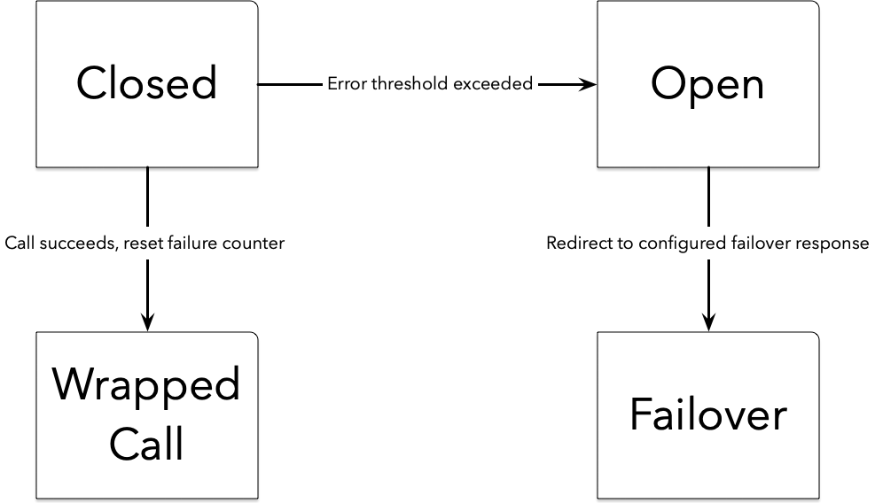
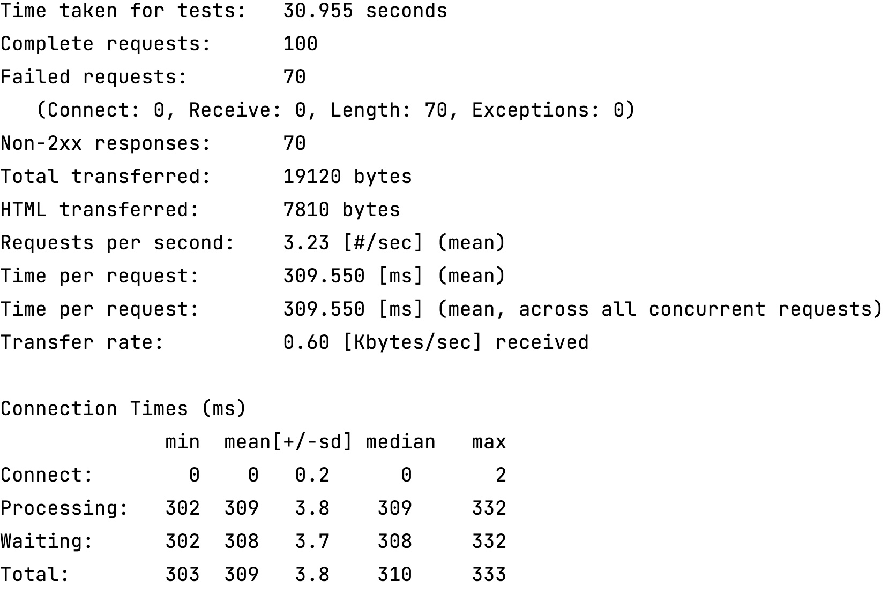
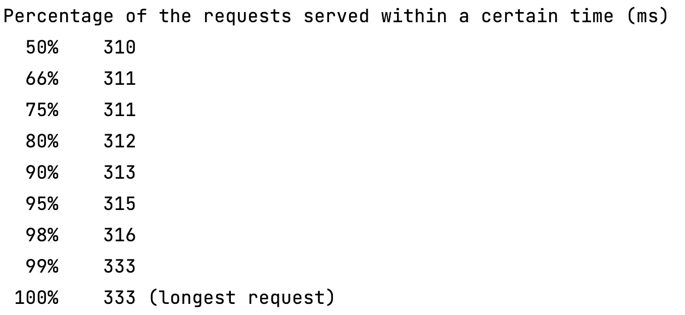
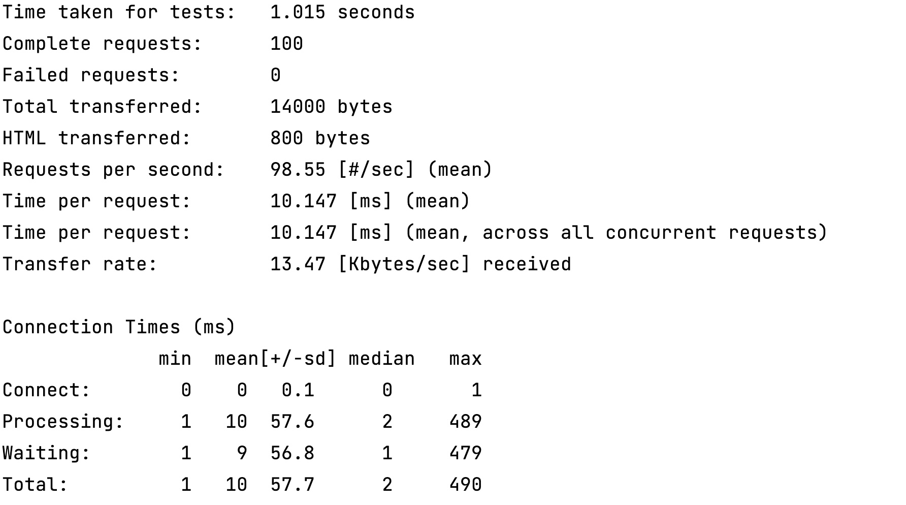
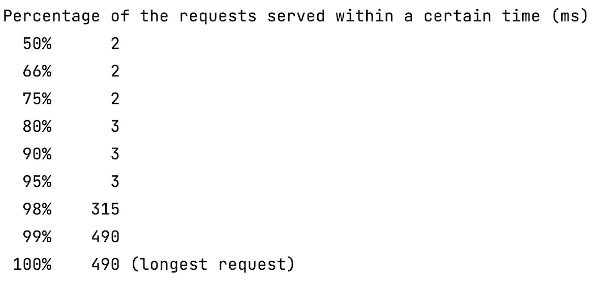

In software, as in life, you cannot prevent all bad things from happening, but you can be prepared. Distributed architectures provide many benefits, from independent scalability to polyglot technical stacks. However, there are no free lunches in software. Every decision, every design has tradeoffs; your architectural choices have consequences! To fulfill a business-related task, your services will interact with services running on disparate systems. That's the whole point of these architectures.

But that decision leads to a new failure case: calls across network boundaries will not always be successful. How do you protect your systems? How should your system respond when the inevitable happens? You could return an error message, a cached result, a default answer, or call a backup service; it depends entirely on the criticality of the call. Regardless of how your application responds, your distributed application should leverage the power of the [Circuit Breaker](https://martinfowler.com/bliki/CircuitBreaker.html) pattern; a pattern originally described by [Michael Nygard](https://twitter.com/mtnygard).

Circuit breakers in your code function the same way as the electrical circuit breaker in your home. It protects you from code that goes wrong! While most often used across network boundaries, circuit breakers can ultimately wrap any call or system subject to failures.

Vulnerable calls are wrapped in a circuit breaker, which monitors the results. When the number of failed calls exceeds the configured limit, the circuit is “opened,” meaning the calls no longer pass through to the protected service.



In this situation, the circuit breaker redirects to whatever fallback method you’ve configured. Periodically, the circuit breaker pings the underlying service and, if it is healthy, the circuit is “closed” and calls flow to the underlying endpoint once again.

## Adding and configuring circuit breakers
While circuit breakers were once bespoke, hand-rolled solutions, today developers have numerous libraries across multiple programming environments they can incorporate into their applications. In the Java ecosystem, there are several options, from [Resilience4J](https://resilience4j.readme.io/docs) to [Spring Retry](https://docs.spring.io/spring-batch/docs/current/reference/html/retry.html). Spring [Cloud Circuit Breaker](https://spring.io/projects/spring-cloud-circuitbreaker) provides an abstraction across various implementations, allowing developers the flexibility to change the underlying library as necessary. As is often the case, Spring provides a consistent, declarative approach to adding circuit breakers to code.

First, add the dependency:

```xml
<dependency>
	<groupId>org.springframework.cloud</groupId>
	<artifactId>spring-cloud-starter-circuitbreaker-resilience4j</artifactId>		
</dependency>
```
Next, configure the circuit breakers via the ‘CircuitBreakerFactory’. Each circuit breaker can have its own specific configuration, or you can utilize a default configuration. The configuration allows you to set the failure threshold, sliding window size, timeout duration, and more.

```java
@Configuration
class CircuitBreakerConfiguration {

    @Bean
    Customizer<CircuitBreakerFactory> circuitBreakerFactory() {

        TimeLimiterConfig timeLimiterConfig = TimeLimiterConfig
                .custom()
                .timeoutDuration(Duration.ofMillis(300))
                .build();

        CircuitBreakerConfig circuitBreakerConfig = CircuitBreakerConfig.custom()
                .failureRateThreshold(5)
                .waitDurationInOpenState(Duration.ofMillis(300))
                .slidingWindowSize(2)
                .build();

        return factory -> factory.configureDefault(id -> new Resilience4JConfigBuilder("config")
                .circuitBreakerConfig(circuitBreakerConfig)
                .timeLimiterConfig(timeLimiterConfig)
                .build());

    }
}
```
Once the circuit breaker is configured, wrap the protected call with the configured circuit breaker.

```java
@RestController
class WaffleController {

    private final MacronutrientsProvider macronutrientsProvider;
    private final CircuitBreaker circuitBreaker;

    WaffleController(MacronutrientsProvider macronutrientsProvider, CircuitBreakerFactory circuitBreakerFactory) {
        this.macronutrientsProvider = macronutrientsProvider;
        this.circuitBreaker = circuitBreakerFactory.create("waffles");
    }

    @GetMapping("/create")
    Waffle create() {
        return new Waffle(circuitBreaker.run(macronutrientsProvider::protein));
    }
}
```
## A failing call
What does this look like in practice? Let’s start with a sample controller that calls a service (the MacronutrientsProvider) that we’ve engineered to fail on a regular basis:

```java
@RestController
class WaffleController {

    private final MacronutrientsProvider macronutrientsProvider;

    WaffleController(MacronutrientsProvider macronutrientsProvider) {
        this.macronutrientsProvider = macronutrientsProvider;
    }

    @GetMapping("/create")
    Waffle create() {
        return new Waffle(macronutrientsProvider.protein());
    }
}
```

Running this code a hundred times without a circuit breaker results, predictably, in several failures, as seen using the [Apache Benchmarking](https://httpd.apache.org/docs/2.4/programs/ab.html) tool. In this instance, it took just over 30 seconds to complete the test.





## A better way
Clearly we can do better. Let’s rerun the test, but this time we’ll wrap the vulnerable call with a circuit breaker.

```java
@RestController
class WaffleController {

    private final MacronutrientsProvider macronutrientsProvider;
    private final CircuitBreaker circuitBreaker;

    WaffleController(MacronutrientsProvider macronutrientsProvider, CircuitBreakerFactory circuitBreakerFactory) {
        this.macronutrientsProvider = macronutrientsProvider;
        this.circuitBreaker = circuitBreakerFactory.create("waffles");
    }

    @GetMapping("/create")
    Waffle create() {
        return new Waffle(circuitBreaker.run(macronutrientsProvider::protein));
    }
}
```
Look at the first line of the results, the time taken for the tests to run. Instead of just over 30 seconds, we’re down to just over a second!





As you can see with even this pedagogical example, adding a circuit breaker has a noticeable effect. Critically, circuit breakers allow your application to respond to inevitable failures in a planned, predictable way.

## Wrapping up
Distributed applications are quickly becoming the new normal in software. And while they provide many benefits, they come with additional complexity. Systems must be designed to account for failing remote calls; adding circuit breakers to code no longer requires hand-rolled solutions, but it is vital for a healthy micro(service)biome. Your code will be more resilient, allowing you to sleep better while also minimizing disruptions to your customers.

Looking for more information about circuit breakers? Check out:
* [Circuit Breaker Pattern](https://martinfowler.com/bliki/CircuitBreaker.html)
* [Spring Cloud Circuit Breaker](https://spring.io/projects/spring-cloud-circuitbreaker)
* [Spring Cloud Circuit Breaker documentation](https://docs.spring.io/spring-cloud-circuitbreaker/docs/current/reference/html/)
* [Spring Cloud Circuit Breaker Demo](https://github.com/spring-cloud-samples/spring-cloud-circuitbreaker-demo)
* [Spring Tips: Spring Cloud Circuit Breaker](https://www.youtube.com/watch?v=s5-leUCti5o)
