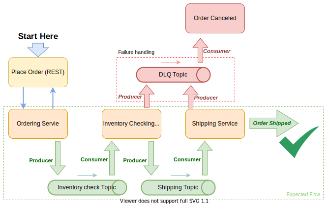

Based on our previous demo in [Part 1](https://tanzu.vmware.com/developer/guides/event-streaming/spring-cloud-stream-kafka-p1/), you are now ready to simulate a scenario to get a better sense of what we have previously discussed. Let’s say you need to design a system where you can place an order and ship it after some verification process.
To demonstrate how `SCS` can help you make your application development simpler, we are not going to cover all the edge or corner cases where this design can fail.

NOTE: The complete running code for this tutorial is available in [Github](https://github.com/ehsaniara/scs-kafka-intro/tree/main/scs-100). 

## Goal
In high level, you are going to experience:
- Touch on an Event Driven approach - EDA (AKA: Event Driven Architecture)
- Asynchronous communication between applications (Services)
- Using Apache Kafka as broker

In this case you are going to have two **back-end** checks, which are referred to as your _inventory check_ and _shipment services_.

Things to consider: the back-end process for this scenario may take a long time.There is a risk that the front-end (or UI app) call may timeout throughout this path at any point.

One way to move away from traditional request and response methods is to approach it with the event driven method - EDA (AKA: Event Driven Architecture). As a result, the UI can check the process through a State Store.

This may be a little difficult to understand right away, but this is something you have been doing for a long time in real life.

-----
A good example is your Mailing Service. You send a mailing envelope to a company, await a  response, and keep having to check your mailbox. In this case, your mailbox is the State Store.

There are other, alternative frameworks such as [Spring Integration](https://spring.io/projects/spring-integration) or [Spring Cloud Data-Flow](https://spring.io/projects/spring-cloud-dataflow) that you can use for this use case.

#### Note: In this demo, State Store is just a `HashMap`. Order ID is the key.

## The Work Flow

In order to visualize our goal, let’s take it to as high a level as possible and see this problem in three major services, while keeping in mind the future scalability. Each service has individual responsibilities (as stateless as possible) 


## Create an Order Request
A REST call is a **create request** through the controller and ordering service. It can also be a UI or any other service.

Since you are expecting a series of processes and operations in the back-end, you don't need to make the UI wait for the entire flow and keep the request thread occupied (blocked).

Simply create an order ID and create a lookup operation for checking the status of the order, while waiting for the order back-end processes to finish.

For the purpose of this document, you may use a simple local hash map in the application (as there is only a single application for this example).


#### Note: Although all service methods are in the same Service class, they are distributed in different methods in the source code, let’s refer to them as services, but eventually they can become separated services.

Some ideas related to your Kafka topic responsibilities:


<div class="table">

| Topic Name | Object | Description |
| :--- | :---: | :--- |
| `scs-100.inventoryChecking` | Order | Orders need to be processed for Inventory Check Operation |
| `scs-100.shipping` | Order  | Orders need to be shipped (Ready to go) |
| `scs-100.ordering_dlq` | Order | Orders need to be canceled (For Unexpected Behaviors) |

</div>


## Order Service

This is where you create the order ID — which can have simple validation checks for sanity. Having a lookup can reduce a lot of complexities and at the same time introduce new challenges that we will discuss later.

#### Note: You will only have one **Write** but many **Reads** operations at a time, per order.

Having this method of breaking the processes in the application design can have its own challenges, especially in lookup check. The lookup check process usually happens in one of the following ways:

- The application informs the UI (end-user or order creator service) as order changes its status. It can be any one of the [`Unicast`](https://en.wikipedia.org/wiki/Unicast) or [`Multicast`](https://en.wikipedia.org/wiki/Multicast) approaches.
- UI or end-user calls a specific API to see the latest status of a particular order.

You can choose 1 of 2 approaches, depending on the use case and implementation of the application. To keep the demo simple, the second approach is preferred.

The service is putting the order into topic (`scs-100.inventoryChecking`). It is a producer for this topic.

This process is simplified by using `SCS` (Spring Cloud Stream). You need to create a binder and its configuration only.

Producer part with Initializing the Order ([OrderService.java](https://github.com/ehsaniara/scs-kafka-intro/blob/6604387604742fc43b9afa8ff71dc3288cdefae6/scs-100/src/main/java/com/ehsaniara/scs_kafka_intro/scs100/OrderService.java#L54)):
```java
public Order placeOrder(Order orderIn) {
   var order = Order.builder()//
           .itemName(orderIn.getItemName())//
           .orderUuid(UUID.randomUUID())//
           .orderStatus(OrderStatus.PENDING)//
           .build();
   //update the status
   orderDataBase.put(order.getOrderUuid(), order);
   //send it for inventory check
   orderBinder.inventoryCheckingOut()//
           .send(MessageBuilder.withPayload(order)//
                   .setHeader(MessageHeaders.CONTENT_TYPE, MimeTypeUtils.APPLICATION_JSON)//
                   .build());
   return order;
}
```

Binder part ([OrderBinder.java](https://github.com/ehsaniara/scs-kafka-intro/blob/6604387604742fc43b9afa8ff71dc3288cdefae6/scs-100/src/main/java/com/ehsaniara/scs_kafka_intro/scs100/OrderBinder.java#L10)):
```java
//spring.cloud.stream.bindings.inventoryChecking-in
String INVENTORY_CHECKING_IN = "inventoryChecking-in";
String INVENTORY_CHECKING_OUT = "inventoryChecking-out";

@Input(INVENTORY_CHECKING_IN)
SubscribableChannel inventoryCheckingIn();

@Output(INVENTORY_CHECKING_OUT)
MessageChannel inventoryCheckingOut();
```

Application Configuration part ([application.yml](https://github.com/ehsaniara/scs-kafka-intro/blob/main/scs-100/src/main/resources/application.yml#L8))
```yaml
spring.cloud.stream.bindings.inventoryChecking-out.destination: scs-100.inventoryChecking
```


Our expectation from this service is to create the order and produce it in the topic. You may also separate this component into different applications and scale it. Eventually, this service can also be the only point of interaction between the front-end and back-end applications. You may refer to this component as your **Event Source**.

## Inventory Service

Inventory Service is also referred to as Event Processor. Here you have a consumer to your inventory check topic, and every message in this topic represents an order that needs to be checked for inventory. This is called an "Inventory Check" but it can vary in the real scenario, such as payments, supplier delivery, custom delivery, state tax calculator, etc.

At this point, you can have multiples of these services for other purposes. Theoretically speaking, it doesn't matter how much time this process takes since you are not blocking the original request thread.

[OrderService.java](https://github.com/ehsaniara/scs-kafka-intro/blob/main/scs-100/src/main/java/com/ehsaniara/scs_kafka_intro/scs100/OrderService.java#L68)

```java
@StreamListener(OrderBinder.INVENTORY_CHECKING_IN)
@SneakyThrows
public void checkInventory(@Payload Order orderIn) {
   log.debug("checkInventory orderIn: {}", orderIn);
   orderIn.setOrderStatus(OrderStatus.INVENTORY_CHECKING);
   orderDataBase.put(orderIn.getOrderUuid(), orderIn);

   Thread.sleep(5_000);//5 sec delay

   // just a simulation of create exception for random orders (1 in 2) in case of inventory insufficiency
   if (System.currentTimeMillis() % 2 == 0) {
       orderIn.setOrderStatus(OrderStatus.OUT_OF_STOCK);
       orderDataBase.put(orderIn.getOrderUuid(), orderIn);
       log.warn("Let's assume we ran out of stock for item: {}", orderIn.getItemName());
       Thread.sleep(5_000);//5 sec delay
       throw new OrderFailedException(String.format("insufficient inventory for order: %s", orderIn.getOrderUuid()));
   }

   //Order is good to go for shipping
   orderBinder.shippingOut()//
           .send(MessageBuilder.withPayload(orderIn)//
                   .setHeader(MessageHeaders.CONTENT_TYPE, MimeTypeUtils.APPLICATION_JSON)//
                   .build());
}
```
_This method is the consumer and produce order event_

In this method, you’ve intentionally thrown a runtime exception to simulate one of the cool features of [`SCS`](https://github.com/spring-cloud/spring-cloud-stream-binder-kafka) which is provided out of the box, “Retry Mechanism”. It can easily be configured in `application.yml` with no extra coding. It also supports the “Back off and retry mechanism”. The retry value is 3 seconds, by default, and the `backoff` value is 5 seconds, by default.

Eventually, when this method throws an exception, it doesn't immediately fail  unless it hits its built-in retry threshold.

For example, let’s say, you need to call a third party service, but the call failed in the first attempt due to some networking issues or unhealthy nodes. However, you know that if you try one more time, you can get the results by hitting the healthy one. It’s recommended that you visit [this link](https://cloud.spring.io/spring-cloud-static/spring-cloud-stream-binder-kafka/3.0.3.RELEASE/reference/html/spring-cloud-stream-binder-kafka.html#_kafka_binder_properties).

[application.yml](https://github.com/ehsaniara/scs-kafka-intro/blob/main/scs-100/src/main/resources/application.yml#L28)
```yaml
spring.cloud.stream.kafka:
 bindings:
   inventoryChecking-in.consumer:
     enableDlq: true
     dlqName: scs-100.ordering_dlq
     autoCommitOnError: true
     AutoCommitOffset: true
```
There are many other configurations that you can apply. Go [here](https://docs.spring.io/spring-cloud-stream-binder-kafka/docs/3.0.12.RELEASE/reference/html/spring-cloud-stream-binder-kafka.html#_apache_kafka_binder) for more information.


Potentially, you could put the order in `DLQ` manually and exit the method immediately (“return;”) within the “if” statement, but i `SCS` wouldn’t understand if something went wrong and that it needs to “retry” the method (throughout the document we keep referring to it as service).


Keep in mind that you can configure from application.yml
```yaml
cloud.stream.bindings.inventoryChecking-in.consumer.maxAttempts
```
Once you are done with the inventory check service, you can put the order into `scs-100.shipping` topic and you are done with the service. The instance of service is ready to pick up the next order for checking, and the workflow keeps going on.

## Shipping Service
This is your **Event Sink** process. In your final step, you are going to ship out the order that has been passed from all the verification steps you have designed. You can mark your order as SHIPPED.

```java
@StreamListener(OrderBinder.SHIPPING_IN)
public void shipIt(@Payload Order orderIn) {
   log.debug("shipIt orderIn: {}", orderIn);
   orderIn.setOrderStatus(OrderStatus.SHIPPED);
   orderDataBase.put(orderIn.getOrderUuid(), orderIn);

   log.info("ItemID: {} has been Shipped", orderIn.getOrderUuid());
}
```

_Note: Any failure on this step also drives the order to your `DLQ`, by configuration._

## Cancellation Service

Basically, you are handling all `DLQ` messages (orders) in this topic. Eventually, orders which end up here should be canceled so that the canceling process applies to them.




## Show Time!

Let's run the application now by running the following line:
```shell
java -jar scs-100-0.0.1-SNAPSHOT.jar
```

Now, the application is running on the port 8080, as you expected. To create an order and see the flow, let’s run the following command line. Before that, make sure you have already installed the [`jq`](https://stedolan.github.io/jq/) (command-line JSON processor).

```shell
ORDER_UUID=$(curl --silent -H 'Content-Type: application/json' -d "{\"itemName\":\"book\"}" http://localhost:8080/order | jq -r '.orderUuid') && for i in `seq 1 15`; do echo $(curl --silent "http://localhost:8080/order/status/"$ORDER_UUID); sleep 1; done;
```

Here you have created an order and keep calling its status every second for a total of 15 seconds.


###### In case of inventory available and order shipped, the results will be similar to this: 
```shell
"INVENTORY_CHECKING"
"INVENTORY_CHECKING"
"INVENTORY_CHECKING"
"INVENTORY_CHECKING"
"INVENTORY_CHECKING"
"SHIPPED"
"SHIPPED"
"SHIPPED"
"SHIPPED"
"SHIPPED"
"SHIPPED"
"SHIPPED"
"SHIPPED"
"SHIPPED"
"SHIPPED"
```
_Eventually, once you see the “SHIPPED” status you can exit the loop._

###### In case of shortage of supply, the results will be similar to this:

```shell
"INVENTORY_CHECKING"
"INVENTORY_CHECKING"
"INVENTORY_CHECKING"
"INVENTORY_CHECKING"
"INVENTORY_CHECKING"
"OUT_OF_STOCK"
"OUT_OF_STOCK"
"OUT_OF_STOCK"
"OUT_OF_STOCK"
"OUT_OF_STOCK"
"CANCELED"
"CANCELED"
"CANCELED"
"CANCELED"
"CANCELED"
```
_Basically, once you see the “CANCELED” status you can exit the loop. You may also notice the “OrderFailedException” on your application console, which is intentional._

## Conclusion
Spring Cloud Stream, which is represented as the **green layer** in the following diagram, helps us to focus on solving the business problem rather than taking care of plumbing issues with the application.


The complete running code for this tutorial is available in [Github](https://github.com/ehsaniara/scs-kafka-intro/tree/main/scs-100).

## Known Issues
- State Store Database (you just temporarily left it as `HashMap`), which is only available for the local app, can cause issues when you horizontally scale the application instances or break the application into smaller modules.
- `SCS` Binder features are ~~deprecated~~ in the next versions of `SCS` in favor of Functional Programming.

### What’s Next?

In the next tutorial, Part 3, you are going to learn how to overcome the known issues. You will also be introduced to topics such as:
- State Stores
- Materialized View
- Interactive Queries
