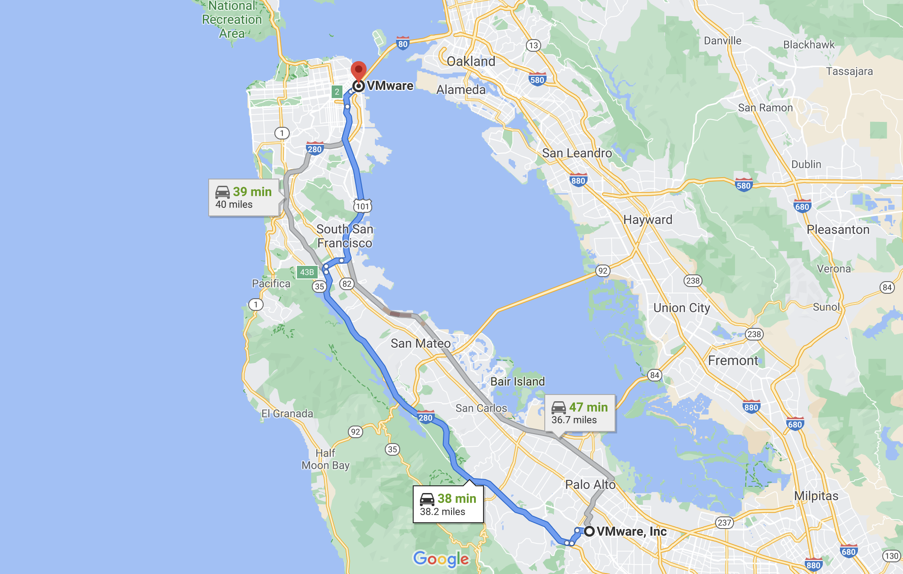
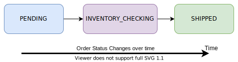

This tutorial is going to use the same example (Ordering System) from [Part 2](https://tanzu.vmware.com/developer/guides/event-streaming/spring-cloud-stream-kafka-p2/), and craft it into a Stream Process with a modern Java Functional Programming Model by using `SCS` (Spring Cloud Stream Kafka).

The Ordering System from [Part 2](https://tanzu.vmware.com/developer/guides/event-streaming/spring-cloud-stream-kafka-p2/) may not be the perfect scenario for Streaming, but the purpose of this tutorial is  to look at the problem with a Streaming approach and demonstrate how `SCS` can be helpful during this process.

_Note: The complete running code for this tutorial is available in [Github](https://github.com/ehsaniara/scs-kafka-intro/tree/main/scs-100-2)._


## Introduction

Looking back to the previous tutorial [Part 2](https://tanzu.vmware.com/developer/guides/event-streaming/spring-cloud-stream-kafka-p2/), we see how it tracks the order status changes and overrides the status every time. However, there are some real-life use cases where you may need to know when  the status changed (AKA change history).

For example: If someone asks you “What time is it?”, or “What is the time now?, they actually want to know the current value of the time. They are not asking  how time becomes the value.

Conversely, if someone asks you “How did you get here?”, despite the fact that your current location is known, the intention is about the series of locations over time that got you here.



Telematics or sensor data, app logs, and similar systems are the types of structures we are going to discuss when we talk about streaming.


## Audience
This document is written for those who:
- Review and understand the previous tutorials [Part 1](https://tanzu.vmware.com/developer/guides/event-streaming/spring-cloud-stream-kafka-p1/) and [Part 2](https://tanzu.vmware.com/developer/guides/event-streaming/spring-cloud-stream-kafka-p2/).
- Have good knowledge of Java Functional Programming (preferably, Java 11).
- Have a basic understanding of Kafka Stream and Topology, as well as [KStream](https://kafka.apache.org/20/documentation/streams/developer-guide/dsl-api.html#streams_concepts_kstream), [Ktable](https://kafka.apache.org/20/documentation/streams/developer-guide/dsl-api.html#streams_concepts_ktable), [Aggregation](https://kafka.apache.org/20/documentation/streams/developer-guide/dsl-api.html#aggregating), [Joins](https://kafka.apache.org/20/documentation/streams/developer-guide/dsl-api.html#joining) and [State Store](https://kafka.apache.org/20/documentation/streams/architecture.html#streams_architecture_state).


So, now it's the time to switch from what we used in [Part 1](https://tanzu.vmware.com/developer/guides/event-streaming/spring-cloud-stream-kafka-p1/) and [Part 2](https://tanzu.vmware.com/developer/guides/event-streaming/spring-cloud-stream-kafka-p2/):
```xml
<dependency>
  <groupId>org.springframework.cloud</groupId>
  <artifactId>spring-cloud-stream-binder-kafka</artifactId>
</dependency>
```
Into this:
```xml
<dependency>
  <groupId>org.springframework.cloud</groupId>
  <artifactId>spring-cloud-stream-binder-kafka-streams</artifactId>
</dependency>
```
By replacing the dependency to Spring Cloud Stream (`SCS`) for Kafka, we include new libraries that will help make the Kafka Topology. The library already has `rocksdbjni` and `org.apache.kafka:kafka-streams` where we need it for `KStream` and `KTable`.

From [Part 2](https://tanzu.vmware.com/developer/guides/event-streaming/spring-cloud-stream-kafka-p2/), here is the conversion of the Ordering System into what the Kafka Stream Topology will look like. 

_Note: There are many ways to create the Topology for this problem. The following example is not the only solution._


To overcome the [Known Issues](https://tanzu.vmware.com/developer/guides/event-streaming/spring-cloud-stream-kafka-p2/#known-issues) mentioned in the previous tutorial, we have a continued flow from the time the "order" is created and put in the Kafka topic through [`orderAggConsumer`](https://github.com/ehsaniara/scs-kafka-intro/blob/main/scs-100-2/src/main/java/com/ehsaniara/scs_kafka_intro/scs1002/OrderService.java#L69). This materializes the aggregate state value of the order per each `orderUuid`, so the temporary `HashMap` lookup can go away with it.

Here is how we eventually manage our `StateStore`. Events are flowing through this `@Bean` every time it completes a step of it. All steps become an individual `@Bean`, where in the next tutorial they will become individual micro-services. 

[`orderAggConsumer`](https://github.com/ehsaniara/scs-kafka-intro/blob/main/scs-100-2/src/main/java/com/ehsaniara/scs_kafka_intro/scs1002/OrderService.java#L69) 
```java
@Bean
public Function<KStream<UUID, Order>, KStream<UUID, Order>> orderAggConsumer() {
   return uuidOrderKStream -> {
       KTable<UUID, String> uuidStringKTable = kStreamKTableStringFunction.apply(uuidOrderKStream);

       //then join the stream with its original stream to keep the flow
       return uuidOrderKStream.leftJoin(uuidStringKTable,
               (order, status) -> order,
               Joined.with(Serdes.UUID(), orderJsonSerde, Serdes.String()));
   };
}
```
Here is the topology to create a `KTable` for `orderUuid` and the latest order status as String, which materializes it in `STATE_STORE_NAME`.

```java
Function<KStream<UUID, Order>, KTable<UUID, String>> kStreamKTableStringFunction = input -> input
       .groupBy((s, order) -> order.getOrderUuid(),
               Grouped.with(null, new JsonSerde<>(Order.class, new ObjectMapper())))
       .aggregate(
               String::new,
               (s, order, oldStatus) -> order.getOrderStatus().toString(),
               Materialized.<UUID, String, KeyValueStore<Bytes, byte[]>>as(Application.STATE_STORE_NAME)
                       .withKeySerde(Serdes.UUID()).
                       withValueSerde(Serdes.String())
       );
```

_Note: If you run multiple of these applications on the same machine, you may have a different value for "[state.dir](https://kafka.apache.org/10/documentation/streams/developer-guide/config-streams.html#state-dir)" in each application. You may notice `state-scs-100-2-*` folder in the parent root directory. This is where RocksDB stores its data. It can be modified from [application.yml](https://github.com/ehsaniara/scs-kafka-intro/blob/main/scs-100-2/src/main/resources/application.yml#L40)._

With the current design, you only see the latest order status. The missing parameter here is  TIME.



KStream

<div class="table">

| `OrderUuid` (Key) | `Status` (Value) | Timestamp (MetaData, but It can be added to Value)|
| :--- | :--- | :--- |
| `..-8064d09b661e` | PENDING | 00:00:00 |
| `..-8064d09b661e` | INVENTORY_CHECKING  | 00:00:05 |
| `..-8064d09b661e` | SHIPPED | 00:00:10 |

</div>

KTable

<div class="table">

| `OrderUuid` (Key) | `Status` (Value) |
| :--- | :--- |
| `..-8064d09b661e` | SHIPPED |

</div>

Expected stream topology:


At this point, if the application wants the order status, it does a rest call to [Order Controller](https://github.com/ehsaniara/scs-kafka-intro/blob/main/scs-100-2/src/main/java/com/ehsaniara/scs_kafka_intro/scs1002/OrderController.java) and gets it from the following method:

```java
public Function<UUID, OrderStatus> statusCheck() {
   return orderUuid -> {
       final ReadOnlyKeyValueStore<UUID, String> store =
               interactiveQueryService.getQueryableStore(Application.STATE_STORE_NAME, QueryableStoreTypes.keyValueStore());

       return OrderStatus.valueOf(Optional.ofNullable(store.get(orderUuid))
               .orElseThrow(() -> new OrderNotFoundException("Order not found")));
   };
}
```
However, this is not the correct way. There is a big issue with it! Basically, this only works if you have one instance of the application. When you scale up the application, your `StateStore` may not be on the same machine where you registered it earlier, resulting in a 404 Page Not Found error to display.

Let’s check the "key’s [Host Info](https://github.com/ehsaniara/scs-kafka-intro/blob/main/scs-100-2/src/main/java/com/ehsaniara/scs_kafka_intro/scs1002/OrderService.java#L46)" before calling it.

Note: The key’s `HostInfo` is stored locally in the application’s `RocksDb`.

```java
HostInfo hostInfo = interactiveQueryService.getHostInfo(Application.STATE_STORE_NAME,
       orderUuid, new UUIDSerializer());
```

Also, Kafka needs to know the app server information.  It’s already documented [here](https://docs.spring.io/spring-cloud-stream-binder-kafka/docs/3.1.3/reference/html/spring-cloud-stream-binder-kafka.html#_interactive_queries), based on the project’s cloud version).
```yaml
spring.cloud.stream.kafka.streams.binder.configuration.application.server: localhost:${server.port}
```

In the following `@Bean` methods, the application decides what the next stream is going to be based on the current order status.

[@Bean ("orderProcess")](https://github.com/ehsaniara/scs-kafka-intro/blob/main/scs-100-2/src/main/java/com/ehsaniara/scs_kafka_intro/scs1002/OrderService.java#L96)
```java
@Bean
@SuppressWarnings("unchecked")
public Function<KStream<UUID, Order>, KStream<UUID, Order>[]> orderProcess() {

    Predicate<UUID, Order> isOrderMadePredicate = (k, v) -> v.getOrderStatus().equals(OrderStatus.PENDING);

    Predicate<UUID, Order> isInventoryCheckedPredicate = (k, v) -> v.getOrderStatus().equals(OrderStatus.INVENTORY_CHECKING);

    Predicate<UUID, Order> isShippedPredicate = (k, v) -> v.getOrderStatus().equals(OrderStatus.SHIPPED);

    return input -> input
           .peek((uuid, order) -> log.debug("Routing Order: {} [status: {}]", uuid, order.getOrderStatus()))
           .map(KeyValue::new)
           .branch(isOrderMadePredicate, isInventoryCheckedPredicate, isShippedPredicate);
}
```

In the following, **@Bean(s)** are the demonstrations of processes you may want to add in the Ordering System.

[@Bean ("inventoryCheck")](https://github.com/ehsaniara/scs-kafka-intro/blob/main/scs-100-2/src/main/java/com/ehsaniara/scs_kafka_intro/scs1002/OrderService.java#L114)
```java
@Bean
public Function<KStream<UUID, Order>, KStream<UUID, Order>> inventoryCheck() {
   return input -> input
           .peek((uuid, order) -> log.debug("Checking order inventory, Order: {}", uuid))
           .peek((key, value) -> value.setOrderStatus(OrderStatus.INVENTORY_CHECKING))
           .map(KeyValue::new);
}
```


[@Bean ("shipping")](https://github.com/ehsaniara/scs-kafka-intro/blob/main/scs-100-2/src/main/java/com/ehsaniara/scs_kafka_intro/scs1002/OrderService.java#L121)
```java
@Bean
public Function<KStream<UUID, Order>, KStream<UUID, Order>> shipping() {
   return input -> input
           .peek((uuid, order) -> log.debug("Applying Shipping Process, Order: {}", uuid))
           .peek((key, value) -> value.setOrderStatus(OrderStatus.SHIPPED))
           .map(KeyValue::new);
}
```

[@Bean ("shippedConsumer")](https://github.com/ehsaniara/scs-kafka-intro/blob/main/scs-100-2/src/main/java/com/ehsaniara/scs_kafka_intro/scs1002/OrderService.java#L130)
```java
@Bean
public Consumer<KStream<UUID, Order>> shippedConsumer() {
   return input -> input
           .foreach((key, value) -> log.debug("THIS IS THE END! key: {} value: {}", key, value));
}
```

Another important point in this demonstration is in ([application.yml](https://github.com/ehsaniara/scs-kafka-intro/blob/main/scs-100-2/src/main/resources/application.yml#L23)):
```yaml
spring.cloud.stream.kafka.streams.bindings:
  orderStateStoreProcessor-in-0.consumer.configuration.application.id: ${spring.application.name}-orderStateStoreProcessor
  orderProcess-in-0.consumer.configuration.application.id: ${spring.application.name}-orderProcess
  inventoryCheck-in-0.consumer.configuration.application.id: ${spring.application.name}-inventoryCheck
  shipping-in-0.consumer.configuration.application.id: ${spring.application.name}-shipping
  shippedConsumer-in-0.consumer.configuration.application.id: ${spring.application.name}-shipped
```
We need it since we have all the `@Bean`s in the same application (required for Kafka 2.6.x and later)

## It’s Showtime!

Let’s build the project:
```shell
mvn clean package
```

Then, run the project from the project root “scs-100-2”:
```shell
java -jar target/scs-100-2-0.0.1-SNAPSHOT.jar
```

After the application has started completely, this should display in the console:
```text
…..RocksDBTimestampedStore      : Opening store scs-100-2-order-events in regular mode
…
…
… State transition from REBALANCING to RUNNING
```
Now, run the test:
```shell
ORDER_UUID=$(curl --silent -H 'Content-Type: application/json' -d "{\"itemName\":\"book\"}" http://localhost:8080/order | jq -r '.orderUuid') && for i in `seq 1 15`; do sleep 1; echo $(curl --silent "http://localhost:8080/order/status/"$ORDER_UUID); done;
```

Similar to [Part 2](https://tanzu.vmware.com/developer/guides/event-streaming/spring-cloud-stream-kafka-p2/), you create an order and check its status every second for the next 15 seconds.
```text
"PENDING"
"PENDING"
"PENDING"
"PENDING"
"PENDING"
"PENDING"
"INVENTORY_CHECKING"
"INVENTORY_CHECKING"
"INVENTORY_CHECKING"
"INVENTORY_CHECKING"
"INVENTORY_CHECKING"
"SHIPPED"
"SHIPPED"
"SHIPPED"
"SHIPPED"
```


## Running Multi-instances 

Now, let’s run the same application multiple times, at the same time, to simulate the application redundancy.
Before doing that, make sure that the current application is **not running**. 


This [project code](https://github.com/ehsaniara/scs-kafka-intro/tree/main/scs-100-2) comes with Nginx as a Load Balancer. It’s  preconfigured to distribute the incoming traffic from port **8080** and route it into _**8081**_ and **_8082_**.

First, let’s start a different docker-compose from root on this project [`scs-100-2`](https://github.com/ehsaniara/scs-kafka-intro/tree/main/scs-100-2) as:
```shell
docker-compose -f nginx/docker-compose.yml up -d
```

Since port 8080 is already occupied by Nginx, we can run the Ordering application **in 2 separate terminals**. 

Terminal 1:
```shell
java -Dserver.port=8081 -jar target/scs-100-2-0.0.1-SNAPSHOT.jar
```

Terminal 2:
```shell
java -Dserver.port=8082 -jar target/scs-100-2-0.0.1-SNAPSHOT.jar
```


Then, run our curl call command again (same as the earlier one)
```shell
ORDER_UUID=$(curl --silent -H 'Content-Type: application/json' -d "{\"itemName\":\"book\"}" http://localhost:8080/order | jq -r '.orderUuid') && for i in `seq 1 15`; do sleep 1; echo $(curl --silent "http://localhost:8080/order/status/"$ORDER_UUID); done;
```


When you review the logs, you'll notice some calls are going into App 1 and others into App 2.

Let's review what is happening:

- Incoming Request meets the Nginx on port 8080 and gets round-robin to either Application 1 or 2.
- In the case of the “create order” request, depending on which application Nginx is routing the call, the order state will get materialized and stored in that instance of the application. In a real scenario, this can happen on a different machine.
- For the following lookup calls, the application `InteractiveQueryService` checks the `HostInfo` for the requested key (`orderUuid`) and decides to look it up on its local storage or ask the counterpart application (the other instance which `HostInfo` addressed) through the `RestTemplate` calls.

_Note: In case the hosted application instance dies (where the key is located), the KTable change logs will be Re-Aggregated during the partition re-balancing, and the results will be materialized in the newly selected application instance._

## What’s Next?

We are going to break this application down into smaller micro-services and apply the Modern Application Best Practices.
