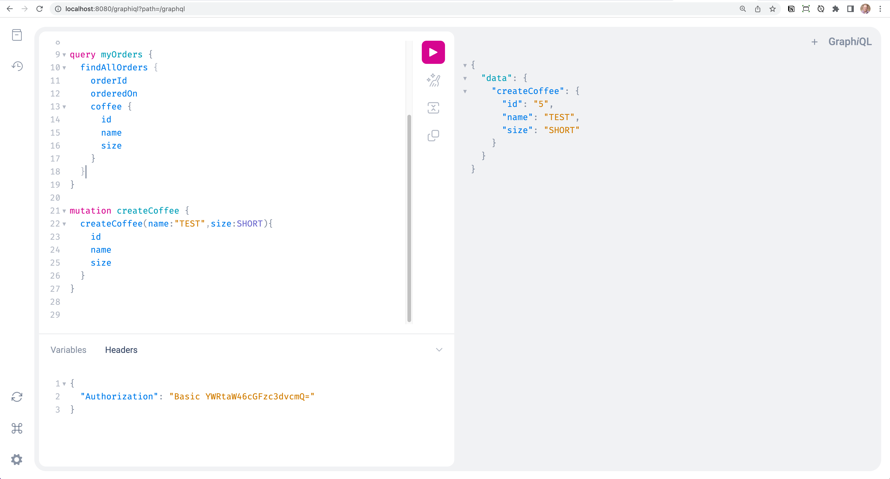
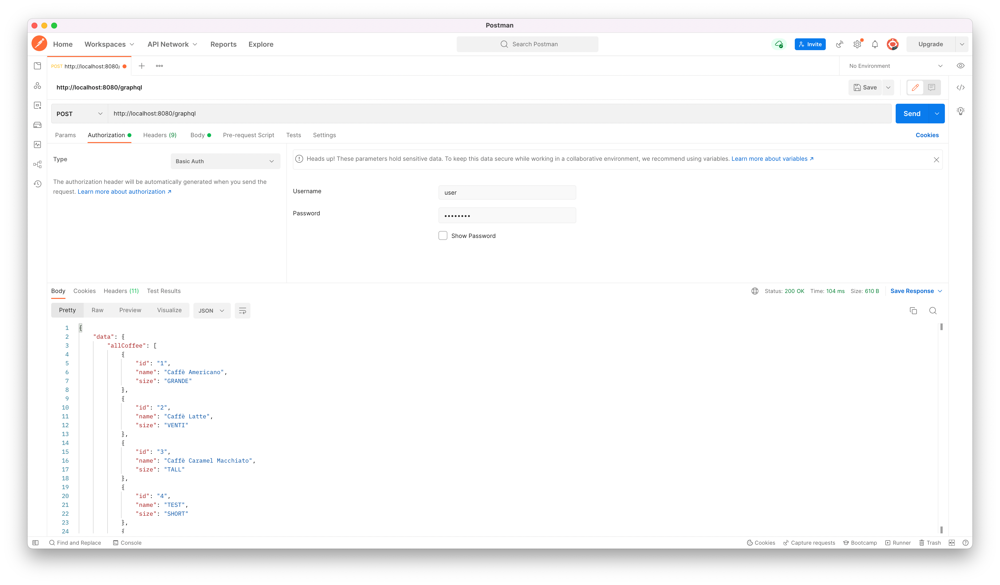

In a [previous guide](https://tanzu.vmware.com/developer/guides/spring-for-graphql/), I taught you how to create your first GraphQL API in Spring using Spring for GraphQL. This guide will walk you through the process of securing your APIs using Spring Security. If you have ever gone through the process of securing a REST API you will find this process slightly different.

For starters, there is a single entry point (`/graphql` by default) to your API. You can certainly secure that endpoint to make sure only authenticated users can access your API but how do you apply a more fine-grained control to individual queries or mutations? Those are the questions I will answer in this guide and by the end of it, you will be able to secure your GraphQL API with Spring Security.

## Prerequisites

Please review the prerequisites before going through this guide.

- This guide assumes that you have read my previous guide on “[Getting Started with Spring for GraphQL](https://tanzu.vmware.com/developer/guides/spring-for-graphql/)”.
- This guide will follow the [code in this branch](https://github.com/danvega/javabacks-secure/tree/start-here). Starting from scratch would just duplicate what we covered in the previous guide.
- You have a basic understanding of Spring Security.

## Guide

This guide is broken down into the following sections:

- Authentication vs Authorization
- Getting Started
- Spring Security Configuration
- Spring Security Method Security
- Authenticated Principal
- Conclusion

### Authentication vs Authorization

Any time we talk about security, I like to ensure we are all on the same page with some terms in this space. When it comes to security you will hear the terms authentication and authorization used a lot so it’s important you understand the meaning of each.

**Authentication** is the process or action of proving or showing something to be true, genuine, or valid. There are various authentication mechanisms to validate that the user is in fact who they say they are. In this tutorial, we will keep it simple and use HTTP Basic which is built into the browser.

When you know you have a valid user you need to know what permissions that user has. **Authorization** asks if the authenticated user has permission to perform a specific request. In real-world applications, there are different roles in a system and those users have different types of permissions.

### Getting Started

To get started with this tutorial and to follow along with the code you can check out the `start-here` branch in [this repository](https://github.com/danvega/javabacks-secure). If you open up `pom.xml` you will see the Spring Boot Starter Security dependency. This is what will be added to your project when you select Spring Security from the [Spring Initializr](https://start.spring.io/) but you can always add this dependency manually to an existing application. This starter contains all of the dependencies, configuration, and sensible defaults to secure your application.

```xml
<dependency>
    <groupId>org.springframework.boot</groupId>
    <artifactId>spring-boot-starter-security</artifactId>
</dependency>
```

Spring Security takes a secure-by-default approach. This means that all of your routes will be locked down by default and you will need to open the up for traffic as needed. There is a default user with a username of `user` and the default password that is generated during startup. This ensures that you don’t take the application as is to production with a user's password that can be found. When you run the application you should see a generated password in the console:

```bash
.   ____          _            __ _ _
 /\\ / ___'_ __ _ _(_)_ __  __ _ \ \ \ \
( ( )\___ | '_ | '_| | '_ \/ _` | \ \ \ \
 \\/  ___)| |_)| | | | | || (_| |  ) ) ) )
  '  |____| .__|_| |_|_| |_\__, | / / / /
 =========|_|==============|___/=/_/_/_/
 :: Spring Boot ::                (v2.7.3)

2022-08-26 16:20:15.138  INFO 75864 --- [           main] c.e.j.JavabacksSecureApplication         : Starting JavabacksSecureApplication using Java 17.0.1 on Dans-MacBook-Pro-M1-MAX.local with PID 75864 (/Users/vega/dev/tanzu/javabacks-secure/target/classes started by vega in /Users/vega/dev/tanzu/javabacks-secure)
2022-08-26 16:20:15.139  INFO 75864 --- [           main] c.e.j.JavabacksSecureApplication         : No active profile set, falling back to 1 default profile: "default"
2022-08-26 16:20:15.454  INFO 75864 --- [           main] o.s.b.w.embedded.tomcat.TomcatWebServer  : Tomcat initialized with port(s): 8080 (http)
2022-08-26 16:20:15.458  INFO 75864 --- [           main] o.apache.catalina.core.StandardService   : Starting service [Tomcat]
2022-08-26 16:20:15.458  INFO 75864 --- [           main] org.apache.catalina.core.StandardEngine  : Starting Servlet engine: [Apache Tomcat/9.0.65]
2022-08-26 16:20:15.496  INFO 75864 --- [           main] o.a.c.c.C.[Tomcat].[localhost].[/]       : Initializing Spring embedded WebApplicationContext
2022-08-26 16:20:15.496  INFO 75864 --- [           main] w.s.c.ServletWebServerApplicationContext : Root WebApplicationContext: initialization completed in 341 ms
2022-08-26 16:20:15.514  INFO 75864 --- [           main] c.e.j.controller.CoffeeController        : All Coffees: [Coffee[id=1, name=Caffè Americano, size=GRANDE], Coffee[id=2, name=Caffè Latte, size=VENTI], Coffee[id=3, name=Caffè Caramel Macchiato, size=TALL]]
2022-08-26 16:20:15.723  INFO 75864 --- [           main] s.b.a.g.s.GraphQlWebMvcAutoConfiguration : GraphQL endpoint HTTP POST /graphql
2022-08-26 16:20:15.758  WARN 75864 --- [           main] .s.s.UserDetailsServiceAutoConfiguration :

Using generated security password: 916d5af2-1f29-4ffd-884f-e28ba3b8bec5

This generated password is for development use only. Your security configuration must be updated before running your application in production.

2022-08-26 16:20:15.787  INFO 75864 --- [           main] o.s.s.web.DefaultSecurityFilterChain     : Will secure any request with [org.springframework.security.web.session.DisableEncodeUrlFilter@798deee8, org.springframework.security.web.context.request.async.WebAsyncManagerIntegrationFilter@96897c8, org.springframework.security.web.context.SecurityContextPersistenceFilter@4d98e41b, org.springframework.security.web.header.HeaderWriterFilter@4fba8eec, org.springframework.security.web.csrf.CsrfFilter@49cd946c, org.springframework.security.web.authentication.logout.LogoutFilter@1cb9ef52, org.springframework.security.web.authentication.UsernamePasswordAuthenticationFilter@32256e68, org.springframework.security.web.authentication.ui.DefaultLoginPageGeneratingFilter@6acffb2d, org.springframework.security.web.authentication.ui.DefaultLogoutPageGeneratingFilter@7f97bc14, org.springframework.security.web.authentication.www.BasicAuthenticationFilter@5b251fb9, org.springframework.security.web.savedrequest.RequestCacheAwareFilter@5696c927, org.springframework.security.web.servletapi.SecurityContextHolderAwareRequestFilter@7459a21e, org.springframework.security.web.authentication.AnonymousAuthenticationFilter@22d8f4ed, org.springframework.security.web.session.SessionManagementFilter@611e5819, org.springframework.security.web.access.ExceptionTranslationFilter@7455dacb, org.springframework.security.web.access.intercept.FilterSecurityInterceptor@76437e9b]
2022-08-26 16:20:15.808  INFO 75864 --- [           main] o.s.b.w.embedded.tomcat.TomcatWebServer  : Tomcat started on port(s): 8080 (http) with context path ''
2022-08-26 16:20:15.813  INFO 75864 --- [           main] c.e.j.JavabacksSecureApplication         : Started JavabacksSecureApplication in 0.8 seconds (JVM running for 1.146)
```

In the previous guide, you saw how you could access a UI tool for validating your queries by going to [http://localhost:8080/graphiql](http://localhost:8080/graphiql).  With the application up and running try and visit that URL and you will be presented with a login form. This form is provided by Spring Security and is asking you for a username and password. If you enter the username of `user` and the generated password you should be able to see GraphiQL playground. Without configuring anything on your end Spring Security has provided you with some sensible defaults to get you up and running.

### Spring Security Configuration

What Spring Security gives us out of the box is a great start but at some point, you will need to configure it to fit the needs of your application. This used to be done by creating a class that extended the `WebSecurityConfigurerAdapter` abstract class. If you’re using Spring Security 5.7+ which is what Spring Boot 2.7+ ships with, that class has been deprecated. I [created a video](https://youtu.be/s4X4SJv2RrU) that covers those changes if you’re interested in learning more about them.

To configure Spring Security going forward we encourage users to move to a component-based configuration. In the `config` package create a new class called `SecurityConfig` and annotate it with `@Configuration` and `@EnableWebSecurity`

```java
@Configuration
@EnableWebSecurity
public class SecurityConfig {

}
```

The new approach to the configuration can be achieved by creating a bean of type `SecurityFilterChain` and configuring `HttpSecurity`.

```java
@Bean
public SecurityFilterChain configure(HttpSecurity http) throws Exception {
    return http
            .csrf(csrf -> csrf.disable()) // (1)
            .authorizeRequests( auth -> {
                auth.anyRequest().authenticated(); // (2)
            })
            .sessionManagement(session -> session.sessionCreationPolicy(SessionCreationPolicy.STATELESS)) // (3)
            .httpBasic(withDefaults()) // (4)
            .build();
}
```

1. Disable Cross-Site Request Forgery (CSRF)
2. The user should be authenticated for any request in the application.
3. Spring Security will never create an HttpSession and it will never use it to obtain the Security Context
4. Spring Security’s HTTP Basic Authentication support is enabled by default. However, as soon as any servlet based configuration is provided, HTTP Basic must be explicitly provided.

With this configuration in place restart the application and visit [http://localhost:8080/graphiql](http://localhost:8080/graphiql) and you will be presented with a browser login dialog. If you enter the username `user` and the generated password from the console you should be able to see the GraphiQL tool.

{}
**Note**: I know what you’re probably thinking right now. You might be inclined to add a rule for `/graphiql` so that you don’t need to be authenticated. I thought the same thing but quickly came across an issue. When the GraphiQL tool loads it attempts to make a `POST` to `/graphql`. You would also need to allow that but given that it is the single entry point to all queries you wouldn’t want to do that. I considered getting the environment and as long as it wasn’t prod adding those `mvcMatchers` but at the end of the day I felt like locking everything down was the more responsible approach.
{}

### Managing Users

So far in your application, you have used the default user and a generated password. In a more realistic application, you might have multiple users with different roles or permissions. Remember authentication is the act of validating the user is who they say they are and authorization will validate that the user has permission to access the requested resource.

The quickest way to configure users is by creating in-memory users. While this is great for demo purposes this probably isn’t something you will do in production. When you’re creating users you need a way to encode the user's password. In the following example, you will use the default password encoder which is **NOT** something you should use in production.

```java
@Bean
public InMemoryUserDetailsManager userDetailsManager() {

    UserDetails user = User.withDefaultPasswordEncoder() // (1)
            .username("user")
            .password("password")
            .roles("USER")
            .build();

    UserDetails admin = User.withDefaultPasswordEncoder() // (2)
            .username("admin")
            .password("password")
            .roles("USER","ADMIN")
            .build();

    return new InMemoryUserDetailsManager(user, admin); // (3)
}
```

1. Create a new user with the username of `user` and a password of `password` using the default password encoder. This user will have the `ROLER_USER` role.
2. Create a new user with the username of `admin` and a password of `password` using the default password encoder. This user will have both the `ROLE_USER` and `ROLE_ADMIN` roles.
3. The `InMemberUserDetailsManager` takes a var args of users to create so this could be 1 or many.

With your new users in place, you can restart the application and visit [http://localhost:8080/graphiql](http://localhost:8080/graphiql). When you are presented with a login dialog you can enter either of the users that you created above. If you look in the console you will also notice that there is no longer a randomly generated password. Once you create your own users the default user that Spring Security set up for you no longer exists. In a production-ready environment, your users might come from a database, LDAP system, or another service but to keep this example simple you will use the in-memory users.

### Spring Security Method Security

Now that you can authenticate using either user or admin it's time to focus on the authorization.  If you open up `CoffeeController` you will notice there are 2 methods. The `findAll` method will return all of the coffee products in the system. This seems like something anyone with the `USER` role should have access to. The `create` method will create a new product in the system and this seems like a method you should restrict to only users with the `ADMIN` role.

```java
@QueryMapping(value = "allCoffee")
public List<Coffee> findAll() {
    return coffeeService.findAll();
}

@MutationMapping(value = "createCoffee")
public Coffee create(@Argument String name, @Argument Size size) {
    return coffeeService.create(name,size);
}
```

In a REST application, you could set rules for specific controllers or paths that a particular role is required. This won’t work in a GraphQL API because everything falls under a single endpoint `/graphql`. Not to worry though there is a solution that involves enabling Spring Security’s method level security.  You can enable the use of the `@PreAuthorize` and `@Secured` annotations by using the following `@EnableMethodSecurity` annotation on the `SecurityConfig` class:

```java
@Configuration
@EnableWebSecurity
@EnableMethodSecurity(securedEnabled = true)
public class SecurityConfig {

	// ...

}
```

Now that method security is enabled you can use either of those annotations in your controller. The `@Secured` annotation is used to define a list of security configuration attributes for business methods. The `@PreAuthorize` annotation is for specifying a method access-control expression which will be evaluated to decide whether a method invocation is allowed or not. Both will work but I thought I would just show examples of each here.

```java
@Secured("ROLE_USER")
@QueryMapping(value = "allCoffee")
public List<Coffee> findAll() {
    return coffeeService.findAll();
}

@PreAuthorize("hasRole('ADMIN')")
@MutationMapping(value = "createCoffee")
public Coffee create(@Argument String name, @Argument Size size) {
    return coffeeService.create(name,size);
}
```

With these method-level security annotations in place, a user with the role of `USER` should be able to view all coffee products in the system but should not be able to create one. If you log in as a user with a role of `ADMIN` you should be able to view all coffee products and create new ones. Now you just need a way to test this out.

Restart your application and visit [http://localhost:8080/graphiql](http://localhost:8080/graphiql). You will be prompted for a username and password, start by entering `user` and `password` to log in with the role of `USER`. Each time you execute a query from the GraphiQL tool your HTTP Basic auth credentials will be sent along in the browser with the request. This means that you should be able to perform a query for all coffee products:

```graphql
query allCoffee {
  allCoffee {
    id
    name
    size
  }
}
```

 But if you try and create a new coffee you should receive a `403: Unauthorized` error

```graphql
mutation createCoffee {
  createCoffee(name:"TEST",size:SHORT){
    id
    name
    size
  }
}
```

If you open up a new window in incognito mode and log in as admin you should be able to list all coffee products as well as create new ones.

{}
**Note**: If you type in `chrome://restart` in the address bar of Chrome it will restart Chrome and your HTTP Basic login will be reset and you can enter in new authentication details.
{}

There is also a way to override whatever user you are logged in as. At the end of the day, HTTP Basic is simply sending a Base 64 encoded version of `username:password` in the `Authorization` header.

In the GraphiQL UI, you can click the headers tab below the mutation and add your own header. In this example, I logged in as `user` but I am sending the `admin` credentials in the header.



You can also test your queries with basic authentication in Postman



### Authenticated Principal

Another scenario you might need to solve for is finding out who the logged-in user is. Let’s take the example of orders in our sample application. When I log in as a user and execute a query to find all orders I would expect to find all of the orders that belong to me, not every single order in the system.

If you open up `OrderController.java` you will notice the method `findAllOrders`. Currently, this method calls a method `findAll` in the `OrderService`. This isn’t exactly what you want because it will return all the orders in the collection.

```java
@QueryMapping
public List<Order> findAllOrders() {
    return orderService.findAll();
}
```

If you look in `OrderService` you will notice there is a method to find all orders by username:

```java
public List<Order> findAllByUsername(String username) {
    return orders.stream().filter(order -> order.user().username().equals(username)).toList();
}
```

To make your application work you just need a way to access the currently authenticated user in the controller. Schema mapping handler methods can have access to a [number of method arguments](https://docs.spring.io/spring-graphql/docs/current/reference/html/#controllers-schema-mapping-signature). One argument that is available is the `java.security.Principal` argument which is obtained from the Spring Security context, if available. With this argument, you can change the find all orders method to call the correct service method and retrieve only orders for the authenticated user.

```java
@QueryMapping
public List<Order> findAllOrders(Principal principal) {
    return orderService.findAllByUsername(principal.getName());
}
```

If you restart your application, visit [http://localhost:8080/graphiql](http://localhost:8080/graphiql) and log in with `user` and `password`. This user has 1 of the 3 orders in the system. This means that when you execute the following query you should only see 1 order and not all 3.

```graphql
query myOrders {
  findAllOrders {
    orderId
    orderedOn
    coffee {
      id
      name
      size
    }
  }
}
```

Logged in as user `user`

```json
{
  "data": {
    "findAllOrders": [
      {
        "orderId": "1",
        "orderedOn": "2022-08-30T13:52:05.505468-04:00",
        "coffee": {
          "id": "1",
          "name": "Caffè Americano",
          "size": "GRANDE"
        }
      }
    ]
  }
}
```

Logged in as user `admin`

```json
{
  "data": {
    "findAllOrders": [
      {
        "orderId": "2",
        "orderedOn": "2022-08-30T13:52:05.50609-04:00",
        "coffee": {
          "id": "2",
          "name": "Caffè Latte",
          "size": "VENTI"
        }
      },
      {
        "orderId": "3",
        "orderedOn": "2022-08-30T13:52:05.506101-04:00",
        "coffee": {
          "id": "2",
          "name": "Caffè Latte",
          "size": "VENTI"
        }
      }
    ]
  }
}
```

## Conclusion

Security is hard and this is not a problem you would want to try and tackle on your own. The good thing for you is you have a tried and tested framework like Spring Security to reach for. The [Spring for GraphQL documentation](https://docs.spring.io/spring-graphql/docs/current/reference/html/) is packed with a ton of great information and this is where I would begin if you want to learn more about building GraphQL APIs with Spring for GraphQL. If you’re new to Spring Security check out the reference documentation for an in-depth guide to securing all of your applications.
