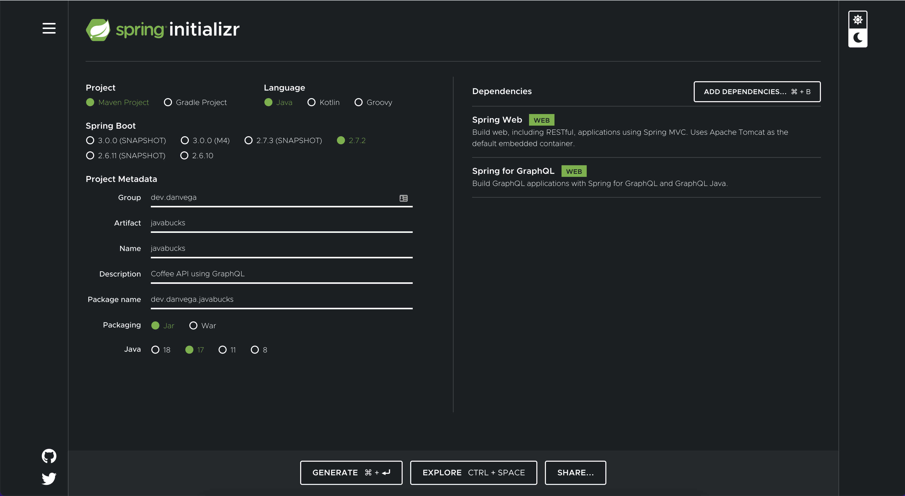
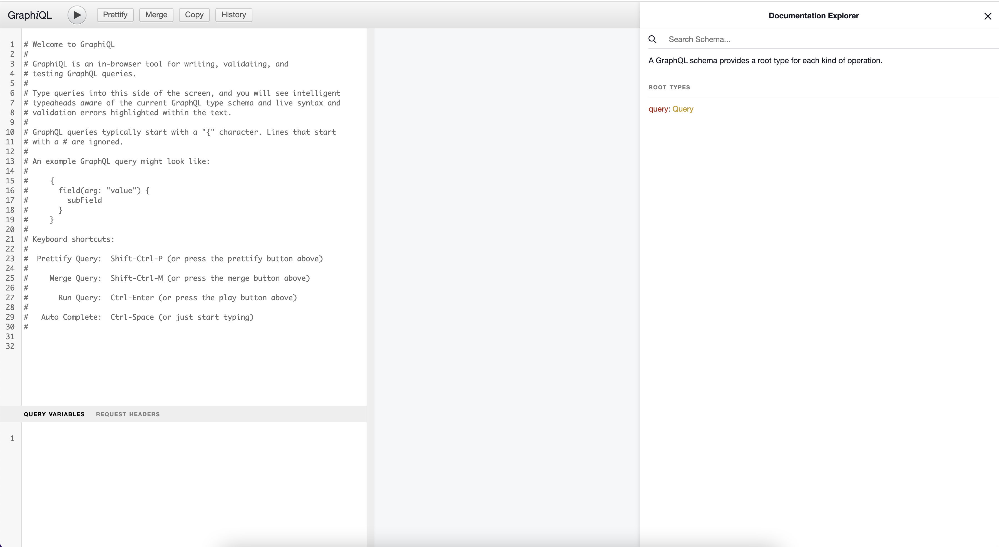

In this guide, you will learn what GraphQL is, why you should reach for it in your next project, and learn how to leverage it using [Spring for GraphQL](https://spring.io/projects/spring-graphql). Spring for GraphQL is built on top of GraphQL Java and is the result of a joint collaboration between GraphQL Java and the Spring engineering team. The word graph in GraphQL is used to describe how we represent data in our applications through a graph-like data structure that contains a series of nodes and relationships.

## Why GraphQL?

If you’re currently building REST APIs and haven’t run into any issues, maybe GraphQL isn’t for you. Chances are though, as your requirements and the number of clients connecting to your APIs have grown so did the complexity of managing them.

In your REST APIs, you might have resources like products, orders, reviews, and customers. Each time a new client needs to communicate with that resource you might create a custom endpoint that returns the data in the particular format that the client needs it. This can lead to high coupling and cohesion, on top of it being a maintenance nightmare.

GraphQL is all about decoupling APIs from their clients by flipping the control and letting the clients determine what the shape of the data should look like. Through this process, the client and the server become more independent pieces of software and much easier to iterate on and maintain.

GraphQL was created by Facebook and now powers many applications on Facebook and Instagram. Outside of Facebook GraphQL is used by teams of all sizes in many different environments and languages to power mobile apps, websites, and APIs. You will find GraphQL used at Airbnb, Github, Lyft, PayPal, Shopify, Starbucks, The New York Times, and Twitter to name a few.

## What is GraphQL?

The word graph in GraphQL describes a way to represent your data in a graph-like data structure. The `QL` stands for query language and is a way for the client to query your API. GraphQL is a query language for your API and a server-side runtime for executing queries using a type system you define for your data. It is an alternative to REST & SOAP and in most cases will replace those, not sit alongside them.

GraphQL **isn't tied to any specific database or storage engine** and is instead backed by your existing code and data. This is an important concept to understand so we should start there.

In your existing applications, your REST APIs are not tied to any specific database. In your Rest Controller endpoints, you accept the arguments you need and in turn delegate them to a service or repository for the data. GraphQL is no different so if you’re asking questions like “How does GraphQL connect to my database” you’re asking the wrong ones.

GraphQL was created back in 2012 by Facebook. They were facing some of the same problems that you might be dealing with today. With mobile on the rise and in some cases dominating traffic, they needed a way to return different data sets to mobile and desktop. With mobile, they had a different set of constraints like screen size, battery life, and connection speed that they didn’t have on the desktop.

GraphQL was open-sourced back in 2015 and is now governed by a [neutral foundation](https://graphql.org/foundation/) made up of some really great companies. You will find implementations of the [GraphQL Spec](https://spec.graphql.org/) in almost every language. This means that after you learn it on the Java side you should be able to move over to another language like JavaScript and be able to get up and running quickly.

## Spring for GraphQL

The best way to learn about GraphQL is to build something with it. In this section, you will learn how to build a new Spring Boot Application with Spring for GraphQL. Through this process, you will learn the fundamentals of GraphQL.

### Before You Begin

Things you need to do before getting started

- JDK 17 (JDK 17 if you want to use the Records in the GitHub example code)
- Basic understanding of how Spring Boot apps work

The final code for this guide can be located [on GitHub](https://www.github.com/danvega).

### Getting Started

To build your first GraphQL API head over to [start.spring.io](http://start.spring.io/) and while you’re there you might as well bookmark it 😉 Create a new project using Java 17+, Spring Boot 2.7+ and select the following dependencies:

- Spring Web
- Spring GraphQL



### The Data Layer

GraphQL isn’t tied to any specific database and is backed by your existing code + data. To demonstrate this you are going to create an application that isn’t tied to any specific database and hold its data in memory.

The application is called `JavaBucks` and manages a Coffee API. To get started you will need to model the *Coffee* and *Size* objects. You could write a normal class with constructors, getters & setters, equals & hash code, and a toString, or you can save yourself some keystrokes and use a Record type thanks to us selecting a modern JDK like 17.

```java
public record Coffee(Integer id, String name, Size size) {

}
```

```java
public enum Size {
    SHORT,
    TALL,
    GRANDE,
    VENTI
}
```

Now that you have your data models in place you need a way to store data and retrieve it. With Spring data you could connect to a database quickly to retrieve and persist data. To keep this simple and less focused on the data layer we are going to remove the database and store the data in a collection.

Create a `CoffeeService` class using the following code:

```java
@Service
public class CoffeeService {

    private List<Coffee> coffees = new ArrayList<>();
    AtomicInteger id = new AtomicInteger(0);

    public List<Coffee> findAll() {
        return coffees;
    }

    public Optional<Coffee> findOne(Integer id) {
        return coffees.stream().filter(coffee -> coffee.id() == id).findFirst();
    }

    @PostConstruct
    private void init() {
        coffees.add(new Coffee(id.incrementAndGet(), "Caffè Americano", Size.GRANDE));
        coffees.add(new Coffee(id.incrementAndGet(), "Caffè Latte", Size.VENTI));
        coffees.add(new Coffee(id.incrementAndGet(), "Caffè Caramel Macchiato", Size.TALL));
    }
}
```

The `@PostConstruct` annotation will tell Spring to run this method after the class has been initialized and will add 3 coffees to the collection.

### GraphQL Schema

With your data layer in place, it’s time to turn your attention to the GraphQL schema. By convention, Spring will look for GraphQL Schema's in the `/src/main/resources/graphql` directory which is configurable but for this example, you will use the default. Create a new file `schema.graphqls` in that directory with the following content:

```graphql
type Coffee {
    id: ID!
    name: String
    size: Size
}

enum Size {
    SHORT,
    TALL,
    GRANDE,
    VENTI
}
```

If this is the first time you’re seeing a GraphQL schema you can probably guess what’s going on here. That is because the GraphQL schema is built on a simple static type system.

- The values on the left are the field names
- The values on the right are the types
    - Coffee and Size are **Object Types** that you define
    - ID and String are built-in Scalar types
- The `!` simply tells us that you can always expect a value back and will never need to check for null.
- The schema supports Enums, Lists, Interfaces, and [more](https://graphql.org/learn/).

**Object Types**

Object types and fields are common types that you will work with in every GraphQL Schema. In the example above, the Object Types are identical to the models you defined on the Java side. This won’t always be the case because you might now want to expose everything in your API.

**Scalar Types**

As you learned in the previous section there are built-in Scalar types. GraphQL comes with the following types out of the box:

- `Int`: A signed 32-bit integer.
- `Float`: A signed double-precision floating-point value.
- `String`: A `UTF-8` character sequence.
- `Boolean`: `true` or `false`.
- `ID`: The ID scalar type represents a unique identifier, often used to re fetch an object or as the key for a cache. The ID type is serialized in the same way as a String; however, defining it as an `ID` signifies that it is not intended to be human-readable.

If you need to define a custom type like a date you can do so but this needs to be configured on the server side. GraphQL Java comes with some [additional Scalar Types](https://www.notion.so/Getting-started-with-Spring-for-GraphQL-9e17a62b25e843658bdd07a3beef6e62) as well as the ability to define your own.

### Root Operation Types

After you have set up your object types you will need a way to read and write data from your API. There are 3 root operation types in GraphQL:


- **Query**: Used to read data
- **Mutation**: Used to create, update and delete data
- **Subscription**: Similar to a query allowing you to fetch data from the server. Subscriptions offer a long-lasting operation that can change their result over time.

The following defines the Query operations in your schema. The values on the left are the field names (query names) and the values on the right are the return type. In the first example, the brackets around `Coffee` simply mean that it could return more than 1. Add the following code to `schema.graphqls`

```graphql
type Query {
    findAll: [Coffee]!
    findById(id: ID!): Coffee
}
```

**Arguments**

Each field on a GraphQL object type can have one or more arguments. The `findOne` query above defines a single argument of type ID. The `!` states that the ID can’t be null and must be supplied. Arguments a powerful feature of GraphQL because each nested type can contain arguments which allows you traverse the whole graph in a single query.

### GraphQL Controllers

With the GraphQL schema in place, it’s time to create a controller. When you created this project you selected Spring Web (MVC) as a dependency. The first thing you need to create a new `CoffeeController` with the following code. The `@Controller` annotation is how Spring will find your controller and look for methods to map to your schema.

```java
@Controller
public class CoffeeController {

    private final CoffeeService coffeeService;

    public CoffeeController(CoffeeService coffeeService) {
        this.coffeeService = coffeeService;
    }

    public List<Coffee> list() {
        return coffeeService.findAll();
    }

    public Optional<Coffee> get(@Argument Integer id) {
        return coffeeService.findOne(id);
    }

}
```

Remember GraphQL isn’t tied to a specific datastore so you will delegate that responsibility to the Coffee Service. To get an instance of the coffee service you will create a new final field that will get autowired through constructor injection.

Now that you have a controller that has methods that can retrieve data you need a way to map each method to the queries defined in the schema. Spring needs to know that when someone posts a request to the `/graphql` endpoint for the query `findAll` that you want the list method to be executed.

You can do this by using the `@SchemaMapping` annotation and supplying a couple of arguments. The first argument is the type of operation and in this case, it would be Query. Remember there are three main operation types: ***Query***, ***Mutation***, and ***Subscription***. The second argument is the field name of the query defined in the GraphQL schema.

```java
@SchemaMapping(typeName = "Query", value = "findAll")
public List<Coffee> list() {
    return coffeeService.findAll();
}
```

This will work but you’re going to be creating a lot of mappings like this and that is a little bit too much typing for my liking. In a REST controller, you have a `@RequestMapping` and specialized composed annotations like `@GetMapping`, `@PostMapping`, and so on. In GraphQL you also have specialized annotations like `@QueryMapping`,`@MutationMapping`, and `@SubscriptionMapping`. If you use `@QueryMapping` you can omit the type argument and if you name the method the same as the query name in the GraphQL schema you can omit the value argument. This means that you can take the annotation from above and reduce it to the following:

```java
@QueryMapping
public List<Coffee> findAll() {
    return coffeeService.findAll();
}
```

This should be everything you need but how can you validate that everything is working? You can run the application to make sure there are no errors during startup so let’s do that now. As long as everything ran without error you should have what you need to move forward.

You now have everything in place on the server side to start writing queries on the client side. In the next section, you will learn how to write and validate your queries.

### GraphQL Query Language

Up until this, point you have focused on the server side of the client + server communication. With everything in place on the server, it’s time to focus on the client. Spring for GraphQL comes with a graphical UI called GraphiQL. GraphiQL is an in-browser tool for writing, validating, and testing GraphQL queries. For security reasons, this is disabled by default but you can enable it by setting the following property in `application.properties`:

```java
spring.graphql.graphiql.enabled=true
```

If you run your application and visit [http://localhost:8080/graphiql](http://localhost:8080/graphiql) you should see something similar to this:



There is some default help text that you should go through to familiarize yourself with how to use this tool. Something I have really enjoyed about working with GraphQL is the developer tooling and experience. If you look at the right side of this tool you can explore the schema. The root operation types available in the API will be listed and if you click on ***Query*** you will find the 2 queries you defined in your schema.

If you click on ***Coffee*** which is the return type you will see all of the fields available to you. This makes your GraphQL APIs self documenting and without having to talk to anyone you already have what you need to get started writing queries.

Remove the comments from the graphql editor on the left. It’s time to write your first query and it starts with the operation type and the field name. Notice as you start writing `findAll` you will get some code assistance from the IDE. This is because it’s reading the GraphQL schema and it knows what fields are available on each object.

```graphql
query {
	findAll {

	}
}
```

The `findAll` query returns a Coffee which contains 3 fields; id, name, and size. As you start to type these out the tool will also suggest what fields you can select from.

```graphql
query {
  findAll {
    id
    name
    size
  }
}
```

If you execute the query in the IDE you should see the following results in the pane next to the editor.

```json
{
  "data": {
    "findAll": [
      {
        "id": "1",
        "name": "Caffè Americano",
        "size": "GRANDE"
      },
      {
        "id": "2",
        "name": "Caffè Latte",
        "size": "VENTI"
      },
      {
        "id": "3",
        "name": "Caffè Caramel Macchiato",
        "size": "TALL"
      }
    ]
  }
}
```

The `findById` query is similar except this query takes an id as an argument. You can pass in an argument by name and this query will also return a Coffee.

```graphql
query {
  findById(id:1) {
    id
    name
    size
  }
}
```

Now in the results, you will only get a single coffee instead of all the rows.

```graphql
{
  "data": {
    "findById": {
      "id": "1",
      "name": "Caffè Americano",
      "size": "GRANDE"
    }
  }
}
```

In the SQL world when you want everything back you would write a SQL statement that would select all columns from a table. You can’t do that with GraphQL, you need to be very specific with what you want back. In the previous example, you selected all of the fields but given that you passed in the id as the argument you already know what that is. If you just want to get the name and size just ask for those fields in the result.

```graphql
query {
  findById(id:1) {
    name
    size
  }
}
```

```graphql
{
  "data": {
    "findById": {
      "name": "Caffè Americano",
      "size": "GRANDE"
    }
  }
}
```

## Conclusion

Congratulations on writing your first GraphQL API with Spring for GraphQL. In addition to writing your first GraphQL API you were able to write and validate queries on the client side using the built-in GraphiQL tool. There is more to learn when it comes to Spring for GraphQL so I would recommend visiting the amazing [documentation](https://docs.spring.io/spring-graphql/docs/current/reference/html) next.
