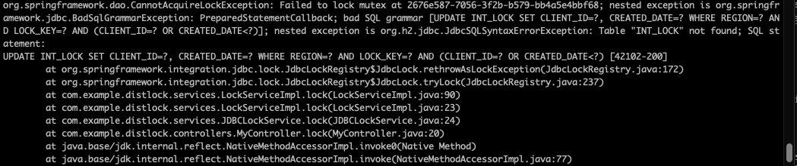
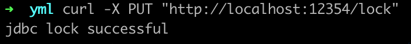
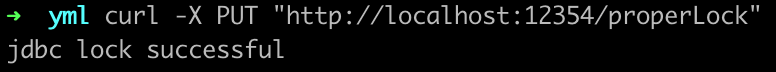
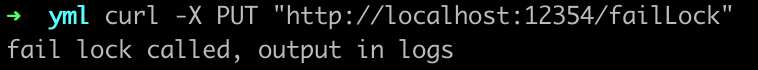
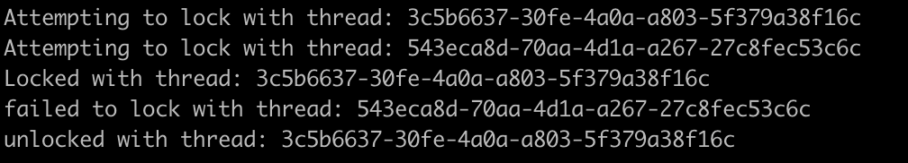

When designing microservices, the typical pattern is to design services that can handle multiple instances running at the same time. However, there are situations where processing only on a single service is preferable. For example, in the [Leader Pattern](https://docs.microsoft.com/en-us/azure/architecture/patterns/leader-election), you cannot synchronize if the code runs in different pods. As a result, you have to use an external method that is fraught with pitfalls during implementation[^1].

Thankfully, Spring has done a lot of the hard work. All you need to do is provide it with a database connection and it will create a distributed lock. This example will show the lock with both Redis and JDBC.

## Before You Begin

Before you begin, you are going to need the following:

- [Postgres](https://www.postgresql.org/) or [Redis](https://redis.io/)
- A text editor or IDE of choice.
  [JDK 16+](https://www.oracle.com/java/technologies/javase-downloads.html) or newer.(if you don't want to use the records that are setup in the example code Java 11+ will work)
- An understanding of Spring Boot and dependency injection.

Here is a [completed example on GitHub](https://github.com/estand64/distributed-lock) for you to view.

## Package Imports

To package imports, do the following:

1. Import the necessary Spring Integration packages into your `pom.xml` file.
2. Ensure all versions include the following:

   ```xml
   <dependency\>
       <groupId>org.springframework.boot</groupId>
       <artifactId>spring-boot-starter-integration</artifactId>
   </dependency>
   ```

3. Do one of the following:

   - If you are using `Redis`, import the following:

   ```xml
    <dependency>
       <groupId>org.springframework.boot</groupId>
       <artifactId>spring-boot-starter-data-redis</artifactId>
    </dependency>
    <dependency>
       <groupId>org.springframework.integration</groupId>
       <artifactId>spring-integration-redis</artifactId>
    </dependency>
    <dependency>
       <groupId>io.lettuce</groupId>
       <artifactId>lettuce-core</artifactId>
    </dependency>
   ```

   - If you are using `JDBC`, import the following:

     ```xml
     <dependency>
        <groupId>org.springframework.integration</groupId>
        <artifactId>spring-integration-jdbc</artifactId>
     </dependency>
     <dependency>
        <groupId>org.springframework.boot</groupId>
        <artifactId>spring-boot-starter-jdbc</artifactId>
     </dependency>
     <dependency>
        <groupId>org.postgresql</groupId>
        <artifactId>postgresql</artifactId>
     </dependency>
     ```

     The JDBC version of the distributed lock needs the database to have some tables and indexes set up in order to work. If you do not set these up the first time you attempt to obtain the lock, a JDBC Exception will be thrown. The current collection of SQL files for this can be found in the [Spring Integration JDBC github repo](https://github.com/spring-projects/spring-integration/tree/e901c89fef3eea00ddf6d503ae9926667a1d6972/spring-integration-jdbc/src/main/resources/org/springframework/integration/jdbc).

     In the following example, [Flyway](https://flywaydb.org/) runs the SQL script automatically. If you want to use this, you'll need to add the following dependency:

     ```xml
     <dependency>
        <groupId>org.flywaydb</groupId>
        <artifactId>flyway-core</artifactId>
     </dependency>
     ```

     If you don't run the script to populate the table, the following SQL exception will appear:

     

## Create a Lock Repository

Once you import the necessary packages, you can start setting up your code. The first order of business is to create the lock repository beans that will be used to grab the locks later.

### Redis

With the Redis version, you need to create a `String` name to represent the `LockRegistry`. To learn more about how the `@Bean` provides access to an object [look here](https://docs.spring.io/spring-boot/docs/2.0.x/reference/html/using-boot-spring-beans-and-dependency-injection.html).

```java
private static final String LOCK_NAME = "lock";

@Bean(destroyMethod = "destroy")
public RedisLockRegistry redisLockRegistry(RedisConnectionFactory redisConnectionFactory) {
    return new RedisLockRegistry(redisConnectionFactory, LOCK_NAME);
}
```

### JDBC

Do the following:

```java
@Bean
public DefaultLockRepository DefaultLockRepository(DataSource dataSource){
    return new DefaultLockRepository(dataSource);
}

@Bean
public JdbcLockRegistry jdbcLockRegistry(LockRepository lockRepository){
    return new JdbcLockRegistry(lockRepository);
}
```

## Setup A Controller

In order to interact with our lock, you'll need to set up a way to hit your code from the outside world. The easiest way is to set up a `RestController` with a few endpoints for you to hit.

Note: To do this the proper Spring way, you are going to have to inject our service class. Instructions are in the next section, Setup the Service Class.

```java
@RestController
@RequestMapping("/")
public class MyController {
    private final LockService lockService;

    public MyController(LockService lockService) {
        this.lockService = lockService;
    }

    @PutMapping("/lock")
    public String lock(){
        return lockService.lock();
    }

    @PutMapping("/properLock")
    public String properLock(){
        return lockService.properLock();
    }

    @PutMapping("/failLock")
    public String failLock(){
        lockService.failLock();
        return "fail lock called, output in logs";
    }
}
```

It's OK if you don't understand everything that's happening here. The important part is to realize that the follow endpoints are set up: `/lock`, `/properLock`, and `/failLock` and that these endpoints will call functions in the service class that you will set up in the next section.

## Setup the Service Class

1. Create a simple interface to match the methods that we have in our controller, created in the above section.

   ```java
       public interface LockService {
       String lock();
       void failLock();
       String properLock();
   }
   ```

2. Set up the service class that will contain the logic that you want to lock. To do this, create a new class that implements `LockService`. Make sure it looks similar to the following:

   - Redis:

     ```java
     @Service
     public class RedisLockService implements LockService{
         private static final String MY_LOCK_KEY = "someLockKey";
         private final LockRegistry lockRegistry;

         public RedisLockService(LockRegistry redisLockRegistry) {
             this.lockRegistry = redisLockRegistry;
         }
     }
     ```

   - JDBC:

     ```java
     @Service
     public class JDBCLockService implements LockService{
         private static final String MY_LOCK_KEY = "someLockKey";
         private final LockRegistry lockRegistry;

         public JDBCLockService(JdbcLockRegistry jdbcLockRegistry) {
             this.lockRegistry = jdbcLockRegistry;
         }
     }
     ```

Now, you might be wondering why you are injecting a 'LockRegistry' for the Redis implementation, but injecting a specific 'JDBCLockRegistry' for the JDBC implementation. In the case of the `RedisLockRegistry`, the class itself is `final`. If we inject that, we would have a hard time with most mocking frameworks when writing tests.

With the `JDBCLockRepository` it's easier to inject the actual class as you'll have two beans of type `LockRegistry` due to needing the `DefaultLockRepository` when initializing the `JDBCLockRepository` bean. Another option is to use Spring's `@Qualifier` to specify the registry you want. For more information, go to ([Qualifier Info](https://www.baeldung.com/spring-qualifier-annotation)).

## Obtain a Lock From the Repository

Moving forward, the Redis and JDBC code will look the same because you only need a `LockRegistry` object. Here is a basic use of the lock.

```java
private static final String MY_LOCK_KEY = "someLockKey";
/**
constructors from above omitted here
**/
public String lock(){
    var lock = lockRegistry.obtain(MY_LOCK_KEY);
    String returnVal = null;
    if(lock.tryLock()){
        returnVal = "jdbc lock successful";
    }
    else{
        returnVal = "jdbc lock unsuccessful";
    }
    lock.unlock();
    return returnVal;
}
```

Let's go over the key parts here.

- `lock = lockRegistry.obtain(MY_LOCK_KEY)`. Obtains the specific lock we want from the database. The documentation for the registry interface list the key as an `Object` but both the `RedisLockRegistry` and `JDBCLockRegistry` enforce that this must be a `String`. This also makes it easy to add an identifier to the key in the case where you only care about other instances running the same process for a specific item.
- `lock.tryLock()`. Locks up the lock object. It stops other instances from processing what we want to process.
- `lock.unlock()`. Unlocks the lock to prevent a deadlock.

Once you do this, run the code and call the endpoint. Everything should look the same.


## Use the Lock in Production

To use the lock in production, update the code as follows:

```java
    @Override
    public String properLock() {
        Lock lock = null;
        try {
            lock = lockRegistry.obtain(MY_LOCK_KEY);
        } catch (Exception e) {
            // in a production environment this should be a log statement
            System.out.println(String.format("Unable to obtain lock: %s", MY_LOCK_KEY));
        }
        String returnVal = null;
        try {
            if (lock.tryLock()) {
                returnVal =  "jdbc lock successful";
            }
            else{
                returnVal = "jdbc lock unsuccessful";
            }
        } catch (Exception e) {
            // in a production environment this should log and do something else
            e.printStackTrace();
        } finally {
            // always have this in a `finally` block in case anything goes wrong
            lock.unlock();
        }

        return returnVal;
    }
```

The most important change here is that `lock.tryLock()` has been moved inside a `try` block that has a `finally` condition that unlocks the lock. This is much better in that if the processing you do inside the lock fails and throws an exception the code still executes the `unlock()`. This also substantially cuts down the risk of causing a thread to hold the lock indefinitely and bring our processing across the system to a halt. If we call the `/propLock` endpoint, we'll get the same output as the simple lock.

Once you do this, run the code and call the endpoint. Everything should look the same.


## Failure to Lock

The most common reason for the lock to fail is because another instance locked the lock. This would take quite a bit of setup to pull off. We can however have two different threads try to grab this lock to show how it will fail, and also show how the time out version of `tryLock()` works. In this case, you'll want to set up two threads that have a time out to try to grab the lock. You'll also want to have a sleep time longer than that the wait time to cause one of the threads to fail.

```java
    public void failLock(){
        var executor = Executors.newFixedThreadPool(2);
        Runnable lockThreadOne = () -> {
            UUID uuid = UUID.randomUUID();
            StringBuilder sb = new StringBuilder();
            var lock = lockRegistry.obtain(MY_LOCK_KEY);
            try {
                System.out.println("Attempting to lock with thread: " + uuid);
                if(lock.tryLock(1, TimeUnit.SECONDS)){
                    System.out.println("Locked with thread: " + uuid);
                    Thread.sleep(5000);
                }
                else{
                    System.out.println("failed to lock with thread: " + uuid);
                }
            } catch(Exception e0){
                System.out.println("exception thrown with thread: " + uuid);
            } finally {
                lock.unlock();
                System.out.println("unlocked with thread: " + uuid);
            }
        };

        Runnable lockThreadTwo = () -> {/*is the same as lockThreadOne*/};
        executor.submit(lockThreadOne);
        executor.submit(lockThreadTwo);
        executor.shutdown();
    }
```

In here, you can see `trylock()` is no longer being called. Instead, `lock.tryLock(1, TimeUnit.SECONDS)` is being called. Unlike the original call, this version of the lock doesn't return false if it can't grab the lock right away, but it will keep attempting to lock every 100ms until it hits the time limit given (in this case 1 second). If it can't obtain the lock in that time frame, then will it return false. So, once this is up and running, calling the endpoint will result in the following:



With this being the output in the logs:


Here we can see that one of threads was able to grab the lock where then the other failed since it timed out.

## Testing

Mocking these out is easy. The only thing to remember is that you also need a mocked lock to give back to the call of `.obtain()`.

```java
private Lock lock = mock(Lock.class);
private JdbcLockRegistry registry = mock(JdbcLockRegistry.class);

// set to either true or false depending on what you're testing
when(lock.tryLock()).thenReturn(true);
when(registry.obtain(anyString())).thenReturn(lock);
```

## Wrapping Up

You should have a good understanding of how the Spring Distributed Lock works and how to use it. From here, you can take the sample code and fill in what the Redis service should look like, or try re-locking the lock from within the same thread (the outcome might not be what you expect). If you're feeling ambitious, you can even try running two instances to see how the lock performs when interacting with more than one instance.

[^1]: One of biggest pitfalls is to use the same lock across different services. If you do this it may result in a system wide race condition that is painful to solve.
