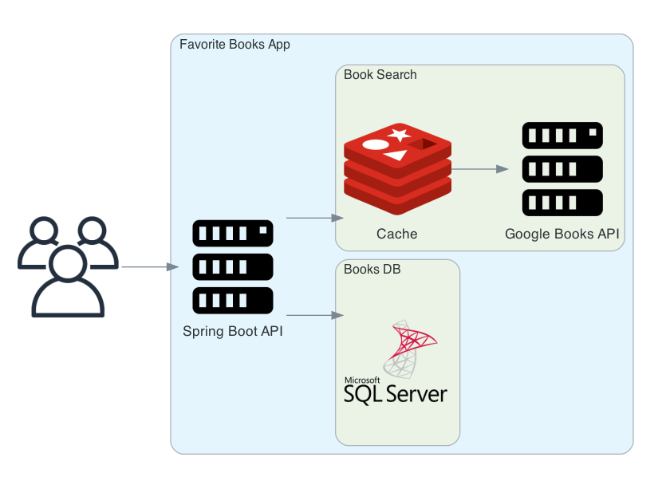
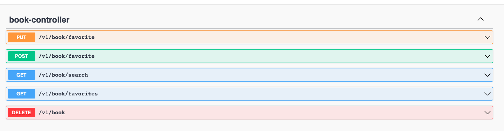
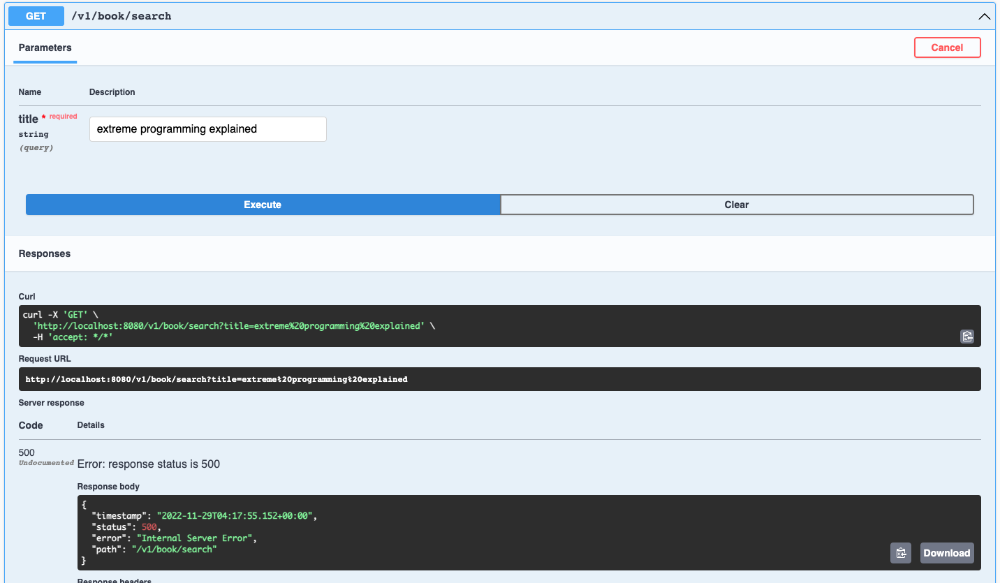
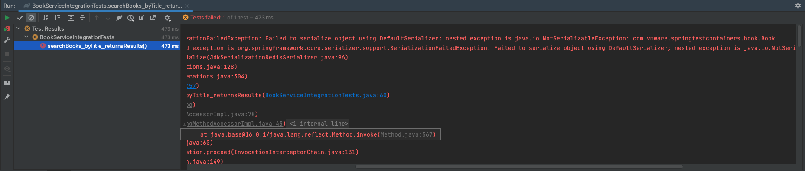

## Making your expectations meet reality

> The more your tests resemble the way your software is used, the more confidence they can give you. - Kent C. Dodds

When developers wade into the waters of test driven development, they are quickly met with the challenge of how to test interactions with external dependencies. For database integrations, some frameworks will provide you with an in-memory database to test against. In the case of interacting with caches or APIs, developers will often choose to mock the interface that calls the underlying dependency. These are both quick ways to get the expectations codified in our test to pass, but do these approaches reflect reality? Often, an in-memory database might not implement all of the behavior that the production database has, or the mock that was created for that API or cache might not cover the nuances of network interactions. This often leaves us with tests that don't resemble the way our software is used. This can be a worrisome spot to be in before deploying to production. How can we gain confidence that our code will work as expected when deployed? By using Testcontainers, developers can create a test environment with external dependencies that closely resemble production and inspire confidence in their integrations.


## What is Testcontainers?

[Testcontainers](https://www.testcontainers.org/) is a library that provides throwaway container instances in a test runtime in order to facilitate integration tests with real dependencies. These container instances can be used to run databases, web servers, message queues, and anything else that can be containerized. While the examples covered here are written for a Spring Boot application in Java, Testcontainers now supports other languages as well.

## How to Use Testcontainers

To start using Testcontainers, you will first need to add the library as a dependency in your project. You can do this by adding the following line to your build.gradle file (if you're using Gradle):

```groovy
testImplementation 'org.testcontainers:testcontainers:1.16.2'
```

Or your pom.xml file (if you're using Maven):

```xml
<dependency>
    <groupId>org.testcontainers</groupId>
    <artifactId>testcontainers</artifactId>
    <version>1.16.2</version>
    <scope>test</scope>
</dependency>
```

Once the dependency is added, Testcontainers can be utilized in a test by applying the following usage pattern:

1. Annotate your JUnit test class with the `@TestContainers` annotation:

```java
@DataJpaTest
@Testcontainers
...
public class BookmarkRepositoryTests {
   ...
}
```

2. Construct a container and annotate it with the `@Container` annotation:

```java
...
public class BookmarkRepositoryTests {

    @Container
    private static final MySQLContainer<?> mySQLContainer = new MySQLContainer<>("mysql")
        .withReuse(true);
    ...
}
```

3. Ensure your test is configured to use the container as a dependency.

In this case, we are linking the properties of the container to the relevant Spring properties via ContextConfiguration:

```java
...
@ContextConfiguration(initializers = {BookmarkRepositoryTests.Initializer.class})
public class BookmarkRepositoryTests {
    ...
    static class Initializer
        implements ApplicationContextInitializer<ConfigurableApplicationContext> {
        public void initialize(ConfigurableApplicationContext configurableApplicationContext) {
            TestPropertyValues.of(
                "spring.datasource.url=" + mySQLContainer.getJdbcUrl(),
                "spring.datasource.username=" + mySQLContainer.getUsername(),
                "spring.datasource.password=" + mySQLContainer.getPassword()
            ).applyTo(configurableApplicationContext.getEnvironment());
        }
    }
    ...
}
```

4. Execute your tests!

```java
@DataJpaTest
@Testcontainers
@ContextConfiguration(initializers = {BookmarkRepositoryTests.Initializer.class})
public class BookmarkRepositoryTests {
    ...
    @Test
    public void findAll_returnsAllBookmarks() {
        List<Bookmark> bookmarks = bookmarkRepository.findAll();

        List<Bookmark> expected = List.of(Bookmark.builder().id(1L).title("My First Bookmark!").build());

        assertThat(bookmarks).isEqualTo(expected);
    }

}
```

When executing the tests, the logs should show output indicating that the container specified is being spun up. If you are using Docker, you can also observe the containers being started and stopped by running a `watch docker ps` command in your terminal while the test is running. 

Let's go a little more in-depth by going through some realistic test examples with a Spring Boot application.

## Example with Spring Boot API

The following example application is a Spring Boot REST API that allows users to search for books and record their favorites. The application utilizes a SQL Server database to save, update and delete favorites. In order to search for books by title, the application calls out to the Google Books API and caches the results in Redis.



### Before You Begin

You can clone the project [here](https://github.com/ahaldeman/spring-testcontainers).

In order to run the project and all of its tests, you will need the following:

- JDK 11 or 17
- Docker, or another Docker-API compatible container runtime (required to run containers used in tests)

Once you have the JDK installed and Docker is running, you can build the project using Gradle:

```bash
$ ./gradlew build
```

The project can be run using a Shell script, which will use Docker Compose to spin up the application and its dependencies:

```bash
$ ./buildAndRun.sh
```

Once running, you can view the Swagger docs for the application by going to `http://localhost:8080/api-docs`:



This project also uses a series of git tags in order to guide you through the process of encountering problems and writing tests to solve them.

### Redis Integration

Redis is used in this application to cache the results received from the Google Books API. Let's check out the code from the following tag and run the tests:

```bash
$ git checkout has-redis-bug && ./gradlew test
```

#### The tests are passing, but is the app working?

The tests should have passed after checking out the code at the `has-redis-bug` tag, but what happens if we run the app and try out the `/v1/book/search` endpoint? 



The endpoint appears to be returning a `500` error! If we look at the logs, we can see the following:

```bash
api_1    | 2022-11-29 04:17:55.144 ERROR 1 --- [nio-8080-exec-1] o.a.c.c.C.[.[.[/].[dispatcherServlet]    : Servlet.service() for servlet [dispatcherServlet] in context with path [] threw exception [Request processing failed; nested exception is org.springframework.data.redis.serializer.SerializationException: Cannot serialize; nested exception is org.springframework.core.serializer.support.SerializationFailedException: Failed to serialize object using DefaultSerializer; nested exception is java.io.NotSerializableException: com.vmware.springtestcontainers.book.Book] with root cause
api_1    |
api_1    | java.io.NotSerializableException: com.vmware.springtestcontainers.book.Book
```

It looks like there is a serialization issue with the `Book` class. Digging further into the stacktrace, we can see that this issue occurs when trying to cache search results in Redis. We could simply implement the `Serializable` interface on `Book` to fix the issue, but why didn't the tests pick this up? Let's check `BookServiceTests.java` for more information.

```java
@ExtendWith(MockitoExtension.class)
class BookServiceTests {

    @Mock
    BookRepository bookRepository;

    @Mock
    GoogleBooksClient googleBooksClient;

    @Mock
    RedisTemplate<String, List<Book>> redisTemplate;

    @Mock
    ValueOperations<String, List<Book>> valueOperations;

    @InjectMocks
    BookService bookService;

    BookRandomizer bookRandomizer;

    @BeforeEach
    void setUp() {
        bookRandomizer = new BookRandomizer();
    }

    ...

    @Test
    void searchBook_cachesBooksWhenNotAlreadyCached() {
        List<Book> expected = bookRandomizer.randomBooks(2);

        when(googleBooksClient.searchBooksByTitle(any()))
            .thenReturn(expected);
        when(redisTemplate.opsForValue())
            .thenReturn(valueOperations);
        when(valueOperations.get(any()))
            .thenReturn(null);

        List<Book> books = bookService.searchBooks("some title");

        verify(valueOperations).set("some title", expected);
        assertThat(books).isEqualTo(expected);
    }

    @Test
    void searchBook_returnsCachedResultsWhenTheyAreAvailable() {
        List<Book> expected = bookRandomizer.randomBooks(2);

        when(redisTemplate.opsForValue())
            .thenReturn(valueOperations);
        when(valueOperations.get(any()))
            .thenReturn(expected);

        bookService.searchBooks("some title");

        verify(googleBooksClient, times(0)).searchBooksByTitle(anyString());
        verify(valueOperations, times(0)).set(anyString(), any());
    }
}
```

If we look at the existing tests around search and caching, we can see that they mock `RedisTemplate` and its operations and verify that the correct operations are called at the right times. Since the mocks are not executing anything against Redis, we are unable to see the serialization issues in the tests. An integration test here could help us recreate the bug and write the code to make the test pass.

#### Replicating the bug with Testcontainers

Check out the following:

```bash
$ git checkout fixing-redis-bug
```

Let's open up `BookServiceIntegrationTests.java`:

```java
@Testcontainers
@SpringBootTest
@ContextConfiguration(initializers = {BookServiceIntegrationTests.Initializer.class})
public class BookServiceIntegrationTests {

    BookRandomizer bookRandomizer;

    @MockBean
    GoogleBooksClient googleBooksClient;

    @Autowired
    BookService bookService;

    @Container
    private static final GenericContainer<?> redis = new GenericContainer<>(DockerImageName.parse("redis:alpine"))
        .withExposedPorts(6379);

    static class Initializer
        implements ApplicationContextInitializer<ConfigurableApplicationContext> {
        public void initialize(ConfigurableApplicationContext configurableApplicationContext) {
            TestPropertyValues.of(
                "spring.redis.port=" + redis.getMappedPort(6379)
            ).applyTo(configurableApplicationContext.getEnvironment());
        }
    }

    @BeforeEach
    void setUp() {
        bookRandomizer = new BookRandomizer();
    }

    @Test
    void searchBooks_byTitle_returnsResults() {
        when(googleBooksClient.searchBooksByTitle(anyString()))
            .thenReturn(bookRandomizer.randomBooks(2));

        List<Book> results = bookService.searchBooks("extreme programming explained");
        assertThat(results).hasSize(2);
    }
}
```

The code above creates a Redis container and connects the test environment to the container using an `ApplicationContextInitializer`. This commit also applies the fix required to make `Book` objects serializable in `Book.java`:

```java
@Builder(toBuilder = true)
@Data
@NoArgsConstructor
@AllArgsConstructor
@Entity(name = "book")
public class Book implements Serializable {
    ...
}
```

If we remove the `implements Serializable` from this class and run the following test in `BookServiceIntegrationTests.java`, we should see the test fail in the same way that our endpoint failed when we called it earlier:



Adding the `implements Serializable` back should cause the test to pass, and we now have confidence that the bug we saw in the production code is fixed and covered by our test suite.

### SQL Server Integration

Our SQL Server instance is responsible for persisting `Book` entities that are marked as "favorites". Let's say that a new requirement comes in to alter how books are persisted to include not only the ISBN-13 number, but also the ISBN-10. Let's checkout code at another tag that implements the requirement:

```bash
$ git checkout fail-db-tests 
```

#### Introducing a migration not compatible with H2

The existing `isbn` column in `Book` stores an ISBN-13, so we'll need to rename it to `isbn13` and create a new column called `isbn10`. We can do that with two migrations scripts:

`rename-isbn-column.sql`
```sql
EXEC sp_rename 'book.isbn', 'isbn13', 'COLUMN'
```

`add-isbn10-column.sql`
```sql
ALTER TABLE book ADD isbn10 VARCHAR(10) NOT NULL default '';
```

Once the `Book` class and other affected code is edited to account for the rename and new column, we can run the tests using `./gradlew test`. After the tests run, we should see five tests that all fail for the same reason:

```bash
Failed to load ApplicationContext
java.lang.IllegalStateException: Failed to load ApplicationContext
	...
Caused by: org.springframework.beans.factory.BeanCreationException: Error creating bean with name 'liquibase' defined in class path resource [org/springframework/boot/autoconfigure/liquibase/LiquibaseAutoConfiguration$LiquibaseConfiguration.class]: Invocation of init method failed; nested exception is liquibase.exception.LiquibaseException: liquibase.exception.MigrationFailedException: Migration failed for change set classpath:/db/changelog/db.changelog-master.yaml::rename-isbn-column::Alex Haldeman:
     Reason: liquibase.exception.DatabaseException: Syntax error in SQL statement "EXEC[*] SP_RENAME 'book.isbn', 'isbn13', 'COLUMN'"; expected "EXPLAIN, EXECUTE"; SQL statement:
EXEC sp_rename 'book.isbn', 'isbn13', 'COLUMN' [42001-200] [Failed SQL: (42001) EXEC sp_rename 'book.isbn', 'isbn13', 'COLUMN']
```

The root cause of this is that the underlying H2 database that the tests are running on does not support the SQL Server `sp_rename` stored procedure that is being used to rename the column. How can we accommodate for this in tests that exercise the repository? Again, the solution is Testcontainers!

#### Using Testcontainers to test with real database

Let's check out one last tag:

```bash
$ git checkout pass-db-tests
```

To see how we will implement Testcontainers for our data repository tests, let's take a look at `BookRepositoryTests.java`:

```java
@DataJpaTest
@AutoConfigureTestDatabase(replace = AutoConfigureTestDatabase.Replace.NONE)
public class BookRepositoryTests extends SQLServerTestBase {

    @Autowired
    BookRepository bookRepository;

    @BeforeEach
    void cleanUp() {
        bookRepository.deleteAll();
    }

    @Test
    void bookRepository_shouldInsertAndRetrieveABook() throws Exception {
        Book book = Book.builder()
            .title("Extreme Programming Explained")
            .authorName("Kent Beck")
            .isbn13("9780201616415")
            .isbn10("0134051998")
            .publishDate(Utils.parseDate("1999-10-05"))
            .build();

        bookRepository.save(book);

        List<Book> books = bookRepository.findAll();

        assertThat(books).isNotEmpty();

        Book expectedBook = book.toBuilder()
            .id(books.get(0).getId())
            .build();

        assertThat(books.get(0)).isEqualTo(expectedBook);
    }

    @Test
    void findBookByIsbn_returnsABook_ifItExists() throws Exception {
        Book book = Book.builder()
            .title("Extreme Programming Explained")
            .authorName("Kent Beck")
            .isbn13("9780201616415")
            .isbn10("0134051998")
            .publishDate(Utils.parseDate("1999-10-05"))
            .build();

        bookRepository.save(book);

        Optional<Book> foundBook = bookRepository.findBookByIsbn13("9780201616415");

        assertThat(foundBook).isPresent();
        assertThat(foundBook.get()).isEqualTo(book);
    }

    @Test
    void findBookByIsbn_returnsEmpty_ifItDoesNotExist() throws Exception {
        Book book = Book.builder()
            .title("Extreme Programming Explained")
            .authorName("Kent Beck")
            .isbn13("9780201616415")
            .isbn10("0134051998")
            .publishDate(Utils.parseDate("1999-10-05"))
            .build();

        bookRepository.save(book);

        Optional<Book> foundBook = bookRepository.findBookByIsbn13("123564894984");

        assertThat(foundBook).isEmpty();
    }
}
```

The first thing to notice here is that we are using the `DataJpaTest` annotation to create a test that exercises our JPA repositories. 
Typically, this is done using an in-memory database. In order to override the settings that point to the in-memory DB, we employ the
`AutoConfigureTestDatabase` to replace it with `NONE`. The settings to point the tests to our containerized SQL Server database are handled in
`SQLServerTestBase`:

```java
@Testcontainers
@ContextConfiguration(initializers = {SQLServerTestBase.Initializer.class})
public abstract class SQLServerTestBase {
    @Container
    private static final MSSQLServerContainer<?> sqlServerContainer = new MSSQLServerContainer<>("mcr.microsoft.com/mssql/server")
        .acceptLicense()
        .withReuse(true);

    static class Initializer
        implements ApplicationContextInitializer<ConfigurableApplicationContext> {
        public void initialize(ConfigurableApplicationContext configurableApplicationContext) {
            TestPropertyValues.of(
                "spring.datasource.url=" + sqlServerContainer.getJdbcUrl(),
                "spring.datasource.username=" + sqlServerContainer.getUsername(),
                "spring.datasource.password=" + sqlServerContainer.getPassword()
            ).applyTo(configurableApplicationContext.getEnvironment());
        }
    }
}
```

We can see that this configuration is very similar to the approach taken for our Redis integration tests. We annotate the class with the
`TestContainers` annotation, which allows us to create containers in the test file using the `Container` annotation. Finally, in order to 
configure the test to use the database, we can create an `ApplicationContextInitializer` that sets up the proper test properties. Running the tests again, all should 
pass now that the migrations are running on a real instance of SQL Server.

## Final Thoughts

After working through these examples, the advantages of using Testcontainers can be seen:

- Tests are able to run in an environment that more closely resembles production
- We have confidence that integrations with external depdendencies such as database will work as expected
- Configuration for our integration tests does not require a complex external set up, as it lives inside of our tests


However, using Testcontainers does not come without some downsides:
- Spinning up containers for tests can be expensive, but can be offset by setting up patterns that can reuse containers where appropriate
    - There is an experimental [reuse](https://www.testcontainers.org/features/reuse/) feature on the horizon
- Since tests require a Docker daemon to be running, there may be some extra setup required to get tests running in a Continuous Integration environment
    - In some CI environments, such as GitHub Actions, Docker and Docker compose are already installed on the agents running the tests

## Reporting Issues

If you have found any issues with the sample code from the walkthrough, feel free to open a GitHub issue [here](https://github.com/ahaldeman/spring-testcontainers/issues)!