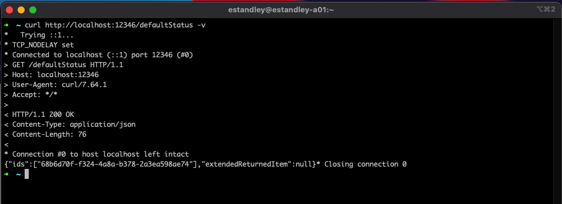
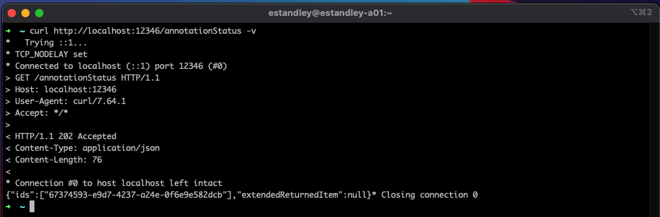
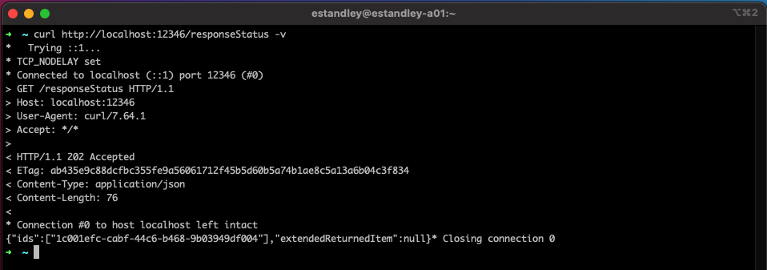
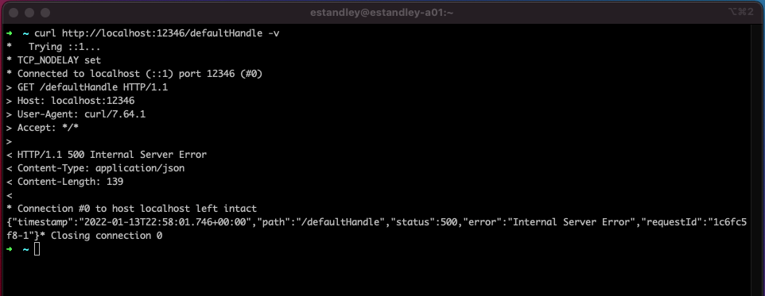
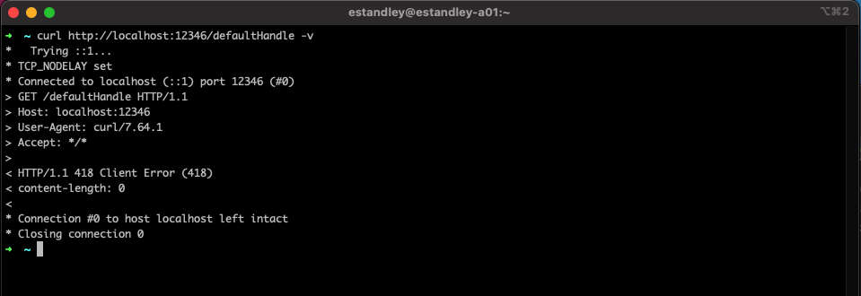
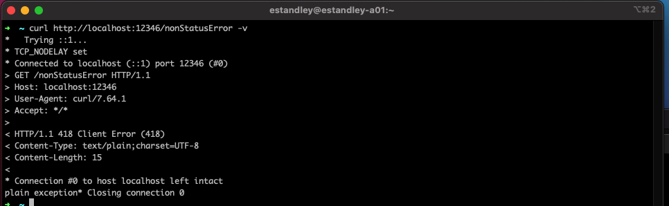
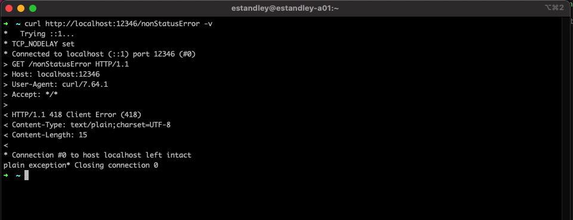
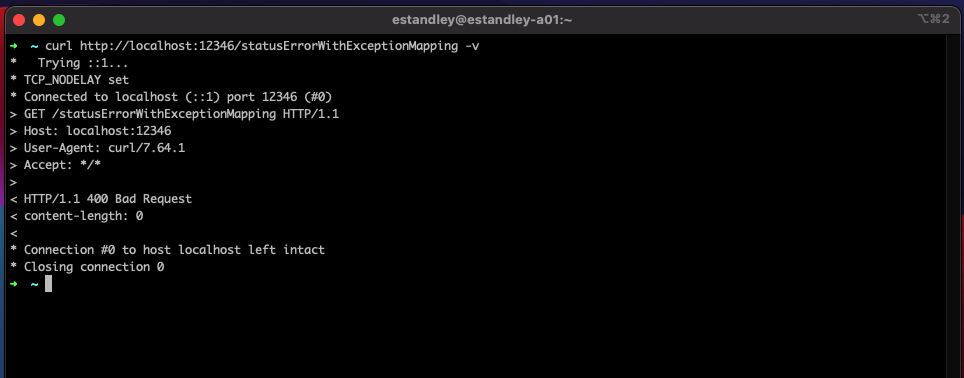

## What Is Spring WebClient?

The Spring WebClient is a reactive HTTP library, it's the follow up to the Spring RestTemplate which is now in maintenance mode. Also where as the RestTemplate was a synchronous blocking library, WebClient is an asynchronous non-blocking library. This well also include a little information on how to use a Mono object from the Spring Reactive project as this is key to how the WebClient works.

## Before You Begin

Things you need to do before getting started

- JDK 11 (JDK 17 if you want to use the Records in the github example code)
- Spring Boot 2
- Basic understanding of how Spring Boot apps work

This code and a sample test service to call [up on GitHub](https://github.com/estand64/reactive).

## Using WebClient

### Setup the Project and Import Dependencies

You can create a Java project by either going to [start.spring.io/](https://start.spring.io/) and generate a new java project and include the `Spring Reactive Web` project. Or you can manually setup a Java project and adding the following into your pom.xml.

```xml
<parent>
	<groupId>org.springframework.boot</groupId>
	<artifactId>spring-boot-starter-parent</artifactId>
	<version>2.5.6</version>
	<relativePath/> <!-- lookup parent from repository -->
</parent>

<dependencies>
    <dependency>
	    <groupId>org.springframework.boot</groupId>
	    <artifactId>spring-boot-starter-webflux</artifactId>
    </dependency>
    <dependency>
	    <groupId>io.projectreactor</groupId>
	    <artifactId>reactor-test</artifactId>
	    <scope>test</scope>
    </dependency>
</dependencies>
```

Then create the following classes that we'll use in this guide:

`ReactiveWebClient.java`

```java
@Component
public class ReactiveWebClient {
    private final WebClient webClient;

    public ReactiveWebClient() {
    }
}
```

`ReactiveService.java`

```java
@Service
public class ReactiveService {
    private final ReactiveWebClient reactiveWebClient;

    public ReactiveService(ReactiveWebClient reactiveWebClient) {
        this.reactiveWebClient = reactiveWebClient;
    }
}
```

`ReactiveExamplesController.java`

```java
@RestController
public class ReactiveExamplesController {
    private final ReactiveService reactiveService;
    private final ReactiveWebClient reactiveWebClient;

    public ReactiveExamples(ReactiveService reactiveService, ReactiveWebClient reactiveWebClient) {
        this.reactiveService = reactiveService;
        this.reactiveWebClient = reactiveWebClient;
    }
}
```

### Setup the WebClient

There are two ways to create a WebClient, the first using the create method which has two versions. Either an empty argument to setup a default WebClient or one which takes in the base url that this WebClient will call (This example uses the localhost url of the wait app in the code example, you can use that or any other REST app you may have).

```java
this.webClient = WebClient.create();
//or
this.webClient = WebClient.create("http://localhost:12345");
```

Or there's a more comprehensive builder way which will allow you to set more defaults on the WebClient if you want. Like if you know you only are going to be using JSON and want to make sure your accept and content headers are always set.

```java
this.webClient = WebClient.builder()
                          .baseUrl(properties.getHost())
                          .defaultHeader("Accept", MediaType.APPLICATION_JSON_VALUE,
                                         "Content-Type", MediaType.APPLICATION_JSON_VALUE
                          ).build();
```

For this guide just put `this.webClient = WebClient.create("url of service");` in the constructor of the `ReactiveWebClient` class.

### Making Calls

Let's look at how to make a basic call with the `webClient` we just created, place this method in your `ReactiveWebClient` class;

```java
public Mono<ReturnedItem> callOne() {
    return webClient.get()
                    .uri("wait1")
                    .retrieve()
                    .bodyToMono(ReturnedItem.class);
}

public record ReturnedItem(UUID id, String info) {}
```

Here you can see that the first method we call on our WebClient is the REST action we want to preform, in this case it's a `.get()`. All the common REST calls; GET, POST, PUT, DELETE, PATCH, HEAD, OPTIONS, have their own helper methods that can be called. The next method in the chain is the `.uri()`, this indicates what path we want appended to the base url we set this WebClient up with earlier. Next we have `.retrieve()`, this is where in the chain the WebClient will actually make the call out and we convert from methods that setup the call to methods dealing with the response. I would like to point out that instead of call `.retrieve()` there is also the `.exchangeToMono()` and `.exchangeToFlux()` methods, I won't be going over those but it is an alternative that you can look up. Lastly is the `.bodyToMono()` method which is going to give us the payload we want from our call. In this case it's expecting the call to return a JSON payload that is mappable to `ReturnedItem` record.

Before we go farther we need to dive into that last part as it's key to how to use the WebClient and is quite different from how the old RestTemplate (or any synchronous http client library) handles things. The best way to think about this is to view any call the WebClient make as a thread process, so to compare the old vs new look at the following code:

```java
var item = restTemplate.getForEntity(properties.getHost() + "/" + endpoint, ReturnedItem.class);
//execution waits here till the call to the remote system returns
System.out.println("ReturnedItem from the call: " + item.toString());
```

vs

```java
var item =  webClient.get().uri(ApiProperties.ONE_ENDPOINT).retrieve().bodyToMono(ReturnedItem.class);
//call out to the remote system is still processing thus the line below will print before the call has returned
System.out.println("This is the Mono that at some point in the future will return a ReturnedItem: " + item.toString());
```

Now rather than having our returned data from our REST call we are given a Mono object that wraps our return data and we are still processing without even having our data yet. You might be asking then how can I use the data from that call, well if your are used to the Streaming API that was introduced in Java 8 you should notice the familiar method `.map()` that exist on Mono. If you haven't use this before at a basic level it takes in an object of one type and converts it to another. Take for example code base where we want to convert the `ReturnedItem` that comes back from our call out into a `ReturnObject` to return to our client. We can take the method call above and apply our logic to it. Place this method in the `ReactiveService` class.

```java
public Mono<ReturnObject> simpleCall(){
    return reactiveWebClient.callOne().map(returnedItem -> {
        var ids = List.of(returnedItem.id().toString());
        return new ReturnObject(ids, null);
    });
}
```

Here you can see that the `.map()` function takes in a `Function<? super T, ? extends R>` parameter that takes the id out of the `returnedItem` to create a new `returnObject` object that has a list of ids. Now that we have our object that we need to return you might be wondering how to get the `returnObject` out of the Mono. While there are multiple way to get the value out of the Mono for now lets just let Spring handle it and thus our controller method can look like the following. Place this method in the `ReactiveExamplesController` class.

```java
@GetMapping("/defaultStatus")
public Mono<ReturnObject> defaultStatus(){
    return reactiveService.simpleCall();
}
```

At this point if we start up the dummy wait app and our reactive example app we should be able to make a simple call to our service that will return us a list of UUIDs. This should contain a single UUID since that's all we coded above.


### Handling Custom Return Items and Errors

Well we got the basic call down but if you've been developing for a while you'll note that there are plenty of times where we'll want to return some custom headers or handle errors to return something useful to our callers. Lets start with how to customize our return status and headers.

#### Custom Statuses and Headers

There are 2 ways to handle returning a success status other than 200 which is the Spring default. The first and easiest way to do this would be with the spring annotation `@ResponseStatus()`. Add this method to the `ReactiveExamplesController` class.

```java
@GetMapping("/annotationStatus")
@ResponseStatus(HttpStatus.ACCEPTED)
public Mono<ReturnObject> annotationStatus(){
    return reactiveService.simpleCall();
}
```

Now if we call that endpoint we can see our return status has changed from the default of 200 OK to 202 ACCEPTED


The second way will once again take advantage of using the `.map()` method on the Mono class to return the `ResponseEntity` object. The bonus effect of this method is that we can also add additional REST data to the returned message. In this case the following code will add a custom header in addition to switching up the status. Again add this method to the `ReactiveExamplesController` class.

```java
@GetMapping("/responseStatus")
public Mono<ResponseEntity<ReturnObject>> responseStatus(){
    var mono = reactiveService.simpleCall();

    return mono.map(returnObject -> {
        HttpHeaders headers = new HttpHeaders();
        headers.add("ETag", "ab435e9c88dcfbc355fe9a56061712f45b5d60b5a74b1ae8c5a13a6b04c3f834");
        return new ResponseEntity<>(returnObject, headers, HttpStatus.ACCEPTED);
    });
}
```

Here you can see that we are adding the `ETag` header to our response in addition to changing the status to Accepted. There are many more options when creating your own response entity object that you can read about [here](https://docs.spring.io/spring-framework/docs/current/javadoc-api/org/springframework/http/ResponseEntity.html). If we now call our `responseStatus` endpoint you'll see that we now have our ETag header as well.


For how to deal with errors lets add the following to our `ReactiveWebClient` class

```java
public Mono<ReturnedItem> errorStatus(String endpoint){
    return webClient.get().uri(endpoint).retrieve()
        .bodyToMono(ReturnedItem.class);
}
```

And add the following to the `ReactiveExamplesController`:

```java
private static final String endpoint400 = "400error";

@GetMapping("/defaultHandle")
public Mono<ReturnedItem> defaultHandle(){
    return reactiveWebClient.errorStatus(endpoint400);
}
```

If we call our endpoint now you can see we get back an ugly 500 error that tells us nothing about our call to another service being a bad request.


In order to correct this to give us something useful there are two different parts we need to setup. The first is the `@ExceptionHandler()` annotation. This is a Spring Web class and while it isn't specific to using with the WebClient class it does make life much easier when using the WebClient class. To use it we'll add the following to the `ReactiveWebClient` class.

```java
@ExceptionHandler(Exception.class)
public ResponseEntity<String> other(Exception exception){
    return ResponseEntity.status(HttpStatus.I_AM_A_TEAPOT.value()).build();
}
```

Basically this method tells Spring Boot that when this controller throws an exception of type `Exception.class` catch that an instead of the default error response send back the `ResponseEntity` that this method returns. In this case since this one is looking for `Exception.class` it's acting as a default error handler. If we rerun our code now we should get back an empty body and a 418 I AM A TEAPOT status.


Here we can see that our 500 error with the default Spring error body has been replaced by our no body 418 error. While this is a better way to handle things you'll likely want to send back more informative errors. For this we need to create our own exception, add the proper `ExceptionHandler` to our controller and update the WebClient's method chain to handle errors properly.
First create the `BadRequestException` class.

```java
public class BadRequestException extends Exception{
    public BadRequestException() {
    }

    public BadRequestException(String message) {
        super(message);
    }
}
```

Then add a new `ExceptionHandler` to the `ReactiveExamplesController` class to deal with our new exception.

```java
@ExceptionHandler(BadRequestException.class)
public ResponseEntity<String> onBadRequest(BadRequestException badRequestException){
    return ResponseEntity.status(HttpStatus.BAD_REQUEST.value()).build();
}
```

Now lets change up our WebClient call to deal with our 400 error more cleanly. One import note here is that if our WebClient receives a HTTP status that's not in the 200s it will throw an exception so you should always make sure to handle these exceptions.

```java
public Mono<ReturnedItem> errorStatus(String endpoint){
    return webClient.get().uri(endpoint).retrieve()
            .onStatus(HttpStatus::isError,
                response -> switch (response.rawStatusCode()){
                        case 400 -> Mono.error(new BadRequestException("bad request made"));
                        case 401, 403 -> Mono.error(new Exception("auth error"));
                        case 404 -> Mono.error(new Exception("Maybe not an error?"));
                        case 500 -> Mono.error(new Exception("server error"));
                        default -> Mono.error(new Exception("something went wrong"));
                })
            .bodyToMono(ReturnedItem.class);
}
```

Here we can the new method `.onStatus()`. This method takes a predicate that will evaluate the status code of the response and if it comes back true will then execute the function that is also send into the method. In this example our `.onStatus()` handler will execute if we receive any status that that isn't in the 200s. As you can see if we get a 400 back we will return our new `BadRequestException` class, otherwise we just return a generic exception with some custom labels. Also you'll notice that we had to wrap our exceptions inside of a `Mono.error()`, this is just a wrapper so that the reactive library can pass the error down whatever chain of Mono methods that are lined up. If we now call our 400 returning endpoint we end up with:


Now that we have error handling for bad request what about exceptions that aren't status related? Take for example if the request were to timeout and we don't have a status problem? In that case there's one last method to use on the WebClient to handle those issues. First let's add a new endpoint to the `ReactiveExamplesController` class so we can setup a non status error method.

```java
@GetMapping("/nonStatusError")
public Mono<ReturnedItem> nonStatusError(){
    return reactiveWebClient.nonStatusError("unknown-url", 9000, "/fakepath");
}
```

Then add the following method into the `ReactiveWebClient` class.

```java
public Mono<ReturnedItem> nonStatusError(String host, int port, String path){
        return webClient.get().uri(uriBuilder -> uriBuilder.host(host).port(port).path(path).build()).retrieve()
            .onStatus(HttpStatus::isError,
                    response -> switch (response.rawStatusCode()){
                    case 400 -> Mono.error(new BadRequestException("bad request made"));
                    case 401, 403 -> Mono.error(new Exception("auth error"));
                    case 404 -> Mono.error(new Exception("Maybe not an error?"));
                    case 500 -> Mono.error(new Exception("server error"));
                    default -> Mono.error(new Exception("something went wrong"));
            })
            .bodyToMono(ReturnedItem.class)
            .onErrorMap(Throwable.class, throwable -> new Exception("plain exception"));
}
```

We've added the `.onErrorMap()` method here that will in this example grab anything of the type `Throwable.class` and rewrap that into whatever `Throwable` object we want. Here we're just rewrapping it into a normal Exception but giving our specific error message of `plain exception`. If we slightly modify the default `ExceptionHandler` in the controller.

```java
@ExceptionHandler(Exception.class)
public ResponseEntity<String> other(Exception exception){
    return ResponseEntity.status(HttpStatus.I_AM_A_TEAPOT.value()).body(exception.getLocalizedMessage());
}
```

So now the error we get back from the call will be passed back to us in the response to our request.


And there we go, instead of our timeout giving back a Spring generic error as you can see we where able to convert it to an error with the text "plain exception". But what happens if we change up the call to return a 400 to us? I'm not going to go in depth here, however you can play around with the WebClient call and see how to change up some of the call parameters to make this work.


Uh oh, you can see here that trying to grab the non-status errors that this solution also grabbed our `BadRequestError` and changed it into the "plain exception" error that we set up to catch the non status errors. Thankfully there's another version of the `.onErrorMap()` function that will allow us to set up some filtering in order to not change around earlier error handling.

```java
public Mono<ReturnedItem> nonStatusError(String host, int port, String path){
        return webClient.get().uri(uriBuilder -> uriBuilder.host(host).port(port).path(path).build()).retrieve()
            .onStatus(HttpStatus::isError,
                    response -> switch (response.rawStatusCode()){
                    case 400 -> Mono.error(new BadRequestException("bad request made"));
                    case 401, 403 -> Mono.error(new Exception("auth error"));
                    case 404 -> Mono.error(new Exception("Maybe not an error?"));
                    case 500 -> Mono.error(new Exception("server error"));
                    default -> Mono.error(new Exception("something went wrong"));
            })
            .bodyToMono(ReturnedItem.class)
            .onErrorMap(Predicate.not(BadRequestException.class::isInstance), otherException -> new Exception("other exception"));
}
```

This version of `.onErrorMap()` first take a Predicate for what type of errors should the map function work on. The one here is a simple case of if the current error isn't a `BadRequestException` then convert the current error to a plain Exception with the message "other exception".

Then add one last endpoint to our `ReactiveExamplesController` class that will call this new method with our 400 error endpoint and we should see that our specific error handling for 400 errors shouldn't get changed in our error mapping at the end.

```java
 @GetMapping("/statusErrorWithExceptionMapping")
    public Mono<ExtendedReturnedItem> statusErrorWithExceptionMapping(){
        return reactiveWebClient.avoidErrorSwallow("localhost", "12345", endpoint400);
    }
```

And here's what we get:


Just as expected, even though we have error mapping at the end of our call our `BadRequestException` has made it out of the call chain unchanged.

### Wrapping Up

You should now have a good understand of how to use the Spring WebClient class to make REST calls in your services. From this you should play around with the methods in the WebClient to see how to make either a PUT or POST call (hint: look up the `.bodyValue()` method). Also due to the change from the normal synchronous style of old I'd recommend work with the Mono class to get a feel for how that works. It's a different mind set and will require new ways to unit test and understanding to make sure you get the most out now using non-blocking code.
