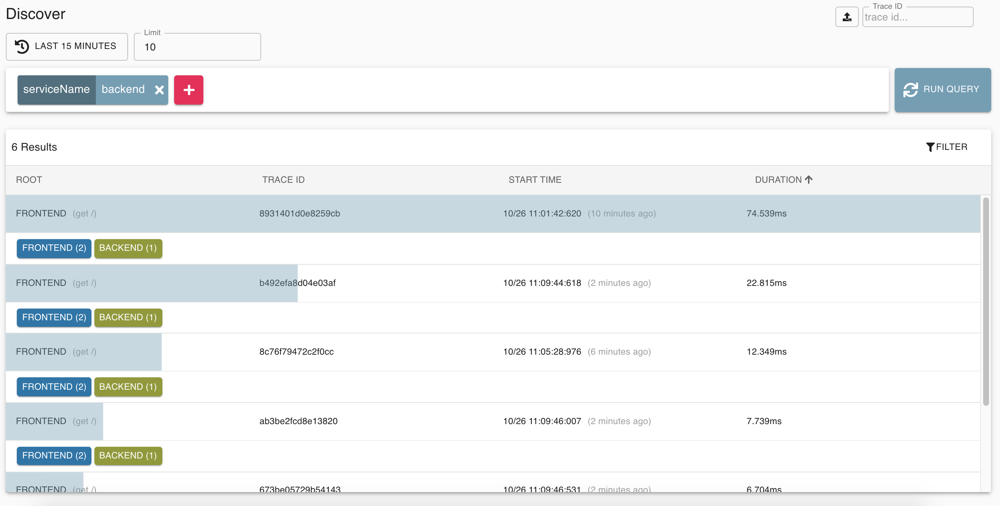
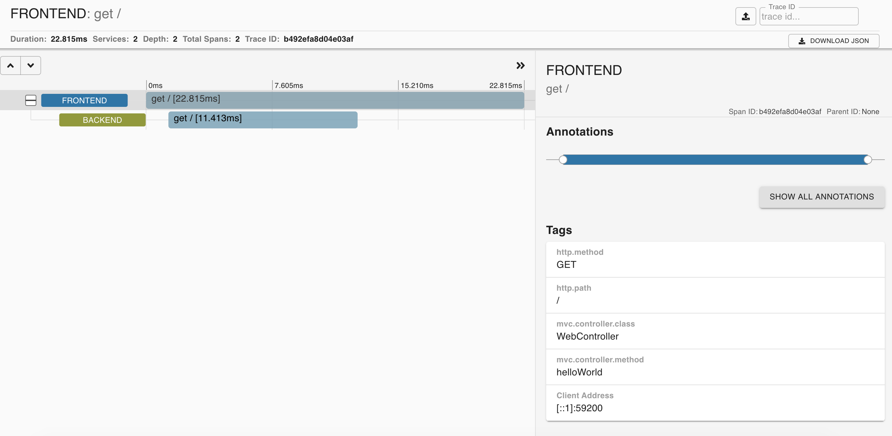
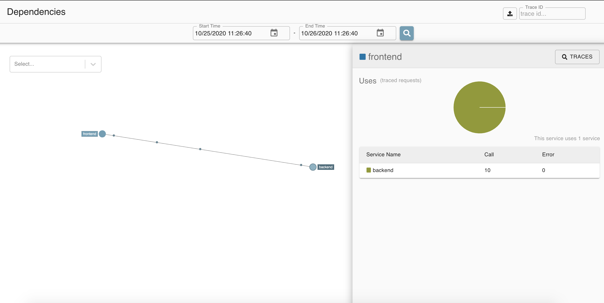

The moment you facilitate one application making a request to another over the network, you  introduce significant complexity. Maybe “significant” is relative, but ask yourself, “What could go wrong?” Because the more services you introduce that your application comes to rely on, the harder it becomes to diagnose any problems that crop up. Is the application slow because of the network? Or is it because one of the services is taking a long time to process? Or something else? 

This is where tracing can help. Tracing, at the most basic level, tracks requests as they come into the application and flow through the system. It measures how long a request takes to move from point to point, as well as how long it spends in a specific service. Having this insight makes it easier to quickly home in on a problem, rather than guessing, hunting, or outright assuming where a problem may be.

There are many tracing solutions out there, but in this post we will look at one of the more popular ones: [Zipkin](https://zipkin.io/). With a powerful community behind it, Zipkin offers instrumentation for numerous languages, frameworks, and data services, and in many cases  getting started is as simple as including a dependency or two and adding a few lines of code. As an example, we will run through  how you can take an existing Spring Boot application and implement Zipkin tracing into it.

## Standing Up Zipkin
Before instrumenting your code and collecting traces, you must first stand up an instance of Zipkin to which you can send those collections. You have several options, all documented in the [Zipkin Quickstart](https://zipkin.io/pages/quickstart.html), with the easiest being to run it on Docker. If you have Docker running locally already, you can get Zipkin running with one command:

```bash
docker run -d -p 9411:9411 openzipkin/zipkin
```

If you don’t have Docker locally but you do have Java installed, it’s almost as easy to run it on your machine. You can download a pre-built JAR and run it with the following commands:

```bash
curl -sSL https://zipkin.io/quickstart.sh | bash -s
java -jar zipkin.jar
```

Whichever way you choose to run Zipkin, you’ll find it accessible on your machine at http://127.0.0.1:9411. If you open your browser to this address and see Zipkin running, you’re good to go! 

## Preparing the Demo
How you instrument your code largely depends on the language, framework, and libraries that you use. For this post, we’ll look at an example [written in Java with Spring Boot](https://github.com/BrianMMcClain/spring-zipkin-demo). If you’re not a Java developer, they are more likely than not some [great examples for your language of choice](https://zipkin.io/pages/tracers_instrumentation.html). For this example, we’ll instrument a bare-bones Spring Boot application consisting of a frontend that calls a backend service, which will also be a Spring Boot application. 

Let’s assume that both applications started as a basic [Spring Boot application built with the Spring Web dependency](/guides/spring/spring-build-api). The frontend has one endpoint located at `/`, which when called, reaches out to the backend. The backend also has a single endpoint, also located at `/`, that simply returns the string “backend.” Finally, the frontend sends a response to the user that reads, “Hello from the backend!”

## Instrumenting the Backend
Let’s first start by instrumenting the backend. This can be done with two additions to the existing code. First, add the `spring-cloud-starter-zipkin` dependency to the `pom.xml` file:

```xml
<dependency>
	<groupId>org.springframework.cloud</groupId>
	<artifactId>spring-cloud-starter-zipkin</artifactId>
</dependency>
```

Next, you’ll need an additional configuration to your `application.properties` file (or if you prefer, this can also be done in the `application.yml` file):

```
spring.application.name=backend
server.port=8082
```

This will tell Zipkin the name of the application while annotating the different pieces of each trace, which will allow you to easily track requests as they flow from the frontend to the backend. We’ve also configured the backend to start on port 8082 so that it doesn’t try to run on the same port as the frontend.

That’s it! Much like many of the Spring Boot components, the rest is automatically taken care of for you. All that remains is to instrument the frontend!

## Instrumenting the Frontend
You will need to add one additional piece to the frontend, but first, you’ll do the same work that you did with the backend. Start by adding the `spring-cloud-starter-zipkin` dependency:

```xml
<dependency>
	<groupId>org.springframework.cloud</groupId>
	<artifactId>spring-cloud-starter-zipkin</artifactId>
</dependency>
```

Next, in your `application.properties` file, configure the name of the frontend application:

```
spring.application.name=frontend
server.port=8080
```

The other piece to configure is how the requests are sent to the backend. We need to create a client that will be automatically configured to capture traces as it sends requests, then combine that data with the requests coming into the frontend. For this, we’ll allow the `WebController` class to automatically configure a `RestTemplate` object for us. To do this, here is all the necessary code :

```java
package com.github.brianmmcclain.springzipkindemo;

import org.springframework.web.bind.annotation.GetMapping;
import org.springframework.web.bind.annotation.RestController;
import org.springframework.web.client.RestTemplate;
import org.springframework.beans.factory.annotation.Autowired;
import org.springframework.context.annotation.Bean;

@RestController
public class WebController {

    @Autowired 
    RestTemplate restTemplate;
    
    @GetMapping("/")
    public String helloWorld() {
        String response = restTemplate.getForObject("http://localhost:8082", String.class);
        return "<h1>Hello from the " + response + "!</h1>";
    }

    @Bean 
    RestTemplate restTemplate() {
        return new RestTemplate();
    }
}
```

 The `WebController` class is given the `@RestController` annotation, which tells our application that it will be the class that will handle the logic for HTTP requests as they come in. The class has a variable named `restTemplate` of type `RestTemplate` and given the `@Autowired` annotation that will automatically create the `RestTemplate`. It also has the `helloWorld` method with the `GetMapping(“/”)` annotation, which tells our code to invoke this method when the application receives requests on the `/` endpoint. This method sends the request to the backend, constructs the response, and sends it back to the user. Finally, the `restTemplate` bean of type `RestTemplate` is  what the Autowired `restTemplate` variable will look for when being created. In this case, the bean returns a new `RestTemplate` object, into which the `spring-cloud-starter-zipkin` dependency will hook.

## Running the Demo
With Zipkin already running, it’s now time to start up both the frontend and the backend applications. Because they are Spring Boot applications, you can open two terminals, navigate to the two code bases, and run the same command to start both of them:

```bash
./mvnw spring-boot:run
```

This will start the frontend on port 8080 as well as start the backend on port 8082. Once both applications are up and running, send a request or two to the frontend application located at [http://localhost:8080](http://localhost:8080). For each request, you should be greeted with the phrase, “Hello from the backend!” After you’ve sent some traffic to the application, you can reach Zipkin running at [http://localhost:9411/zipkin/?serviceName=backend](http://localhost:9411/zipkin/?serviceName=backend), click “Run Query,” and will be greeted with all   your application’s recent traces:



By clicking on one of these traces, you can dig further into the entire flow of a request. This is great for troubleshooting issues in large, complex distributed applications where figuring out exactly where a request is slowing down can be a real challenge:



Zipkin also allows you to visualize the services on which your application depends. If you click on the “Dependencies” page on the left-hand panel, you’ll be shown this visualization for your application:



While simple for this use case, you can imagine how useful this feature will be as your application’s needs for external services grows.

## What’s Next?

If you’re not a Java or Spring developer, take a look at some of the available examples out there for your [language and framework of choice](https://zipkin.io/pages/tracers_instrumentation.html)! There is instrumentation available for many languages, such as [Ruby](https://github.com/openzipkin/zipkin-ruby), [Python](https://github.com/Yelp/py_zipkin), [Go](https://github.com/openzipkin-contrib/zipkin-go-opentracing), and may more! Looking to dig even deeper into observability? Make sure to check out our collection of [content](/patterns/observability/), which covers metrics, logging, and tracing.