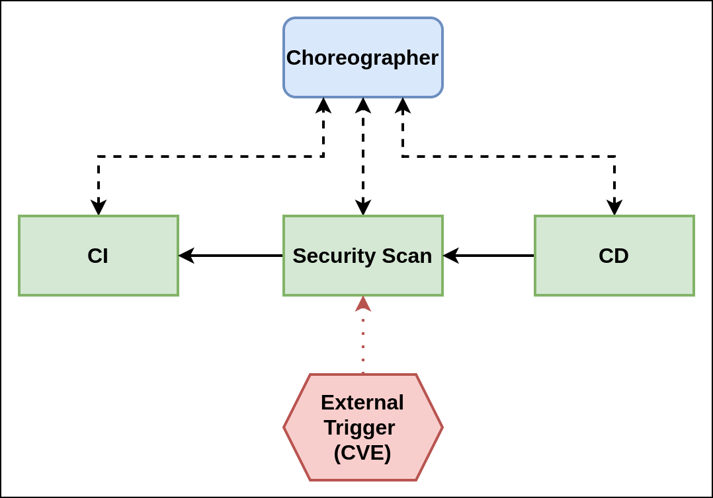

Much has been written about choreography and, more specifically, the distinction between choreography and orchestration in the context of microservices[^1] [^2]. However, taking the choreography paradigm and applying it to [continuous integration and continuous deployment (CI/CD)](https://tanzu.vmware.com/cicd) to create a _path to production_ may unlock the potential for addressing the developer experience gap[^3].

# Why a path to production?

CI/CD exists to ensure that applications that reach customer-facing environments have as little risk as possible. It’s not pragmatic to have developers and product teams create their applications in production-like environments because even if they could provision these types of environments, they would still be missing the stresses that come with production environments. CI/CD was born in an attempt to address these issues. Quicker, compartmentalized tests are run first, allowing developers to “fail fast,” while more expensive integration tests are performed less frequently and attempt to catch major integration or performance issues with their applications. Only after an application passes all of these tests is it ready for deployment to customer-facing issues. Each additional test incurs an added level of complexity in minimizing the risk of deployment. To address these risks, teams have adopted automation and process changes (hence the rise of [DevOps](https://tanzu.vmware.com/devops)) to address the complexities of their CI/CD pipelines.

However, there seems to be a plateau of high-performing software delivery performers[^4]. The latest State of DevOps Report aims at providing some insight into the issue, with the solution being both technical and organizational. Arguments can be made on the technical side, but these fail to address the organizational issues. On the flip side, organizational remediations cannot fully address the technical issues. There is clearly no panacea to resolve both at the same time.

The latest State of DevOps Report suggests that adopting _stream-aligned teams_[^5] goes a long way to addressing the organizational issues by creating cross-functional teams that own their application in both development, production, and all stages in between. Adopting stream-aligned teams also aims to address the developer experience gap by moving to have the platform team provide API endpoints for collections of services. One problem becomes the level of abstraction that is provided to the tools. If it’s too low, the developer experience gap will still exist for teams and will ultimately lead to having a pipeline expert per team. If there are 200 application teams, there will be a completely different pipeline for each team. If the level of abstraction is too high, the team won’t feel in control of their application as it transitions across their CI/CD pipeline.

Stream-aligned teams themselves may also not be able to meet the need for requirements that can only be validated by organization members that are not and could not be on the teams from the outset. Examples of such members are quality assurance (QA) and security and compliance officers. Enterprises must meet  regulatory, security, and compliance requirements but it’s not practical or feasible for the responsible members of the organization to be on the teams. Change approval boards (CAB) for example can often be lengthy, ticket-driven and are always on an application's critical path for reaching higher-level environments. They can be a hindrance for product and application teams to create tight feedback loops with their customers, as well. If a team can produce a new release every two weeks, but the CAB process takes four weeks (assuming the release and CAB are the only two things that it takes to get an application to production), then about 66 percent of the time to production is tied up in a process that the team has no control over.

Yet another challenge for stream-aligned teams is a need for a separation of controls throughout an application’s journey to production. Depending on the organization, there are stages of the development process that  certain members of the team cannot access. Examples include giving only certain members of a team access to production or failing to communicate to members of the development team that their application has been pushed to production. Reasons for these types of disconnect can range from security and compliance (access to customer data) or even trust. While stream-aligned teams can partially address these concerns, having teams own their applications and remediations in production when they can't access them is not practical.

Clearly, the level of abstraction that is provided by the platform teams to the developers is extremely important. One way to find the right level of abstraction is by creating a path to production.

# Creating a path to production

Paths to production squarely address the developer experience gap while still allowing stream-aligned teams to own their code, and while providing platform teams the level of control over the application's journey to production, as needed. A path to production is a way of codifying an application’s _value stream map_ as it makes its way from a developer’s workstation to a production environment.

_Diagram 1: A simple path to production_

In order to address the developer experience gap, the path to production allows users to create a unified access point for all of the tools required for their applications to reach a customer-facing environment. Instead of having four tools that are loosely coupled to each other, a path to production defines all four tools in a single, unified layer of abstraction. Where tools typically aren't able to integrate with one another and additional scripting or webhooks are necessary, there would be a unified automation tool to codify all the interactions between each of the tools.

In order to address the separation of concerns, a path to production should be templatable, so that the platform teams can define the steps necessary for each application to reach production. This also allows the stream-aligned team to fill each of the templates with details that only their team would know.

Even manual steps, such as QA stages and CAB reviews, should be codified as steps in the path to production. Manual steps do not replace the actual manual cycle, but will prove useful in the greater journey to production.

The result is a single "pipeline" that is re-used by each team, respective of the languages, the resource constraints, or the service demands of each team. For example, if an organization has 200 teams, instead of having 200 slightly different pipelines, each team could reuse the same one so that stream-aligned teams can focus on providing value to their users, while assuring platform teams that each application that has gone through a path to production meets the requirements of that organization.

# Orchestration vs. choreography

In the context of microservices, an orchestrator defines each of the interactions between each of the microservices. The orchestration engine is responsible for executing, monitoring, and managing each of the microservices. If the orchestrator becomes inoperable, the entire interaction model falls apart.

_Diagram 2: Orchestration for a simple path to production_

With this model applied to a path to production, an orchestrator would execute, monitor, and manage each of the steps of the path to production. The CI stage, or any others, could not function independently from the orchestrator. In the case of a path to production with a vulnerability scanning step, if a new CVE should arise, the only way to scan the code for it would be to trigger the orchestrator to initiate the scanning step or a new run through the supply chain.

Choreography, on the other hand, knows very little about each of the components and how they function. There is a common set of communication paradigms between each of the integrations. It relies on events being passed back and forth between the choreographer and each of the integrations. Each of the microservices interacts with the others asynchronously.

_Diagram 3: Choreography for a simple path to production_

In the choreography model, each step of the path to production and the tool required for that step knows nothing about the next step. It is responsible for receiving a signal that it must perform some work, completing it, and signaling that it has finished. In the same case as above, with a pipeline that has a vulnerability scanner, if there was a new CVE, the vulnerability scanner would know about it and trigger a new scan. When the scan is complete, the vulnerability scanner would send a message indicating that scanning is complete.

# Choreography for the path to production

Because steps of the path to production are rarely synchronous, for example, if a new CVE comes up, someone clicks the button on a build, and so on, choreography is a natural choice as a workflow engine. Flexibility and the ability to swap steps of the path to production is also of extreme importance. If a given team is using `kpack` and another is using `kaniko`, they should both be able to use the same path to production, only swapping a single step between the two. Using a choreographer can help achieve this: as long as the step outputs the same type of message, one step can be completely interchangeable with another.

For example, if one team has adopted Jenkins for CI testing and another team has adopted Circle CI, an orchestrator would need to know how to manage the flow and execution of information into each integration. If we take this simple example and multiply it by the number of possible steps in a path to production and by the number of tools that can be swapped at each step, the possibilities are endless and impose an upper bound on the practicality of maintaining each individual pipeline.

Both Jenkins and Circle ultimately generate the same “type” of message: the code was successfully tested or it wasn't. As this message is the only thing that a choreographer cares about, each step can be hot-swapped for the other without any impact on the path to production.

The step that contains either Jenkins or Circle then becomes the CI step, as opposed to CI with Jenkins or CI with Travis. The fact that Travis or Jenkins is performing CI is not necessary information. The choreographer lets each of the tools perform the duties they are designed to perform while providing the ability to unify them across the path to production and create the flexibility that developer teams require.

For platform operators, an example would be if a step is required by a security and compliance group, that step could be set up so that it could not be hot-swapped. Ultimately, for the choreographer, the use case would be the same, the scan has succeeded or not (in a simple case) and the details of that specific scan, at least to the choreographer, are not important.

# In summary

As we’ve read in this post:
* Stream-aligned teams help teams get to production, but there may be more factors at play that aren’t as easily addressed.
* Platform teams can help address the developer experience gap for stream-aligned teams, but the level of abstraction is extremely important.
* Paths to production may be able to provide the right level of abstraction for developers, thereby solving the developer experience gap and addressing the separation of control concerns for platform operators.
* Orchestration and choreography are diametrically opposed to one another in terms of their interaction models, yet both can be applied to the path to production.
* Choreography may be the more natural choice to create paths to production.

# Further Reading

* [https://tanzu.vmware.com/content/blog/why-path-to-production-analysis-software-development-teams](https://tanzu.vmware.com/content/blog/why-path-to-production-analysis-software-development-teams)

<!-- Footnotes themselves at the bottom. -->
## Notes
[^1]:
     [https://www.processmaker.com/blog/process-orchestration-vs-choreography-microservices/](https://www.processmaker.com/blog/process-orchestration-vs-choreography-microservices/)

[^2]:
     [https://solace.com/blog/microservices-choreography-vs-orchestration/#:~:text=Orchestration%20entails%20actively%20controlling%20all,without%20requiring%20supervision%20and%20instructions.](https://solace.com/blog/microservices-choreography-vs-orchestration/#:~:text=Orchestration%20entails%20actively%20controlling%20all,without%20requiring%20supervision%20and%20instructions.)

[^3]:
     [https://redmonk.com/sogrady/2020/10/06/developer-experience-gap/](https://redmonk.com/sogrady/2020/10/06/developer-experience-gap/)

[^4]:
     [https://puppet.com/resources/report/2021-state-of-devops-report/](https://puppet.com/resources/report/2021-state-of-devops-report/)

[^5]:
     _[Key Concepts — Team Topologies](https://teamtopologies.com/key-concepts)_
