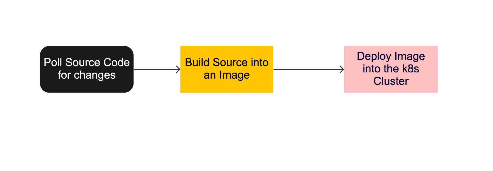
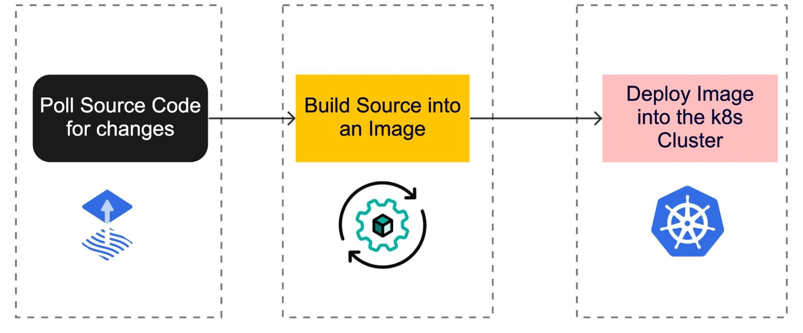
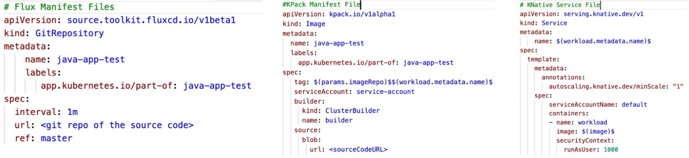
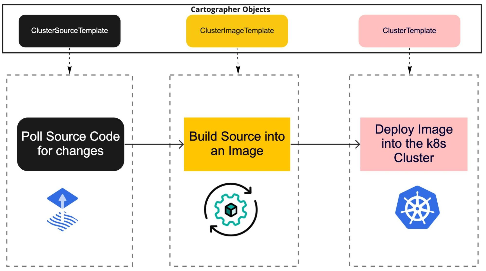
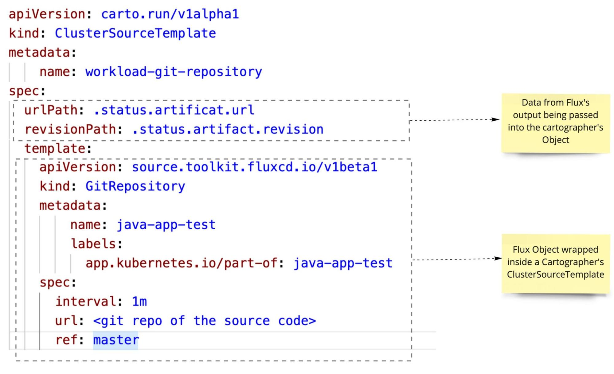
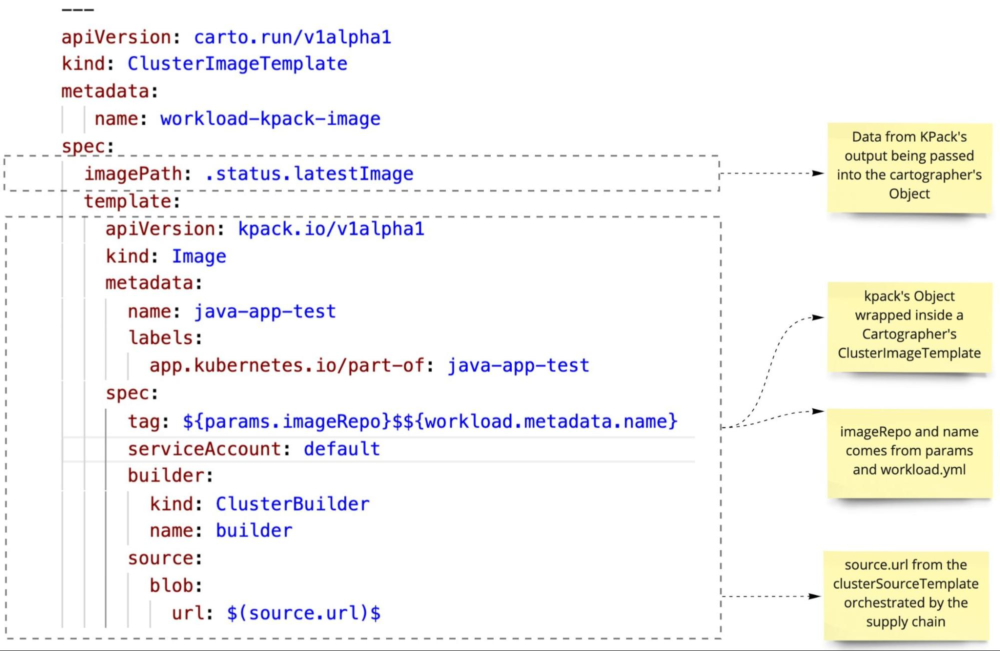
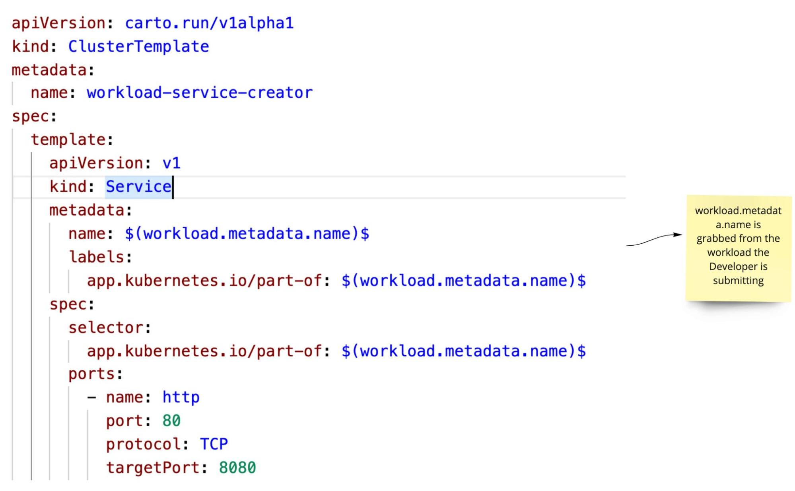
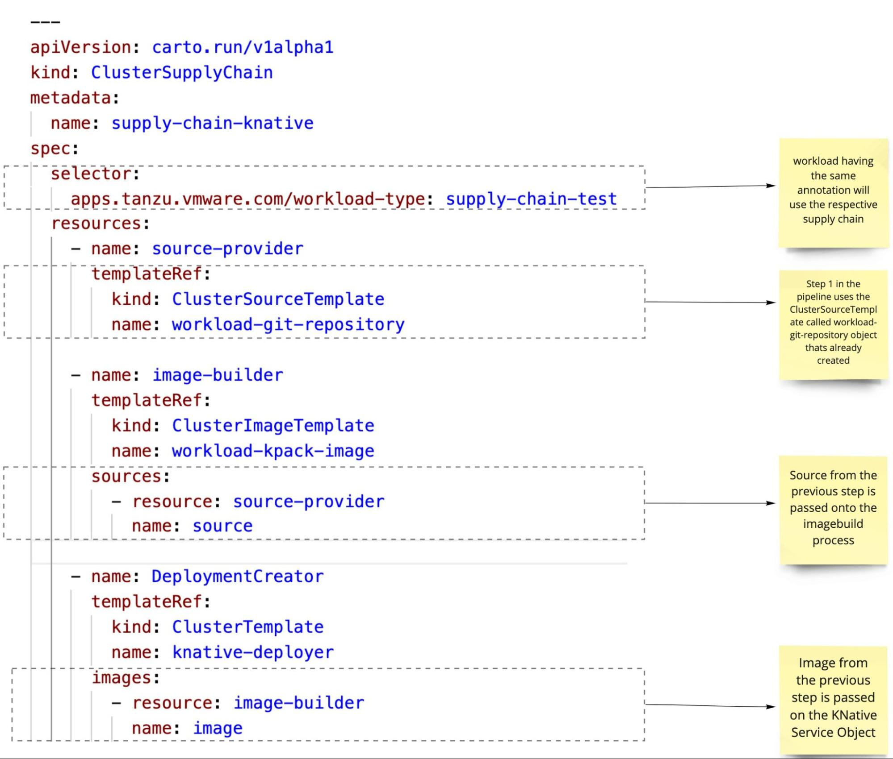
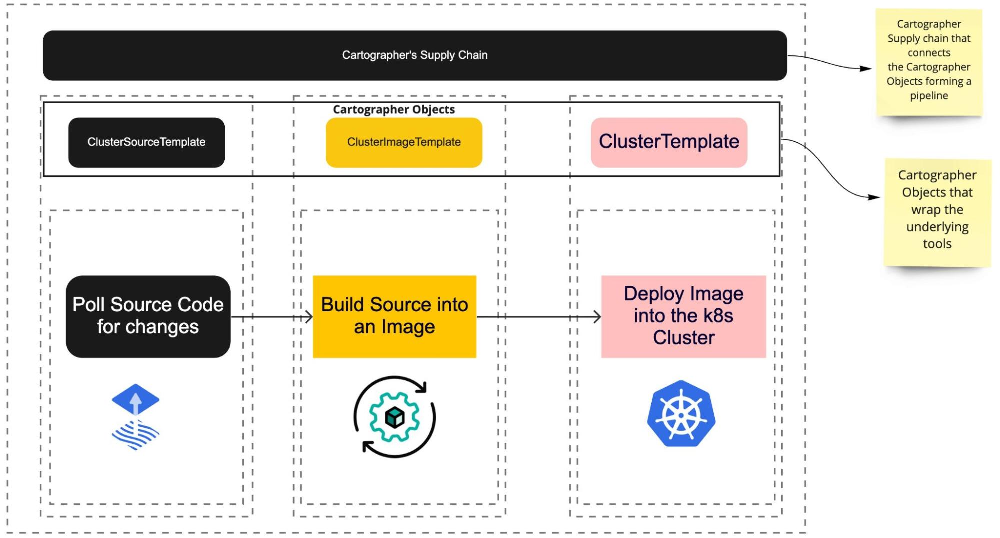

VMware Tanzu Application Platform is a modular, application-aware platform that gives developers a prepaved path to production for building and deploying software on any compliant public cloud or on-premises Kubernetes cluster. Designed to deliver a superior and secure developer experience, it makes the [software supply chain even more secure](https://tanzu.vmware.com/developer/guides/supply-chain-choreography/) with a suite of features, including vulnerability scanning, a software bill of materials, image signing, and more.

In order to understand how Tanzu Application Platform leverages the supply chain to automate the CI/CD process, let’s start by looking at the basic steps involved in a cloud native [CI/CD process](https://tanzu.vmware.com/developer/guides/ci-cd-what-is/). 

By default, Tanzu Application Platform uses the following:

* **FluxCD** to poll for any changes from the source code repository.
* **Kpack** to convert the source code into a runnable artifact
* **Knative** manifest files to deploy these changes into the Kubernetes cluster

The above manifest files of Flux, kpack, deployment, and service files are all it takes to convert an application to a runnable artifact and deploy them into the Kubernetes cluster. However, these manifest files need to be converted into objects that **[Cartographer](https://cartographer.sh/)** can understand.

The Cartographer objects sit on top of tools like Flux and kpack and are wrapped with their respective manifest files. This way, Cartographer doesn’t care what tools are used under the hood. For example, FluxCD can be replaced by ArgoCD. Kpack can be replaced by pack. Knative objects can be replaced by Kubernetes objects.

Let’s take a closer look at each Cartographer object and see how they wrap the individual components inside of it.

## `ClusterSourceTemplate`

`ClusterSourceTemplate` indicates how the supply chain could instantiate an object responsible for providing source code. In our example, we use Flux to pull source code from the source code repository. As indicated below, the Flux object is wrapped inside the `ClusterSourceTemplate`.

Cartographer is tool-agnostic and doesn't care what underlying tool is used to pull the source code. All `ClusterSourceTemplate` cares about is whether the `urlPath` and `revisionPath` are passed in correctly from the template.

## `ClusterImageTemplate`

`ClusterImageTemplate` instructs how the supply chain should instantiate an object responsible for supplying container images, for instance, one that takes source code and builds a container image out of it.

## `ClusterTemplate`

A `ClusterTemplate` instructs the supply chain to instantiate a Kubernetes object that has no outputs to be supplied to other objects in the chain, for instance, a resource that deploys a container image that has been built by other ancestor resources. A `ClusterTemplate` can be used to create any Kubernetes/Knative object, such as deployment, services, Knative services, etc.

Download the above code snippets from [here](https://github.com/gowthamshankar99/tanzu_tap_supplychains/blob/main/cartographer_files/cartographer_objects.yml).

## How does Cartographer apply/connect these objects in order?

Cartographer uses the `ClusterSupplyChain` object to link the different Cartographer objects in order to convert the source -> image -> Kubernetes object. In Cartographer terminology, this looks something like `ClusterSourceTemplate` -> `ClusterImageTemplate` -> `ClusterTemplate`.

Let’s take a closer look at the `ClusterSupply` and see how it ties all these components together and how data is passed between the components.

### `ClusterSupplyChain`

With a `ClusterSupplyChain`, app operators describe which “shape of applications” they deal with (via spec.selector) and what series of resources are responsible for creating an artifact that delivers it (via spec.resources).

`ClusterSupplyChain` connects all the underlying Cartographer objects (`ClusterTemplate`, `ClusterImageTemplate`, ClusterSourceTemplate, etc.) to form a supply chain pipeline for deploying a workload into the Kubernetes cluster.

Download the above code snippet [here](https://github.com/gowthamshankar99/tanzu_tap_supplychains/blob/main/supply_chain.yml).

## Tying all the pieces together

* Flux, kpack, and Knative/Kubernetes form the underlying template that does the actual work.
* `ClusterSourceTemplate`, `ClusterImageTemplate`, and `ClusterTemplates` are the `Cartographer` constructs that wrap the underlying templates so that Cartographer can understand them and pass outputs from one step to another.
* `ClusterSupplyChain` is the `SupplyChain` object that ties all the Cartographer objects together to form a pipeline.

