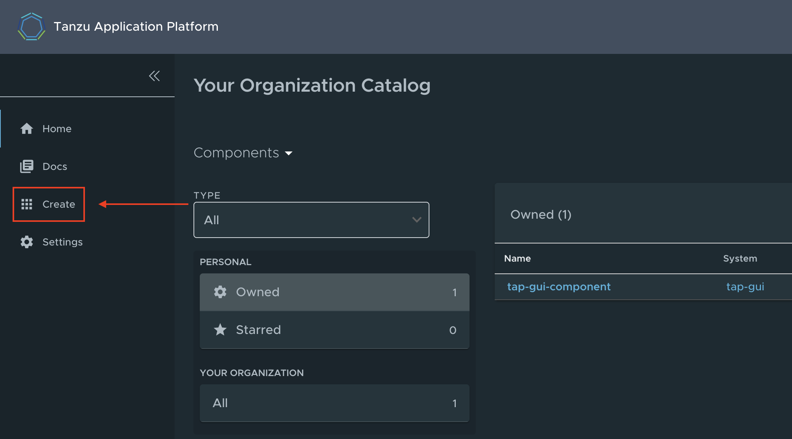

Deploying applications to VMware Tanzu Application Platform is a straight forward process, but there is some initial setup involved. Some, you would need to do regardless of the platform. Things like setting up a development namespace, and access controls. 

Some things you need to do might be a bit different than you are used to. Things like creating the initial starter application, and deploying it via the included CI/CD pipeline. But hopefully, you will see the value in these steps, and this guide will highlight some of those benefits as you go through it. 

In this guide, you will walk through all of these actions. From setting up your development namespace, to deploying a sample application. 

By the end of this guide, you will have a working application running on Tanzu Application Platform, with local access to it via your web browser. 

## Assumptions

These are some assumptions you should be aware of before proceeding with this guide:

* This guide was written for [Tanzu Application Platform `v1.0`](https://docs.vmware.com/en/Tanzu-Application-Platform/1.0/tap/GUID-overview.html). 
* This guide assumes you are running MacOS. Specifically, the `v12.0` "Monterey" line. Commands provided in this guide make these assumptions. 
* This guide will be updated regularly, but updates might not be timed exactly to new releases of these products or platforms. You may need to modify commands if versions do not line up.
* This guide heavily leverages the [official documentation](https://docs.vmware.com/en/Tanzu-Application-Platform/1.0/tap/GUID-install-intro.html) for Getting Started with Tanzu Application Platform. This guide is meant to be a simple setup to get you started quickly. For more complicated or production setups, refer to the official documentation.

## Prerequisites
* [A Tanzu Network account with `pivnet` installed](/guides/tanzu-network-gs) - This guide walks you through setting up your account on the Tanzu Network, as well as installing the `pivnet` CLI tool.
* [The `tanzu` CLI installed and configured](/guides/tanzu-cli-gs) - This guide walks you through downloading, installing, and using the `tanzu` CLI tool.
* [An install of Tanzu Application Platform](/guides/tanzu-application-platform-gs) - This guide walks you through the install process for Tanzu Application platform. 
* [A Docker Hub account](https://hub.docker.com/signup) - Other repositories are supported, but for ease of use and configuration, this guide uses Docker Hub.
* [A GitHub account](https://docs.github.com/en/get-started/signing-up-for-github/signing-up-for-a-new-github-account) - You will use this account to `push` your sample application to, and later `clone`, modify, and `push` your code changes back to this repo. 

## Set up the environment

In order to make some commands easier to run, you should define some local environment variables. These will include sensitive information such as passwords. This information will be stored in your shell history file. Be aware of this before proceeding, and consider this section optional. 

1. Define the name of your new namespace. A sample default is provided here that will make sense for your sample app.

    ```sh
    export DEVELOPMENT_NAMESPACE=dev-java-web-app
    ```

2. Define your Docker Hub credentials.

    ```sh
    export DOCKER_HUB_USERNAME=your-docker-hub-username
    ```

    ```sh
    export DOCKER_HUB_PASSWORD=your-docker-hub-password
    ```

3. Define your GitHub credentials.

    ```sh
    export GITHUB_USERNAME=your-github-username
    ```

4. Define your custom domain name. This should be the same domain as you configured during your Tanzu Application Platform install.

    ```sh
    export CUSTOM_DOMAIN=example.com
    ```

## Setting up the development namespace

If you plan to use this environment for multiple applications, you are going to want some level of segmentation. Here, you will do this by setting up separate development namespaces in Kubernetes. 

1. Create the namespace. 

    ```sh
    kubectl create ns $DEVLOPMENT_NAMESPACE
    ```

2. Configure a Kubernetes secret with your registry credentials.

    ```sh
    kubectl create secret docker-registry registry-credentials --docker-server=https://index.docker.io/v1/ --docker-username=$DOCKER_HUB_USERNAME --docker-password=$DOCKER_HUB_PASSWORD -n $DEVLOPMENT_NAMESPACE
    ```

3. Create the necessary secrets, service accounts, and RBAC rules.

    ```sh
    cat <<EOF | kubectl -n $DEVELOPMENT_NAMESPACE apply -f -

    apiVersion: v1
    kind: Secret
    metadata:
    name: tap-registry
    annotations:
        secretgen.carvel.dev/image-pull-secret: ""
    type: kubernetes.io/dockerconfigjson
    data:
    .dockerconfigjson: e30K

    ---
    apiVersion: v1
    kind: ServiceAccount
    metadata:
    name: default
    secrets:
    - name: registry-credentials
    imagePullSecrets:
    - name: registry-credentials
    - name: tap-registry

    ---
    apiVersion: rbac.authorization.k8s.io/v1
    kind: Role
    metadata:
    name: default
    rules:
    - apiGroups: [source.toolkit.fluxcd.io]
    resources: [gitrepositories]
    verbs: ['*']
    - apiGroups: [source.apps.tanzu.vmware.com]
    resources: [imagerepositories]
    verbs: ['*']
    - apiGroups: [carto.run]
    resources: [deliverables, runnables]
    verbs: ['*']
    - apiGroups: [kpack.io]
    resources: [images]
    verbs: ['*']
    - apiGroups: [conventions.apps.tanzu.vmware.com]
    resources: [podintents]
    verbs: ['*']
    - apiGroups: [""]
    resources: ['configmaps']
    verbs: ['*']
    - apiGroups: [""]
    resources: ['pods']
    verbs: ['list']
    - apiGroups: [tekton.dev]
    resources: [taskruns, pipelineruns]
    verbs: ['*']
    - apiGroups: [tekton.dev]
    resources: [pipelines]
    verbs: ['list']
    - apiGroups: [kappctrl.k14s.io]
    resources: [apps]
    verbs: ['*']
    - apiGroups: [serving.knative.dev]
    resources: ['services']
    verbs: ['*']
    - apiGroups: [servicebinding.io]
    resources: ['servicebindings']
    verbs: ['*']
    - apiGroups: [services.apps.tanzu.vmware.com]
    resources: ['resourceclaims']
    verbs: ['*']
    - apiGroups: [scanning.apps.tanzu.vmware.com]
    resources: ['imagescans', 'sourcescans']
    verbs: ['*']

    ---
    apiVersion: rbac.authorization.k8s.io/v1
    kind: RoleBinding
    metadata:
    name: default
    roleRef:
    apiGroup: rbac.authorization.k8s.io
    kind: Role
    name: default
    subjects:
    - kind: ServiceAccount
        name: default

    EOF
    ```

## Create the starter application

Here you are going to use the Tanzu Application Platform UI and its application accelerator service to create a small sample application. Then you will configure your local application directory as a GitHub repo and `push` it, so that Tanzu Application Platform can track changes.

1. Open the Tanzu Application Platform UI in your web browser. This may not work in the Safari browser since the connection is not secure. 

    ```sh
    open http://tap-gui.$CUSTOM_DOMAIN
    ```

2. Click the **Create** tab in the left-hand navigation bar.

    

    What you are seeing here are some sample starter applications included with Tanzu Application Platform. Additional starter applications can be added, but this is beyond the scope of this guide. 

    Starter applications are useful to help you get started on projects faster. They can not only include many best practices for a particular language or framework, but also have your organization's security policies and practices included by default.

    They also give security and operations teams a centralized location to keep these starter applications up to date, so they can be easily changed and rolled out across an organization as the security and policy landscape changes. 

3. Find the application called **Tanzu Java Web App**, and click **Choose**. 

    [The application accelerator service included in Tanzu Application Platform](images/image2.png "Click Choose under Tanzu Java Web App.")

4. In the section "Prefix for the container image repository", add `index.docker.io` as shown in the following image. Then click **Next Step**.

    [The Tanzu Java Web App starter application configuration page](images/image3.png "Fill out the required sections and click next step.")

5. Review your changes, then click **Create**.

    [Configuration review page](images/image4.png "Review changes and click create.")

6. This will take you to a page which shows a stream of activity logs. Once complete, click **Download ZIP File**. Save this to a workspace directory where you manage git projects. Mine is my `~/workloads/` directory.

    [Activity logs page](images/image5.png "Click download zip file. Save the file to a directory you use for git projects.")

7. Back in your terminal, change directories to your workloads directory, and unzip the file. 

    ```sh
    tar xvf tanzu-java-web-app.zip 
    ```

8. Follow your preferred method for creating a new repository in GitHub and pushing up the `tanzu-java-web-app` directory as a new GitHub project. [Here](https://docs.github.com/en/github/importing-your-projects-to-github/importing-source-code-to-github/adding-an-existing-project-to-github-using-the-command-line) is GitHub's documentation for one example of how to do this.

9. Now that you have your project ready in GitHub, you have all you need to deploy your application onto Tanzu Application Platform. Run the following command to create your workload.

    ```sh
    tanzu apps workload create tanzu-java-web-app \
    --git-repo https://github.com/$GITHUB_USERNAME/tanzu-java-web-app \
    --git-branch main \
    --type web \
    --label app.kubernetes.io/part-of=tanzu-java-web-app \
    --yes \
    --namespace $DEVELOPMENT_NAMESPACE
    ```

10. **Optional**: You can stream the logs for this deploy using the `tail` command.

    ```sh
    tanzu apps workload tail tanzu-java-web-app --since 10m --timestamp --namespace $DEVELOPMENT_NAMESPACE
    ```

    This should start building within a few seconds, but the whole build may take 5 minutes or so. 

11. Confirm that your workload deployed successfully.

    ```sh
    tanzu apps workload get tanzu-java-web-app --namespace $DEVELOPMENT_NAMESPACE
    ```

    Example output:

    ```sh
    # tanzu-java-web-app: Ready
    ---
    lastTransitionTime: "2022-01-14T23:35:03Z"
    message: ""
    reason: Ready
    status: "True"
    type: Ready

    Workload pods
    NAME                                         STATE       AGE
    tanzu-java-web-app-build-1-build-pod         Succeeded   7m11s
    tanzu-java-web-app-config-writer-lv92m-pod   Succeeded   5m37s

    Workload Knative Services
    NAME                 READY   URL
    tanzu-java-web-app   Ready   http://tanzu-java-web-app.dev-java-web-app.example.com
    ```

Your workload is now deployed on to Tanzu Application platform. But you probably still want to access your web application. 

## Accessing Tanzu Java Web App

Similarly to the process of accessing the Tanzu Application GUI, it is possible to set up DNS routing and records to reach this application globally. However, that process has a lot of variables. So for simplicity, here you will access your application simply by editing your `/etc/hosts` file.

1. Get the IP address of your envoy ingress pod.

    ```sh
    kubectl get svc envoy -n tanzu-system-ingress
    ```

    Example output:

    ```sh
    NAME    TYPE           CLUSTER-IP   EXTERNAL-IP      PORT(S)                      AGE
    envoy   LoadBalancer   10.24.9.37   34.121.244.203   80:32569/TCP,443:30160/TCP   22h
    ```

2. Save the `EXTERNAL-IP` into another environment variable.

    ```sh
    export ENVOY_EXTERNAL_IP=34.121.244.203   #change the IP address for your output of the above command
    ```

3. Append this IP address mapping to your configured domain name to `/etc/hosts`. You can use a text editor or other methods to add this line as well. This command is provided for simplicity.

    ```sh
    sudo echo "$ENVOY_EXTERNAL_IP  tanzu-java-web-app.dev-java-web-app.$CUSTOM_DOMAIN" | sudo tee -a /etc/hosts
    ```

4. Open the application interface in your web browser. 

    ```sh
    open http://tanzu-java-web-app.dev-java-web-app.$CUSTOM_DOMAIN"
    ```

This is a very simple application. All that should show up is the single line `Greetings from Spring Boot + Tanzu!`.

## Register the application in Tanzu Application Platform

1. Open the Tanzu Application Platform web UI.

    ```sh
    open http://tap-gui.$CUSTOM_DOMAIN
    ```

2. Click **Register Entity** in the upper right of the UI. 

    [The front page of the Tanzu Application Platform UI](images/image6.png "Click register entity in the upper right hand corner.")

3. In the field **Repository URL**, add the URL for the `catalog-info.yaml` file in your repository. It should be `https://github.com/$GITHUB_USERNAME/tanzu-java-web-app/blob/main/catalog-info.yaml`. Then click **Analyze**.

    [The application registration page](images/image7.png "Register your application and click analyze.")

4. Click **Import**. 

    [The application registration page](images/image8.png "Register your application and click analyze.")

5. Click back on to the home page icon and see that your application instance has been registered. Clicking into this application, you can explore your deployment, and various metrics regarding its health. 

    [The front page of the Tanzu Application Platform UI](images/image9.png "Start exploring your application's metrics.")

## Next steps

You now have an application deployed on to Tanzu Application Platform. Of course, several steps were completed for you. These include creating the initial application accelerator (the starter application) and adding it to Tanzu Application Platform. As well as creating the various files necessary to deploy including the `workload.yaml`, and the `catalog-info.yaml`. 

While this may make a good follow on for a future guide, for now check out the [Documentation](https://docs.vmware.com/en/Tanzu-Application-Platform/1.0/tap/GUID-getting-started.html#section-2-create-your-application-accelerator-10) for information about creating these for yourself and your own custom applications. 

Moving forward, check out the next post in this series:

* [Inner Loop Development with VMware Tanzu Application Platform](/guides/tanzu-application-platform-inner-loop) - Local application development is a critical workflow for application developers. Getting fast feedback on each code change iteration is an important capability of this workflow. This guide will walk you through setting up a local development workflow which will enable live, local updates with each code save.