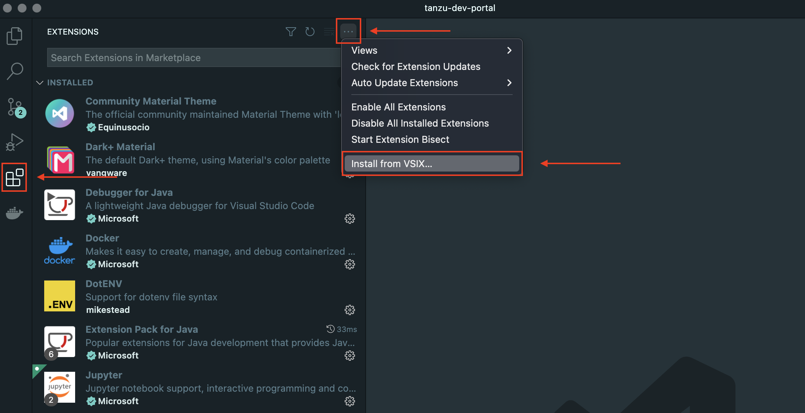
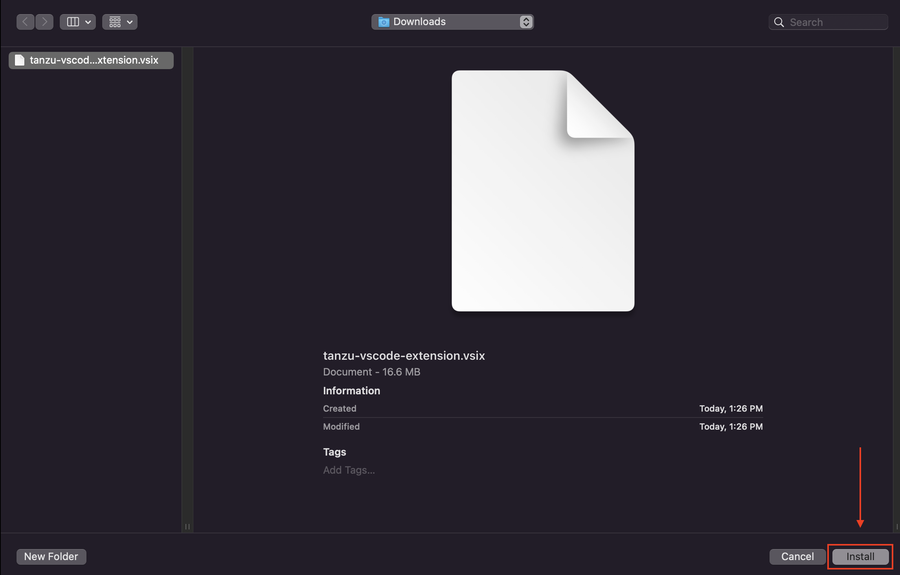
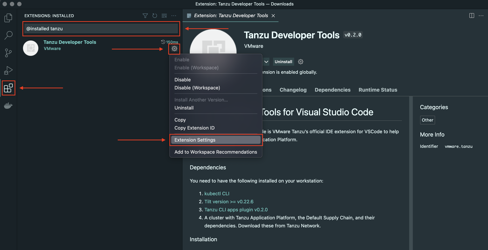
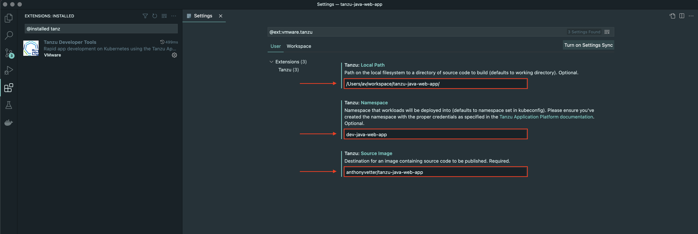
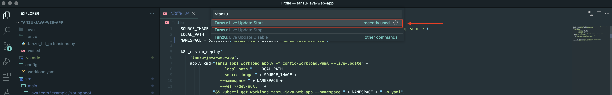

Building out an enterprise-scale, production-ready platform built on top of Kubernetes is one thing. But what about the actual day-to-day job of a developer? It's not about deploying applications and securing supply chains. It's about developing the application itself. 

You have probably heard how VMware Tanzu Application Platform will make developers’ work lives easier by allowing them to spend more time coding and less time managing environments. But how exactly does it enable this?

In this guide, you will set up the Tanzu plug-in for [VS Code](https://code.visualstudio.com) and use it to get a live view of your application while you are developing it. 

By the end of this guide, you will be editing code in your application, and previewing your edits via a live update session deployed locally. 

## Assumptions

These are some assumptions you should be aware of before proceeding with this guide:

* This guide was written for [Tanzu Developer tools for VS Code `v1.0`](https://docs.vmware.com/en/Tanzu-Application-Platform/1.0/tap/GUID-vscode-extension-install.html). 
* This guide assumes you are running MacOS. Specifically, the `v12.0` "Monterey" line. Commands provided in this guide make these assumptions.
* This guide will be updated regularly, but updates might not be timed exactly to new releases of these products or platforms. You may need to modify commands if versions do not line up.
* This guide heavily leverages the [official documentation](https://docs.vmware.com/en/Tanzu-Application-Platform/1.0/tap/GUID-vscode-extension-install.html) for installing the Tanzu Developer tools for VS Code. This guide is meant to be a simple setup to get you started quickly. For more complicated or production setups, refer to the official documentation.

## Prerequisites
* [A Tanzu Network account with `pivnet` installed](/guides/tanzu-network-gs) - This guide walks you through setting up your account on the Tanzu Network, as well as installing the `pivnet` CLI tool.
* [The `tanzu` CLI installed and configured](/guides/tanzu-cli-gs) - This guide walks you through downloading, installing, and using the `tanzu` CLI tool.
* [An install of Tanzu Application Platform](/guides/tanzu-application-platform-gs) - This guide walks you through the install process for Tanzu Application platform. 
* [An application deployed on Tanzu Application Platform](/guides/tanzu-application-platform-deploying-a-workload) - This guide walk you through deploying a sample application onto Tanzu Application Platform.
* [An install of Visual Studio (VS) Code](https://code.visualstudio.com/download) - This guide uses an extension specifically for VS Code to perform application updates. 
* [A Docker Hub account](https://hub.docker.com/signup) - Other repositories are supported, but for ease of use and configuration, this guide uses Docker Hub.
* [A GitHub account](https://docs.github.com/en/get-started/signing-up-for-github/signing-up-for-a-new-github-account) - You will use this account to `push` your sample application to, and later `clone`, modify, and `push` your code changes back to this repo. 

## Set up the environment

In order to make some commands easier to run, you should define some local environment variables. These will include sensitive information, such as passwords. This information will be stored in your shell history file. Be aware of this before proceeding, and consider this section optional. 

1. Define your Docker Hub credentials.

    ```sh
    export DOCKER_HUB_USERNAME=your-docker-hub-username
    ```

2. Define the path to your project directory.

    ```sh
    export PROJECT_PATH=/Users/path/to/tanzu-java-web-app
    ```

## Installing dependencies

There is one dependency that you will need to deploy locally in order for this workflow to work. [Tilt](https://tilt.dev) is an application for enabling live updates of your application while in development. The Tanzu tools for VS code use Tilt to enable this functionality.

1. Install `tilt`. The below command will work by itself, but note that if you are using alternative install methods, you need `v0.23.2` or later. 

    ```sh
    brew install tilt-dev/tap/tilt
    ```

## Installing the Visual Studio Code Tanzu extension

The Tanzu extension for Visual Studio (VS) Code can be downloaded from the Tanzu Network and installed as a file through the VS Code interface. In this section, you will download and install this extension.

1. Download the extension from the Tanzu Network.

    ```sh
    pivnet download-product-files --product-slug='tanzu-application-platform' --release-version='1.0.0' --product-file-id=1115996
    ```

2. Click on the **Extensions** icon on the left. Then click the `...` dropdown. And finally click **Install from VSIX**. 

    

    Alternatively, you can open the VS Code Command Palette with `cmd + shift + P`, start typing `Install from VSIX`, then select that option.

3. Navigate to the downloaded `.VSIX` file and click **Install*. 

    

## Configuring the Visual Studio Code Tanzu extension

The Tanzu Extension for VS Code has minimal configuration options, but it does need to be configured for each application you are working on. This section will walk you through these settings.

1. Open the Tanzu Developer Tools settings by staying on the **Extensions** screen and searching for `@installed tanzu`. Then click the **gear** icon and finally click on the **Extension Settings** option.

    

2. In the settings screen, under **Tanzu: Local Path**, enter the full path for the directory of the local clone of your git project. Under **Tanzu: Namespace**, enter the `$DEVELOPMENT_NAMESPACE` set in the guide for [deploying an application](/guides/tanzu-application-platform-deploying-a-workload). Under **Tanzu: Source Image**, enter your Docker Hub account name and repository as shown. 

    

3. Add your current `kubectl` context for your Kubernetes cluster to your projects `Tiltfile`.

    ```sh
    echo "allow_k8s_contexts('$(kubectl config current-context)')" >> $PROJECT_PATH/Tiltfile
    ```

## Updating your application using the Visual Studio Code Tanzu extension

You are now ready to do some development on your application. Here, you will utilize the Tanzu extension and Tilt to see live updates of your code as you develop, before you push any code back to your repo. 

1. Open your application in VS Code.

    ```sh
    code $PROJECT_PATH
    ```

2. Open the VS Code Command Palette by pressing `cmd + shift + P` and searching for `tanzu`. Then click **Tanzu: Live Update Start**. 

    

    Many logs will stream by in the **Terminal** window within VS Code. This is first the build logs from Tanzu Application Platform building your code into a runnable container and pushing it to your Docker Hub repository. 

    Next, it is running that application on your cluster. You will see the Spring Boot logs after the container is built. 

3. Open your application, which is now running locally and updating based on your code changes. 

    ```sh
    open http://localhost:8080
    ```

    Port `8080` is the default where all of your web views will be available using this process. 

4. Make a code update.

    ```sh
    code $PROJECT_PATH/src/main/java/com/example/springboot/HelloController.java
    ```
    Update the line `return "Greetings from Spring Bot + Tanzu!";` to read anything else you want the web UI to reflect. Example: `return "Greetings from the Tanzu Developer Center!";`. Then save your changes.

    Once saved, you should see the logs start streaming again for the application booting. 

5. Refresh your web UI. And see your code changes live. 

That's it! You are now developing with Tanzu! 

Throughout this series, you have gone from zero familiarity with VMware Tanzu to setting up your own local development environment, deploying an application, and updating that application using Tanzu tools. 

## Next steps

There is a lot more to explore now that your environment is ready and functional. Perhaps getting a local environment up and running? Or maybe setting up DNS so others can collaborate without updating `/etc/hosts`. Of course, you will want to deploy your own projects to Tanzu Application Platform and try this flow out again. 

I hope going through this process has been beneficial to you and helped you get started developing with VMware Tanzu. Please check out our [documentation](https://docs.vmware.com/en/Tanzu-Application-Platform/1.0/tap/GUID-overview.html) for additional questions. Or feel free to [reach out to us](https://github.com/vmware-tanzu/tanzu-dev-portal/issues/new?assignees=&labels=feedback&template=feedback.md&title=) if you have any questions, or want to find out more. 

Finally, check out this video demo of onboarding an application to Tanzu Application Platform and using the Live Update feature! It uses an environment very similar to the one you just set up, and goes through many of the same processes. 


