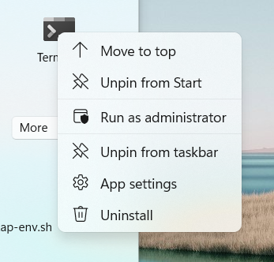

## Introduction 
 
Installing [VMware Tanzu Application Platform][tap] on your PC can be a bit more involved than other development tools, but it's totally worth it. That’s because Tanzu Application Platform is a next generation "DevOps in a box" solution — with all the rich functionality you’d expect from such an offering. Installed on Kubernetes in the public cloud or in a private data center, Tanzu Application Platform offers a modular, application-aware platform that can serve the needs of hundreds of developers at the same time. 

Stick with this tutorial and you’ll be part of an elite group of first-movers — developers just like you who've tried Tanzu Application Platform for themselves and experienced its modern software supply-chain, effortless Kubernetes application deployment, and serverless computing capabilities. Let’s get started! 

{}
The process below has been tested using [VMware Tanzu Application Platform v1.1](https://network.tanzu.vmware.com/products/tanzu-application-platform/) (the most current available at the time of writing) using the <strong>`iterate`</strong> profile. We tested using Windows 11, MacOS Monterey, Ubuntu 20.04 LTS, and Fedora 35.
{}

## Before You Start 
 
There are a few things that you'll need before you install the Tanzu Application Platform: 

* **Hardware**: A computer with a modern Intel i7 or AMD Ryzen 7 processor (or better). You'll need 8 threads, 16 GB of RAM, and 40 GB of free disk space. ARM based architectures like Apple M1 aren't yet supported.
* **Operating System**: Windows 11 Pro, Enterprise, or Education, or MacOS, or Ubuntu 20.04 LTS, or Fedora 35. You'll also need administrator access to this system.  
* **Software**: [Minikube v1.25][minikube] (a laptop friendly version of Kubernetes), [Kubectl v1.23][kubectl] (the command-line tool used to work with Kubernetes).  
* **Online Accounts**: You’ll need a username and password for [Docker Hub][dockerhub] and a username and password for the [Tanzu Network][tanzunet] (registration for both is free). 
* **Network**: An internet connection capable of at least 30 Mb/s download and 10 Mb/s upload. 
* **Time**: About 1 hour (but this can vary depending on your network, processor, RAM, etc.).

_For a full list of system requirements, see the [official Tanzu Application Platform prerequisites][tap-prereq]._

## Stage 1: Download and Install the Tanzu CLI.

To begin your installation of the Tanzu Application Platform you must first install the `tanzu` command-line tool that you’ll use to install the platform and interact with it. This guide assumes you have not installed the `tanzu` tool previously. If you have installed the same version of the `tanzu` cli tool previously, you can skip this step. The instructions for updating (replacing) or removing older versions can be found in the [official documentation][tap-cli-docs].

<p><strong>
1. Agree to the necessary TanzuNet EULAs (End User Licensing Agreements).  
</strong></p>

You will need to accept each of these EULAs in order to progress with the rest of this guide. 

- [Tanzu Application Platform](https://network.tanzu.vmware.com/products/tanzu-application-platform/)
- [Tanzu Cluster Essentials](https://network.tanzu.vmware.com/products/tanzu-cluster-essentials/)
- [Tanzu Build Service](https://network.tanzu.vmware.com/products/build-service/)
- [Tanzu Build Service Dependencies](https://network.tanzu.vmware.com/products/tbs-dependencies/)
- [Tanzu Buildpacks Suite](https://network.tanzu.vmware.com/products/tanzu-buildpacks-suite)
- [Tanzu Stacks Suite](https://network.tanzu.vmware.com/products/tanzu-stacks-suite)

<p><strong>
2. Download the Tanzu CLI.
</strong></p>

Go to the [VMware Tanzu Application Platform product page](https://network.tanzu.vmware.com/products/tanzu-application-platform/). Select the `tanzu-cli-v0.11.2` option and then download the `tanzu-framework-bundle` binary that matches your operating system (either `tanzu-framework-bundle-windows`, `tanzu-framework-bundle-mac`, or `tanzu-framework-bundle-linux`).

<p><strong>
3. Create a new system folder for the <code>tanzu</code> cli.
</strong></p>




Open a new PowerShell Terminal with Administrator privileges. Do this by clicking on the 'Start' button -> right-click 'Terminal' -> and select 'Run as administrator' as shown in the image below.



Now create a `tanzu` folder under `C:\Program Files` that will be the home of your Tanzu CLI.

```powershell
# Create a new home for the Tanzu CLI tool in the "Program Files" folder
mkdir "C:\Program Files\tanzu"
```




{}
Not required, move on to the next step.
{}




<p><strong>
4. Add the location of the <code>tanzu</code> folder to your System’s <code>PATH</code>.
</strong></p>




```powershell
# Add the location to current PATH (temporary)
$Env:PATH += ";C:\Program Files\tanzu"

# Add the folder to the system PATH (permanently)
$oldPath = [Environment]::GetEnvironmentVariable('Path', [EnvironmentVariableTarget]::Machine)
if ($oldPath.Split(';') -inotcontains 'C:\Program Files\tanzu'){ `
  [Environment]::SetEnvironmentVariable('Path', $('{0};C:\Program Files\tanzu' -f $oldPath), [EnvironmentVariableTarget]::Machine) `
}
```




{}
Not required, move on to the next step.
{}




<p><strong>
5. Extract the <code>tanzu</code> cli, install it, and install the plug-ins that it requires.
</strong></p>




Back in your Admin PowerShell window, follow these steps to extract and install the `tanzu` cli (assumes the downloaded file is in your `Downloads` folder):

```powershell
# Move to the folder containing the downloaded file.
cd "C:\Users\$env:USERNAME\Downloads"

# Extract the zip
Expand-Archive .\tanzu-framework-windows-amd64.zip
 
# Move to the extracted Tanzu CLI directory
cd tanzu-framework-windows-amd64

# Copy the Tanzu CLI tool to your new tanzu folder
cp "cli\core\v0.11.2\tanzu-core-windows_amd64.exe" "C:\Program Files\tanzu\tanzu.exe"

# Install the tanzu cli plug-ins needed for TAP installation
$Env:TANZU_CLI_NO_INIT = "true"
tanzu plugin install --local cli all
```




In your Terminal, follow these steps to extract and install the `tanzu` cli (assumes the downloaded file is in your `Downloads` folder):

```sh
# Move to the folder containing the downloaded file.
cd ~/Downloads

# Make a directory to extract the archive into
mkdir tanzu

# Extract the tar file into your ~/tanzu directory
tar -xvf tanzu-framework-darwin-amd64.tar -C ./tanzu

# Change your working directory to the install directory.
cd tanzu

# Run the install binary to complete the base installation.
sudo install cli/core/v0.11.2/tanzu-core-darwin_amd64  /usr/local/bin/tanzu

# Install the tanzu cli plug-ins needed for TAP installation
export TANZU_CLI_NO_INIT="true"
tanzu plugin install --local cli all
```




Open a new Terminal and follow these steps to extract and install the `tanzu` cli (assumes the downloaded file is in your `Downloads` folder):

```sh
# Move to the folder containing the downloaded file.
cd ~/Downloads

# Make a directory to extract the archive into
mkdir tanzu

# Extract the tar archive into your ~/tanzu directory
tar -xvf tanzu-framework-linux-amd64.tar -C ./tanzu

# Change your working directory to the extracted archive directory.
cd tanzu

# Run the install binary to complete the base installation.
sudo install cli/core/v0.11.2/tanzu-core-linux_amd64 /usr/local/bin/tanzu

# Install the Tanzu CLI Plugins
export TANZU_CLI_NO_INIT="true" 
tanzu plugin install --local cli all
```




<p><strong>
6. Check the <code>tanzu</code> cli is working.
</strong></p>

The following commands will help you check that the `tanzu` cli and its plugins are installed correctly.




```sh
# Expect version: v0.11.2
tanzu version 

# Expect the package, secret, apps, services, and accelerator plugins to have a STATUS of 'installed'
tanzu plugin list 
```



## Stage 2: Run minikube

Now that the `tanzu` cli and plugins are installed, you can start up your Minikube Kubernetes cluster. The Tanzu Application Platform supports Minikube for local installations as long as some specific configuration settings have been set. 

{}
If you have existing applications running on Minikube, it may be best to define a new minikube profile for your Tanzu Application Platform installation using the `-p <profile-name>` switch. If you choose to do this, remember to use the same profile switch for every minikube command.
{}

<p><strong>
1. Start Minikube with 8 CPUs, 12 GB RAM, and version 1.22 of Kubernetes.
</strong></p>



```powershell
minikube start --kubernetes-version='1.22.8' --cpus='8' --memory='12g' --driver='hyperv'
```

{}
In Windows 11 we tested using [Hyper-V](https://docs.microsoft.com/en-us/virtualization/hyper-v-on-windows/about/) as minikube's [VM driver](https://minikube.sigs.k8s.io/docs/drivers/). To discover your minikube VM driver, use the command `minikube profile list` after minikube has started. [Hyper-V can be added as a Windows feature](https://docs.microsoft.com/en-us/virtualization/hyper-v-on-windows/quick-start/enable-hyper-v) in the Pro, Enterprise, or Education versions of Windows 10.
{}




```sh
minikube start --kubernetes-version='1.22.8' --memory='12g' --cpus='8'
```

{}
In MacOS we tested with Docker as Minikube's [VM driver](https://minikube.sigs.k8s.io/docs/drivers/). Your Docker daemon should have at least 8 CPUs and 12 GB of RAM allocated. These settings can be found in Docker -> Preferences -> Resources. If you hit issues with this driver, you could try `--driver='hyperkit'` to force the use of [HyperKit](https://github.com/moby/hyperkit) as Minikube's VM driver. To discover your VM driver, after you have run `minikube start` use the command `minikube profile list`.
{}




```sh
minikube start --kubernetes-version='1.22.8' --memory='12g' --cpus='8' 
```

{}
In Ubuntu 20.04 LTS we used Docker as Minikube's [VM driver](https://minikube.sigs.k8s.io/docs/drivers/). In Fedora 35 we used KVM2 as the VM driver by adding `--driver='kvm2'` to the above command. To discover your VM driver, after you have run `minikube start` use the command `minikube profile list`.
{}




<p><strong>
2. Find the IP address of the Minikube cluster.
</strong></p>




Make a note of the IP address returned below, you will need it in the next step.

```powershell
minikube ip
```




<p><strong>
3. Add a new hostname entry to your operating system's <code>hosts</code> file.
</strong></p>

In order to route network traffic to the application that you'll run on the Tanzu Application Platform you must add a new line to your `hosts` file. This line binds the URLs of the application to the Minikube IP address you discovered in the previous step.




Open the `hosts` file in Notepad.

```powershell
# Open the hosts file in Notepad (as Admin).
Start-Process notepad -Verb runas "c:\Windows\System32\Drivers\etc\hosts"
```

In Notepad, add a new line to your hosts file as follows...
```text
<your-minikube-ip-address> tanzu-java-web-app.default.apps.example.com
```




Open the `hosts` file in Nano (or your favorite alternative) as follows:

```sh
# Open the hosts file in Nano (as sudo).
sudo nano /etc/hosts
```

In Nano, add a new line to your hosts file as follows...

```text
127.0.0.1 tanzu-java-web-app.default.apps.example.com
```

{}
Some readers reported that setting the hosts entry to `127.0.0.1` worked best with Docker. If it doesn't work for you, or if you're using HyperKit, set the entry to the IP reported by the `minikube ip` command.
{}




Open the `hosts` file in Nano (or your favorite alternative) as follows:

```sh
# Open the hosts file in Nano (as sudo).
sudo nano /etc/hosts
```

In Nano, add a new line to your hosts file as follows...

```text
<your-minikube-ip-address> tanzu-java-web-app.default.apps.example.com
```




{}
Any additional apps that you deploy to the Tanzu Application Platform must also have their URLs added to your `hosts` file. This will ensure that HTTP calls can be routed correctly.
{}

<p><strong>
4. Open the Minikube tunnel. 
</strong></p>

Minikube provides a network tunnel process which allows Kubernetes services of type <code>LoadBalancer</code> to be addressable from your PC's network. You must start this tunnel whenever you want to install or use the Tanzu Application Platform on Minikube.




{}
Requires an Administrator PowerShell.
{}

```powershell
minikube tunnel
```

{}
Leave this `minikube tunnel` process running and open a new Admin PowerShell when you begin the next stage.
{}




{}
Requires super user (sudo) privileges.
{}

```powershell
sudo minikube tunnel
```

{}
Leave this `minikube tunnel` process running and open a new Terminal when you begin the next stage.
{}





## Stage 3: Install Cluster Essentials for VMware Tanzu onto Minikube

The `tanzu` cli you installed earlier acts as an agent. It passes instructions to the Tanzu Application Platform so they can be carried out inside Kubernetes. For this to work, the `tanzu` cli needs a command broker inside Kubernetes in the form of a [`kapp-controller`][kapp-controller] and a method for managing the generation of platform secrets in the form of a [`secretgen-controller`][secretgen-controller]. 

The `kapp-controller` and `secretgen-controller` are part of [Cluster Essentials for VMware Tanzu][tanzunet-cluster-essentials] which you will install next. For Windows, this involves issuing some `kubectl` commands. For macOS and Linux, there is a dedicated installer which you will download and run.

<strong><p>
    1. Add Cluster Essentials for VMware Tanzu to your Minikube cluster.
</strong></p>




In a <strong>new</strong> Admin PowerShell window...

```powershell
# Create the required Kubernetes namespaces.
kubectl create namespace tanzu-cluster-essentials
kubectl create namespace kapp-controller
kubectl create namespace secretgen-controller

# Apply the YAML configuration for the kapp-controller
kubectl apply -f https://github.com/vmware-tanzu/carvel-kapp-controller/releases/download/v0.34.0/release.yml -n kapp-controller

# Apply the YAML configuration for the secretgen-controller
kubectl apply -f https://github.com/vmware-tanzu/carvel-secretgen-controller/releases/download/v0.8.0/release.yml -n secretgen-controller 
```



1. Open your browser and navigate to the [Cluster Essentials for VMware Tanzu product page on the Tanzu Network](https://network.tanzu.vmware.com/products/tanzu-cluster-essentials)

2. Download the `tanzu-cluster-essentials-darwin-amd64-1.1.0.tgz` file to your `Downloads` folder..
 
3. In a <strong>new</strong> Terminal window issue the following commands:

```sh
# Move to the folder containing the downloaded file.
cd ~/Downloads

# Specify the VMware Cluster Essentials for Tanzu bundle details
export INSTALL_BUNDLE="registry.tanzu.vmware.com/tanzu-cluster-essentials/cluster-essentials-bundle@sha256:ab0a3539da241a6ea59c75c0743e9058511d7c56312ea3906178ec0f3491f51d"
export INSTALL_REGISTRY_HOSTNAME="registry.tanzu.vmware.com"
export INSTALL_REGISTRY_USERNAME='' # <- Insert Your Tanzu Network username
export INSTALL_REGISTRY_PASSWORD='' # <- Insert Your Tanzu Network password

# Create a directory for these packages
mkdir tanzu-cluster-essentials

# Unpack the TAR file into the tanzu-cluster-essentials directory by running:
tar -xvf tanzu-cluster-essentials-darwin-amd64-1.1.0.tar -C ./tanzu-cluster-essentials

# Change the directory 
cd tanzu-cluster-essentials

# Run the install script
./install.sh
```




1. Open your browser and [navigate to the Cluster Essentials for VMware Tanzu product page on the Tanzu Network](https://network.tanzu.vmware.com/products/tanzu-cluster-essentials)

2. Download the `tanzu-cluster-essentials-linux-amd64-1.1.0.tgz` file to your `Downloads` folder.

3. In a <strong>new</strong> Terminal window issue the following commands...

```sh
# Move to the Downloads folder
cd ~/Downloads

# Specify the VMware Cluster Essentials for Tanzu bundle details
export INSTALL_BUNDLE="registry.tanzu.vmware.com/tanzu-cluster-essentials/cluster-essentials-bundle@sha256:ab0a3539da241a6ea59c75c0743e9058511d7c56312ea3906178ec0f3491f51d"
export INSTALL_REGISTRY_HOSTNAME="registry.tanzu.vmware.com"
export INSTALL_REGISTRY_USERNAME='' # <- Insert Your Tanzu Network username
export INSTALL_REGISTRY_PASSWORD='' # <- Insert Your Tanzu Network password

# Make a folder for the extracted archive files
mkdir tanzu-cluster-essentials

# Extract the archive
tar -xvf tanzu-cluster-essentials-linux-amd64-1.1.0.tgz -C ./tanzu-cluster-essentials

# Move to the extracted folder
cd tanzu-cluster-essentials

# Install VMware Cluster Essentials for Tanzu
./install.sh
```




Wait until the `kapp-controller` and `secretgen-controller` pods reach the `running` state before continuing to the next stage. You can view the current state of all your Kubernetes pods with this command:




```powershell
# Ensure that kapp-controller and secretgen-controller are ‘running’ 
kubectl get pods --all-namespaces 
```



## Stage 4: Install the Tanzu Application Platform

You are now ready to install the Tanzu Application Platform onto your Minikube Kubernetes cluster. First, to make this task easier, you will create some additional environment variables in the terminal that you're using. These variables include the username and password of your Docker Hub account amongst other things.

{}
In the code below [Docker Hub](https://hub.docker.com/) is recommended as your container registry. But, personal (free) Docker Hub accounts do have [usage limits](https://www.docker.com/pricing/). Hitting these limits may interrupt your installation. If your Docker Hub account uses 2FA, you'll need to generate an Access Token and use it as your password.
{}

<strong><p>
    1. Create the Tanzu Application Platform installation environment variables:
</strong></p>




Fill in the missing details as you create these environment variables in your PowerShell.

```powershell
# Create Tanzu Application Platform Install Environment Variables
$Env:PATH += ";C:\Program Files\tanzu"
$Env:TAP_VERSION = "1.1.0"
$Env:TAP_NAMESPACE = "tap-install"
$Env:DOMAIN = "example.com"
$Env:APPS_DOMAIN = "apps.example.com"
 
# Set the TAP installation registry details
$Env:INSTALL_REGISTRY_HOSTNAME = "registry.tanzu.vmware.com"
$Env:INSTALL_REGISTRY_USERNAME = "" # < Insert Your Tanzu Network username
$Env:INSTALL_REGISTRY_PASSWORD = "" # < Insert Your Tanzu Network password

# Set the developer’s ‘push’ capable docker container registry details
$Env:DOCKER_SERVER = "https://index.docker.io/v1/"
$Env:DOCKER_USERNAME = "" # < Insert Your Docker Hub username
$Env:DOCKER_PASSWORD = "" # < Insert Your Docker Hub password (or Access Token if 2FA is enabled)
```



Fill in the missing details as you create these environment variables in your Terminal.

```sh
# Create Tanzu Application Platform Install Environment Variables
export TAP_VERSION="1.1.0"
export TAP_NAMESPACE="tap-install"
export DOMAIN="example.com"
export APPS_DOMAIN="apps.example.com"

# Set the developer’s ‘push’ capable docker container registry details
export DOCKER_SERVER="https://index.docker.io/v1/"
export DOCKER_USERNAME='' # < Insert Your Docker Hub username
export DOCKER_PASSWORD='' # < Insert Your Docker Hub password (or Access Token if 2FA is enabled)
```




Setting these environment variables will make the rest of the steps in this section much easier.

<strong><p>
2. Create the Kubernetes namespace used by the Tanzu Application Platform installation.
</strong></p>




```powershell
kubectl create ns $env:TAP_NAMESPACE 
```



```powershell
kubectl create ns $TAP_NAMESPACE 
```




<strong><p>
3. Add the credentials used to pull the Tanzu Application Platform images from the Tanzu Network.
</strong></p>




```powershell
tanzu secret registry add tap-registry `
  --username $env:INSTALL_REGISTRY_USERNAME `
  --password $env:INSTALL_REGISTRY_PASSWORD `
  --server $env:INSTALL_REGISTRY_HOSTNAME `
  --namespace $env:TAP_NAMESPACE `
  --export-to-all-namespaces `
  --yes
```



```sh
tanzu secret registry add tap-registry \
  --username $INSTALL_REGISTRY_USERNAME \
  --password $INSTALL_REGISTRY_PASSWORD \
  --server $INSTALL_REGISTRY_HOSTNAME \
  --namespace $TAP_NAMESPACE \
  --export-to-all-namespaces \
  --yes 
```




<strong><p>
4. Add a repository record for the Tanzu Application Platform package repository.
</strong></p>




```powershell
tanzu package repository add tanzu-tap-repository `
  --url $env:INSTALL_REGISTRY_HOSTNAME/tanzu-application-platform/tap-packages:$env:TAP_VERSION `
  --namespace $env:TAP_NAMESPACE
```



```sh
tanzu package repository add tanzu-tap-repository \
  --url $INSTALL_REGISTRY_HOSTNAME/tanzu-application-platform/tap-packages:$TAP_VERSION \
  --namespace $TAP_NAMESPACE 
```




The above steps may take a few minutes to complete. When finished, the final status of the package installation should read `Reconcile succeeded`. If it gets interrupted for any reason it might fail to reconcile or give an error. If that happens, just check the status using the commands below and try again if necessary.




```sh
# Check for STATUS: “Reconcile succeeded”
tanzu package repository get tanzu-tap-repository --namespace $env:TAP_NAMESPACE 

# Check for a big list of platform packages
tanzu package available list --namespace $env:TAP_NAMESPACE 
```



```sh
# Check for STATUS: “Reconcile succeeded”
tanzu package repository get tanzu-tap-repository --namespace $TAP_NAMESPACE 

# Check for a big list of ready to use packages
tanzu package available list --namespace $TAP_NAMESPACE 
```



Now that all the required packages, registries, and secrets have been added to the Kubernetes cluster we are almost ready to install the Tanzu Application Platform itself. 

Installing Tanzu Application Platform requires a configuration file in YAML format. This file contains the configuration details required by various components in the system and must be customized to fit your setup. To make this easier, a template has been provided containing placeholders. You will replace these placeholders with the environment variables you configured in step 1.

<strong><p>
5. Download the configuration file template and customize it.
</strong></p>

Download the template to your working directory and substitute the placeholders inside it as follows:




```powershell
# Download the template file.
curl.exe -o template-tap-values.yml https://raw.githubusercontent.com/benwilcock/TAPonLAP/main/TAPonLAPv1.1/template-tap-values-win.yml

# Customize the template using the environment variables you created in step 1.
gc template-tap-values.yml | foreach { [Environment]::ExpandEnvironmentVariables($_) } | sc tap-values.yml
```



```sh
# Download the template file.
curl -o template-tap-values.yml https://raw.githubusercontent.com/benwilcock/TAPonLAP/main/TAPonLAPv1.1/template-tap-values-nix.yml

# Customize the template using the environment variables you created in step 1.
envsubst < template-tap-values.yml > tap-values.yml
```




{}
Take a moment to check that the file <strong>`tap-values.yml`</strong> has been created for you, and that all the capitalized placeholders in the template have been swapped for the environment variables you set up in step 1. 
{}

<strong><p>
6. Install the Tanzu Application Platform onto Minikube.
</strong></p>

You may now install the Tanzu Application Platform onto Minikube using the command below. Notice that the `tap-values.yml` file you created in the previous step is required by the `tanzu` command and used to customize your installation.



```powershell
tanzu package install tap -p tap.tanzu.vmware.com -v $env:TAP_VERSION `
  --values-file tap-values.yml `
  --poll-timeout 45m `
  --namespace $env:TAP_NAMESPACE
```



```sh
tanzu package install tap -p tap.tanzu.vmware.com -v $TAP_VERSION \
  --values-file tap-values.yml \
  --poll-timeout 45m \
  --namespace $TAP_NAMESPACE
```




{}
This process can take a while. It creates a lot of load on your PC and some internet traffic on your network. The amount of time needed depends on your network, cpu, disk, and memory. If you are sharing a home network with others, or if you are pressed for time, you may prefer to perform this part of the installation at a less disruptive time of the day. 
{}

{}
<strong>You can delete the `tap-values.yml` file.</strong> 
<br>It contains your passwords and you no longer need it.
{}

Sometimes, this process can appear to end in failure but in reality it has just timed out. You can check the true status of your installation at any time by opening another PowerShell or Terminal window and asking the `tanzu` cli for the reconciliation status of the Tanzu Application Platform packages. Use the command described below to check the current status. 

Be patient. The Tanzu Application Platform is self-healing but downloading the various microservice containers can take a while. A system monitor like Performance Monitor (Windows), `top` (macOS), [`bpytop`](https://github.com/aristocratos/bpytop) (Linux), or a Kubernetes dashboard like [k9s](https://k9scli.io/) may offer some useful insights while the installation progresses.




Check the current status of your Tanzu Application Platform installation.

```sh
tanzu package installed list -A
```

The Tanzu Application Platform is considered healthy when all its packages have a `STATUS` of `Reconcile Succeeded`. 

```sh
Retrieving installed packages... 
  NAME                      PACKAGE-NAME                                        PACKAGE-VERSION  STATUS               NAMESPACE
  appliveview               backend.appliveview.tanzu.vmware.com                1.1.0            Reconcile succeeded  tap-install
  appliveview-connector     connector.appliveview.tanzu.vmware.com              1.1.0            Reconcile succeeded  tap-install
  appliveview-conventions   conventions.appliveview.tanzu.vmware.com            1.1.0            Reconcile succeeded  tap-install
  buildservice              buildservice.tanzu.vmware.com                       1.5.0            Reconcile succeeded  tap-install
  cartographer              cartographer.tanzu.vmware.com                       0.3.0            Reconcile succeeded  tap-install
  cert-manager              cert-manager.tanzu.vmware.com                       1.5.3+tap.2      Reconcile succeeded  tap-install
  cnrs                      cnrs.tanzu.vmware.com                               1.2.0            Reconcile succeeded  tap-install
  contour                   contour.tanzu.vmware.com                            1.18.2+tap.2     Reconcile succeeded  tap-install
  conventions-controller    controller.conventions.apps.tanzu.vmware.com        0.6.3            Reconcile succeeded  tap-install
  developer-conventions     developer-conventions.tanzu.vmware.com              0.6.0            Reconcile succeeded  tap-install
  fluxcd-source-controller  fluxcd.source.controller.tanzu.vmware.com           0.16.4           Reconcile succeeded  tap-install
  image-policy-webhook      image-policy-webhook.signing.apps.tanzu.vmware.com  1.1.1            Reconcile succeeded  tap-install
  ootb-delivery-basic       ootb-delivery-basic.tanzu.vmware.com                0.7.0            Reconcile succeeded  tap-install
  ootb-supply-chain-basic   ootb-supply-chain-basic.tanzu.vmware.com            0.7.0            Reconcile succeeded  tap-install
  ootb-templates            ootb-templates.tanzu.vmware.com                     0.7.0            Reconcile succeeded  tap-install
  service-bindings          service-bindings.labs.vmware.com                    0.7.1            Reconcile succeeded  tap-install
  services-toolkit          services-toolkit.tanzu.vmware.com                   0.6.0            Reconcile succeeded  tap-install
  source-controller         controller.source.apps.tanzu.vmware.com             0.3.3            Reconcile succeeded  tap-install
  spring-boot-conventions   spring-boot-conventions.tanzu.vmware.com            0.4.0            Reconcile succeeded  tap-install
  tap                       tap.tanzu.vmware.com                                1.1.0            Reconcile succeeded  tap-install
  tap-auth                  tap-auth.tanzu.vmware.com                           1.0.1            Reconcile succeeded  tap-install
  tap-telemetry             tap-telemetry.tanzu.vmware.com                      0.1.4            Reconcile succeeded  tap-install
  tekton-pipelines          tekton.tanzu.vmware.com                             0.33.2           Reconcile succeeded  tap-install
```

{}
To reach a 'healthy' state, the Tanzu Application Platform needs the <strong>`minikube tunnel`</strong> process to be running with administrator privileges as described in [Stage 2: Run Minikube](#stage-2-run-minikube).
{}




## Stage 5: Create A Developer Workspace

Developers using Tanzu Application Platform need a Kubernetes namespace where they can work in isolation from the rest of the system. This namespace also needs access to a container registry where container images built by the platform can be stored.  This namespace also needs certain Kubernetes roles and privileges in order to integrate with the rest of the Tanzu Application Platform.

<p><strong>
1. Add a developer namespace, registry, roles, and privileges.
</strong></p>



```powershell
# Set the developer namespace value to 'default'
$Env:TAP_DEV_NAMESPACE = "default"

# Create a namespace for the developer
kubectl create ns $env:TAP_DEV_NAMESPACE

# Add a secret for the developer container registry
tanzu secret registry add registry-credentials `
  --server $env:DOCKER_SERVER `
  --username $env:DOCKER_USERNAME `
  --password $env:DOCKER_PASSWORD `
  --namespace $env:TAP_DEV_NAMESPACE

# Obtain the service accounts YAML configuration file
curl.exe -o serviceaccounts.yml https://raw.githubusercontent.com/benwilcock/TAPonLAP/main/TAPonLAPv1.1/serviceaccounts.yml

# Apply the necessary RBAC Roles, Accounts, Bindings etc. to Kubernetes.
kubectl -n $env:TAP_DEV_NAMESPACE apply -f "serviceaccounts.yml"
```



```sh
# Set the developer namespace value to 'default'
export TAP_DEV_NAMESPACE="default"

# Create a namespace for the developer to work in 
kubectl create ns $TAP_DEV_NAMESPACE

# Add the secret for the BUILD Container Registry 
tanzu secret registry add registry-credentials \
  --server $DOCKER_SERVER \
  --username $DOCKER_USERNAME \
  --password $DOCKER_PASSWORD \
  --namespace $TAP_DEV_NAMESPACE 

# Obtain the service accounts file 
curl -o serviceaccounts.yml https://raw.githubusercontent.com/benwilcock/TAPonLAP/main/TAPonLAPv1.1/serviceaccounts.yml

# Add the necessary RBAC Roles, Accounts, Bindings etc... 
kubectl -n $TAP_DEV_NAMESPACE apply -f "serviceaccounts.yml" 
```




## Stage 6: Run A Workload

Tanzu Application Platform uses the term ‘workload’ to describe an application running on the platform. Now that the platform is installed, building and running a workload requires just one simple instruction.

<p><strong>
1. Run a new application workload on the Tanzu Application Platform.
</strong></p>



```powershell
# Create the workload
tanzu apps workload create tanzu-java-web-app `
  --git-repo https://github.com/sample-accelerators/tanzu-java-web-app `
  --git-branch main `
  --type web `
  --label app.kubernetes.io/part-of=tanzu-java-web-app `
  --label tanzu.app.live.view=true `
  --label tanzu.app.live.view.application.name=tanzu-java-web-app `
  --annotation autoscaling.knative.dev/minScale=1 `
  --namespace $env:TAP_DEV_NAMESPACE `
  --yes 

# Watch the platform build the workload. Press Ctrl-C to exit.
tanzu apps workload tail tanzu-java-web-app --since 10m --timestamp 
```



```sh
# Create the workload
tanzu apps workload create tanzu-java-web-app \
  --git-repo https://github.com/sample-accelerators/tanzu-java-web-app \
  --git-branch main \
  --type web \
  --label app.kubernetes.io/part-of=tanzu-java-web-app \
  --label tanzu.app.live.view=true \
  --label tanzu.app.live.view.application.name=tanzu-java-web-app \
  --annotation autoscaling.knative.dev/minScale=1 \
  --namespace $TAP_DEV_NAMESPACE \
  --yes

# Watch the platform build the workload. Press Ctrl-C to exit.
tanzu apps workload tail tanzu-java-web-app --since 10m --timestamp 
```




The Tanzu Application Platform does not need an application binary or a container image in order to build and deploy a workload. The platform needs only the GitHub repository URL, branch name, or tag of the source code you wish to run and it takes care of the rest. If the source code ever changes, the platform will also rebuild and redeploy the workload automatically. 

{}
In the above example, the workload is a simple Java application built using Spring Boot. Java, Spring, Go, Python, and many other programming languages are supported out-of-the-box on the Tanzu Application Platform using a system called [buildpacks](https://tanzu.vmware.com/components/buildpacks).  
{}

<p><strong>
2. Check the progress of the workload's deployment.
</strong></p>

The `tanzu` cli offers commands that allow you to check the details and progress of the workload's deployment.




Check the progress of the deployment.

```powershell
tanzu apps workload get tanzu-java-web-app
```

The workload deployment has finished when the `Workload Knative Services` entry says `Ready` and the workload has a `URL` (as shown below).

```sh
lastTransitionTime: "2022-03-17T08:08:03Z"
message: ""
reason: Ready
status: "True"
type: Ready

Workload pods
NAME                                                  STATUS      RESTARTS   AGE
tanzu-java-web-app-00001-deployment-b4b456f65-9kpgq   Running     0          4h19m
tanzu-java-web-app-build-1-build-pod                  Succeeded   0          18h
tanzu-java-web-app-config-writer-2gjwm-pod            Succeeded   0          18h
tanzu-java-web-app-config-writer-lr8fr-pod            Succeeded   0          5h35m

Workload Knative Services
NAME                 READY   URL
tanzu-java-web-app   Ready   http://tanzu-java-web-app.default.apps.example.com
```





It takes several minutes for a workload to become `Ready`. The Tanzu Application Platform does a lot of work on your behalf. The software supply-chain must download the source code, compile it, package it, and create a container image. This image must be then be pushed to your container registry, network routing set up, Kubernetes pods, deployments, and ReplicaSets configured, and the application scheduled to run on the cluster. 

When in active development, the platform includes a handy [live-reload feature][dev-gs-innerloop] that allows you to iterate on your app without fully building and deploying it each time.

<p><strong>
3. Test the Workload.
</strong></p>

You can test the workload in your browser with the URL [http://tanzu-java-web-app.default.apps.example.com](http://tanzu-java-web-app.default.apps.example.com). Or, if you prefer, you can use a `curl` command and test your workload as follows.



```powershell
curl.exe http://tanzu-java-web-app.default.apps.example.com
```

You should see the following text:

```sh
Greetings from Spring Boot + Tanzu!
```

{}
Remember, this test can only work if your PC's <strong>`\etc\hosts`</strong> file has been edited correctly and the <strong>`minikube tunnel`</strong> process is running with administrator privileges as described in [Stage 2](#stage-2-run-minikube).
{}




```sh
curl http://tanzu-java-web-app.default.apps.example.com
```

You should see the following text:

```sh
Greetings from Spring Boot + Tanzu!
```

{}
Remember, this test can only work if your PC's <strong>`/etc/hosts`</strong> file has been edited correctly and the <strong>`minikube tunnel`</strong> process is running as described in [Stage 2](#stage-2-run-minikube).
{}





## Wrapping Up

Congratulations! You have installed the Tanzu Application Platform and tested it by running a Java workload. 

Although it took a while, you’ve done something amazing! You’ve installed an enterprise-grade application platform onto Kubernetes which you can now experiment with and show to others. 

With a single command, you made the platform build some source code, create a container image, and run this container image inside Kubernetes. You did this without having to write any of the YAML normally required to describe your application's pods, replicasets, deployments, or services. Plus, if the code ever changes, the platform will automatically re-build and re-deploy the application for you. 

And that’s just the tip of the iceberg. The Tanzu Application Platform is designed to be fully customizable. The opportunities for improved developer productivity and supply-chain excellence are truly mind boggling!

## Tearing Down

Once you’re done with the Tanzu Application Platform for the day, you can shut it down with the command `minikube stop` and start it up again the next day with `minikube start`. Before you use the platform you will need to wait for it to become healthy as discussed in [Stage 4](#stage-4-install-the-tanzu-application-platform-onto-minikube) and ensured you have the `minikube tunnel` process running as discussed in [Stage 2](#stage-2-run-minikube). 

If you want to remove Tanzu Application Platform from your PC, the simplest approach is to use the `minikube delete` command. The instructions for [removing the `tanzu` cli are in the official docs][remove-tanzu-cli].

## Next Steps

We hope you enjoyed this guide and that it helped you to get started on your Tanzu Application Platform journey. Please check out the [documentation for the platform][tap-docs] if you have additional questions. Feel free to [give us feedback][feedback] if you have any questions, or issues we can help you with. 

Continue your Tanzu Application Platform learning journey with these great resources.

1. Does your PC not meet the requirements? Experience the Tanzu Application Platform without an installation using the online VMware [Tanzu Application Platform Hands On Lab][tap-hol] (registration is free).
3. Learn [how to how to use the Tanzu Dev Tools for Visual Studio Code][dev-gs-innerloop] to speed up your development cycles on the Tanzu Application Platform.
2. Download the [Tanzu Dev Tools for Visual Studio Code][tap-vscode-download] and read the [docs][tap-vscode-docs].

Finally, check out this video demonstrating the deployment of an application to Tanzu Application Platform and using the Live Update feature! 

---
[tap]: https://tanzu.vmware.com/application-platform
[minikube]: https://minikube.sigs.k8s.io/docs/start/
[kubectl]: https://kubernetes.io/docs/tasks/tools/
[dockerhub]: https://hub.docker.com/
[tanzunet]: https://network.tanzu.vmware.com/

[dev-gs-innerloop]: /guides/tanzu-application-platform-inner-loop
[feedback]: https://github.com/vmware-tanzu/tanzu-dev-portal/issues/new?assignees=&labels=feedback&template=feedback.md&title=
[tap-hol]: https://via.vmw.com/TAP-HOL

[hyperv]: https://docs.microsoft.com/en-us/virtualization/hyper-v-on-windows/about/
[hyperv-enable]: https://docs.microsoft.com/en-us/virtualization/hyper-v-on-windows/quick-start/enable-hyper-v
[minikube-vms]: https://minikube.sigs.k8s.io/docs/drivers/
[kapp-controller]: https://carvel.dev/kapp-controller/
[secretgen-controller]: https://github.com/vmware-tanzu/carvel-secretgen-controller

[tap-vscode-download]: https://network.tanzu.vmware.com/products/tanzu-application-platform/
[tanzunet-cluster-essentials]: https://network.tanzu.vmware.com/products/tanzu-cluster-essentials

[tap-docs]:         https://docs.vmware.com/en/Tanzu-Application-Platform/1.1/tap/GUID-overview.html
[tap-prereq]:       https://docs.vmware.com/en/Tanzu-Application-Platform/1.1/tap/GUID-prerequisites.html
[tap-cli-docs]:     https://docs.vmware.com/en/Tanzu-Application-Platform/1.1/tap/GUID-install-tanzu-cli.html
[tap-vscode-docs]:  https://docs.vmware.com/en/Tanzu-Application-Platform/1.1/tap/GUID-vscode-extension-installation.html
[remove-tanzu-cli]: https://docs.vmware.com/en/Tanzu-Application-Platform/1.1/tap/GUID-uninstall.html#remove-tanzu-cli

