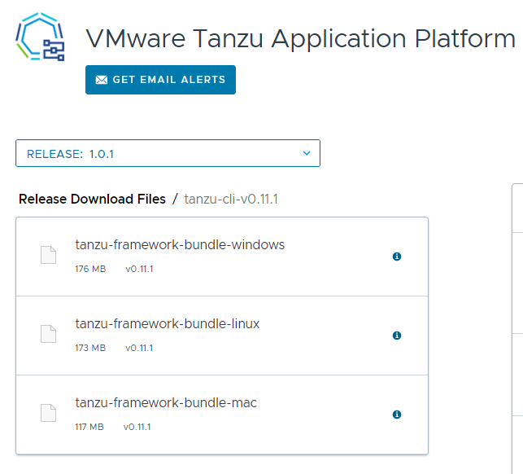
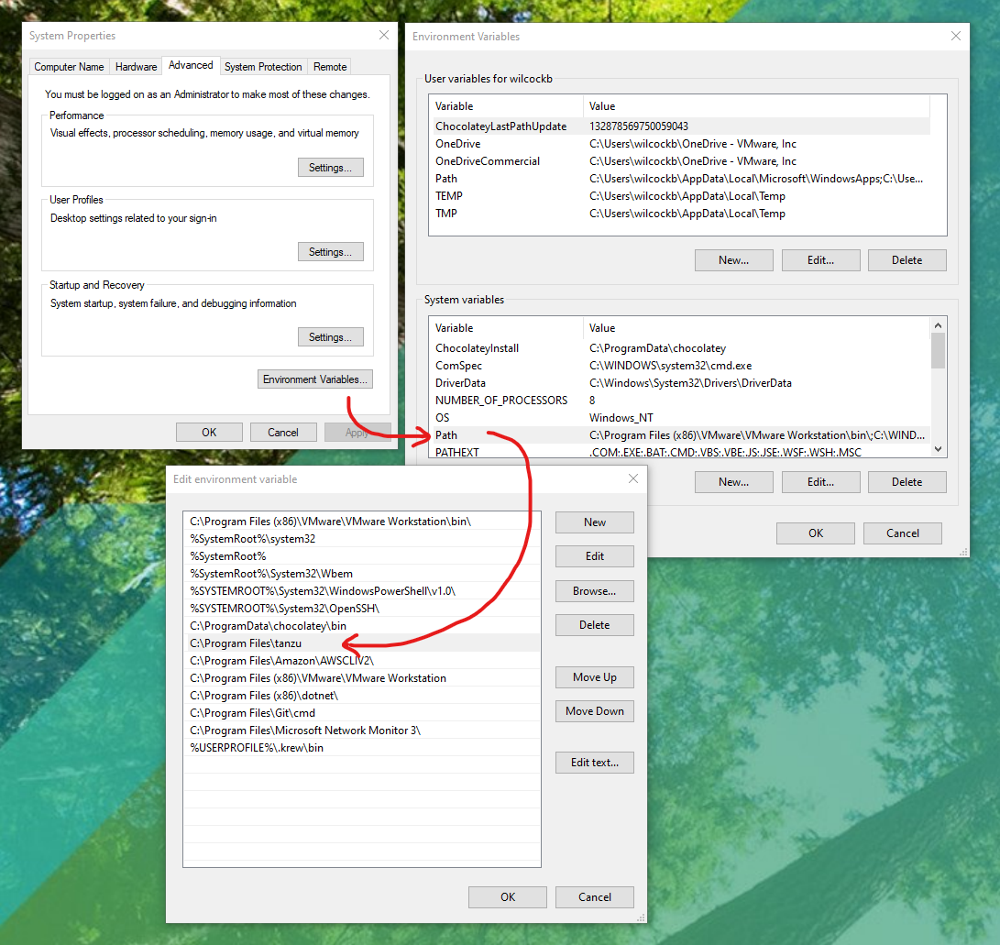

## Introduction 
 
Installing [VMware Tanzu Application Platform](https://tanzu.vmware.com/application-platform) locally is a bit more involved than some other development tools that you’re used to, but it's totally worth it. That’s because Tanzu Application Platform is "DevOps in a box". With all the rich functionality you’d expect from such an offering. Installed on the public cloud or in a private data center, Tanzu Application Platform offers a modular, application-aware platform that abstracts Kubernetes and can serve the needs of hundreds of developers at the same time. 

Stick with this tutorial and you’ll be part of an exclusive group of trailblazing developers who've tried Tanzu Application Platform and experienced its modern software supply-chain, effortless Kubernetes application scheduling, and serverless computing capabilities first-hand. Let’s get started! 

{}
The steps below have been tested with Tanzu Application Platform version 1.0.2 of  (the most current at the time of writing). The official documentation for Tanzu Application Platform can be found [here](https://docs.vmware.com/en/Tanzu-Application-Platform/1.0/tap/GUID-overview.html). 
{}

## Before You Start 
 
There are a few things that you must have before you begin installing Tanzu Application Platform: 

* **Hardware**: A computer with a modern Intel i7 or AMD Ryzen 7 processor (or better). You'll need 8 threads, 16 GB of RAM, and 40 GB of free disk space at your disposal. 
* **Operating System**: Windows 10 Pro, Enterprise, or Education, or MacOS, or Ubuntu 20.04 LTS. You'll also need administrator access to this system.  
* **Software**: You'll need [Minikube](https://minikube.sigs.k8s.io/docs/start/) (a laptop friendly version of Kubernetes), [Kubectl](https://kubernetes.io/docs/tasks/tools/) (the command-line tool used to work with Kubernetes).  
* **Accounts**: You’ll need the username and password for your [Docker Hub](https://hub.docker.com/) account and the username and password for your account on the [Tanzu Network](https://network.pivotal.io) (registration is free). 
* **Time**: You'll need about 1 hour (but this can vary depending on your network, processor, RAM, etc.). 
* **Network**: A stable internet connection capable of at least 30 Mb/s download and 10 Mb/s upload. 

_For a full list of system requirements, see the [official documentation](https://docs.vmware.com/en/Tanzu-Application-Platform/1.0/tap/GUID-prerequisites.html)._

## Stage 1: Install the Tanzu CLI.

To begin the installation of the Tanzu Application Platform you must first install the `tanzu` command-line tool that you’ll use to install the Tanzu Application Platform and interact with it. This guide assumes you have not installed the `tanzu` tool previously. If you have installed the same version of the `tanzu` cli tool in the past, you can skip this step. The instructions for updating (replacing) older versions can be found in the [official documentation](https://docs.vmware.com/en/Tanzu-Application-Platform/1.0/tap/GUID-install-tanzu-cli.html).

1. Download the Tanzu CLI from the [Tanzu Application Platform page on the Tanzu Network](https://network.pivotal.io/products/tanzu-application-platform/). 

    Choose the `tanzu-cli-v0.11.1` dropdown on the Tanzu Application Platform page and then choose the download link for the `tanzu-framework-bundle` binary that matches your operating system (either `-windows`, `-mac`, or `-linux`) as shown below.

    

{}
**Note**: You will be asked to agree to the Tanzu Application Platform EULA (the VMware End User License Agreement) in order to download the Tanzu CLI application.
{}

2. Create a new folder for the Tanzu CLI tool.




To open a new PowerShell Terminal with Administrator privileges click on the 'Start' button, right-click 'Terminal', select 'More' then 'Run as administrator'.


```powershell
# Create a new home for the Tanzu CLI tool in the "Program Files" folder
mkdir "C:\Program Files\tanzu"
```




```sh
# in a new Terminal window.
mkdir ~/tanzu
```




```sh
# in a new Terminal window.
mkdir ~/tanzu
```




1. Add the location of the Tanzu CLI folder to your System’s `PATH`.




1.  Use Windows Search to search for `environment`. 
2.  Select **Edit the system environment variables** to open the System Properties dialogue. 
3.  Click the **Environment Variables** button to open the user and system environment variables dialogue box.
4.  Under the **System** variables list, find the entry for `PATH` and double click it
5.  Add a new entry for `C:\Program Files\tanzu\tanzu.exe` as shown in the image below.
6.  Click `OK`.






Unnecessary. Move to next step.




{}
Coming soon!
{}




3. Extract the `tanzu` cli tool, install it, and install the plug-ins that it requires.




Back in your Admin PowerShell window, follow these steps to extract and install the `tanzu` CLI (assumes the downloaded file is in your `Downloads` folder):

```powershell
# Move to the folder containing the downloaded file.
cd "C:\Users\$env:USERNAME\Downloads"

# Extract the zip
Expand-Archive .\tanzu-framework-windows-amd64.zip
 
# Move to the extracted Tanzu CLI directory
cd tanzu-framework-windows-amd64

# Copy the Tanzu CLI tool to your new tanzu folder
cp "cli\core\v0.11.1\tanzu-core-windows_amd64.exe" "C:\Program Files\tanzu\tanzu.exe"

# Install the tanzu cli plug-ins needed for TAP installation
$Env:TANZU_CLI_NO_INIT = "true"
tanzu plugin install --local cli all
```




In your Terminal, follow these steps to extract and install the `tanzu` CLI:

```sh
# Extract the tar file into your ~/tanzu directory
tar -xvf tanzu-framework-darwin-amd64.tar -C ~/tanzu

# Change your working directory to the install directory.
cd ~/tanzu

# Run the install binary to complete the base installation.
sudo install cli/core/v0.10.0/tanzu-core-darwin_amd64  /usr/local/bin/tanzu

# Install the tanzu cli plug-ins needed for TAP installation
export TANZU_CLI_NO_INIT = "true"
tanzu plugin install --local cli all
```




{}
Coming soon!
{}




4. Check that the `tanzu` CLI and the plug-ins are installed correctly by checking the output from the following commands:




```powershell
# Expect version: v0.11.1
tanzu version 

# Expect the package, secret, apps, services, and accelerator plugins to have a STATUS of 'installed'
tanzu plugin list 
```



## Stage 2: Run minikube

Now that the `tanzu` CLI and plugins are installed, we can continue with the rest of the installation. The Tanzu Application Platform supports minikube for local installations so you must start minikube on your PC using specific settings as detailed below. 

{}
**Note:** If you have existing applications running on Minikube already, it may be best to define a new minikube profile for your Tanzu Application Platform installation using the switch "`–p tap`". If you choose to do this, remember to use the same profile for each minikube command below.
{}

1. Start minikube with 8 CPUs, 12 GB RAM, and version 1.22 of Kubernetes using the following command:



```powershell
# Start Minikube
minikube start --cpus='8' --memory='12g' --kubernetes-version='1.22.6' 
```

{}
**Note:** We tested using the [Hyper-V](https://docs.microsoft.com/en-us/virtualization/hyper-v-on-windows/about/) driver as minikube's  [VM driver](https://minikube.sigs.k8s.io/docs/drivers/). To discover your minikube VM driver, use the command `minikube profile list` after minikube has started. [Hyper-V can be added as a Windows feature](https://docs.microsoft.com/en-us/virtualization/hyper-v-on-windows/quick-start/enable-hyper-v)  in the Pro, Enterprise, or Education versions of Windows 10.
{}




```sh
minikube start --cpus=`8` --memory=`12g` --kubernetes-version='1.22.6'
```




```sh
# Start Minikube
minikube start --cpus='8' --memory='12g' --kubernetes-version='1.22.6' # --driver='kvm2'
```

{}
**Note:** For Ubuntu we tested with Docker as the VM driver. For Fedora, we used KVM2 as the VM driver. To discover your VM driver, after you have run `minikube start` use the command `minikube profile list`.
{}




2. Find the IP address of the Minikube cluster and make a note of it:




```powershell
# Get the minikube IP address
minikube ip
```




3. Add a new network hostname entry to your operating system's `hosts` file.

    This new entry in your `hosts` file uses a combination of the IP address for Minikube and the URLs required to reach application workloads once they're running on the Tanzu Application Platform inside Minikube.




Open the `hosts` file in Notepad.

```powershell
# Open the hosts file in Notepad (as Admin).
Start-Process notepad -Verb runas "c:\Windows\System32\Drivers\etc\hosts"
```

In Notepad, add a new line to your hosts file as follows...
```text
<your-minikube-ip-address> tap-gui.made-up-name.net tanzu-java-web-app.default.apps.made-up-name.net
```




```sh
# Define environment variables
export MINIKUBE_IP=<your-minikube-ip-address>
export LOCAL_DOMAIN=example.com #replace this if you would like a different domain

# Add the entry to your /etc/hosts file
sudo echo "$MINIKUBE_IP tap-gui.$LOCAL_DOMAIN tanzu-java-web-app.default.apps.$LOCAL_DOMAIN" | sudo tee -a /etc/hosts
```




Open the `hosts` file in Nano.

```sh
# Open the hosts file in Nano (as sudo).
sudo nano /etc/hosts
```

In Nano, add a new line to your hosts file as follows...
```text
<your-minikube-ip-address> tap-gui.made-up-name.net tanzu-java-web-app.default.apps.made-up-name.net
```




{}
**Important:** When working locally on minikube, any workloads that you deploy to the Tanzu Application Platform will need to have their URL added to your `hosts` file. This will allow your HTTP calls to be routed correctly.
{}

4. Open the minikube network tunnel. This tunnel allows Kubernetes services of type ‘LoadBalancer’ to be addressable from your PC's network. You will need to start this tunnel whenever you want to access resources on the Tanzu Application Platform.




Start Minikube's network tunnel process in the terminal.

```sh
minikube tunnel
```

{}
**Important:** Leave the Minikube tunnel command running in the current PowerShell or Terminal window and open a new Admin PowerShell or Terminal when you begin the next stage.
{}





## Stage 3: Install Tanzu Cluster Essentials onto Minikube

The `tanzu` cli you installed earlier acts as an agent. It passes instructions to the Tanzu Application Platform so they can be carried out inside Kubernetes. For this to work, the tanzu cli needs a command broker inside Kubernetes in the form of a [`kapp-controller`](https://carvel.dev/kapp-controller/) and a method for managing the generation of platform secrets in the form of a [`secretgen-controller`](https://github.com/vmware-tanzu/carvel-secretgen-controller). 

The `kapp-controller` and `secretgen-controller` are part of [Cluster Essentials for VMware Tanzu](https://network.pivotal.io/products/tanzu-cluster-essentials) which you will install next. For Windows, this involves issuing some `kubectl` commands. For macOS and Linux, there is a dedicated installer.

1. Add Cluster Essentials for VMware Tanzu to your Minikube Kubernetes cluster.




In a new Admin PowerShell window...

```powershell
# Create the required Kubernetes namespaces.
kubectl create namespace tanzu-cluster-essentials
kubectl create namespace kapp-controller
kubectl create namespace secretgen-controller

# Apply the YAML configuration for the kapp-controller
kubectl apply -f https://github.com/vmware-tanzu/carvel-kapp-controller/releases/download/v0.30.0/release.yml -n kapp-controller

# Apply the YAML configuration for the secretgen-controller
kubectl apply -f https://github.com/vmware-tanzu/carvel-secretgen-controller/releases/download/v0.7.1/release.yml -n secretgen-controller
```



{}
Coming soon!
{}




{}
Coming soon!
{}




Wait until the `kapp-controller` and `secretgen-controller` pods reach the `running` state before continuing to the next stage. You can view the current state of all pods with this command:




```powershell
# Ensure that kapp-controller and secretgen-controller are ‘running’ 
kubectl get pods --all-namespaces 
```



## Stage 4: Install Tanzu Application Platform onto Minikube

You are now ready to install the Tanzu Application Platform onto your Minikube cluster. First, to make this task easier, you will create some environment variables in the terminal you’ll be using for the rest of the installation. These variables include usernames and passwords for the Tanzu Network and the Docker Registry that you are using to store your application container images.

1. Create the Tanzu Application Platform installation environment variables:




Fill in the missing details below as necessary.

```powershell
# Create Tanzu Application Platform Install Environment Variables
$Env:TAP_VERSION = "1.0.2"
$Env:TAP_NAMESPACE = "tap-install"
 
# Set the TAP installation registry details
$Env:INSTALL_REGISTRY_HOSTNAME = "registry.tanzu.vmware.com"
$Env:INSTALL_REGISTRY_USERNAME = "" # < insert your tanzu network username
$Env:INSTALL_REGISTRY_PASSWORD = "" # < insert your tanzu network password

# Set the developer’s ‘push’ capable docker container registry details
$Env:DOCKER_SERVER = "https://index.docker.io/v1/"
$Env:DOCKER_USERNAME = "" # < insert docker username
$Env:DOCKER_PASSWORD = "" # < insert docker password
```



{}
Coming soon!
{}




{}
Coming soon!
{}




2. Create the Kubernetes namespace used for the Tanzu Application Platform installation.




```powershell
kubectl create ns $env:TAP_NAMESPACE 
```



{}
Coming soon!
{}




{}
Coming soon!
{}




3. Add the registry secret needed to pull the Tanzu Application Platform container images from the Tanzu Network.




```powershell
tanzu secret registry add tap-registry `
  --username $env:INSTALL_REGISTRY_USERNAME `
  --password $env:INSTALL_REGISTRY_PASSWORD `
  --server $env:INSTALL_REGISTRY_HOSTNAME `
  --namespace $env:TAP_NAMESPACE `
  --export-to-all-namespaces `
  --yes
```



{}
Coming soon!
{}




{}
Coming soon!
{}




4. Add a new repository record for the Tanzu Application Platform packages:




```powershell
tanzu package repository add tanzu-tap-repository `
  --url $env:INSTALL_REGISTRY_HOSTNAME/tanzu-application-platform/tap-packages:$env:TAP_VERSION `
  --namespace $env:TAP_NAMESPACE
```



{}
Coming soon!
{}




{}
Coming soon!
{}




The above steps may take a few minutes to complete. When finished, the final status of the package installation should read `Reconcile succeeded`. If it gets interrupted for any reason it might fail to reconcile or give an error. You can always check the status of the process at any time with the following commands:




```powershell
# Check for STATUS: “Reconcile succeeded”
tanzu package repository get tanzu-tap-repository --namespace $env:TAP_NAMESPACE 

# Check for a big list of ready to use packages
tanzu package available list --namespace $env:TAP_NAMESPACE 
```



{}
Coming soon!
{}




{}
Coming soon!
{}




Now that all the required packages, registries, and secrets have been added to the Kubernetes cluster we are almost ready to install the Tanzu Application Platform itself. 

Installing Tanzu Application Platform requires a configuration file in YAML format. This file contains the configuration details required by various components in the Tanzu Application Platform and must be customized to fit your setup. To make this easier for you, a template has been provided which you can download and customize using your favorite text editor or IDE.

5. Download the template `tap-values.yml` to your working directory as follows:




```powershell
curl.exe -o tap-values.yml https://raw.githubusercontent.com/benwilcock/tanzu-application-platform-scripts/main/minikube-win/template-tap-values.yml
```



{}
Coming soon!
{}




{}
Coming soon!
{}




6. Open the downloaded `tap-values.yml` file in your text editor and manually replace all the CAPITALIZED placeholders with the same details you used earlier as environment variables.




Replace the placeholder `DOCKER_USERNAME` with the same details you used earlier for the environment variable `$Env:DOCKER_USERNAME` (Windows) or `export DOCKER_USERNAME=` (macOS or Linux). 

**Do this for all the placeholders in the file.**

> Take care with the above step. Any mistakes you make here can be hard to rectify and could prevent the Tanzu Application Platform from installing or working correctly.




With your `tap-values.yml` file fully edited, you are now ready to install Tanzu Application Platform. This process can take a while and creates a lot of internet traffic. If you are sharing your network with others, you may prefer to do this installation at a less disruptive time of the day.

7. Install Tanzu Application Platform onto Minikube with the following command. Notice that the location of the YAML file that you edited earlier step is required:



```powershell
tanzu package install tap -p tap.tanzu.vmware.com -v $env:TAP_VERSION `
  --values-file tap-values.yml `
  --namespace $env:TAP_NAMESPACE
```



{}
Coming soon!
{}




{}
Coming soon!
{}




{}
**Be Patient!**
Installing Tanzu Application Platform can take 30 minutes or more. The platform is essentially an integrated collection of self-healing microservice components. It takes lots of time, significant CPU, memory, and network bandwidth to fully stand up the system. 
{}

You can check the installation’s progress at any time by asking the Tanzu CLI for the status of the Tanzu Application Platform's package installation:



```powershell
tanzu package installed list -A
```

> All the Tanzu Application Platform packages in the list should eventually reach the status `“Reconcile Succeeded”`. This takes time and is dependent on the Minikube Tunnel process being active in another Terminal window as described in [Stage 2: Run Minikube](#stage-2-run-minikube).



Once the system is fully reconciled, you may like to pause for a moment to check out the Tanzu Application Platform user interface. In your web browser open the URL [http:// tap-gui.made-up-name.net](http://tap-gui.made-up-name.net). If `minikube tunnel` is active, and your `hosts` file has been edited as described in [Stage 2: Run Minikube](#stage-2-run-minikube), you should see the Tanzu Application Platform's graphical user interface which is based on the CNCF [Backstage](https://backstage.io/) project. 

{}
Tanzu Application Platform is designed to make everyone's life easier. For example, the ‘Accelerators’ dashboard allows developers in an organization to easily create and customize new coding projects by offering templates that you collectively own.
{}

## Step 5: Create A Developer Workspace

Developers using Tanzu Application Platform need a Kubernetes namespace so they can work in isolation away from the rest of the system. This developer namespace also needs access to a container registry where the application containers (docker images) built by the Tanzu Application Platform can be stored.  This developer namespace also needs certain Kubernetes roles and privileges in order to integrate with the rest of the Tanzu Application Platform.

1. Add a developer namespace, registry, roles, and privileges as follows:



```powershell
$Env:TAP_DEV_NAMESPACE = "default"

# Create a namespace for the developer
kubectl create ns $env:TAP_DEV_NAMESPACE

# Add a secret for the developer container registry
tanzu secret registry add registry-credentials `
  --server $env:DOCKER_SERVER `
  --username $env:DOCKER_USERNAME `
  --password $env:DOCKER_PASSWORD `
  --namespace $env:TAP_DEV_NAMESPACE

# Obtain the service accounts YAML configuration file
curl.exe -o serviceaccounts.yml https://raw.githubusercontent.com/benwilcock/tanzu-application-platform-scripts/main/minikube-win/serviceaccounts.yml

# Apply the necessary RBAC Roles, Accounts, Bindings etc. to Kubernetes.
kubectl -n $env:TAP_DEV_NAMESPACE apply -f "serviceaccounts.yml"
```



{}
Coming soon!
{}




{}
Coming soon!
{}




## Step 6: Run An Application Workload

Tanzu Application Platform uses the term ‘workload’ to describe an application running on the platform. Now that Tanzu Application Platform is installed, building and running your code on the platform requires only one simple instruction.



```powershell
tanzu apps workload create tanzu-java-web-app `
  --git-repo https://github.com/sample-accelerators/tanzu-java-web-app `
  --git-branch main `
  --type web `
  --label app.kubernetes.io/part-of=tanzu-java-web-app `
  --label tanzu.app.live.view=true `
  --label tanzu.app.live.view.application.name=tanzu-java-web-app `
  --namespace $env:TAP_DEV_NAMESPACE `
  --yes
```



{}
Coming soon!
{}




{}
Coming soon!
{}




The Tanzu Application Platform does not need an application binary or a container image in order to build and deploy applications. Tanzu Application Platform includes a built-in (but swappable) 'build-service' as part of what is called a software 'supply-chain'. Tanzu Application Platform only needs the URL and branch name of the source code repository you wish to run. If the source code ever changes, the application will be rebuilt and redeployed automatically. In the example above, the workload is a Java application written in Spring. Spring and many other programming languages are supported out-of-the-box.  


The `tanzu` cli offers commands that allow you to check the progress of the workload's deployment.




Check the progress of the application's deployment:

```powershell
tanzu apps workload get tanzu-java-web-app
```

You will see output similar that shown below when the application is ready and has a URL assigned.

```powershell
# tanzu-java-web-app: Ready
---
lastTransitionTime: "2022-03-17T08:08:03Z"
message: ""
reason: Ready
status: "True"
type: Ready

Workload pods
NAME                                                  STATUS      RESTARTS   AGE
tanzu-java-web-app-00001-deployment-b4b456f65-9kpgq   Running     0          4h19m
tanzu-java-web-app-build-1-build-pod                  Succeeded   0          18h
tanzu-java-web-app-config-writer-2gjwm-pod            Succeeded   0          18h
tanzu-java-web-app-config-writer-lr8fr-pod            Succeeded   0          5h35m

Workload Knative Services
NAME                 READY   URL
tanzu-java-web-app   Ready   http://tanzu-java-web-app.default.apps.made-up-name.net
```

Once fully deployed, the workload has a status of `Ready` and the URL  http://tanzu-java-web-app.default.apps.made-up-name.net has been assigned. 





{}
**Note:** It may take several minutes for a workload to become `Ready` as the Tanzu Application Platform must first obtain the source code, compile it, create a hardened container, store it in the container registry, setup the network routing, and run the application.
{}

Test the application with a browser or by using the following:



```powershell
curl.exe http://tanzu-java-web-app.default.apps.made-up-name.net
```



```sh
curl http://tanzu-java-web-app.default.apps.made-up-name.net
```




```sh
curl http://tanzu-java-web-app.default.apps.made-up-name.net
```




After a few seconds (in your browser window or as curl output) you should see the following text:



```sh
Greetings from Spring Boot + Tanzu!
```




## Wrapping Up

Congratulations! You have installed the Tanzu Application Platform and tested it by running a Java application workload. Although it took a while, you’ve done something amazing! 

You’ve manually installed an enterprise-grade software platform onto Minikube on your local Laptop or PC which you can now experiment with and show to others. Using a single command, you’ve made the platform build source code into a binary application, created a hardened container for the application, and run the container inside Kubernetes — all without having to write any of the Kubernetes YAML configuration usually required to describe pods, replica sets, deployments, or services. And, if the code ever changes, Tanzu Application Platform will automatically re-build and re-deploy the application for you. 

And that’s just the tip of the iceberg. Tanzu Application Platform is fully customizable. The opportunities for improved developer productivity and supply-chain excellence are truly mind boggling!

## Tearing Down

Once you’re done with TAP for the day, you can shut it down with the command `minikube stop` and start it up again the next day with `minikube start`. If you want to remove Tanzu Application Platform on Minikube completely, the simplest approach is to use `minikube delete`. 

You can remove the Tanzu CLI with the following command:



```sh
rmdir  "C:\Program Files\tanzu"
```



{}
Coming soon!
{}




{}
Coming soon!
{}




Don't forget to also remove the `PATH` and `hosts` file entries that you added.

## Next Steps

Continue your Tanzu Application Platform learning journey with more great content right here on the Tanzu Developer Network:

1.
2.
3.
4.

