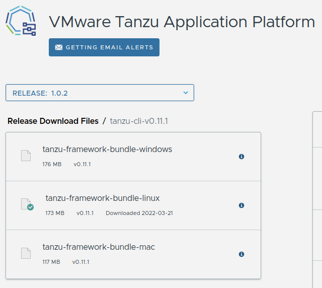
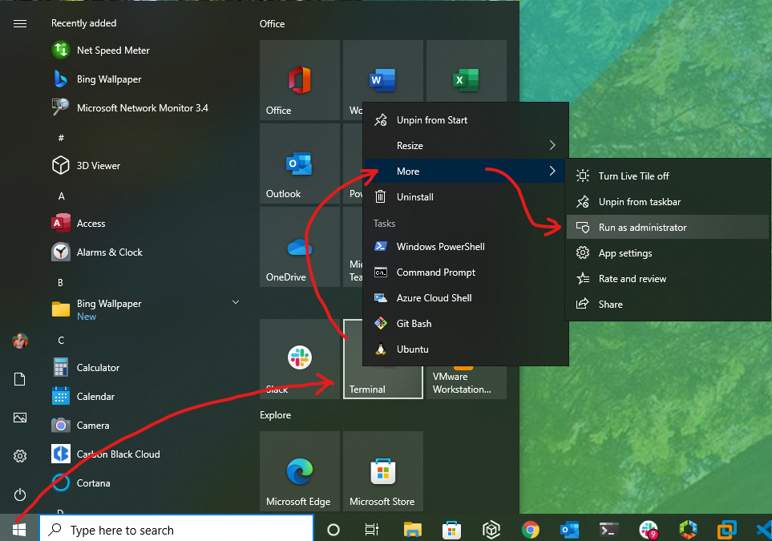
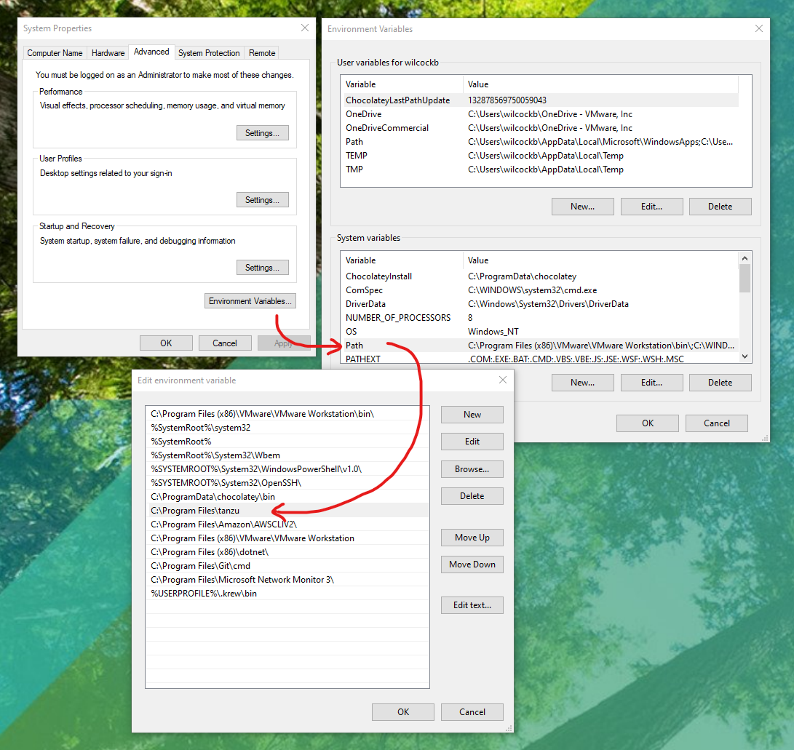
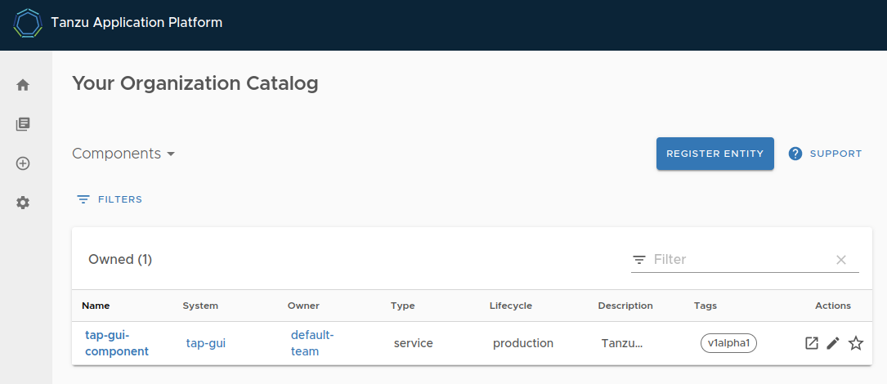

## Introduction 
 
Installing [VMware Tanzu Application Platform][tap] on your personal computer is a bit more involved than some other development tools out there but it's totally worth it. That’s because Tanzu Application Platform is next generation "DevOps in a box" — with all the rich functionality you’d expect from such an offering. Installed on Kubernetes in the public cloud or in a private data center, Tanzu Application Platform offers a modular, application-aware platform that can serve the needs of hundreds of developers at the same time. 

Stick with this tutorial and you’ll be part of an elite group of first-movers — developers who've tried Tanzu Application Platform and experienced its modern software supply-chain, effortless Kubernetes application scheduling, and serverless computing capabilities for themselves. Let’s get to it! 

{}
The process below has been tested using VMware Tanzu Application Platform version 1.0.2 (the most current available at the time of writing). We tested using Windows 10, macOS Monterey, Ubuntu 20.04 LTS and Fedora 35. If you get stuck, the official documentation for Tanzu Application Platform can be found [here](https://docs.vmware.com/en/Tanzu-Application-Platform/1.0/tap/GUID-overview.html). 
{}

## Before You Start 
 
There are a few things that need before you install the Tanzu Application Platform: 

* **Hardware**: A computer with a modern Intel i7 or AMD Ryzen 7 processor (or better). ARM based architectures like Apple M1 aren't supported. You'll need 8 threads, 16 GB of RAM, and 40 GB of free disk space. 
* **Operating System**: Windows 10 Pro, Enterprise, or Education, or MacOS, or Ubuntu 20.04 LTS, or Fedora 35. You'll also need administrator access to this system.  
* **Software**: [Minikube][minikube] (a laptop friendly version of Kubernetes), [Kubectl][kubectl] (the command-line tool used to work with Kubernetes).  
* **Accounts**: You’ll need a username and password for a [Docker Hub][dockerhub] account and a username and password for an account on the [Tanzu Network][tanzunet] (registration for both is free). 
* **Network**: An internet connection capable of at least 30 Mb/s download and 10 Mb/s upload. 
* **Time**: About 1 hour (but this can vary depending on your network, processor, RAM, etc.).

_For a full list of system requirements, see the [official Tanzu Application Platform prerequisites][tap-prereq]._

## Stage 1: Download and Install the Tanzu CLI.

To begin the installation of the Tanzu Application Platform you must first install the `tanzu` command-line tool that you’ll use to install the platform and interact with it. This guide assumes you have not installed the `tanzu` tool previously. If you have installed the same version of the `tanzu` cli tool previously, you can skip this step. The instructions for updating (replacing) or removing older versions can be found in the [official documentation][tap-cli-docs].

<p><strong>
1. Download the Tanzu CLI.
</strong></p>

Login to the Tanzu Network and go to the [VMware Tanzu Application Platform product page](https://network.pivotal.io/products/tanzu-application-platform/).

Select the `tanzu-cli-v0.11.1` option from the dropdown menu and then choose the download link for the `tanzu-framework-bundle` binary that matches your operating system (either `-windows`, `-mac`, or `-linux`) as shown below.



{}
You will be asked to agree to the Tanzu Application Platform EULA (the VMware End User License Agreement) in order to download the Tanzu CLI application.
{}

<p><strong>
2. Create a new system folder for the <code>tanzu</code> cli.
</strong></p>




To open a new PowerShell Terminal with Administrator privileges click on the 'Start' button, right-click 'Terminal', select 'More' then 'Run as administrator'.



```powershell
# Create a new home for the Tanzu CLI tool in the "Program Files" folder
mkdir "C:\Program Files\tanzu"
```




{}
Not required, move on to the next step.
{}




{}
Not required, move on to the next step.
{}




<p><strong>
3. Add the location of the <code>tanzu</code> cli folder to your System’s <code>PATH</code>.
</strong></p>




1.  Use Windows Search to search for `environment`. 
2.  Select **Edit the system environment variables** to open the System Properties dialogue. 
3.  Click the **Environment Variables** button to open the user and system environment variables dialogue box.
4.  Under the **System** variables list, find the entry for `PATH` and double click it
5.  Add a new entry for `C:\Program Files\tanzu\` as shown in the image below.
6.  Click `OK`.






{}
Not required, move on to the next step.
{}




{}
Not required, move on to the next step.
{}




<p><strong>
4. Extract the <code>tanzu</code> cli, install it, and install the plug-ins that it requires.
</strong></p>




Back in your Admin PowerShell window, follow these steps to extract and install the `tanzu` cli (assumes the downloaded file is in your `Downloads` folder):

```powershell
# Move to the folder containing the downloaded file.
cd "C:\Users\$env:USERNAME\Downloads"

# Extract the zip
Expand-Archive .\tanzu-framework-windows-amd64.zip
 
# Move to the extracted Tanzu CLI directory
cd tanzu-framework-windows-amd64

# Copy the Tanzu CLI tool to your new tanzu folder
cp "cli\core\v0.11.1\tanzu-core-windows_amd64.exe" "C:\Program Files\tanzu\tanzu.exe"

# Install the tanzu cli plug-ins needed for TAP installation
$Env:TANZU_CLI_NO_INIT = "true"
tanzu plugin install --local cli all
```




In your Terminal, follow these steps to extract and install the `tanzu` cli (assumes the downloaded file is in your `Downloads` folder):

```sh
# Move to the folder containing the downloaded file.
cd ~/Downloads

# Make a directory to extract the archive into
mkdir tanzu

# Extract the tar file into your ~/tanzu directory
tar -xvf tanzu-framework-darwin-amd64.tar -C ./tanzu

# Change your working directory to the install directory.
cd tanzu

# Run the install binary to complete the base installation.
sudo install cli/core/v0.11.1/tanzu-core-darwin_amd64  /usr/local/bin/tanzu

# Install the tanzu cli plug-ins needed for TAP installation
export TANZU_CLI_NO_INIT="true"
tanzu plugin install --local cli all
```




Open a new Terminal and follow these steps to extract and install the `tanzu` cli (assumes the downloaded file is in your `Downloads` folder):

```sh
# Move to the folder containing the downloaded file.
cd ~/Downloads

# Make a directory to extract the archive into
mkdir tanzu

# Extract the tar archive into your ~/tanzu directory
tar -xvf tanzu-framework-linux-amd64.tar -C ./tanzu

# Change your working directory to the extracted archive directory.
cd tanzu

# Run the install binary to complete the base installation.
sudo install cli/core/v0.11.1/tanzu-core-linux_amd64 /usr/local/bin/tanzu

# Install the Tanzu CLI Plugins
export TANZU_CLI_NO_INIT="true" 
tanzu plugin install --local cli all
```




<p><strong>
5. Check the <code>tanzu</code> cli is working.
</strong></p>

The following commands will help you check that the `tanzu` cli and its plugins are installed correctly.




```bash
# Expect version: v0.11.1
tanzu version 

# Expect the package, secret, apps, services, and accelerator plugins to have a STATUS of 'installed'
tanzu plugin list 
```



## Stage 2: Run minikube

Now that the `tanzu` cli and plugins are installed, you can start up your Minikube Kubernetes cluster. The Tanzu Application Platform supports Minikube for local installations as long as some specific configuration settings have been set. 

{}
If you have existing applications running on Minikube, it may be best to define a new minikube profile for your Tanzu Application Platform installation using the `-p <profile-name>` switch. If you choose to do this, remember to use the same profile switch for each minikube command below.
{}

<p><strong>
1. Start Minikube with 8 CPUs, 12 GB RAM, and version 1.22 of Kubernetes.
</strong></p>



```powershell
minikube start --cpus='8' --memory='12g' --kubernetes-version='1.22.6' 
```

{}
In Windows 10 we tested using [Hyper-V](https://docs.microsoft.com/en-us/virtualization/hyper-v-on-windows/about/) as minikube's [VM driver](https://minikube.sigs.k8s.io/docs/drivers/). To discover your minikube VM driver, use the command `minikube profile list` after minikube has started. [Hyper-V can be added as a Windows feature](https://docs.microsoft.com/en-us/virtualization/hyper-v-on-windows/quick-start/enable-hyper-v) in the Pro, Enterprise, or Education versions of Windows 10.
{}




```sh
minikube start --cpus='8' --memory='12g' --kubernetes-version='1.22.6'
```




```sh
minikube start --cpus='8' --memory='12g' --kubernetes-version='1.22.6'
```

{}
In Ubuntu we tested with Docker as the VM driver. For Fedora, we added `--driver='kvm2'` to force the use of KVM2 as Minikube's VM driver. To discover your VM driver, after you have run `minikube start` use the command `minikube profile list`.
{}




<p><strong>
2. Find the IP address of the Minikube cluster.
</strong></p>




Make a note of the IP address returned below, you will need it in the next step.

```powershell
minikube ip
```




<p><strong>
3. Add a new hostname entry to your operating system's <code>hosts</code> file.
</strong></p>

In order to route network traffic to the applications running on the Tanzu Application Platform you must add a new line to your `hosts` file. This line binds the URLs you will use with the Minikube IP address you discovered in the previous step.




Open the `hosts` file in Notepad.

```powershell
# Open the hosts file in Notepad (as Admin).
Start-Process notepad -Verb runas "c:\Windows\System32\Drivers\etc\hosts"
```

In Notepad, add a new line to your hosts file as follows...
```text
<your-minikube-ip-address> tap-gui.example.com tanzu-java-web-app.default.apps.example.com
```




Open the `hosts` file in Nano (or your favorite alternative) as follows:

```sh
# Open the hosts file in Nano (as sudo).
sudo nano /etc/hosts
```

In Nano, add a new line to your hosts file as follows...
```text
<your-minikube-ip-address> tap-gui.example.com tanzu-java-web-app.default.apps.example.com
```




Open the `hosts` file in Nano (or your favorite alternative) as follows:

```sh
# Open the hosts file in Nano (as sudo).
sudo nano /etc/hosts
```

In Nano, add a new line to your hosts file as follows...
```text
<your-minikube-ip-address> tap-gui.example.com tanzu-java-web-app.default.apps.example.com
```




{}
Any additional applications that you deploy to the Tanzu Application Platform must also have their URLs added to your `hosts` file. This will ensure that HTTP calls can be routed correctly.
{}

<p><strong>
4. Open the Minikube tunnel. 
</strong></p>

Minikube provides a network tunnel process which allows Kubernetes services of type <code>LoadBalancer</code> to be addressable from your PC's network. You must start this tunnel whenever you want to install or use the Tanzu Application Platform on Minikube.




Start Minikube's network tunnel process.

```sh
minikube tunnel
```

{}
Leave the `minikube tunnel` process running and open a new Admin PowerShell or Terminal when you begin the next stage.
{}





## Stage 3: Install Cluster Essentials for VMware Tanzu onto Minikube

The `tanzu` cli you installed earlier acts as an agent. It passes instructions to the Tanzu Application Platform so they can be carried out inside Kubernetes. For this to work, the `tanzu` cli needs a command broker inside Kubernetes in the form of a [`kapp-controller`][kapp-controller] and a method for managing the generation of platform secrets in the form of a [`secretgen-controller`][secretgen-controller]. 

The `kapp-controller` and `secretgen-controller` are part of [Cluster Essentials for VMware Tanzu][tanzunet-cluster-essentials] which you will install next. For Windows, this involves issuing some `kubectl` commands. For macOS and Linux, there is a dedicated installer which you will download and run.

<strong><p>
    1. Add Cluster Essentials for VMware Tanzu to your Minikube cluster.
</strong></p>




In a new Admin PowerShell window...

```powershell
# Create the required Kubernetes namespaces.
kubectl create namespace tanzu-cluster-essentials
kubectl create namespace kapp-controller
kubectl create namespace secretgen-controller

# Apply the YAML configuration for the kapp-controller
kubectl apply -f https://github.com/vmware-tanzu/carvel-kapp-controller/releases/download/v0.30.0/release.yml -n kapp-controller

# Apply the YAML configuration for the secretgen-controller
kubectl apply -f https://github.com/vmware-tanzu/carvel-secretgen-controller/releases/download/v0.7.1/release.yml -n secretgen-controller
```



1. Open your browser and navigate to the [Cluster Essentials for VMware Tanzu product page on the Tanzu Network](https://network.pivotal.io/products/tanzu-cluster-essentials)

2. Download the `tanzu-cluster-essentials-darwin-amd64-1.0.0.tgz` file.
 
3. Open a new Terminal window and issue the following commands:

```sh
# Move to the folder containing the downloaded file.
cd ~/Downloads

# Create a directory for these packages
mkdir tanzu-cluster-essentials

# Unpack the TAR file into the tanzu-cluster-essentials directory by running:
tar -xvf tanzu-cluster-essentials-darwin-amd64-1.0.0.tar -C ./tanzu-cluster-essentials

# Define environment variables nesessary for the install scripts
export INSTALL_BUNDLE=registry.tanzu.vmware.com/tanzu-cluster-essentials/cluster-essentials-bundle@sha256:82dfaf70656b54dcba0d4def85ccae1578ff27054e7533d08320244af7fb0343
export INSTALL_REGISTRY_HOSTNAME=registry.tanzu.vmware.com
export INSTALL_REGISTRY_USERNAME=<tanzunet-username>
export INSTALL_REGISTRY_PASSWORD=<tanzunet-password>

# Change the directory 
cd tanzu-cluster-essentials

# Run the install script
./install.sh
```




1. Open your browser and [navigate to the Cluster Essentials for VMware Tanzu product page on the Tanzu Network](https://network.pivotal.io/products/tanzu-cluster-essentials)

2. Download the `tanzu-cluster-essentials-linux-amd64-1.0.0.tgz` file to your `Downloads` folder.

3. Open a new Terminal window and issue the following commands...

```sh
# Move to the Downloads folder
cd ~/Downloads

# Specify the VMware Cluster Essentials for Tanzu bundle details
export INSTALL_BUNDLE="registry.tanzu.vmware.com/tanzu-cluster-essentials/cluster-essentials-bundle@sha256:82dfaf70656b54dcba0d4def85ccae1578ff27054e7533d08320244af7fb0343"
export INSTALL_REGISTRY_HOSTNAME="registry.tanzu.vmware.com"
export INSTALL_REGISTRY_USERNAME='' # <- Your Tanzu Network username
export INSTALL_REGISTRY_PASSWORD='' # <- Your Tanzu Network username

# Make a folder for the extracted archive files
mkdir tanzu-cluster-essentials

# Extract the archive
tar -xvf tanzu-cluster-essentials-linux-amd64-1.0.0.tgz -C ./tanzu-cluster-essentials

# Move to the extracted folder
cd tanzu-cluster-essentials

# Install VMware Cluster Essentials for Tanzu
./install.sh
```




Wait until the `kapp-controller` and `secretgen-controller` pods reach the `running` state before continuing to the next stage. You can view the current state of all your Kubernetes pods with this command:




```powershell
# Ensure that kapp-controller and secretgen-controller are ‘running’ 
kubectl get pods --all-namespaces 
```



## Stage 4: Install the Tanzu Application Platform onto Minikube

You are now ready to install the Tanzu Application Platform onto your Minikube cluster. First, to make this task easier, you will create some environment variables in the terminal you’ll be using for the rest of the installation. These variables include usernames and passwords for the Tanzu Network and the Docker Registry where you will store your container images.

{}
In the code below [Docker Hub](https://hub.docker.com/) is recommended as the `DOCKER_SERVER`. Personal (free) Docker Hub accounts have [usage limits](https://www.docker.com/pricing/). These limits may interrupt your installation depending on your daily use. 
{}

<strong><p>
    1. Create the Tanzu Application Platform installation environment variables:
</strong></p>




Fill in the missing details as you create these environment variables in your PowerShell.

```powershell
# Create Tanzu Application Platform Install Environment Variables
$Env:TAP_VERSION = "1.0.2"
$Env:TAP_NAMESPACE = "tap-install"
 
# Set the TAP installation registry details
$Env:INSTALL_REGISTRY_HOSTNAME = "registry.tanzu.vmware.com"
$Env:INSTALL_REGISTRY_USERNAME = "" # < insert your tanzu network username
$Env:INSTALL_REGISTRY_PASSWORD = "" # < insert your tanzu network password

# Set the developer’s ‘push’ capable docker container registry details
$Env:DOCKER_SERVER = "https://index.docker.io/v1/"
$Env:DOCKER_USERNAME = "" # < insert your docker username
$Env:DOCKER_PASSWORD = "" # < insert your docker password
```



Fill in the missing details as you create these environment variables in your Terminal.

```sh
# Create Tanzu Application Platform Install Environment Variables
export TAP_VERSION="1.0.2"
export TAP_NAMESPACE="tap-install"

# Set the developer’s ‘push’ capable docker container registry details
export DOCKER_SERVER="https://index.docker.io/v1/"
export DOCKER_USERNAME="" # < insert your docker username
export DOCKER_PASSWORD="" # < insert your docker password
```




Fill in the missing details as you create these environment variables in your Terminal.

```sh
# Create Tanzu Application Platform Install Environment Variables
export TAP_VERSION="1.0.2"
export TAP_NAMESPACE="tap-install"
 
# Set the developer’s ‘push’ capable docker container registry details
export DOCKER_SERVER="https://index.docker.io/v1/"
export DOCKER_USERNAME='' # < insert your docker username
export DOCKER_PASSWORD='' # < insert your docker password
```




<strong><p>
2. Create the Kubernetes namespace used by the Tanzu Application Platform installation.
</strong></p>




```powershell
kubectl create ns $env:TAP_NAMESPACE 
```



```powershell
kubectl create ns $TAP_NAMESPACE 
```




```sh
kubectl create ns $TAP_NAMESPACE 
```




<strong><p>
3. Add the credentials used to pull the Tanzu Application Platform images from the Tanzu Network.
</strong></p>




```powershell
tanzu secret registry add tap-registry `
  --username $env:INSTALL_REGISTRY_USERNAME `
  --password $env:INSTALL_REGISTRY_PASSWORD `
  --server $env:INSTALL_REGISTRY_HOSTNAME `
  --namespace $env:TAP_NAMESPACE `
  --export-to-all-namespaces `
  --yes
```



```sh
tanzu secret registry add tap-registry \
  --username $INSTALL_REGISTRY_USERNAME \
  --password $INSTALL_REGISTRY_PASSWORD \
  --server $INSTALL_REGISTRY_HOSTNAME \
  --namespace $TAP_NAMESPACE \
  --export-to-all-namespaces \
  --yes 
```




```sh
tanzu secret registry add tap-registry \
  --username $INSTALL_REGISTRY_USERNAME \
  --password $INSTALL_REGISTRY_PASSWORD \
  --server $INSTALL_REGISTRY_HOSTNAME \
  --namespace $TAP_NAMESPACE \
  --export-to-all-namespaces \
  --yes 
```




<strong><p>
4. Add a repository record for the Tanzu Application Platform package repository.
</strong></p>




```powershell
tanzu package repository add tanzu-tap-repository `
  --url $env:INSTALL_REGISTRY_HOSTNAME/tanzu-application-platform/tap-packages:$env:TAP_VERSION `
  --namespace $env:TAP_NAMESPACE
```



```sh
tanzu package repository add tanzu-tap-repository \
  --url $INSTALL_REGISTRY_HOSTNAME/tanzu-application-platform/tap-packages:$TAP_VERSION \
  --namespace $TAP_NAMESPACE 
```




```sh
tanzu package repository add tanzu-tap-repository \
  --url $INSTALL_REGISTRY_HOSTNAME/tanzu-application-platform/tap-packages:$TAP_VERSION \
  --namespace $TAP_NAMESPACE 
```




The above steps may take a few minutes to complete. When finished, the final status of the package installation should read `Reconcile succeeded`. If it gets interrupted for any reason it might fail to reconcile or give an error. If that happens, just check the status using the commands below and retry if necessary.




```sh
# Check for STATUS: “Reconcile succeeded”
tanzu package repository get tanzu-tap-repository --namespace $env:TAP_NAMESPACE 

# Check for a big list of platform packages
tanzu package available list --namespace $env:TAP_NAMESPACE 
```



```sh
# Check for STATUS: “Reconcile succeeded”
tanzu package repository get tanzu-tap-repository --namespace $TAP_NAMESPACE 

# Check for a big list of ready to use packages
tanzu package available list --namespace $TAP_NAMESPACE 
```



```sh
# Check for STATUS: “Reconcile succeeded”
tanzu package repository get tanzu-tap-repository --namespace $TAP_NAMESPACE 

# Check for a big list of ready to use packages
tanzu package available list --namespace $TAP_NAMESPACE 
```



Now that all the required packages, registries, and secrets have been added to the Kubernetes cluster we are almost ready to install the Tanzu Application Platform itself. 

Installing Tanzu Application Platform requires a configuration file in YAML format. This file contains the configuration details required by various components in the Tanzu Application Platform and must be customized to fit your setup. To make this easier for you, a template has been provided which you can download and customize using your favorite text editor or IDE.

<strong><p>
5. Download a configuration file template.
</strong></p>

Your installation of Tanzu Application Platform must be customized. To help, a template has been provided. Download the template to your working directory as follows:




```powershell
curl.exe -o tap-values.yml https://raw.githubusercontent.com/benwilcock/tanzu-application-platform-scripts/main/minikube-win/template-tap-values.yml
```



```sh
# cd back to the ~/Downloads directory
cd ..

curl -o tap-values.yml https://raw.githubusercontent.com/benwilcock/tanzu-application-platform-scripts/main/minikube-win/template-tap-values.yml
```




```sh
curl -o tap-values.yml https://raw.githubusercontent.com/benwilcock/tanzu-application-platform-scripts/main/minikube-win/template-tap-values.yml
```




<strong><p>
6. Customize your configuration file template.
</strong></p>

Open the `tap-values.yml` file you downloaded in the previous step with a text editor and manually replace all the `CAPITALIZED` placeholders with the details personal to you and your environment.

{}
For example, in the `tap-values.yml` file replace the placeholder "`DOCKER_USERNAME`" with the same Docker Hub username you used earlier when setting the environment variable `$Env:DOCKER_USERNAME` (Windows) or `export DOCKER_USERNAME` (macOS or Linux). Repeat this process until you have replaced all the placeholders in the `tap-values.yml` file.
{}

{}
Take care with this step. Any mistakes you make here can be hard to rectify and could prevent the Tanzu Application Platform from installing or working properly.
{}

<strong><p>
7. Install the Tanzu Application Platform onto Minikube.
</strong></p>

You may now install the Tanzu Application Platform onto Minikube using the command below. Notice that the `tap-values.yml` file you edited in the previous step is required by the `tanzu` command and used to customize your installation.



```powershell
tanzu package install tap -p tap.tanzu.vmware.com -v $env:TAP_VERSION `
  --values-file tap-values.yml `
  --namespace $env:TAP_NAMESPACE
```



```sh
tanzu package install tap -p tap.tanzu.vmware.com -v $TAP_VERSION \
  --values-file tap-values.yml \
  --namespace $TAP_NAMESPACE
```




```sh
tanzu package install tap -p tap.tanzu.vmware.com -v $TAP_VERSION \
  --values-file tap-values.yml \
  --namespace $TAP_NAMESPACE
```




{}
This process can take a while. It creates a lot of load on your PC and a lot of internet traffic on your network. The amount of time needed depends on your network, cpu, disk, and memory. If you are sharing your network with others, or if you are pressed for time, you may prefer to perform this part of the installation at a less disruptive time of the day. 
{}

Sometimes, the process will appear to end in failure but really it has just timed out. You can check the true status of the installation at any time by opening another PowerShell or Terminal window and asking the `tanzu` cli for the reconciliation status of the Tanzu Application Platform packages. Use the command described below to check the current status. 

Be patient. The Tanzu Application Platform is self-healing but downloading the various microservice containers can take quite a while. A system monitor like Performance Monitor (Windows), top (macOS), [bpytop](https://github.com/aristocratos/bpytop) (Linux), or a Kubernetes dashboard like [k9s](https://k9scli.io/) may offer some useful insights while the installation progresses.




Get the current status of the Tanzu Application Platform installation.

```sh
tanzu package installed list -A
```

The Tanzu Application Platform is considered healthy when all the packages in the list have `Reconcile Succeeded` in the `STATUS` column. 

```sh
Retrieving installed packages... 
  NAME                      PACKAGE-NAME                                  PACKAGE-VERSION  STATUS               NAMESPACE    
  accelerator               accelerator.apps.tanzu.vmware.com             1.0.2            Reconcile succeeded  tap-install  
  appliveview               run.appliveview.tanzu.vmware.com              1.0.2            Reconcile succeeded  tap-install  
  appliveview-conventions   build.appliveview.tanzu.vmware.com            1.0.2            Reconcile succeeded  tap-install  
  buildservice              buildservice.tanzu.vmware.com                 1.4.3            Reconcile succeeded  tap-install  
  cartographer              cartographer.tanzu.vmware.com                 0.2.2            Reconcile succeeded  tap-install  
  cert-manager              cert-manager.tanzu.vmware.com                 1.5.3+tap.1      Reconcile succeeded  tap-install  
  cnrs                      cnrs.tanzu.vmware.com                         1.1.1            Reconcile succeeded  tap-install  
  contour                   contour.tanzu.vmware.com                      1.18.2+tap.1     Reconcile succeeded  tap-install  
  conventions-controller    controller.conventions.apps.tanzu.vmware.com  0.5.1            Reconcile succeeded  tap-install  
  developer-conventions     developer-conventions.tanzu.vmware.com        0.5.0            Reconcile succeeded  tap-install  
  fluxcd-source-controller  fluxcd.source.controller.tanzu.vmware.com     0.16.3           Reconcile succeeded  tap-install  
  ootb-delivery-basic       ootb-delivery-basic.tanzu.vmware.com          0.6.1            Reconcile succeeded  tap-install  
  ootb-supply-chain-basic   ootb-supply-chain-basic.tanzu.vmware.com      0.6.1            Reconcile succeeded  tap-install  
  ootb-templates            ootb-templates.tanzu.vmware.com               0.6.1            Reconcile succeeded  tap-install  
  service-bindings          service-bindings.labs.vmware.com              0.6.1            Reconcile succeeded  tap-install  
  services-toolkit          services-toolkit.tanzu.vmware.com             0.5.1            Reconcile succeeded  tap-install  
  source-controller         controller.source.apps.tanzu.vmware.com       0.2.1            Reconcile succeeded  tap-install  
  spring-boot-conventions   spring-boot-conventions.tanzu.vmware.com      0.3.0            Reconcile succeeded  tap-install  
  tap                       tap.tanzu.vmware.com                          1.0.2            Reconcile succeeded  tap-install  
  tap-gui                   tap-gui.tanzu.vmware.com                      1.0.2            Reconcile succeeded  tap-install  
  tap-telemetry             tap-telemetry.tanzu.vmware.com                0.1.4            Reconcile succeeded  tap-install  
  tekton-pipelines          tekton.tanzu.vmware.com                       0.30.1           Reconcile succeeded  tap-install  
```

{}
To be 'healthy' the Tanzu Application Platform needs the `minikube tunnel` process to be running as described in [Stage 2: Run Minikube](#stage-2-run-minikube).
{}




Once the Tanzu Application Platform has become available you may like to pause for a moment to check out the user interface. In your web browser open the URL [http://tap-gui.example.com](http://tap-gui.example.com). If the `minikube tunnel` process is active, and your `hosts` file has been edited as described in [Stage 2: Run Minikube](#stage-2-run-minikube), you should see the Tanzu Application Platform's graphical user interface (based on the open-source [Backstage](https://backstage.io/) project). 



{}
The Tanzu Application Platform is designed to make everyone's life easier. For example, the Accelerators dashboard (the (+) icon on the left in the image above) allows developers to easily create, share, and customize new coding projects using ready-made code templates.
{}

## Step 5: Create A Developer Workspace

Developers using Tanzu Application Platform need a Kubernetes namespace where they can work in isolation from the rest of the system. This namespace also needs access to a container registry where container images built by the platform can be stored.  This namespace also needs certain Kubernetes roles and privileges in order to integrate with the rest of the Tanzu Application Platform.

<p><strong>
1. Add a developer namespace, registry, roles, and privileges.
</strong></p>



```powershell
$Env:TAP_DEV_NAMESPACE = "default"

# Create a namespace for the developer
kubectl create ns $env:TAP_DEV_NAMESPACE

# Add a secret for the developer container registry
tanzu secret registry add registry-credentials `
  --server $env:DOCKER_SERVER `
  --username $env:DOCKER_USERNAME `
  --password $env:DOCKER_PASSWORD `
  --namespace $env:TAP_DEV_NAMESPACE

# Obtain the service accounts YAML configuration file
curl.exe -o serviceaccounts.yml https://raw.githubusercontent.com/benwilcock/tanzu-application-platform-scripts/main/minikube-win/serviceaccounts.yml

# Apply the necessary RBAC Roles, Accounts, Bindings etc. to Kubernetes.
kubectl -n $env:TAP_DEV_NAMESPACE apply -f "serviceaccounts.yml"
```



```sh
# Set the developer namespace value to 'default'
export TAP_DEV_NAMESPACE="default"

# Create a namespace for the developer to work in 
kubectl create ns $TAP_DEV_NAMESPACE

# Add the secret for the BUILD Container Registry 
tanzu secret registry add registry-credentials \
  --server $DOCKER_SERVER \
  --username $DOCKER_USERNAME \
  --password $DOCKER_PASSWORD \
  --namespace $TAP_DEV_NAMESPACE 

# Obtain the service accounts file 
curl -o serviceaccounts.yml https://raw.githubusercontent.com/benwilcock/tanzu-application-platform-scripts/main/minikube-win/serviceaccounts.yml 

# Add the necessary RBAC Roles, Accounts, Bindings etc... 
kubectl -n $TAP_DEV_NAMESPACE apply -f "serviceaccounts.yml" 
```




```sh
# Set the developer namespace value to 'default'
export TAP_DEV_NAMESPACE="default"

# Create a namespace for the developer to work in 
kubectl create ns $TAP_DEV_NAMESPACE

# Add the secret for the BUILD Container Registry 
tanzu secret registry add registry-credentials \
  --server $DOCKER_SERVER \
  --username $DOCKER_USERNAME \
  --password $DOCKER_PASSWORD \
  --namespace $TAP_DEV_NAMESPACE 

# Obtain the service accounts file 
curl -o serviceaccounts.yml https://raw.githubusercontent.com/benwilcock/tanzu-application-platform-scripts/main/minikube-win/serviceaccounts.yml 

# Add the necessary RBAC Roles, Accounts, Bindings etc... 
kubectl -n $TAP_DEV_NAMESPACE apply -f "serviceaccounts.yml" 
```




## Step 6: Run A Workload

Tanzu Application Platform uses the term ‘workload’ to describe an application running on the platform. Now that the platform is installed, building and running an application workload requires just one simple instruction.

<p><strong>
1. Run a new application workload on the Tanzu Application Platform.
</strong></p>



```powershell
tanzu apps workload create tanzu-java-web-app `
  --git-repo https://github.com/sample-accelerators/tanzu-java-web-app `
  --git-branch main `
  --type web `
  --label app.kubernetes.io/part-of=tanzu-java-web-app `
  --label tanzu.app.live.view=true `
  --label tanzu.app.live.view.application.name=tanzu-java-web-app `
  --namespace $env:TAP_DEV_NAMESPACE `
  --yes
```



```sh
tanzu apps workload create tanzu-java-web-app \
  --git-repo https://github.com/sample-accelerators/tanzu-java-web-app \
  --git-branch main \
  --type web \
  --label app.kubernetes.io/part-of=tanzu-java-web-app \
  --label tanzu.app.live.view=true \
  --label tanzu.app.live.view.application.name=tanzu-java-web-app \
  --namespace $TAP_DEV_NAMESPACE \
  --yes 
```




```sh
tanzu apps workload create tanzu-java-web-app \
  --git-repo https://github.com/sample-accelerators/tanzu-java-web-app \
  --git-branch main \
  --type web \
  --label app.kubernetes.io/part-of=tanzu-java-web-app \
  --label tanzu.app.live.view=true \
  --label tanzu.app.live.view.application.name=tanzu-java-web-app \
  --namespace $TAP_DEV_NAMESPACE \
  --yes 
```




The Tanzu Application Platform does not need an application binary or a container image in order to build and deploy an application.The platform includes a built-in (but swappable) build-service — part of its software 'supply-chain'. 

The Tanzu Application Platform needs only the GitHub repository URL, branch name or tag of the source code you wish to run. If the code ever changes, the platform will rebuild and redeploy the application automatically. 

{}
In the example above, the workload being deployed is a Java application built using Spring Boot. Java, Spring, Go, Python, and many other programming languages are supported out-of-the-box on the Tanzu Application Platform using a system called [buildpacks](https://tanzu.vmware.com/components/buildpacks).  
{}

<p><strong>
2. Check the progress of the workload's deployment.
</strong></p>

The `tanzu` cli offers commands that allow you to check the details and progress of the workload deployment.




Check the progress of the workload deployment.

```powershell
tanzu apps workload get tanzu-java-web-app
```

The workload deployment has finished when the `Workload Knative Services` says `Ready` and the workload has a `URL` (as shown below).

```sh
# tanzu-java-web-app: Ready
---
lastTransitionTime: "2022-03-17T08:08:03Z"
message: ""
reason: Ready
status: "True"
type: Ready

Workload pods
NAME                                                  STATUS      RESTARTS   AGE
tanzu-java-web-app-00001-deployment-b4b456f65-9kpgq   Running     0          4h19m
tanzu-java-web-app-build-1-build-pod                  Succeeded   0          18h
tanzu-java-web-app-config-writer-2gjwm-pod            Succeeded   0          18h
tanzu-java-web-app-config-writer-lr8fr-pod            Succeeded   0          5h35m

Workload Knative Services
NAME                 READY   URL
tanzu-java-web-app   Ready   http://tanzu-java-web-app.default.apps.example.com
```




{}
It may take several minutes for a workload to become `Ready`. The Tanzu Application Platform does a lot of work on your behalf. The built-in supply-chain must download the source code, compile it, package it, and create a container image. This image must be then stored in the container registry, network routing set up, Kubernetes pods, deployments, and replicasets configured, and the application scheduled to run on the cluster.
{}

<p><strong>
3. Test the Workload.
</strong></p>

You can test your workload in your browser with the URL [http://tanzu-java-web-app.default.apps.example.com](http://tanzu-java-web-app.default.apps.example.com). If you prefer, you can instead use a `curl` command and test your workload as follows.



```powershell
curl.exe http://tanzu-java-web-app.default.apps.example.com
```



```sh
curl http://tanzu-java-web-app.default.apps.example.com
```




```sh
curl http://tanzu-java-web-app.default.apps.example.com
```




After a few seconds (in your browser window or as curl output) you should see the following text:



```sh
Greetings from Spring Boot + Tanzu!
```



{}
Remember, this test can only work if your PC's `hosts` file has been edited and the `minikube tunnel` process is running as described in [Stage 2](#stage-2-run-minikube).
{}


## Wrapping Up

Congratulations! You have installed the Tanzu Application Platform and tested it by running a Java workload. 

Although it took a while, you’ve done something amazing! You’ve installed an enterprise-class application platform onto Minikube on your PC which you can now experiment with and show to others. 

With a single command, the platform built source code into an application, created a container image for it, and ran the container inside Kubernetes without you having to write any of the YAML usually required to describe pods, replicasets, deployments, or services. Plus, if the code ever changes, the platform will automatically re-build and re-deploy the application for you. 

And that’s just the tip of the iceberg. The Tanzu Application Platform is designed to be fully customizable. The opportunities for improved developer productivity and supply-chain excellence are truly mind boggling!

## Tearing Down

Once you’re done with the Tanzu Application Platform for the day, you can shut it down with the command `minikube stop` and start it up again the next day with `minikube start`. Before you use the platform you will need to wait for it to become healthy (`reconcile suceeded`) as discussed in [Stage 4](#stage-4-install-the-tanzu-application-platform-onto-minikube) and made sure you have the `minikube tunnel` process running as discussed in [Stage 2](#stage-2-run-minikube). 

If you want to remove Tanzu Application Platform from your PC, the simplest approach is to use the `minikube delete` command. The instructions for [removing the `tanzu` cli are in the official docs][remove-tanzu-cli].

## Next Steps

We hope you enjoyed this guide and that it helped you to get started on your Tanzu Application Platform journey. Please check out the [documentation for the platform][tap-docs] if you have additional questions. Feel free to [give us feedback][feedback] if you have any questions, or issues we can help you with. 

Continue your Tanzu Application Platform learning journey with these great resources.

1. Does your PC not meet the requirements? Experience the Tanzu Application Platform without an installation using the online VMware [Tanzu Application Platform Hands On Lab][tap-hol] (registration is free).
3. Learn [how to how to use the Tanzu Dev Tools for Visual Studio Code][dev-gs-innerloop] to speed up your development cycles on the Tanzu Application Platform.
2. Download the [Tanzu Dev Tools for Visual Studio Code][tap-vscode] and read the [docs][tap-vscode-docs].

Finally, check out this video demonstrating the deployment of an application to Tanzu Application Platform and using the Live Update feature! 

---
[minikube]: https://minikube.sigs.k8s.io/docs/start/
[kubectl]: https://kubernetes.io/docs/tasks/tools/
[dockerhub]: https://hub.docker.com/
[tanzunet]: https://network.tanzu.vmware.com/
[tap]: https://tanzu.vmware.com/application-platform
[dev-gs-innerloop]: /guides/tanzu-application-platform-inner-loop
[tap-docs]: https://docs.vmware.com/en/Tanzu-Application-Platform/1.0/tap/GUID-overview.html
[feedback]: https://github.com/vmware-tanzu/tanzu-dev-portal/issues/new?assignees=&labels=feedback&template=feedback.md&title=
[tap-vscode-docs]: https://docs.vmware.com/en/Tanzu-Application-Platform/1.0/tap/GUID-vscode-extension-install.html
[tap-vscode]: https://network.tanzu.vmware.com/products/tanzu-application-platform/
[tap-hol]: https://via.vmw.com/TAP-HOL
[tap-prereq]: https://docs.vmware.com/en/Tanzu-Application-Platform/1.0/tap/GUID-prerequisites.html
[tap-cli-docs]: https://docs.vmware.com/en/Tanzu-Application-Platform/1.0/tap/GUID-install-tanzu-cli.html
[tanzunet-tap]: https://network.pivotal.io/products/tanzu-application-platform/
[hyperv]: https://docs.microsoft.com/en-us/virtualization/hyper-v-on-windows/about/
[hyperv-enable]: https://docs.microsoft.com/en-us/virtualization/hyper-v-on-windows/quick-start/enable-hyper-v
[minikube-vms]: https://minikube.sigs.k8s.io/docs/drivers/
[kapp-controller]: https://carvel.dev/kapp-controller/
[secretgen-controller]: https://github.com/vmware-tanzu/carvel-secretgen-controller
[tanzunet-cluster-essentials]: https://network.pivotal.io/products/tanzu-cluster-essentials
[remove-tanzu-cli]: https://docs.vmware.com/en/Tanzu-Application-Platform/1.0/tap/GUID-uninstall.html#remove-tanzu-cli-plugins-and-associated-files-2
