{} 
This guide was written for VMware Tanzu Kubernetes Grid `v1.4`. Tanzu Kubernetes Grid is not a free product. This guide assumes that you have a licensing agreement in place with VMware that includes this Tanzu Kubernetes Grid entitlement. This guide also assumes MacOS v12.0. This guide will be updated regularly, but updates might not be timed exactly to new releases of these products or platforms. You may need to modify commands. 
{}

{} 
This guide heavily leverages the [official documentation for Tanzu Kubernetes Grid](https://docs.vmware.com/en/VMware-Tanzu-Kubernetes-Grid/1.4/vmware-tanzu-kubernetes-grid-14/GUID-index.html). For any questions or further details, please refer to that documentation.
{} 

VMware Tanzu Kubernetes Grid is a production Kubernetes platform for organizations that want to give their teams a unified development and operations experience regardless of where the cluster is running. Built for multi-cloud deployments, Tanzu Kubernetes Grid seeks to simplify cluster lifecycle management, as well as application deployments. 

For developers, Tanzu Kubernetes Grid represents an easy way for you to get up and running with Kubernetes. And not just for a small, "dev and test" environment, but also for environments that can scale from small, individual-use clusters all the way up to production multi-cloud environments—and everything in between. All while providing a uniform experience and environment for application deployment workflows. 

In this guide, you will deploy Tanzu Kubernetes Grid. You will deploy a **management cluster**, as well as a single **workload cluster**. This workload cluster can be used in later guides as you build toward developing with Tanzu tools. 

## Prerequisites

* **You have read through and completed the previous guides in this series.**
  * [Getting Started with the VMware Tanzu Network](/guides/tanzu-network-gs) - This guide walks you through setting up your account on the Tanzu Network, as well as installing the `pivnet` CLI tool.
  * [Getting Started with the Tanzu CLI Tool](/guides/tanzu-cli-gs) - This guide walks you through downloading, installing, and using the `tanzu` CLI tool. 
* [Install `kubectl`](https://kubernetes.io/docs/tasks/tools/) - This tool will be used for managing the various Kubernetes clusters you will be creating in this guide. 
* [An Amazon Web Services account](https://aws.amazon.com/free) - Tanzu Kubernetes Grid supports different underlying platforms, for example, Azure, VMware vSphere, and Amazon Web Services (AWS). But for this guide, I have opted for AWS. You will need an account with access to EC2 and a couple of other common services. 
* [Install the `awscli`](https://docs.aws.amazon.com/cli/latest/userguide/getting-started-install.html) - In addition to the base install, ensure that `aws configure` has been run successfully. The Tanzu Kubernetes Grid cluster installer will read from the information provided in the `aws` CLI for authorization and default settings.
* [Create an EC2 SSH key pair](https://docs.aws.amazon.com/AWSEC2/latest/UserGuide/ec2-key-pairs.html#having-ec2-create-your-key-pair) - You will need to create a key pair using one of the supported methods, and a record of the name of the key pair you want to use.
* **Optional**: [Install Visual Studio Code](https://code.visualstudio.com/download) - You will need a text editor of some kind. Commands provided in this guide will open Visual Studio Code, but it is not required that you use this tool specifically. 

## Creating a management cluster 

A management cluster is the first element you will need to deploy to create your Tanzu Kubernetes Grid environment. A management cluster runs [Cluster API](https://github.com/kubernetes-sigs/cluster-api), which will not only create your workload clusters, but also configure, update, and perform other lifecycle tasks. 

It may seem like a lot to deploy a separate management cluster when the eventual goal is simply an inner-loop development environment. It is worth noting that this guide uses this process only for learning purposes. In a production environment, this would likely not be necessary. 

For example, your organization, business unit, or team would likely already have a centralized management cluster created. And in this case, all you would need to do would be to [create a workload cluster](#creating-a-workload-cluster) or have one created for you that you could simply log into. 

But since this guide is for learning purposes, you will be deploying the whole stack. 

1. Start the process by logging into the management cluster creation UI. There is also a way to do this over a CLI as well, but starting with the UI will build the necessary deployment YAML template you need to make this a repeatable deployment.
    
    ```sh
    tanzu management-cluster create --ui
    ```

2. From here, a web UI will be launched automatically. Select **Deploy** under Amazon Web Services.
    
    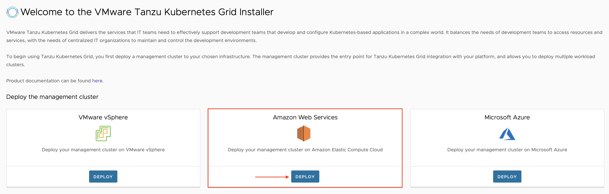

3. **IaaS Provider**: Fill out the **AWS Credentials Profile** you want to use to authenticate to AWS, and the **Region** you want your management cluster deployed to. Then click **Connect**.
    
    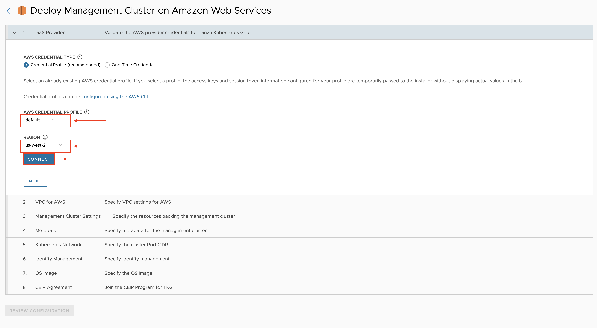
    
    If the **Connect** button switches to **Connected**, then your credentials were authenticated and you can click **Next**.

4. **VPC for AWS**: For your purposes of creating an environment meant for learning, and not for a production deployment, you can leave this section as default. Click **Next**.
    
    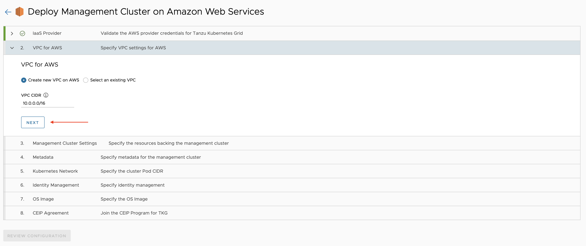

5. **Management Cluster Settings**: Fill out the following fields on this screen:
   1. Select **Development** as the cluster type.
   2. Select an EC2 **Instance Type** for the control plane nodes. I am using `m4.large`, but you can use other types if you want.
   3. Set a **Management Cluster Name**. This is optional and can be anything you want. It will be used in the kubectl config file. 
   4. Set the **EC2 Key Pair**. This should have been set up in the [prerequisites](#prerequisites) section of this guide. Just put the reference name here.
   5. Select an **Availability Zone**. Any AZ in your configured region is fine.
   6. Set a **Worker Node Instance Type**. Similar to the control plane instance type, I am using m4.large again, just for simplicity. 
   7. When all of these are set, click **Next**.

    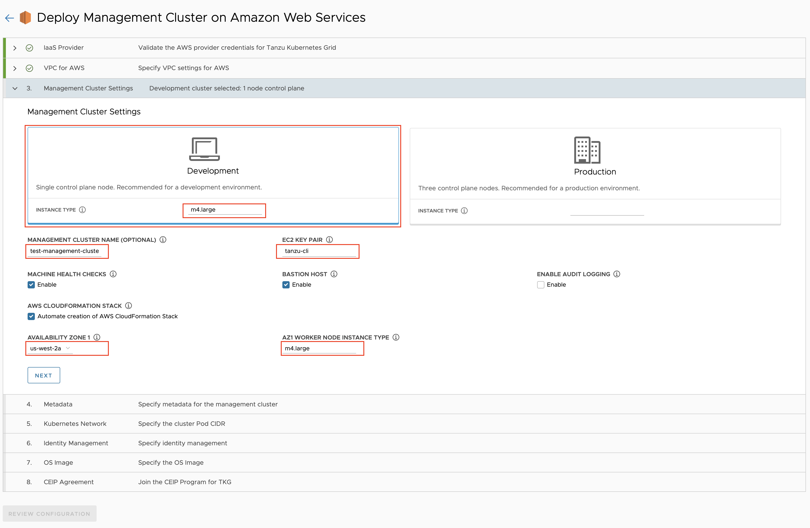

6. **Metadata**: This section is for adding metadata to your cluster, which would be helpful in organizing it against other management and workload clusters. Since this is a very small test environment, this can be left blank. Click **Next**.

    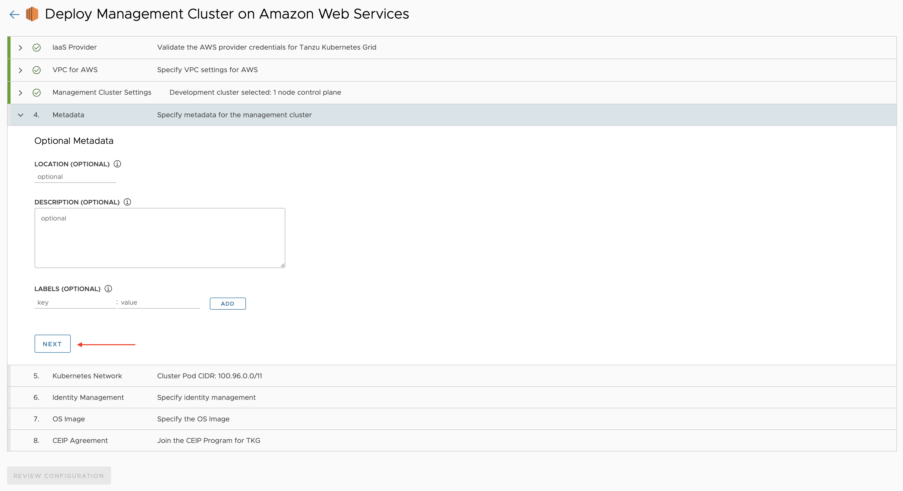

7. **Kubernetes Network**: This section will allow you to customize the management cluster network settings. Again, since this is a small test environment, this can be left as default. Click **Next**.

    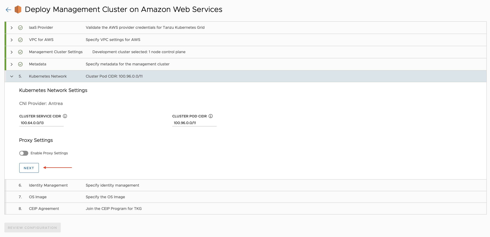

8. **Identity Management**: Disable Identity Management Settings. Setting up an identity provider is outside the scope of this guide. For our purposes, this is a reasonably safe setting. However, do not disable this in a production scenario. Click **Next**. 

    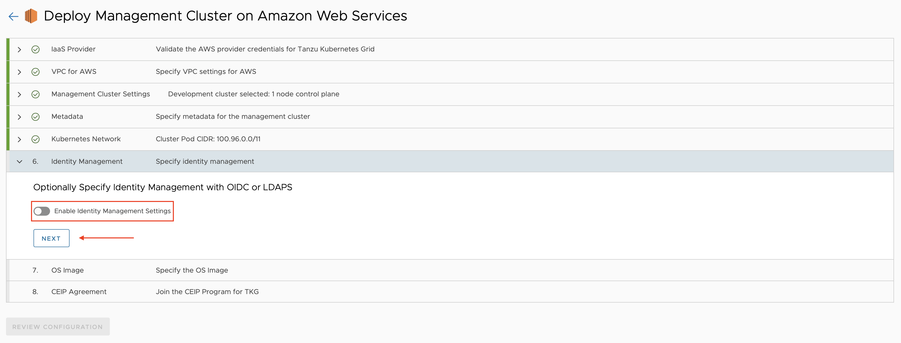

9. **OS Image**: Select an operating system image type. I am using Amazon AMI, but Ubuntu will work fine too. 

    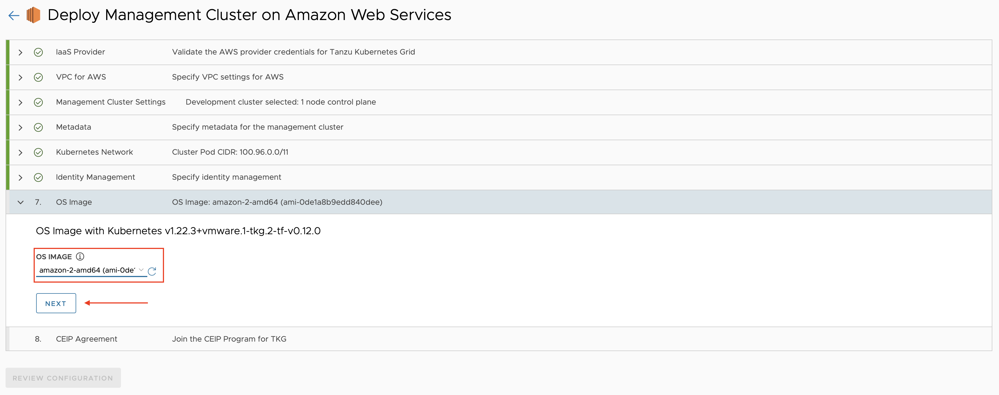

10. **CEIP Agreement**: If you would like to participate in VMware's Customer Experience Improvement Plan (CEIP), simply click **Next**. Otherwise you can opt out before proceeding. 

    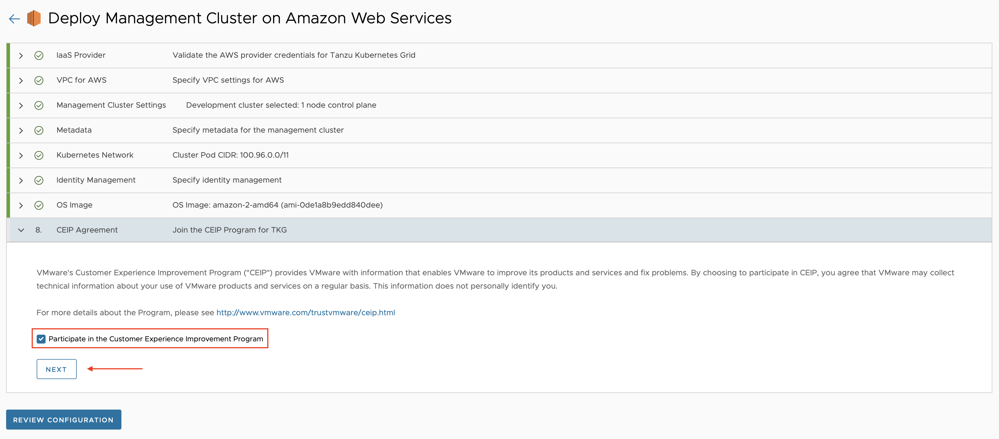

11. Click **Review Configuration**.

    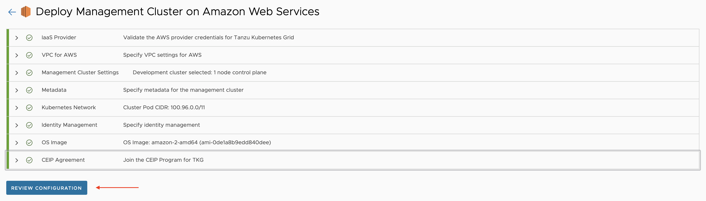

12. Review your configuration. At the bottom of the screen, take note of the CLI command and the location of the YAML template. This is the template generated by the configuration UI. To repeat this deployment, you just need to deploy against this template. When you are ready, click **Deploy Management Cluster**.

    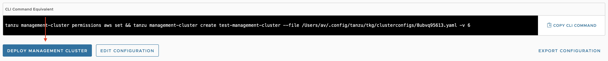

    There will be logs streaming in the UI, as well as in the terminal window where you originally ran the `create` command. This will take some time. Somewhere around 20 minutes is expected. 

13. List your `kubectl` contexts, and connect to your workload cluster.

    ```sh
    kubectl config get-contexts
    ```
    
    ```sh
    kubectl config use-context <context-name>
    ```

    You can now explore your management cluster using kubectl commands. List the namespaces, explore services, etc. Do not make any permanent changes, but otherwise familiarize yourself with what has been deployed. 

## Creating a workload cluster

You can now create your workload cluster. Much of the configuration for this cluster will use the same configuration as your workload cluster, unless you override the configuration options. 

You can use the configuration file created from your workload cluster as a starting point. Since this is a known good-working file, it makes sense to start here.  

1. Find the name of the configuration file created. 

    ```sh
    ls ~/.config/tanzu/tkg/clusterconfigs 
    ```

    Example output:

    ```sh
    6oboxfbzg3.yaml
    ```

2. Copy this file into a new file you can edit for your workload cluster.

    ```sh
    cp <file-name.yaml> test-workload-cluster-config.yaml
    ```

3. Open the config file and edit it as necessary. At a minimum **you will need to delete the line with `CLUSTER_NAME`. You will set this later in the CLI command. Modify other options as desired. Optional and common configuration options to change are highlighted in the file.

    ```sh
    code ~/.config/tanzu/tkg/clusterconfigs/test-workload-cluster-config.yaml
    ```

4. Create the workload cluster. The `-v 9` flag sets a very high verbosity on the streaming logs so you can see what is happening.

    ```sh
    tanzu cluster create test-workload-cluster -f ~/.config/tanzu/tkg/clusterconfigs test-workload-cluster-config.yaml -v 9
    ```

    This will begin the process of creating your workload cluster. This will take a few minutes to complete.

5. Pull the kubeconfig context from the cluster. This command will allow you admin access to the cluster.

    ```sh
    tanzu cluster kubeconfig get test-workload-cluster --admin
    ```

6. List your kubeconfig contexts and use the correct one for your new workload cluster.

    ```sh
    kubectl config get-contexts
    ```

    ```sh
    kubectl config use-context <context-name>
    ```

7. Verify the cluster health by pulling some cluster details.

    ```sh
    tanzu cluster get test-workload-cluster -v 1
    ```

    Example Output:
    ```sh
    NAME                   NAMESPACE  STATUS   CONTROLPLANE  WORKERS  KUBERNETES        ROLES
    test-workload-cluster  default    running  1/1           1/1      v1.22.3+vmware.1  <none>

    Details:

    NAME                                                                      READY  SEVERITY  REASON  SINCE  MESSAGE
    /test-workload-cluster                                                    True                     63m
    ├─ClusterInfrastructure - AWSCluster/test-workload-cluster                True                     65m
    ├─ControlPlane - KubeadmControlPlane/test-workload-cluster-control-plane  True                     63m
    │ └─Machine/test-workload-cluster-control-plane-229pb                     True                     65m
    └─Workers
        └─MachineDeployment/test-workload-cluster-md-0                        True                     61m
            └─Machine/test-workload-cluster-md-0-558f7bf676-xw22s             True                     63m
    ```

    Here you can see various, high-level information about your cluster, including the Kubernetes version and the status of your infrastructure. 

	Again, like your management cluster, familiarize yourself with what has been deployed by default on your cluster. 

## Optional: Cleaning up

If you intend to use these clusters for further learning, do not perform these steps. However, once you are done, it is a good idea to clean up your infrastructure. The following commands will delete the workload and management clusters you just provisioned. 

If you simply want to reset your workload cluster by deleting and redeploying, this is also a good section to follow. Just delete the workload cluster and redeploy using the [Creating a workload cluster](#creating-a-workload-cluster) section above.

1. Delete the workload cluster.

    ```sh
    tanzu cluster delete test-workload-cluster
    ```

2. Delete the management cluster.

    ```sh
    tanzu management-cluster delete test-management-cluster
    ```
    
## Next steps

There are many other management functions you can familiarize yourself with. Try running `tanzu cluster --help` to get an idea of what is possible, and start exploring.

Next, try out installing VMware Tanzu Application Platform on top of your workload cluster as part of your development environment. 
* [Getting Started with VMware Tanzu Application Platform `dev` Profile](/guides/tanzu-application-platform-gs) - This guide will introduce Tanzu Application Platform and walk you through installing it on top of your workload cluster. This will later be used to create your Tanzu development environment. 

